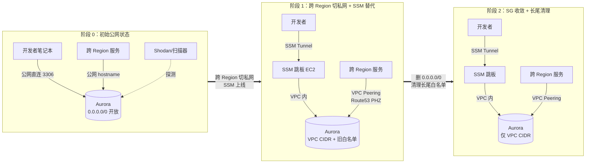
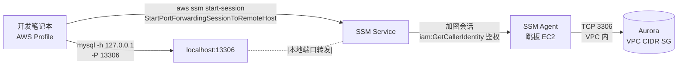

> **元信息**
> - 适用规模：10-200 人团队、单 Region 或多 Region AWS 部署
> - 适用云：AWS（阿里云 RDS 思路相似但 SG 模型不同）
> - 运维负担：实施期 3-5 个工作日，长期维护极轻
> - 月成本：增量约 $0（VPC Peering 跨 AZ 流量、SSM 跳板机微量开销）
> - 最后验证：2026-04-30，AWS CLI 2.17 + Aurora MySQL 8.0 + SSM Plugin 1.2.553

## 适用场景

满足以下任意两条，建议按本 Playbook 推进：

- Aurora/RDS Security Group 存在 `0.0.0.0/0` 全协议或全 3306 端口规则
- SG 上存在来源不明的 IP `/32` 白名单（多年累积、无人维护）
- 跨 Region 业务通过公网 hostname 直连数据库
- 团队既要关公网入口又要保留开发者本地调试能力
- 已经吃过一次安全审计的批评，但担心动手会打断业务

不适用场景见文末「局限」一节。

## 核心问题

公网暴露的 Aurora 在生产环境实际形态通常是「三层叠加」，比单纯一条 `0.0.0.0/0` 更难处理：

1. **全协议公网开放**：SG 入站存在 `protocol -1, source 0.0.0.0/0`，意味着不只是 3306，而是所有端口对任意来源放开。Shodan、Censys 这类公网扫描器会把它收录，定期被探针扫到留下 RDS 实例的版本指纹和元数据。
2. **来源不明的 IP 白名单**：常见一两条 `47.x.x.x/32` 或 `139.x.x.x/32` 这样的规则，可能是某次本地调试加的，可能是已经离职同事的家庭宽带，也可能是某家第三方服务（实际遇到过 Linode 主机房 IP 段）。这类规则在公网开放期间被淹没在背景流量里，关公网后才会显现。
3. **跨 Region 业务依赖公网 hostname**：例如 ap-southeast-1 的某服务在 Nacos 里直接用 `prod-aurora.example.aws.com` 连 us-west-2 的主库。一旦关公网，这条链路立刻断。

为什么这个状态长期存在？因为单看任何一条规则，删掉都"可能影响某个东西"，于是大家都不动。久而久之责任分散，最终没人能回答"我可以删 `0.0.0.0/0` 吗"这种问题。安全审计来一次发一份整改通知，团队加个 ticket 进 backlog，然后下个季度继续推迟。突破口是用证据替代猜测——把"我不知道有谁在用"变成"Flow Logs 三周内来自公网的入流量是哪几个 IP，每个 IP 我能不能找到归属"。一旦把流量画像摆在桌面上，决策的成本就从"赌一次业务停机"降到"按清单一项项处理"。

期望状态：

- SG 入站只允许同 Region VPC CIDR 和已建立 Peering 的 VPC CIDR
- 跨 Region 业务走 VPC Peering + Private Hosted Zone（PHZ），从配置上根本无法触达公网入口
- 开发者本地工具仍能在受控前提下访问 prod 数据库
- 所有访问可审计（CloudTrail StartSession 事件）、权限可回收（IAM Group 单条命令）
- 收紧动作可以在不出现明显业务停机的前提下推进

## 方案对比

讨论过三个方向，最终选定第三个并预留向更彻底方案演进的空间。

### 方案 A：维持公网 + 收紧 IP 白名单

保留 Aurora 公网，把 `0.0.0.0/0` 替换为办公网络 CIDR、VPN 出口 IP、若干开发者家宽 IP。

- **适用**：团队 5 人以下、办公地点固定、无远程办公
- **淘汰理由**：远程 + 居家办公 IP 漂移频繁，白名单维护工作量爆炸；Aurora 公网入口仍是攻击面，被 Shodan 持续扫描；不解决跨 Region 服务依赖公网 hostname 的问题

### 方案 B：架设 VPN 集中接入

部署 AWS Client VPN 或 OpenVPN/WireGuard，所有开发者先连 VPN 再访问数据库。

- **适用**：单 Region、单云、团队稳定的中型公司
- **淘汰理由**：AWS Client VPN 按连接小时收费，30 人月成本就到 ¥12k 量级；自建 VPN 单点故障重；多 Region 多云场景下 VPN 网关数量翻倍

### 方案 C：渐进式收紧 + 零信任 mesh（选定）

分阶段推进：

1. 先把跨 Region 服务从公网 hostname 切到 VPC Peering + 私有 DNS
2. 给开发者准备 SSM Port Forwarding 作为公网替代
3. 原子切换 SG 规则（先加白后删开放）
4. 清理长尾 IP 白名单
5. 中长期推 Headscale/Tailscale mesh，把 SSM 也淘汰掉

每一步都可独立验证、可独立回滚；前四步全是 AWS 原生能力，不引入新依赖；mesh 单独是另一个 Playbook（见文末「后续演进」），收紧本身不依赖 mesh 落地。这种"先用原生能力跑通，再考虑引入 mesh"的顺序很关键——如果一上来就推 mesh，会同时背两个变更：网络架构变 + 开发者工作流变，任何一个出问题都会被怀疑到对方，排查成本翻倍。

整个推进周期短则 3-5 个工作日（跨 Region 依赖少、开发者群体熟悉 AWS CLI），长则 2-3 周（多团队协调、多个跨 Region 链路梳理）。本 Playbook 给出的是技术路径，组织协调时间需要按团队规模额外预留。

## 推荐架构

收紧过程中存在三个有意义的阶段，每个阶段都能稳定运行。



开发者侧数据流：



关键决策点：

- **阶段 1 是稳定可运行的过渡态**，可以在这里停留几周观察业务表现，不必赶着进阶段 2
- **跨 Region 服务的切换必须先做**，因为它对业务有真实影响；SG 规则收敛是后置动作
- **SSM 通道能力先到位**，避免删 SG 之后才发现开发者本地工具全部失联

## 实施步骤

### 第 1 步：现状审计 — 谁在用公网入口

这一步的产出是一份"作业清单"：哪些 SG 含 `0.0.0.0/0`、哪些 IP 在持续访问、哪些业务配置在用公网域名。后面所有动作都基于这份清单。审计一定要早做，因为 Flow Logs 至少要积攒 7 天数据才有代表性，CloudTrail 默认只保留 90 天，再晚就拿不到完整证据链。

#### 1.1 枚举所有 RDS/Aurora 实例及其 SG

**前置要求**：

- AWS CLI v2.17+ 已配置好凭据
- 当前 IAM 用户有 `rds:DescribeDBInstances`、`rds:DescribeDBClusters`、`ec2:DescribeSecurityGroups`、`ec2:DescribeSecurityGroupRules` 权限
- 已装 `jq`（`apt install -y jq` / `brew install jq`）

**执行**：

```bash
#!/bin/bash
# audit-rds-sg.sh - 枚举指定 region 所有 RDS/Aurora 及其 SG 入站规则
# 用法：./audit-rds-sg.sh <region>
# 示例：./audit-rds-sg.sh us-west-2

set -euo pipefail

REGION="${1:-us-west-2}"
OUT_DIR="./audit-${REGION}-$(date +%Y%m%d)"
mkdir -p "$OUT_DIR"

command -v aws >/dev/null || { echo "需要 aws cli"; exit 1; }
command -v jq  >/dev/null || { echo "需要 jq"; exit 1; }

echo "[1/3] 列出所有 RDS DB instance ..."
aws rds describe-db-instances --region "$REGION" \
  --query 'DBInstances[].{
    id:DBInstanceIdentifier,
    engine:Engine,
    publicly:PubliclyAccessible,
    endpoint:Endpoint.Address,
    sgs:VpcSecurityGroups[].VpcSecurityGroupId
  }' --output json > "$OUT_DIR/rds-instances.json"

echo "[2/3] 列出所有 Aurora cluster ..."
aws rds describe-db-clusters --region "$REGION" \
  --query 'DBClusters[].{
    id:DBClusterIdentifier,
    engine:Engine,
    endpoint:Endpoint,
    reader:ReaderEndpoint,
    sgs:VpcSecurityGroups[].VpcSecurityGroupId
  }' --output json > "$OUT_DIR/aurora-clusters.json"

echo "[3/3] 抽取所有 SG 并 dump 入站规则 ..."
jq -r '.[].sgs[]' "$OUT_DIR/rds-instances.json" "$OUT_DIR/aurora-clusters.json" \
  | sort -u > "$OUT_DIR/sg-list.txt"

while read -r SG; do
  [[ -z "$SG" ]] && continue
  aws ec2 describe-security-groups --group-ids "$SG" --region "$REGION" \
    --query 'SecurityGroups[0].IpPermissions' --output json \
    > "$OUT_DIR/${SG}.json"
done < "$OUT_DIR/sg-list.txt"

echo
echo "==== 含 0.0.0.0/0 的 SG ===="
for f in "$OUT_DIR"/sg-*.json; do
  SG=$(basename "$f" .json)
  if jq -e '.[] | select(.IpRanges[]?.CidrIp=="0.0.0.0/0")' "$f" >/dev/null 2>&1; then
    echo "  [!] $SG"
  fi
done

echo
echo "完成。结果在 $OUT_DIR/"
```

**期望输出**：

```text
[1/3] 列出所有 RDS DB instance ...
[2/3] 列出所有 Aurora cluster ...
[3/3] 抽取所有 SG 并 dump 入站规则 ...

==== 含 0.0.0.0/0 的 SG ====
  [!] sg-xxxxxxxxxxxxx
  [!] sg-yyyyyyyyyyyyy

完成。结果在 ./audit-us-west-2-20260430/
```

**验证**：人工 review `audit-*/sg-*.json`，确认每条 IpPermission 都有 description 且能识别归属。重点看三类规则：`CidrIp == "0.0.0.0/0"`（直接公网开放）、`/32` 单 IP（多半是历史遗留）、`UserIdGroupPairs`（SG 引用 SG，相对安全但要看引用方是不是也对外开放）。

**回滚**：审计脚本只读，无需回滚。

#### 1.2 启用 VPC Flow Logs 并查 Athena

Flow Logs 的价值在于"证据"。SG 上一条 `47.x.x.x/32` 规则，看 description 可能写的是"开发调试"，但只有 Flow Logs 能告诉你这条规则过去 30 天到底有没有真实流量、流量是稀疏还是密集、是不是固定时间段。没流量的规则可以直接进"待清理"清单，有稀疏流量的进入下一步排查归属，有密集流量的优先沟通。

**前置要求**：

- 该 VPC 已开 Flow Logs 并存到 S3（如果没开，先开 7 天再回来）
- Athena 工作组已建好，对应 Glue table 已创建（参考 [AWS 官方模板](https://docs.aws.amazon.com/vpc/latest/userguide/flow-logs-athena.html)）
- 当前用户有 `athena:StartQueryExecution`

**开 Flow Logs**：

```bash
aws ec2 create-flow-logs \
  --resource-type VPC --resource-ids vpc-xxxxxxxxxxxxx \
  --traffic-type ACCEPT --log-destination-type s3 \
  --log-destination arn:aws:s3:::my-flow-logs-bucket/prod-vpc/ \
  --max-aggregation-interval 60 \
  --region us-west-2
```

**Athena 查询模板**：

```sql
-- 假设 Aurora 私有 IP 是 10.3.32.150，prod VPC CIDR 是 10.3.0.0/18
-- 找 7 天内来自 VPC 外的访问
SELECT
  srcaddr,
  COUNT(*) AS pkts,
  SUM(bytes) AS total_bytes,
  MIN(from_unixtime(start)) AS first_seen,
  MAX(from_unixtime("end"))  AS last_seen
FROM vpc_flow_logs
WHERE date >= date_format(date_add('day', -7, current_date), '%Y/%m/%d')
  AND dstaddr = '10.3.32.150'
  AND dstport IN (3306, 5432)
  AND action  = 'ACCEPT'
  AND NOT regexp_like(srcaddr, '^10\.3\.|^10\.2\.|^10\.52\.')
GROUP BY srcaddr
ORDER BY pkts DESC
LIMIT 50;
```

**期望输出**（CSV 示例）：

```text
srcaddr         pkts    total_bytes  first_seen           last_seen
139.x.x.x       18432   2841029      2026-04-23 02:11     2026-04-29 23:48
47.x.x.x        9214    1102881      2026-04-23 09:01     2026-04-29 22:30
44.238.x.x      512      65300       2026-04-28 14:22     2026-04-29 18:11
```

**验证**：所有 srcaddr 都能反查到归属（`whois`、ASN 反查、CMDB），不能解释的 IP 进"待清理"清单。

**回滚**：Flow Logs 是只读旁路，可保留长期使用；如需删除：

```bash
aws ec2 delete-flow-logs --flow-log-ids fl-xxxxxxxxxxxxx --region us-west-2
```

#### 1.3 CloudTrail 反查 SG 规则历史

**执行**：

```bash
#!/bin/bash
# sg-history.sh - 找 SG 上每条 ingress 规则的添加时间和操作人
# 用法：./sg-history.sh <sg-id> <region>

set -euo pipefail
SG="${1:?用法: $0 <sg-id> <region>}"
REGION="${2:-us-west-2}"

aws cloudtrail lookup-events \
  --region "$REGION" \
  --lookup-attributes AttributeKey=ResourceName,AttributeValue="$SG" \
  --max-results 50 \
  --query 'Events[?EventName==`AuthorizeSecurityGroupIngress` || EventName==`RevokeSecurityGroupIngress`].{
    Time:EventTime,
    User:Username,
    Event:EventName,
    Source:SourceIPAddress
  }' --output table
```

**期望输出**：

```text
-----------------------------------------------------------------------------
|                              LookupEvents                                 |
+---------------------+-----------+--------------------------+--------------+
|  Time               |  User     |  Event                   |  Source      |
+---------------------+-----------+--------------------------+--------------+
|  2024-09-12T03:11Z  |  alice    |  AuthorizeSecurityGroupI |  AWS CLI     |
|  2025-01-08T08:42Z  |  former-x |  AuthorizeSecurityGroupI |  Console     |
+---------------------+-----------+--------------------------+--------------+
```

**注意**：CloudTrail 默认保留 90 天，更早的需要查 S3 归档。

#### 1.4 业务配置反查 — 找出依赖公网 hostname 的服务

**执行**（Nacos 全量 dump 后 grep）：

```bash
#!/bin/bash
# find-aurora-deps.sh - 在导出的 Nacos / K8s Secret 中找连 Aurora 的服务
# 前置：先把目标命名空间所有配置导出到本地（Nacos OpenAPI 或 nacos-cli）
# 用法：./find-aurora-deps.sh <配置目录> <数据库 hostname 关键字>

set -euo pipefail
DIR="${1:?用法: $0 <dir> <keyword>}"
KEY="${2:-rds.amazonaws.com}"

[[ -d "$DIR" ]] || { echo "目录不存在: $DIR"; exit 1; }

echo "==== 配置文件命中清单 ===="
grep -rEl "$KEY" "$DIR" 2>/dev/null \
  | sort -u \
  | tee /tmp/aurora-deps.txt

echo
echo "==== 命中行（脱敏前）===="
grep -rE "$KEY" "$DIR" 2>/dev/null \
  | sed 's/password=[^&[:space:]]*/password=***/g'

echo
echo "==== 涉及的 dataId 数量：$(wc -l < /tmp/aurora-deps.txt) ===="
```

**K8s Secret 扫描脚本**（找哪些 Secret 含 Aurora 凭据）：

```bash
#!/bin/bash
# scan-k8s-aurora-secrets.sh
# 用法：./scan-k8s-aurora-secrets.sh <kubeconfig context>

set -euo pipefail
CTX="${1:?用法: $0 <context>}"
KEY="rds.amazonaws.com"

command -v kubectl >/dev/null || { echo "需要 kubectl"; exit 1; }
command -v jq      >/dev/null || { echo "需要 jq"; exit 1; }

echo "Scanning context=$CTX, keyword=$KEY ..."
kubectl --context "$CTX" get secret -A -o json \
  | jq -r --arg key "$KEY" '
      .items[]
      | . as $s
      | (.data // {}) | to_entries[]
      | .value as $v
      | ($v | @base64d) as $decoded
      | select($decoded | test($key))
      | "\($s.metadata.namespace)/\($s.metadata.name)\t\(.key)"
    ' 2>/dev/null | sort -u
```

**期望输出**：

```text
ns-foo/db-secret           connection-string
ns-bar/app-config          DATABASE_URL
ns-baz/legacy-secret       MYSQL_HOST
```

**验证**：清单中每条 ns/secret 都要找到对应业务负责人，输出"作业清单"准备改 host。

**回滚**：本步是只读扫描，无需回滚。

---

### 第 2 步：跨 Region 业务切 VPC Peering + Route53 PHZ

风险最高的一步，必须先做并稳定运行 1-2 天。这一步出事会直接打断业务，所以执行前要把回滚命令写好放在剪贴板里，每一个子步骤完成立刻验证，不要一口气跑完再统一检查。

为什么不直接用 Aurora 的 cluster endpoint hostname？因为 cluster endpoint 是公网域名，从 Peering 对端 VPC 解析它会拿到公网 IP，走公网路由出去再回来，绕一大圈还吃跨境流量费。Route53 PHZ 把同一个域名（或者你自定义的内部域名）解析到 Aurora 的私有 IP，配合 VPC Peering 的路由表，流量就走 AWS 骨干网内网了。

#### 2.1 建立 VPC Peering

**前置要求**：

- 两侧 VPC CIDR 不冲突（例如 us-west-2 prod `10.3.0.0/18`，ap-southeast-1 pre `10.x.0.0/16`）
- 当前用户在两个 Region 都有 `ec2:CreateVpcPeeringConnection`、`ec2:AcceptVpcPeeringConnection`、`ec2:CreateRoute`

**执行**：

```bash
#!/bin/bash
# create-peering.sh - 创建跨 Region VPC Peering 并等待 active
set -euo pipefail

REQ_VPC="vpc-xxxxxxxxxxxxx"     # us-west-2 prod
REQ_REGION="us-west-2"
ACC_VPC="vpc-yyyyyyyyyyyyy"     # ap-southeast-1 pre
ACC_REGION="ap-southeast-1"
ACC_ACCOUNT="<ACCOUNT_ID>"

echo "[1/4] 创建 Peering 请求 ..."
PCX=$(aws ec2 create-vpc-peering-connection \
  --vpc-id "$REQ_VPC" \
  --peer-vpc-id "$ACC_VPC" \
  --peer-region "$ACC_REGION" \
  --peer-owner-id "$ACC_ACCOUNT" \
  --region "$REQ_REGION" \
  --query 'VpcPeeringConnection.VpcPeeringConnectionId' --output text)
echo "  PCX=$PCX"

echo "[2/4] 等待对端进入 pending-acceptance ..."
for i in {1..30}; do
  STATUS=$(aws ec2 describe-vpc-peering-connections \
    --vpc-peering-connection-ids "$PCX" \
    --region "$ACC_REGION" \
    --query 'VpcPeeringConnections[0].Status.Code' --output text 2>/dev/null || echo "")
  [[ "$STATUS" == "pending-acceptance" ]] && break
  sleep 2
done
echo "  status=$STATUS"

echo "[3/4] 接受 Peering ..."
aws ec2 accept-vpc-peering-connection \
  --vpc-peering-connection-id "$PCX" \
  --region "$ACC_REGION" >/dev/null

echo "[4/4] 等待 active ..."
until [[ "$(aws ec2 describe-vpc-peering-connections \
  --vpc-peering-connection-ids "$PCX" --region "$REQ_REGION" \
  --query 'VpcPeeringConnections[0].Status.Code' --output text)" == "active" ]]; do
  sleep 2
done
echo "  Peering active: $PCX"

echo
echo "现在两侧路由表加路由（手动确认 RTB ID）："
echo "  aws ec2 create-route --route-table-id <RTB-A> --destination-cidr-block 10.x.0.0/16 \\"
echo "    --vpc-peering-connection-id $PCX --region $REQ_REGION"
echo "  aws ec2 create-route --route-table-id <RTB-B> --destination-cidr-block 10.3.0.0/18 \\"
echo "    --vpc-peering-connection-id $PCX --region $ACC_REGION"
```

**验证**：从 Peering 对端 VPC 内的 EC2 上 `ping <Aurora 私有 IP>` 应该能通（除非 SG 还没加白）。

**回滚**：

```bash
aws ec2 delete-vpc-peering-connection \
  --vpc-peering-connection-id <PCX> \
  --region us-west-2
```

#### 2.2 建 Private Hosted Zone 并加 A 记录

**获取 Aurora 私有 IP**：cluster endpoint 是 hostname，要从 VPC 内做 DNS 解析才能拿到私有 IP。

```bash
# 进 prod VPC 的 SSM 跳板（见第 3 步）执行
dig +short prod-aurora.example.aws.com
# 期望输出：10.3.32.150
```

**创建 PHZ + A 记录**：

```bash
#!/bin/bash
# setup-phz.sh - 在 ap-southeast-1 创建 PHZ 并指向 us-west-2 Aurora 私有 IP
set -euo pipefail

ZONE_NAME="rds.internal"
PEER_VPC="vpc-yyyyyyyyyyyyy"
PEER_REGION="ap-southeast-1"
RECORD_NAME="aurora-prod.rds.internal"
AURORA_PRIVATE_IP="10.3.32.150"

echo "[1/3] 创建 PHZ ..."
HZ_ID=$(aws route53 create-hosted-zone \
  --name "$ZONE_NAME" \
  --vpc "VPCRegion=$PEER_REGION,VPCId=$PEER_VPC" \
  --hosted-zone-config "Comment=cross-region aurora,PrivateZone=true" \
  --caller-reference "$(date +%s)" \
  --query 'HostedZone.Id' --output text | sed 's|/hostedzone/||')
echo "  HZ_ID=$HZ_ID"

echo "[2/3] 加 A 记录 ..."
cat > /tmp/rrset.json <<EOF
{
  "Changes": [{
    "Action": "CREATE",
    "ResourceRecordSet": {
      "Name": "$RECORD_NAME",
      "Type": "A",
      "TTL": 60,
      "ResourceRecords": [{"Value": "$AURORA_PRIVATE_IP"}]
    }
  }]
}
EOF
aws route53 change-resource-record-sets \
  --hosted-zone-id "$HZ_ID" \
  --change-batch file:///tmp/rrset.json >/dev/null

echo "[3/3] 关联其他 VPC（如 staging/qa）..."
echo "  aws route53 associate-vpc-with-hosted-zone --hosted-zone-id $HZ_ID \\"
echo "    --vpc VPCRegion=ap-southeast-1,VPCId=<other-vpc-id>"
```

**Aurora 故障切换的处理**：cluster endpoint 在故障切换时会指向新 writer，私有 IP 会变。两个做法：

- **短期**：人工监控 + Lambda 触发更新 PHZ A 记录（CloudWatch Event 监听 `RDS-EVENT-0006` failover 事件）
- **长期**：在 VPC 内跑一个 unbound/CoreDNS 转发 `*.rds.amazonaws.com` 解析到 VPC resolver，使用真实 cluster endpoint hostname

本次落地 Aurora 故障切换频率极低，先采用短期方案。

**验证**：

```bash
# 在 ap-southeast-1 VPC 的 EC2 上
dig +short aurora-prod.rds.internal
# 期望：10.3.32.150
```

**回滚**：

```bash
aws route53 change-resource-record-sets --hosted-zone-id "$HZ_ID" \
  --change-batch '{"Changes":[{"Action":"DELETE","ResourceRecordSet":{...}}]}'
aws route53 delete-hosted-zone --id "$HZ_ID"
```

#### 2.3 Aurora SG 加 Peering 端 CIDR 白名单

```bash
aws ec2 authorize-security-group-ingress \
  --group-id sg-xxxxxxxxxxxxx \
  --protocol tcp --port 3306 \
  --cidr 10.x.0.0/16 \
  --region us-west-2 \
  --tag-specifications 'ResourceType=security-group-rule,Tags=[{Key=owner,Value=infra},{Key=ticket,Value=SEC-2026-04-30}]'
```

#### 2.4 批量改业务配置（Nacos）

**Python 脚本，含 dry-run 和 rollback**：

```python
#!/usr/bin/env python3
# nacos-host-rewrite.py - 批量替换 Nacos 配置中的 Aurora hostname
# 前置：pip install nacos-sdk-python>=2.0
# 用法：
#   python3 nacos-host-rewrite.py --dry-run
#   python3 nacos-host-rewrite.py --apply
#   python3 nacos-host-rewrite.py --rollback ./backup-20260430.json

import argparse, json, os, re, sys, time
from pathlib import Path
import nacos

NACOS_SERVER  = os.environ["NACOS_SERVER"]   # mse-xxx.nacos-ans.mse.aliyuncs.com:8848
NACOS_NS      = os.environ["NACOS_NS"]       # us-prod namespace id
NACOS_USER    = os.environ["NACOS_USER"]
NACOS_PASS    = os.environ["NACOS_PASS"]

OLD_HOST = "prod-aurora.example.aws.com"
NEW_HOST = "aurora-prod.rds.internal"

def list_all_configs(client):
    items, page = [], 1
    while True:
        resp = client.get_configs(page_no=page, page_size=200, no_snapshot=True)
        items.extend(resp.get("pageItems", []))
        if page * 200 >= resp.get("totalCount", 0):
            break
        page += 1
    return items

def main():
    p = argparse.ArgumentParser()
    g = p.add_mutually_exclusive_group(required=True)
    g.add_argument("--dry-run", action="store_true")
    g.add_argument("--apply",   action="store_true")
    g.add_argument("--rollback", metavar="BACKUP.json")
    args = p.parse_args()

    client = nacos.NacosClient(
        NACOS_SERVER, namespace=NACOS_NS,
        username=NACOS_USER, password=NACOS_PASS,
    )

    if args.rollback:
        backup = json.loads(Path(args.rollback).read_text())
        for it in backup:
            print(f"[rollback] {it['group']}/{it['dataId']}")
            client.publish_config(it["dataId"], it["group"], it["content"])
        return

    matched = []
    for it in list_all_configs(client):
        content = client.get_config(it["dataId"], it["group"], no_snapshot=True) or ""
        if OLD_HOST in content:
            matched.append({**it, "content": content})

    print(f"匹配到 {len(matched)} 条配置含 {OLD_HOST}")
    for m in matched:
        print(f"  - {m['group']}/{m['dataId']}")

    if args.dry_run:
        return

    backup_path = f"./backup-{time.strftime('%Y%m%d-%H%M%S')}.json"
    Path(backup_path).write_text(json.dumps(matched, ensure_ascii=False, indent=2))
    print(f"\n备份已写入 {backup_path}")
    confirm = input("\n确认替换？输入 YES 回车继续：")
    if confirm != "YES":
        sys.exit(1)

    for m in matched:
        new_content = m["content"].replace(OLD_HOST, NEW_HOST)
        ok = client.publish_config(m["dataId"], m["group"], new_content)
        print(f"  [{'OK' if ok else 'FAIL'}] {m['group']}/{m['dataId']}")

if __name__ == "__main__":
    main()
```

**执行流程**：

```bash
# 1. 先 dry-run
python3 nacos-host-rewrite.py --dry-run
# 输出：匹配到 4 条配置含 prod-aurora.example.aws.com

# 2. 实际替换（会写备份并提示输入 YES）
python3 nacos-host-rewrite.py --apply

# 3. rollout 业务 Pod，看日志
kubectl --context prod rollout restart deploy/service-foo -n ap-pre
kubectl --context prod logs -f deploy/service-foo -n ap-pre | grep -i "mysql connected\|host="
# 期望看到：MySQL connected to host: aurora-prod.rds.internal

# 4. 出问题立刻回滚
python3 nacos-host-rewrite.py --rollback ./backup-20260430-153022.json
```

**验证**：

```bash
# 在跨 Region 服务的 Pod 内
kubectl --context prod -n ap-pre exec -it deploy/service-foo -- sh -c \
  'getent hosts aurora-prod.rds.internal && nc -vz aurora-prod.rds.internal 3306'
# 期望：10.3.32.150 + Connection succeeded
```

观察 1-2 天，确认无连接抖动后进入下一步。这一步切完，公网 hostname 仍可达（SG 还没改），如果有遗漏的跨 Region 服务，它仍能正常工作，给了一个隐性的兜底窗口。这个兜底很重要——审计阶段再仔细，也总有可能遗漏一两个偏门的批处理任务、夜间脚本、第三方 webhook 回调。把它们留到这个阶段被动暴露出来，比在 SG 收紧后再面对"线上事故 + 紧急回滚"的双重压力强得多。

具体观察哪些指标：

- Aurora `DatabaseConnections` 指标曲线无异常下降（可能反映新链路连不上）
- Aurora `Aborted_connections` / `Aborted_clients` 状态变量无突增（连接握手失败）
- 跨 Region 服务的 Pod 日志中持续出现新 host 解析成功记录
- 应用层错误率（5xx）和数据库相关 panic 关键词无明显波动

---

### 第 3 步：开发者 SSM Port Forwarding 替代方案

让 `mysql -h prod-aurora.example.aws.com` 的工作流变成 `mysql -h 127.0.0.1 -P 13306`，背后透明地走 SSM 隧道。

为什么选 SSM Port Forwarding 而不是 SSH bastion？三个原因：第一，SSM 不需要在跳板机上开 22 端口，跳板机本身可以保持 SG 入站全关，攻击面更小；第二，权限边界从 SSH key 转移到 IAM，离职回收只需一条命令、不需要去机器上删 key；第三，所有会话有 CloudTrail 审计记录（谁在什么时候打开了哪个端口转发），SSH 这层做不到。代价是增加一个 AWS 依赖、在跨云场景下不通用，但短期看完全可以接受。

#### 3.1 准备 SSM 跳板 EC2

**前置要求**：

- prod VPC 内有一个 EC2 实例可用作跳板（或新建 t4g.nano）
- 实例 IAM Role 含 `AmazonSSMManagedInstanceCore` 托管策略
- 实例 SG 出向允许到 Aurora 3306

**最小跳板 IAM Role**：

```json
{
  "Version": "2012-10-17",
  "Statement": [
    {
      "Sid": "SSMCoreManaged",
      "Effect": "Allow",
      "Action": [
        "ssm:UpdateInstanceInformation",
        "ssmmessages:CreateControlChannel",
        "ssmmessages:CreateDataChannel",
        "ssmmessages:OpenControlChannel",
        "ssmmessages:OpenDataChannel",
        "ec2messages:GetMessages",
        "ec2messages:AcknowledgeMessage",
        "ec2messages:SendReply"
      ],
      "Resource": "*"
    }
  ]
}
```

**验证 SSM Agent online**：

```bash
aws ssm describe-instance-information --region us-west-2 \
  --filters "Key=InstanceIds,Values=i-xxxxxxxxxxxxx" \
  --query 'InstanceInformationList[0].PingStatus' --output text
# 期望：Online
```

#### 3.2 给开发者用的 db-tunnel.sh（完整版）

```bash
#!/bin/bash
# db-tunnel.sh - 通过 SSM Port Forwarding 建立 Aurora 隧道
# 用法：./db-tunnel.sh [prod|staging|qa] [local_port]
# 示例：./db-tunnel.sh prod 13306
# 前置：
#   - aws cli v2.x 已配置 profile（默认 profile 或 AWS_PROFILE 环境变量）
#   - Session Manager Plugin 已装：https://docs.aws.amazon.com/systems-manager/latest/userguide/session-manager-working-with-install-plugin.html

set -euo pipefail

ENV="${1:-prod}"
LOCAL_PORT="${2:-13306}"
VERBOSE="${VERBOSE:-0}"

log()  { echo "[$(date +%H:%M:%S)] $*"; }
fail() { echo "ERROR: $*" >&2; exit 1; }

# 依赖检查
command -v aws       >/dev/null || fail "aws cli 未安装"
session-manager-plugin --version >/dev/null 2>&1 \
  || fail "Session Manager Plugin 未安装：https://docs.aws.amazon.com/systems-manager/latest/userguide/session-manager-working-with-install-plugin.html"

# 端口占用检查
if command -v lsof >/dev/null && lsof -iTCP:"$LOCAL_PORT" -sTCP:LISTEN >/dev/null 2>&1; then
  fail "本地端口 $LOCAL_PORT 已被占用，请换端口或先 kill 占用进程"
fi

# 环境配置
case "$ENV" in
  prod)
    TARGET="i-xxxxxxxxxxxxx"
    REGION="us-west-2"
    DB_HOST="aurora-prod.rds.internal"
    DB_PORT="3306"
    ;;
  staging)
    TARGET="i-xxxxxxxxxxxxx"
    REGION="us-west-2"
    DB_HOST="aurora-staging.rds.internal"
    DB_PORT="3306"
    ;;
  qa)
    TARGET="i-yyyyyyyyyyyyy"
    REGION="us-west-2"
    DB_HOST="aurora-qa.rds.internal"
    DB_PORT="3306"
    ;;
  *)
    fail "未知环境 $ENV，支持 prod | staging | qa"
    ;;
esac

# 鉴权检查
CALLER=$(aws sts get-caller-identity --query Arn --output text 2>&1) \
  || fail "AWS 凭据无效：$CALLER"
log "Caller: $CALLER"

# 连通性预检：SSM Agent 是否 online
PING=$(aws ssm describe-instance-information --region "$REGION" \
        --filters "Key=InstanceIds,Values=$TARGET" \
        --query 'InstanceInformationList[0].PingStatus' \
        --output text 2>/dev/null || echo "")
[[ "$PING" == "Online" ]] || fail "跳板 $TARGET 不在线（PingStatus=$PING）"

cat <<EOF

=========================================
  DB Tunnel: $ENV → 127.0.0.1:$LOCAL_PORT
  via SSM($TARGET) → $DB_HOST:$DB_PORT
=========================================

新开终端连接：
  mysql -h 127.0.0.1 -P $LOCAL_PORT -u <user> -p
  或 DBeaver/TablePlus 连 127.0.0.1:$LOCAL_PORT

按 Ctrl+C 断开隧道。

EOF

[[ "$VERBOSE" == "1" ]] && set -x

aws ssm start-session \
  --region "$REGION" \
  --target "$TARGET" \
  --document-name AWS-StartPortForwardingSessionToRemoteHost \
  --parameters "{\"host\":[\"$DB_HOST\"],\"portNumber\":[\"$DB_PORT\"],\"localPortNumber\":[\"$LOCAL_PORT\"]}"
```

**期望输出**（成功）：

```text
[15:02:11] Caller: arn:aws:iam::<ACCOUNT_ID>:user/alice

=========================================
  DB Tunnel: prod → 127.0.0.1:13306
  via SSM(i-xxxxxxxxxxxxx) → aurora-prod.rds.internal:3306
=========================================

Starting session with SessionId: alice-0a1b2c3d4e
Port 13306 opened for sessionId alice-0a1b2c3d4e.
Waiting for connections...
```

#### 3.3 IAM 最小权限 Policy + Group

**Policy `db-tunnel-ssm-access` 完整 JSON**：

```json
{
  "Version": "2012-10-17",
  "Statement": [
    {
      "Sid": "AllowStartPortForwardingDocument",
      "Effect": "Allow",
      "Action": "ssm:StartSession",
      "Resource": [
        "arn:aws:ssm:us-west-2::document/AWS-StartPortForwardingSessionToRemoteHost"
      ]
    },
    {
      "Sid": "AllowStartSessionToBastionsOnly",
      "Effect": "Allow",
      "Action": "ssm:StartSession",
      "Resource": [
        "arn:aws:ec2:us-west-2:<ACCOUNT_ID>:instance/i-xxxxxxxxxxxxx",
        "arn:aws:ec2:us-west-2:<ACCOUNT_ID>:instance/i-yyyyyyyyyyyyy"
      ]
    },
    {
      "Sid": "AllowSelfTerminate",
      "Effect": "Allow",
      "Action": [
        "ssm:TerminateSession",
        "ssm:ResumeSession"
      ],
      "Resource": "arn:aws:ssm:*:<ACCOUNT_ID>:session/${aws:username}-*"
    },
    {
      "Sid": "AllowDescribeInstanceInfo",
      "Effect": "Allow",
      "Action": "ssm:DescribeInstanceInformation",
      "Resource": "*"
    },
    {
      "Sid": "DenyEverythingElseOnSSM",
      "Effect": "Deny",
      "Action": [
        "ssm:SendCommand",
        "ssm:StartAutomationExecution",
        "ssm:GetParameter*",
        "ssm:PutParameter"
      ],
      "Resource": "*"
    }
  ]
}
```

**创建 Group + 绑 Policy + 加用户**：

```bash
# 一次性建组（已建过则跳过）
aws iam create-group --group-name db-access
aws iam create-policy \
  --policy-name db-tunnel-ssm-access \
  --policy-document file://db-tunnel-policy.json
aws iam attach-group-policy \
  --group-name db-access \
  --policy-arn arn:aws:iam::<ACCOUNT_ID>:policy/db-tunnel-ssm-access

# 给某个用户开通
aws iam add-user-to-group --group-name db-access --user-name alice

# 离职回收
aws iam remove-user-from-group --group-name db-access --user-name former-alice
```

**验证**（用开发者 profile 跑）：

```bash
AWS_PROFILE=alice ./db-tunnel.sh prod 13306 &
mysql -h 127.0.0.1 -P 13306 -u readonly_user -p -e "SELECT VERSION();"
# 期望：返回 Aurora MySQL 版本号
```

**回滚**：移除 Group attachment 即可，所有成员立刻失去访问。

#### 3.4 私有 S3 桶分发脚本

脚本里写死了跳板的 instance ID 和 Aurora 的内部 hostname，不应该让它散落到公开 GitHub 仓库或个人云盘里。即便信息不算敏感，也增加了攻击者侦察的便利性。建议放在私有 S3 桶 + 预签名 URL 分发，过期后自动失效。流程：

```bash
# 上传到私有桶
aws s3 cp db-tunnel.sh s3://my-internal-tools/db-tunnel.sh \
  --acl private --sse AES256

# 给开发者发预签名 URL（24 小时有效）
aws s3 presign s3://my-internal-tools/db-tunnel.sh --expires-in 86400
# 输出 https URL，发给本人

# 开发者本机
curl -fsSL "<presigned-url>" -o ~/db-tunnel.sh && chmod +x ~/db-tunnel.sh
```

---

### 第 4 步：SG 规则原子切换（先加白后删开放）

到这一步，前置准备都已就位：跨 Region 走私网、开发者有 SSM 替代、所有审计清单已经过一遍。SG 切换本身只是几条命令，但顺序绝对不能颠倒——必须先加内网 CIDR 白名单，再删 `0.0.0.0/0`。如果反过来，会有一个短窗口期所有连接被拒，业务立刻报错。AWS SG 是有状态防火墙，规则变更秒级生效，没有"试运行"模式。

#### 4.1 备份当前 SG 全量规则

**前置**：当前用户有 `ec2:DescribeSecurityGroups`、`ec2:AuthorizeSecurityGroupIngress`、`ec2:RevokeSecurityGroupIngress`。

```bash
SG="sg-xxxxxxxxxxxxx"
REGION="us-west-2"
TS=$(date +%Y%m%d-%H%M%S)

aws ec2 describe-security-groups --group-ids "$SG" --region "$REGION" \
  --query 'SecurityGroups[0].IpPermissions' \
  --output json > "sg-backup-${SG}-${TS}.json"

echo "备份已写入 sg-backup-${SG}-${TS}.json，行数：$(jq '. | length' sg-backup-${SG}-${TS}.json)"
```

#### 4.2 加白同 VPC + Peering CIDR

```bash
#!/bin/bash
# sg-add-vpc-cidrs.sh - 加白 VPC 内网 CIDR
set -euo pipefail
SG="sg-xxxxxxxxxxxxx"
REGION="us-west-2"
TICKET="SEC-2026-04-30"

CIDRS=(
  "10.3.0.0/18    prod-vpc"
  "10.2.0.0/18    staging-vpc"
  "10.x.0.0/16   ap-pre-vpc-peering"
)

for line in "${CIDRS[@]}"; do
  cidr=$(echo "$line" | awk '{print $1}')
  desc=$(echo "$line" | awk '{print $2}')
  echo "+ $cidr ($desc)"
  aws ec2 authorize-security-group-ingress \
    --group-id "$SG" --region "$REGION" \
    --ip-permissions "IpProtocol=tcp,FromPort=3306,ToPort=3306,IpRanges=[{CidrIp=$cidr,Description=\"$desc-$TICKET\"}]"
done
```

#### 4.3 验证连通性

```bash
#!/bin/bash
# verify-aurora-reach.sh - 多源验证连通性
set -e

# 1. 同 VPC EC2
aws ssm send-command \
  --document-name AWS-RunShellScript \
  --targets "Key=tag:role,Values=k8s-node" \
  --comment "verify aurora reach from prod VPC" \
  --parameters 'commands=["timeout 5 nc -vz aurora-prod.rds.internal 3306"]' \
  --region us-west-2

# 2. Peering 对端
kubectl --context ap-pre -n default run -i --rm verify-db --image=alpine:3.20 --restart=Never \
  -- sh -c 'apk add --no-cache mariadb-client >/dev/null && \
            mysql -h aurora-prod.rds.internal -u readonly_user -p<readonly_pwd> -e "SELECT 1"'

# 3. SSM 隧道
./db-tunnel.sh prod 13306 &
PID=$!
sleep 3
mysql -h 127.0.0.1 -P 13306 -u readonly_user -p<readonly_pwd> -e "SELECT 1"
kill $PID
```

**期望输出**：每个验证都返回 `1`，无 timeout。

#### 4.4 删 0.0.0.0/0

```bash
SG="sg-xxxxxxxxxxxxx"
REGION="us-west-2"

# 删全协议 0.0.0.0/0
aws ec2 revoke-security-group-ingress \
  --group-id "$SG" --region "$REGION" \
  --ip-permissions 'IpProtocol=-1,IpRanges=[{CidrIp=0.0.0.0/0}]'

# 立刻验证
aws ec2 describe-security-groups --group-ids "$SG" --region "$REGION" \
  --query 'SecurityGroups[0].IpPermissions[?IpRanges[?CidrIp==`0.0.0.0/0`]]' \
  --output json
# 期望：[]
```

**验证业务无异常**：

```bash
# CloudWatch 看 Aurora 连接数曲线
aws cloudwatch get-metric-statistics --region us-west-2 \
  --namespace AWS/RDS --metric-name DatabaseConnections \
  --dimensions Name=DBClusterIdentifier,Value=prod-aurora-cluster \
  --start-time "$(date -u -d '10 minutes ago' +%Y-%m-%dT%H:%M:%S)" \
  --end-time "$(date -u +%Y-%m-%dT%H:%M:%S)" \
  --period 60 --statistics Average

# 看应用日志有无 connection refused / timeout 突增（loki 或 cloudwatch logs insights）
```

#### 4.5 一键回滚脚本

```bash
#!/bin/bash
# sg-rollback.sh - 从备份还原 SG 全部入站规则
# 用法：./sg-rollback.sh <sg-id> <region> <backup.json>
set -euo pipefail

SG="${1:?用法: $0 <sg-id> <region> <backup.json>}"
REGION="${2:?}"
BACKUP="${3:?}"

[[ -f "$BACKUP" ]] || { echo "备份文件不存在：$BACKUP"; exit 1; }

echo "[1/3] 删除当前所有入站规则 ..."
CURRENT=$(aws ec2 describe-security-groups --group-ids "$SG" --region "$REGION" \
  --query 'SecurityGroups[0].IpPermissions' --output json)
if [[ "$CURRENT" != "[]" ]]; then
  aws ec2 revoke-security-group-ingress --group-id "$SG" --region "$REGION" \
    --ip-permissions "$CURRENT"
fi

echo "[2/3] 还原备份规则 ..."
aws ec2 authorize-security-group-ingress --group-id "$SG" --region "$REGION" \
  --ip-permissions "$(cat "$BACKUP")"

echo "[3/3] 校验 ..."
aws ec2 describe-security-groups --group-ids "$SG" --region "$REGION" \
  --query 'SecurityGroups[0].IpPermissions' --output json | jq '. | length'
```

整个流程操作时间约 5 分钟（含等待），如果第 2、3 步做扎实，业务感知接近零。

---

### 第 5 步：长尾 IP 白名单清理

`0.0.0.0/0` 删了，但 SG 上通常还残留几条 `/32`。这些规则是过去几年逐渐积累的，每条单独看都"好像有用过"，合在一起就形成了一个"半开放"的状态。这一步本质上是组织治理问题——技术上 `revoke-security-group-ingress` 一行就能删，但社会成本不低，需要逐条找责任人沟通、留观察期、备份再删除。

#### 5.1 列规则 + 反查归属

```bash
#!/bin/bash
# audit-leftover-rules.sh - 列出 SG 上所有 /32 规则并 whois
set -euo pipefail
SG="${1:?用法: $0 <sg-id> [region]}"
REGION="${2:-us-west-2}"

aws ec2 describe-security-group-rules --region "$REGION" \
  --filters "Name=group-id,Values=$SG" \
  --query 'SecurityGroupRules[?IsEgress==`false` && CidrIpv4!=`null`].[CidrIpv4, FromPort, ToPort, Description, SecurityGroupRuleId]' \
  --output json | jq -c '.[]' | while read -r row; do
    cidr=$(echo "$row" | jq -r '.[0]')
    [[ "$cidr" == *"/32" ]] || continue
    ip=${cidr%/32}
    asn=$(whois "$ip" 2>/dev/null | grep -E '^(OrgName|netname|owner|Organization)' | head -1)
    echo "$row    => $asn"
done
```

**期望输出**：

```text
["139.x.x.x/32",3306,3306,"",sgr-aaa]    => OrgName: Linode
["47.x.x.x/32",3306,3306,"former-dev",sgr-bbb]    => OrgName: Aliyun (US) LLC
```

#### 5.2 处理流程

```text
1. WHOIS / IP 反查 ASN，初步判断归属
2. 在团队 IM 里贴出来询问 24-48 小时
3. 无人认领则 description 改为 "pending-delete-YYYY-MM-DD"，先保留 1 周
4. 一周后用 Flow Logs 确认无该 IP 流量后删除
```

**改 description**：

```bash
aws ec2 modify-security-group-rules --region us-west-2 --group-id sg-xxxxxxxxxxxxx \
  --security-group-rules 'SecurityGroupRuleId=sgr-aaa,SecurityGroupRule={IpProtocol=tcp,FromPort=3306,ToPort=3306,CidrIpv4=139.x.x.x/32,Description="pending-delete-2026-05-07-no-owner"}'
```

**到期后删除**：

```bash
aws ec2 revoke-security-group-ingress --region us-west-2 \
  --group-id sg-xxxxxxxxxxxxx \
  --security-group-rule-ids sgr-aaa
```

---

### 第 6 步：同步收紧 PostgreSQL（很多人会漏）

prod 通常不只 Aurora MySQL，还有 RDS PostgreSQL，它的 SG 是另一个：

```bash
#!/bin/bash
# scan-all-rds-public.sh - 扫描所有 region 所有 RDS 实例的公网 SG
set -euo pipefail
REGION="${1:-us-west-2}"

aws rds describe-db-instances --region "$REGION" \
  --query 'DBInstances[].[DBInstanceIdentifier, Engine, PubliclyAccessible, VpcSecurityGroups[].VpcSecurityGroupId]' \
  --output json \
  | jq -r '.[] | @tsv' \
  | while IFS=$'\t' read -r id engine public sgs; do
      for sg in $(echo "$sgs" | tr -d '[],"'); do
        open=$(aws ec2 describe-security-groups --group-ids "$sg" --region "$REGION" \
          --query 'SecurityGroups[0].IpPermissions[?IpRanges[?CidrIp==`0.0.0.0/0`]]' \
          --output json 2>/dev/null || echo "[]")
        if [[ "$open" != "[]" ]]; then
          echo "[!] $id ($engine) PubliclyAccessible=$public, SG $sg has 0.0.0.0/0"
        fi
      done
    done
```

对每个发现的 SG 重复第 4-5 步。

## 踩过的坑

### 坑 1：直接删 0.0.0.0/0 后跨 Region 服务断链

**现象**：在没做第 2 步的情况下直接删了 Aurora SG 的 `0.0.0.0/0` 规则。10 分钟内，部署在 ap-southeast-1 的某后台服务开始报：

```text
dial tcp: lookup prod-aurora.example.aws.com on 10.52.0.2:53: no such host
... (DNS 仍然能解析的话变成)
dial tcp 52.x.x.x:3306: i/o timeout
```

业务功能异常 30 分钟。

**根因**：服务的配置中心 host 是 Aurora 公网域名，关公网后域名仍能解析到公网 IP，但 SG 这一层把跨 Region 的公网入流量拒了。

**修复脚本**（紧急回滚）：

```bash
#!/bin/bash
# emergency-restore.sh
set -e
SG="sg-xxxxxxxxxxxxx"
REGION="us-west-2"
echo "重新加 0.0.0.0/0 ..."
aws ec2 authorize-security-group-ingress --group-id "$SG" --region "$REGION" \
  --ip-permissions 'IpProtocol=-1,IpRanges=[{CidrIp=0.0.0.0/0,Description="EMERGENCY-RESTORE-DELETE-ASAP"}]'
echo "✓ 公网已恢复，立刻按 Playbook 第 2 步重新走流程"
```

**通用结论**：**SG 收敛永远是最后一步**。任何跨 Region / 跨账号的服务依赖都必须先迁移到私网通信，迁移完确认稳定才能动 SG。回滚脚本要预先准备并测试过，能在 60 秒内重加规则。这个事故的代价只是 30 分钟业务异常，但放大到电商促销日、关键交付节点，可能就是真金白银的损失。安全收紧的"快"和业务的"稳"是同等重要的目标，方法论上一定要把"可回滚"放在第一位。

### 坑 2：Linode IP 白名单的归属之谜

**现象**：SG 上有一条 `139.x.x.x/32 → 3306` 规则，CloudTrail 看添加于两年前，操作账号是已离职同事。WHOIS 显示属于 Linode 某数据中心。团队 IM 询问一周无人认领，但 Flow Logs 显示该 IP 月均确实有几千条到 3306 的连接。

**根因**：进一步排查发现是当年某个外包做爬虫的合作方，连这家合作方现在还在不在合作都查不清楚。

**修复脚本**（限期清理流程）：

```bash
#!/bin/bash
# expire-orphan-rules.sh - 把无主规则改名为 pending-delete 并设到期日期
set -euo pipefail
SG="$1"
RULE_ID="$2"
DAYS="${3:-7}"
REGION="${4:-us-west-2}"
EXPIRE=$(date -d "+$DAYS days" +%Y-%m-%d)

# 先取出当前规则
RULE=$(aws ec2 describe-security-group-rules --region "$REGION" \
  --filters "Name=group-id,Values=$SG" \
  --query "SecurityGroupRules[?SecurityGroupRuleId=='$RULE_ID']" --output json)

CIDR=$(echo "$RULE" | jq -r '.[0].CidrIpv4')
PORT=$(echo "$RULE" | jq -r '.[0].FromPort')

aws ec2 modify-security-group-rules --region "$REGION" --group-id "$SG" \
  --security-group-rules "SecurityGroupRuleId=$RULE_ID,SecurityGroupRule={IpProtocol=tcp,FromPort=$PORT,ToPort=$PORT,CidrIpv4=$CIDR,Description=pending-delete-$EXPIRE-orphan}"

echo "✓ 规则 $RULE_ID 已标记为 pending-delete-$EXPIRE"
echo "  $DAYS 天后跑：aws ec2 revoke-security-group-ingress --security-group-rule-ids $RULE_ID"
```

**通用结论**：**SG 上每条 IP 白名单都应有 description + ticket 引用 + 责任人**。建议团队约定：新加规则时 description 必填，格式 `<责任人>-<工单号>-<到期时间>`。配套定期审计脚本扫到期规则，到期前若需续期主动延长。这件事本质上是用规范替代记忆——人会离职、会忘记，文档不会。把每条规则都"打上标签"，治理成本就从指数级降到线性级。

### 坑 3：SG 收紧后忘了 PostgreSQL

**现象**：MySQL SG 处理完，第二天审计发现 prod RDS PostgreSQL 还挂着 `0.0.0.0/0 → 5432`。

**根因**：心智模型里把"prod 数据库"等同于"Aurora"，忽略了同环境下还有 PostgreSQL 实例。

**修复脚本**：

```bash
#!/bin/bash
# scan-all-public-rds.sh - 全 region 全 engine 扫公网开放
set -euo pipefail
for r in us-west-2 us-east-1 ap-southeast-1 eu-west-1; do
  echo "==== $r ===="
  aws rds describe-db-instances --region "$r" \
    --query 'DBInstances[].VpcSecurityGroups[].VpcSecurityGroupId' \
    --output text 2>/dev/null | tr '\t' '\n' | sort -u | while read sg; do
      [[ -z "$sg" ]] && continue
      open=$(aws ec2 describe-security-groups --group-ids "$sg" --region "$r" \
        --query 'SecurityGroups[0].IpPermissions[?IpRanges[?CidrIp==`0.0.0.0/0`]]' \
        --output json 2>/dev/null)
      [[ "$open" != "[]" ]] && echo "  [!] $r/$sg has 0.0.0.0/0"
    done
done
```

**通用结论**：**收紧动作要按"环境 × 数据库类型 × Region"三维矩阵覆盖**，不要按记忆里的服务清单覆盖。CloudWatch 资源清单或 Steampipe 这类工具能快速生成全量清单，作为审计的起点而不是终点——清单跑出来之后，逐条对应到收紧动作的 checklist，不要凭印象勾选。

### 坑 4：开发者 SSM 接入失败的常见错误

**现象**：SG 收敛当天，多名开发陆续在 IM 里反馈连不上 prod 数据库。最忙的两小时收到 8 个相似工单，错误五花八门。

**根因 + 对症修复**：

| 报错 | 根因 | 修复 |
|------|------|------|
| `An error occurred (AccessDeniedException)` | IAM 用户没在 db-access 组 | `aws iam add-user-to-group --group-name db-access --user-name <u>` |
| `SessionManagerPlugin is not found` | 本地没装 Session Manager Plugin | macOS：`brew install --cask session-manager-plugin`；Linux：[官方包](https://docs.aws.amazon.com/systems-manager/latest/userguide/session-manager-working-with-install-plugin.html) |
| `An error occurred (TargetNotConnected)` | 跳板机宕机或 SSM Agent 没启动 | `aws ssm describe-instance-information --filters Key=InstanceIds,Values=<i-xxx>` 看 PingStatus |
| `Unable to locate credentials` | AWS Profile 没设 / 设错 | `export AWS_PROFILE=alice; aws sts get-caller-identity` |
| `Connection refused` 连本地 13306 | 跳板到 Aurora 不通（SG 没加 VPC CIDR） | 检查 Aurora SG 入站 |
| 连接超时但没报错 | 本地 13306 端口被占用 | `lsof -iTCP:13306 -sTCP:LISTEN` 看是谁占用 |

**onboarding 自检脚本**（开发者本机跑）：

```bash
#!/bin/bash
# setup-db-access-check.sh - 开发者本机环境自检
set +e

ok=0; fail=0
check() { if eval "$2"; then echo "  [OK] $1"; ((ok++)); else echo "  [FAIL] $1"; ((fail++)); fi; }

echo "==== AWS CLI ===="
check "aws cli 已安装"        'command -v aws >/dev/null'
check "Session Manager Plugin" 'session-manager-plugin --version >/dev/null 2>&1'
check "AWS 凭据有效"           'aws sts get-caller-identity >/dev/null 2>&1'

echo "==== IAM 权限 ===="
USER=$(aws sts get-caller-identity --query Arn --output text 2>/dev/null | awk -F'/' '{print $NF}')
check "在 db-access 组中"      "aws iam list-groups-for-user --user-name $USER --query 'Groups[?GroupName==\`db-access\`]' --output text | grep -q db-access"

echo "==== 跳板可达 ===="
check "prod 跳板 SSM Online"   'aws ssm describe-instance-information --region us-west-2 --filters Key=InstanceIds,Values=i-xxxxxxxxxxxxx --query "InstanceInformationList[0].PingStatus" --output text 2>/dev/null | grep -q Online'

echo "==== 本地端口 ===="
check "13306 未被占用"          '! lsof -iTCP:13306 -sTCP:LISTEN >/dev/null 2>&1'

echo
echo "通过 $ok / 失败 $fail"
[[ $fail -eq 0 ]] || exit 1
```

**通用结论**：**安全收紧的协调成本经常被低估**。技术动作 1 小时完成，配套沟通要前置一周。给开发者准备好「替代工作流的完整路径」——脚本 + 自检工具 + IAM + 常见报错对照表 + 录屏培训——比 SG 切换本身更重要。这一类工作的失败模式不是"技术上不可行"，而是"开发者用起来太麻烦于是绕回老路子"。所以替代方案的体验必须做到接近原始工作流，命令尽量短、报错尽量明确、文档尽量完整，这样才能真正落下来。

## 衡量指标

收紧效果不能只看"删了几条规则"，要从攻击面、运维成本、审计能力三个维度量化。下面是某个生产 Aurora SG 的真实数据（已脱敏）。

| 维度 | Before | After |
|------|--------|-------|
| SG 入站规则数 | 11 条（含 1 条 0.0.0.0/0 全协议） | 4 条（仅 VPC CIDR） |
| 公网入口端口 | 1 - 65535 | 0 |
| Shodan 扫描可见性 | 持续被记录 | 公网无响应，30 天内 Shodan 条目过期 |
| 跨 Region 调用方式 | 公网 hostname | VPC Peering + Route53 PHZ |
| 开发者直连方式 | IP 白名单 + 公网 | SSM Port Forwarding（IAM 鉴权） |
| 权限边界 | SG IP 白名单（无身份） | IAM Group + Session Manager（带身份） |
| 审计能力 | 仅 Aurora general log（默认不开） | CloudTrail StartSession 事件 |
| 离职回收 | 看 SG 上是否有 IP，可能漏 | 单条命令移除 IAM Group |
| 新人接入步骤 | 加 IP 到 SG（手动） | `aws iam add-user-to-group` 一行 |
| 收紧实施时间 | — | 5 个工作日（含观察期） |

定性变化：

- **攻击面从 65535 端口对全网降到 0**。后续若想进一步上 PrivateLink 把内部 traffic 也包起来，门槛已经很低
- **权限审批从「网络位置」转为「身份」**。同事离职、外包合作结束、临时调试需求等都能通过 IAM 在分钟级处理，不再需要去 SG 里找 IP
- **跨云、跨 Region 一致**。下一步给阿里云 RDS 做同样收紧时，思路完全可复用，只需替换 SG 模型为阿里云白名单组
- **审计闭环**。从前 SG 加白只能从 CloudTrail 反查"什么时候加的"，现在每次会话都有起止时间、用户身份、目标实例的完整记录，可对接 SIEM 做异常告警

## 局限

写这份 Playbook 时已经反复检视过适用范围，但仍然有几类场景明确不在覆盖之内。把它们列出来比假装"通用方案"更诚实：在不适用的场景硬套，反而会引入新的复杂度。

本 Playbook 不解决以下问题：

- **跨境延迟**：us-west-2 ↔ ap-southeast-1 物理延迟 175ms 量级，VPC Peering 没法变魔术。延迟敏感的业务要做架构调整
- **纯 AWS 方案**：阿里云 RDS、GCP CloudSQL、Azure Database 安全模型不同，命令完全不同
- **SSM 方案需要跳板**：完全 Serverless（Fargate-only）的环境需专门部署跳板，或用 PrivateLink + Bastion Service
- **本方案的终点不是零信任**：SSM 仍依赖 AWS IAM + SSM 这套，跨云不通用。彻底零信任要走 mesh 方案
- **不覆盖应用层攻击**：网络层收紧只是"让外人摸不到门"，SQL 注入、慢查询攻击等需要 WAF / 慢查询防御等独立手段
- **PubliclyAccessible=false 是更彻底方案**：本 Playbook 只关 SG 入站，Aurora 实例本身的 `PubliclyAccessible` 默认 true，下一步可评估关闭它

## 后续演进方向

收紧动作完成不代表治理结束。本 Playbook 把生产 Aurora 从"公网裸奔"拉到"内网受控"这个台阶，但下一阶段的目标是把这套做法标准化、自动化、跨云统一，让"再也不会出现 0.0.0.0/0"成为系统性能力，而不是依赖某个工程师的责任心。

短期 6-12 周：

- 把 RDS / Aurora 实例的 `PubliclyAccessible` 设为 false，从控制面层面消除公网 endpoint
- 推 IAM database authentication，逐步替代静态密码
- 对 SG 规则启用 EventBridge + Lambda 自动审计，新增 `0.0.0.0/0` 入站触发钉钉告警

中期 3-6 个月：

- **上零信任 mesh**（Headscale + Tailscale）。SSM 隧道作为 fallback 保留 1-2 个月后下线，开发者接入统一为「连 mesh → 直连 RDS 内网 IP」。本站另有专门 Playbook 记录此方案的落地。
- **PrivateLink for RDS**：跨账号场景用 PrivateLink 提供更细粒度服务级访问控制
- **每月 SG 审计自动化**：脚本扫所有 RDS / Aurora SG，发现 `0.0.0.0/0` 或长期未访问的 `/32` 自动出工单

长期：

- 内部数据访问统一走身份 + 策略层（OPA/Cedar），SG 只剩兜底
- 数据库连接审计接入 SIEM，离职、异常访问、批量导出等行为可秒级告警
- 把"网络入口治理"从一次性工程升级为常态化能力：每次新建 RDS / Aurora 实例自动套用最小 SG 模板，新增 `0.0.0.0/0` 立刻触发审批工作流，离职 onboarding 流程里包含 `db-access` group 的自动剔除。这套能力一旦建立，下次审计就不再是消防式整改，而是日常合规检查的几页报表

---

> 最后验证：2026-04-30，AWS CLI 2.17、Aurora MySQL 8.0、Session Manager Plugin 1.2.553。本 Playbook 的命令和 IAM 模型若超过 12 个月未复核，请先在测试环境验证 SG / IAM Group 的最新行为。
