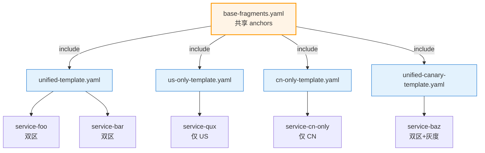
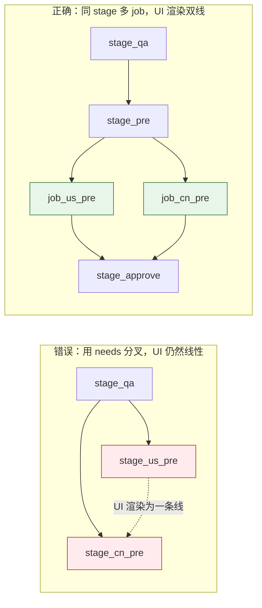

> **元信息**
> - 适用规模：20-300 人团队，30+ 条流水线，多产品线 / 多区域部署
> - 适用云：通用（云效 Flow / GitHub Actions / Jenkins / GitLab CI）
> - 沉淀成本：模板沉淀 1-2 周，新服务接入 30-60 分钟
> - 月成本：增量 ≈ 0，省的是工程师时间
> - 最后验证：2026-04-30，3 个模板 + canary 模板覆盖 60+ 条流水线连续运行 6 个月

## 适用场景

满足以下任意两条，建议按本 Playbook 推进：

- 团队流水线总数 ≥ 30 条，大部分流程相似（构建 → 测试 → 部署 → 通知）
- 服务部署到多个区域（中美 / 多 region），同一逻辑在两条流水线里维护两遍
- 出现过"改一次钉钉通知模板要改 80 处 yaml"的情况
- 新服务接入流水线总要花 1 天以上，主要时间在抄旧 yaml 改字段
- 流水线之间字段命名不一致（一个叫 `IMAGE_TAG`、一个叫 `USER_TAG`、一个叫 `DOCKER_TAG`）
- 没人能讲清"我们公司现在最佳的流水线长什么样"，新人入职第一周只能找一条最近上线的服务硬看

判断信号还有一些反直觉的：钉钉群里偶尔会冒出"通知格式怪异"的消息（说明部分流水线模板被遗忘修改）；跨流水线的脚本总要兼容多套变量名（说明命名漂移）；CI 团队的工时被"改流水线"占了 30% 以上（说明工程债已经在显性消耗预算）。三者占其一，本 Playbook 都值得推进。

不适用见文末「局限」。

## 核心问题

### 流水线碎片化的常见症状

观察一个跑了 2-3 年的中等规模团队（80+ 服务、80+ 条流水线），碎片化往往以下面几种方式表现：

| 症状 | 表现 | 真实代价 |
|------|------|----------|
| 字段命名漂移 | 同一含义在不同流水线里叫 `BRANCH` / `REF_NAME` / `GIT_BRANCH` | 跨流水线脚本无法复用 |
| 通知模板分散 | 钉钉成功/失败模板每条流水线一份 | 改一次格式要批量改 80 个文件，漏改的发出"格式怪异"的通知 |
| 流程深浅不一 | 一些流水线有 `schema_check`、一些没有 | 风险点不一致，事故复盘没法泛化 |
| 新人复制黑魔法 | 新服务靠"找一条最像的抄" | 旧坑被永久延续，PR review 也看不出来 |
| 边缘字段散落 | `cloneDepth` / `triggerEvents` / 构建机池等魔法值散落各处 | 谁改一次都要看 5 条流水线对照 |

### 临时方案为什么不够

最常见的临时方案是写一份「示例流水线」放在 wiki 里。问题是：

- 示例不会随主干流水线演进——半年后主干改了某字段，wiki 还是旧的
- 示例覆盖不到边缘 case（CN 区构建、AI 集群、灰度），新人遇到边缘场景就退化为"找最像的抄"
- 改一次主干流程仍要改 N 份 yaml；示例只能"建议"不能"约束"

真正想要的是：**把流水线设计抽象成「N 个模板 + 1 套接入流程」**，让 80% 的服务只需要填变量。模板自己版本化、自己测试、改一处全部生效。这套抽象的关键在于"变化点和不变点要分清"——不变的是构建/部署/通知/审批的骨架，变化的是项目名、服务名、部署区域、审批人列表，前者沉淀进模板、后者沉淀进变量组，两者拼装成具体流水线。

## 方案对比

### 方案 A：每个服务自己写流水线

适用于服务数 < 5、流程差异确实大的小团队。这种规模下"模板"反而是负担——团队脑子里能装下所有流水线的具体形状，模板的抽象成本比直接拷贝还高。但流水线 ≥ 30 条时，维护成本随数量线性增长，主干流程改一次要批量改 N 个文件，新人接入要花一整天。这个临界点过了就直接淘汰，没有中间地带。

### 方案 B：一个超级模板套所有服务

把所有可能的 stage 全塞进一个模板，用大量 `condition` 控制开关。这是中等规模团队最容易掉入的陷阱，因为它"看起来"是模板化——只有一份模板、改一处全部生效，从教科书角度无懈可击。但实际维护几个月后会出现：模板膨胀到 800+ 行，没人读得懂；新增边缘 case 就要全模板加 condition；调试时无法只跑某一类服务的子流程；condition 嵌套到三层以上时连写模板的人自己都得边读边猜分支。

### 方案 C：3-5 个分类模板 + 共享 step（推荐）

按**部署目标**把服务分成几个互斥类别，每类一个独立模板；模板内部用 YAML anchors / shared steps / reusable workflow 消除重复。这是工程上最务实的折中——它既承认"流水线之间不是 100% 一样"，又承认"大类是有限且稳定的"，于是用"几个类别 × 类内复用"两层抽象覆盖大多数场景。

为什么是 3-5 个：太少（1-2 个）会退化为方案 B（条件分支爆炸）；太多（10+）退化为方案 A（每条线都要单独维护）。3-5 个的甜蜜点恰好对应大部分团队的"部署目标维度"——单 region / 双 region / 多 region / 边缘场景，覆盖 80% 主干服务，剩下 20% 单独维护，整体维护成本最低。

我们团队最初想做 8 个模板，分成 US/CN × 含/不含灰度 × 含/不含 schema_check 这种组合矩阵；落地后发现"含/不含 schema_check"应该是模板内的开关而不是模板维度，"含/不含灰度"灰度的服务太少另开一个 canary 模板就行，最终收敛到 4 个（unified / unified-canary / us-only / cn-only）。这个收敛过程是不可避免的，建议起步直接奔 3-4 个，不要追求一开始就完美分类。

本文采用此方案，3 个核心模板分类如下：

| 模板 | 命名前缀 | 部署范围 | 大致流程 |
|------|---------|---------|---------|
| `unified-template.yaml` | `{产品线}-{服务名}` | 同时部署到双区 | 构建（双推 ECR+ACR）→ QA → 审批 → PRE(US\|CN) → 审批 → PROD(US\|CN) |
| `us-only-template.yaml` | `us-{产品线}-{服务名}` | 仅 US | 构建（ECR）→ QA → 审批 → PRE → 审批 → PROD |
| `cn-only-template.yaml` | `cn-{产品线}-{服务名}` | 仅 CN | 构建（ACR）→ 审批 → PRE → 审批 → PROD |

灰度场景再加一个 `unified-canary-template.yaml`，PROD 前插入灰度 stage + 灰度审批；S3 前端 / AI 集群属于剩下 20%，保留单独流水线。

## 推荐架构

### 模板继承关系



### Stage 渲染规则（云效）



### 关键决策点

1. **分类按部署目标，不按业务领域**——"消息服务/用户服务/订单服务"是业务分类，分多了膨胀，且业务调整时模板会跟着变；"仅 US/仅 CN/双区"是部署分类，正交、互斥、几乎不会随业务变动而变。这是模板能稳定下来的核心
2. **模板仓库与服务仓库分离**——模板放在统一 gitops 仓库，所有服务从这里引用；服务仓库不存模板副本。如果允许服务仓库 fork 一份模板自行修改，三个月后这些 fork 会全部偏离主干，再也合不回来
3. **共享 step 用 YAML anchors（云效）/ composite action（GHA）/ shared library（Jenkins）实现**——这三个机制语义不同但理念一致：把"钉钉通知 / 镜像 push / 审批人列表"这类高频重复段抽离。注意 anchors 是 yaml 解析时展开的（运行时还是平铺），composite action 是 runtime 调用的，shared library 是 jenkins master 加载的，三者性能和调试体验有差异
4. **接入方式是「填变量」不是「fork 模板」**——fork 后任何模板更新都同步不回来，等于退化为方案 A。我们曾经允许过两个服务 fork 模板，半年后这两个服务的流水线已经完全不像原模板，最终变成了"看起来用模板但实际单独维护"的最差形态
5. **审批节点抽到模板而不是放到变量组**——审批是流程语义不是配置语义，强行用变量组配置会让审批列表散落各处。同一类模板的审批人列表应该是稳定的（PRE 两人 / PROD 三人），少数特殊服务再单独覆盖

## 实施步骤

模板化是一个有顺序的工程：先盘点（搞清现状）、再抽象（确定模板数量和形状）、再写完整模板、再做平台等价实现、最后才是自动化创建脚本和回归测试。跳步骤的话，要么模板分类错（导致后期推倒重来），要么写出来没法测（一改就坏）。下面 8 步按顺序走。

### 步骤 1：盘点现有流水线，归类

**前置要求**：
- 安装 `alibabacloud-devops20210625` Python SDK：`pip install alibabacloud-devops20210625==2.0.0`
- 准备好云效 AK/SK，且账号在目标组织有 `读流水线` 权限

**执行**：

```python
#!/usr/bin/env python3
# pipeline-inventory.py — 盘点所有流水线并按命名前缀归类
import os, sys, csv, re
from alibabacloud_devops20210625.client import Client
from alibabacloud_devops20210625 import models
from alibabacloud_tea_openapi.models import Config

AK = os.environ.get("YUNXIAO_AK") or sys.exit("请设置 YUNXIAO_AK")
SK = os.environ.get("YUNXIAO_SK") or sys.exit("请设置 YUNXIAO_SK")
ORG_ID = os.environ.get("YUNXIAO_ORG_ID") or sys.exit("请设置 YUNXIAO_ORG_ID")

client = Client(Config(
    protocol="https",
    region_id="cn-hangzhou",
    endpoint="devops.cn-hangzhou.aliyuncs.com",
    access_key_id=AK,
    access_key_secret=SK,
))

def classify(name: str) -> str:
    if name.startswith("cn-"):     return "cn-only"
    if name.startswith("us-"):     return "us-only"
    if name.startswith("ai-"):     return "ai-only"
    if re.match(r"^(sandbox|p2s)-", name): return "infra"
    return "unified-or-us"   # 无前缀，二次确认

req = models.ListPipelinesRequest(max_results=200)
all_pipelines, next_token = [], None
while True:
    if next_token: req.next_token = next_token
    resp = client.list_pipelines(ORG_ID, req)
    all_pipelines.extend(resp.body.pipelines)
    next_token = resp.body.next_token
    if not next_token: break

with open("pipeline-inventory.csv", "w", newline="") as f:
    w = csv.writer(f)
    w.writerow(["pipeline_id", "name", "category", "create_time"])
    for p in all_pipelines:
        w.writerow([p.pipeline_id, p.name, classify(p.name), p.create_time])

print(f"共 {len(all_pipelines)} 条流水线，已写入 pipeline-inventory.csv")
```

**验证**：

```bash
$ YUNXIAO_AK=xxx YUNXIAO_SK=yyy YUNXIAO_ORG_ID=zzz python3 pipeline-inventory.py
共 84 条流水线，已写入 pipeline-inventory.csv

$ cut -d, -f3 pipeline-inventory.csv | sort | uniq -c
     47 unified-or-us
     23 cn-only
      4 us-only
      3 ai-only
     11 infra
      2 其他
```

**回滚**：脚本只读不写，无需回滚。

**判读**：盘点结果应该呈现明显的"长尾分布"——大头几类（unified-or-us / cn-only）占 80% 以上，小尾巴是各种边缘类（ai / sandbox / infra）。如果分布很平均，说明业务本身的部署模式碎片化，模板化前应该先收敛业务部署模式。如果某一类只有 1-2 条，不要为它单独抽模板——直接保留单独流水线即可。

### 步骤 2：完整 unified 模板（云效 Flow YAML）

unified 模板是双区服务的主力流水线，6 个 stage：构建 → QA → PRE 审批 → PRE 部署（双 job）→ PROD 审批 → PROD 部署（双 job）。这个形状经过实战验证：构建一次双推 ECR 和 ACR，避免 CN 侧重新构建；PRE 阶段的 US/CN 用同 stage 多 job 实现 UI 双线；审批节点统一不分 US/CN，避免审批列表散落。下面是完整可执行模板：

**前置要求**：
- 仓库路径已确定：`gitops/pipeline-templates/unified-template.yaml`
- 已有可用变量组（37753 通用 / 37529 US / 37532 CN），变量组提供 `${ECR_REGISTRY}` `${ACR_REGISTRY}` `${DING_WEBHOOK}` 等
- `runsOn.group` 已确认（构建机池 ID，不同组织不同）

**执行**：

```yaml
# pipeline-templates/unified-template.yaml
# 双区统一流水线模板：构建 → QA → 审批 → PRE(US|CN) → 审批 → PROD(US|CN)
# 占位符：${PROJECT} ${SERVICE} ${ORG_NAME} 由 create-pipeline.sh 渲染
name: ${PROJECT}-${SERVICE}

# ========== YAML anchors：高频重复段抽离 ==========
x-anchors:
  deploy-runsOn: &deploy-runsOn
    group: private/o3yZdT0POoGmFbak
    container: build-steps-public-registry.cn-beijing.cr.aliyuncs.com/build-steps/alinux3:latest

  fetch-deploy-script: &fetch-deploy-script
    step: Command
    name: 拉取 deploy.py
    with:
      run: |
        set -euo pipefail
        curl -sf -H "PRIVATE-TOKEN: ${CODEUP_PASSWORD}" \
          "https://codeup.aliyun.com/${ORG_ID}/example-org/gitops/raw/master/scripts/deploy.py" \
          -o deploy.py
        chmod +x deploy.py
        python3 -c "import yaml, requests" || pip install -q pyyaml requests

  ding-success: &ding-success
    plugin: DingTalkPlugin
    triggerState: [success]
    with:
      webhook: ${DING_WEBHOOK}
      secret: ${DING_SECRET}
      customContent: |
        部署成功
        服务：${USER_PROJECT}/${USER_SERVICE}
        环境：${USER_REGION}-${ENV}
        镜像：${USER_TAG}
        提交：${CI_COMMIT_TITLE}
        分支：${CI_COMMIT_REF_NAME}
        执行：${BUILD_EXECUTOR}

  ding-fail: &ding-fail
    plugin: DingTalkPlugin
    triggerState: [fail]
    with:
      webhook: ${DING_WEBHOOK}
      secret: ${DING_SECRET}
      customContent: |
        部署失败
        服务：${USER_PROJECT}/${USER_SERVICE}
        环境：${USER_REGION}-${ENV}
        分支：${CI_COMMIT_REF_NAME}
        日志：${CI_PIPELINE_LOG_URL}

  validators-pre: &validators-pre
    - approver-uid-1
    - approver-uid-2
  validators-prod: &validators-prod
    - approver-uid-1
    - approver-uid-2
    - approver-uid-3

# ========== 代码源 ==========
sources:
  repo_0:
    type: codeup
    name: ${SERVICE}
    endpoint: "https://codeup.aliyun.com/${ORG_NAME}/${PROJECT}/${SERVICE}.git"
    branch: master
    triggerEvents: [push]
    branchesFilter: ^(master|main)$       # 见踩坑 1
    cloneDepth: "0"                       # 见踩坑 2，必须字符串
    certificate:
      type: serviceConnection
      serviceConnection: ${CODEUP_CONN_ID}

# ========== Stages ==========
stages:
  # ---- 1. 构建并双推 ECR + ACR ----
  stage_build:
    name: 构建
    jobs:
      job_build:
        runsOn: *deploy-runsOn
        timeoutMinutes: 30
        steps:
          step_parse:
            step: Command
            name: 解析变量
            with:
              run: |
                set -euo pipefail
                # 流水线名 {PROJECT}-{SERVICE} 拆解
                NAME="${PIPELINE_NAME}"
                PROJECT=$(echo "$NAME" | cut -d'-' -f1)
                SERVICE=$(echo "$NAME" | cut -d'-' -f2-)
                TAG="${CI_COMMIT_SHORT_SHA}-$(date +%Y-%m-%d-%H-%M-%S)"
                echo "USER_PROJECT=$PROJECT"   >> $FLOW_ENV
                echo "USER_SERVICE=$SERVICE"   >> $FLOW_ENV
                echo "USER_TAG=$TAG"           >> $FLOW_ENV
          step_ecr_repo:
            step: Command
            name: 确保 ECR 仓库存在
            with:
              run: |
                set -euo pipefail
                REPO="${USER_PROJECT}/${USER_SERVICE}"
                aws ecr describe-repositories \
                  --repository-names "$REPO" \
                  --region us-west-2 2>/dev/null || \
                  aws ecr create-repository \
                    --repository-name "$REPO" \
                    --region us-west-2 \
                    --image-scanning-configuration scanOnPush=true
          step_build:
            step: DockerBuildPush
            name: 构建并推送
            with:
              dockerfilePath: gitops/dockerfiles/${USER_PROJECT}/${USER_SERVICE}.Dockerfile
              contextPath: .
              imageNames:
                - "${ECR_REGISTRY}/${USER_PROJECT}/${USER_SERVICE}:${USER_TAG}"
                - "${ECR_REGISTRY}/${USER_PROJECT}/${USER_SERVICE}:latest"
                - "${ACR_REGISTRY}/${USER_PROJECT}/${USER_SERVICE}:${USER_TAG}"
                - "${ACR_REGISTRY}/${USER_PROJECT}/${USER_SERVICE}:latest"
              buildArgs: "REGISTRY_PREFIX=${ECR_REGISTRY}"
        plugins:
          - <<: *ding-fail
            name: 构建失败通知

  # ---- 2. QA 部署（仅 US-QA，CN 没有 QA 环境）----
  stage_qa:
    name: QA 部署
    needs: [stage_build]
    jobs:
      job_us_qa:
        runsOn: *deploy-runsOn
        timeoutMinutes: 20
        steps:
          step_fetch: *fetch-deploy-script
          step_deploy:
            step: Command
            name: 部署 us-qa
            with:
              run: |
                set -euo pipefail
                export ENV=qa
                python3 deploy.py \
                  --region us --env qa \
                  --project "${USER_PROJECT}" --service "${USER_SERVICE}" \
                  --tag "${USER_TAG}" --action all
        plugins:
          - <<: *ding-success
          - <<: *ding-fail

  # ---- 3. PRE 审批 ----
  stage_approve_pre:
    name: PRE 审批
    needs: [stage_qa]
    jobs:
      job_approve_pre:
        component: ManualValidate
        with:
          validators: *validators-pre
          message: "请审批 PRE 部署：${USER_PROJECT}/${USER_SERVICE}@${USER_TAG}"

  # ---- 4. PRE 部署（同 stage 双 job → UI 渲染双线，见踩坑 4）----
  stage_pre:
    name: PRE 部署
    needs: [stage_approve_pre]
    jobs:
      job_us_pre:
        runsOn: *deploy-runsOn
        timeoutMinutes: 20
        steps:
          step_fetch: *fetch-deploy-script
          step_deploy:
            step: Command
            with:
              run: |
                set -euo pipefail
                export ENV=pre
                python3 deploy.py --region us --env pre \
                  --project "${USER_PROJECT}" --service "${USER_SERVICE}" \
                  --tag "${USER_TAG}" --action all
        plugins:
          - <<: *ding-success
          - <<: *ding-fail
      job_cn_pre:
        runsOn: *deploy-runsOn
        timeoutMinutes: 20
        steps:
          step_fetch: *fetch-deploy-script
          step_deploy:
            step: Command
            with:
              run: |
                set -euo pipefail
                export ENV=pre
                python3 deploy.py --region cn --env pre \
                  --project "${USER_PROJECT}" --service "${USER_SERVICE}" \
                  --tag "${USER_TAG}" --action all
        plugins:
          - <<: *ding-success
          - <<: *ding-fail

  # ---- 5. PROD 审批 ----
  stage_approve_prod:
    name: PROD 审批
    needs: [stage_pre]
    jobs:
      job_approve_prod:
        component: ManualValidate
        with:
          validators: *validators-prod
          message: "请审批 PROD 部署：${USER_PROJECT}/${USER_SERVICE}@${USER_TAG}"

  # ---- 6. PROD 部署 ----
  stage_prod:
    name: PROD 部署
    needs: [stage_approve_prod]
    jobs:
      job_us_prod:
        runsOn: *deploy-runsOn
        timeoutMinutes: 30
        steps:
          step_fetch: *fetch-deploy-script
          step_deploy:
            step: Command
            with:
              run: |
                set -euo pipefail
                export ENV=prod
                python3 deploy.py --region us --env prod \
                  --project "${USER_PROJECT}" --service "${USER_SERVICE}" \
                  --tag "${USER_TAG}" --action all
        plugins:
          - <<: *ding-success
          - <<: *ding-fail
      job_cn_prod:
        runsOn: *deploy-runsOn
        timeoutMinutes: 30
        steps:
          step_fetch: *fetch-deploy-script
          step_deploy:
            step: Command
            with:
              run: |
                set -euo pipefail
                export ENV=prod
                python3 deploy.py --region cn --env prod \
                  --project "${USER_PROJECT}" --service "${USER_SERVICE}" \
                  --tag "${USER_TAG}" --action all
        plugins:
          - <<: *ding-success
          - <<: *ding-fail
```

**验证**：

```bash
# 用 yamllint 校验语法
$ yamllint -d "{extends: default, rules: {line-length: disable}}" \
    gitops/pipeline-templates/unified-template.yaml
# 无输出即通过

# 用 yq 验证 anchors 解析正确
$ yq '.stages.stage_pre.jobs.job_us_pre.plugins | length' \
    gitops/pipeline-templates/unified-template.yaml
2
```

**回滚**：模板仅是文件，git 直接 `git checkout HEAD -- gitops/pipeline-templates/unified-template.yaml` 即可。但要注意：如果模板已经被多个流水线引用（云效里就是已有 N 个流水线创建时用了这份模板），git 回滚只能回滚模板文件，已创建流水线的 yaml 是各自独立存储的——所以模板回滚后还需要走"模板回归测试"再决定是否批量更新已有流水线。

### 步骤 3：us-only 与 cn-only 精简模板

us-only 模板是 unified 的"半边"，去掉所有 CN 相关 job 和 ACR 推送；cn-only 因为 CN 没有 QA 环境且构建机环境不同（用 alinux3 容器、需要手动 docker login + push、要注入国内镜像源）而是一份单独维护的模板。这里要避免一个常见错误——"用 unified 模板加 condition 实现 us-only/cn-only"。这种做法 condition 嵌套深，且 cn-only 的构建逻辑和 us 完全不同，硬塞同一份模板会让 condition 互相干扰，得不偿失。

**us-only 模板**：

```yaml
# pipeline-templates/us-only-template.yaml
name: us-${PROJECT}-${SERVICE}

x-anchors:
  deploy-runsOn: &deploy-runsOn
    group: private/o3yZdT0POoGmFbak
    container: build-steps-public-registry.cn-beijing.cr.aliyuncs.com/build-steps/alinux3:latest
  ding-success: &ding-success
    plugin: DingTalkPlugin
    triggerState: [success]
    with:
      webhook: ${DING_WEBHOOK}
      secret: ${DING_SECRET}
      customContent: "部署成功 ${USER_PROJECT}/${USER_SERVICE} us-${ENV} ${USER_TAG}"
  ding-fail: &ding-fail
    plugin: DingTalkPlugin
    triggerState: [fail]
    with:
      webhook: ${DING_WEBHOOK}
      secret: ${DING_SECRET}
      customContent: "部署失败 ${USER_PROJECT}/${USER_SERVICE} us-${ENV}"
  validators: &validators
    - approver-uid-1
    - approver-uid-2

sources:
  repo_0:
    type: codeup
    endpoint: "https://codeup.aliyun.com/${ORG_NAME}/${PROJECT}/${SERVICE}.git"
    branch: master
    triggerEvents: [push]
    branchesFilter: ^(master|main)$
    cloneDepth: "0"
    certificate:
      type: serviceConnection
      serviceConnection: ${CODEUP_CONN_ID}

stages:
  stage_build:
    name: 构建（仅 ECR）
    jobs:
      job_build:
        runsOn: *deploy-runsOn
        steps:
          step_parse:
            step: Command
            with:
              run: |
                set -euo pipefail
                NAME="${PIPELINE_NAME#us-}"   # 去掉 us- 前缀
                PROJECT=$(echo "$NAME" | cut -d'-' -f1)
                SERVICE=$(echo "$NAME" | cut -d'-' -f2-)
                echo "USER_PROJECT=$PROJECT" >> $FLOW_ENV
                echo "USER_SERVICE=$SERVICE" >> $FLOW_ENV
                echo "USER_TAG=${CI_COMMIT_SHORT_SHA}-$(date +%Y-%m-%d-%H-%M-%S)" >> $FLOW_ENV
          step_build:
            step: DockerBuildPush
            with:
              dockerfilePath: gitops/dockerfiles/${USER_PROJECT}/${USER_SERVICE}.Dockerfile
              imageNames:
                - "${ECR_REGISTRY}/${USER_PROJECT}/${USER_SERVICE}:${USER_TAG}"
                - "${ECR_REGISTRY}/${USER_PROJECT}/${USER_SERVICE}:latest"

  stage_qa:
    name: QA
    needs: [stage_build]
    jobs:
      job_qa:
        runsOn: *deploy-runsOn
        steps:
          step_deploy:
            step: Command
            with:
              run: |
                set -euo pipefail
                export ENV=qa
                python3 deploy.py --region us --env qa \
                  --project "${USER_PROJECT}" --service "${USER_SERVICE}" \
                  --tag "${USER_TAG}" --action all
        plugins: [*ding-success, *ding-fail]

  stage_approve_pre:
    name: PRE 审批
    needs: [stage_qa]
    jobs:
      job_approve:
        component: ManualValidate
        with:
          validators: *validators

  stage_pre:
    name: PRE
    needs: [stage_approve_pre]
    jobs:
      job_pre:
        runsOn: *deploy-runsOn
        steps:
          step_deploy:
            step: Command
            with:
              run: |
                set -euo pipefail
                export ENV=pre
                python3 deploy.py --region us --env pre \
                  --project "${USER_PROJECT}" --service "${USER_SERVICE}" \
                  --tag "${USER_TAG}" --action all
        plugins: [*ding-success, *ding-fail]

  stage_approve_prod:
    name: PROD 审批
    needs: [stage_pre]
    jobs:
      job_approve:
        component: ManualValidate
        with:
          validators: *validators

  stage_prod:
    name: PROD
    needs: [stage_approve_prod]
    jobs:
      job_prod:
        runsOn: *deploy-runsOn
        steps:
          step_deploy:
            step: Command
            with:
              run: |
                set -euo pipefail
                export ENV=prod
                python3 deploy.py --region us --env prod \
                  --project "${USER_PROJECT}" --service "${USER_SERVICE}" \
                  --tag "${USER_TAG}" --action all
        plugins: [*ding-success, *ding-fail]
```

**cn-only 模板**（CN 无 QA 环境，且构建用 alinux3 + 手动 docker push）：

```yaml
# pipeline-templates/cn-only-template.yaml
name: cn-${PROJECT}-${SERVICE}

x-anchors:
  cn-runsOn: &cn-runsOn
    group: public/cn-beijing
    container: build-steps-public-registry.cn-beijing.cr.aliyuncs.com/build-steps/alinux3:latest
    enableDockerDaemon: true
  ding-success: &ding-success
    plugin: DingTalkPlugin
    triggerState: [success]
    with:
      webhook: ${DING_WEBHOOK_CN}
      secret: ${DING_SECRET_CN}
      customContent: "CN 部署成功 ${USER_PROJECT}/${USER_SERVICE} ${ENV} ${USER_TAG}"
  ding-fail: &ding-fail
    plugin: DingTalkPlugin
    triggerState: [fail]
    with:
      webhook: ${DING_WEBHOOK_CN}
      secret: ${DING_SECRET_CN}
      customContent: "CN 部署失败 ${USER_PROJECT}/${USER_SERVICE} ${ENV}"
  validators: &validators
    - cn-approver-uid-1

sources:
  repo_0:
    type: codeup
    endpoint: "https://codeup.aliyun.com/${ORG_NAME}/${PROJECT}/${SERVICE}.git"
    branch: master
    triggerEvents: [push]
    branchesFilter: ^(master|main)$
    cloneDepth: "1"   # CN 浅克隆加速

stages:
  stage_build:
    name: 构建（手动 docker push 到 ACR）
    jobs:
      job_build:
        runsOn: *cn-runsOn
        steps:
          step_parse:
            step: Command
            with:
              run: |
                set -euo pipefail
                NAME="${PIPELINE_NAME#cn-}"
                PROJECT=$(echo "$NAME" | cut -d'-' -f1)
                SERVICE=$(echo "$NAME" | cut -d'-' -f2-)
                echo "USER_PROJECT=$PROJECT" >> $FLOW_ENV
                echo "USER_SERVICE=$SERVICE" >> $FLOW_ENV
                echo "USER_TAG=${CI_COMMIT_SHORT_SHA}-$(date +%Y-%m-%d-%H-%M-%S)" >> $FLOW_ENV
          step_build:
            step: Command
            with:
              run: |
                set -euo pipefail
                # 1. ACR 登录
                docker login -u ${ALIYUN_AK} -p ${ALIYUN_SK} ${ACR_REGISTRY}
                IMG="${ACR_REGISTRY}/${USER_PROJECT}/${USER_SERVICE}"
                # 2. cache pull（忽略失败）
                docker pull "${IMG}:cache" || true
                # 3. 构建（注入 CN 镜像源）
                docker build \
                  --cache-from "${IMG}:cache" \
                  --build-arg REGISTRY_PREFIX=${ACR_REGISTRY} \
                  --build-arg NPM_REGISTRY=https://registry.npmmirror.com \
                  --build-arg PIP_INDEX_URL=https://mirrors.aliyun.com/pypi/simple/ \
                  --build-arg GOPROXY=https://goproxy.cn,direct \
                  -f gitops/dockerfiles/${USER_PROJECT}/${USER_SERVICE}.Dockerfile \
                  -t "${IMG}:${USER_TAG}" \
                  -t "${IMG}:latest" \
                  -t "${IMG}:cache" \
                  .
                # 4. 双 push
                docker push "${IMG}:${USER_TAG}"
                docker push "${IMG}:latest"
                docker push "${IMG}:cache"

  stage_pre:
    name: CN PRE
    needs: [stage_build]
    jobs:
      job_pre:
        runsOn: *cn-runsOn
        steps:
          step_deploy:
            step: Command
            with:
              run: |
                set -euo pipefail
                export ENV=pre
                python3 deploy.py --region cn --env pre \
                  --project "${USER_PROJECT}" --service "${USER_SERVICE}" \
                  --tag "${USER_TAG}" --action all
        plugins: [*ding-success, *ding-fail]

  stage_approve_prod:
    name: CN PROD 审批
    needs: [stage_pre]
    jobs:
      job_approve:
        component: ManualValidate
        with:
          validators: *validators

  stage_prod:
    name: CN PROD
    needs: [stage_approve_prod]
    jobs:
      job_prod:
        runsOn: *cn-runsOn
        steps:
          step_deploy:
            step: Command
            with:
              run: |
                set -euo pipefail
                export ENV=prod
                python3 deploy.py --region cn --env prod \
                  --project "${USER_PROJECT}" --service "${USER_SERVICE}" \
                  --tag "${USER_TAG}" --action all
        plugins: [*ding-success, *ding-fail]
```

### 步骤 4：GitHub Actions 等价实现（reusable workflow）

GitHub Actions 的复用机制和云效完全不同——云效靠 yaml anchors（解析时展开），GitHub Actions 靠 reusable workflow 和 composite action（运行时调用）。两者的工程取舍也不同：云效 anchors 编辑时所见即所得但调试困难（展开后才知道实际跑的什么），reusable workflow 引用清晰但跨仓库引用要授权、版本要 pin 到 tag。对应到模板设计上，云效模板内部用 anchors 抽离重复段，GitHub Actions 模板用主 workflow 调用子 workflow 的方式实现"父子关系"的层次复用。下面是完整对应实现：

**前置要求**：
- 仓库已开启 GitHub Actions
- Secrets 已配置：`DING_WEBHOOK` `DING_SECRET` `AWS_ROLE_ARN` `ACR_USER` `ACR_PASS`
- 服务侧 workflow 通过 `uses: org/.github/.github/workflows/_unified-template.yml@v1` 引用

**主模板（reusable）**：

```yaml
# .github/workflows/_unified-template.yml
name: Unified Pipeline (reusable)

on:
  workflow_call:
    inputs:
      project:    { required: true,  type: string }
      service:    { required: true,  type: string }
      branch:     { required: false, type: string, default: "main" }
      regions:    { required: false, type: string, default: "us,cn" }
    secrets:
      AWS_ROLE_ARN:  { required: true }
      ACR_USER:      { required: true }
      ACR_PASS:      { required: true }
      DING_WEBHOOK:  { required: true }
      DING_SECRET:   { required: true }

permissions:
  id-token: write       # OIDC
  contents: read

jobs:
  # ---------- 构建并双推 ----------
  build:
    runs-on: ubuntu-latest
    outputs:
      tag: ${{ steps.parse.outputs.tag }}
    steps:
      - uses: actions/checkout@v4
      - id: parse
        run: |
          set -euo pipefail
          TAG="${GITHUB_SHA::7}-$(date +%Y%m%d-%H%M%S)"
          echo "tag=$TAG" >> "$GITHUB_OUTPUT"
      - uses: aws-actions/configure-aws-credentials@v4
        with:
          role-to-assume: ${{ secrets.AWS_ROLE_ARN }}
          aws-region: us-west-2
      - uses: aws-actions/amazon-ecr-login@v2
        id: ecr
      - name: ACR login
        run: |
          echo "${{ secrets.ACR_PASS }}" | \
            docker login -u "${{ secrets.ACR_USER }}" \
            --password-stdin example-acr-registry.cn-beijing.cr.aliyuncs.com
      - uses: ./.github/actions/docker-build-push   # composite action，见下
        with:
          project:  ${{ inputs.project }}
          service:  ${{ inputs.service }}
          tag:      ${{ steps.parse.outputs.tag }}
          ecr:      ${{ steps.ecr.outputs.registry }}
          acr:      example-acr-registry.cn-beijing.cr.aliyuncs.com

  # ---------- QA（仅 US）----------
  qa:
    needs: build
    if: contains(inputs.regions, 'us')
    uses: ./.github/workflows/_deploy.yml
    with:
      region:  us
      env:     qa
      project: ${{ inputs.project }}
      service: ${{ inputs.service }}
      tag:     ${{ needs.build.outputs.tag }}
    secrets: inherit

  # ---------- PRE 审批（GitHub Environment 提供）----------
  approve-pre:
    needs: qa
    runs-on: ubuntu-latest
    environment: pre-approval     # 在 repo settings → Environments 配 reviewers
    steps:
      - run: echo "PRE approved"

  # ---------- PRE 部署（matrix 多区并行 → UI 直接显示并行 job）----------
  pre:
    needs: approve-pre
    strategy:
      matrix:
        region: ${{ fromJSON(format('[{0}]', inputs.regions == 'us,cn' && '"us","cn"' || inputs.regions == 'us' && '"us"' || '"cn"')) }}
    uses: ./.github/workflows/_deploy.yml
    with:
      region:  ${{ matrix.region }}
      env:     pre
      project: ${{ inputs.project }}
      service: ${{ inputs.service }}
      tag:     ${{ needs.build.outputs.tag }}
    secrets: inherit

  # ---------- PROD 审批 ----------
  approve-prod:
    needs: pre
    runs-on: ubuntu-latest
    environment: prod-approval
    steps:
      - run: echo "PROD approved"

  # ---------- PROD 部署 ----------
  prod:
    needs: approve-prod
    strategy:
      matrix:
        region: ${{ fromJSON(format('[{0}]', inputs.regions == 'us,cn' && '"us","cn"' || inputs.regions == 'us' && '"us"' || '"cn"')) }}
    uses: ./.github/workflows/_deploy.yml
    with:
      region:  ${{ matrix.region }}
      env:     prod
      project: ${{ inputs.project }}
      service: ${{ inputs.service }}
      tag:     ${{ needs.build.outputs.tag }}
    secrets: inherit
```

**子 workflow `_deploy.yml`**：

```yaml
# .github/workflows/_deploy.yml
on:
  workflow_call:
    inputs:
      region:  { required: true, type: string }
      env:     { required: true, type: string }
      project: { required: true, type: string }
      service: { required: true, type: string }
      tag:     { required: true, type: string }
    secrets:
      AWS_ROLE_ARN: { required: true }
      DING_WEBHOOK: { required: true }
      DING_SECRET:  { required: true }

jobs:
  deploy:
    runs-on: ubuntu-latest
    steps:
      - uses: actions/checkout@v4
      - uses: aws-actions/configure-aws-credentials@v4
        with:
          role-to-assume: ${{ secrets.AWS_ROLE_ARN }}
          aws-region: us-west-2
      - name: deploy
        run: |
          set -euo pipefail
          python3 scripts/deploy.py \
            --region "${{ inputs.region }}" --env "${{ inputs.env }}" \
            --project "${{ inputs.project }}" --service "${{ inputs.service }}" \
            --tag "${{ inputs.tag }}" --action all
      - name: 钉钉通知（始终运行）
        if: always()
        uses: ./.github/actions/dingtalk
        with:
          webhook:  ${{ secrets.DING_WEBHOOK }}
          secret:   ${{ secrets.DING_SECRET }}
          state:    ${{ job.status }}
          project:  ${{ inputs.project }}
          service:  ${{ inputs.service }}
          env:      ${{ inputs.region }}-${{ inputs.env }}
          tag:      ${{ inputs.tag }}
```

**服务侧 workflow（实例化）**：

```yaml
# 仓库 service-foo/.github/workflows/release.yml
name: Release service-foo
on:
  push:
    branches: [main]

jobs:
  pipeline:
    uses: my-org/.github/.github/workflows/_unified-template.yml@v1
    with:
      project: productA
      service: service-foo
      regions: "us,cn"
    secrets: inherit
```

### 步骤 5：Jenkins 等价实现（Shared Library）

Jenkins 的复用机制是 shared library——把 Groovy 函数放到 `vars/` 目录下，全局流水线通过 `@Library('shared') _` 引入即可调用。这是三大平台中表达力最强的（Groovy 是真实编程语言），但也是耦合度最高的（shared library 跑在 master 上，加载失败会影响所有流水线；版本升级需要全局协调）。Jenkins 模板的优势是"原生支持 parallel"，不需要像云效那样靠 stage/job 区分；劣势是 declarative pipeline 和 scripted pipeline 混用容易踩坑（建议团队统一只用 declarative）。下面是完整 shared library 实现：

**前置要求**：
- 已有 Jenkins shared library 仓库 `jenkins-shared-lib`，并在 Jenkins → Manage Jenkins → Configure System → Global Pipeline Libraries 中注册
- Jenkins agent 已装 docker / aws-cli / python3
- Credentials 已配：`aws-role`、`acr-creds`、`dingtalk-webhook`

**Shared Library 结构**：

```
jenkins-shared-lib/
├── vars/
│   ├── unifiedPipeline.groovy        # 主模板
│   ├── usOnlyPipeline.groovy
│   ├── cnOnlyPipeline.groovy
│   ├── dockerBuildPush.groovy        # 共享 step
│   ├── deployStep.groovy
│   └── dingtalkNotify.groovy
└── src/com/example/cicd/
    └── PipelineConfig.groovy
```

**主模板 `vars/unifiedPipeline.groovy`**：

```groovy
// vars/unifiedPipeline.groovy
def call(Map cfg) {
    // cfg 必填: project, service; 可选: regions=['us','cn'], branch='main'
    assert cfg.project : 'project 必填'
    assert cfg.service : 'service 必填'
    cfg.regions = cfg.regions ?: ['us', 'cn']

    pipeline {
        agent { label 'docker' }
        options {
            timeout(time: 60, unit: 'MINUTES')
            timestamps()
            ansiColor('xterm')
        }
        environment {
            USER_PROJECT = "${cfg.project}"
            USER_SERVICE = "${cfg.service}"
            USER_TAG     = sh(returnStdout: true, script: """
                echo "${env.GIT_COMMIT.take(7)}-\$(date +%Y%m%d-%H%M%S)"
            """).trim()
        }
        stages {
            stage('Build') {
                steps {
                    dockerBuildPush(
                        project: cfg.project,
                        service: cfg.service,
                        tag:     env.USER_TAG,
                        regions: cfg.regions
                    )
                }
                post { failure { dingtalkNotify(state: 'fail',  stage: 'build', cfg: cfg) } }
            }

            stage('QA') {
                when { expression { 'us' in cfg.regions } }
                steps { deployStep(region: 'us', env: 'qa', cfg: cfg, tag: env.USER_TAG) }
                post {
                    success { dingtalkNotify(state: 'success', stage: 'us-qa', cfg: cfg) }
                    failure { dingtalkNotify(state: 'fail',    stage: 'us-qa', cfg: cfg) }
                }
            }

            stage('Approve PRE') {
                steps {
                    timeout(time: 4, unit: 'HOURS') {
                        input(
                            message: "审批 PRE 部署：${cfg.project}/${cfg.service}@${env.USER_TAG}",
                            submitter: 'approver-1,approver-2'
                        )
                    }
                }
            }

            stage('PRE') {
                parallel {
                    stage('us-pre') {
                        when { expression { 'us' in cfg.regions } }
                        steps { deployStep(region: 'us', env: 'pre', cfg: cfg, tag: env.USER_TAG) }
                    }
                    stage('cn-pre') {
                        when { expression { 'cn' in cfg.regions } }
                        steps { deployStep(region: 'cn', env: 'pre', cfg: cfg, tag: env.USER_TAG) }
                    }
                }
                post {
                    success { dingtalkNotify(state: 'success', stage: 'pre', cfg: cfg) }
                    failure { dingtalkNotify(state: 'fail',    stage: 'pre', cfg: cfg) }
                }
            }

            stage('Approve PROD') {
                steps {
                    timeout(time: 24, unit: 'HOURS') {
                        input(
                            message: "审批 PROD 部署：${cfg.project}/${cfg.service}@${env.USER_TAG}",
                            submitter: 'approver-1,approver-2,approver-3'
                        )
                    }
                }
            }

            stage('PROD') {
                parallel {
                    stage('us-prod') {
                        when { expression { 'us' in cfg.regions } }
                        steps { deployStep(region: 'us', env: 'prod', cfg: cfg, tag: env.USER_TAG) }
                    }
                    stage('cn-prod') {
                        when { expression { 'cn' in cfg.regions } }
                        steps { deployStep(region: 'cn', env: 'prod', cfg: cfg, tag: env.USER_TAG) }
                    }
                }
                post {
                    success { dingtalkNotify(state: 'success', stage: 'prod', cfg: cfg) }
                    failure { dingtalkNotify(state: 'fail',    stage: 'prod', cfg: cfg) }
                }
            }
        }
    }
}
```

**共享 step `vars/deployStep.groovy`**：

```groovy
// vars/deployStep.groovy
def call(Map args) {
    // args: region, env, cfg, tag
    withCredentials([
        [$class: 'AmazonWebServicesCredentialsBinding', credentialsId: 'aws-role'],
        string(credentialsId: 'argocd-token-${args.region}', variable: 'ARGOCD_TOKEN')
    ]) {
        sh """
            set -euo pipefail
            python3 scripts/deploy.py \\
              --region ${args.region} --env ${args.env} \\
              --project ${args.cfg.project} --service ${args.cfg.service} \\
              --tag ${args.tag} --action all
        """
    }
}
```

**共享通知 step `vars/dingtalkNotify.groovy`**：

```groovy
// vars/dingtalkNotify.groovy
def call(Map args) {
    // args: state ('success'|'fail'), stage, cfg
    def emoji = args.state == 'success' ? '[OK]' : '[FAIL]'
    def text = """
${emoji} ${args.stage}
服务：${args.cfg.project}/${args.cfg.service}
分支：${env.GIT_BRANCH}
镜像：${env.USER_TAG}
执行：${env.BUILD_USER ?: 'jenkins'}
日志：${env.BUILD_URL}
""".trim()
    withCredentials([string(credentialsId: 'dingtalk-webhook', variable: 'WEBHOOK')]) {
        sh """
            curl -fsS -X POST "\$WEBHOOK" \\
              -H 'Content-Type: application/json' \\
              -d '{"msgtype":"text","text":{"content":${groovy.json.JsonOutput.toJson(text)}}}'
        """
    }
}
```

**服务侧 Jenkinsfile**：

```groovy
// service-foo/Jenkinsfile
@Library('shared@v1') _

unifiedPipeline(
    project: 'productA',
    service: 'service-foo',
    regions: ['us', 'cn']
)
```

### 步骤 6：变量组管理与流水线绑定

变量组的设计是模板化能不能落地的关键——好的变量组划分让模板薄而清晰，差的变量组划分会逼着模板里硬编码各种区域差异。我们的经验是按"变化频率 × 变化作用域"两个维度切分：低频且全局的（CODEUP_ORG_ID、密码）放 common；中频且按区域变的（ECR/ACR 地址、AWS/阿里云凭据）放 region-us / region-cn；高频且按产品线变的（钉钉群、@ 列表）放 product-{name}。这个划分让 95% 的变更只影响一个变量组，避免"改一个变量影响所有流水线"的雪崩。

**变量组命名规范**：

| 变量组 | 用途 | 关键变量 |
|--------|------|---------|
| `common-${ORG}` | 全组织通用 | `CODEUP_ORG_ID`, `CODEUP_PASSWORD`, `BUILD_EXECUTOR` |
| `region-us` | US 专用 | `ECR_REGISTRY`, `AWS_REGION=us-west-2`, `AWS_ACCESS_KEY_ID`, `ARGOCD_SERVER_US`, `ARGOCD_TOKEN_US`, `DING_WEBHOOK` |
| `region-cn` | CN 专用 | `ACR_REGISTRY`, `ALIYUN_AK`, `ALIYUN_SK`, `ARGOCD_SERVER_CN`, `ARGOCD_TOKEN_CN`, `DING_WEBHOOK_CN` |
| `product-${PROJECT}` | 产品线特定 | 钉钉 @ 列表、产品线特定路径 |

**绑定流水线（云效内部 API）**：

OpenAPI 没有直接暴露"批量绑定变量组到流水线"，需要走内部 API：

```python
#!/usr/bin/env python3
# bind-variable-groups.py — 批量给流水线绑定变量组
# 用法：./bind-variable-groups.py <pipeline_id> <var_group_id_1>,<var_group_id_2>,...
import os, sys, requests

YUNXIAO_TOKEN = os.environ.get("YUNXIAO_USER_TOKEN") or sys.exit("需设置 YUNXIAO_USER_TOKEN")
ORG_ID = os.environ.get("YUNXIAO_ORG_ID") or sys.exit("需设置 YUNXIAO_ORG_ID")
SESSION_COOKIE = os.environ.get("YUNXIAO_SESSION") or sys.exit("需设置 YUNXIAO_SESSION（浏览器 F12 拷）")

def bind(pipeline_id: str, group_ids: list[int]):
    url = f"https://flow.aliyun.com/pipelines/{pipeline_id}/variableGroups"
    headers = {
        "Cookie": SESSION_COOKIE,
        "x-yunxiao-organization-id": ORG_ID,
        "Content-Type": "application/json",
    }
    payload = {"variableGroupIds": group_ids}
    r = requests.post(url, json=payload, headers=headers, timeout=15)
    r.raise_for_status()
    print(f"[OK] pipeline {pipeline_id} 已绑定变量组 {group_ids}")

if __name__ == "__main__":
    if len(sys.argv) != 3:
        print(f"用法：{sys.argv[0]} <pipeline_id> <gid1,gid2,...>")
        sys.exit(1)
    bind(sys.argv[1], [int(x) for x in sys.argv[2].split(",") if x])
```

**或用 OpenAPI `add_pipeline_relations`（仅一对一）**：

```python
from alibabacloud_devops20210625 import models as devops_models
req = devops_models.AddPipelineRelationsRequest(
    rel_object_type="VARIABLE_GROUP",   # 必须大写
    rel_object_ids="37753"
)
client.add_pipeline_relations(ORG_ID, str(pipeline_id), req)
```

**变量组版本管理（手工 + git 备份）**：

```bash
#!/bin/bash
# var-group-snapshot.sh — 把变量组快照到 git
set -euo pipefail
GROUPS=(37753 37529 37532)
OUT=gitops/variable-groups
mkdir -p "$OUT"
for gid in "${GROUPS[@]}"; do
    python3 -c "
from alibabacloud_devops20210625.client import Client
from alibabacloud_devops20210625 import models
from alibabacloud_tea_openapi.models import Config
import json, os
c = Client(Config(protocol='https', region_id='cn-hangzhou',
    endpoint='devops.cn-hangzhou.aliyuncs.com',
    access_key_id=os.environ['YUNXIAO_AK'], access_key_secret=os.environ['YUNXIAO_SK']))
resp = c.get_variable_group(os.environ['YUNXIAO_ORG_ID'], '$gid')
# 脱敏：value 字段统一替换
data = resp.body.to_map()
for v in data.get('variables', []):
    if v.get('isEncrypted'): v['value'] = '<MASKED>'
print(json.dumps(data, indent=2, ensure_ascii=False))
" > "$OUT/$gid.json"
done

cd gitops && git add variable-groups && \
  git commit -m "snapshot: variable-groups @ $(date +%F)" && \
  git push
```

每周跑一次，能在事故时回查"变量组什么时候被改的"。

### 步骤 7：自动化创建脚本 `create-pipeline.sh`

脚本是模板化的最后一公里——前面所有工作都是为了让"创建一条新流水线"从手工拷贝改字段降级为一行命令。但这个脚本不能只做"渲染 yaml + 调 API"——必须包含输入校验（防止打错 project/service 名）、依赖检查（防止 SDK 未装）、模板合法性校验（防止渲染出无效 yaml）、API 失败兜底（创建一半失败要能清理）、最终给出验收清单（让用户确认 GitOps / ECR 仓库 / overlay 是否齐备）。下面是完整脚本：

**前置要求**：
- Python 3.10+，`pip install alibabacloud-devops20210625==2.0.0 jinja2 click`
- 已有可用 AK/SK
- 模板文件齐备

**完整脚本**：

```bash
#!/bin/bash
# create-pipeline.sh — 一条命令创建新服务流水线
# 用法：./create-pipeline.sh -p productA -s service-foo -t unified -b main
set -euo pipefail

PROJECT=""; SERVICE=""; TYPE="unified"; BRANCH="main"; ORG_NAME=""
DRY_RUN=false
while getopts "p:s:t:b:o:n" opt; do
    case $opt in
        p) PROJECT="$OPTARG" ;;
        s) SERVICE="$OPTARG" ;;
        t) TYPE="$OPTARG" ;;       # unified | us-only | cn-only | unified-canary
        b) BRANCH="$OPTARG" ;;
        o) ORG_NAME="$OPTARG" ;;
        n) DRY_RUN=true ;;
        *) echo "用法：$0 -p <project> -s <service> -t <type> -b <branch> [-o <org_name>] [-n dry-run]"; exit 1 ;;
    esac
done

[[ -z "$PROJECT" || -z "$SERVICE" ]] && { echo "需要 -p 和 -s"; exit 1; }
[[ ! "$TYPE" =~ ^(unified|us-only|cn-only|unified-canary)$ ]] && { echo "type 必须是 unified/us-only/cn-only/unified-canary"; exit 1; }
[[ ! "$BRANCH" =~ ^(main|master)$ ]] && { echo "branch 必须是 main 或 master"; exit 1; }

# 依赖检查
command -v python3 >/dev/null || { echo "需要 python3"; exit 1; }
python3 -c "import alibabacloud_devops20210625, jinja2" 2>/dev/null \
  || { echo "缺依赖：pip install alibabacloud-devops20210625==2.0.0 jinja2"; exit 1; }
[[ -n "${YUNXIAO_AK:-}" && -n "${YUNXIAO_SK:-}" && -n "${YUNXIAO_ORG_ID:-}" ]] \
  || { echo "需要环境变量 YUNXIAO_AK / YUNXIAO_SK / YUNXIAO_ORG_ID"; exit 1; }

TEMPLATE_DIR="$(dirname "$0")/../pipeline-templates"
TEMPLATE_FILE="$TEMPLATE_DIR/$TYPE-template.yaml"
[[ -f "$TEMPLATE_FILE" ]] || { echo "模板不存在：$TEMPLATE_FILE"; exit 1; }

# 渲染流水线 yaml
RENDERED=$(mktemp /tmp/pipeline-XXXX.yaml)
trap 'rm -f "$RENDERED"' EXIT
python3 - <<PY
import jinja2
env = jinja2.Environment(
    loader=jinja2.FileSystemLoader("$TEMPLATE_DIR"),
    undefined=jinja2.StrictUndefined,
    keep_trailing_newline=True
)
tmpl = env.get_template("$TYPE-template.yaml")
out = tmpl.render(
    PROJECT="$PROJECT",
    SERVICE="$SERVICE",
    BRANCH="$BRANCH",
    ORG_NAME="${ORG_NAME:-example}"
)
open("$RENDERED", "w").write(out)
PY

# 模板渲染合法性校验
python3 -c "import yaml; yaml.safe_load(open('$RENDERED'))" \
  || { echo "[FAIL] 渲染后的 yaml 无效"; cat "$RENDERED"; exit 1; }

if $DRY_RUN; then
    echo "===== DRY RUN: 渲染结果 ====="
    cat "$RENDERED"
    exit 0
fi

# 调云效 API 创建
PIPELINE_ID=$(python3 - <<PY
from alibabacloud_devops20210625.client import Client
from alibabacloud_devops20210625 import models
from alibabacloud_tea_openapi.models import Config
import os
c = Client(Config(protocol="https", region_id="cn-hangzhou",
    endpoint="devops.cn-hangzhou.aliyuncs.com",
    access_key_id=os.environ["YUNXIAO_AK"],
    access_key_secret=os.environ["YUNXIAO_SK"]))
prefix = {"unified": "", "unified-canary": "", "us-only": "us-", "cn-only": "cn-"}["$TYPE"]
name = f"{prefix}$PROJECT-$SERVICE"
content = open("$RENDERED").read()
resp = c.create_pipeline(os.environ["YUNXIAO_ORG_ID"],
    models.CreatePipelineRequest(name=name, content=content))
# 注意 typo: pipelin_id（云效 SDK 字段名）
print(resp.body.pipelin_id)
PY
)
echo "[OK] 流水线已创建：pipeline_id=$PIPELINE_ID"

# 关联变量组
case "$TYPE" in
    unified|unified-canary) VAR_GROUPS="37753,37529,37532" ;;
    us-only)                VAR_GROUPS="37753,37529" ;;
    cn-only)                VAR_GROUPS="37753,37532" ;;
esac

for gid in ${VAR_GROUPS//,/ }; do
    python3 - <<PY
from alibabacloud_devops20210625.client import Client
from alibabacloud_devops20210625 import models
from alibabacloud_tea_openapi.models import Config
import os
c = Client(Config(protocol="https", region_id="cn-hangzhou",
    endpoint="devops.cn-hangzhou.aliyuncs.com",
    access_key_id=os.environ["YUNXIAO_AK"],
    access_key_secret=os.environ["YUNXIAO_SK"]))
c.add_pipeline_relations(os.environ["YUNXIAO_ORG_ID"], "$PIPELINE_ID",
    models.AddPipelineRelationsRequest(rel_object_type="VARIABLE_GROUP", rel_object_ids="$gid"))
print(f"[OK] 已绑定变量组 $gid")
PY
done

# 备份 yaml 到 gitops/pipelines/
BACKUP_DIR="$(dirname "$0")/../pipelines"
mkdir -p "$BACKUP_DIR"
cp "$RENDERED" "$BACKUP_DIR/${PROJECT}-${SERVICE}.yaml"
echo "[OK] 已备份到 $BACKUP_DIR/${PROJECT}-${SERVICE}.yaml"

# 输出验收清单
cat <<EOF

===== 验收清单 =====
[ ] gitops/dockerfiles/${PROJECT}/${SERVICE}.Dockerfile 存在
[ ] gitops/base/${PROJECT}/${SERVICE}/ 4 件套齐全 (kustomization/deployment/service/pdb)
[ ] gitops/clusters/{us-qa,us-pre,us-prod,cn-pre,cn-prod}/applications/${PROJECT}/${SERVICE}/ overlay 齐全
[ ] ECR 仓库 ${PROJECT}/${SERVICE} 已创建（或在流水线里有自动创建步骤）
[ ] 流水线变量组关联完整（VAR_GROUPS=$VAR_GROUPS）
[ ] 触发分支与代码仓库 default branch 一致（$BRANCH）

下一步：往代码仓库 push 一次提交，验证流水线自动触发
EOF
```

**用法示例**：

```bash
# Dry run（不真的创建）
$ YUNXIAO_AK=xxx YUNXIAO_SK=yyy YUNXIAO_ORG_ID=zzz \
    ./create-pipeline.sh -p productA -s service-foo -t unified -b main -n
===== DRY RUN: 渲染结果 =====
name: productA-service-foo
sources:
  ...

# 真的创建
$ YUNXIAO_AK=xxx YUNXIAO_SK=yyy YUNXIAO_ORG_ID=zzz \
    ./create-pipeline.sh -p productA -s service-foo -t unified -b main
[OK] 流水线已创建：pipeline_id=4810123
[OK] 已绑定变量组 37753
[OK] 已绑定变量组 37529
[OK] 已绑定变量组 37532
[OK] 已备份到 .../pipelines/productA-service-foo.yaml
```

**回滚**：

```bash
# 删除创建的流水线
python3 -c "
from alibabacloud_devops20210625.client import Client
from alibabacloud_devops20210625 import models
from alibabacloud_tea_openapi.models import Config
import os
c = Client(Config(protocol='https', region_id='cn-hangzhou',
    endpoint='devops.cn-hangzhou.aliyuncs.com',
    access_key_id=os.environ['YUNXIAO_AK'], access_key_secret=os.environ['YUNXIAO_SK']))
c.delete_pipeline(os.environ['YUNXIAO_ORG_ID'], '4810123')
print('[OK] 已删除')
"
```

### 步骤 8：模板回归测试（dry-run）

模板改动后，避免一改就坏 80 条流水线。回归测试是模板化"安全感"的核心——没有它，模板更新就不敢做；有了它，模板可以小步快跑迭代。回归脚本做下面几件事：

1. 对所有标准模板做 jinja 渲染 + yaml 解析（防低级语法错）
2. anchor 引用完整性检查（防止抽象后漏挂）
3. 关键字段断言（cloneDepth 类型 / branchesFilter 格式 / 必填变量是否声明）
4. 可选的 live 模式：调云效 API 真创建一条临时流水线再删除，验证云效后端 schema 通过

回归脚本本身要轻量（执行时间 < 30 秒，不然没人愿意每次提 PR 都跑），且必须接入 git pre-commit hook 或模板仓库的 PR check，强制阻断不通过的合并：

```bash
#!/bin/bash
# tests/regression-templates.sh — 模板回归测试
set -euo pipefail
TEMPLATES_DIR="$(git rev-parse --show-toplevel)/gitops/pipeline-templates"
TYPES=(unified unified-canary us-only cn-only)
TEST_PROJECT="testproj"
TEST_SERVICE="testsvc"
PASS=0; FAIL=0

for t in "${TYPES[@]}"; do
    echo "==== 测试 $t ===="

    # 1. yaml 解析
    rendered=$(mktemp)
    python3 - <<PY > "$rendered"
import jinja2
env = jinja2.Environment(loader=jinja2.FileSystemLoader("$TEMPLATES_DIR"),
                        undefined=jinja2.StrictUndefined)
print(env.get_template("$t-template.yaml").render(
    PROJECT="$TEST_PROJECT", SERVICE="$TEST_SERVICE",
    BRANCH="main", ORG_NAME="testorg"))
PY
    if python3 -c "import yaml; yaml.safe_load(open('$rendered'))" 2>/dev/null; then
        echo "  [OK] yaml 解析通过"
    else
        echo "  [FAIL] yaml 解析失败"
        cat "$rendered"
        FAIL=$((FAIL+1))
        continue
    fi

    # 2. anchor 完整性：每个 anchor 必须被引用至少一次
    if grep -q "^x-anchors:" "$rendered"; then
        for anchor in $(grep -oE "&[a-z][a-z-]+" "$rendered" | sort -u); do
            ref="*${anchor:1}"
            count=$(grep -cF "$ref" "$rendered" || true)
            if [[ "$count" == "0" ]]; then
                echo "  [WARN] anchor $anchor 未被引用"
            fi
        done
    fi

    # 3. 关键字段断言
    if ! grep -q 'cloneDepth: "0"' "$rendered" 2>/dev/null \
       && ! grep -q 'cloneDepth: "1"' "$rendered" 2>/dev/null; then
        echo "  [FAIL] cloneDepth 缺失或非字符串"
        FAIL=$((FAIL+1))
        continue
    fi
    if ! grep -qE 'branchesFilter: \^?\(?(master|main)' "$rendered"; then
        echo "  [FAIL] branchesFilter 格式不对"
        FAIL=$((FAIL+1))
        continue
    fi

    # 4. 临时创建 + 立即删除（验证云效 schema 通过）
    if [[ "${RUN_LIVE_TEST:-false}" == "true" ]]; then
        pid=$(python3 - <<PY
from alibabacloud_devops20210625.client import Client
from alibabacloud_devops20210625 import models
from alibabacloud_tea_openapi.models import Config
import os
c = Client(Config(protocol='https', region_id='cn-hangzhou',
    endpoint='devops.cn-hangzhou.aliyuncs.com',
    access_key_id=os.environ['YUNXIAO_AK'], access_key_secret=os.environ['YUNXIAO_SK']))
resp = c.create_pipeline(os.environ['YUNXIAO_ORG_ID'],
    models.CreatePipelineRequest(name='test-${t}-$$',
                                 content=open('$rendered').read()))
print(resp.body.pipelin_id)
PY
        )
        echo "  [OK] live 创建成功 pid=$pid，立即清理"
        python3 -c "
from alibabacloud_devops20210625.client import Client
from alibabacloud_devops20210625 import models
from alibabacloud_tea_openapi.models import Config
import os
c = Client(Config(protocol='https', region_id='cn-hangzhou',
    endpoint='devops.cn-hangzhou.aliyuncs.com',
    access_key_id=os.environ['YUNXIAO_AK'], access_key_secret=os.environ['YUNXIAO_SK']))
c.delete_pipeline(os.environ['YUNXIAO_ORG_ID'], '$pid')
"
    fi

    PASS=$((PASS+1))
    rm -f "$rendered"
done

echo
echo "==== 总结 ===="
echo "通过: $PASS / 失败: $FAIL"
[[ $FAIL -eq 0 ]] || exit 1
```

CI 触发：每次模板 PR 自动跑。`RUN_LIVE_TEST=true` 仅在主干合并前的最终验证阶段开（频繁开会创建大量空流水线影响云效配额），日常 PR 只跑前 3 步即可。

## 踩过的坑

下面 7 个坑都是真实遇到过的，每个都让流水线坏了至少一次。云效官方文档对其中 5 个完全没提，剩下 2 个写得很隐蔽。读完模板部分如果不读这一节，等于把这些坑留给下一个团队成员去重新踩一遍。

### 坑 1：`branchesFilter` 必须匹配 default branch

**现象**：流水线 yaml `branchesFilter: main`，push 到 main 一直不触发。

**根因**：仓库 default branch 是 `master`（从老仓库迁来没改），云效 sources 创建时校验 branchesFilter 能否匹配 default branch；不匹配**不报错**，但触发判定时以 default branch 为基准，导致 push 事件被静默丢弃。

**修复**：

```yaml
# 错误：硬编码单一分支
branchesFilter: main

# 正确：兼容两种主流写法
branchesFilter: ^(master|main)$
```

且在 `create-pipeline.sh` 加预检：

```bash
# 创建前先查仓库 default branch
DEFAULT_BRANCH=$(curl -fsS -H "PRIVATE-TOKEN: ${CODEUP_PASSWORD}" \
  "https://codeup.aliyun.com/api/v4/projects/${ORG_ID}%2F${PROJECT}%2F${SERVICE}" \
  | jq -r '.default_branch')
[[ "$DEFAULT_BRANCH" =~ ^(master|main)$ ]] \
  || { echo "default branch 不是 master/main，模板需调整 branchesFilter"; exit 1; }
```

**通用结论**：所有"基于代码源触发"的流水线工具（云效 / Jenkins multi-branch / GitLab CI）都有类似坑——你以为是触发事件配置，实际还和仓库元信息耦合。

### 坑 2：`cloneDepth` 必须用字符串，不能用整数

**现象**：UI YAML 编辑器报 `Incorrect type. Expected string`；通过 SDK 传 `0`（int）又能成功。

**根因**：云效 yaml schema 把 `cloneDepth` 定义成 string，但 API 端接受 int——schema 校验和运行时校验不一致。

**修复**：

```yaml
cloneDepth: "0"     # 字符串，0 代表全量克隆
```

**通用结论**：声明式 yaml 工具普遍有这种"看起来该是数字、实际是字符串"的字段（K8s 的 `replicas` vs `port` 也类似）。改完一定通过 API（`get_pipeline`）读回来验证生效值，不要只看 UI 保存成功。

### 坑 3：step 级别 `envs` 字段被静默忽略

**现象**：写 `step.with.envs: { FOO: bar }`，运行时 `echo $FOO` 是空。

**根因**：云效 step 的 `with` 参数只接受**该 step 类型本身定义的字段**（`Command` 只有 `run`，`DockerBuildPush` 有 `dockerfilePath` 等），其他字段不报错但不生效——这是云效 yaml 的「静默失败」通病。

**反例**（不工作）：

```yaml
step_run:
  step: Command
  with:
    envs:
      FOO: bar         # 静默丢弃
    run: echo $FOO     # 输出空
```

**正例**（推荐）：

```yaml
step_run:
  step: Command
  with:
    run: |
      set -euo pipefail
      export FOO=bar
      echo "$FOO"          # 输出 bar
      ./do_something.sh
```

或者用变量组在流水线级注入。

**通用结论**：所有 yaml 驱动的工具都有"未知字段静默忽略"的特性（GitHub Actions、Argo Workflows、Tekton、CircleCI 都是）。模板沉淀务必通过 API 读回实际生效值断言，不要只 review yaml。

### 坑 4：Stage 间永远线性渲染，同 stage 多 job 才显示并行双线

**现象**：用 10 个 stage + `needs` 实现 US/CN 并行，UI 仍然一条线。

**根因**：云效 Flow yaml 的 UI 渲染规则是 **stage 之间永远线性排列**——不管 `needs` 怎么连，A → B → C 始终一条线。视觉并行只能通过同 stage 内多 job 实现。

**反例**：

```yaml
# 错：US/CN 各一个 stage 用 needs 分叉
stages:
  stage_qa: {...}
  stage_us_pre: { needs: [stage_qa] }
  stage_cn_pre: { needs: [stage_qa] }   # UI 仍然线性
  stage_approve: { needs: [stage_us_pre, stage_cn_pre] }
```

**正例**：

```yaml
# 对：同 stage 内 2 个 job
stages:
  stage_qa: {...}
  stage_pre:
    needs: [stage_qa]
    jobs:
      job_us_pre: {...}
      job_cn_pre: {...}     # 视觉双线 + AND 等待
  stage_approve:
    needs: [stage_pre]
```

GitHub Actions 在这点做得更好——`strategy.matrix` 直接渲染并行 job；Jenkins 用显式 `parallel { stage A; stage B }`。

**通用结论**：模板设计要绑定**目标平台的渲染语义**，不只是执行语义。`needs` 控制执行依赖，但用户看的是 UI——如果模板让 UI 看起来像串行，用户会以为流水线慢。

### 坑 5：`triggerEvents` 不支持 `schedule`

**现象**：纯定时触发的清理流水线写 `triggerEvents: [schedule]` + cron，yaml 校验失败。

**根因**：云效 `triggerEvents` 仅支持 `push` / `tagPush` / `mergeRequestUpdated` / `mergeRequestMerged` 四种，**定时触发不在 yaml 里配**，必须在 UI「触发设置 → 定时触发」里手动建。这点官方文档写得不显眼。

**修复**：纯定时流水线**删除整个 `sources:` 段**，stages 直接挂 `sourceOption: []` 不下载源码，定时触发在 UI 配。

```yaml
# 不写 sources: 段
stages:
  stage_run:
    jobs:
      job_run:
        runsOn:
          group: public/cn-beijing
          labels: linux,amd64
        sourceOption: []        # 不下载源码
        steps:
          step_run:
            step: Command
            with:
              run: |
                set -euo pipefail
                ./cleanup.sh
```

UI 配定时：流水线 → 触发设置 → 定时触发 → 周期触发 + 选时间。

**通用结论**：云效 yaml 是"代码触发 + 手工触发"的产物，定时和 webhook 是后来加的二等公民。GitHub Actions 把 `schedule` 做成一等公民（`on.schedule.cron`）这点更好；Jenkins `triggers { cron('...') }` 也是一等公民。

### 坑 6：静默失败（exit 0 但实际错误）

**现象**：流水线 step 显示成功，但 ArgoCD 同步失败、镜像没更新；查日志才发现 deploy.py 中间报了错。

**根因**：bash 默认 `exit 0` 即视为成功；如果命令在 pipeline 中间失败但末尾还有命令，整体退出码可能仍是 0。

**反例**（坑）：

```yaml
step_deploy:
  step: Command
  with:
    run: |
      python3 deploy.py --env qa --action gitops
      python3 deploy.py --env qa --action sync     # 失败也不影响
      echo "deploy done"                            # 最后一行 exit 0
```

**正例**（强制 set -e + 显式退出码检查）：

```yaml
step_deploy:
  step: Command
  with:
    run: |
      set -euo pipefail            # 强制：任意命令失败立即退出
      set -o pipefail              # pipe 中任一阶段失败也退出

      python3 deploy.py --env qa --action gitops
      python3 deploy.py --env qa --action sync
      python3 deploy.py --env qa --action wait
      # 显式校验最终状态
      kubectl --context us-qa rollout status deploy/${USER_SERVICE} \
        -n ${USER_PROJECT} --timeout=300s
      echo "deploy done"
```

模板里所有 `Command` step 默认加 `set -euo pipefail` 头，可以在 anchor 里硬塞：

```yaml
x-anchors:
  bash-strict: &bash-strict |
    set -euo pipefail
    set -o pipefail
```

**通用结论**：CI 工具的退出码语义按 shell 走，写 step 时**不要图省事用裸 `bash` 段**，永远 `set -euo pipefail` 开头。

### 坑 7：变量组泄漏（PR / fork 触发流水线时变量被打印）

**现象**：外部 contributor 提了 PR，流水线触发后日志里看到 `AWS_ACCESS_KEY_ID=AKIA...`，因为某个 step 打了 `env`。

**根因**：变量组里的 secret 默认对所有触发源可见；PR fork 的代码改了 step 里的 `echo`，秘钥就被印出。

**修复**：

```yaml
# 1. PR/MR 触发只跑无 secret 的 stage
sources:
  repo_0:
    triggerEvents: [push]                      # 不监听 mergeRequestUpdated
    branchesFilter: ^(master|main)$            # 只主干

# 2. 如果必须开 PR 触发，对 fork 隔离
on:                                            # GitHub Actions 写法
  pull_request_target:                         # 不是 pull_request！
    branches: [main]
jobs:
  build:
    if: github.event.pull_request.head.repo.full_name == github.repository
    # ↑ 只有同仓库 PR 才能拿到 secret，fork PR 跳过
```

云效侧规避：**变量组里 secret 字段的 `isEncrypted: true`**，确保日志里被 mask；同时审批步骤前禁止任何 `set -x` 或 `env`：

```yaml
step_safe:
  step: Command
  with:
    run: |
      set -euo pipefail
      # 不要 set -x
      # 不要 env > /tmp/all
      # 不要 echo "$AWS_ACCESS_KEY_ID"
      ./real_work.sh
```

**通用结论**：CI 平台的"secret masking"是兜底，不是依赖。任何"可能被外部贡献者改"的入口（PR、fork、代码源 trigger）都要做权限隔离。

## 衡量指标

衡量模板化是否成功，定量指标比定性感觉更可靠。下面是模板化前后的对比（基于约 80 条流水线的实际数据，6 个月时间窗口）：

| 指标 | Before | After | 备注 |
|------|--------|-------|------|
| 新服务接入流水线耗时 | 4-8 小时 | 30-60 分钟 | 主要省在 yaml 编写 |
| 主干流程改一次的工作量 | 改 80+ 文件、漏改率 ≈ 10% | 改 1 个模板 + 灰度发版 | 漏改率降到 0 |
| 流水线总数 | 80+（碎片化） | 60+（80% 模板化、20% 单独维护） | 部分服务合并为统一流水线 |
| 平均故障率（流水线本身 bug） | 每月 2-3 次 | 每月 0-1 次 | 模板自身有覆盖测试 |
| 新人独立创建流水线 | 不可能（必抄旧的） | 跟 SOP 走能完成 | onboarding 时间从周降到天 |
| 字段命名一致性 | 5+ 种命名风格 | 3 个模板共用 1 套命名 | 跨流水线脚本可复用 |

定性变化：

- 主干流程改动（加 schema_check / 改通知格式 / 升级构建机池）从"季度级工程"降为"小时级 PR"
- 模板成为团队的"流水线最佳实践入口"，新人 review 模板就能学到 80% 的 CI/CD 知识
- 边缘流水线（剩下 20%）问题变可见——能识别出"这个服务为什么不能用模板"，倒逼业务流程统一
- 流水线本身的 review 文化形成：每次模板 PR 都会触发讨论，团队对 CI/CD 的认知统一性显著提升
- 排错效率提高：流水线挂了，先看是模板问题还是服务特定问题（看是不是别的同类流水线也挂了），定位时间从平均 30 分钟降到 5 分钟以内

## 局限

模板化不是银弹，明确以下场景不适用或要谨慎：

- **服务总数 < 10**：维护模板的成本不会被摊薄，直接每条单独写更轻
- **流程差异确实大**（前端 S3 发布 / Mobile / 桌面客户端 / 文档站）：硬塞同一模板会让模板膨胀，应单独抽小模板或保留单独流水线
- **强模板会限制创新**：当某个服务想试新流程（先做 e2e 再 schema_check），模板化的服务很难绕开。建议提供"逃生通道"——允许个别服务退出模板用单独 yaml，但要在 PR 里说清原因
- **模板的覆盖率上限**：经验值是 70-85%，剩下 15-30% 是边缘场景，硬塞会让模板变成方案 B
- **跨平台抽象有损耗**：从云效模板抽象到 GitHub Actions / Jenkins 通用模板时，每个平台有独有特性（GHA matrix、Jenkins parallel），完全统一会丢功能

## 后续演进方向

接下来 6-12 个月计划落地的：

1. **模板自动测试 live 化**：每次模板 PR，CI 真创建一条临时流水线、跑一遍空构建、读回 API 字段断言、销毁。彻底避免"改模板坏所有服务"
2. **模板版本管理（SemVer）**：模板加 `@v1.2.0` 标签，服务可 pin 版本；主版本升级走灰度，避免一次升级把 80 条流水线全炸
3. **跨平台模板抽象**：把"流水线模型"（stage / job / step / 共享段）抽到一层中间表示，云效 / GHA / Jenkins 都从中间表示渲染。代价是中间表示要维护，受益是切换平台不用全部重写
4. **模板自助平台**：把 `create-pipeline.sh` 做成内部平台界面，业务团队点选填表单，不需要找 CI 工程师。模板版本、变量组、审批人都可视化
5. **触发 / 通知模板独立**：把"触发分支策略 / 钉钉模板 / 失败兜底"再抽一层，因为这些字段会和业务模板正交变化（比如全公司钉钉模板统一改一次）

---

> **最后验证**：2026-04-30，云效 Flow YAML 2026-04 schema、GitHub Actions reusable workflows、Jenkins Shared Library 2.x。超过 12 个月请重新验证云效 yaml 字段——云效 schema 变更不发版本号。
