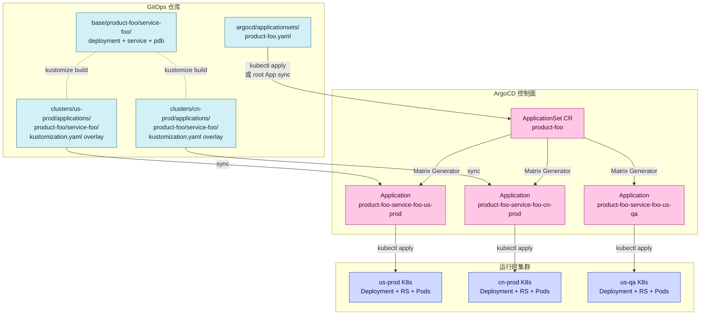

> **元信息**
> - 适用规模：30-100 人技术团队，已有 K8s 基础，10+ 微服务
> - 适用云：AWS + 阿里云双云 / 任意单云
> - 运维负担：1-2 人平台工程师维护
> - 月成本：CI 跑机器约 \$200-400 + ArgoCD 2c4g x2 实例 + Prometheus/Loki 4c8g
> - 最后验证：2026-04-30，过去 6 个月在双云双环境上持续运行 84 条流水线 + 394 个 Application

## 适用场景

下列条件满足三条以上时，本方案适用：

- 团队规模 30-100 人，研发与 SRE/DevOps 比例约 10:1
- 已经在用 Kubernetes（EKS / ACK / 自建均可），但部署还停留在手工 `kubectl apply` 或半自动脚本
- 服务数 10-50 个，至少一个核心库被多个服务共用
- 多环境（QA / PRE / Prod，可能含国内外双线），各环境之间衔接靠人传递信息
- 想用一个统一蓝图替代历史上"GitLab + Jenkins + Ansible + 手工 SSH"的拼盘

不适用见文末「局限」。

## 核心问题

中等规模公司在 DevOps 上最常见的不是缺工具，而是工具组合后出现的**接缝问题**。

**现状典型表现**：

- **工具碎片化**：代码在 GitLab，CI 在 Jenkins，部署是工程师 `helm upgrade` 直推，监控是 Grafana + 自建脚本告警。每个工具独立都没问题，但跨工具追踪一个变更需要在 4-5 个系统之间跳转
- **阶段衔接断裂**：PR review 由人推动（被催才看），合并后构建完成不会自动部署到 PRE，到 Prod 需要工程师手工触发，每一环都需要"有人记得"
- **缺乏全流程视图**：故障复盘时，没人能拉出一条"代码提交 → 镜像 build → 部署到哪个集群 → 触发了哪条告警"的完整时间线
- **多环境一致性差**：QA 改了什么，PRE 不一定有；PRE 加了配置，Prod 上线时漏掉。每次复现 bug 都要先确认"是不是环境差异"

很多团队意识到问题后会上 GitHub Enterprise 或 GitLab Premium 一把梭。这能解决一部分（统一鉴权 + 自带 CI）但不能解决：多集群部署仍然需要外挂方案（Argo CD / Flux）；多云镜像仓库的 push/pull 凭据散落在各个流水线里；国内（阿里云）与海外（AWS）合规导致 CI 必须分两套。

我们想要的是一份**可以照着搭、每一步都能映射到具体 Playbook 的蓝图**：明确每个阶段用什么工具、为什么选这个工具、各阶段怎么衔接、出问题时从哪一步开始查。

更具体地说，一个能用三年不需要推倒重来的 DevOps 体系，至少要满足下面四个标准：

- **可观测的全链路**：从开发者按下 git push 那一刻起，到 Pod 在某个集群上 Running，每一步都能在某个工具里看到状态和耗时；故障复盘不需要凭记忆拼时间线
- **新加服务的边际成本要低**：第 11 个微服务接入和第 1 个相比，工作量应该是 1 小时 vs 1 周，而不是同一个量级；这要求模板化和 ApplicationSet 自动发现这两件事到位
- **多人并行不互相覆盖**：5 个开发者同时改 5 个 PR，在 QA 环境上能同时验证，不用排队
- **回滚比上线还简单**：上线是一个 commit，回滚是 git revert；任何需要"专家在场才能回滚"的体系都不及格

## 方案对比

### 方案 A：全套 SaaS（GitHub Enterprise / GitLab Premium）

把代码托管、CI、容器仓库、部署、安全扫描都放在同一个 SaaS 上。

- **优势**：单点鉴权，账单单一，新员工接入只发一个邀请
- **适用**：预算充足（GHE 约 \$21/user/month，GitLab Ultimate 更高）；纯海外或纯国内单云团队
- **淘汰理由**：跨境合规问题（国内代码强制存阿里云 / 腾讯云）；多集群部署仍要 Argo CD 外挂；按人头计费在团队扩张时线性增长

### 方案 B：完全自建（Gitea + Tekton + 自研部署系统）

每一层都用开源组件自建，最大化定制空间。

- **优势**：单点成本极低，年开销几千美金以内；任何环节都能改
- **适用**：极限定制需求 / 团队有平台工程基因 / 极低预算
- **淘汰理由**：维护成本被严重低估——Tekton 的 RBAC、Gitea 的 LFS、Argo CD 的多集群 cert 轮换，每一项都是持续投入；30-100 人团队没法养一个 4-5 人的平台组

### 方案 C：云效（或 GitHub Actions）+ ArgoCD + Kustomize 混合模式（推荐）

把"代码托管 + CI 构建"交给托管服务（云效 Flow / GitHub Actions），"部署到 K8s"自建 ArgoCD + Kustomize 体系，中间用一个 GitOps 仓库连接。

- **优势**：托管服务承担构建机扩缩容和镜像缓存运维；ArgoCD + Kustomize 自建覆盖部署侧的所有定制；GitOps 仓库是天然的全流程视图（每次部署都是一个 commit）
- **跨云友好**：阿里云用云效 Flow，海外用 GitHub Actions / Codeup，但 GitOps 仓库统一一份
- **维护成本可控**：1-2 人能 cover；新加一个服务只是复制一份模板
- **代价**：需要额外学习 Argo CD 的 ApplicationSet 和 Kustomize 的 Base/Overlay 语义；多 ArgoCD 集群需要凭据路由设计（坑 3）

下文按方案 C 展开。方案 C 的"自建"只在部署侧（ArgoCD + Kustomize + GitOps 仓库），CI/CD 流水线本身仍然依赖托管服务。这种"托管 + 自建"的混合是有意为之的：CI 这一层最难自建（构建机扩缩容、镜像缓存、跨地域加速、各种语言的构建环境），交给云效或 GitHub Actions 一年能省一个全职工程师的工作量；部署侧则相反——多集群、多环境、自定义路由、安全策略这些定制需求强烈，外部 SaaS 反而束缚多。

### 工具版本选择的取舍

对中等规模公司，"用最新版"并不总是最优。下面几个版本选择背后都有具体权衡：

- **ArgoCD 选 2.13 而不是 3.x**：3.x 的 source hydrator 等新特性虽然有用，但社区对 ApplicationSet Matrix Generator 在 3.x 上的反馈还不稳定。2.13 经过半年验证，394 个 Application 没出现 controller OOM 或 reconcile 卡住的问题
- **Kustomize 选 5.4 而不是 5.5**：5.5 改了 patch target name 的解析顺序，对 namePrefix 的某些 edge case 行为有变化，PR 隔离环境的 overlay 已经依赖了原行为，迁移成本不划算
- **kube-prometheus-stack 62.x 而不是 65.x**：65.x 把 Prometheus Operator 升到了一个新的 CRD 版本，跟现有的 ServiceMonitor 资源不向前兼容，需要全量重建。等到下一次集群整体升级再一起做
- **Helm 不是 Kustomize 的替代而是补充**：第三方组件（cert-manager、Karpenter、kube-prometheus-stack）一律用 Helm 装，但业务服务一律用 Kustomize。Helm 适合"装好就不动"的基础设施，Kustomize 适合"频繁迭代且要看清差异"的业务

这些选择背后的共同原则是：**生产环境的工具版本只升必要的安全补丁，不为了"新"而升**。每次 minor 升级都要做兼容性矩阵评估，patch 升级才能直接走。

## 推荐架构

整体流程分五层：**代码层 → CI 层 → 制品层 → GitOps 层 → 运行时层**，每一层有清晰的输入输出。

```mermaid
flowchart LR
    subgraph DEV[1. 开发者层]
      A1[本机 git push<br/>feature/x]
      A2[ModHeader<br/>X-env header]
    end
    subgraph GIT[2. Git 平台层]
      B1[Codeup CN<br/>GitHub OSS]
      B2[branch protection<br/>+ MR review]
    end
    subgraph CI[3. CI 层]
      C1[云效 Flow<br/>YAML 2026-04]
      C2[GitHub Actions<br/>v4 runner]
      C3[Schema Check<br/>双 Stage]
      C4[镜像构建<br/>多阶段 Dockerfile]
      C5[ECR / ACR<br/>双推]
    end
    subgraph GITOPS[4. GitOps 层]
      D1[deploy.py<br/>path-mode 路由]
      D2[gitops repo<br/>base + overlay]
      D3[ArgoCD 2.13<br/>+ ApplicationSet]
    end
    subgraph RT[5. 运行时层]
      E1[K8s 1.30<br/>EKS / ACK]
      E2[Karpenter 1.0<br/>ack-virtual-node]
      E3[kube-prometheus-stack 62.x<br/>+ Loki 3.1]
      E4[Alertmanager<br/>钉钉/飞书]
    end

    A1 --> B1
    A2 -.PR 隔离.-> E1
    B1 --> B2
    B2 -->|MR open| C1
    B2 -->|push main| C2
    C1 --> C3
    C2 --> C3
    C3 --> C4
    C4 --> C5
    C5 --> D1
    D1 --> D2
    D2 --> D3
    D3 --> E1
    E1 --> E2
    E1 --> E3
    E3 --> E4

    classDef l1 fill:#ffe7c2,stroke:#d18b1f,color:#3a2400
    classDef l2 fill:#cfe9ff,stroke:#1f6cb6,color:#0a2540
    classDef l3 fill:#b9eed1,stroke:#1b8c4a,color:#04321a
    classDef l4 fill:#d4f0f7,stroke:#2c7a91,color:#062b35
    classDef l5 fill:#cfd8ff,stroke:#3a4cb6,color:#0a1240
    class A1,A2 l1
    class B1,B2 l2
    class C1,C2,C3,C4,C5 l3
    class D1,D2,D3 l4
    class E1,E2,E3,E4 l5
```



**工具栈推荐表**（每个环节给出推荐工具的具体版本与替代方案）：

| 环节 | 推荐工具 | 验证版本 | 替代方案 | 适用规模 |
|------|----------|----------|----------|----------|
| 代码托管（CN） | 阿里云 Codeup | — | Gitea 1.22 / GitLab CE 17.x | 任何 |
| 代码托管（海外） | GitHub | — | GitLab.com / Codeberg | 任何 |
| CI（CN） | 云效 Flow | YAML 2026-04 | Jenkins 2.452 / Tekton 0.62 | 30-100 人 |
| CI（海外） | GitHub Actions | runner v2.319 | CircleCI / Buildkite | 30-100 人 |
| 镜像仓库 | AWS ECR + 阿里云 ACR | — | Harbor 2.11 自建 | 任何 |
| GitOps 工具 | Argo CD | 2.13 | Flux 2.4 | 30-200 人 |
| 配置语言 | Kustomize | 5.4 | Helm 3.15 | 30-200 人 |
| K8s 发行版 | EKS / ACK | 1.30 | RKE2 / kubeadm | 任何 |
| 节点弹性 | Karpenter (AWS) / ack-virtual-node | 1.0 / — | Cluster Autoscaler | 50+ 节点 |
| 证书 | cert-manager | 1.16 | 手工 | 任何 |
| 监控 | kube-prometheus-stack | 62.x | Datadog / 阿里云 ARMS | 任何 |
| 日志 | Loki + Promtail | 3.1 | ELK / OpenSearch | 任何 |
| 告警 | Alertmanager + PrometheusAlert | 0.27 + 4.x | Datadog / OpsGenie | 任何 |
| 内网访问 | Headscale | 0.23 | 商业 Tailscale / OpenVPN | 30-100 人 |

**数据流**：每个 commit 经过五次身份转换——`git sha` → `image tag` → `kustomize overlay 中的 newTag` → `ArgoCD Application desired state` → `K8s ReplicaSet revision`。任何一环卡住都能在对应工具里看到，这就是"全流程视图"的物理体现。

**GitOps 层内部的对象关系**（很多人对 ApplicationSet → Application → K8s 资源的层级不清楚，这张图把它讲明白）：



**读图要点**：

- ApplicationSet 是模板，本身不部署任何业务资源，只生成 Application
- Matrix Generator 把 cluster 列表 × git 目录列表做笛卡尔积，每个组合生成一个 Application
- 真正部署到 K8s 的是 Application（每个 Application 对应一个 cluster + 一个 overlay 目录）
- base 文件不会单独被任何 Application 引用，永远通过 overlay 间接引用——这是 Kustomize "overlay 引用 base" 的核心约定
- 坑 1 的根因就在最上面那条虚线："kubectl apply 或 root App sync"——如果没有 root App，那条线就是手动的，git push 不会自动触发

## 实施步骤

下面 9 步对应整个 Playbook 系列的所有独立主题。每一步都给出关键命令或 yaml，深入细节请跟随链接到对应的细分 Playbook。

### 步骤 1：代码托管 + PR 流程

**前置**：阿里云账号 / GitHub 组织已开通；分支保护策略制定完毕。

**快速启动 — 自建 Gitea**（备选方案，适合不上 SaaS 的团队）：

```bash
# Gitea 1.22 helm install，docker-compose 也可以但 K8s 内更省心
helm repo add gitea-charts https://dl.gitea.com/charts/
helm repo update

helm upgrade --install gitea gitea-charts/gitea \
  --version 10.4.0 \
  --namespace gitea --create-namespace \
  --set persistence.size=50Gi \
  --set postgresql-ha.enabled=false \
  --set postgresql.enabled=true \
  --set redis-cluster.enabled=false \
  --set redis.enabled=true \
  --set gitea.config.server.ROOT_URL=https://git.example.cn \
  --set gitea.config.repository.DEFAULT_BRANCH=main
```

**branch protection 配置**（Gitea / Codeup / GitHub 通用语义）：

```yaml
# .gitea/branch-protection.yaml（示意，实际通过 API 创建）
branch: main
required_approvals: 1
enable_status_check: true
status_check_contexts:
  - "ci/build"
  - "ci/schema-check-pre"
block_on_outdated_branch: true
dismiss_stale_approvals: true
require_signed_commits: false
```

**云效 Flow 触发器**（YAML 片段，trigger 部分）：

```yaml
sources:
  - name: "main_repo"
    type: "codeup"
    data:
      repo: "https://codeup.aliyun.com/<org>/<repo>.git"
      branchesFilter: "feature/*,main"   # 必须字符串，不能嵌套对象
      cloneDepth: "0"                    # 必须字符串 "0"，整数 0 会被忽略
      triggerEvents:
        - "push"
        - "merge_request"
```

**验证**：push 一个 feature 分支后云效 Flow 出现新的 build run；MR 列表里"必需检查"自动 pending。

### 步骤 2：PR 隔离环境

主干分支稳定的关键不是"管得严"，而是"让冲突在合并前可见"。每个 MR 自动起一份独立 Pod，开发者通过浏览器插件加 `X-env: pr-<env_id>` header 访问。

实施要点：

- 一个 ArgoCD ApplicationSet 监听 `clusters/us-qa/applications/<project>-pr/*` 目录
- 每个 PR 建独立 Kustomize overlay：`namePrefix: pr-{env_id}-`
- HTTPRoute 按 X-env header 路由到对应 Pod
- MR merge / 24h cron 双重清理保证不积累垃圾

完整流程见 [Per-PR 隔离环境 Playbook](/playbook/per-pr-isolated-environment/)。

**注意**：异步消费者类服务（消息队列消费者）不要直接开 PR 隔离——PR Pod 会和 base Pod 共享 consumer group，按概率截走消息用旧代码处理，比不开 PR 隔离还糟。需要先做 per-PR consumer group 前缀。

### 步骤 3：CI 构建（含 Schema Check 双 Stage）

CI 阶段分四个子阶段：单元测试 → schema check pre → 镜像构建 → 推送 ECR/ACR。

**Schema Check 双 Stage 设计**：

| Stage | 时机 | 模式 | 行为 |
|-------|------|------|------|
| schema_check_pre | PRE 部署前 | warning + continueOnError=true | 钉钉提醒不阻塞 |
| schema_check_post | PRE 部署后 | fail + continueOnError=false | 缺表 → 阻塞 PRE→PROD |

完整设计见 [Schema Check 双 Stage Playbook](/playbook/schema-check-dual-stage-pipeline/)。

**快速启动 — 云效 Flow YAML 模板**（建议保存到 `gitops/pipeline-templates/us-only-template.yaml`）：

```yaml
# us-only-template.yaml 简化版
sources:
  - name: "main"
    type: "codeup"
    data:
      repo: "https://codeup.aliyun.com/<org>/${PROJECT}.git"
      branchesFilter: "main"
      cloneDepth: "0"
      triggerEvents: ["push"]

stages:
  - name: build
    jobs:
      - name: build-image
        runsOn: "private/bZI4pCEcUjK5OwqK"
        steps:
          - component: "DockerBuildPush"
            inputs:
              dockerfilePath: "dockerfiles/${PROJECT}/${SERVICE}.Dockerfile"
              registryType: "ECR"
              imageName: "${PROJECT}/${SERVICE}"
              imageTag: "${COMMIT_SHORT}-${TIMESTAMP}"

  - name: schema-check-pre
    jobs:
      - name: warn-only
        steps:
          - run: "python3 scripts/schema_check.py --mode warning"
            continueOnError: true

  - name: deploy-qa
    jobs:
      - name: gitops-update
        steps:
          - run: |
              python3 scripts/deploy.py \
                --region us --env qa \
                --project ${PROJECT} --service ${SERVICE} \
                --tag ${COMMIT_SHORT}-${TIMESTAMP} \
                --action all

  - name: approval-pre
    jobs:
      - name: validate
        steps:
          - component: "ManualValidation"
            inputs:
              validators: ["alice@example.cn", "bob@example.cn"]
              mode: "OR"

  - name: deploy-pre
    jobs:
      - name: gitops-update
        steps:
          - run: |
              python3 scripts/deploy.py \
                --region us --env pre \
                --project ${PROJECT} --service ${SERVICE} \
                --tag ${COMMIT_SHORT}-${TIMESTAMP} \
                --action all

  - name: schema-check-post
    jobs:
      - name: fail-on-missing
        steps:
          - run: "python3 scripts/schema_check.py --mode fail"
            continueOnError: false
```

**快速启动 — GitHub Actions 等价版**（同语义）：

```yaml
# .github/workflows/ci.yaml
name: CI
on:
  push:
    branches: [main]
  pull_request:

jobs:
  build:
    runs-on: ubuntu-22.04
    permissions:
      id-token: write   # 用 OIDC 拿 ECR token
      contents: read
    steps:
      - uses: actions/checkout@v4
      - uses: aws-actions/configure-aws-credentials@v4
        with:
          role-to-assume: arn:aws:iam::<ACCOUNT_ID>:role/gh-actions-ecr
          aws-region: us-west-2
      - uses: aws-actions/amazon-ecr-login@v2
      - name: Build & push
        run: |
          IMAGE=<ACCOUNT_ID>.dkr.ecr.us-west-2.amazonaws.com/${{ github.event.repository.name }}
          TAG=${GITHUB_SHA::7}-$(date +%Y-%m-%d-%H-%M-%S)
          docker build -t $IMAGE:$TAG .
          docker push $IMAGE:$TAG
          echo "TAG=$TAG" >> $GITHUB_ENV

  schema-check-pre:
    needs: build
    runs-on: ubuntu-22.04
    continue-on-error: true   # warning 模式
    steps:
      - uses: actions/checkout@v4
      - run: python3 scripts/schema_check.py --mode warning

  deploy-qa:
    needs: schema-check-pre
    runs-on: ubuntu-22.04
    steps:
      - uses: actions/checkout@v4
        with:
          repository: <org>/gitops
          token: ${{ secrets.GITOPS_BOT_TOKEN }}
      - run: |
          python3 scripts/deploy.py --region us --env qa \
            --project ${{ github.event.repository.name }} \
            --service main --tag $TAG --action all
```

### 步骤 4：流水线模板化

避免每个服务都写一份独立流水线 YAML。沉淀 4 个标准模板覆盖 80% 场景：

| 模板 | 命名 | 适用 | Stage |
|------|------|------|-------|
| `unified-template.yaml` | `{PROJECT}-{SERVICE}` | US+CN 不灰度 | 构建 → QA → 审批 → PRE(US\|CN) → 审批 → PROD(US\|CN) |
| `unified-canary-template.yaml` | `{PROJECT}-{SERVICE}` | US+CN 需灰度 | 同上 + 灰度审批 |
| `us-only-template.yaml` | `us-{PROJECT}-{SERVICE}` | 仅 US | 构建 → QA → 审批 → PRE → 审批 → Prod |
| `cn-only-template.yaml` | `cn-{PROJECT}-{SERVICE}` | 仅 CN | 构建 → 审批 → PRE → 审批 → Prod |

**云效渲染规则**：stage 间永远线性，同 stage 内多 job 才并行。所以 PRE/PROD 各放 2 个 job（US + CN）在同一 stage，审批是 AND 门——US/CN 都部署完才进审批。

新建服务流水线：复制模板 → 修改 sources/审批人 → API 创建 → 关联变量组（`service_common_env_group` 通用 + `us` US 线 + `cn` CN 线）。详见 [流水线模板化 Playbook](/playbook/cicd-pipeline-templating/)。

**模板化的隐性收益**：直接收益是新服务接入快，更重要的隐性收益有三个——

1. **流水线变更可以批量推**：审批人换了、钉钉机器人换了、构建机池换了，只要改一次模板，下次新建的流水线自动用新值。老流水线虽然不会自动更新，但至少有一条标准答案可参考
2. **review 的标准变明确**：以前 review 流水线 PR 时各种自由发挥，每个人审查的口径不一样；模板化以后 reviewer 只要看"和模板比多了什么、少了什么"，标准变得客观
3. **故障复盘的归因变快**：所有标准服务都长一样，复盘时可以直接说"是模板的设计问题"还是"是服务自己的特殊性引入的问题"，不用反复问"这条流水线为什么这么写"

### 步骤 5：GitOps 仓库结构

GitOps 仓库是整个体系的"事实源"。完整目录结构：

```
gitops/
├── argocd/
│   └── applicationsets/
│       ├── product-foo.yaml          # 一个产品线一个 ApplicationSet
│       ├── product-bar.yaml
│       └── infra.yaml
├── base/
│   └── product-foo/
│       └── service-foo/
│           ├── kustomization.yaml
│           ├── deployment.yaml
│           ├── service.yaml
│           └── pdb.yaml
├── clusters/
│   ├── us-prod/
│   │   └── applications/
│   │       └── product-foo/
│   │           └── service-foo/
│   │               └── kustomization.yaml   # overlay
│   ├── cn-prod/
│   ├── us-qa/
│   ├── us-pre/
│   ├── cn-pre/
│   └── us-ai/
├── infra/
│   ├── istio/
│   ├── cert-manager/
│   └── argocd-bootstrap/
├── scripts/
│   └── deploy.py
├── dockerfiles/
│   └── product-foo/
│       └── service-foo.Dockerfile
└── nacos-data/
```

**Base + Overlay 完整示例**——一个最小可用的服务：

`base/product-foo/service-foo/kustomization.yaml`：

```yaml
apiVersion: kustomize.config.k8s.io/v1beta1
kind: Kustomization
resources:
  - deployment.yaml
  - service.yaml
  - pdb.yaml
commonLabels:
  app.kubernetes.io/name: service-foo
  app.kubernetes.io/part-of: product-foo
images:
  - name: service-foo
    newName: <ACCOUNT_ID>.dkr.ecr.us-west-2.amazonaws.com/product-foo/service-foo
    newTag: PLACEHOLDER   # overlay 覆盖
```

`base/product-foo/service-foo/deployment.yaml`：

```yaml
apiVersion: apps/v1
kind: Deployment
metadata:
  name: service-foo
spec:
  replicas: 2
  selector:
    matchLabels:
      app.kubernetes.io/name: service-foo
  template:
    metadata:
      labels:
        app.kubernetes.io/name: service-foo
    spec:
      containers:
        - name: app
          image: service-foo
          ports:
            - containerPort: 8080
          readinessProbe:
            httpGet: { path: /healthz, port: 8080 }
            initialDelaySeconds: 5
          resources:
            requests: { cpu: 100m, memory: 256Mi }
            limits:   { cpu: 1000m, memory: 1Gi }
```

`clusters/us-prod/applications/product-foo/service-foo/kustomization.yaml`（overlay 只放差异）：

```yaml
apiVersion: kustomize.config.k8s.io/v1beta1
kind: Kustomization
namespace: product-foo
resources:
  - ../../../../../../base/product-foo/service-foo
images:
  - name: service-foo
    newTag: f37386f-2026-04-29-19-05-17   # CI 写入
patches:
  - target:
      kind: Deployment
      name: service-foo
    patch: |
      - op: replace
        path: /spec/replicas
        value: 6
      - op: replace
        path: /spec/template/spec/containers/0/resources/requests/cpu
        value: 500m
      - op: replace
        path: /spec/template/spec/containers/0/resources/limits/memory
        value: 4Gi
```

**ApplicationSet 完整 yaml**（一个产品线一个 ApplicationSet，新服务零配置自动接入）：

```yaml
apiVersion: argoproj.io/v1alpha1
kind: ApplicationSet
metadata:
  name: product-foo
  namespace: argocd
spec:
  goTemplate: true
  goTemplateOptions: ["missingkey=error"]
  generators:
    - matrix:
        generators:
          - list:
              elements:
                - cluster: us-prod
                  url: https://eks-us-prod.example.aws.com
                  envOverlay: us-prod
                - cluster: cn-prod
                  url: https://ack-cn-prod.example.aws.com
                  envOverlay: cn-prod
                - cluster: us-qa
                  url: https://eks-us-qa.example.aws.com
                  envOverlay: us-qa
          - git:
              repoURL: ssh://git@codeup.aliyun.com/<org>/gitops.git
              revision: main
              directories:
                - path: "clusters/{{ .envOverlay }}/applications/product-foo/*"
  template:
    metadata:
      name: 'product-foo-{{ .path.basename }}-{{ .cluster }}'
      labels:
        product: product-foo
        cluster: '{{ .cluster }}'
    spec:
      project: default
      source:
        repoURL: ssh://git@codeup.aliyun.com/<org>/gitops.git
        targetRevision: main
        path: '{{ .path.path }}'
      destination:
        server: '{{ .url }}'
        namespace: product-foo
      syncPolicy:
        automated:
          prune: true
          selfHeal: false
        syncOptions:
          - CreateNamespace=true
          - ServerSideApply=true
        retry:
          limit: 5
          backoff:
            duration: 30s
            factor: 2
            maxDuration: 5m
      ignoreDifferences:
        - group: apps
          kind: Deployment
          jsonPointers:
            - /spec/replicas   # HPA 接管
```

**Matrix Generator 把 cluster 列表 × git 目录列表做笛卡尔积**——比如 cluster `[us-prod, cn-prod, us-qa]` × 服务目录 `[backend, frontend, ai-gateway]` 自动生成 9 个 Application。如果某个服务只想在 us-prod 部署，就在该服务的 overlay 里只创建 us-prod 目录即可，ApplicationSet 看不到 cn-prod 目录就不生成对应 Application。

镜像 tag 格式：`{commit短hash}-{YYYY-MM-DD-HH-MM-SS}`，例如 `f37386f-2026-04-29-19-05-17`。一眼能看出是哪个 commit、什么时候构建的。

**为什么不用 Helm**：Helm 的 values.yaml 是另一种"配置语言"，模板里到处是 `{{ .Values.xxx }}`，每加一个差异化字段都要在 template 和 values 里同时维护；Kustomize 的 overlay 直接写 K8s 原生 YAML，新人看一眼就懂"这个环境跟 base 比多了什么"。

### 步骤 6：deploy.py——CI 与 GitOps 的胶水

CI 构建完镜像后，需要把新 tag 写回 GitOps 仓库的 overlay。这个动作由 `deploy.py` 完成，是整个链路的关键胶水：

```bash
# 一步到位：更新 tag → git push → ArgoCD sync → 等待 healthy
python3 deploy.py --region us --env qa \
  --project product-foo --service service-foo \
  --tag f37386f-2026-04-29-19-05-17 \
  --action all
```

`deploy.py` 骨架（path-mode 切换 + ArgoCD 凭据路由的关键逻辑）：

```python
#!/usr/bin/env python3
# scripts/deploy.py — CI 与 GitOps 的胶水
# 用法：deploy.py --region us --env qa --project foo --service bar --tag T --action all
import argparse, os, subprocess, sys, time, requests

ARGOCD_DEFAULT = ("ARGOCD_SERVER", "ARGOCD_TOKEN")        # 主 ArgoCD（阿里云）
ARGOCD_US = ("ARGOCD_SERVER_US", "ARGOCD_TOKEN_US")        # 辅 ArgoCD（AWS）

# 服务到 ArgoCD 实例的显式映射，避免按 region 推断出错
SERVICE_ARGOCD_MAP = {
    "p2s-api": "us",
    "infra-coredns": "us",
    # 其他服务都走 default
}

def overlay_path(args):
    if args.path_mode == "p2s":
        return f"clusters/{args.cluster}/applications/{args.service}"
    return f"clusters/{args.region}-{args.env}/applications/{args.project}/{args.service}"

def pick_argocd(args):
    if SERVICE_ARGOCD_MAP.get(args.service) == "us":
        return ARGOCD_US
    if args.path_mode == "p2s" and args.env in ("qa", "pre"):
        return ARGOCD_US
    return ARGOCD_DEFAULT

def update_overlay(args):
    path = overlay_path(args)
    kfile = f"{path}/kustomization.yaml"
    subprocess.check_call(["sed", "-i",
        f"s|newTag:.*|newTag: {args.tag}|", kfile])
    subprocess.check_call(["git", "add", kfile])
    subprocess.check_call(["git", "commit", "-m",
        f"deploy({args.service}): {args.tag} → {args.region}-{args.env}"])
    subprocess.check_call(["git", "push", "origin", "main"])

def argocd_sync(args):
    server_var, token_var = pick_argocd(args)
    server = os.environ[server_var]
    token = os.environ[token_var]
    app = f"{args.project}-{args.service}-{args.region}-{args.env}"
    r = requests.post(
        f"https://{server}/api/v1/applications/{app}/sync",
        headers={"Authorization": f"Bearer {token}"},
        json={"prune": True}, timeout=30)
    r.raise_for_status()
    print(f"[sync] {app} via {server_var}")

def wait_healthy(args, timeout=900):
    server_var, token_var = pick_argocd(args)
    server, token = os.environ[server_var], os.environ[token_var]
    app = f"{args.project}-{args.service}-{args.region}-{args.env}"
    deadline = time.time() + timeout
    while time.time() < deadline:
        r = requests.get(f"https://{server}/api/v1/applications/{app}",
                         headers={"Authorization": f"Bearer {token}"}, timeout=10)
        s = r.json()["status"]
        if (s["sync"]["status"] == "Synced"
                and s["health"]["status"] == "Healthy"
                and s.get("operationState", {}).get("syncResult", {}).get("revision", "")[:7] == args.tag.split("-")[0]):
            print("[wait] healthy"); return
        time.sleep(10)
    sys.exit(f"[wait] timeout after {timeout}s")

if __name__ == "__main__":
    p = argparse.ArgumentParser()
    p.add_argument("--region", required=True)
    p.add_argument("--env", required=True)
    p.add_argument("--project", required=True)
    p.add_argument("--service", required=True)
    p.add_argument("--tag", required=True)
    p.add_argument("--action", choices=["gitops", "sync", "wait", "all"], default="all")
    p.add_argument("--path-mode", choices=["standard", "p2s"], default="standard")
    p.add_argument("--cluster")  # path-mode=p2s 时必填
    args = p.parse_args()
    if args.action in ("gitops", "all"): update_overlay(args)
    if args.action in ("sync", "all"):   argocd_sync(args)
    if args.action in ("wait", "all"):   wait_healthy(args)
```

详细见 [踩坑 2](#坑-2deploypath-mode-切换混乱) 和 [踩坑 3](#坑-3多-argocd-集群凭据路由)。

### 步骤 7：GitOps 部署 — ArgoCD 安装与 App-of-Apps Bootstrap

**前置**：K8s 1.30 集群可用；`kubectl` 已配置好对应 context；存在一个 GitOps 仓库的只读 SSH key。

**ArgoCD 完整 helm install**：

```bash
helm repo add argo https://argoproj.github.io/argo-helm
helm repo update

helm upgrade --install argocd argo/argo-cd \
  --version 7.7.0 \
  --namespace argocd --create-namespace \
  --set global.domain=argocd.example.cn \
  --set configs.params."server\.insecure"=true \
  --set server.ingress.enabled=false \
  --set redis-ha.enabled=true \
  --set controller.replicas=2 \
  --set repoServer.replicas=2 \
  --set applicationSet.replicas=2 \
  --set notifications.enabled=true \
  --wait --timeout 10m

# 拿到初始 admin 密码
kubectl -n argocd get secret argocd-initial-admin-secret \
  -o jsonpath='{.data.password}' | base64 -d ; echo
```

**注册 GitOps 仓库 + 添加目标集群**：

```bash
# 用 argocd CLI 登录
argocd login argocd.example.cn --username admin --password '<password>' --insecure

# 添加 GitOps 仓库（SSH key）
argocd repo add ssh://git@codeup.aliyun.com/<org>/gitops.git \
  --ssh-private-key-path ~/.ssh/argocd-deploy-key

# 添加目标集群（在 us-prod kubectl context 下）
argocd cluster add arn:aws:eks:us-west-2:<ACCOUNT_ID>:cluster/us-prod \
  --name us-prod --upsert
```

**Bootstrap 用一个"App-of-Apps"** 把 `argocd/applicationsets/` 目录纳入 ArgoCD 自管理（避免[坑 1](#坑-1gitops-闭环不完整applicationset-不在-gitops-管理)）：

```yaml
# infra/argocd-bootstrap/root-app.yaml
apiVersion: argoproj.io/v1alpha1
kind: Application
metadata:
  name: argocd-self
  namespace: argocd
  annotations:
    argocd.argoproj.io/sync-wave: "-10"
spec:
  project: default
  source:
    repoURL: ssh://git@codeup.aliyun.com/<org>/gitops.git
    targetRevision: main
    path: argocd/applicationsets
    directory:
      recurse: true
  destination:
    server: https://kubernetes.default.svc
    namespace: argocd
  syncPolicy:
    automated:
      prune: true
      selfHeal: true
    syncOptions:
      - ServerSideApply=true
```

```bash
# 一次性 bootstrap：
kubectl apply -f infra/argocd-bootstrap/root-app.yaml
```

之后所有 ApplicationSet 改动 push 即生效，不用再手动 apply。

### 步骤 8：K8s 集群管理 + 节点弹性

集群数随业务增长容易膨胀，6 个月内从 3 个变成 7 个是常态。但每多一个集群，运维成本都是非线性增长。

**集群规划原则**：US 主力 + CN 主力是必需，不可省；QA 单集群即可（业务隔离用 namespace + PR 隔离环境）；如果有 AI 实验性业务，独立一个集群避免污染主集群。

**Karpenter 安装**（AWS EKS，1.0+）：

```bash
helm registry logout public.ecr.aws 2>/dev/null || true
helm upgrade --install karpenter \
  oci://public.ecr.aws/karpenter/karpenter \
  --version 1.0.6 \
  --namespace kube-system \
  --set settings.clusterName=us-prod \
  --set settings.interruptionQueue=karpenter-us-prod \
  --set serviceAccount.annotations."eks\.amazonaws\.com/role-arn"=arn:aws:iam::<ACCOUNT_ID>:role/KarpenterController \
  --set replicas=2 \
  --wait
```

详细的集群合并和节点成本优化分别见：
- [K8s 集群合并 Playbook](/playbook/k8s-cluster-consolidation/)
- [Karpenter 成本优化 Playbook](/playbook/k8s-cost-optimization-karpenter/)
- [新环境隔离 Checklist](/playbook/multi-environment-isolation-checklist/)（建任何子集群必读）

### 步骤 9：监控告警

监控分三层：**指标**（Prometheus 联邦）+ **日志**（Loki + Promtail）+ **告警**（Alertmanager → 钉钉 / 飞书）。

**快速启动 — kube-prometheus-stack 完整 helm install**：

```bash
helm repo add prometheus-community https://prometheus-community.github.io/helm-charts
helm repo update

cat > /tmp/kps-values.yaml <<'EOF'
prometheus:
  prometheusSpec:
    retention: 15d
    retentionSize: 100GiB
    storageSpec:
      volumeClaimTemplate:
        spec:
          accessModes: ["ReadWriteOnce"]
          storageClassName: gp3
          resources:
            requests:
              storage: 200Gi
    resources:
      requests: { cpu: 1, memory: 4Gi }
      limits:   { cpu: 4, memory: 16Gi }
    externalLabels:
      cluster: us-prod
      region: us-west-2
    remoteWrite:
      - url: https://prom-central.example.aws.com/api/v1/write
        writeRelabelConfigs:
          - sourceLabels: [__name__]
            regex: 'up|kube_.*|node_.*|container_.*'
            action: keep

alertmanager:
  alertmanagerSpec:
    storage:
      volumeClaimTemplate:
        spec:
          accessModes: ["ReadWriteOnce"]
          storageClassName: gp3
          resources: { requests: { storage: 10Gi } }
  config:
    global:
      resolve_timeout: 5m
    route:
      receiver: dingtalk-default
      group_by: [alertname, cluster, service]
      group_wait: 30s
      group_interval: 5m
      repeat_interval: 4h
      routes:
        - matchers: [severity="P0"]
          receiver: dingtalk-p0
          continue: true
        - matchers: [severity="P1"]
          receiver: dingtalk-p1
        - matchers: [severity="P2"]
          receiver: dingtalk-p2
          repeat_interval: 24h
        - matchers: [alertname="Watchdog"]
          receiver: 'null'
    receivers:
      - name: 'null'
      - name: dingtalk-default
        webhook_configs:
          - url: http://prometheus-alert.monitoring/prometheusalert?type=dd&tpl=default&ddurl=<DINGTALK_DEFAULT>
      - name: dingtalk-p0
        webhook_configs:
          - url: http://prometheus-alert.monitoring/prometheusalert?type=dd&tpl=p0&ddurl=<DINGTALK_P0>&phone=<ONCALL_PHONE>
      - name: dingtalk-p1
        webhook_configs:
          - url: http://prometheus-alert.monitoring/prometheusalert?type=dd&tpl=p1&ddurl=<DINGTALK_P1>
      - name: dingtalk-p2
        webhook_configs:
          - url: http://prometheus-alert.monitoring/prometheusalert?type=dd&tpl=p2&ddurl=<DINGTALK_P2>

grafana:
  adminPassword: <CHANGEME>
  persistence:
    enabled: true
    size: 10Gi
  ingress:
    enabled: true
    hosts: [grafana.example.cn]
EOF

helm upgrade --install kps prometheus-community/kube-prometheus-stack \
  --version 62.7.0 \
  --namespace monitoring --create-namespace \
  -f /tmp/kps-values.yaml \
  --wait --timeout 15m
```

**Loki 安装**（日志统一聚合）：

```bash
helm repo add grafana https://grafana.github.io/helm-charts
helm upgrade --install loki grafana/loki \
  --version 6.16.0 \
  --namespace monitoring \
  --set deploymentMode=SimpleScalable \
  --set loki.schemaConfig.configs[0].from=2024-04-01 \
  --set loki.schemaConfig.configs[0].store=tsdb \
  --set loki.schemaConfig.configs[0].object_store=s3 \
  --set loki.schemaConfig.configs[0].schema=v13 \
  --set loki.storage.bucketNames.chunks=loki-chunks-us-prod \
  --set loki.storage.bucketNames.ruler=loki-ruler-us-prod \
  --set loki.storage.s3.region=us-west-2 \
  --wait
```

**告警分级**（这一层最容易被忽视的设计）：

- **P0**：业务核心链路完全不可用，电话叫醒值班；如 ALB 5xx 比例 > 5% 持续 3 分钟
- **P1**：性能下降但功能可用，钉钉值班群 @值班人；如 P99 延迟翻倍
- **P2**：单 Pod 异常 / 资源水位高，钉钉静默群只发不 @；如某 Pod CrashLoop
- **Watchdog**：永远 firing 的"心跳"告警，确认告警链路本身工作

P0/P1/P2 的分类必须在告警规则定义的时候就标好（label `severity`），Alertmanager 的 route 树按这个 label 路由。临时把告警 silence 必须设过期时间（默认不超过 8 小时），不允许长期 silence。

多云告警合并见 [多云告警合并 Playbook](/playbook/multi-cloud-alerting-consolidation/)。

### 步骤 10：内网访问 + 数据库收紧

公网入口越多，攻击面越大。完整体系应该把数据库、Redis、Grafana、Nacos 等都放在内网，开发者通过零信任 mesh 访问。

- Aurora 公网收紧：删 `0.0.0.0/0` SG 规则、开 IAM Auth、SSM 隧道兜底——见 [Aurora 公网收紧 Playbook](/playbook/aurora-public-access-tightening/)
- Headscale Mesh：单台 ECS 跑控制面，每个 K8s 集群部署 Subnet Router，ACL 基于身份控制访问范围——见 [零信任 Mesh Playbook](/playbook/zerotrust-mesh-headscale/)
- 数据库 Schema 治理：DDL 双 Stage 拦截，[Schema Check Playbook](/playbook/schema-check-dual-stage-pipeline/)

## 关键集成点回顾

到这里，10 个步骤已经把每一层都覆盖了一遍。但实际跑起来最关键的不是任何单层，而是层与层之间的**集成点**。下面把三个最容易出错的集成点单独拎出来强调。

**集成点 1：CI 与 GitOps 之间——deploy.py 是唯一通路**

历史上很多团队会让 CI 直接 kubectl apply 到目标集群，看似省事，实际上把 desired state 拆成了"git 里写的"和"CI 跑过的"两份，对不上账。本方案的硬约束是：CI 不直接连 K8s API，所有变更必须经过 GitOps 仓库 commit。deploy.py 是这条约束的物理实现——它接收 CI 的输出（image tag），写入 GitOps 仓库（commit），然后调 ArgoCD API 触发 sync。任何绕过 deploy.py 的部署都是技术债务。

**集成点 2：GitOps 与 K8s 之间——ApplicationSet 把"目录约定"翻译成"集群事实"**

GitOps 仓库的目录结构本身没有任何意义，是 ApplicationSet 的 Matrix Generator 给它赋予了语义：`clusters/<env>/applications/<product>/<service>/` 这个路径模式被 ArgoCD 理解为"在 \<env\> 集群上部署 \<product\> 产品线的 \<service\> 服务"。一旦这个约定确立，新增服务就只是建目录的事，根本不需要碰 ArgoCD。但反过来——一旦目录约定改了（比如某个团队想换成 `<service>/<env>/`），就需要全公司一起迁移，这是为什么目录约定要在体系搭建阶段就一锤子定下来。

**集成点 3：Schema Check 与流水线之间——双 Stage 不是冗余而是分层防御**

很多人第一次看到 schema_check_pre + schema_check_post 会觉得"为什么不只跑一次"。本质区别是：pre 在 PRE 部署前跑，目的是**早发现**（开发还有时间补 DDL）；post 在 PRE 部署后跑，目的是**强阻断**（PRE 已经验证缺表会真的报错才能进 PROD）。两者是不同时间点回答不同问题，缺一个都不行。完整设计见 [Schema Check 双 Stage Playbook](/playbook/schema-check-dual-stage-pipeline/)。

**集成点 4：PR 隔离与异步消费者之间——Consumer Group 必须前缀化**

PR 隔离环境的快速接入容易掉的坑是消息队列：base Pod 和 PR Pod 共享 consumer group，按概率截走消息。本方案的约束是 PR 隔离接入前先把消费者代码改成"consumer group 包含环境前缀"——不是 PR 隔离的限制，是异步消费者本身就该有的设计。详见 [Per-PR 隔离环境 Playbook](/playbook/per-pr-isolated-environment/)。

## 踩过的坑

整套体系跑半年，最痛的不是单个工具的问题，而是**接缝处的不一致**。下面三个坑是反复发作过的。

### 坑 1：GitOps 闭环不完整——ApplicationSet 不在 GitOps 管理

**现象**：在 gitops 仓库改了 ApplicationSet 的配置（比如新增一个 cluster generator），git push 后等了 30 分钟新集群上还是没看到 Application 生成。一开始怀疑 ArgoCD 没监听到 commit，查了一圈发现 commit 确实拉到了。

**根因**：ApplicationSet 资源本身不在 ArgoCD 自我管理的 Application 列表里。ArgoCD 监听 GitOps 仓库的能力，是由一个 root Application 定义的，但默认的 root 只 sync 普通 Kustomize 资源，不 sync `argocd/applicationsets/` 目录下的 ApplicationSet。所以 ApplicationSet 改了之后必须**手动 `kubectl apply`** 才会生效。

**临时修复**（在自管理闭环补上前）：

```bash
# 1. 改源 + push
cd /data/repos/gitops
vim argocd/applicationsets/product-foo.yaml
git commit -am "chore(argocd): adjust retry policy"
git push

# 2. 关键：手动 apply 到 cluster（在 ArgoCD 所在集群）
kubectl --context argocd-cluster apply \
  -f argocd/applicationsets/product-foo.yaml -n argocd

# 3. 验证 template 已更新
kubectl --context argocd-cluster get applicationset \
  -n argocd product-foo \
  -o jsonpath='{.spec.template.spec.syncPolicy.retry}'
```

**长期修复**：上面[步骤 7](#步骤-7gitops-部署--argocd-安装与-app-of-apps-bootstrap)的 `argocd-self` Application + `directory.recurse: true`，把 `argocd/applicationsets/` 目录纳入 self-managed。这个改动要小心，必须先在测试环境验证不会出现"ArgoCD 删除自己监听的 ApplicationSet"的递归坑。

**通用结论**：GitOps 不是"git 里改什么就生效什么"。任何**配置 ArgoCD 行为本身**的资源（ApplicationSet、AppProject、Repo 凭据）都需要单独考虑闭环——要么纳入 self-managed，要么白纸黑字写在 SOP 里。

### 坑 2：deploy.py path-mode 切换混乱

**现象**：合并 P2S 流水线时，统一用 `deploy.py` 替代历史的 `deploy-p2s.py` / `deploy-cn-p2s.py`，但流水线在 QA 阶段就 sync 失败：

```
ArgoCD API HTTP 403 permission denied
```

**根因**：`deploy.py` 默认假设的 GitOps 路径是 `clusters/<env>/applications/<product>/<service>/`，但 P2S 这类基础设施服务在 `clusters/<env>-p2s/<service>/`——前缀不一样。同时 P2S 的 QA/PRE 集群在新加坡区（SG），由 US ArgoCD（辅）管理，而不是默认假设的 CN ArgoCD（主）。两个差异叠加，403 不是没权限，是**连错了 ArgoCD 实例**。

**修复**：给 `deploy.py` 加两个机制——

1. **path-mode 参数**：`--path-mode p2s --cluster <cluster>` 切换到非标准路径布局，标准服务不传这个参数零影响
2. **ArgoCD 凭据路由**：env=qa/pre 时自动用 `ARGOCD_SERVER_US` / `ARGOCD_TOKEN_US` 而不是默认的 `ARGOCD_SERVER` / `ARGOCD_TOKEN`

完整骨架见[步骤 6](#步骤-6deploypyci-与-gitops-的胶水)代码。变量组里同时维护 `ARGOCD_SERVER` + `ARGOCD_SERVER_US` 两组凭据。

**通用结论**：胶水脚本一旦出现"特殊路径布局"或"特殊凭据路由"就是设计债务的信号。必须用显式参数（`--path-mode`）让特殊性可见，而不是隐式打补丁。

### 坑 3：多 ArgoCD 集群凭据路由

**现象**：从 AWS ArgoCD 迁主控制面到阿里云 ArgoCD 后，几个旧的基础设施 Application（infra / p2s / 个别老服务）还留在 AWS ArgoCD，因为迁过去要重新签 cert 不划算。这就出现了"绝大部分 Application 在阿里云 ArgoCD，少数在 AWS ArgoCD"的并存格局。

`deploy.py` 默认调用阿里云 ArgoCD，但开发者改一个老的基础设施服务时——一切看起来正常（git push 成功、流水线绿了）——实际镜像没更新。因为流水线只 sync 了阿里云 ArgoCD 的 Application，而那个服务的 Application 在 AWS ArgoCD。

**修复**：

1. 在 deploy.py 里维护一个**显式的服务到 ArgoCD 集群的映射**（不是按 region 推断，是按服务名硬编码），任何不在映射里的服务报错而不是默认走主 ArgoCD。骨架在[步骤 6](#步骤-6deploypyci-与-gitops-的胶水)的 `SERVICE_ARGOCD_MAP`
2. 钉钉通知文案里加上 `ArgoCD: <实例名>` 字段，让发版人能一眼看出 sync 的是哪一台
3. 老服务尽快迁移到主 ArgoCD，减少多 ArgoCD 的运维负担

**通用结论**：多 ArgoCD 的存在是历史负债，不是设计目标。每多保留一台 ArgoCD，多出的不止是一台机器的成本——而是所有相关脚本/SOP/文档里的隐式假设都要分支处理。能合就合，合不掉的至少在脚本层显式声明。

### 坑 4：镜像 tag 漂移（latest 滚动 vs 固定 tag）

**现象**：早期某些服务的 base 文件里 image 写的是 `:latest`，开发本地拉到的和 K8s 上跑的版本对不齐。同一个 commit 在不同时间部署得到不同结果。

**根因**：`:latest` 这种滚动 tag 让 image digest 随时间漂移；ArgoCD 的 desired state 看不到 digest 变化（YAML 文本一样），导致"应用是 Synced，但 Pod 拉的镜像不是你以为的那个"。

**修复**：所有服务一律强制 `{commit短hash}-{timestamp}` 不可变 tag；CI 输出后 deploy.py 写入 overlay 的 `images.newTag`；禁止任何环节使用 `:latest`、`:main`、`:dev` 这类移动 tag。

**通用结论**：GitOps 的"声明式"前提是声明对象本身不可变。任何让 desired state 与实际 state 解耦的机制（滚动 tag、可变 ConfigMap 引用、外部模板）都会让 git 与现实脱节。

## 衡量指标

### DORA 4 metrics 实际测量

定义清楚才能持续改进。下面给出每个指标的采集口径与可执行脚本。

**部署频率（Deployment Frequency）** — 通过 GitHub API 拉 deploy 次数：

```bash
#!/bin/bash
# scripts/dora-deploy-freq.sh
# 用法：./dora-deploy-freq.sh <owner/repo> <since-iso8601>
set -euo pipefail
REPO="${1:?repo}"; SINCE="${2:?since}"
gh api -X GET "repos/$REPO/deployments" \
  -f environment=production \
  --paginate \
  --jq ".[] | select(.created_at > \"$SINCE\") | .created_at" \
  | wc -l
```

**变更交付时间（Lead Time for Changes）** — commit → 上线时间，用 GitOps commit 反查：

```bash
#!/bin/bash
# scripts/dora-lead-time.sh
# 用法：./dora-lead-time.sh <gitops-repo-path> <last-N-deploys>
set -euo pipefail
REPO_PATH="${1:-/data/repos/gitops}"
N="${2:-20}"

cd "$REPO_PATH"
git log --grep '^deploy(' -n "$N" --pretty=format:'%H|%ct|%s' \
| while IFS='|' read -r sha ts subj; do
    # subj 例：deploy(service-foo): f37386f-2026-04-29-19-05-17 → us-prod
    img_tag=$(echo "$subj" | grep -oE '[0-9a-f]{7}-[0-9-]+' | head -1)
    img_sha=${img_tag%%-*}
    # 在源码仓库找对应 commit 的提交时间
    src_repo=$(echo "$subj" | grep -oE 'deploy\(([^)]+)' | sed 's/deploy(//')
    src_ts=$(cd "/data/repos/$src_repo" 2>/dev/null && git show -s --format=%ct "$img_sha" 2>/dev/null) || continue
    delta=$(( ts - src_ts ))
    printf "%s\t%dh%dm\n" "$img_tag" $((delta/3600)) $(((delta%3600)/60))
done | awk '{
  # 统计中位数
  n[NR]=$2;
  split($2, parts, /[hm]/); secs=parts[1]*3600+parts[2]*60;
  total+=secs; count++
}
END { printf "avg lead time: %dh%dm (n=%d)\n", int(total/count/3600), int((total/count)%3600/60), count }'
```

**变更失败率（Change Failure Rate）** — 部署后 24h 内触发 P0/P1 告警的比例：

```promql
# Prometheus query: 变更失败率
sum(
  count_over_time(
    ALERTS{severity=~"P0|P1", alertstate="firing"}[24h]
  ) > 0
) / sum(
  count_over_time(
    deployment_event{environment="production"}[24h]
  )
)
```

**平均恢复时间（MTTR）** — 告警 firing 到 resolved 的间隔：

```promql
# Alertmanager 告警恢复时间分布
histogram_quantile(0.5,
  sum by (le) (
    rate(alertmanager_alerts_resolved_duration_seconds_bucket{severity=~"P0|P1"}[7d])
  )
)
```

把这四个查询丢进 Grafana 面板，每周一次复盘对账。

### 上线前后对比（半年期）

| DORA 指标 | 上线前 | 上线后 | 变化 |
|-----------|--------|--------|------|
| **部署频率**（核心服务） | 1-2 次/周 | 5-10 次/天 | 25× |
| **变更交付时间**（commit → prod） | 平均 2-3 天 | 平均 4-8 小时 | 6-12× |
| **变更失败率** | 18%（含回滚和热修） | 6% | 67% ↓ |
| **平均恢复时间**（MTTR） | 2-4 小时 | 25-40 分钟 | 5-6× |

定性变化：

- **故障复盘有了完整时间线**：每次复盘能直接拉出"哪个 commit → 哪条流水线 → 部署到哪个集群 → 触发了哪条告警 → 谁回滚的"
- **新人接入时间**从 2 周缩到 3 天：装好 ModHeader + 拿到 PR 隔离环境域名就能开始写代码
- **跨境部署一致性**：US/CN 双线的版本差异从平均 2-3 个 commit 缩到几乎 0（unified 模板的功劳）
- **DDL 事故清零**：双 Stage Schema Check 上线两周拦下 2 次破坏性 DDL，没有再出现 PROD 缺表事故
- **公网攻击面**：DB / Grafana / Nacos 公网入口全关，攻击面收敛到 ALB + Headscale 控制面两个出口
- **配置漂移消失**：QA 改了某个环境变量但 PRE 没同步、Prod 上线时漏配的故障一年发生过 4 次，上线 GitOps 后归零

**这些数字背后的成本**：上线初期投入约 2.5 人月，三个月内体系跑顺，之后稳态维护约 0.5 人月/月。

## 团队协作模式

工具和流程之外，最容易被忽视的是这套体系**对开发与平台团队协作模式的反向塑造**。在中等规模公司，下面几个分工边界往往是边跑边摸索出来的，提前讲清楚能少走弯路：

- **GitOps 仓库的 ownership 在平台团队，但写权限给所有开发者**：base 和 ApplicationSet 的合并必须有平台团队 review；overlay（普通业务参数调整）允许开发者自助合并，平台只在出问题时回看。Codeowners 文件按目录分配 reviewer
- **Dockerfile 在业务团队，但有平台维护的基础镜像清单**：业务自己写 Dockerfile，但 FROM 的基础镜像必须从平台维护的镜像清单选；任何想用清单外镜像的服务都要经过平台 review
- **告警规则的归属按 severity 分**：P0/P1 告警规则在平台仓库（值班人能改），P2 在业务仓库（业务自己负责降噪）。这条边界让平台不会被业务的"狼来了"告警淹没
- **故障复盘的牵头人按链路位置分**：影响面跨产品线的故障由平台牵头复盘；只影响单产品线的由该产品线 SRE 牵头。复盘文档统一存到 `~/ops-archive/`

这些边界不是一次定终身——半年期复盘一次，根据实际数据（哪些 PR review 平台被卡了多久、哪些告警平台被反复打扰）调整。

## 上线节奏建议

整套体系如果从零搭，一刀切上线一定翻车。建议分四个阶段，每个阶段独立验证后再进下一阶段：

**阶段一（第 1-3 周）：奠基**

- 搭好 GitOps 仓库的目录骨架（base / clusters / scripts / argocd）
- 选一个**业务量小、改动不频繁**的服务做试点，把 base + overlay 写出来
- 在 QA 集群装 ArgoCD 2.13，用 App-of-Apps 把 ApplicationSet 接管
- 这阶段的目标是**手工触发部署能成功**，还不接 CI

**阶段二（第 4-6 周）：跑通 CI 闭环**

- 给试点服务建一条最简流水线（构建 → 推 ECR → deploy.py 更新 overlay → ArgoCD sync）
- 验证 commit → Pod Running 全链路时间 < 15 分钟
- 这阶段的目标是**让链路顺畅**，先不上 Schema Check 和 PR 隔离

**阶段三（第 7-12 周）：扩面 + 加防护**

- 把流水线模板化，批量接入 5-10 个服务
- 上 Schema Check 双 Stage（先 warning 模式跑两周再切 fail 模式）
- 上 PR 隔离环境
- 上 kube-prometheus-stack + Loki + Alertmanager
- 这阶段的目标是**80% 的服务跑顺**，剩余特殊服务允许走老路

**阶段四（第 13-26 周）：收尾 + 治理**

- 把剩下 20% 的特殊服务也迁过来（或者明确放弃迁移、文档化为"长期例外"）
- 上 Headscale + Aurora 收紧
- 多 ArgoCD 收敛、deploy.py 显式映射
- DORA Metrics 看板上线，每月对账
- 这阶段的目标是**收敛历史负债**，进入稳态

经验上每个阶段的实际耗时往往是预估的 1.3 倍，预留好缓冲。最危险的是跳过阶段——比如阶段二还没跑通就开始扩面，最后会陷入"很多服务都半残"的状态。

## 局限

本方案不适合：

- **大型企业（500+ 人）**：需要专门的平台工程组（10+ 人）做内部开发者平台，本方案的 1-2 人维护模型不够；建议参考 Spotify Backstage 这类 IDP 方案
- **极小团队（< 10 人）**：维护 ArgoCD + Kustomize + 多套流水线模板的成本超过收益；建议直接用 GitHub Actions + helm 直推，等团队过 15 人再升级
- **重监管行业（金融 / 医疗）**：本方案的多云架构和自管 Git 平台不一定满足等保三级 / SOC 2 要求，需要在每一层加合规审计 hook
- **没有 K8s 基础的团队**：Kustomize / ArgoCD 的学习曲线不低，建议先把所有服务跑顺 K8s 再做 GitOps，否则一次部署失败就要查 3-4 层抽象
- **Serverless 为主的团队**：本方案核心假设是"长期运行的容器服务"，对 Lambda / 函数计算 / Cloud Run 这类无服务器架构需要换一套思路（GitOps 仓库还能复用，但 ArgoCD 这一层换成 Terraform / Serverless Framework）

## 后续演进方向

未来 6-12 个月的演进路线：

1. **DORA Metrics 看板自动化**：上面的四个采集脚本 + Grafana dashboard，每月对账
2. **统一 SSO 接入**：当前云效 / ArgoCD / Grafana 各管各的账号，接钉钉 OAuth 或自建 Authentik 做单点登录
3. **Internal Developer Platform**：在 GitOps 仓库上加一层 Web UI（Backstage 或 Port），让开发者自助创建新服务
4. **进一步收敛 ArgoCD**：当前阿里云主 + AWS 辅的格局是历史包袱，目标 12 个月内只留一台主 ArgoCD（或 active-passive HA）
5. **流水线模板的双向同步**：改模板自动 PR 到所有引用方，引用方 reviewer 决定是否 merge
6. **成本归因**：每次部署的实际资源消耗按服务和 owner 归因，给业务团队透明的"我这个月烧了多少"账单

## Playbook 系列索引

这篇是系列压轴，下面是所有兄弟 Playbook 的快速索引——每篇都聚焦一个独立子主题，可以单独阅读：

| Playbook | 一句话简介 |
|----------|-----------|
| [Per-PR 隔离环境](/playbook/per-pr-isolated-environment/) | 每个 MR 自动起独立 Pod + X-env header 路由，5 个 PR 并行验证不互踩 |
| [Schema Check 双 Stage](/playbook/schema-check-dual-stage-pipeline/) | DDL 拦截：PRE 前 warning 提醒 + PRE 后 fail 阻塞，把破坏性 DDL 关在 Prod 之外 |
| [流水线模板化](/playbook/cicd-pipeline-templating/) | 4 个云效 Flow 模板覆盖 80% 场景，新服务接入从 1 天降到 1 小时 |
| [K8s 集群合并](/playbook/k8s-cluster-consolidation/) | 集群数从 7 砍到 3 的方法论，含辅助组件清单与端到端验证 checklist |
| [Karpenter 成本优化](/playbook/k8s-cost-optimization-karpenter/) | NodePool 实例族裁剪 + consolidation + Spot 比例，月省 30%+ |
| [新环境隔离 Checklist](/playbook/multi-environment-isolation-checklist/) | 新建任何子环境必读，独立 cluster/broker/Kafka/Valkey + ID 起点 + dispatch_env |
| [多云告警合并](/playbook/multi-cloud-alerting-consolidation/) | 把 AWS + 阿里云的 Prometheus 告警统一到一份 Alertmanager + 钉钉路由 |
| [MSK Serverless → Provisioned](/playbook/msk-serverless-to-provisioned/) | Kafka 从 MSK Serverless 迁到 Provisioned，月省 \$465 + 多 IRSA role 坑 |
| [Aurora 公网收紧](/playbook/aurora-public-access-tightening/) | 删 0.0.0.0/0 SG + IAM Auth + SSM 隧道兜底，攻击面归零 |
| [零信任 Mesh Headscale](/playbook/zerotrust-mesh-headscale/) | 单台 ECS 控制面 + 多集群 Subnet Router + ACL 身份控制 |

---

> **最后验证**：2026-04-30，ArgoCD 2.13 + Kustomize 5.4 + Helm 3.15 + kube-prometheus-stack 62.x + cert-manager 1.16 + Loki 3.1 + 云效 Flow YAML 2026-04 + K8s 1.30（EKS / ACK）。
> 超过 12 个月后阅读本文请注意：ArgoCD 的 ApplicationSet 行为、云效 Flow 的 YAML 字段、Kustomize 的 patch 语义都在持续演进，关键命令请以官方文档为准。
