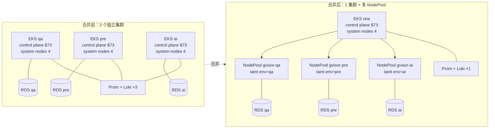
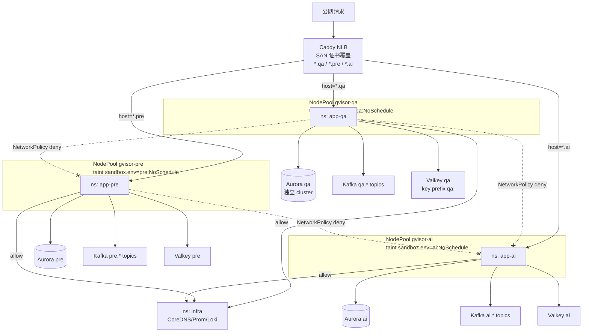

> **元信息**
> - 适用规模：3-5 个相似业务集群 / 总节点数 30-150
> - 适用云：AWS EKS / 阿里云 ACK / 自建 K8s
> - 运维负担：合并期 1-2 人 × 2-4 周；稳定后单人即可维护
> - 月成本节省：典型案例 200-500 USD / 集群（control plane + 中间件冗余 + 监控冗余）
> - 最后验证：2026-04-30，Karpenter v1.5.0 + EKS 1.31 + Cilium 1.16

## 适用场景

满足下面任意三条以上时，集群合并方案适用：

- 同一业务在不同环境（QA / PRE / Staging / Sandbox）各跑一个集群，架构同构
- 单集群节点数长期低于 10、平均利用率低于 30%
- 监控、日志、CSI、Ingress 这类辅助组件在每个集群都重复部署
- 平台版本升级（K8s 小版本、CNI、CSI、Ingress）每次都要重复做 N 次
- 团队希望保留环境隔离语义（namespace、网络、中间件），但不再为每个环境付一份基础设施账单

不适用的场景见文末「局限」一节。

## 核心问题

把多集群运维一年以上的团队，普遍会遇到下面三类浪费：

1. **节点利用率低**：每个集群至少要保留若干 system 节点（CoreDNS、metrics-server、CSI、Ingress Controller、kube-proxy 替代品），这些节点跟业务量没关系，加起来 6-8 个节点常驻。但实际业务 Pod 总量并不大，落到节点上 CPU 利用率长期低于 30%、内存利用率低于 50%，付的是「保留费」而不是「使用费」。
2. **重复跑监控与日志**：Prometheus、Loki、Promtail、Grafana Agent 在每个集群都开一份。指标抓取本身是固定成本，存储更是按集群线性增长的固定开销。三个集群的 Prometheus 加起来吃掉的内存往往是单集群的两倍以上，但产出的洞察并没有翻倍。
3. **平台升级要做 N 次**：升级 EKS 小版本、轮换 CNI 网络插件、给 Karpenter 加一类 NodePool、把 Ingress Controller 从 ALB 切到 Caddy，每个集群要重复一遍。每次升级都要走一次完整验证流程，工程师的注意力消耗远超技术工作本身。一年下来光是「等升级」就能耗掉一两个 sprint。

临时缓解手段常见的有把测试集群节点数缩到极限、用 Spot 实例兜底、用脚本批量同步 manifest，但这些都是单点止血，不解决「集群本身就是冗余」这个结构性问题。

真正想要的是：**一套 K8s 控制面 + 共享辅助组件 + 多个互相隔离的环境命名空间**。控制面合并节省固定成本，数据面（业务 Pod、网络、中间件）保留隔离防止污染。这个原则可以更精炼地表述为：**合并控制面，隔离数据面**。本文后续所有的方案选型与具体步骤都围绕这条原则展开，凡是动摇这条原则的捷径（比如「先共享中间件，反正测试环境无所谓」）最后都会以事故的形式收回成本，本文末尾的踩坑章节会用一个真实事故说明这点。

## 方案对比

| 候选方案 | 适用 | 淘汰理由 |
|----------|------|----------|
| 维持多集群，单独运维 | 强合规 / 不同业务线 / 跨地域 | 固定成本浪费 + 升级负担线性增长 |
| 合并到一个集群，仅 namespace 隔离 | 内部工具 / 单一团队 | 缺乏网络与中间件隔离，跨环境污染概率高 |
| 合并到一个集群 + 四层隔离（NodePool + namespace + NetworkPolicy + 中间件独立） | 多环境同业务 | 维护略复杂，但隔离强度接近原多集群 |

### 候选 1：维持多集群，单独运维

这是默认状态。每个环境独立 K8s 集群、独立 control plane、独立 worker、独立中间件。**适用**于跨地域容灾、强合规要求（PCI / SOC2 边界）、不同业务线（电商 / 金融 / 内部工具）。**淘汰理由**：在「同一业务的多个环境」这个语境下，集群之间的差异只是数据，运行的代码、监控规则、Ingress 规则几乎一致，多集群带来的隔离收益小于运维成本。

### 候选 2：合并到一个集群，仅 namespace 隔离

把所有环境塞进一个集群，每个环境一个 namespace，靠 RBAC 与 ResourceQuota 划分边界。**适用**于内部工具、对隔离强度要求很低的开发集群。**淘汰理由**：namespace 默认不做网络隔离，A 命名空间的 Pod 可以随手 curl 到 B 命名空间的 Service；如果业务又共享了 RabbitMQ、Kafka、Redis、RDS，那就只剩「逻辑边界」，跨环境污染只是时间问题，本文末尾的踩坑章节有一个真实事故。

### 候选 3：合并到一个集群 + 多层隔离（推荐）

合并控制面，但在数据面保留四层隔离：NodePool taint 做物理隔离 + Namespace 做逻辑边界 + NetworkPolicy 做网络隔离 + 中间件独立做数据隔离。**适用**于同一业务的多个测试环境（QA / PRE / Sandbox / Demo），合并后保留环境语义。**取舍**：维护成本比方案 2 略高（多了 NodePool yaml、NetworkPolicy、中间件 endpoint 管理），但隔离强度接近多集群方案。

下面的「推荐架构」与「实施步骤」围绕方案 3 展开。

## 推荐架构

### 合并前 vs 合并后



### 流量与隔离全景



关键决策点：

- **控制面共享**：API Server、Karpenter、ArgoCD、Prometheus、Loki 全部一份，主要省钱来源
- **NodePool 物理隔离**：每个环境独立 NodePool + taint，避免跨环境抢占资源
- **Namespace + NetworkPolicy 默认拒绝**：跨 namespace 网络默认 deny，按服务依赖打开
- **中间件不能共享**：RDS / RabbitMQ / Kafka / Redis 必须独立实例，或独立 schema/topic/key prefix。这是本文最重要的结论
- **统一 Ingress**：合并后只跑一份 Caddy NLB，TLS 证书改成多 SAN 一次覆盖三个环境

值得展开说一下「为什么 NodePool 物理隔离不能省」。直观上看，所有节点放一个池子里、调度器自由分配是最高效的，但实际场景下有两个绕不开的问题：一是不同环境的资源使用模式差异很大，QA 经常是脉冲式的批量构建任务、PRE 是接近生产的稳定流量、AI 沙箱是冷启动密集型，混在一起调度器很难做出最优决策；二是合并的目标本来就是「保留环境隔离语义」，节点级别的混布会让一次内核 bug 或 kubelet 异常同时影响多个环境，把分散的故障变成集中的故障。NodePool taint 不会显著增加成本（Karpenter 的弹性会让节点数动态调整），但显著降低跨环境耦合，几乎是免费的隔离收益。

## 实施步骤

### 步骤 0：合并前评估脚本

合并前必须把下面四类信息列清楚，缺一个都会在切换日炸一个坑：隔离边界、共享资源、辅助组件清单、业务表自增 ID 现状。这一步是整个 Playbook 里最容易被跳过、却最影响最终成败的环节，宁可多花两天也不要省。

**前置要求**：

- AWS CLI v2.x 已配置，IAM 拥有 `eks:DescribeCluster`、`eks:ListNodegroups`、`rds:Describe*` 权限
- 本地装好 `kubectl`、`python3`、`jq`、`mysql client`
- 三个集群的 kubectl context 都已配置（`kubectl config get-contexts` 看得到）
- 各环境 RDS 只读账号已开通

**执行**：把下面三个脚本依次跑完，结果存到 `~/cluster-merge-report/`，作为后续合并日的基线数据，事故时可以拿来对比。

#### 0.1 各集群资源使用量统计

```bash
mkdir -p ~/cluster-merge-report
cat > ~/cluster-merge-report/collect-usage.py <<'PYEOF'
#!/usr/bin/env python3
# collect-usage.py - 拉三个集群的节点 / Pod / 资源使用量
# 用法：./collect-usage.py <ctx_qa> <ctx_pre> <ctx_ai>
import json
import subprocess
import sys
from pathlib import Path

if len(sys.argv) != 4:
    print("用法：collect-usage.py <ctx_qa> <ctx_pre> <ctx_ai>")
    sys.exit(1)

CTXS = {"qa": sys.argv[1], "pre": sys.argv[2], "ai": sys.argv[3]}
OUT = Path.home() / "cluster-merge-report"
OUT.mkdir(parents=True, exist_ok=True)


def kc(ctx, *args):
    cmd = ["kubectl", "--context", ctx] + list(args)
    return subprocess.run(cmd, capture_output=True, text=True, check=True).stdout


for env, ctx in CTXS.items():
    print(f"==> 收集 {env} (context={ctx})")
    nodes = json.loads(kc(ctx, "get", "nodes", "-o", "json"))
    pods = json.loads(kc(ctx, "get", "pods", "-A", "-o", "json"))

    summary = {
        "env": env,
        "node_count": len(nodes["items"]),
        "node_instance_types": {},
        "pod_count_by_ns": {},
        "cpu_request_total_milli": 0,
        "mem_request_total_mi": 0,
    }
    for n in nodes["items"]:
        it = n["metadata"]["labels"].get("node.kubernetes.io/instance-type", "unknown")
        summary["node_instance_types"][it] = summary["node_instance_types"].get(it, 0) + 1

    for p in pods["items"]:
        ns = p["metadata"]["namespace"]
        summary["pod_count_by_ns"][ns] = summary["pod_count_by_ns"].get(ns, 0) + 1
        for c in p["spec"].get("containers", []):
            req = c.get("resources", {}).get("requests", {})
            cpu = req.get("cpu", "0")
            mem = req.get("memory", "0")
            # 简化解析：只处理 m/Mi 单位
            if cpu.endswith("m"):
                summary["cpu_request_total_milli"] += int(cpu[:-1])
            elif cpu and cpu != "0":
                summary["cpu_request_total_milli"] += int(float(cpu) * 1000)
            if mem.endswith("Mi"):
                summary["mem_request_total_mi"] += int(mem[:-2])
            elif mem.endswith("Gi"):
                summary["mem_request_total_mi"] += int(mem[:-2]) * 1024

    out_file = OUT / f"usage-{env}.json"
    out_file.write_text(json.dumps(summary, indent=2))
    print(f"    写入 {out_file}")
    print(f"    nodes={summary['node_count']} pods={sum(summary['pod_count_by_ns'].values())} "
          f"cpu_req={summary['cpu_request_total_milli']}m mem_req={summary['mem_request_total_mi']}Mi")
PYEOF
chmod +x ~/cluster-merge-report/collect-usage.py
~/cluster-merge-report/collect-usage.py eks-qa eks-pre eks-ai
```

**验证**：

```bash
ls -la ~/cluster-merge-report/usage-*.json
# 期望看到 usage-qa.json / usage-pre.json / usage-ai.json
jq '.node_count, .pod_count_by_ns | length' ~/cluster-merge-report/usage-qa.json
```

**回滚**：仅读取，无副作用，删文件即可。

#### 0.2 共享中间件清单

```bash
cat > ~/cluster-merge-report/list-middleware.sh <<'BASH'
#!/bin/bash
# list-middleware.sh - 扫三个环境的 Nacos / ConfigMap / Secret 找中间件 endpoint
set -euo pipefail
OUT=~/cluster-merge-report/middleware.tsv
echo -e "env\tservice\ttype\tendpoint" > "$OUT"

for env in qa pre ai; do
  ctx="eks-$env"
  # 扫 ConfigMap 里的 endpoint 关键字
  kubectl --context "$ctx" get configmap -A -o json | \
    jq -r --arg env "$env" '
      .items[] |
      select(.data != null) |
      .metadata as $m |
      .data | to_entries[] |
      select(.value | tostring | test("rds|rabbitmq|kafka|redis|valkey|aurora"; "i")) |
      [$env, $m.namespace + "/" + $m.name, .key, (.value | tostring | .[0:120])] |
      @tsv' >> "$OUT" || true
done

echo "==> 输出 $OUT，共 $(wc -l < "$OUT") 行"
echo "==> 重点关注 endpoint 在多个 env 行里出现 = 共享中间件"
sort -k4 "$OUT" | awk -F'\t' '{print $4}' | sort | uniq -c | sort -rn | head -20
BASH
chmod +x ~/cluster-merge-report/list-middleware.sh
~/cluster-merge-report/list-middleware.sh
```

**验证**：跑完后 stdout 会列出各 endpoint 出现次数，`count >= 2` 的就是跨环境共享，必须独立化。

#### 0.3 业务表 ID 起点检查 SQL

```sql
-- 在每个环境的 RDS 上跑一次，对比 max(id) 与 min(id)
-- 重点关注 "新环境 max(id)" 是否落在 "老环境历史 id" 区间内
SELECT
    'qa' AS env,
    'm_project' AS table_name,
    MIN(id) AS min_id,
    MAX(id) AS max_id,
    COUNT(*) AS rows
FROM service_a_qa.m_project
UNION ALL
SELECT 'pre', 'm_project', MIN(id), MAX(id), COUNT(*) FROM service_a_pre.m_project
UNION ALL
SELECT 'ai',  'm_project', MIN(id), MAX(id), COUNT(*) FROM service_a_ai.m_project;
```

**判定**：

- 任意两个环境的 `[min_id, max_id]` 区间有重叠 → 高风险，必须在合并前错开 ID 起点（见步骤 4）
- 重叠且其中一个环境的 max < 1000 → 极高风险，几乎必然撞车
- 跨表关联检查：`m_project.id` 撞车的同时还要看 `m_realtime_messages.project_id` 是否真的有跨环境引用，索引上扫一遍最快

把这一步的判定结果写到 `~/cluster-merge-report/id-overlap.md` 里，作为合并日是否需要做 ID 起点错开的依据。如果三个环境的 ID 区间已经天然错开（比如生产线上每个环境都从不同基数开始），可以省掉步骤 4。

### 步骤 1：NodePool 隔离设计完整 yaml

**前置要求**：

- Karpenter v1.5.0 已部署到目标集群
- 子网 / SecurityGroup ID 已记录
- IAM Role `KarpenterNodeRole-<cluster>` 已创建

**执行**：每个环境一个 NodePool + 配套 EC2NodeClass。

#### 1.1 EC2NodeClass（gvisor-pre 示例，三个环境各拷贝一份改名）

```yaml
---
apiVersion: karpenter.k8s.aws/v1
kind: EC2NodeClass
metadata:
  name: gvisor-pre
spec:
  amiFamily: AL2
  amiSelectorTerms:
    - alias: al2@latest
  subnetSelectorTerms:
    - tags:
        karpenter.sh/discovery: "merged-cluster"
        Tier: private
  securityGroupSelectorTerms:
    - tags:
        karpenter.sh/discovery: "merged-cluster"
  role: "KarpenterNodeRole-merged-cluster"
  tags:
    Environment: pre
    NodePool: gvisor-pre
    karpenter.sh/discovery: "merged-cluster"
  blockDeviceMappings:
    - deviceName: /dev/xvda
      ebs:
        volumeType: gp3
        volumeSize: 100Gi
        encrypted: true
        deleteOnTermination: true
  userData: |
    #!/bin/bash
    set -euo pipefail

    # 挂载本环境独占 EFS（每个环境独立 EFS，禁止跨 VPC 复用，详见踩坑 4）
    EFS_DNS="fs-054af543525c9e06a.efs.ap-southeast-1.amazonaws.com"
    mkdir -p /mnt/user
    cat >> /etc/fstab <<FSEOF
    ${EFS_DNS}:/ /mnt/user nfs4 nfsvers=4.1,rsize=1048576,wsize=1048576,hard,timeo=600,retrans=2,_netdev 0 0
    FSEOF

    # 防 mnt-user.mount hard-hang（已知坑：默认 30s timeout 不够，调到 180s）
    mkdir -p /etc/systemd/system/mnt-user.mount.d
    cat > /etc/systemd/system/mnt-user.mount.d/override.conf <<UNITEOF
    [Mount]
    TimeoutSec=180
    UNITEOF
    systemctl daemon-reload
    mount -a || true
```

#### 1.2 NodePool（gvisor-pre 示例）

```yaml
---
apiVersion: karpenter.sh/v1
kind: NodePool
metadata:
  name: gvisor-pre
spec:
  template:
    metadata:
      labels:
        sandbox.env: pre
        sandbox.gvisor/enabled: "true"
    spec:
      nodeClassRef:
        group: karpenter.k8s.aws
        kind: EC2NodeClass
        name: gvisor-pre
      taints:
        - key: sandbox.env
          value: pre
          effect: NoSchedule
      requirements:
        - key: kubernetes.io/arch
          operator: In
          values: ["amd64"]
        - key: karpenter.sh/capacity-type
          operator: In
          values: ["on-demand"]
        - key: node.kubernetes.io/instance-type
          operator: In
          values: ["m6i.xlarge", "m6i.2xlarge", "m6a.xlarge", "m6a.2xlarge"]
        - key: topology.kubernetes.io/zone
          operator: In
          values: ["ap-southeast-1a", "ap-southeast-1b"]
      expireAfter: 720h
  limits:
    cpu: 16
    memory: 64Gi
  disruption:
    consolidationPolicy: WhenEmpty
    consolidateAfter: 10m
```

QA / AI 拷贝同结构改 `name`、label `sandbox.env`、taint value 即可。三个 NodePool 的 `nodeClassRef` 必须指向各自的 EC2NodeClass，绝不能复用同一个，因为 EC2NodeClass 里的 EFS 挂载点、IAM Role、subnet 选择都是环境绑定的。

NodePool 的 `limits` 字段是「这一类节点最多扩到多少」的硬上限，按业务峰值的 1.5 倍设置即可，太小会触发 Pending，太大会让一个环境的暴增吃掉别的环境的预算。Karpenter v1.5 的 `consolidationPolicy: WhenEmpty` 配合 `consolidateAfter: 10m` 是相对保守的合并策略，避免节点被频繁拆建影响业务。如果业务流量起伏剧烈，可以缩短到 5m；如果业务对节点冷启动延迟敏感（例如沙箱场景），可以延长到 20m。

#### 1.3 业务 Deployment 完整调度示例（pre 环境）

```yaml
---
apiVersion: apps/v1
kind: Deployment
metadata:
  name: service-foo
  namespace: app-pre
spec:
  replicas: 2
  selector:
    matchLabels:
      app: service-foo
  template:
    metadata:
      labels:
        app: service-foo
        sandbox.env: pre
    spec:
      tolerations:
        - key: sandbox.env
          operator: Equal
          value: pre
          effect: NoSchedule
      affinity:
        nodeAffinity:
          requiredDuringSchedulingIgnoredDuringExecution:
            nodeSelectorTerms:
              - matchExpressions:
                  - key: sandbox.env
                    operator: In
                    values: ["pre"]
      containers:
        - name: app
          image: <ACCOUNT_ID>.dkr.ecr.ap-southeast-1.amazonaws.com/service-foo:v1.2.3
          resources:
            requests:
              cpu: 200m
              memory: 256Mi
            limits:
              cpu: 1000m
              memory: 1Gi
```

#### 1.4 跨 NodePool 调度反例（千万别这么写）

```yaml
# ❌ 错误示范：nodeSelector 写宽泛 label，会同时匹配 qa / pre / ai 三个 NodePool
spec:
  nodeSelector:
    sandbox.gvisor/enabled: "true"   # 这个 label 三个 NodePool 都有
  # 没有 toleration 时调度直接失败；
  # 加了通配 toleration 时业务 Pod 可能跑到 qa 节点上消费 pre 数据 → 灾难
  tolerations:
    - operator: Exists                # ❌ 容忍所有 taint，相当于裸奔
```

**正确写法**：`nodeAffinity` 必须用精确 `sandbox.env: pre`，`tolerations` 必须指定 key/value 双匹配。这里有一个相对隐蔽的反向陷阱：业务 Pod 的 `nodeSelector` 如果是「sandbox.gvisor/enabled=true」这种宽泛标签，会同时匹配 qa / pre / ai 三个 NodePool，调度器随机选一个，结果就是 PRE 的业务 Pod 跑在 QA 的节点上消费 PRE 的数据，节点机器视角看流量正常，业务视角看错乱。一旦发现这种现象，第一时间检查所有业务 Deployment 的 `nodeSelector` 和 `nodeAffinity`，把所有「能匹配多个 NodePool」的 label 都收紧到精确值。

**验证**：

```bash
kubectl --context merged get nodes -L sandbox.env
# 期望：每个节点 SANDBOX.ENV 列分别显示 qa / pre / ai
kubectl --context merged get pod -n app-pre -o wide | awk '{print $7}' | xargs -I{} kubectl --context merged get node {} -L sandbox.env --no-headers
# 期望：所有 pod 所在节点的 sandbox.env 都是 pre
```

**回滚**：

```bash
kubectl --context merged delete nodepool gvisor-pre
kubectl --context merged delete ec2nodeclass gvisor-pre
# Karpenter 会自动回收节点，业务 Pod 转 Pending 直到换 NodePool
```

### 步骤 2：Cilium NetworkPolicy 完整 yaml

K8s 默认网络是「全联通」的，namespace 边界对网络流量没有任何约束。合并集群之前各环境物理隔离，这条默认行为不会出问题；合并之后必须用 NetworkPolicy（推荐 Cilium 实现，因为它支持 L7 策略和更直观的 Hubble 流量观测）显式拒绝跨 namespace 流量，再按服务依赖逐条放行。这里的核心思路是「白名单优先」：先让所有跨 ns 流量被 deny，再针对必要的依赖关系开放，宁可多写几条策略也不要省一条 deny。

**前置要求**：

- Cilium 1.16+ 已部署，`enableHubble=true` 便于排错
- 三个 namespace 已建好：`app-qa`、`app-pre`、`app-ai`
- 基础设施 namespace `infra` 跑 CoreDNS / Prometheus / Loki

#### 2.1 默认拒绝跨 namespace 流量

```yaml
---
apiVersion: cilium.io/v2
kind: CiliumNetworkPolicy
metadata:
  name: default-deny-cross-ns
  namespace: app-pre
spec:
  endpointSelector: {}        # 匹配 ns 内所有 endpoint
  ingress:
    # 仅允许同 ns 流量
    - fromEndpoints:
        - matchLabels:
            k8s:io.kubernetes.pod.namespace: app-pre
    # 允许 infra ns（监控 / DNS 探针）
    - fromEndpoints:
        - matchLabels:
            k8s:io.kubernetes.pod.namespace: infra
  egress:
    # 允许同 ns
    - toEndpoints:
        - matchLabels:
            k8s:io.kubernetes.pod.namespace: app-pre
    # 允许 kube-system 的 CoreDNS（DNS 解析必备）
    - toEndpoints:
        - matchLabels:
            k8s:io.kubernetes.pod.namespace: kube-system
            k8s-app: kube-dns
      toPorts:
        - ports:
            - port: "53"
              protocol: UDP
            - port: "53"
              protocol: TCP
    # 允许 infra ns（向 Prom 上报 metrics）
    - toEndpoints:
        - matchLabels:
            k8s:io.kubernetes.pod.namespace: infra
    # 允许出站到外部 RDS / Kafka / Valkey（按 CIDR 白名单）
    - toCIDRSet:
        - cidr: 10.51.0.0/16     # pre 环境中间件 VPC
```

QA / AI 三份各自一套（替换 `app-pre` 为 `app-qa` / `app-ai`，CIDR 替换为各自中间件子网）。

#### 2.2 业务服务白名单（细粒度）

```yaml
---
apiVersion: cilium.io/v2
kind: CiliumNetworkPolicy
metadata:
  name: service-foo-allow-bar
  namespace: app-pre
spec:
  endpointSelector:
    matchLabels:
      app: service-foo
  ingress:
    # 仅允许 service-bar 调 service-foo 的 8080
    - fromEndpoints:
        - matchLabels:
            app: service-bar
            k8s:io.kubernetes.pod.namespace: app-pre
      toPorts:
        - ports:
            - port: "8080"
              protocol: TCP
```

**验证**：

```bash
# pre 的 Pod 不应该能 ping 通 ai 的 Service
kubectl --context merged exec -n app-pre deploy/service-foo -- \
  curl -m 3 http://service-foo.app-ai.svc.cluster.local:8080/healthz
# 期望：超时或 connection refused
# Hubble 看流量被 deny 的明细
hubble observe --namespace app-pre --verdict DROPPED --last 50
```

**回滚**：

```bash
kubectl --context merged delete cnp default-deny-cross-ns -n app-pre
# 立即恢复跨 ns 默认放行
```

### 步骤 3：中间件独立化操作

中间件独立是合并方案里最关键的一步，也是最容易因为「省钱」而被砍掉的一步。本文反复强调：**控制面合并节省固定成本，数据面（包括中间件）保留隔离防止污染**。共享 RDS 可以省一两百美元一个月，但一次跨环境数据污染的清洗工作量、用户信任度损失，远远超过这个数字。下面四类中间件按隔离强度从高到低分别给出独立化方案，原则是「能独立实例就独立实例，不能独立实例至少独立 logical 边界 + 强校验」。

#### 3.1 Aurora 独立实例创建（PRE 示例）

```bash
#!/bin/bash
# create-aurora-pre.sh - 给 pre 环境建独立 Aurora MySQL cluster
set -euo pipefail

REGION=ap-southeast-1
CLUSTER_ID=service_a-pre-aurora
SG_ID=sg-xxxxxxxxxxxxx
SUBNET_GROUP=service_a-pre-db-subnet
MASTER_USER=admin
MASTER_PASS_SECRET_ARN=arn:aws:secretsmanager:${REGION}:<ACCOUNT_ID>:secret:rds-pre-master

# 1. 建 cluster
aws rds create-db-cluster \
  --region "$REGION" \
  --db-cluster-identifier "$CLUSTER_ID" \
  --engine aurora-mysql \
  --engine-version 8.0.mysql_aurora.3.06.0 \
  --master-username "$MASTER_USER" \
  --manage-master-user-password \
  --master-user-secret-kms-key-id alias/aws/secretsmanager \
  --vpc-security-group-ids "$SG_ID" \
  --db-subnet-group-name "$SUBNET_GROUP" \
  --backup-retention-period 7 \
  --storage-encrypted \
  --tags Key=Environment,Value=pre

# 2. 建 instance
aws rds create-db-instance \
  --region "$REGION" \
  --db-cluster-identifier "$CLUSTER_ID" \
  --db-instance-identifier "${CLUSTER_ID}-instance-1" \
  --db-instance-class db.t4g.medium \
  --engine aurora-mysql

# 3. 等待就绪并打印 endpoint
aws rds wait db-instance-available \
  --region "$REGION" \
  --db-instance-identifier "${CLUSTER_ID}-instance-1"

aws rds describe-db-clusters \
  --region "$REGION" \
  --db-cluster-identifier "$CLUSTER_ID" \
  --query 'DBClusters[0].{Endpoint:Endpoint,Reader:ReaderEndpoint}' \
  --output table
```

**验证**：

```bash
mysql -h <CLUSTER_ID>.cluster-xxx.ap-southeast-1.rds.amazonaws.com -u admin -p \
  -e "SELECT @@version, @@hostname;"
# 期望返回 8.0.x 版本
```

**回滚**：

```bash
aws rds delete-db-instance --db-instance-identifier service_a-pre-aurora-instance-1 --skip-final-snapshot
aws rds delete-db-cluster --db-cluster-identifier service_a-pre-aurora --skip-final-snapshot
```

#### 3.2 Kafka topic 命名前缀脚本

```bash
#!/bin/bash
# kafka-topic-rename.sh - 给共享 MSK 集群的 topic 加环境前缀
# 前置：本机已装 kafka-topics.sh，KAFKA_BOOTSTRAP 已 export
set -euo pipefail

ENV="${1:-}"
[[ -z "$ENV" ]] && { echo "用法：$0 <qa|pre|ai>"; exit 1; }

KAFKA_BOOTSTRAP="${KAFKA_BOOTSTRAP:?需要 export KAFKA_BOOTSTRAP=broker:9092}"

# 1. 列现有 topic
existing=$(kafka-topics.sh --bootstrap-server "$KAFKA_BOOTSTRAP" --list)

# 2. 找没有前缀的 topic（潜在共享风险）
echo "==> 没有环境前缀的 topic（需要重命名或迁移）："
echo "$existing" | grep -vE '^(qa|pre|ai)\.' || echo "（无）"

# 3. 给本环境 topic 建带前缀的 + 6 partitions + replication=3
for raw in agent-msg dispatch-event meter-stat; do
  new="${ENV}.${raw}"
  if echo "$existing" | grep -q "^${new}$"; then
    echo "  ${new} 已存在，跳过"
  else
    kafka-topics.sh --bootstrap-server "$KAFKA_BOOTSTRAP" \
      --create --topic "$new" \
      --partitions 6 --replication-factor 3 \
      --config retention.ms=604800000
    echo "  建好 ${new}"
  fi
done

# 4. 检查 consumer group 是否带前缀
echo "==> consumer group 前缀检查："
kafka-consumer-groups.sh --bootstrap-server "$KAFKA_BOOTSTRAP" --list | \
  grep -vE "^${ENV}\." | grep -E '^(qa|pre|ai)\.' && \
  echo "  ⚠️ 发现跨环境 consumer group，业务代码 group.id 必须带 ${ENV}. 前缀"
```

#### 3.3 Redis / Valkey prefix 强制约束

业务代码层（Go 示例）：

```go
package cache

import (
    "fmt"
    "os"
    "strings"

    "github.com/redis/go-redis/v9"
)

// envPrefix 从环境变量读，启动时强制校验
func envPrefix() string {
    p := os.Getenv("CACHE_KEY_PREFIX")
    if p == "" || !strings.HasSuffix(p, ":") {
        panic("CACHE_KEY_PREFIX must be set and end with ':' (e.g. 'pre:')")
    }
    return p
}

// 统一的 client wrapper，所有 Get/Set 强制加前缀
type SafeClient struct {
    cli    *redis.Client
    prefix string
}

func NewSafeClient(cli *redis.Client) *SafeClient {
    return &SafeClient{cli: cli, prefix: envPrefix()}
}

func (s *SafeClient) Set(ctx context.Context, key string, val any, ttl time.Duration) error {
    return s.cli.Set(ctx, s.prefix+key, val, ttl).Err()
}

func (s *SafeClient) Get(ctx context.Context, key string) (string, error) {
    return s.cli.Get(ctx, s.prefix+key).Result()
}

// 启动检查：扫一遍 Redis，发现没前缀的旧 key 直接 panic
func (s *SafeClient) AssertNoLegacyKeys(ctx context.Context) error {
    iter := s.cli.Scan(ctx, 0, "*", 1000).Iterator()
    for iter.Next(ctx) {
        k := iter.Val()
        if !strings.HasPrefix(k, s.prefix) {
            return fmt.Errorf("legacy key without prefix found: %s (env=%s)", k, s.prefix)
        }
    }
    return iter.Err()
}
```

配置中心层（Nacos）强制审计：

```bash
#!/bin/bash
# nacos-prefix-audit.sh - 扫所有服务的 Nacos 配置，确认 cache.key_prefix 字段存在
set -euo pipefail

NACOS_ADDR=${NACOS_ADDR:?need NACOS_ADDR}
NAMESPACE=$1     # us-pre / us-qa / us-ai
EXPECTED_PREFIX=$2   # pre: / qa: / ai:

services=$(curl -s "${NACOS_ADDR}/nacos/v1/cs/configs?dataId=&group=&search=blur&pageNo=1&pageSize=200&tenant=${NAMESPACE}" | \
  jq -r '.pageItems[].dataId')

for svc in $services; do
  cfg=$(curl -s "${NACOS_ADDR}/nacos/v1/cs/configs?dataId=${svc}&group=DEFAULT_GROUP&tenant=${NAMESPACE}")
  if ! echo "$cfg" | grep -q "key_prefix.*${EXPECTED_PREFIX}"; then
    echo "❌ ${svc} 缺少 cache.key_prefix=${EXPECTED_PREFIX}"
  fi
done
```

### 步骤 4：业务 ID 起点错开 SQL

如果步骤 0.3 的检查结果显示有 ID 区间重叠，必须在合并日之前完成这一步。原理是：**让两个环境的自增 ID 永不交集**，从根本上消除「跨环境 ID 撞车 + 共享中间件」这一类污染的物理基础。即使后续中间件因为某些历史原因还是共享了，撞车的概率也会被压到接近零。常见的实践是新环境从 10000000 起步，老环境保持原状；如果是新建多环境，可以一开始就给每个环境分配 1e7 量级的不同段位（QA: 1e7 ~ 2e7、PRE: 2e7 ~ 3e7、AI: 3e7 ~ 4e7）。

**前置要求**：

- 已确认两个环境的 `m_project.id` 区间存在重叠（步骤 0.3）
- 已通知业务方，操作期间禁止写新行（或选业务低峰期）
- 已备份目标表

#### 4.1 错开 AUTO_INCREMENT 起点

```sql
-- 在 AI 环境（id 起点低的那个）执行
-- 把后续新行的 id 起点提到 10000000，与 QA 历史 id 区间错开
USE service_a_ai;

-- 1. 备份当前 max(id)
SELECT 'before', MAX(id), AUTO_INCREMENT
  FROM information_schema.TABLES
  JOIN service_a_ai.m_project ON TABLE_NAME='m_project'
  WHERE TABLE_SCHEMA='service_a_ai' AND TABLE_NAME='m_project';

-- 2. 抬高 AUTO_INCREMENT
ALTER TABLE service_a_ai.m_project AUTO_INCREMENT = 10000000;
ALTER TABLE service_a_ai.m_realtime_messages AUTO_INCREMENT = 10000000;
ALTER TABLE service_a_ai.m_fastagent_messages AUTO_INCREMENT = 10000000;
ALTER TABLE service_a_ai.m_context_messages AUTO_INCREMENT = 10000000;

-- 3. 验证
SELECT TABLE_NAME, AUTO_INCREMENT
  FROM information_schema.TABLES
  WHERE TABLE_SCHEMA='service_a_ai'
    AND TABLE_NAME IN ('m_project','m_realtime_messages','m_fastagent_messages','m_context_messages');
-- 期望：AUTO_INCREMENT >= 10000000

-- 4. 插入一行测试
INSERT INTO service_a_ai.m_project (user_id, name, created_at)
  VALUES (99, '__id_check__', NOW());
SELECT id FROM service_a_ai.m_project WHERE name='__id_check__';
-- 期望：id >= 10000000
DELETE FROM service_a_ai.m_project WHERE name='__id_check__' LIMIT 1;
```

#### 4.2 dispatch_env 字段加默认值 + NOT NULL

```sql
-- 给所有跨环境消息表加 dispatch_env 字段，作为防御层
-- 即使 broker 撞了，消费端也能按 dispatch_env 过滤

ALTER TABLE service_a_ai.m_realtime_messages
  ADD COLUMN dispatch_env VARCHAR(16) NOT NULL DEFAULT 'ai' AFTER project_id,
  ADD INDEX idx_dispatch_env (dispatch_env);

ALTER TABLE service_a_ai.m_fastagent_messages
  ADD COLUMN dispatch_env VARCHAR(16) NOT NULL DEFAULT 'ai' AFTER project_id,
  ADD INDEX idx_dispatch_env (dispatch_env);

-- QA 环境同步加，默认值 'qa'
ALTER TABLE service_a_qa.m_realtime_messages
  ADD COLUMN dispatch_env VARCHAR(16) NOT NULL DEFAULT 'qa' AFTER project_id,
  ADD INDEX idx_dispatch_env (dispatch_env);

-- 验证
SELECT TABLE_SCHEMA, TABLE_NAME, COLUMN_NAME, COLUMN_DEFAULT, IS_NULLABLE
  FROM information_schema.COLUMNS
  WHERE COLUMN_NAME='dispatch_env';
-- 期望：IS_NULLABLE=NO，COLUMN_DEFAULT 是 'ai' 或 'qa'
```

#### 4.3 历史数据 backfill 脚本

```sql
-- 老数据没有 dispatch_env，先用 created_at 推断
-- 业务上线前的历史消息全部回填为本环境标识
UPDATE service_a_ai.m_realtime_messages
   SET dispatch_env = 'ai'
   WHERE dispatch_env = '' OR dispatch_env IS NULL;
-- 影响行数应等于历史总行数

UPDATE service_a_qa.m_realtime_messages
   SET dispatch_env = 'qa'
   WHERE dispatch_env = '' OR dispatch_env IS NULL;

-- 验证：每个表 dispatch_env 唯一值数量 = 1
SELECT dispatch_env, COUNT(*) FROM service_a_ai.m_realtime_messages GROUP BY dispatch_env;
SELECT dispatch_env, COUNT(*) FROM service_a_qa.m_realtime_messages GROUP BY dispatch_env;
```

### 步骤 5：迁移顺序的具体步骤

迁移顺序遵循「**风险从低到高**」原则。每一批迁移完成后留 3-7 天观察期再做下一批，中间任何一批出现稳定性问题，立即停下排查根因，不要赶进度。整个迁移过程从开始到完成预计 3-4 周，其中实际操作时间不到两天，剩下都是观察期。这个比例是合理的：合并集群的失败成本很高，但失败往往不是立刻爆发，而是几天后某个被忽略的辅助组件以诡异方式现形（参见踩坑 2）。

按风险从低到高分三批，每批之间留观察期。

#### 5.1 第一批：非生产业务（Sandbox / Demo / 开发自助）

**执行**：

```bash
# 1. 在新集群建 namespace
kubectl --context merged apply -f - <<EOF
---
apiVersion: v1
kind: Namespace
metadata:
  name: app-sandbox-pre
  labels:
    sandbox.env: pre
    pod-security.kubernetes.io/enforce: baseline
EOF

# 2. 应用 GitOps overlay
kubectl --context merged apply -f gitops/clusters/merged/applications/sandbox-pre/

# 3. 等业务 Pod 全 Running
kubectl --context merged wait --for=condition=Available --timeout=600s \
  -n app-sandbox-pre deploy --all
```

**验证清单**（必须全过）：

- [ ] `kubectl get pod -n app-sandbox-pre` 全部 Running
- [ ] 业务对外域名 DNS 解析到新 NLB
- [ ] 创建一个测试 sandbox，端到端跑完
- [ ] Prometheus 抓到新 ns 的 metrics（`up{namespace="app-sandbox-pre"}` ≥ 1）
- [ ] Loki 抓到新 ns 日志（`{namespace="app-sandbox-pre"}` 有新日志）
- [ ] NetworkPolicy 生效：从其他 ns curl 失败

**回滚**：

```bash
# 删 Application 触发资源回收
kubectl --context merged delete -f gitops/clusters/merged/applications/sandbox-pre/
# DNS 切回旧集群
aws route53 change-resource-record-sets --hosted-zone-id ZXXX --change-batch file://rollback-dns.json
```

#### 5.2 第二批：QA 主业务（canary 灰度）

```yaml
---
# 用 Argo Rollouts 做 canary
apiVersion: argoproj.io/v1alpha1
kind: Rollout
metadata:
  name: service-foo
  namespace: app-qa
spec:
  replicas: 5
  strategy:
    canary:
      steps:
        - setWeight: 10
        - pause: { duration: 10m }
        - setWeight: 30
        - pause: { duration: 30m }
        - setWeight: 60
        - pause: { duration: 1h }
        - setWeight: 100
      analysis:
        templates:
          - templateName: error-rate
        startingStep: 1
        args:
          - name: service-name
            value: service-foo
  selector:
    matchLabels:
      app: service-foo
  template:
    metadata:
      labels:
        app: service-foo
    spec:
      tolerations:
        - key: sandbox.env
          operator: Equal
          value: qa
          effect: NoSchedule
      containers:
        - name: app
          image: <ACCOUNT_ID>.dkr.ecr.ap-southeast-1.amazonaws.com/service-foo:v1.2.3
```

**验证**：每个 pause 阶段对比新旧 Pod 的错误率与 P95 延迟，任何指标恶化立刻 `kubectl argo rollouts abort`。

#### 5.3 第三批：PRE 主业务（无灰度，需停机窗口）

PRE 有数据迁移环节（EFS rsync / Aurora 切换），按一次完整 cutover 做：

```bash
#!/bin/bash
# pre-cutover.sh - PRE 集群切换，预计 T-0 停机 30-60 秒
set -euo pipefail

# T-30min: 把旧集群业务流量降到 30%（DNS TTL 已改 60s）
# T-10min: 应用层 readonly
kubectl --context old-pre annotate deploy -n app-pre service-foo readonly=true --overwrite

# T-5min: rsync EFS 增量
rsync -avz --delete /mnt/old-efs/usersandbox-pvc-/ /mnt/new-efs/usersandbox-pvc-/

# T-0: DNS 切换
aws route53 change-resource-record-sets --hosted-zone-id ZXXX --change-batch file://cutover-dns.json

# T+1min: 新集群业务起来
kubectl --context merged scale -n app-pre deploy/service-foo --replicas=5

# T+5min: 回写权限放开
kubectl --context merged annotate deploy -n app-pre service-foo readonly-

echo "==> Cutover 完成，开始 1-2 周观察期"
```

**验证**：

- [ ] 域名解析到新 NLB（`dig +short pre.example.aws.com`）
- [ ] 5xx 错误率 < 0.1%（合并前 baseline）
- [ ] 关键业务链路冒烟通过
- [ ] 无客户工单升级

**回滚**：

```bash
# DNS 切回旧 NLB
aws route53 change-resource-record-sets --hosted-zone-id ZXXX --change-batch file://rollback-dns.json
# 旧集群业务恢复
kubectl --context old-pre scale deploy -n app-pre service-foo --replicas=5
```

### 步骤 6：旧集群保留与下线

合并完成后旧集群不能立刻删，要保留一个观察期作为回滚兜底。具体保留多久取决于业务关键度：内部工具 7 天就够，QA 环境 14 天，PRE 环境建议 30 天。control plane（EKS 控制面）每月固定 73 USD 不算便宜，但相比一次紧急回滚不能用旧集群导致的事故，这个成本非常划算。下面给出 14 天的标准流程。

**N = 14 天**（典型值，根据业务关键度可拉长到 30 天）。

```bash
# 1. 合并完成后立即把旧集群 nodegroup 缩到 0（control plane 保留）
aws eks update-nodegroup-config \
  --cluster-name old-pre \
  --nodegroup-name app \
  --scaling-config minSize=0,maxSize=0,desiredSize=0 \
  --region ap-southeast-1

# 2. 14 天观察期内每天检查
for day in $(seq 1 14); do
  date
  kubectl --context merged get pod -n app-pre | grep -v Running && echo "⚠️ 有非 Running Pod" || echo "OK"
  # 抓客户工单 / Sentry 错误率
done

# 3. 观察期通过后下线旧集群
aws eks delete-nodegroup --cluster-name old-pre --nodegroup-name app
aws eks delete-cluster --name old-pre
# 旧 RDS / Valkey 留快照后再删
aws rds delete-db-cluster --db-cluster-identifier old-pre-aurora \
  --final-db-snapshot-identifier old-pre-aurora-final-$(date +%Y%m%d)
```

## 踩过的坑

下面四个坑都来自一次真实合并项目，每个都附完整修复。这四个坑的共同点是「合并日当天看不出来」：Pod 全部 Running、健康检查通过、监控告警没响、自动化测试也跑通。问题都是几天到几周之后才以诡异方式爆发，这是合并方案最危险的地方——它不会在你专注的时候出问题。所以四个坑里有三个的根因总结都指向同一句话：**操作之前要把假设写出来一项一项验证，不要靠常识判断**。

### 坑 1：共享 RabbitMQ + 自增 ID 撞车，10 万条脏消息污染老项目

**现象**：合并后某天，QA 环境内部测试用户反馈，自己 7 个月前的老项目突然多出大量 AI 助手对话记录，里面是其他用户今天的内容。受影响 10 个用户、150 个项目，QA 库 `m_realtime_messages` 表多出 91,403 行脏数据，3 个相关消息表合计约 10 万行。

**根因**（四件套同时成立才会触发）：

1. AI 环境 `m_project.id` 从 1 独立自增（最大才 274）
2. QA 环境 `m_project.id` 老项目大量在 1-274 区间（半年前的项目）
3. RabbitMQ broker + vhost 两个环境共用
4. 消费端按 `project_id` 数字写本地库，没有 `dispatch_env` 字段过滤跨环境消息

**完整修复 SQL**：

```sql
-- Step 1：备份脏数据（CTAS）
CREATE TABLE service_a_qa.m_realtime_messages_bak_20260418 AS
SELECT * FROM service_a_qa.m_realtime_messages
 WHERE project_id BETWEEN 1 AND 274
   AND created_at > '2026-03-25 00:00:00'   -- AI 环境上线日
   AND project_id IN (
       SELECT id FROM service_a_qa.m_project
        WHERE created_at < '2026-03-25 00:00:00'
   );

-- 备份表加主键，便于后续中转 DELETE
ALTER TABLE service_a_qa.m_realtime_messages_bak_20260418
  ADD PRIMARY KEY (id);

SELECT COUNT(*) AS dirty_rows FROM service_a_qa.m_realtime_messages_bak_20260418;
-- 期望：约 91,403 行

-- Step 2：临时表中转，避免一次大事务锁表
CREATE TABLE service_a_qa.dirty_ids_tmp (id BIGINT PRIMARY KEY);
INSERT INTO service_a_qa.dirty_ids_tmp (id)
  SELECT id FROM service_a_qa.m_realtime_messages_bak_20260418;

-- Step 3：分批 DELETE（每批 1000 行，避免长事务）
DELIMITER $$
CREATE PROCEDURE service_a_qa.cleanup_dirty()
BEGIN
  DECLARE done INT DEFAULT 0;
  REPEAT
    DELETE FROM service_a_qa.m_realtime_messages
     WHERE id IN (SELECT id FROM service_a_qa.dirty_ids_tmp LIMIT 1000);
    SET done = ROW_COUNT();
    DELETE FROM service_a_qa.dirty_ids_tmp LIMIT 1000;
    DO SLEEP(0.1);   -- 让从库追上
  UNTIL done = 0 END REPEAT;
END$$
DELIMITER ;

CALL service_a_qa.cleanup_dirty();
DROP PROCEDURE service_a_qa.cleanup_dirty;
DROP TABLE service_a_qa.dirty_ids_tmp;

-- Step 4：验证清干净
SELECT COUNT(*) FROM service_a_qa.m_realtime_messages
 WHERE project_id BETWEEN 1 AND 274
   AND created_at > '2026-03-25 00:00:00'
   AND project_id IN (
       SELECT id FROM service_a_qa.m_project
        WHERE created_at < '2026-03-25 00:00:00'
   );
-- 期望：0
```

**防御措施（结构性修复）**：

```bash
# 1. 起独立 RabbitMQ broker（约 71 USD/月）
aws mq create-broker \
  --broker-name ai-service_a-rabbitmq \
  --engine-type RabbitMQ \
  --engine-version 3.13 \
  --host-instance-type mq.m7g.medium \
  --deployment-mode SINGLE_INSTANCE \
  --auto-minor-version-upgrade \
  --publicly-accessible false \
  --subnet-ids subnet-xxx \
  --security-groups sg-xxx \
  --users Username=admin,Password=<PASS>

# 2. 起独立 Valkey（约 11 USD/月）
aws elasticache create-cache-cluster \
  --cache-cluster-id valkey-ai \
  --cache-node-type cache.t4g.micro \
  --engine valkey \
  --engine-version 8.0 \
  --num-cache-nodes 1 \
  --cache-subnet-group-name ai-cache-subnet \
  --security-group-ids sg-xxx
```

```sql
-- 3. AI 库 ID 起点提到 10000000+（步骤 4.1）
ALTER TABLE service_a_ai.m_project AUTO_INCREMENT = 10000000;

-- 4. 加 dispatch_env 字段（步骤 4.2）
ALTER TABLE service_a_ai.m_realtime_messages
  ADD COLUMN dispatch_env VARCHAR(16) NOT NULL DEFAULT 'ai' AFTER project_id,
  ADD INDEX idx_dispatch_env (dispatch_env);
```

**通用结论**：

- 共享中间件 + 自增 ID 是跨环境污染最隐蔽的组合，事故前两边业务都跑得好好的，只在数据层悄悄交叉
- 新环境不能从老环境直接复制粘贴配置，必须逐项核对中间件 endpoint 与 ID 起点
- 业务表自增 ID 在多环境复用同一个中间件时，必须人为拉开起点（≥ 10000000）
- 排查跨环境数据混用，先看自增 ID 区间是否重叠，比看流量比看 broker 都直接
- 事故修复花的钱（独立 RabbitMQ 71 USD/月 + 独立 Valkey 11 USD/月 = 82 USD/月）远小于事故发生的代价（用户信任 + 数据清洗工时 + 用户工单处理时间）。**省中间件的钱是合并方案里唯一不能省的钱**

### 坑 2：辅助组件没迁移，扩容机制悄悄失效

**现象**：合并几天后，AI 环境用户报「沙箱创建超时」。NodePool 一直零节点，新建沙箱触发的 Pod 处于 Pending，没有任何节点扩容。

**根因**：

- 合并清单只写了主业务 workload（agent / portal / meter / ui），漏了 `placeholder-controller` 这个辅助组件
- placeholder-controller 在新集群的 replicas 是 0，没有保底 Pod 占位
- DaemonSet 不会触发 Karpenter 扩容（DaemonSet 的 Pod 只跟着节点跑，不创建节点）
- 同时 Nacos 里 `scaler.nodepool_name` 字段没改，默认值还指向旧集群的 NodePool 名

**完整修复 checklist 脚本**：

```bash
#!/bin/bash
# merge-aux-checklist.sh - 集群合并后扫所有辅助组件
set -euo pipefail

CTX_NEW="${1:?需要新集群 context}"
CTX_OLD="${2:?需要旧集群 context}"
NS="${3:?需要 namespace}"

echo "==> 1. 比对 Deployment 清单"
diff <(kubectl --context "$CTX_OLD" get deploy -n "$NS" -o name | sort) \
     <(kubectl --context "$CTX_NEW" get deploy -n "$NS" -o name | sort) || \
     echo "    ⚠️ Deployment 不一致"

echo "==> 2. 比对 DaemonSet"
diff <(kubectl --context "$CTX_OLD" get ds -n "$NS" -o name | sort) \
     <(kubectl --context "$CTX_NEW" get ds -n "$NS" -o name | sort) || \
     echo "    ⚠️ DaemonSet 不一致"

echo "==> 3. 比对 CronJob"
diff <(kubectl --context "$CTX_OLD" get cj -n "$NS" -o name | sort) \
     <(kubectl --context "$CTX_NEW" get cj -n "$NS" -o name | sort) || \
     echo "    ⚠️ CronJob 不一致"

echo "==> 4. 比对 ServiceAccount + RBAC"
diff <(kubectl --context "$CTX_OLD" get sa,role,rolebinding -n "$NS" -o name | sort) \
     <(kubectl --context "$CTX_NEW" get sa,role,rolebinding -n "$NS" -o name | sort) || \
     echo "    ⚠️ RBAC 不一致"

echo "==> 5. 检查 placeholder Deployment replicas"
kubectl --context "$CTX_NEW" get deploy -n "$NS" -l app=placeholder \
  -o jsonpath='{.items[*].spec.replicas}' | \
  grep -qE '^[1-9]' || echo "    ❌ placeholder replicas=0，NodePool 起不来"

echo "==> 6. 端到端冒烟（业务自定义）"
echo "    跑 ./e2e-smoke.sh 创建沙箱 → 使用 → 销毁，确认全链路通"
```

**通用结论**：

- 合并盲区不是主业务，而是 placeholder / scaler / protector / Webhook / CronJob 这类辅助组件
- DaemonSet 单独存在不会触发节点创建，NodePool 必须有非 DaemonSet Pod 兜底
- Nacos 字段要逐字段核对默认值，不是「服务起来了」就够了
- 端到端验证不是「Pod Running」，而是「跑一遍完整业务流程」。沙箱场景必须实际创建 → 使用 → 销毁一遍，普通业务必须模拟一次完整请求链路，监控告警的接收端也要确认告警实际能触达通知渠道

### 坑 3：共享中间件导致跨环境 bug

**现象**：合并初期发现 PRE 环境 portal 偶尔读到 QA 的 meter 数据，CrashLoop 后才暴露。

**根因**：

- meter 模块用了共享 Valkey 实例
- key 命名只用 `gw:<gateway_id>:counter`，没有环境前缀
- 删 PRE 资源时连带删了 Valkey 中的 key，导致活跃 PRE 流量计数被清零

**完整修复**：

```bash
# 1. PRE 单独建 Valkey
aws elasticache create-serverless-cache \
  --serverless-cache-name valkey-meter-pre \
  --engine valkey \
  --major-engine-version 8 \
  --subnet-ids subnet-xxx \
  --security-group-ids sg-xxx

# 2. 业务代码强制 key prefix（步骤 3.3）

# 3. 用 SCAN 把老 key 迁过去
redis-cli -h old-shared-valkey --tls --insecure --scan --pattern 'gw:*' | while read k; do
  v=$(redis-cli -h old-shared-valkey --tls --insecure get "$k")
  redis-cli -h valkey-meter-pre --tls --insecure set "pre:$k" "$v"
done

# 4. 配置中心切到新 endpoint，rollout 业务
kubectl --context merged rollout restart deploy/sandbox-meter -n app-pre
```

**通用结论**：

- 删共享基础设施前必须扫所有 namespace / 所有环境的配置中心找 endpoint 引用
- 共享 Serverless / RDS / Valkey 删除前必须在实例上跑 `CLIENT LIST` 验证真实连接源
- 共享中间件 endpoint 在配置层留 alias，是业务无感切换的关键
- 一旦发现某个环境的中间件被多个环境引用，正确做法是「先建独立实例 + 数据迁移 + 切换 + 观察期 + 删旧」，绝不能直接 in-place 改 endpoint 让业务自己重连，那样会导致已建立的连接和未消费的消息全部丢失

### 坑 4：以为有 S3 备份，其实只是本地盘

**现象**：合并过程中要把 Loki 旧 PVC 数据同步过去。运维以为 Loki 数据有 S3 兜底，先把旧 StatefulSet scale 到 0 再开始迁移。结果 PVC 因为 `persistentVolumeClaimRetentionPolicy` 自动回收，38 天的监控日志全部丢失。

**根因**：

- 没读 Loki 配置就假设有 S3 backend，实际配置里 `object_store: filesystem`，PVC 是唯一数据源
- StatefulSet 的 `persistentVolumeClaimRetentionPolicy: Delete` 默认 + scale 到 0 触发了 PVC 自动回收
- 操作前没和团队同步「数据风险」

**完整修复（把 Loki 切到 S3 backend）**：

```yaml
---
# Loki Helm values 关键片段
loki:
  schemaConfig:
    configs:
      - from: "2026-04-30"
        store: tsdb
        object_store: s3
        schema: v13
        index:
          prefix: loki_index_
          period: 24h
  storage:
    type: s3
    s3:
      region: ap-southeast-1
      bucketnames: example-loki-merged
      s3forcepathstyle: false
  storage_config:
    aws:
      bucketnames: example-loki-merged
      region: ap-southeast-1
      s3: s3://ap-southeast-1/example-loki-merged
```

**操作前必跑的存储后端验证脚本**：

```bash
#!/bin/bash
# verify-storage-backend.sh - 操作有状态服务前必须跑
set -euo pipefail

NS="$1"
STS="$2"

echo "==> 1. 看 PVC retention policy"
kubectl get sts "$STS" -n "$NS" -o jsonpath='{.spec.persistentVolumeClaimRetentionPolicy}'
echo
# 期望：whenDeleted=Retain, whenScaled=Retain
# 如果是 Delete，立即改成 Retain：
# kubectl patch sts "$STS" -n "$NS" --type=merge -p \
#   '{"spec":{"persistentVolumeClaimRetentionPolicy":{"whenDeleted":"Retain","whenScaled":"Retain"}}}'

echo "==> 2. 看真实存储后端配置"
kubectl get configmap -n "$NS" -o yaml | grep -E "object_store|backend|s3:" || \
  echo "    ⚠️ 未发现 S3/对象存储配置，可能是 filesystem"

echo "==> 3. 看 PVC 数据量"
kubectl get pvc -n "$NS" -l app="$STS" -o custom-columns=NAME:.metadata.name,SIZE:.spec.resources.requests.storage,BOUND:.spec.volumeName

echo "==> 4. 确认操作风险"
read -p "确认存储后端是 S3 / filesystem？继续操作请输入 'i-checked-backend': " CONFIRM
[[ "$CONFIRM" == "i-checked-backend" ]] || { echo "未确认，退出"; exit 1; }
```

**通用结论**：

- 操作有状态服务前必须先读配置文件确认数据存储后端，**绝不能假设**
- 如果是 filesystem backend，PVC 就是唯一数据源，不能 scale 到 0、不能删 PVC
- 大版本变更前先看 `persistentVolumeClaimRetentionPolicy`，有 `Delete` 策略就主动改成 `Retain`
- 不确定数据安全时先把风险摆出来等确认，再动手
- 假设和现实之间永远有差距，运维事故大多发生在这道差距里。Loki / Prometheus / Elasticsearch / etcd 这些有状态组件，配置文件永远是唯一可信源，不要靠常识也不要靠记忆

## 衡量指标

合并前最好把基线指标记下来，合并完一个月后再回头对比，避免「感觉省了但其实没省」或「感觉慢了但其实没慢」。下面对比表来自一次三环境合并的实测数据，每一行都有具体数字而不是估算，工程师内部争议的时候直接看数。

| 指标 | 合并前 | 合并后 | 变化 |
|------|--------|--------|------|
| K8s 集群数 | 3 | 1 | -2 |
| 总节点数（含 system） | 11-13 | 4-6 | -55% |
| EKS control plane 月成本 | 219 USD | 73 USD | -146 USD |
| RDS / Valkey 冗余实例 | 各环境一份 | 各环境一份（保持） | 0 |
| 监控（Prometheus + Loki）| 3 份 | 1 份 | -67% 资源 |
| EFS 实例 | 3 | 2 | -7 USD/月 |
| 新增独立中间件（事故修复） | - | RabbitMQ + Valkey | +82 USD/月 |
| 净月成本节省 | - | - | ~210 USD |
| K8s 小版本升级耗时 | 3 集群 × 半天 | 1 集群 × 半天 | -67% |
| 隔离强度（自评 1-5）| 5 | 4 | -1 |
| 跨环境污染事故 | 0 | 1（合并前两周） | +1 |

定性变化：

- **正向**：监控规则、Ingress 配置、CSI 驱动只维护一份，告警调优一次到位
- **正向**：合并触发了一轮配置审计，多年没人动的 Nacos 字段被重新核对
- **负向**：合并初期注意力大量集中在「Pod 跑起来」，对中间件隔离审计不足导致坑 1
- **负向**：跨环境网络从「物理隔离」降级到「策略隔离」，对 NetworkPolicy 维护质量提出更高要求

## 局限

集群合并不是银弹，下面这些场景**不适用**集群合并。强行套用会把一个可控的运维问题变成一个不可控的架构问题，比花钱保留多集群代价大得多。

- **生产环境**：Prod 永远独立集群，控制面故障的 blast radius 不能扩散到 Prod
- **跨业务线合并**：电商 / 金融 / 内部工具不应该塞进同一个集群
- **强合规边界**：PCI-DSS / SOC2 / HIPAA 等场景不要为了省钱触碰
- **跨地域**：不同地域的集群不能合并
- **业务隔离强度要求 ≥ 5**：业务方明确要求物理不能互通时多集群是唯一答案
- **节点数量超过 300 单集群**：单集群规模过大时反而要拆，不是合
- **多团队权责不清**：合并后所有团队共享一个集群，权责扯皮比技术问题更难解决

## 后续演进方向

合并不是终点。一次集群合并解决的是「现在有几个冗余集群」的问题，但运维体系本身要持续演进，下面五条是后续 6-12 个月可推进的方向。优先级从高到低排，第一条最重要——失去成本可见性是合并最大的隐患，监控规则、Ingress 配置都可以靠技术手段保证一致，但「谁该为这部分账单负责」一旦模糊，就会重新滑回多集群冗余的老路。

1. **FinOps 看板**：按 namespace + label 拆分集群账单，把「环境成本」可视化到团队
2. **跨集群迁移自动化**：把 namespace 迁移流程脚本化（Karpenter NodePool 模板 + Nacos 字段自动改写 + Secret 同步）
3. **反向拆分机制**：业务规模快速增长时，要有把某个 namespace 单独「分裂」回独立集群的能力
4. **隔离强度自动审计**：每周扫一次「跨 namespace 流量是否被 NetworkPolicy 拦截」「中间件连接来源是否符合预期」
5. **合并后冷却期标准化**：每次合并后强制 1-2 周观察期，期间禁止其他大变更

---

> 最后验证：2026-04-30，Karpenter v1.5.0 + EKS 1.31 + ArgoCD 2.13 + Cilium 1.16
>
> 超过 12 个月请重新评估：Karpenter NodePool API 在 v1 之后字段会动；EKS 自带的 NodePool 管理在 1.31 起逐步推广，可能改变本方案中 Karpenter 的部署方式。
