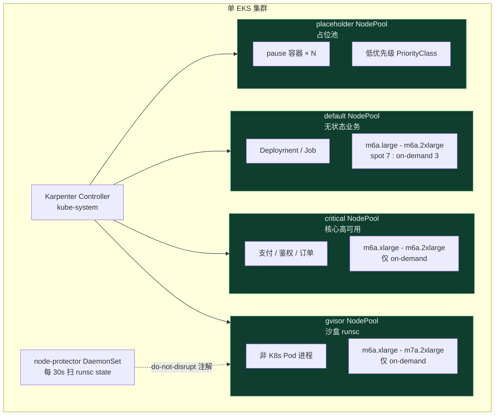
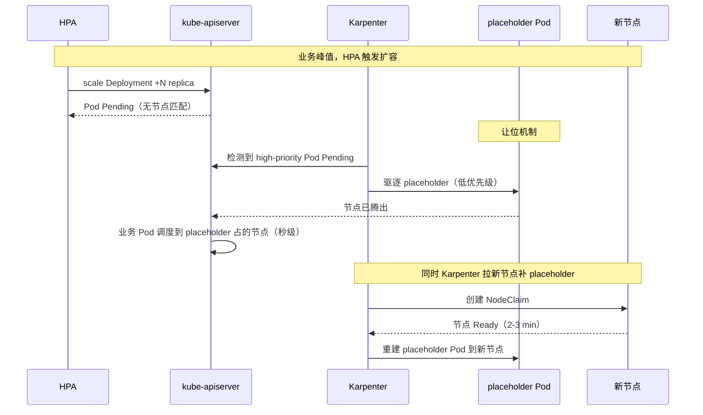

> **元信息**
> - 适用规模：单集群 30-300 节点 / 单月计算账单 $5k-$100k
> - 适用云：AWS EKS（一等公民）/ 阿里云 ACK（节点池伸缩可类比）/ 自建 K8s
> - 运维负担：1-2 人可维护，前期接入约 2 周
> - 月成本节省：单点改动 $400-$2000，组合实施可压到原成本的 60-70%
> - 最后验证：2026-04-30，Karpenter v1.5.0 + EKS 1.31

## 适用场景

K8s 集群跑了一段时间后，账单总会出现一个共同形态：节点数量在涨，业务 QPS 没怎么涨，单 Pod 成本却在飙。这不是 Karpenter / Cluster Autoscaler 的锅，而是「弹性」这件事被理解得太浅。真正能省钱的弹性体系，靠的不是「自动扩容算得多准」，而是「把哪些 Pod 放在哪些节点上」这件事被设计过。本文把这套设计拆成可直接 kubectl apply 的若干 yaml 与可 chmod +x 直接跑的脚本，附上每一步的前置 / 执行 / 验证 / 回滚四件套。


下面的条件满足任意三条以上时，本方案适用：

- 集群已上线超过半年，节点平均利用率长期低于 40%
- 测试环境（QA / Pre / Sandbox 等）成本占总账单 30% 以上
- 存在 gVisor / Firecracker / GPU 等不被 K8s Pod 模型直接识别的工作负载
- 跨 AZ 流量或 NAT 流量在账单中占比超过 10%
- 节点扩容延迟（3-5 分钟）影响业务体验，但又不愿为此长期空跑大量节点

不适用的场景见文末「局限」一节。

## 核心问题

K8s 成本失控的根因，几乎从来不是「节点不够弹」，而是以下几类结构性问题：

1. **节点利用率低**：早期为了「扩容快」配置了大量大机型常驻，业务低峰时 CPU 利用率 10% 也不缩。所谓「弹性」只在白纸方案里成立，落到生产是常态空跑。
2. **NodePool 设计过粗**：所有 workload 共用一个 NodePool，bin-packing 时 Karpenter 倾向选大机型一次性塞满，结果单节点成本翻 4 倍。更糟的是单节点故障爆炸半径过大，反过来逼着团队再起备用节点对冲，形成正反馈。
3. **跨 AZ / NAT 流量未治理**：S3、ECR、跨 AZ Pod 通信走 NAT Gateway，按 GB 计费的流量月底是个黑洞。集群刚起步时 NAT 月费 $50，半年后暴涨到 $640，账单上才看出端倪。
4. **测试环境过度隔离**：QA、Pre、AI 各开一个集群，每个集群都有 control plane / 监控 / 日志 / 中间件冗余。三个测试集群的固定开销加起来比 prod 还贵，但单集群业务密度都不到 30%。
5. **托管服务规格惯性**：RabbitMQ / Kafka / Redis 这类托管中间件初期为了稳定选了大规格，业务量稳定后没有人重新评估。规格选错本身可控，可怕的是「半年没人复盘」这件事变成了组织默认行为。

临时方案常见有几种：手动调 deployment replicas、按时段 scale、上 Spot 实例。这些都是单点止血，不解决结构性问题。手动 scale 依赖运维记忆，按时段 scale 假设流量曲线稳定，Spot 替换又把波动转嫁给业务。真正想要的，是一个**自适应、按需分配、按 workload 类型隔离**的节点供给体系，让「省钱」从一次性运动变成每天自动发生的事。

## 方案对比

| 候选方案 | 适用 | 淘汰理由 |
|----------|------|----------|
| Cluster Autoscaler + ASG | 节点类型固定、规模 < 50 | 扩容粒度是整组 ASG，机型混搭差，无法按 Pod 实际需求挑实例 |
| Karpenter + 默认 NodePool | 单一业务类型、无特殊负载 | 默认配置下 bin-packing 会选大机型，gVisor / Spot 中断这类场景需要单独处理 |
| Karpenter + 精细 NodePool + placeholder | 多 workload 类型、对扩容延迟敏感 | 维护成本略高，但 ROI 在合理规模上很快回正 |

### 候选 1：Cluster Autoscaler + ASG

**适用**：业务模型简单，单一 instance family 就能覆盖。

**淘汰理由**：扩容触发依赖「Pending Pod 找不到节点」，识别粒度是整组 ASG。混搭多种实例类型时需要多个 ASG，每加一种机型就得新建一个 launch template，运维成本随机型数量线性上升；Spot 中断处理需要额外组件 aws-node-termination-handler 配合，且 on-demand 与 Spot 切换需要重启节点，体验差。早期集群在 30 节点以下尚可用，业务复杂度上来后维护负担显著。

### 候选 2：Karpenter + 默认 NodePool

**适用**：测试环境快速接入，对成本不敏感。

**淘汰理由**：默认 NodePool 通常给一个宽口径 instance-types 列表（比如 `m*.large` 一直到 `m*.16xlarge`），Karpenter bin-packing 倾向于选「最贵但单节点能装最多 Pod」的机型。原因是 Karpenter 评估时把「调度成功率」放在「单 Pod 成本」之前——只要节点能装下，就优先用大机型。后文场景 B 会展示一个真实案例：单节点从 m6a.2xlarge 飙到 m7a.8xlarge，月费翻 4 倍，CPU 利用率反而从 60% 跌到 25%。

### 候选 3：Karpenter + 精细 NodePool + placeholder（推荐）

按 workload 维度切 NodePool，每个池只覆盖**业务真正需要的 instance-types**，外加一组 placeholder Pod 兜底冷启动。这套组合把 Karpenter 的优势（按 Pod 实际需求挑实例 + 自动 consolidation）发挥到位的同时，用 NodePool 边界约束 bin-packing 的「贪婪」倾向，再用 placeholder 解决 Karpenter 默认行为里「扩容慢但缩容快」造成的体验落差。维护成本主要集中在前期接入的 2 周，跑稳之后日常运维和单 NodePool 方案差别不大。

## 推荐架构

### 多 NodePool 分层架构



### 弹性扩缩流程



关键决策：

- **按 workload 切池**：default / critical / gvisor / placeholder 至少四类。每类的核心差异不是「机型」，而是「容忍度」——default 容忍 Spot 中断，critical 不容忍，gvisor 容忍节点重启但不容忍 Pod 误杀，placeholder 自身就是被驱逐的对象。
- **每个池只列 2-4 种 instance-types**：避免 Karpenter 选超规格机型。具体做法是先把业务 Pod 的 `requests.cpu/memory` 摸清，再选「能装得下且成本最优」的两个相邻规格作为 instance-types，让 bin-packing 在很窄的范围内做选择。
- **gvisor 池单独治理**：因为 runsc 进程不是 K8s Pod，Karpenter consolidation 看不到它，需要外挂 protector 把宿主机状态翻译成 Karpenter 认识的注解。这一步是「让基础设施看见业务真实状态」，是所有非 K8s 原生工作负载（Firecracker、Kata、容器内嵌虚拟机等）的通用思路。
- **placeholder pause Pod**：低优先级常驻，让 Karpenter 认为节点非空，业务峰值时被驱逐让位实现「秒级扩容」。这是用「永远花着 1 个节点的钱」换「业务突增时省掉 3 分钟冷启动」，对外部用户体验友好的服务必备。

## 实施步骤

下面是七个实施步骤，前三步是 Karpenter 体系的搭建，后四步是各成本场景的落地。可按顺序部署，也可按团队痛点挑选。步骤 4-7 两两之间没有依赖，可以并行做。每一步都给了「前置 / 执行 / 验证 / 回滚」四件套，一个完全没碰过这块的工程师拿到这篇文章应该能照着 1:1 复制部署。

### 步骤 1：在 EKS 集群上安装 Karpenter

**前置要求**：

- AWS CLI v2.15+ 已配置，凭据具备 IAM / EKS / EC2 写权限
- `kubectl` 已切到目标集群 context（`kubectl config current-context` 输出预期）
- `helm` v3.14+
- 集群版本 ≥ EKS 1.28（推荐 1.31）
- OIDC Provider 已启用（`aws eks describe-cluster --name <c> --query "cluster.identity.oidc.issuer"` 有输出）

**执行**：

先建 IAM Role 和信任策略，使用 IRSA：

```bash
#!/bin/bash
# install-karpenter.sh - 在 EKS 集群安装 Karpenter v1.5.0
# 用法: ./install-karpenter.sh <cluster-name> <aws-region>

set -euo pipefail

CLUSTER="${1:-}"
REGION="${2:-us-west-2}"
KARPENTER_VERSION="1.5.0"

[[ -z "$CLUSTER" ]] && { echo "用法: $0 <cluster> <region>"; exit 1; }
command -v aws helm kubectl jq >/dev/null || { echo "需要 aws/helm/kubectl/jq"; exit 1; }

ACCOUNT_ID=$(aws sts get-caller-identity --query Account --output text)
OIDC_URL=$(aws eks describe-cluster --name "$CLUSTER" --region "$REGION" \
  --query "cluster.identity.oidc.issuer" --output text | sed 's|https://||')

echo "[1/6] 创建 KarpenterController IAM Role..."
cat > /tmp/karpenter-trust.json <<EOF
{
  "Version": "2012-10-17",
  "Statement": [{
    "Effect": "Allow",
    "Principal": {"Federated": "arn:aws:iam::${ACCOUNT_ID}:oidc-provider/${OIDC_URL}"},
    "Action": "sts:AssumeRoleWithWebIdentity",
    "Condition": {
      "StringEquals": {
        "${OIDC_URL}:aud": "sts.amazonaws.com",
        "${OIDC_URL}:sub": "system:serviceaccount:kube-system:karpenter"
      }
    }
  }]
}
EOF

aws iam create-role --role-name "KarpenterController-${CLUSTER}" \
  --assume-role-policy-document file:///tmp/karpenter-trust.json || true

aws iam attach-role-policy --role-name "KarpenterController-${CLUSTER}" \
  --policy-arn "arn:aws:iam::aws:policy/AmazonEKSClusterPolicy"

# Karpenter 自带 IAM 文档：https://karpenter.sh/v1.5/getting-started/getting-started-with-karpenter/cloudformation.yaml
aws iam put-role-policy --role-name "KarpenterController-${CLUSTER}" \
  --policy-name "KarpenterControllerPolicy" \
  --policy-document file://./karpenter-controller-policy.json

echo "[2/6] 创建 KarpenterNode 实例 Role（节点本身用）..."
aws iam create-role --role-name "KarpenterNode-${CLUSTER}" \
  --assume-role-policy-document '{"Version":"2012-10-17","Statement":[{"Effect":"Allow","Principal":{"Service":"ec2.amazonaws.com"},"Action":"sts:AssumeRole"}]}' || true

for P in AmazonEKSWorkerNodePolicy AmazonEKS_CNI_Policy AmazonEC2ContainerRegistryReadOnly AmazonSSMManagedInstanceCore; do
  aws iam attach-role-policy --role-name "KarpenterNode-${CLUSTER}" \
    --policy-arn "arn:aws:iam::aws:policy/${P}"
done

aws iam create-instance-profile --instance-profile-name "KarpenterNode-${CLUSTER}" || true
aws iam add-role-to-instance-profile --instance-profile-name "KarpenterNode-${CLUSTER}" \
  --role-name "KarpenterNode-${CLUSTER}" || true

echo "[3/6] 给 KarpenterNode Role 加 EKS access entry..."
aws eks create-access-entry --cluster-name "$CLUSTER" --region "$REGION" \
  --principal-arn "arn:aws:iam::${ACCOUNT_ID}:role/KarpenterNode-${CLUSTER}" \
  --type EC2_LINUX || true

echo "[4/6] helm install karpenter..."
helm registry logout public.ecr.aws 2>/dev/null || true
helm upgrade --install karpenter oci://public.ecr.aws/karpenter/karpenter \
  --version "$KARPENTER_VERSION" \
  --namespace kube-system \
  --create-namespace \
  --values - <<EOF
serviceAccount:
  annotations:
    eks.amazonaws.com/role-arn: arn:aws:iam::${ACCOUNT_ID}:role/KarpenterController-${CLUSTER}
settings:
  clusterName: ${CLUSTER}
  interruptionQueue: Karpenter-${CLUSTER}
controller:
  resources:
    requests: {cpu: 1, memory: 1Gi}
    limits: {cpu: 1, memory: 1Gi}
replicas: 2
EOF

echo "[5/6] 创建 SQS interruption queue..."
aws sqs create-queue --queue-name "Karpenter-${CLUSTER}" --region "$REGION" \
  --attributes MessageRetentionPeriod=300 || true

echo "[6/6] 验证..."
kubectl -n kube-system rollout status deploy/karpenter --timeout=180s
kubectl -n kube-system get pods -l app.kubernetes.io/name=karpenter

echo "完成。下一步: kubectl apply -f nodepools/"
```

**验证**：

```bash
$ kubectl -n kube-system get pods -l app.kubernetes.io/name=karpenter
NAME                         READY   STATUS    RESTARTS   AGE
karpenter-7b4c8f5d8-2qkgm    1/1     Running   0          90s
karpenter-7b4c8f5d8-jb9pn    1/1     Running   0          90s

$ kubectl get crd | grep karpenter
ec2nodeclasses.karpenter.k8s.aws    2026-04-30T08:01:00Z
nodeclaims.karpenter.sh             2026-04-30T08:01:00Z
nodepools.karpenter.sh              2026-04-30T08:01:00Z
```

**回滚**：

```bash
helm -n kube-system uninstall karpenter
kubectl delete crd ec2nodeclasses.karpenter.k8s.aws nodeclaims.karpenter.sh nodepools.karpenter.sh
aws iam delete-role --role-name "KarpenterController-${CLUSTER}"
aws iam delete-role --role-name "KarpenterNode-${CLUSTER}"
aws sqs delete-queue --queue-url "$(aws sqs get-queue-url --queue-name Karpenter-${CLUSTER} --query QueueUrl --output text)"
```

ACK 用户参考阿里云文档启用 Cluster Autoscaler + ECS 弹性节点池，用 NodePool CRD 类比的概念是「节点池 + 抢占式实例配置」，本文重点讲 EKS。两边的设计哲学有差异：Karpenter 是「按 Pod 需求挑实例」的拉模型，ACK 节点池更接近 ASG 的推模型。后续即使迁移到 ACK，方案 B-G 的思路（精细化、占位、流量优化、托管中间件复盘）几乎可以原样套用。

这一步的关键不是装上 Karpenter，而是把 IAM 边界划清楚。控制面 Role（KarpenterController）要能管 EC2、SQS、IAM PassRole 给节点 Role；节点 Role（KarpenterNode）只需要 EKS worker 基础权限 + ECR 拉镜像 + SSM。把这两个 Role 混成一个是最常见的反模式，会导致控制面权限过大或节点权限不足。

另一个高频踩坑是 SQS 中断队列。Karpenter v1+ 强制要求配 interruption queue 来接收 EC2 Spot 中断 / 实例 retire 通知，没配的话会变成「业务 Pod 在节点被 EC2 强杀前几分钟没收到任何信号」。脚本里默认创建好了，迁移老集群时记得检查 EventBridge Rule 是否把 EC2 Spot Interruption Warning / Instance Rebalance Recommendation / Health Event 三类事件都路由到这个队列。

### 步骤 2：建 EC2NodeClass 与四类 NodePool

**前置要求**：

- 步骤 1 已完成
- 子网打了 `karpenter.sh/discovery=<cluster-name>` tag
- 安全组打了同样的 tag

**执行**：先建 EC2NodeClass（节点级配置）：

```yaml
---
apiVersion: karpenter.k8s.aws/v1
kind: EC2NodeClass
metadata:
  name: default
spec:
  amiSelectorTerms:
    - alias: al2023@latest
  role: KarpenterNode-<cluster-name>
  subnetSelectorTerms:
    - tags:
        karpenter.sh/discovery: <cluster-name>
  securityGroupSelectorTerms:
    - tags:
        karpenter.sh/discovery: <cluster-name>
  blockDeviceMappings:
    - deviceName: /dev/xvda
      ebs:
        volumeSize: 100Gi
        volumeType: gp3
        encrypted: true
        deleteOnTermination: true
  metadataOptions:
    httpEndpoint: enabled
    httpProtocolIPv6: disabled
    httpPutResponseHopLimit: 2
    httpTokens: required
  tags:
    cost-center: platform
    environment: prod
```

**default NodePool**（无状态业务，混搭 Spot）：

```yaml
---
apiVersion: karpenter.sh/v1
kind: NodePool
metadata:
  name: default
spec:
  template:
    metadata:
      labels:
        workload-type: stateless
    spec:
      nodeClassRef:
        group: karpenter.k8s.aws
        kind: EC2NodeClass
        name: default
      requirements:
        - key: kubernetes.io/arch
          operator: In
          values: ["amd64"]
        - key: kubernetes.io/os
          operator: In
          values: ["linux"]
        - key: node.kubernetes.io/instance-type
          operator: In
          values: ["m6a.large", "m6a.xlarge", "m6a.2xlarge"]
        - key: karpenter.sh/capacity-type
          operator: In
          values: ["spot", "on-demand"]
        - key: topology.kubernetes.io/zone
          operator: In
          values: ["us-west-2a", "us-west-2b", "us-west-2c"]
      expireAfter: 720h
      terminationGracePeriod: 30m
  limits:
    cpu: 200
    memory: 400Gi
  disruption:
    consolidationPolicy: WhenEmptyOrUnderutilized
    consolidateAfter: 1m
  weight: 10
```

**critical NodePool**（核心高可用业务，仅 on-demand）：

```yaml
---
apiVersion: karpenter.sh/v1
kind: NodePool
metadata:
  name: critical
spec:
  template:
    metadata:
      labels:
        workload-type: critical
    spec:
      nodeClassRef:
        group: karpenter.k8s.aws
        kind: EC2NodeClass
        name: default
      taints:
        - key: workload-type
          value: critical
          effect: NoSchedule
      requirements:
        - key: node.kubernetes.io/instance-type
          operator: In
          values: ["m6a.xlarge", "m6a.2xlarge"]
        - key: karpenter.sh/capacity-type
          operator: In
          values: ["on-demand"]
      expireAfter: 720h
      terminationGracePeriod: 1h
  limits:
    cpu: 100
    memory: 200Gi
  disruption:
    consolidationPolicy: WhenEmpty
    consolidateAfter: 30m
  weight: 50
```

**gvisor NodePool**（沙盒业务，配套后面 protector）：

```yaml
---
apiVersion: karpenter.sh/v1
kind: NodePool
metadata:
  name: gvisor
spec:
  template:
    metadata:
      labels:
        workload-type: gvisor
        sandbox.gvisor/enabled: "true"
    spec:
      nodeClassRef:
        group: karpenter.k8s.aws
        kind: EC2NodeClass
        name: default
      taints:
        - key: sandbox.gvisor/enabled
          value: "true"
          effect: NoSchedule
      requirements:
        - key: node.kubernetes.io/instance-type
          operator: In
          values: ["m6a.xlarge", "m6a.2xlarge", "m7a.xlarge", "m7a.2xlarge"]
        - key: karpenter.sh/capacity-type
          operator: In
          values: ["on-demand"]
      expireAfter: 720h
      terminationGracePeriod: 1h
  limits:
    cpu: 64
    memory: 128Gi
  disruption:
    consolidationPolicy: WhenEmpty
    consolidateAfter: 10m
  weight: 30
```

**fallback NodePool**（兜底，避免主池约束太严导致 Pending）：

```yaml
---
apiVersion: karpenter.sh/v1
kind: NodePool
metadata:
  name: fallback
spec:
  template:
    metadata:
      labels:
        workload-type: fallback
    spec:
      nodeClassRef:
        group: karpenter.k8s.aws
        kind: EC2NodeClass
        name: default
      requirements:
        - key: karpenter.k8s.aws/instance-family
          operator: In
          values: ["m6a", "m6i", "m7a", "m7i", "c6a", "c7a"]
        - key: karpenter.k8s.aws/instance-cpu
          operator: In
          values: ["2", "4", "8"]
        - key: karpenter.sh/capacity-type
          operator: In
          values: ["on-demand"]
  limits:
    cpu: 50
    memory: 100Gi
  disruption:
    consolidationPolicy: WhenEmpty
    consolidateAfter: 5m
  weight: 1
```

**验证**：

```bash
$ kubectl get nodepool
NAME       NODECLASS   NODES   READY   AGE
default    default     3       True    5m
critical   default     2       True    5m
gvisor     default     1       True    5m
fallback   default     0       True    5m

$ kubectl get nodes -L workload-type
NAME                                       STATUS  WORKLOAD-TYPE
ip-10-0-1-23.us-west-2.compute.internal    Ready   stateless
ip-10-0-2-45.us-west-2.compute.internal    Ready   critical
ip-10-0-3-67.us-west-2.compute.internal    Ready   gvisor
```

**回滚**：

```bash
kubectl delete nodepool default critical gvisor fallback
kubectl delete ec2nodeclass default
# Karpenter 会主动 drain 并 terminate 这些节点上的 NodeClaim
```

EC2NodeClass 是节点级别的「物理配置」（AMI、子网、SG、磁盘），NodePool 是工作负载级别的「调度策略」（机型范围、容量类型、taint/toleration、disruption 策略）。一个 NodeClass 可以被多个 NodePool 复用。生产实践中建议每个集群只维护一个 NodeClass（除非有 GPU 这类异构需求），所有 NodePool 通过 `weight` 控制调度优先级——weight 越大越先用，本文示例中 critical=50 > gvisor=30 > default=10 > fallback=1，构成了「先用专用池，专用池满了用通用池，通用池满了再用兜底池」的三级降级链路。

instance-types 列表的选择有一条经验规则：**先看业务 Pod 的 requests，把能装下 1-2 个 Pod 的最小机型作为下界，能装下 4-6 个 Pod 的中等机型作为上界，全部选同一代际**。下界过小会导致「节点起好但装不下任何 Pod」的尴尬，上界过大会让 bin-packing 选超规格。同代际是为了价格曲线一致，避免 Karpenter 在不同代际间反复横跳。

taint 配置上 critical / gvisor 都加了专用 taint，确保只有显式 toleration 的 Pod 能调度过去。default 池不加 taint，作为「无主之地」承接所有未指定调度约束的 Pod。这种结构对业务方友好——不需要修改任何 Pod spec，新业务自动落在 default 池；只有需要特殊调度的业务才显式配 toleration。

### 步骤 3：弹性占位池（PriorityClass + placeholder + node-protector）

**前置要求**：步骤 2 完成，集群已有至少 1 个 gvisor 节点。

**执行**：

第一份 PriorityClass，placeholder 用最低优先级：

```yaml
---
apiVersion: scheduling.k8s.io/v1
kind: PriorityClass
metadata:
  name: placeholder-low
value: -1000
globalDefault: false
description: "占位 Pod 专用优先级，业务 Pod Pending 时优先驱逐"
---
apiVersion: scheduling.k8s.io/v1
kind: PriorityClass
metadata:
  name: business-default
value: 1000
globalDefault: true
description: "业务 Pod 默认优先级"
```

placeholder Deployment（gvisor 池保底 1 节点常驻）：

```yaml
---
apiVersion: v1
kind: Namespace
metadata:
  name: cluster-tools
---
apiVersion: apps/v1
kind: Deployment
metadata:
  name: sandbox-min-node
  namespace: cluster-tools
  labels: {app: sandbox-min-node}
spec:
  replicas: 1
  selector:
    matchLabels: {app: sandbox-min-node}
  template:
    metadata:
      labels: {app: sandbox-min-node}
    spec:
      priorityClassName: placeholder-low
      terminationGracePeriodSeconds: 0
      nodeSelector:
        sandbox.gvisor/enabled: "true"
      tolerations:
        - key: sandbox.gvisor/enabled
          operator: Equal
          value: "true"
          effect: NoSchedule
      containers:
        - name: pause
          image: registry.k8s.io/pause:3.9
          resources:
            requests: {cpu: 10m, memory: 16Mi}
            limits: {cpu: 100m, memory: 64Mi}
```

node-protector DaemonSet（每 30s 扫 runsc state 文件）：

```yaml
---
apiVersion: v1
kind: ServiceAccount
metadata:
  name: node-protector
  namespace: cluster-tools
---
apiVersion: rbac.authorization.k8s.io/v1
kind: ClusterRole
metadata:
  name: node-protector
rules:
  - apiGroups: [""]
    resources: ["nodes"]
    verbs: ["get", "list", "watch", "patch", "update"]
---
apiVersion: rbac.authorization.k8s.io/v1
kind: ClusterRoleBinding
metadata:
  name: node-protector
subjects:
  - kind: ServiceAccount
    name: node-protector
    namespace: cluster-tools
roleRef:
  kind: ClusterRole
  name: node-protector
  apiGroup: rbac.authorization.k8s.io
---
apiVersion: apps/v1
kind: DaemonSet
metadata:
  name: node-protector
  namespace: cluster-tools
spec:
  selector:
    matchLabels: {app: node-protector}
  template:
    metadata:
      labels: {app: node-protector}
    spec:
      serviceAccountName: node-protector
      hostPID: true
      nodeSelector:
        sandbox.gvisor/enabled: "true"
      tolerations:
        - key: sandbox.gvisor/enabled
          operator: Equal
          value: "true"
          effect: NoSchedule
      containers:
        - name: protector
          image: bitnami/kubectl:1.31
          env:
            - name: NODE_NAME
              valueFrom:
                fieldRef: {fieldPath: spec.nodeName}
          command:
            - /bin/bash
            - -c
            - |
              set -eu
              while true; do
                COUNT=$(ls /host/data/sandbox/runsc/sb-*.state 2>/dev/null | wc -l)
                if [ "$COUNT" -gt 0 ]; then
                  kubectl annotate node "$NODE_NAME" \
                    karpenter.sh/do-not-disrupt=true --overwrite >/dev/null
                else
                  kubectl annotate node "$NODE_NAME" \
                    karpenter.sh/do-not-disrupt- 2>/dev/null || true
                fi
                echo "$(date -Iseconds) node=$NODE_NAME runsc_count=$COUNT"
                sleep 30
              done
          volumeMounts:
            - name: runsc-root
              mountPath: /host/data/sandbox/runsc
              readOnly: true
          resources:
            requests: {cpu: 20m, memory: 32Mi}
            limits: {cpu: 200m, memory: 128Mi}
      volumes:
        - name: runsc-root
          hostPath:
            path: /data/sandbox/runsc
            type: DirectoryOrCreate
```

**机制说明**：扩容慢但缩容快是 Karpenter 默认行为带来的体验问题——节点起新机要 2-3 分钟（EC2 boot + kubelet ready + 镜像拉取），但 consolidation 几十秒就能干掉。对延时敏感的业务来说，「冷启动慢」比「常态利用率低 20%」更难接受。placeholder 三件套做的事：

- **placeholder Pod 占位**：低优先级 pause 容器锁住一个节点，让 Karpenter 永远认为「节点非空」，避免缩到 0。pause 镜像极小（约 700 KB），CPU/Memory requests 也只占 10m/16Mi，节点成本几乎全部花给业务用。
- **业务峰值时让位**：业务 Pod 优先级高，Pending 时 kube-scheduler 自动驱逐 placeholder（preemption 机制），业务 Pod 秒级落到节点上。整个让位过程不依赖 Karpenter，纯走 K8s 调度器，延时稳定在 1-3 秒。
- **Karpenter 异步补位**：placeholder 被驱逐后变成 Pending，Karpenter 触发新节点创建，节点 Ready 后 placeholder 重新调度上去。这一步在用户视角不可见，相当于把冷启动时间「藏」在了背景里。

调试技巧：上线初期把 placeholder 的 replica 改为 2，观察连续两次扩容是否都能秒级让位。如果第二次出现 Pending，说明 Karpenter 补位速度跟不上业务峰值频率，应该把节点 instance-type 换成启动更快的（避免选大盘镜像）。

**验证**：

```bash
$ kubectl -n cluster-tools get pod -o wide
NAME                                READY   STATUS    NODE
node-protector-7q9xz                1/1     Running   ip-10-0-3-67...
sandbox-min-node-5d4b8f6c8-jk2lp    1/1     Running   ip-10-0-3-67...

$ kubectl get nodes -l sandbox.gvisor/enabled=true \
    -o jsonpath='{.items[*].metadata.annotations.karpenter\.sh/do-not-disrupt}'
true

$ kubectl -n cluster-tools logs ds/node-protector --tail=3
2026-04-30T08:30:00+00:00 node=ip-10-0-3-67... runsc_count=4
```

**回滚**：

```bash
kubectl delete -n cluster-tools deployment/sandbox-min-node daemonset/node-protector
kubectl delete priorityclass placeholder-low business-default
kubectl get nodes -l sandbox.gvisor/enabled=true \
  -o name | xargs -I{} kubectl annotate {} karpenter.sh/do-not-disrupt-
```

### 步骤 4：移除 gvisor NodePool 大机型

gVisor 是个典型的「Karpenter 默认会做错的选择」案例。某 sandbox 集群最初的 NodePool 只列了 `m7a.8xlarge`（32 vCPU / 128 GiB）。理由是：单沙盒 700m CPU / 4Gi 内存，大机型能塞 40 个沙盒，密度高。实际跑了一个月，账单上 m7a.8xlarge 烧了 $11,614。问题是：业务沙盒是离散启停的，常态密度只有 8-15 个，节点利用率 25%；单节点故障爆炸半径过大；Karpenter consolidation 想缩节点时，找不到目标节点能装下整个 m7a.8xlarge 上的所有 Pod，缩不动。


**前置要求**：当前 gvisor NodePool 包含大机型（如 m7a.4xlarge / m7a.8xlarge），账单显示节点利用率 < 30%。

**执行**：

```bash
# 备份当前配置
kubectl get nodepool gvisor -o yaml > gvisor-nodepool-backup-$(date +%F).yaml

# patch instance-types
kubectl patch nodepool gvisor --type=json -p='[
  {
    "op": "replace",
    "path": "/spec/template/spec/requirements/0/values",
    "value": ["m6a.xlarge", "m6a.2xlarge", "m7a.xlarge", "m7a.2xlarge"]
  }
]'
```

**验证**：

```bash
# 看 NodeClaim 触发 drift
$ kubectl get nodeclaim -l karpenter.sh/nodepool=gvisor -w
NAME             TYPE          ZONE         NODE              READY  AGE
gvisor-abc123    m7a.8xlarge   us-west-2a   ip-10-0-3-67...   True   3d
gvisor-abc123    m7a.8xlarge   us-west-2a   ip-10-0-3-67...   True   3d   # disruption: drifted
gvisor-def456    m6a.2xlarge   us-west-2a   ip-10-0-3-89...   True   2m   # 替换节点

# 确认旧实例释放
$ aws ec2 describe-instances \
    --filters "Name=tag:karpenter.sh/nodepool,Values=gvisor" \
              "Name=instance-state-name,Values=running" \
    --query 'Reservations[].Instances[].[InstanceId,InstanceType]' --output table
```

替换期间 protector 会读 hostPath 检测 runsc 是否还活着，活着就打 do-not-disrupt 阻止替换；新节点 Ready 后由 sandbox-agent 重新调度沙盒到新节点。生产案例实测：单节点月费 $943 → $245，三月账单合计省下 $11,614 中的 70%。

更深一层结论：**Karpenter 给的 instance-types 列表越宽，bin-packing 越激进；越窄，单节点利用率越平均**。新接入业务先给 4 种以内的窄口径，跑稳后再视密度调整。一个常见的反模式是把所有 `m6a.*` 一股脑列进去想「让 Karpenter 自己选」，结果它选了最贵的那一档。

**回滚**：

```bash
kubectl apply -f gvisor-nodepool-backup-$(date +%F).yaml
```

### 步骤 5：VPC 加 S3 Gateway Endpoint

K8s 集群里跑 Mountpoint for S3 CSI Driver、aws-cli、Velero、Loki S3 backend 这类服务时，所有 S3 流量默认走 NAT Gateway，按 GB 计费。一个真实案例的曲线：集群合并前每天 NAT 出向流量 60 GB；三合一合并后涨到 312 GB/天；业务上线放量后峰值 387 GB/天；折算 NAT 流量费 $21+/天，月 $640。修复成本是 0：S3 Gateway Endpoint 免费。


**前置要求**：

- VPC 内有 K8s 集群跑 Mountpoint S3 CSI Driver、Velero、Loki S3 backend 或 aws-cli
- 当前 NAT BytesInFromDestination 占账单 > 5%

**执行**：

```bash
#!/bin/bash
# add-s3-gateway-endpoint.sh - 给 VPC 加 S3 Gateway Endpoint
# 用法: ./add-s3-gateway-endpoint.sh <vpc-id> <region>

set -euo pipefail

VPC="${1:-}"
REGION="${2:-us-west-2}"
[[ -z "$VPC" ]] && { echo "用法: $0 <vpc-id> <region>"; exit 1; }

# 1. 找私网路由表（排除 IGW main）
RTBS=$(aws ec2 describe-route-tables --region "$REGION" \
  --filters "Name=vpc-id,Values=${VPC}" \
  --query 'RouteTables[?Routes[?GatewayId==`local`] && !Routes[?starts_with(GatewayId,`igw-`)]].RouteTableId' \
  --output text)

echo "私网路由表: $RTBS"
[[ -z "$RTBS" ]] && { echo "未找到私网 RT"; exit 1; }

# 2. 创建 Gateway Endpoint，policy 限定只允许指定 bucket
cat > /tmp/s3-endpoint-policy.json <<'EOF'
{
  "Version": "2012-10-17",
  "Statement": [{
    "Effect": "Allow",
    "Principal": "*",
    "Action": ["s3:GetObject", "s3:PutObject", "s3:ListBucket", "s3:DeleteObject"],
    "Resource": [
      "arn:aws:s3:::sandbox-checkpoints-*",
      "arn:aws:s3:::sandbox-checkpoints-*/*",
      "arn:aws:s3:::loki-prod-*",
      "arn:aws:s3:::loki-prod-*/*",
      "arn:aws:s3:::velero-*",
      "arn:aws:s3:::velero-*/*"
    ]
  }]
}
EOF

VPCE_ID=$(aws ec2 create-vpc-endpoint --region "$REGION" \
  --vpc-id "$VPC" \
  --service-name "com.amazonaws.${REGION}.s3" \
  --vpc-endpoint-type Gateway \
  --route-table-ids $RTBS \
  --policy-document file:///tmp/s3-endpoint-policy.json \
  --tag-specifications 'ResourceType=vpc-endpoint,Tags=[{Key=Name,Value=s3-gateway},{Key=managed-by,Value=ops}]' \
  --query 'VpcEndpoint.VpcEndpointId' --output text)

echo "创建成功: $VPCE_ID"
```

**验证**：

```bash
# 1. 路由表已加 prefix-list
$ aws ec2 describe-route-tables --route-table-ids rtb-aaa \
    --query 'RouteTables[].Routes[?DestinationPrefixListId!=null]' --output table

# 2. Pod 内 curl S3，traceroute 应直接出 VPC endpoint 不经 NAT
$ kubectl run -it --rm dbg --image=amazon/aws-cli --restart=Never -- \
    s3 ls s3://sandbox-checkpoints-qa/ --region us-west-2

# 3. 24h 后看 NAT 流量曲线
$ aws cloudwatch get-metric-statistics --namespace AWS/NATGateway \
    --metric-name BytesOutToDestination --dimensions Name=NatGatewayId,Value=nat-xxx \
    --start-time $(date -u -d '24 hours ago' +%FT%TZ) \
    --end-time $(date -u +%FT%TZ) \
    --period 3600 --statistics Sum --region us-west-2
```

实测某 sandbox 集群从 312 GB/天降到 0.5 GB/天，月省 $420。前后曲线对比的 NAT BytesInFromDestination 从 217 MB/min 降到 0.36 MB/min，相当于 99.8% 的下降幅度。这套修复是「零代码改动 + 零 downtime + 永久免费」的典型——Mountpoint S3 CSI 自动重连到 Gateway endpoint，业务侧 4 个 sandbox-agent Pod 全程 0 restart 跨过切换点。

通用结论：每个 VPC 都应该把 S3 Gateway Endpoint 当成开集群时的默认动作。后续可以类似加 ECR Interface Endpoint 消除镜像拉取流量（注意 ECR 没有 Gateway 类型，需要花钱按小时计费，但相比 NAT 流量费仍划算）。同样的思路适用于 DynamoDB（Gateway 免费）、Secrets Manager / SSM（Interface 收费）。

**回滚**：

```bash
aws ec2 delete-vpc-endpoints --vpc-endpoint-ids "$VPCE_ID" --region "$REGION"
```

### 步骤 6：托管 RabbitMQ 降级

托管 RabbitMQ / Kafka / Redis 这类服务的实例规格选择，初期偏保守是合理的；运行半年后必须重新评估。下面的步骤同样适用于 ElastiCache、MSK、RDS——它们都属于「初期保守选大、后期没人复盘」的高发区。


**前置要求**：RabbitMQ 已上线 ≥ 6 个月，连接数与 CPU 利用率指标可在 CloudWatch 拉到。

**实例规格选型决策表**：

| 实测峰值 CPU | 连接数 | 消息积压 P99 | 推荐规格 |
|--------------|--------|--------------|----------|
| < 30% | < 800 | < 1000 | `mq.m5.large` ($225/月) |
| 30-50% | 800-2000 | < 5000 | `mq.m5.xlarge` ($450/月) |
| 50-70% | 2000-5000 | < 1万 | `mq.m5.2xlarge` ($900/月) |
| > 70% | > 5000 | > 1万 | `mq.m5.4xlarge`+ 扩集群 |

**切换前验证**（rabbitmq-management 查 24h 消费速率）：

```bash
# 通过 management plugin 拉指标
RMQ_USER="admin"
RMQ_HOST="b-xxx.mq.us-west-2.amazonaws.com"
curl -sS -u "$RMQ_USER:$PASS" "https://${RMQ_HOST}:443/api/queues" \
  | jq -r '.[] | [.name, .messages, .messages_ready, .consumers, .message_stats.deliver_details.rate] | @tsv' \
  | sort -k2 -n -r | head -20

# 24h CPU
aws cloudwatch get-metric-statistics --namespace AWS/AmazonMQ \
  --metric-name CpuUtilization \
  --dimensions Name=Broker,Value=prod-rmq Name=Node,Value=rabbit@ip-10-0-1-23 \
  --start-time $(date -u -d '24 hours ago' +%FT%TZ) \
  --end-time $(date -u +%FT%TZ) \
  --period 300 --statistics Maximum
```

**切换步骤**：

1. 创建新 broker（小一档），`engineVersion` 与旧 broker 一致
2. 双写 24h：业务暂不切换，新 broker 收 mirror 流量观察连接 / 内存
3. 改 Nacos 配置（agent / backend / dispatch 三类服务的 RabbitMQ DSN），逐 deployment rollout
4. K8s Secret 同步（KEDA scaler 的 secret 不要漏，否则 scaler 仍连旧 broker）
5. 旧 broker 保留 7 天冷备再删

某真实案例：mq.m5.2xlarge × 2 → mq.m5.large × 2，月省 $1,350，业务零感知。同样的方法适用于 ElastiCache、MSK、RDS——它们都属于「初期保守选大、后期没人复盘」的高发区。建议把「半年规格复盘」纳入 SRE 运维节律，给每个托管中间件挂一个 owner，每季度对一次实测峰值与当前规格的水位差。

切换过程的隐藏风险点是 KEDA scaler 的 secret——很多团队会忘了同步它，结果业务流量切到新 broker 之后，scaler 仍连旧 broker 拉队列长度，扩缩容信号源失真。建议在切换 checklist 里把「KEDA secret」「Nacos 三类服务 DSN」「业务 ConfigMap」「监控告警 endpoint」逐项打勾。

### 步骤 7：监控与量化收益

成本优化做完后必须立刻接监控，否则一周不到就会被「业务团队悄悄改 requests」「新人误改 NodePool」「Spot 价格波动」等因素抹平收益。监控的目标不是「实时止血」，而是「把异动暴露在周度 review 上」，让团队能在小问题变大问题之前介入。


**前置要求**：集群已有 kube-prometheus-stack 或自建 Prometheus。

**核心 PromQL**：

```promql
# 1. 节点 CPU 利用率（按 NodePool 聚合）
avg by (nodepool) (
  100 - 100 * avg by (instance, nodepool) (
    rate(node_cpu_seconds_total{mode="idle"}[5m])
    * on(instance) group_left(nodepool)
      label_replace(kube_node_labels{label_karpenter_sh_nodepool!=""}, "nodepool", "$1", "label_karpenter_sh_nodepool", "(.+)")
  )
)

# 2. Pod 调度延迟 P95（Pending 到 Running）
histogram_quantile(0.95,
  sum by (le) (rate(scheduler_pod_scheduling_duration_seconds_bucket[5m]))
)

# 3. Karpenter 决策时延（NodeClaim 创建到 Ready）
histogram_quantile(0.95,
  sum by (le) (rate(karpenter_nodeclaims_termination_duration_seconds_bucket[5m]))
)

# 4. NodePool 容量水位
sum by (nodepool) (karpenter_nodes_allocatable_cpu_cores)
/
sum by (nodepool) (karpenter_nodepools_limit_cpu_cores)

# 5. Spot 中断频率
sum by (nodepool) (rate(karpenter_interruption_received_messages_total[1h]))
```

**Grafana dashboard 关键 panel JSON**（精简版，存为 `karpenter-cost.json` 后 Import）：

```json
{
  "title": "Karpenter 成本与利用率",
  "uid": "karpenter-cost",
  "panels": [
    {
      "id": 1, "type": "timeseries", "title": "NodePool CPU 利用率",
      "gridPos": {"x": 0, "y": 0, "w": 12, "h": 8},
      "targets": [{
        "expr": "avg by (nodepool) (100 - 100 * avg by (instance, nodepool) (rate(node_cpu_seconds_total{mode=\"idle\"}[5m]) * on(instance) group_left(nodepool) label_replace(kube_node_labels{label_karpenter_sh_nodepool!=\"\"}, \"nodepool\", \"$1\", \"label_karpenter_sh_nodepool\", \"(.+)\")))"
      }],
      "fieldConfig": {"defaults": {"unit": "percent", "min": 0, "max": 100}}
    },
    {
      "id": 2, "type": "stat", "title": "节点总数",
      "gridPos": {"x": 12, "y": 0, "w": 6, "h": 4},
      "targets": [{"expr": "count(kube_node_info)"}]
    },
    {
      "id": 3, "type": "stat", "title": "Pod 调度 P95 (s)",
      "gridPos": {"x": 18, "y": 0, "w": 6, "h": 4},
      "targets": [{"expr": "histogram_quantile(0.95, sum by (le) (rate(scheduler_pod_scheduling_duration_seconds_bucket[5m])))"}]
    },
    {
      "id": 4, "type": "barchart", "title": "Spot 中断次数 / 1h",
      "gridPos": {"x": 0, "y": 8, "w": 24, "h": 6},
      "targets": [{"expr": "sum by (nodepool) (rate(karpenter_interruption_received_messages_total[1h]))"}]
    }
  ],
  "schemaVersion": 38, "version": 1, "refresh": "1m"
}
```

**AWS Cost Explorer 拉账单脚本**（按 NodePool tag 分组）：

```bash
#!/bin/bash
# pull-aws-cost-by-nodepool.sh - 拉过去 30 天按 NodePool tag 分组的 EC2 费用
set -euo pipefail
END=$(date -u +%F)
START=$(date -u -d '30 days ago' +%F)

aws ce get-cost-and-usage \
  --time-period "Start=${START},End=${END}" \
  --granularity DAILY \
  --metrics UnblendedCost \
  --filter '{"Dimensions":{"Key":"SERVICE","Values":["Amazon Elastic Compute Cloud - Compute"]}}' \
  --group-by '[{"Type":"TAG","Key":"karpenter.sh/nodepool"}]' \
  --output json | jq -r '
    .ResultsByTime[] |
    .TimePeriod.Start as $d |
    .Groups[] |
    [$d, .Keys[0], .Metrics.UnblendedCost.Amount] | @tsv'
```

阿里云 BillingExplorer 用 `aliyun bssopenapi DescribeInstanceBill --ProductCode ecs --BillingCycle 2026-04` 类比。

**验证**：在 Grafana 看到 dashboard 后，对比上线前后两周节点平均 CPU、Pod 调度 P95、月度账单。建议把账单按 NodePool tag 拆出来，做成一张周度走势图——比起单看总账单，按 NodePool 维度看更容易发现单点回滚（比如某团队悄悄给 critical 池加了大机型，过一周才被账单暴露）。

监控告警的最小集合：节点 CPU 利用率 < 20% 持续 24h（说明 NodePool 配过宽，需要收敛）、Pod Pending P95 > 5min（说明扩容跟不上，需要看 Karpenter 决策日志或 fallback 配置）、Spot 中断频率 > 3 次/小时（说明可能赶上 Spot 价格波动，临时切 on-demand 兜底）、NAT BytesOut 周环比涨 > 30%（说明可能有新业务开始走外网或漏配 endpoint）。这四条把日常 80% 的成本异常都覆盖到了。

## 踩过的坑

### 坑 1：node-protector 的 hostPath 路径错位

**现象**：node-protector 在 sandbox-qa 集群上线后，PROTECT 注解打不上，节点被 Karpenter 回收，5-10 个沙盒被强杀。

**根因**：DaemonSet 挂载的 hostPath 写成了 `/run/runsc`（runsc 默认路径），但实际生产配置 runsc `--root` 指向 `/data/sandbox/runsc`。检测逻辑找的是 `sb-*` 目录，但实际文件名是 `sb-*.state`。两层路径错位导致永远扫到 0 个沙盒。

**修复**（步骤 3 yaml 已是修复后版本）：hostPath 改为 `/data/sandbox/runsc`，检测条件改为 `ls /host/data/sandbox/runsc/sb-*.state`。

**通用结论**：DaemonSet 检测宿主机状态前，**先 SSH 上目标节点核对真实路径**，不要相信文档或上游默认值。`hostPath` 类型的逻辑代价最高也最容易翻车。上线前检查 checklist：跑 `kubectl debug node/<n> -it --image=busybox -- ls /host/data/sandbox/runsc/` 实证一遍。

### 坑 2：三层容量配置脱节，扩容形同虚设

**现象**：sandbox 集群的 Portal Scaler 日志看上去工作正常（按 35 个 / 节点的密度算利用率，触发扩容），但实际扩出来的节点根本不接收新沙盒，用户那边一直「资源不足」。

**根因**：三层配置完全没对齐：

| 层级 | 配置值 | 含义 |
|------|--------|------|
| Agent 准入（DaemonSet env） | 7 | 单节点最多 7 个沙盒，超过就拒 |
| Portal 调度（代码硬编码） | 30 | 选节点时按 30 算负载 |
| Scaler 扩容（代码硬编码） | 35 | 按 35 算扩容触发率 |

Scaler 按 35 计算「集群利用率 80%」时，Agent 在 7 已经拒了一周。扩容触发了，但新节点和老节点一样在 7 处卡死。

**修复**：

1. 短期：把三层硬编码统一成同一个数字。
2. 长期：让 Agent 启动时把 `MaxSandboxes` 上报给 Portal，Portal 和 Scaler 从注册中心读，不再硬编码。
3. 终态：从「按 sandbox 数量」切换为「按节点 CPU/Memory 利用率」驱动扩容。

**通用结论**：**任何一个跨组件的容量数字（max replica / max sandbox / max conn），必须保证配置流是「单源 → 多消费」而不是「多源各写一份」**。后者在重构时永远会忘掉一处。HPA / Karpenter / Pod resources 三层用的容量数字也建议从 ConfigMap 单源读取。

### 坑 3：Spot 中断时业务感知

**现象**：default NodePool 启用 Spot 后，每周 1-2 次 Spot 回收，部分长连接业务（WebSocket / SSE）连接掉线，用户客诉。

**根因**：Karpenter 收到 EC2 Spot interruption 通知后默认 2 分钟驱逐 Pod。如果业务没配 PDB，且本身不支持优雅断连重连，体验就是「弹幕中断 30 秒」。

**修复**：

```yaml
---
apiVersion: policy/v1
kind: PodDisruptionBudget
metadata:
  name: chat-stream-pdb
  namespace: business
spec:
  minAvailable: 80%
  selector:
    matchLabels: {app: chat-stream}
---
# 关键业务额外加 aws-node-termination-handler，监听 Spot 中断通知触发 preStop
# helm install aws-node-termination-handler eks/aws-node-termination-handler \
#   --set enableSpotInterruptionDraining=true --set enableSqsTerminationDraining=true
```

业务 Pod 同时实现 `preStop` hook（关连接、上报下线、刷盘）：

```yaml
lifecycle:
  preStop:
    exec:
      command: ["/bin/sh", "-c", "curl -X POST localhost:8080/graceful-shutdown && sleep 30"]
```

**通用结论**：**Spot 不是免费午餐**。先把「业务能否容忍 2 min 内驱逐」摸清，再决定哪些 NodePool 上 Spot。Stateful、长事务、消费 inflight 多的服务一律 on-demand。

### 坑 4：NodePool 选不到合适实例时 Pod Pending

**现象**：业务方提了一个 PR，给 Pod 加了 `resources.requests: {cpu: 4, memory: 12Gi}`。结果 Pod 一直 Pending，Karpenter Controller 日志报 `no instance type satisfies requirements`。

**根因**：default NodePool 的 instance-types 只列了 `m6a.large/xlarge/2xlarge`，2xlarge 是 8 vCPU / 32 GiB，能装下，但 1xlarge 是 4 vCPU / 16 GiB，Karpenter 评估 bin-packing 时受其他 Pod 影响算出「无单实例满足全部 Pending Pod」。

**修复**：建一个 fallback NodePool（步骤 2 已包含），weight 设为 1（最低优先级），instance-family 给宽口径，让 Karpenter 在主池吃不下时兜底。配合监控告警：

```promql
# Pod Pending > 5 min 告警
sum by (namespace, pod) (
  kube_pod_status_phase{phase="Pending"}
  * on(pod, namespace) group_left()
    (time() - kube_pod_created > 300)
)
```

**通用结论**：精细化 NodePool 必须配 fallback。窄口径主池负责省钱，fallback 负责兜底。weight 数值差距至少 10，避免 Karpenter 在两池之间抖动。同时给 fallback 池设置较小的 `limits`（例如 cpu=50），让它真正只起兜底作用，避免业务团队为了图方便把所有 Pod 都加 fallback toleration 反过来吃掉主池省下的成本。监控上加一条「fallback 节点占比 > 20% 持续 24h」的告警，及时发现主池配置不合理或业务 requests 突变。

### 坑 5：Serverless ACK 节点 cache 给的「镜像可用」错觉

**现象**：阿里云 ACK Serverless 上跑的 Pod，重启时 ImagePullBackOff，但镜像在 Harbor 上明明能 pull。同一节点的兄弟 Pod 一切正常。

**根因**：Serverless ACK 把 Pod 调度到 ECI 实例，每个 Pod 是独立沙盒。「同一节点」是 Karpenter 视角的概念，对 ECI 不成立。老 Pod 是几周前调度上去时，节点本地拉过镜像并 cache 住的；新启动的 Pod 落到全新 ECI，国际 Harbor 公网拉镜像，超时。

**修复**：

```yaml
# 1. 镜像换国内 mirror（阿里云 ACR）
spec:
  containers:
    - image: registry.cn-hangzhou.aliyuncs.com/myorg/myapp:v1.2.3
# 2. Namespace 级别开 ECI 镜像缓存
apiVersion: v1
kind: Namespace
metadata:
  name: business
  annotations:
    k8s.aliyun.com/eci-image-cache: "true"
    k8s.aliyun.com/eci-image-snapshot-id: "imc-xxxxxx"
```

**通用结论**：**Serverless 类节点（ECI / Fargate）的「镜像就绪」观测一定要看新调度 Pod 的首次拉取耗时**，不要相信「同 namespace 老 Pod 在跑」。这个错觉在排查 prod 故障时浪费过大量时间。常驻镜像建议在 ACR / ECR 同 region 各保一份，CI 构建后双 push。

## 衡量指标

下表是上述五个场景在某真实集群组合实施后的对比（数字按月度计算）：

| 维度 | Before | After | 变化 |
|------|--------|-------|------|
| 测试环境集群数 | 3 | 1 | -67% |
| gVisor 节点常驻数 | 3 | 1 | -67% |
| 单 sandbox 节点月费 | $943 | $245 | -74% |
| NAT 流量（GB/天） | 312 | 0.5 | -99.8% |
| RabbitMQ 月费 | $1,800 | $450 | -75% |
| 总月度节省 | - | ~$2,800 | - |
| 平均节点 CPU 利用率 | ~25% | ~55% | +30pp |
| Pod 扩容 P95 延迟 | 4-6 min | 30-60s | -85% |

定性变化：

- 节点列表从「五花八门 8 种机型混搭」变成「default/critical/gvisor/fallback 四类清晰区分」。新人接手集群时，看一眼 NodePool 就知道每类业务跑在哪、为什么跑在那、谁负责。
- 成本审视从「月底看账单惊一下」变成「每周 NodePool 利用率 + per-namespace 成本 chargeback」。FinOps 看板上线后，业务团队会主动 review 自己的资源 requests，不再依赖运维事后追讨。
- 沙盒类工作负载从「频繁出现强杀」变成「90 天 0 误杀」。protector + placeholder 这套机制让团队对 Karpenter consolidation 的信任度从「每次都要盯着」变成「让它自己跑」。
- 故障排查时间显著下降：节点利用率、Pending Pod、Spot 中断三类指标都进了同一个 Grafana dashboard，过去要在三个不同界面来回跳，现在一屏看完。

更隐性的好处是：每月底再看 AWS 账单不再有「一惊一乍」的体验，因为日常已经把异动消化在了周度 review 里。这种从「事后救火」到「日常代谢」的工作模式转变，比省的钱本身更有长期价值。

## 局限

下面的场景**不适合**直接套这个方案：

- **集群规模太小**（< 20 节点 / 月成本 < $2k）：维护多个 NodePool + protector + placeholder 的运维成本超过收益，直接 Cluster Autoscaler 更划算。这种规模下，「人盯节点」比「让 Karpenter 自动管」反而更可靠。
- **严格 HA 要求**：Karpenter consolidation 期间会主动 drain Pod，PDB 配置不当或滚动重启不可接受的业务（如部分金融交易系统）需要显式禁用 disruption（`disruption.consolidationPolicy: Never`），并接受随之而来的成本上升。
- **不能容忍 Spot 中断**：Karpenter 用 Spot 省钱的前提是业务能容忍 2 分钟终止通知。Stateful 服务、长事务、消息消费 inflight 较多的服务建议固定 on-demand。把 Spot 当作「高级 vCPU 折扣」而不是「免费午餐」，决策才不会失衡。
- **GPU / 异构硬件**：当前 Karpenter v1.5.0 对 GPU node 的 consolidation 支持仍有 corner case，资源利用率指标和驱动版本绑定较紧，不建议早期套用本方案。GPU 业务建议先用静态 NodePool 跑稳，待 v1.6+ 对 GPU sharing 的支持完善再迁。
- **强合规审计**：节点频繁起删对审计日志、合规扫描工具不友好，部分行业（医疗、金融核心）需要节点稳定性审计（节点存续时间作为合规指标），建议另辟方案。这类场景里，节点不是「资源单元」，是「合规对象」。

## 后续演进方向

未来 6-12 个月可以推进的方向：

1. **FinOps 看板**：把 Karpenter NodeClaim、CloudWatch CUR、各 NodePool 利用率聚合到 Grafana，按 namespace + 业务线 chargeback。要点是把账单维度和监控维度对齐——AWS Cost Explorer 用的是 tag，Karpenter 暴露的是 label，需要在 EC2NodeClass 的 `tags` 字段把关键 label 写一份过去，否则两边对不上。
2. **资源利用率驱动扩容**：替换沙盒类业务当前「按数量算密度」的扩容逻辑，改为按 CPU + Memory 实际利用率。代码侧已经有这两个指标采集，缺的是 Scaler 用上。这一步对开发侧改动较大，但收益也大——业务密度的真实瓶颈一直是 CPU/内存，按数量算永远是滞后指标。
3. **跨集群 NodePool 模板化**：当前 Karpenter 配置走 git 存档但 ArgoCD 没接管，5 个集群手工 kubectl apply 容易漂移。计划引入 Kustomize overlay + ArgoCD，base 放通用 NodePool 模板，overlay 按集群覆盖 instance-types / capacity-type / zone。漂移检测可以加一个 CronJob 定期 diff。
4. **Spot 占比提升**：当前所有 NodePool 都是 on-demand。下一步把无状态业务（default）切到 Spot + on-demand 7:3 混搭，预计再降 30%。前提是业务侧把 PDB、preStop、aws-node-termination-handler 三件套先做好，否则 Spot 中断的体验代价会抵消省的钱。
5. **成本 ROI 评估机制**：每个新功能上线前估算 K8s 资源成本，月底 review 实际值，建立反馈闭环。这一步看似形式主义，但「上线前估算」这个动作本身会逼着 PM/RD 思考资源消耗，比单纯运维侧追讨更有效。
6. **跨可用区流量治理**：default NodePool 的 Pod 跨 AZ 通信走的是 VPC 流量，按 GB 收费 $0.01/GB，量大时也不可忽略。可以用 `topologySpreadConstraints` + Service `internalTrafficPolicy: Local` 把同 AZ 流量优先消化在本 AZ 内。
7. **节点启动时间优化**：当前 EC2 启动到 Pod Ready 大约 90-120 秒，瓶颈在 AMI 启动 + 镜像拉取。可以通过定制 AMI（预装常用基础镜像）+ 用 Bottlerocket 替代 Amazon Linux 把这一时间压到 40-60 秒，placeholder 的兜底压力会进一步下降。

---

> 最后验证：2026-04-30，Karpenter v1.5.0 + EKS 1.31 + ACK 1.30 + Helm v3.14 + AWS CLI v2.15。Karpenter 主版本升级、AWS 实例代际更新、阿里云 ECI 计费规则变化都可能让本文部分细节失效，超过 12 个月请重新核对实例价格表与 NodePool API 字段。
