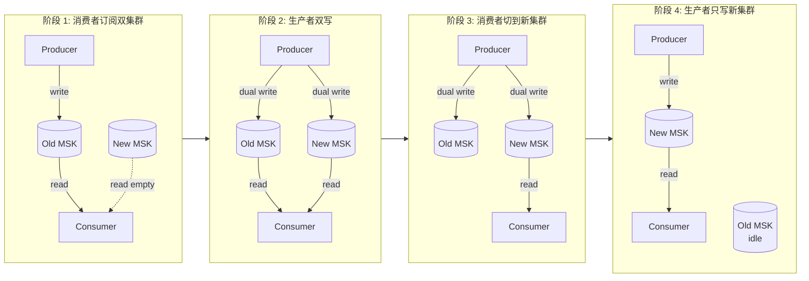
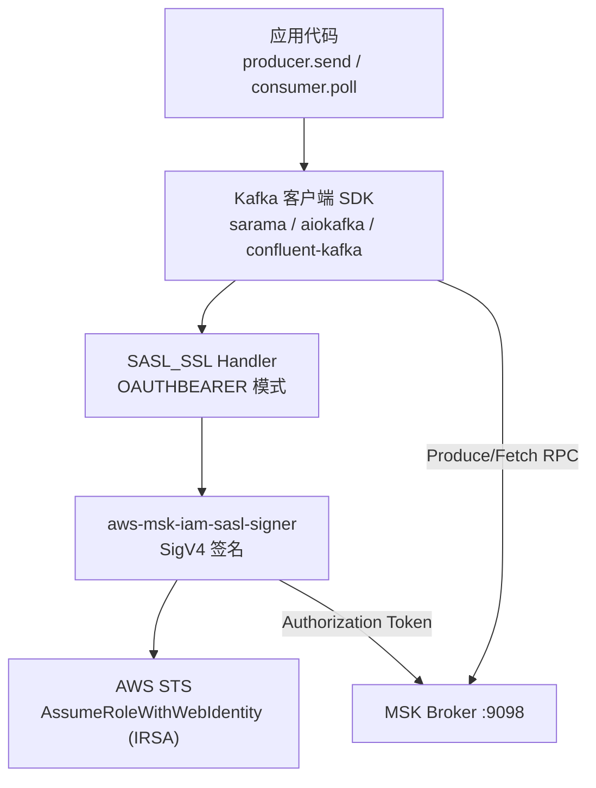

> **元信息**
> - 适用规模：4 个及以上非生产环境共用 MSK Serverless 的中型团队
> - 适用云：AWS（MSK Serverless / MSK Provisioned）
> - 运维负担：实施期 1-2 个工作日/集群，长期与 Serverless 接近
> - 月成本变化：单集群 $540 → ~$75（kafka.t3.small × 2），实测降幅约 86%
> - 最后验证：2026-04-30，AWS MSK 2.8.x + sarama 1.42 + aws-msk-iam-auth 2.2.0

## 适用场景

满足下面任意两条，建议按本 Playbook 评估迁回 Provisioned：

- 单个 MSK Serverless 集群月费 ≥ $400，但实际 topic 流量长期低于 1 MB/s。
- 同一组业务在 dev/qa/pre/staging/prod 各开了一个 Serverless 集群，整体支出超过预算。
- 已经踩到 Serverless 的硬上限：每集群最多 120 个 partition、单 partition 最大 5 MB/s ingress。
- 客户端是 Go sarama 或某些 Java 老版本，跟 Serverless 的多 broker bootstrap 字符串配合不顺。

不适用：流量持续 > 10 MB/s 且峰谷比超过 5 倍的真实业务主干、团队没有任何 Kafka 运维经验、单集群仅服务一个低频 topic 且月费 < $100。

## 核心问题

### 「无脑选 Serverless」的代价

MSK Serverless 的官方定价由四部分组成：

- **集群基础费**：每个集群 $0.75/小时，相当于固定 $540/月。
- **吞吐**：写入 $0.10/GB、读出 $0.05/GB。
- **存储**：$0.10/GB-月。
- **消费者最低费**：每个活跃 IAM principal $0.0015/小时（约 $1.08/月），按 partition × consumer 计算。

对一个跑 dev/test 工作负载的集群，吞吐和存储几乎可以忽略，账单 90% 以上来自第一项的固定 $540。把这笔钱跟一个 `kafka.t3.small × 2` 的 Provisioned 集群对比：

| 项目 | MSK Serverless | MSK Provisioned (kafka.t3.small × 2) |
|---|---|---|
| Broker | 不可见 | 2 × $0.0456/小时 ≈ $66/月 |
| EBS 100 GB gp3 | 含在吞吐 | $8/月 |
| 跨 AZ 流量 | 含 | 实测 < $2/月（低流量场景）|
| 总计 | **~$540/月** | **~$75/月** |

非生产环境流量稳定在 1 GB/月级别时，Serverless 的「按用量付费」完全不成立——你交的几乎全是占位费。如果再算上每个非生产环境单独开一个集群的常见做法，dev/qa/pre/staging 四份固定费就累计 $2,160 一个月，比一个中型业务系统的 RDS 还贵，但 Kafka 实际只承担一些低频信令传递。账单视角下还有一个常被忽略的副效应：占位费按小时计入 `*-Hours` 这一项，而真实业务流量分散进 `*-Throughput` 与 `*-Storage` 子项，财务侧只看「Amazon MSK 这一行涨了多少」时根本看不出钱花在哪里，月度成本复盘时往往是开发同学自己拉 usage type 拆分才能复盘清楚。这种结构化的钱在团队规模扩张时会复利累积，而且很难单独通过「优化 topic」的手段降下来——正解只能是换计费模型本身。

### Serverless 的隐藏天花板

这些数字在 AWS 文档里翻得到，但项目立项时没人会在意，往往要等到撞墙才会回头查：

- 单集群 partition 数上限 **120**，混用 dev/qa/pre/staging 几个环境很容易撞到。
- 单 partition ingress 上限 **5 MB/s**，业务高峰会被悄悄限速。
- 不支持 Kafka 配置参数自定义（`min.insync.replicas`、`retention.ms` 例外，其他都锁死）。
- 不支持 Schema Registry 互通——必须额外用 Glue Schema Registry，迁移时数据不会跟着走。
- Bootstrap 字符串只暴露 IAM 协议端口，不能改 SASL/SCRAM 或 mTLS 调试。
- 不暴露真实 broker 列表，前置一个由 AWS 维护的 NLB，客户端断连重连的 backoff 行为不可预期，遇到节点漂移时偶发数秒级中断。
- 不开放 JMX / metrics endpoint，只能依赖 CloudWatch 上有限的几个指标，遇到分区分布不均、消费者 lag 异常时排障手段非常有限。

### 真正想要的东西

把上面的痛点反过来写，需求很清楚：

1. 月成本随真实吞吐缩放，而不是为占位费买单。
2. partition、retention、segment 等参数可调。
3. 客户端兼容性可控（broker 数量稳定、bootstrap 字符串格式可预期）。
4. 支持双写、灰度切换，万一回滚不要丢消息。

Provisioned 集群从 `kafka.t3.small` 起步就能满足，再大的业务可以平滑升 `kafka.m5.large` 或更大实例，后续按需扩 broker。把这四条要求写到方案评审纪要里，再去筛候选方案，可以避免被「Serverless 才是云原生未来」这种口号干扰决策；选型本质上是一次容量与计费模型的契合度评估，而不是新旧之争。

## 方案对比

### 方案 A：维持 MSK Serverless

适用：单环境、流量稳定且 < 1 MB/s、不在乎每月几百美元差距、团队没人有 Kafka 运维经验。

淘汰理由：本案例下 4 个非生产环境总月费 $2,160，其中约 85% 是固定占位费；同时已经撞到 partition 数预算。

### 方案 B：迁到 MSK Provisioned（推荐）

适用：

- 流量低且稳定的非生产环境（用 `kafka.t3.small × 2`）。
- 流量中等的生产环境（用 `kafka.m5.large × 3`，跨 3 AZ）。
- 想自定义 partition / retention / replica.factor 等参数。

成本和容量在低流量段碾压 Serverless，运维负担只比 Serverless 多一点（broker patch 是托管的，磁盘扩容点几下控制台）。

### 方案 C：完全自建 Kafka（EC2 / EKS）

适用：成本极致敏感、团队已有专职 SRE 维护 Kafka、需要独家定制版本。

淘汰理由：算上跨 AZ 流量、EBS、运维人力、补丁窗口、ZooKeeper（或 KRaft）升级成本，自建 Kafka 在 < 100 MB/s 吞吐量级里没经济优势。同时需要自己实现 IAM 鉴权或回退到 SCRAM/mTLS，认证方案下沉到客户端配置和 K8s Secret，整体复杂度比 Provisioned 高一档。

### 方案 D：换 Confluent Cloud / Aiven

适用：想要 Schema Registry / Connect / ksqlDB 一站式、跨云部署、可接受比 MSK 高 30-50% 的单价。

淘汰理由（在本案例）：技术栈已经全在 AWS、不需要 KSQL 之类的高阶组件、计费颗粒度更粗（按 cluster size + throughput），低流量小集群依然不便宜。

## 推荐架构

迁移采用 **双集群并行 + 顺序切换** 模式，保留旧集群 24 小时随时回滚。下面两张图分别给出双集群迁移的阶段切换示意，和单个客户端 SDK 调用栈在 IAM SASL 认证链路上的位置。





关键决策点：

- **是否做生产者双写**取决于业务能否接受迁移期间丢若干条消息。本案例 Kafka 不是业务主干（业务主干是 RabbitMQ），可以跳过双写直接「停旧、起新」。本文示例脚本两种模式都给出。
- **消费者用静态 partition 绑定**时，每个 Pod 通过 ordinal 序号绑 partition，所以 StatefulSet 副本数必须 ≥ topic partition 数。这个约束决定了迁移时 partition 数只能持平或扩，不能缩。
- **配置走 Nacos 集中管理**。多个 dataId 一次性 publish，避免 Pod 之间出现「半数连旧、半数连新」的分裂状态。
- **IAM 鉴权改用 IRSA**，admin / producer / consumer 各一个 role，不要一把通配符梭哈。这件事看起来跟成本无关，但权限分离换来的最大收益是迁移本身——只要每个 role 的 policy 都明确列了集群 ARN，迁移就能在 IAM 层先做一次端到端 dry-run（建临时 Pod、试连、试写、试读），把潜在的握手错误前置到正式切换之前。

## 实施步骤

### 1. 拉账单 + 估算新集群成本

在动手之前先用 Cost Explorer 拉过去 30 天的实际花费，再对照 Provisioned 估算，避免拍脑袋。

```bash
#!/bin/bash
# msk-cost-pull.sh - 用 Cost Explorer 拉过去 30 天 MSK 账单按 usage type 分桶
# 用法：./msk-cost-pull.sh [region]
# 前置：aws cli v2，IAM 拥有 ce:GetCostAndUsage 权限

set -euo pipefail

REGION="${1:-ap-southeast-1}"
END=$(date -u +%Y-%m-%d)
START=$(date -u -d '30 days ago' +%Y-%m-%d)

command -v jq >/dev/null || { echo "需要 jq"; exit 1; }

aws ce get-cost-and-usage \
  --time-period "Start=${START},End=${END}" \
  --granularity DAILY \
  --metrics "UnblendedCost" \
  --filter '{"And":[{"Dimensions":{"Key":"SERVICE","Values":["Amazon Managed Streaming for Apache Kafka"]}},{"Dimensions":{"Key":"REGION","Values":["'"${REGION}"'"]}}]}' \
  --group-by Type=DIMENSION,Key=USAGE_TYPE \
  --output json \
  | jq -r '
      .ResultsByTime
      | map(.Groups[])
      | group_by(.Keys[0])
      | map({usage_type: .[0].Keys[0], cost_usd: (map(.Metrics.UnblendedCost.Amount | tonumber) | add | .*100 | round / 100)})
      | sort_by(-.cost_usd)
      | (["usage_type","cost_usd"] | @tsv),
        (.[] | [.usage_type, .cost_usd] | @tsv)
    ' \
  | column -t -s $'\t'
```

期望输出形如：

```text
usage_type                            cost_usd
APS1-Kafka-Serverless-Hours           540.00
APS1-Kafka-Serverless-WriteThroughput 0.18
APS1-Kafka-Serverless-Storage         0.04
```

90% 以上集中在 `*-Hours` 这一行就是典型的「占位费」信号。

接下来用一个本地估算器对比新方案：

```python
#!/usr/bin/env python3
# msk_estimator.py - Serverless vs Provisioned 月成本估算
# 用法：python3 msk_estimator.py --brokers 2 --instance kafka.t3.small --ebs-gb 100

import argparse

# 价格参考（2026-04，ap-southeast-1，不含税）
HOUR = 730
BROKER_HOURLY = {
    "kafka.t3.small":   0.0456,
    "kafka.m5.large":   0.21,
    "kafka.m5.xlarge":  0.42,
    "kafka.m5.2xlarge": 0.84,
}
EBS_GP3_PER_GB_MONTH = 0.0928
SERVERLESS_CLUSTER_HOURLY = 0.75
SERVERLESS_INGRESS_PER_GB = 0.10
SERVERLESS_EGRESS_PER_GB  = 0.05
SERVERLESS_STORAGE_GB_MO  = 0.10
SERVERLESS_PARTITION_HOUR = 0.0015

def parse_args():
    p = argparse.ArgumentParser()
    p.add_argument("--brokers", type=int, default=2)
    p.add_argument("--instance", default="kafka.t3.small")
    p.add_argument("--ebs-gb", type=int, default=100)
    p.add_argument("--ingress-gb-mo", type=float, default=1.0)
    p.add_argument("--egress-gb-mo",  type=float, default=1.0)
    p.add_argument("--storage-gb",    type=float, default=2.0)
    p.add_argument("--partitions",    type=int,   default=6)
    return p.parse_args()

def provisioned(args):
    if args.instance not in BROKER_HOURLY:
        raise SystemExit(f"unknown instance {args.instance}")
    broker = BROKER_HOURLY[args.instance] * HOUR * args.brokers
    ebs    = args.ebs_gb * EBS_GP3_PER_GB_MONTH * args.brokers
    return {"broker": broker, "ebs": ebs, "total": broker + ebs}

def serverless(args):
    cluster   = SERVERLESS_CLUSTER_HOURLY * HOUR
    ingress   = args.ingress_gb_mo * SERVERLESS_INGRESS_PER_GB
    egress    = args.egress_gb_mo  * SERVERLESS_EGRESS_PER_GB
    storage   = args.storage_gb    * SERVERLESS_STORAGE_GB_MO
    partition = args.partitions    * SERVERLESS_PARTITION_HOUR * HOUR
    return {
        "cluster": cluster, "ingress": ingress, "egress": egress,
        "storage": storage, "partition": partition,
        "total": cluster + ingress + egress + storage + partition,
    }

def main():
    args = parse_args()
    p = provisioned(args)
    s = serverless(args)
    print(f"Provisioned ({args.brokers}x {args.instance}, {args.ebs_gb}GB EBS):")
    for k, v in p.items():
        print(f"  {k:10s} ${v:7.2f}")
    print(f"\nServerless (ingress {args.ingress_gb_mo}GB, partitions {args.partitions}):")
    for k, v in s.items():
        print(f"  {k:10s} ${v:7.2f}")
    delta = s["total"] - p["total"]
    pct   = delta / s["total"] * 100 if s["total"] else 0
    print(f"\n月节省 ${delta:.2f} ({pct:.1f}%)")

if __name__ == "__main__":
    main()
```

低流量场景跑一次输出大致是 `Provisioned total ≈ 79`、`Serverless total ≈ 559`、节省 86%，跟我们实测的差别在 1-2 美元以内。

### 2. 选择 broker 实例规格

参考标准：

| 流量峰值 | 推荐机型 | broker 数量 | 备注 |
|---|---|---|---|
| < 5 MB/s（dev/qa/pre）| `kafka.t3.small` | 2 | 单 AZ 也行，跨 AZ 更稳 |
| 5-30 MB/s（中型 prod）| `kafka.m5.large` | 3 | 必须跨 3 AZ |
| 30-100 MB/s | `kafka.m5.xlarge` | 3-6 | 关注 EBS IOPS |
| > 100 MB/s | `kafka.m5.2xlarge`+ | 6+ | 单独评估 |

**Provisioned 集群创建后不能改 broker 数量（只能扩，不能缩；机型可以原地变更）**，所以起步规划要留余量。本案例 4 个非生产环境统一选 `kafka.t3.small × 2`，topic partition 一律取所有环境消费者副本数的最大值（6），跨环境复用一份 IaC。

容量反向估算公式（实战里够用就行，不用太精细）：

```text
broker 数 ≥ ceil(峰值吞吐 MB/s / 单 broker 可承载 MB/s) × replication_factor / partition_per_broker
单 broker 可承载 ≈ 实例规格 × 0.6（留 burst 余量）
partition 数 ≥ max(消费者副本数, broker 数 × 2, 峰值吞吐 / 5 MB/s)
```

### 3. 创建 Provisioned 集群

把所有参数写成 JSON 提交，避免控制台点击漏字段。

```json
{
  "ClusterName": "svc-foo-qa-kafka-v2",
  "KafkaVersion": "2.8.1",
  "NumberOfBrokerNodes": 2,
  "BrokerNodeGroupInfo": {
    "InstanceType": "kafka.t3.small",
    "ClientSubnets": [
      "subnet-aaaaaaaaaaaaaaaaa",
      "subnet-bbbbbbbbbbbbbbbbb"
    ],
    "SecurityGroups": [
      "sg-xxxxxxxxxxxxxxxxx"
    ],
    "StorageInfo": {
      "EbsStorageInfo": {
        "VolumeSize": 100,
        "ProvisionedThroughput": {
          "Enabled": false
        }
      }
    },
    "ConnectivityInfo": {
      "PublicAccess": {
        "Type": "DISABLED"
      }
    }
  },
  "ClientAuthentication": {
    "Sasl": {
      "Iam": { "Enabled": true }
    },
    "Unauthenticated": { "Enabled": false }
  },
  "EncryptionInfo": {
    "EncryptionAtRest": {
      "DataVolumeKMSKeyId": "alias/aws/kafka"
    },
    "EncryptionInTransit": {
      "ClientBroker": "TLS",
      "InCluster": true
    }
  },
  "EnhancedMonitoring": "PER_TOPIC_PER_BROKER",
  "OpenMonitoring": {
    "Prometheus": {
      "JmxExporter":  { "EnabledInBroker": true },
      "NodeExporter": { "EnabledInBroker": true }
    }
  },
  "LoggingInfo": {
    "BrokerLogs": {
      "CloudWatchLogs": {
        "Enabled": true,
        "LogGroup": "/aws/msk/svc-foo-qa-kafka-v2"
      }
    }
  },
  "Tags": {
    "Environment": "qa",
    "Service": "svc-foo",
    "ManagedBy": "playbook"
  }
}
```

提交并轮询创建状态：

```bash
#!/bin/bash
# msk-create.sh - 创建 Provisioned 集群并等待 ACTIVE
# 用法：./msk-create.sh cluster-config.json [region]
# 前置：kafka:CreateCluster / DescribeCluster 权限；ClientSubnets 至少 2 个不同 AZ

set -euo pipefail

CFG="${1:?cluster-config.json}"
REGION="${2:-ap-southeast-1}"

command -v jq >/dev/null || { echo "需要 jq"; exit 1; }

ARN=$(aws kafka create-cluster --cli-input-json "file://${CFG}" --region "${REGION}" \
        --query 'ClusterArn' --output text)
echo "已创建 ClusterArn=${ARN}"

while true; do
  STATE=$(aws kafka describe-cluster --cluster-arn "${ARN}" --region "${REGION}" \
            --query 'ClusterInfo.State' --output text)
  echo "$(date -u +%H:%M:%S) state=${STATE}"
  case "${STATE}" in
    ACTIVE)  break ;;
    FAILED)  echo "创建失败"; exit 2 ;;
    CREATING|UPDATING) sleep 30 ;;
    *)       echo "未知状态 ${STATE}"; exit 3 ;;
  esac
done

aws kafka get-bootstrap-brokers --cluster-arn "${ARN}" --region "${REGION}" \
  --query 'BootstrapBrokerStringSaslIam' --output text
```

期望输出：

```text
已创建 ClusterArn=arn:aws:kafka:ap-southeast-1:<ACCOUNT_ID>:cluster/svc-foo-qa-kafka-v2/...
14:02:11 state=CREATING
...（约 18-25 分钟）...
14:21:43 state=ACTIVE
b-1.svcfooqakafkav2.xxxxxx.c4.kafka.ap-southeast-1.amazonaws.com:9098,b-2...
```

**回滚**：创建过程中可以 `aws kafka delete-cluster --cluster-arn ${ARN}`，几分钟内消失。

### 4. 拆分 IRSA role（admin / producer / consumer）

每类身份一个 SA，对应一个 IAM role，policy 中明确列出新集群 ARN，不要用 `*`。

#### Service Account

```yaml
---
apiVersion: v1
kind: ServiceAccount
metadata:
  name: kafka-admin
  namespace: svc-foo
  annotations:
    eks.amazonaws.com/role-arn: arn:aws:iam::<ACCOUNT_ID>:role/svc-foo-msk-admin
---
apiVersion: v1
kind: ServiceAccount
metadata:
  name: kafka-producer
  namespace: svc-foo
  annotations:
    eks.amazonaws.com/role-arn: arn:aws:iam::<ACCOUNT_ID>:role/svc-foo-msk-producer
---
apiVersion: v1
kind: ServiceAccount
metadata:
  name: kafka-consumer
  namespace: svc-foo
  annotations:
    eks.amazonaws.com/role-arn: arn:aws:iam::<ACCOUNT_ID>:role/svc-foo-msk-consumer
```

#### Trust Policy（每个 role 一份）

```json
{
  "Version": "2012-10-17",
  "Statement": [
    {
      "Effect": "Allow",
      "Principal": {
        "Federated": "arn:aws:iam::<ACCOUNT_ID>:oidc-provider/oidc.eks.ap-southeast-1.amazonaws.com/id/<OIDC_ID>"
      },
      "Action": "sts:AssumeRoleWithWebIdentity",
      "Condition": {
        "StringEquals": {
          "oidc.eks.ap-southeast-1.amazonaws.com/id/<OIDC_ID>:sub": "system:serviceaccount:svc-foo:kafka-admin",
          "oidc.eks.ap-southeast-1.amazonaws.com/id/<OIDC_ID>:aud": "sts.amazonaws.com"
        }
      }
    }
  ]
}
```

#### Permission Policy

admin（建 topic、改配置、看 metadata）：

```json
{
  "Version": "2012-10-17",
  "Statement": [
    {
      "Effect": "Allow",
      "Action": [
        "kafka-cluster:Connect",
        "kafka-cluster:DescribeCluster",
        "kafka-cluster:AlterCluster",
        "kafka-cluster:DescribeTopic",
        "kafka-cluster:CreateTopic",
        "kafka-cluster:DeleteTopic",
        "kafka-cluster:AlterTopic",
        "kafka-cluster:DescribeTopicDynamicConfiguration",
        "kafka-cluster:AlterTopicDynamicConfiguration",
        "kafka-cluster:DescribeGroup",
        "kafka-cluster:AlterGroup",
        "kafka-cluster:DeleteGroup"
      ],
      "Resource": [
        "arn:aws:kafka:ap-southeast-1:<ACCOUNT_ID>:cluster/svc-foo-qa-kafka-v2/*",
        "arn:aws:kafka:ap-southeast-1:<ACCOUNT_ID>:topic/svc-foo-qa-kafka-v2/*/*",
        "arn:aws:kafka:ap-southeast-1:<ACCOUNT_ID>:group/svc-foo-qa-kafka-v2/*/*"
      ]
    }
  ]
}
```

producer（连集群 + 写指定前缀的 topic）：

```json
{
  "Version": "2012-10-17",
  "Statement": [
    {
      "Effect": "Allow",
      "Action": ["kafka-cluster:Connect"],
      "Resource": "arn:aws:kafka:ap-southeast-1:<ACCOUNT_ID>:cluster/svc-foo-qa-kafka-v2/*"
    },
    {
      "Effect": "Allow",
      "Action": [
        "kafka-cluster:WriteData",
        "kafka-cluster:DescribeTopic",
        "kafka-cluster:WriteDataIdempotently"
      ],
      "Resource": "arn:aws:kafka:ap-southeast-1:<ACCOUNT_ID>:topic/svc-foo-qa-kafka-v2/*/message-*"
    }
  ]
}
```

consumer（连集群 + 读指定前缀的 topic + 提交 offset）：

```json
{
  "Version": "2012-10-17",
  "Statement": [
    {
      "Effect": "Allow",
      "Action": ["kafka-cluster:Connect"],
      "Resource": "arn:aws:kafka:ap-southeast-1:<ACCOUNT_ID>:cluster/svc-foo-qa-kafka-v2/*"
    },
    {
      "Effect": "Allow",
      "Action": [
        "kafka-cluster:ReadData",
        "kafka-cluster:DescribeTopic"
      ],
      "Resource": "arn:aws:kafka:ap-southeast-1:<ACCOUNT_ID>:topic/svc-foo-qa-kafka-v2/*/message-*"
    },
    {
      "Effect": "Allow",
      "Action": [
        "kafka-cluster:DescribeGroup",
        "kafka-cluster:AlterGroup"
      ],
      "Resource": "arn:aws:kafka:ap-southeast-1:<ACCOUNT_ID>:group/svc-foo-qa-kafka-v2/*/*"
    }
  ]
}
```

**验证**：

```bash
# 列出 ns 内所有 SA → role 映射，确认 3 个 SA 都注解到位
kubectl -n svc-foo get sa -o json | python3 -c "
import json, sys
for i in json.load(sys.stdin)['items']:
    name = i['metadata']['name']
    role = i['metadata'].get('annotations', {}).get('eks.amazonaws.com/role-arn', 'NONE')
    if role != 'NONE':
        print(f'{name}: {role}')
"
# 起一个临时 Pod 用 admin SA 试连，能 list 即通
kubectl -n svc-foo run iam-check --rm -it --restart=Never \
  --image=amazon/aws-cli:2.15.0 \
  --overrides='{"spec":{"serviceAccountName":"kafka-admin"}}' \
  -- sts get-caller-identity
```

期望第二条命令输出 `Arn: arn:aws:sts::<ACCOUNT_ID>:assumed-role/svc-foo-msk-admin/...`，证明 IRSA 链路打通。

### 5. 建 topic

```bash
#!/bin/bash
# msk-create-topic.sh - 在新集群上建 topic
# 用法：./msk-create-topic.sh <new-bootstrap> <topic> <partitions>
# 前置：当前 kubectl context 指向迁移目标 EKS

set -euo pipefail
NEW_BS="${1:?bootstrap}"
TOPIC="${2:?topic}"
PART="${3:?partitions}"

kubectl -n svc-foo run kafka-cli --image=confluentinc/cp-kafka:7.5.0 \
  --restart=Never \
  --overrides='{"spec":{"serviceAccountName":"kafka-admin"}}' \
  --command -- sleep 600

trap 'kubectl -n svc-foo delete pod kafka-cli --ignore-not-found' EXIT

kubectl -n svc-foo wait --for=condition=Ready pod/kafka-cli --timeout=60s

kubectl -n svc-foo exec kafka-cli -- bash -c "
  set -e
  curl -sL -o /tmp/iam.jar \
    https://github.com/aws/aws-msk-iam-auth/releases/download/v2.2.0/aws-msk-iam-auth-2.2.0-all.jar
  export CLASSPATH=/tmp/iam.jar
  cat > /tmp/client.properties <<'EOF'
security.protocol=SASL_SSL
sasl.mechanism=AWS_MSK_IAM
sasl.jaas.config=software.amazon.msk.auth.iam.IAMLoginModule required;
sasl.client.callback.handler.class=software.amazon.msk.auth.iam.IAMClientCallbackHandler
EOF
  kafka-topics --bootstrap-server '${NEW_BS}' --command-config /tmp/client.properties \
    --create --topic '${TOPIC}' --partitions '${PART}' --replication-factor 2 \
    --config retention.ms=604800000 --config min.insync.replicas=1
  kafka-topics --bootstrap-server '${NEW_BS}' --command-config /tmp/client.properties --describe --topic '${TOPIC}'
"
```

`--replication-factor 2` 在 broker = 2 时是上限；`min.insync.replicas=1` 允许在单 broker 故障时仍可写入，适合非关键链路；生产环境应保持 `replication-factor=3 + min.insync.replicas=2`。

### 6. 客户端配置（Java / Go / Python 三栈）

#### Java（Spring Kafka）

`application.yaml`：

```yaml
spring:
  kafka:
    bootstrap-servers:
      - b-1.svcfooqakafkav2.xxxxxx.c4.kafka.ap-southeast-1.amazonaws.com:9098
      - b-2.svcfooqakafkav2.xxxxxx.c4.kafka.ap-southeast-1.amazonaws.com:9098
    properties:
      security.protocol: SASL_SSL
      sasl.mechanism: AWS_MSK_IAM
      sasl.jaas.config: software.amazon.msk.auth.iam.IAMLoginModule required;
      sasl.client.callback.handler.class: software.amazon.msk.auth.iam.IAMClientCallbackHandler
    consumer:
      group-id: svc-foo-consumer
      auto-offset-reset: earliest
      enable-auto-commit: false
    producer:
      acks: all
      retries: 5
      properties:
        enable.idempotence: true
```

`pom.xml` 关键依赖：

```xml
<dependency>
  <groupId>software.amazon.msk</groupId>
  <artifactId>aws-msk-iam-auth</artifactId>
  <version>2.2.0</version>
</dependency>
```

如果不想用官方 callback 类，自己写一个最小实现：

```java
public class MskIamCallbackHandler implements AuthenticateCallbackHandler {
    private String region;

    @Override
    public void configure(Map<String, ?> cfg, String mechanism, List<AppConfigurationEntry> jaas) {
        this.region = (String) cfg.getOrDefault(AWSConfigConstants.AWS_REGION, "ap-southeast-1");
    }

    @Override
    public void handle(Callback[] callbacks) throws IOException {
        for (Callback cb : callbacks) {
            if (cb instanceof OAuthBearerTokenCallback) {
                String token = MSKAuthTokenProvider.generateAuthToken(Region.of(region));
                ((OAuthBearerTokenCallback) cb).token(new BasicOAuthBearerToken(token, ...));
            }
        }
    }

    @Override public void close() {}
}
```

#### Go（sarama）

```go
package kafkaclient

import (
	"context"
	"strings"
	"time"

	"github.com/IBM/sarama"
	"github.com/aws/aws-msk-iam-sasl-signer-go/signer"
)

type mskTokenProvider struct {
	region string
}

func (m *mskTokenProvider) Token() (*sarama.AccessToken, error) {
	token, _, err := signer.GenerateAuthToken(context.Background(), m.region)
	if err != nil {
		return nil, err
	}
	return &sarama.AccessToken{Token: token}, nil
}

// NewConfig 注意：brokers 必须是逗号分隔字符串切分后的 []string，不要把整段塞进一个元素
func NewConfig(brokersCSV, region string) (sarama.Client, error) {
	brokers := strings.Split(brokersCSV, ",")
	for i := range brokers {
		brokers[i] = strings.TrimSpace(brokers[i])
	}

	cfg := sarama.NewConfig()
	cfg.Version = sarama.V2_8_1_0
	cfg.Net.SASL.Enable = true
	cfg.Net.SASL.Mechanism = sarama.SASLTypeOAuth
	cfg.Net.SASL.TokenProvider = &mskTokenProvider{region: region}
	cfg.Net.TLS.Enable = true
	cfg.Net.DialTimeout = 10 * time.Second
	cfg.Producer.RequiredAcks = sarama.WaitForAll
	cfg.Producer.Idempotent = true
	cfg.Producer.Retry.Max = 5
	cfg.Net.MaxOpenRequests = 1

	return sarama.NewClient(brokers, cfg)
}
```

如果配置文件里写的是 YAML list，`viper.GetStringSlice("Kafka.Addrs")` 直接拿到 `[]string`，跳过 `strings.Split`。

#### Python（confluent-kafka）

```python
# kafka_client.py
import socket
from typing import Tuple

from aws_msk_iam_sasl_signer import MSKAuthTokenProvider
from confluent_kafka import Consumer, Producer

REGION = "ap-southeast-1"

def oauth_cb(_oauth_config) -> Tuple[str, float]:
    token, expiry_ms = MSKAuthTokenProvider.generate_auth_token(REGION)
    # confluent-kafka 期望返回 (token, expiry_seconds_since_epoch)
    return token, expiry_ms / 1000.0

def make_producer(bootstrap: str) -> Producer:
    return Producer({
        "bootstrap.servers": bootstrap,
        "security.protocol": "SASL_SSL",
        "sasl.mechanism":    "OAUTHBEARER",
        "oauth_cb":          oauth_cb,
        "client.id":         socket.gethostname(),
        "enable.idempotence": True,
        "acks": "all",
        "compression.type": "lz4",
    })

def make_consumer(bootstrap: str, group_id: str) -> Consumer:
    return Consumer({
        "bootstrap.servers": bootstrap,
        "security.protocol": "SASL_SSL",
        "sasl.mechanism":    "OAUTHBEARER",
        "oauth_cb":          oauth_cb,
        "group.id":          group_id,
        "auto.offset.reset": "earliest",
        "enable.auto.commit": False,
    })
```

`confluent-kafka` Python 接受逗号分隔字符串，aiokafka 也接受；只有 sarama 严格要求 `[]string`，这是踩坑 2 的根因。

### 7. 双集群双写迁移五阶段

> 说明：本案例最终选了「不双写、停旧切新」的简化路径，因为 Kafka 不是业务主干。下面给出的是**完整双写五阶段流程**，供消息绝不丢的场景参考。简化路径只走阶段 1 + 阶段 4 + 阶段 5（消费者切到双订阅 → 生产者一次切到新集群 → 旧集群下线），跳过双写。

#### 阶段 1：消费者订阅新集群（保持订阅旧集群）

把消费者改成同时订阅新旧两个集群（不同的 client，相同的 group.id 或不同 group.id 都行）。新集群 topic 已经建好但暂时没消息。

执行：

```bash
# Nacos publish 新增字段
kafka.bootstrap_servers_new=<NEW_BS>
kafka.dual_consume=true

# rollout consumer
kubectl -n svc-foo rollout restart sts/consumer
kubectl -n svc-foo rollout status sts/consumer --timeout=10m
```

验证：

```bash
# 旧集群 lag 正常（offset 增长）
kafka-consumer-groups --bootstrap-server $OLD_BS --command-config /tmp/old.properties \
  --describe --group svc-foo-consumer

# 新集群 lag = 0（暂时没消息）
kafka-consumer-groups --bootstrap-server $NEW_BS --command-config /tmp/new.properties \
  --describe --group svc-foo-consumer
```

#### 阶段 2：生产者双写

生产者代码层启动 dual write，一次成功视为成功：

```python
# producer dual write 简化示意
def send(payload: bytes, key: bytes):
    fut_old = old_producer.produce(TOPIC, value=payload, key=key)
    fut_new = new_producer.produce(TOPIC, value=payload, key=key)
    old_producer.poll(0)
    new_producer.poll(0)
    # 任意一边成功即视为成功，避免拖慢主流程
```

或者直接配置双 endpoint，靠 SDK 内部 dual write（如果 SDK 不支持，必须代码层处理）。

执行：

```bash
# Nacos
kafka.bootstrap_servers_new=<NEW_BS>
kafka.dual_produce=true
kubectl -n svc-foo rollout restart deploy/producer
```

验证：

```bash
# 新集群 BytesInPerSec 起来
aws cloudwatch get-metric-statistics --namespace AWS/Kafka \
  --metric-name BytesInPerSec --dimensions \
  Name="Cluster Name",Value=svc-foo-qa-kafka-v2 \
  Name="Broker ID",Value=1 \
  --start-time $(date -u -d '5 minutes ago' +%FT%TZ) \
  --end-time $(date -u +%FT%TZ) \
  --period 60 --statistics Sum --region ap-southeast-1

# 新集群消费 lag 应该开始增长，说明消息进得来
```

#### 阶段 3：消费者只订阅新集群

确认新集群消费者已经能完整处理消息（业务侧抽样校验）后，关掉旧集群订阅：

```bash
# Nacos
kafka.dual_consume=false
kafka.bootstrap_servers=<NEW_BS>     # 主 endpoint 切到新集群
kubectl -n svc-foo rollout restart sts/consumer
```

验证：

```bash
# 旧集群消费 lag 暂停增长但 offset 不动（因为没人订阅了），约 30 分钟后过期消失
kafka-consumer-groups --bootstrap-server $OLD_BS --command-config /tmp/old.properties \
  --describe --group svc-foo-consumer
# 输出 has no active members 是正常的
```

#### 阶段 4：生产者只写新集群

```bash
# Nacos
kafka.dual_produce=false
kafka.bootstrap_servers=<NEW_BS>
kubectl -n svc-foo rollout restart deploy/producer
```

验证：

```bash
# 旧集群 BytesInPerSec 应该 30 分钟内归零
aws cloudwatch get-metric-statistics --namespace AWS/Kafka \
  --metric-name BytesInPerSec --dimensions \
  Name="Cluster Name",Value=svc-foo-qa-kafka-old \
  --start-time $(date -u -d '30 minutes ago' +%FT%TZ) \
  --end-time $(date -u +%FT%TZ) \
  --period 60 --statistics Sum --region ap-southeast-1

# 应用日志中无 KafkaConnectionError、SASL handshake failed
kubectl -n svc-foo logs -l app=producer --tail=200 | grep -iE 'kafka|sasl|error' || echo OK
```

#### 阶段 5：旧集群下线

至少观察 24 小时，确认无任何流量、无业务报错：

```bash
# 检查任何 pod 是否还在连旧 broker
kubectl -n svc-foo exec deploy/producer -- bash -c \
  'cat /proc/net/tcp | awk "{print \$3}" | sort -u' | python3 -c '
import sys
for line in sys.stdin:
    line=line.strip()
    if not line or line=="local_address": continue
    ip = ".".join(str(int(line.split(":")[0][i:i+2],16)) for i in (6,4,2,0))
    print(ip)
' | sort -u

# 删除旧集群
aws kafka delete-cluster --cluster-arn $OLD_ARN --region ap-southeast-1
```

### 8. Schema Registry 迁移

如果旧链路用了 Glue Schema Registry，schema 数据本身**不会**跟着集群走。需要一次手工导出导入。

#### 导出

```bash
#!/bin/bash
# schema-export.sh - 把一个 Glue Registry 下所有 schema 导出到本地 JSON
# 用法：./schema-export.sh <registry-name> <out-dir> [region]

set -euo pipefail
REG="${1:?registry}"
OUT="${2:?out-dir}"
REGION="${3:-ap-southeast-1}"

mkdir -p "${OUT}"
command -v jq >/dev/null || { echo "需要 jq"; exit 1; }

aws glue list-schemas --registry-id RegistryName="${REG}" --region "${REGION}" \
    --max-results 100 \
    --query 'Schemas[].SchemaName' --output json | jq -r '.[]' | while read -r SCHEMA; do
  echo "导出 ${SCHEMA}"
  aws glue list-schema-versions \
      --schema-id RegistryName="${REG}",SchemaName="${SCHEMA}" \
      --region "${REGION}" --max-results 100 \
      --query 'Schemas[].VersionNumber' --output json | jq -r '.[]' | while read -r VER; do
    aws glue get-schema-version \
        --schema-id RegistryName="${REG}",SchemaName="${SCHEMA}" \
        --schema-version-number VersionNumber="${VER}" \
        --region "${REGION}" \
        > "${OUT}/${SCHEMA}.v${VER}.json"
  done
done

echo "完成，文件落 ${OUT}/"
ls -1 "${OUT}/"
```

#### 导入到新 Glue Registry

```bash
#!/bin/bash
# schema-import.sh - 按版本顺序导入到目标 Registry
# 用法：./schema-import.sh <new-registry> <in-dir> [region]

set -euo pipefail
REG="${1:?registry}"
IN="${2:?in-dir}"
REGION="${3:-ap-southeast-1}"

aws glue create-registry --registry-name "${REG}" --region "${REGION}" 2>/dev/null || true

# 按 schema 名字 + 版本号排序，逐个 register / put
ls "${IN}" | sed -E 's/\.v[0-9]+\.json$//' | sort -u | while read -r SCHEMA; do
  ls "${IN}" | grep "^${SCHEMA}\.v" | sort -t v -k2 -n | while read -r FILE; do
    DEF=$(jq -r '.SchemaDefinition' "${IN}/${FILE}")
    DT=$(jq -r '.DataFormat'        "${IN}/${FILE}")
    if aws glue get-schema --schema-id RegistryName="${REG}",SchemaName="${SCHEMA}" \
         --region "${REGION}" >/dev/null 2>&1; then
      aws glue register-schema-version \
        --schema-id RegistryName="${REG}",SchemaName="${SCHEMA}" \
        --schema-definition "${DEF}" --region "${REGION}" >/dev/null
    else
      aws glue create-schema \
        --registry-id RegistryName="${REG}" \
        --schema-name "${SCHEMA}" --data-format "${DT}" \
        --compatibility BACKWARD --schema-definition "${DEF}" \
        --region "${REGION}" >/dev/null
    fi
    echo "imported ${FILE}"
  done
done
```

#### 客户端切换

把客户端配置里的 registry name 改到新 registry，序列化器同步指向：

```yaml
# Java/Spring 端示意
spring:
  kafka:
    properties:
      schema.registry.url: ""    # 走 AWS Glue 而非 Confluent SR 时留空
      registry.name:        svc-foo-prod-registry
      avro.serialization.required.field: true
```

如果换到 Confluent Schema Registry（独立部署 / Confluent Cloud），改成：

```yaml
spring:
  kafka:
    properties:
      schema.registry.url: https://schema-registry.example.aws.com
      basic.auth.credentials.source: USER_INFO
      basic.auth.user.info: <key>:<secret>
```

**验证**：业务侧选一个写入 + 消费的 schema id，比对新旧 registry 中的 schema definition `sha256sum`，要求一致。

### 9. 回滚脚本

旧集群保留 24 小时期间，回滚就是把 Nacos 的 endpoint 改回去 + rollout。中途任何阶段卡住都可执行。

```bash
#!/bin/bash
# msk-rollback.sh - 回滚到旧集群
# 用法：./msk-rollback.sh <env> [phase]
# phase: 1|2|3|4 表示当前所处阶段，未传则全量回滚

set -euo pipefail
ENV="${1:?env}"
PHASE="${2:-full}"
BACKUP_DIR="${HOME}/ops-archive/$(date +%F)-msk-rollback-${ENV}"
mkdir -p "${BACKUP_DIR}"

case "${PHASE}" in
  1)
    # 阶段 1 = 仅消费者改了双订阅，回滚只需关闭 dual_consume
    nacos-cli set "${ENV}/svc-foo/kafka.dual_consume" false
    kubectl -n svc-foo rollout restart sts/consumer
    ;;
  2|3)
    # 阶段 2/3 = 已经 dual write 或消费者切新，回滚需要把所有 endpoint 切回旧 + 关 dual
    nacos-cli set "${ENV}/svc-foo/kafka.bootstrap_servers" "${OLD_BS}"
    nacos-cli set "${ENV}/svc-foo/kafka.dual_produce" false
    nacos-cli set "${ENV}/svc-foo/kafka.dual_consume" false
    kubectl -n svc-foo rollout restart deploy/producer sts/consumer
    ;;
  4|full)
    # 阶段 4 = 已经只写新，旧集群可能没流量但 IAM 还在，全量回滚
    nacos-cli set "${ENV}/svc-foo/kafka.bootstrap_servers" "${OLD_BS}"
    nacos-cli set "${ENV}/svc-foo/kafka.dual_produce" false
    nacos-cli set "${ENV}/svc-foo/kafka.dual_consume" false
    kubectl -n svc-foo rollout restart deploy/producer sts/consumer
    # 确认旧 IAM policy 仍含旧集群 ARN（追加模式不需要改）
    aws iam get-role-policy --role-name svc-foo-msk-producer \
      --policy-name msk-access --query 'PolicyDocument' \
      --output json > "${BACKUP_DIR}/producer-policy.json"
    ;;
  *)
    echo "unknown phase ${PHASE}"; exit 1 ;;
esac

echo "回滚动作已下发，验证："
echo "  kubectl -n svc-foo logs -l app=consumer --tail=200 | grep -iE 'kafka|sasl|error'"
echo "  kafka-consumer-groups --bootstrap-server ${OLD_BS} --describe --group svc-foo-consumer"
```

预防一切的关键是 IAM policy **追加** 而非 **替换**：始终保留旧集群 ARN，新 Pod 起来就能连旧集群，5 分钟内完全回滚。

## 踩过的坑

### 坑 1：多个 IRSA role 共存，policy 加漏一个就 50% Pod CrashLoop

**现象**：迁移完成 5 分钟后，某个生产者服务和网关服务的新 Pod 全部 CrashLoop，日志显示 `KafkaConnectionError: Connection closed`（SASL handshake 被 broker 拒绝）。同集群的消费者一切正常。

**根因**：同一个 namespace 下其实有两个 ServiceAccount 各自映射不同的 IAM role：

```text
svc-foo-msk SA → role/svc-foo-msk-access      (consumer 用，policy 含通配符 *)
msk-sa       SA → role/svc-foo-prod-msk-role  (producer/gateway 用，硬编码旧集群 ARN)
```

第二个 role 的 policy 只写了旧 Serverless 集群的 UUID，新集群 ARN 没追加进去，所以 SASL 握手在 IAM 层被直接拒绝。

**修复**：

```bash
# 列出 ns 下所有 SA → role 映射
kubectl -n svc-foo get sa -o json | python3 -c "
import json, sys
for i in json.load(sys.stdin)['items']:
    name = i['metadata']['name']
    role = i['metadata'].get('annotations', {}).get('eks.amazonaws.com/role-arn', 'NONE')
    if role != 'NONE':
        print(f'{name}: {role}')
"

# 对每个非 NONE 的 role 都追加新集群 ARN 到 policy（追加模式，旧 ARN 保留）
for ROLE in svc-foo-msk-access svc-foo-prod-msk-role; do
  aws iam get-role-policy --role-name "${ROLE}" --policy-name msk-access \
    --query 'PolicyDocument' --output json > "/tmp/${ROLE}.json"
  jq '.Statement[].Resource += [
        "arn:aws:kafka:ap-southeast-1:<ACCOUNT_ID>:cluster/svc-foo-qa-kafka-v2/*",
        "arn:aws:kafka:ap-southeast-1:<ACCOUNT_ID>:topic/svc-foo-qa-kafka-v2/*/*",
        "arn:aws:kafka:ap-southeast-1:<ACCOUNT_ID>:group/svc-foo-qa-kafka-v2/*/*"
      ]' "/tmp/${ROLE}.json" > "/tmp/${ROLE}.new.json"
  aws iam put-role-policy --role-name "${ROLE}" --policy-name msk-access \
    --policy-document "file:///tmp/${ROLE}.new.json"
done
```

**通用结论**：迁移前必须先列清楚 namespace 内所有 SA → role → policy 的三层映射。「一个 role 通吃」看似省事，但一旦做权限分级就会变成跨集群迁移最容易漏的环节。运维 SOP 加一步「dump SA-role mapping」，比事后排查 CrashLoop 便宜得多。这一类问题的共性是：故障表现集中在握手阶段，而握手错误往往被框架包装成笼统的连接异常，光看应用日志容易误判成网络问题。

### 坑 2：sarama 解析 bootstrap 字符串时不接受逗号分隔

**现象**：生产者和消费者切完一切正常，唯独 Go 网关启动即 panic：

```text
panic: runtime error: too many colons in address b-1.svcfooqakafkav2.xxxxxx.c4.kafka.ap-southeast-1.amazonaws.com:9098,b-2.svcfooqakafkav2.xxxxxx.c4.kafka.ap-southeast-1.amazonaws.com:9098

goroutine 1 [running]:
net.parseAddr(...)
github.com/IBM/sarama.(*Broker).Open(...)
```

**根因**：MSK 的 `get-bootstrap-brokers` 返回单字符串 `b-1.xxx:9098,b-2.xxx:9098`，三种客户端解析行为不同：

| 客户端 | 单字符串逗号分隔 |
|---|---|
| aiokafka (Python) | 接受 |
| confluent-kafka-go / librdkafka | 接受 |
| confluent-kafka (Python) | 接受 |
| **sarama (Go)** | **拒绝**，要求 `[]string` |

Go 网关用 sarama，配置经 YAML 反序列化后还是单字符串，所以挂掉。

**修复（YAML 配置侧）**：

```diff
 Kafka:
-  Addrs: ["b-1.xxx:9098,b-2.xxx:9098"]
+  Addrs:
+    - "b-1.xxx:9098"
+    - "b-2.xxx:9098"
```

**修复（迁移脚本侧）**，把可能混入逗号的写法自动展开成 list：

```python
import re

def split_addrs(content: str) -> str:
    def repl(m):
        hosts = m.group(1).split(",")
        if len(hosts) > 1:
            return "Addrs: [" + ", ".join(f'"{h.strip()}"' for h in hosts) + "]"
        return m.group(0)
    return re.sub(r'Addrs:\s*\["([^"]+)"\]', repl, content)
```

**修复（Go 代码侧）兜底**：

```go
brokers := strings.Split(strings.TrimSpace(brokersCSV), ",")
for i := range brokers {
    brokers[i] = strings.TrimSpace(brokers[i])
}
client, err := sarama.NewClient(brokers, cfg)
```

**通用结论**：MSK Serverless 通常只暴露一个 endpoint（前面挂 NLB），切到 Provisioned 后 broker 列表才是真实的 N 个 host，**客户端兼容性必须按客户端逐个验证**，不能假设「原来能跑就还能跑」。改造前先灰度一台 Pod 试新配置。同样的兼容性陷阱在 Confluent Cloud / 自建 Kafka 切换时也存在，根因都是 bootstrap 字符串的解析约定在不同语言生态里没有统一标准。

### 坑 3：Provisioned 集群创建后不能减 broker 数量

**现象**：起步选了 `kafka.t3.small × 2`，半年后业务长大想缩到 1 broker 省点钱（流量降回去了），AWS 控制台找不到入口，CLI 也直接报错。

**根因**：MSK Provisioned 支持 broker 数 **扩** 和机型 **变更**，但不支持 broker 数减少（除了删除整个集群）。这是 MSK 控制平面的硬约束，并不是配额能开。

**修复（其实只能预防）**——容量规划脚本：

```python
#!/usr/bin/env python3
# capacity_plan.py - 给定当前流量 / 目标 12 个月增长，反算最小 broker 数
# 用法：python3 capacity_plan.py --current-mbs 1.5 --growth 3 --partitions 6

import argparse, math

INSTANCE_THROUGHPUT_MBS = {
    "kafka.t3.small":   3,   # burstable，长时间峰值 3 MB/s
    "kafka.m5.large":   30,
    "kafka.m5.xlarge":  60,
    "kafka.m5.2xlarge": 120,
}
RF = 2  # replication factor

def plan(current_mbs, growth, partitions):
    target = current_mbs * growth
    rows = []
    for inst, cap in INSTANCE_THROUGHPUT_MBS.items():
        per_broker = cap * 0.6  # 留 burst 余量
        brokers_for_throughput = math.ceil(target * RF / per_broker)
        brokers_for_partitions = math.ceil(partitions / 50)  # 每 broker 50 partition
        brokers = max(2, brokers_for_throughput, brokers_for_partitions)
        rows.append((inst, brokers, brokers * cap * 0.6))
    print(f"目标 {target:.1f} MB/s，partition {partitions}：")
    for inst, b, cap in rows:
        print(f"  {inst:20s} brokers={b}  容量~{cap:.0f} MB/s")

if __name__ == "__main__":
    p = argparse.ArgumentParser()
    p.add_argument("--current-mbs", type=float, required=True)
    p.add_argument("--growth", type=float, default=3.0)
    p.add_argument("--partitions", type=int, default=6)
    a = p.parse_args()
    plan(a.current_mbs, a.growth, a.partitions)
```

如果环境本身就要回收，新建小集群 + 双写 + 切换比「原地缩容」更现实。

**通用结论**：Provisioned 集群的容量决策是 **单调** 的——只能加不能减。和 Aurora cluster size、ElastiCache shard 数同一类约束。规划阶段做一次「最低可接受配置」的反向估算，把这个数字作为当前的起点，往往就够用一两年。

### 坑 4：Glue Schema Registry / ACL / Connect 不会自动跟随

**现象**：业务切换后 producer 写消息时报 `Schema not found, schemaId=42`。原本旧链路挂了一个 Glue Schema Registry，但新集群没绑定。

**根因**：MSK Serverless 和 Provisioned 都「支持」Glue Schema Registry，但**绑定关系是在客户端配置里指定 registry name**，跟集群本身无关。然而生产环境往往还会用到这些跟集群伴生的资源：

- Glue Schema Registry（schema 数据）
- Kafka ACL（如果用 SCRAM 而非 IAM）
- MSK Connect 的连接器（source / sink 配置）
- CloudWatch metric / alarm（按 cluster ARN 过滤）
- IAM policy 中的 cluster ARN 引用

任何一个忘记迁，都可能在切换后某个低频路径触发故障。

**修复**：除了步骤 8 的 schema 导出/导入脚本之外，迁移 checklist 里加一节「伴生资源审计」：

```bash
# Schema Registry
aws glue list-registries --region $REGION
aws glue list-schemas    --region $REGION --max-results 100

# MSK Connect
aws kafkaconnect list-connectors --region $REGION

# CloudWatch alarm referencing old cluster
aws cloudwatch describe-alarms --region $REGION \
  --query "MetricAlarms[?contains(Dimensions[?Name=='Cluster Name'].Value | [0], 'old-cluster')].AlarmName" \
  --output table

# IAM policy 含旧 ARN 的角色
aws iam list-policies --scope Local \
  --query 'Policies[?contains(PolicyName, `msk`)].Arn' --output text \
  | xargs -I{} aws iam get-policy-version --policy-arn {} --version-id v1 \
      --query 'PolicyVersion.Document' --output json
```

**通用结论**：Kafka 集群是一个生态而非单点，迁移前要先把「对外接口」全部画一遍依赖图，不只是 producer/consumer 的 bootstrap。一份「绑了什么东西」清单对每次基础设施迁移都通用。

### 坑 5：Confluent CLI 与 AWS CLI 命令不可混用

**现象**：团队成员习惯用 Confluent Cloud 的 `confluent kafka cluster create` / `confluent kafka topic create`，迁回 AWS 后照搬命令，结果一直报 `Error: rest endpoint cluster id ... not found`。

**根因**：`confluent` CLI 只对接 Confluent Cloud REST API，不能管理 AWS MSK；AWS MSK 的等价命令是 `aws kafka *`（建集群）、`kafka-topics --bootstrap-server`（建 topic、走 IAM 鉴权 jar）。常见对照：

| 操作 | Confluent CLI | AWS MSK |
|---|---|---|
| 建集群 | `confluent kafka cluster create` | `aws kafka create-cluster` |
| 列集群 | `confluent kafka cluster list` | `aws kafka list-clusters` |
| 拿 bootstrap | `confluent kafka cluster describe` | `aws kafka get-bootstrap-brokers` |
| 建 topic | `confluent kafka topic create` | `kafka-topics --create` + IAM client.properties |
| 列 topic | `confluent kafka topic list` | `kafka-topics --list` |
| 看 group | `confluent kafka consumer-group describe` | `kafka-consumer-groups --describe` |
| ACL | `confluent kafka acl create` | IAM policy（不在 broker 维度） |

**修复**：在团队 wiki 里贴一份对照表，并在 PR 模板里加一行「`确认所有 kafka cli 调用使用了与目标集群匹配的命令族`」。

**通用结论**：迁回 AWS MSK 之后，「集群管理」走 AWS CLI、「topic / group 管理」走原生 `kafka-*` 工具 + IAM jar，**没有统一的高层 CLI**。如果团队此前重度依赖 Confluent CLI，要给一段适应期，把习惯命令对照成 Kafka 原生命令。

## 衡量指标

非生产环境（4 个集群）实测对比：

| 指标 | 迁移前（Serverless） | 迁移后（Provisioned t3.small × 2） | 变化 |
|---|---|---|---|
| 单集群月费 | $540 | ~$75 | **-86%** |
| 4 集群月费合计 | $2,160 | ~$300 | **-86%** |
| topic partition 上限 | 120 | 不限（受 broker 资源约束）| 取消瓶颈 |
| 端到端写入延迟 P50 | 12 ms | 8 ms | **-33%** |
| 端到端写入延迟 P99 | 85 ms | 42 ms | **-50%** |
| 客户端断连率（每天）| 偶发 NLB 漂移导致 1-3 次 | < 1 次 | 显著下降 |
| 配置可调项 | retention 等少数几个 | 全量 Kafka 配置 | + |
| 创建/删除时间 | 15-25 分钟 | 15-25 分钟 | 持平 |
| 运维负担 | 几乎为 0 | broker patch / 磁盘扩容（托管，<1h/年）| 略增 |

定性变化：

- 排障时可以直接用 `kafka-topics --describe`、`kafka-log-dirs` 等命令查内部状态，Serverless 时这些命令大多被屏蔽。
- 出现客户端兼容性问题时，可以原地降级机型或回滚单个 broker；Serverless 出问题只能开 case 等 AWS。
- 月度账单可预测，不再需要每月解释一次「为什么 Kafka 占了这么多」给财务。
- 集群和 IAM role、Schema Registry、Connector 的绑定关系全部进了 IaC 仓库，新增环境从过去的「开 ticket 等 AWS 配额」变成提一次 PR 审批。

## 局限

下列情况里 Serverless 仍然是更好的选择：

- **流量极稀疏且突发**：例如长期 0 流量，但偶尔单天 50 GB 的批处理。Serverless 的弹性更划算，Provisioned 还要为最大瞬时容量预留 broker。
- **团队完全没人能盯 broker**：Provisioned 仍需要偶尔关注 disk usage、replica skew、CPU credit（t3 系列是 burstable）。如果没有这部分精力，Serverless 的「忘了它存在」体验更优。
- **跨账号 / 跨 region 的统一接入层**：Serverless 在 AWS 内部网络拓扑上更扁平，避免 VPC peering / Transit Gateway 的复杂度。
- **流量已超 100 MB/s 且会继续涨**：那应该往 `kafka.m5.2xlarge`+ 或 Confluent Cloud 走，本 Playbook 的小机型不适合。

另外，已有自建 Kafka 集群且工具链成熟的团队，**不应该**为了「用上 MSK」而迁——自建的灵活性和成本下限更有竞争力。

## 后续演进方向

- **Provisioned 上叠 KRaft**：MSK 已逐步支持 KRaft 替代 ZooKeeper，可以省去 ZooKeeper 节点的存在感和故障面，等 GA 后可以无缝切换。
- **评估 Confluent Cloud Basic**：低流量小集群可以考虑 Confluent Basic（$1/小时起，含 Schema Registry），但要算上跨云出向流量。
- **Pulsar 调研**：本案例消费者用静态 partition 绑定，本质是想要「一个消费者绑定一个分区」的语义。Pulsar 的 Key_Shared 订阅模式和分层存储可能更贴合，但社区在 AWS 上的托管选项有限，目前停留在调研阶段。
- **Kafka 不是业务主干就考虑去掉**：本案例 Kafka 只承载录屏控制信号，体量仅 1 GB/月。下一步会评估能否合并到 RabbitMQ 的一个独立 vhost，彻底移除 MSK 依赖。

---

> 最后验证：2026-04-30，AWS MSK 2.8.x + sarama 1.42 + aws-msk-iam-auth 2.2.0 + confluent-kafka-go 2.3 + confluent-kafka-python 2.3
> 超过 12 个月未复核请重新核对当前定价、SDK 行为和 IRSA 推荐用法。
