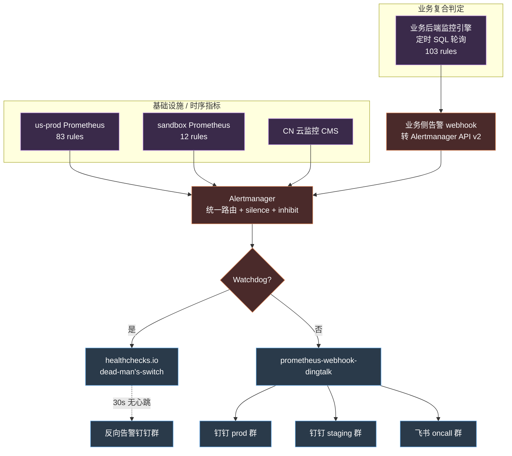
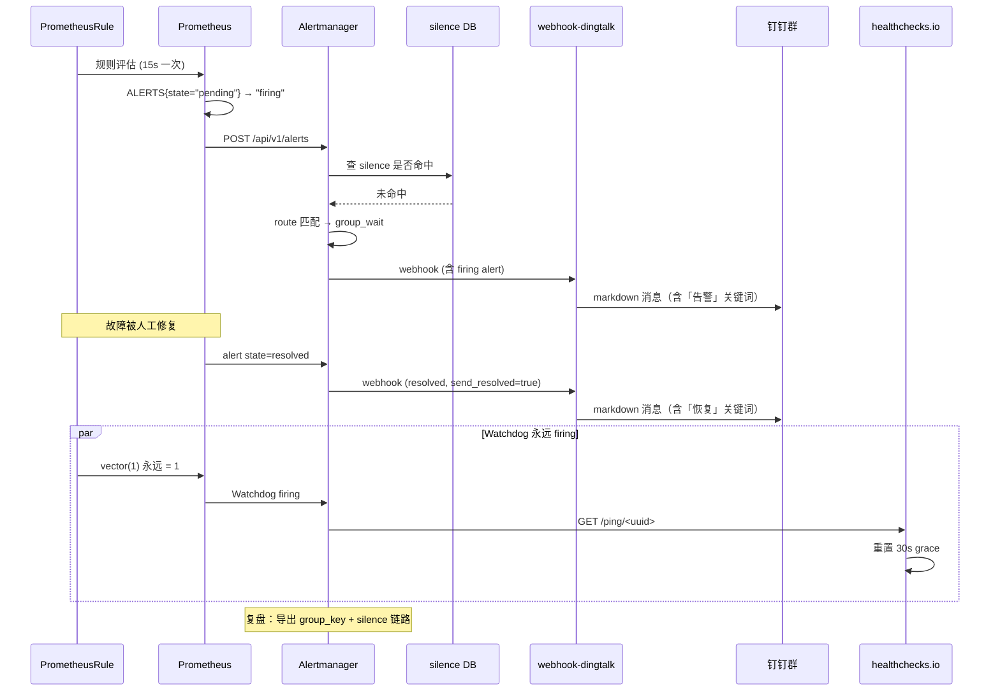

> **元信息**
> - 适用规模：10-200 人团队，2-10 个 K8s 集群
> - 适用云：AWS / 阿里云 / 混合云
> - 运维负担：单人可维护，前期合并需 2-3 周专项投入
> - 月成本：约 ¥0（基于既有 Prometheus 栈，仅整合）
> - 最后验证：2026-04-30，Prometheus 2.54 + Alertmanager 0.27 + prometheus-webhook-dingtalk 2.1.0

## 适用场景

满足下列任意三条以上，本方案适用：

- 同时存在两套及以上告警系统（典型组合：Prometheus 自建 + 业务侧 SQL 轮询 + 云厂商 CMS）
- 告警通知散落在多个钉钉/飞书群，没人能讲清"这条告警从哪来"
- 历史 silence 规则堆积，没人敢清，也没人知道哪些被静默了
- 曾经发生过"告警规则失效几十天但没人发现"的事件
- 新增 AWS / 阿里云资源告警时，不确定该绑哪个 SNS topic 或 Lambda
- 老 Lambda 模板硬编码业务名（"RabbitMQ 告警: ..."）但已被复用到无关告警上

不适用的场景见文末「局限」一节。

## 核心问题

告警体系的常见演化路径：先有 Prometheus + Alertmanager 跑业务指标，后来某个开发顺手在业务后端写了一套定时 SQL 轮询当作"业务监控"，再后来云厂商的告警没人接管也不敢关，最终形成三套并行运行、互不感知的体系。这种演化几乎是一种重力——只要团队规模超过 30 人、跨过 2 个云、运行了一年以上，就会自然出现。

实际生产中观察到的问题：

- **规则总数失控**：单云 95 条 Prometheus 规则 + 业务侧 103 条业务监控规则，加 CN 云监控的几十条，谁也讲不清覆盖了什么、漏了什么。新人接手 on-call 第一周通常先花两天读规则 yaml，第三天放弃。
- **重复覆盖**：同一症状（如 5xx 飙升）三套体系都报，钉钉群同一时间收三条不同格式的消息——一条是 Prometheus PromQL 算出来的、一条是业务侧 SQL 查 Sentry 算出来的、一条是云厂商 CMS 直接告警。on-call 同学要打开三个 dashboard 才能确认是不是同一个故障。
- **渠道交叉**：新增 Aurora 告警时被绑到 SNS topic `rabbitmq-prod-alerts`，复用了一个 Lambda，结果该 Lambda 代码里硬编码了 `title = "RabbitMQ 告警: ..."` 和 `Broker: prod-xxx-rabbitmq-ha-v2`，Aurora 告警发出去全是 RabbitMQ 字样。新员工看到这条消息合理怀疑 RabbitMQ 出事，结果实际故障是 Aurora，浪费 20 分钟排错方向。
- **silence 黑魔法**：上线日临时 silence 全部告警时图省事写 `alertname=~".+"`，把 Watchdog 心跳一并屏蔽，反向告警机制（dead-man's-switch）失效几小时无人发现。等监控大屏出现长时间空白才反应过来，但当时所有人都以为"上线日就是会一阵静默"。
- **规则失效无人发现**：某集群 12 条沙箱告警因 label 不匹配 ruleSelector，**75 天没生效过一次**。这条事是季度复盘时随手抽查发现的——没人主动 monitor 监控本身。
- **复盘补规则反过来推高重复率**：每次故障复盘第一反应是"加一条告警"，但加在哪套体系、和已有规则有没有重叠，没人系统看。半年下来同一个症状有三条规则同时盯着，互相都不知道对方存在。

共同特征：**告警体系不是一次建好就完事的工程，是有腐化速度的活物**。每个新加的资源、每次故障复盘、每次临时 silence，都在往里堆熵。半年后没治理就是失控。从治理视角看告警有几个不可绕开的事实：规则只增不减是默认状态、silence 是写完就忘的状态、Lambda / SNS 这种"不在 GitOps 里"的资源是最容易腐化的——这三件事叠加，治理就必须有定期对账机制，不能依赖记忆和 `git log`。

真正想要的是一套结构清晰、来源可追溯、改动有迹可循的告警体系：每条告警讲得清"为什么报、谁负责、如何处置"，每条 silence 写得清"屏蔽什么、什么时候到期、是否豁免心跳"，新增告警时有明确接入路径不会误绑老 Lambda；每周自动盘点哪些规则在 fire、哪些在 silence、哪些 30 天没动过，腐化苗头能在事故前被发现。这些目标听上去抽象，但落到工程上就是几个具体动作：审计脚本、Watchdog 心跳、对账文档、SNS 命名规范。后面 8 步实施每一步都对应其中之一。

## 方案对比

### 方案 A：维持现状，每次故障再补

让三套体系各自运行，谁负责的部分谁修，事故复盘时再补规则。这是大多数团队的隐式默认状态，不需要任何"决策"就会到这里。

- **适用**：团队规模 < 5 人，业务变化不大，事故频率低
- **淘汰理由**：故障频率到一定程度后修补速度赶不上规则腐化速度，复盘补的规则会重复覆盖既有体系，进一步推高重复率；75 天失效事件就是典型征兆。一旦"补"的成本超过"治理"的成本，方案 A 就开始反向消耗团队精力——每次值班同学都要花 5 分钟分辨当前这条告警来自哪套体系、之前有没有人处置过。

### 方案 B：全量迁到一套（如 Prometheus + Grafana OnCall）

把业务侧 SQL 轮询规则改写成 Prometheus rule，云厂商告警全部接 YACE 走 Prom 链路，最终统一收敛到 Grafana OnCall 做事件管理和排班。理论上是最干净的方案。

- **适用**：有 1-2 人专职 SRE，半年到一年专项治理预算
- **淘汰理由**：业务侧 103 条规则中有 30 条以上是基于业务表的复合 SQL（如"某项目消息异常率 + 计费状态联合判断"），改写成 PromQL 需要先把业务指标 emit 成 metric，开发改造成本不可控；上线冻结期不能动业务代码。即便不冻结，让业务后端为了"统一监控"专门 emit 一批 metric 也是反向 PR——业务团队不会优先做这件事，监控统一进度会被业务排期吃掉。

### 方案 C：保留两套但治理 + 互通（推荐）

承认两套体系各有合理性：Prometheus 擅长基础设施 + 时间序列指标，业务侧 SQL 轮询擅长复合业务条件 + 跨表 join。治理目标是**让两套各司其职、明确分工，并通过统一通知渠道收敛、统一 silence 入口、定期对账**。这是接受现实的方案——不强求技术统一，只要求"出口统一、规则不重叠、定期对账"。

- **适用**：本文场景。已有两套并行体系，业务侧规则不易迁出
- **核心动作**：渠道收敛、Watchdog 心跳护栏、silence 规范、规则总线对账
- **代价**：需要持续维护对账文档，规则边界靠纪律而非工具强制；定期巡检脚本必须 cron 跑，不能靠人记得跑

**为什么选 C**：B 看起来理想但落地周期长，A 看起来便宜但持续消耗 on-call 心智。C 的本质是把"统一"这件事降维成"出口统一 + 流程统一"，避开"技术统一"这个最贵的部分。落地两周可见效果，半年内可以无痛切换到 B 如果真的有专项预算。

## 推荐架构

### 双告警体系合并架构



### 告警生命周期时序



**关键决策点：**

- **Alertmanager 是唯一收敛点**：业务侧通过 webhook 桥接（POST 到 Alertmanager API v2 `/api/v2/alerts`）注入。silence、inhibit、route、模板渲染只有一处。这条规则的隐含含义是：业务侧不再直接发钉钉，所有告警必须先经过 Alertmanager；这样去重、抑制、静默才有统一入口，钉钉群里的每条消息都能在 Alertmanager UI 里查到 group_key 和 silence 链路。
- **prometheus-webhook-dingtalk 是唯一钉钉出口**：抛弃 prometheusalert（v4.9.1，2024-06 后无维护），统一用 timonwong/prometheus-webhook-dingtalk。换 adapter 这件事拖了 3 个月才下决心，主要顾虑是模板需要重写——但实际重写量只有 30 行。技术债的体感成本通常远高于实际成本。
- **Watchdog 永远在线**：一条 `alert: Watchdog` 始终 firing，配单独 receiver 推 healthchecks.io。30s 收不到心跳，反向告警走**独立钉钉群**——这一点是用前面的事故换来的，反向通道跟主通道同群等于没设防。
- **新告警绑独立通道**：任何 AWS / 阿里云资源告警，新建 SNS topic 和 Lambda，**绝不复用历史 Lambda**。这是一条"宁可重复也不复用"的硬规则，防的是 Lambda 模板硬编码业务名导致告警错位。

整个架构图看起来组件不少，但实际上 90% 的故障路径都收敛到 "Prometheus → Alertmanager → webhook-dingtalk → 钉钉" 这一条主线。其它分支（业务侧桥接、healthchecks.io 反向）是为了健壮性而存在的护栏，平时可以不被关注，但出事时是关键。Alertmanager 自己出问题这种"监控自己挂了" 场景，靠的就是 Watchdog → healthchecks.io → 反向群这条独立链路兜底。

## 实施步骤

### 步骤 1：导出全部规则做分类审计

**前置要求**：

- `kubectl` 已配置好对应集群 context（`~/.kube/config` 含 `us-prod` / `sandbox` 等）
- 节点已安装 `jq`（`apt install -y jq`）和 Python 3.9+
- 当前 IAM/RBAC 至少拥有 `prometheusrules.monitoring.coreos.com` 资源的 `get/list` 权限

**执行：审计脚本完整版**

```bash
#!/bin/bash
# alerting-audit.sh — 拉取多集群 PrometheusRule 全量审计
# 用法：./alerting-audit.sh <output-dir>
# 输出：<dir>/rules-<context>.json + summary.csv

set -euo pipefail

OUT="${1:-/tmp/alerting-audit}"
CONTEXTS=("us-prod" "sandbox-staging" "cn-prod")

mkdir -p "$OUT"

command -v kubectl >/dev/null || { echo "需要 kubectl"; exit 1; }
command -v jq      >/dev/null || { echo "需要 jq"; exit 1; }

for ctx in "${CONTEXTS[@]}"; do
  echo "==> 拉取 context=$ctx"
  if ! kubectl --context "$ctx" version --request-timeout=5s >/dev/null 2>&1; then
    echo "    跳过：context $ctx 不可达"
    continue
  fi
  kubectl --context "$ctx" get prometheusrule -A -o json \
    | jq '{context: "'"$ctx"'", rules: [.items[] |
        {namespace: .metadata.namespace,
         name: .metadata.name,
         labels: .metadata.labels,
         groups: .spec.groups}]}' \
    > "$OUT/rules-$ctx.json"
done

# 输出对照表 CSV
python3 - "$OUT" <<'PY'
import json, glob, csv, sys, os
out_dir = sys.argv[1]
rows = []
for f in glob.glob(f"{out_dir}/rules-*.json"):
    data = json.load(open(f))
    ctx = data["context"]
    for r in data["rules"]:
        for g in (r.get("groups") or []):
            for rule in g.get("rules", []):
                if "alert" not in rule:    # 跳过 recording rule
                    continue
                rows.append({
                    "context":  ctx,
                    "ns":       r["namespace"],
                    "group":    g["name"],
                    "alert":    rule["alert"],
                    "severity": (rule.get("labels") or {}).get("severity", ""),
                    "channel":  (rule.get("labels") or {}).get("channel",  ""),
                    "for":      rule.get("for", ""),
                    "expr":     rule["expr"][:120],
                })
with open(f"{out_dir}/summary.csv", "w", newline="") as fp:
    w = csv.DictWriter(fp, fieldnames=list(rows[0].keys()))
    w.writeheader(); w.writerows(rows)
print(f"导出 {len(rows)} 条规则到 {out_dir}/summary.csv")
PY
```

**验证**：

```bash
$ ls /tmp/alerting-audit/
rules-cn-prod.json  rules-sandbox-staging.json  rules-us-prod.json  summary.csv

$ wc -l /tmp/alerting-audit/summary.csv
198 /tmp/alerting-audit/summary.csv

$ head -3 /tmp/alerting-audit/summary.csv
context,ns,group,alert,severity,channel,for,expr
us-prod,monitoring,p0-alerting-rules,ServiceAFiveXXSpike,P0,observe,5m,sum(rate(istio_requests_total{...
us-prod,monitoring,p0-alerting-rules,ContainerOOMKilled,P0,observe,3m,kube_pod_container_status_last_t...
```

**回滚**：纯只读操作，无需回滚；产物全在 `$OUT` 目录，删除即可。

**业务侧规则补齐导出**：

```bash
# 业务侧 SQL 轮询规则导出（PG）
# 前置：psql 已装；DB 凭据通过 SSM 隧道，参考运维手册
psql -h "$PG_HOST" -U readonly -d business_monitor -c \
  "\copy (
     select id, name, severity, enabled, channel, expression
     from monitor_rules
     order by severity, name
   ) to '/tmp/alerting-audit/rules-biz.csv' csv header"
```

按四维做对照表：

| 来源 | 条数 | 覆盖域 | 重叠对象 |
|------|------|--------|----------|
| Prom us-prod | 83 | 基础设施 + 流量 + 中间件 | 与业务侧 5xx / 延迟规则重叠 |
| Prom sandbox | 12 | 沙箱容量 + 操作延迟 | 无 |
| 业务侧 SQL | 103 | Agent / Gateway / 计费 / 沙箱业务延迟 | 沙箱操作延迟与 Prom sandbox 重叠 |
| CN CMS | ~20 | 阿里云资源原生告警 | 与 YACE 采集的资源告警重叠 |

明确划线：**基础设施 + 时序 → Prom，业务复合 → 业务侧，云资源 → 统一走 YACE，三方各自不要跨界**。这条边界要写进团队规范文档而不是停留在心照不宣的状态——之前每次有人新加规则都得问"这个加在哪边？"，现在写成文档之后，新人 PR 提到错的位置直接 reject 并告知规范，治理才有持续性。

**重叠检测脚本**：

```bash
#!/bin/bash
# detect-overlap.sh — 用 alert 名规范化后求两两交集
set -euo pipefail
SUM="/tmp/alerting-audit/summary.csv"
BIZ="/tmp/alerting-audit/rules-biz.csv"

python3 - <<PY
import csv, re
def norm(s):
    s = re.sub(r"[_\-\s]", "", s.lower())
    return s

prom = {}
with open("$SUM") as fp:
    for r in csv.DictReader(fp):
        prom.setdefault(norm(r["alert"]), []).append((r["context"], r["alert"]))

biz = {}
with open("$BIZ") as fp:
    for r in csv.DictReader(fp):
        biz.setdefault(norm(r["name"]), []).append(r["name"])

overlap = set(prom) & set(biz)
print(f"重叠规则数：{len(overlap)}")
for k in sorted(overlap):
    print(f"  - prom: {prom[k]}  ⇄  biz: {biz[k]}")
PY
```

### 步骤 2：渠道梳理 —— 列出所有 SNS / Lambda / webhook

**前置**：AWS CLI v2.x 已配 prod 凭据，IAM 至少 `sns:List*` + `lambda:List*` + `lambda:GetFunction`。

**执行**：

```bash
#!/bin/bash
# channel-inventory.sh — 列出所有告警相关 SNS topic + Lambda
set -euo pipefail
REGION="${REGION:-us-west-2}"
OUT="/tmp/channel-inventory"
mkdir -p "$OUT"

# 1. 找所有疑似告警 SNS topic
aws sns list-topics --region "$REGION" \
  | jq -r '.Topics[].TopicArn' | grep -iE 'alert|alarm|notif' \
  > "$OUT/sns-topics.txt"

# 2. 列出每个 topic 的订阅
while IFS= read -r topic; do
  aws sns list-subscriptions-by-topic --topic-arn "$topic" --region "$REGION" \
    | jq --arg t "$topic" '.Subscriptions[]
        | {topic:$t, protocol:.Protocol, endpoint:.Endpoint}'
done < "$OUT/sns-topics.txt" > "$OUT/sns-subs.json"

# 3. 把 Lambda endpoint 抽出来
jq -r 'select(.protocol=="lambda") | .endpoint' "$OUT/sns-subs.json" \
  | sort -u > "$OUT/alert-lambdas.txt"

# 4. 拉每个 Lambda 代码做硬编码扫描
mkdir -p "$OUT/lambda-src"
while IFS= read -r arn; do
  name=$(basename "$arn")
  url=$(aws lambda get-function --function-name "$arn" --region "$REGION" \
        --query 'Code.Location' --output text)
  curl -sL "$url" -o "$OUT/lambda-src/$name.zip"
  unzip -q -o "$OUT/lambda-src/$name.zip" -d "$OUT/lambda-src/$name"
done < "$OUT/alert-lambdas.txt"

# 5. 扫硬编码字符串
echo "==> 硬编码扫描结果"
grep -rEn 'RabbitMQ 告警|Broker: prod|access_token=[a-f0-9]{20,}|hc-ping\.com' \
     "$OUT/lambda-src/" || echo "  未发现硬编码"
```

**验证**：

```bash
$ cat /tmp/channel-inventory/sns-topics.txt
arn:aws:sns:us-west-2:<ACCOUNT_ID>:rabbitmq-prod-alerts
arn:aws:sns:us-west-2:<ACCOUNT_ID>:ops-aws-alerts
arn:aws:sns:us-west-2:<ACCOUNT_ID>:legacy-cw-notifications

$ grep -rEn 'RabbitMQ 告警' /tmp/channel-inventory/lambda-src/
rabbitmq-dingtalk-alert/index.js:42:  const title = "RabbitMQ 告警: " + alarm.AlarmName;
rabbitmq-dingtalk-alert/index.js:51:  const broker = "prod-xxx-rabbitmq-ha-v2 (m5.large)";
```

发现这种"专用 Lambda"立即记入"禁止复用清单"。清单不是写完就完事——必须放在每次新增 AWS 告警的 PR 模板里作为强制 checkbox，否则下次还是会有人复用。建议直接写进团队的 `.github/PULL_REQUEST_TEMPLATE.md`，让 reviewer 一眼能看到。

新建告警一律走独立 SNS + 独立 Lambda（或者更彻底的，全部走 YACE → Prom → Alertmanager 路径，绕开 Lambda 转发）。绕开 Lambda 这件事的好处是把告警链路完全收进 K8s + GitOps 管理范围，Lambda 这种"分散在 AWS 控制台不在 git 里"的资源天然有腐化倾向，能少则少。

**回滚**：纯只读，无副作用。

### 步骤 3：silence 审计与负匹配规范

**前置**：Alertmanager 可达（默认端口 9093），`amtool` v0.27+ 已装。

**执行：审计脚本**

```bash
#!/bin/bash
# silence-audit.sh — 列出长期 silence + 检测 Watchdog 是否被误杀
# 用法：./silence-audit.sh
# 环境：AM_URL=http://alertmanager.monitoring.svc.cluster.local:9093

set -euo pipefail
AM_URL="${AM_URL:-http://localhost:9093}"

command -v amtool >/dev/null || { echo "需要 amtool"; exit 1; }
command -v jq     >/dev/null || { echo "需要 jq"; exit 1; }

echo "==> [1] 长期 silence (>7 天) 列表"
curl -s "$AM_URL/api/v2/silences" \
  | jq -r '.[] | select(.status.state=="active")
    | select((.endsAt | fromdateiso8601) - (.startsAt | fromdateiso8601) > 604800)
    | "[\(.id)] by=\(.createdBy) end=\(.endsAt) comment=\(.comment)
       matchers=\(.matchers | map("\(.name)\(if .isRegex then "=~" else "=" end)\(.value)") | join(", "))"'

echo "==> [2] 永久 silence (endsAt 距今 >365 天)"
curl -s "$AM_URL/api/v2/silences" \
  | jq -r '.[] | select(.status.state=="active")
    | select((.endsAt | fromdateiso8601) - now > 31536000)
    | "[\(.id)] by=\(.createdBy) end=\(.endsAt) comment=\(.comment)"'

echo "==> [3] 高危 matcher（.+ / .* 全匹配）"
curl -s "$AM_URL/api/v2/silences" \
  | jq -r '.[] | select(.status.state=="active")
    | select(.matchers[] | select(.isRegex and (.value=="" or .value==".+" or .value==".*")))
    | "[\(.id)] by=\(.createdBy) comment=\(.comment)
       matchers=\(.matchers | map("\(.name)\(if .isRegex then "=~" else "=" end)\(.value)"))"'

echo "==> [4] Watchdog 是否被误杀（Watchdog alert 当前是否被任何 silence 命中）"
WD_HIT=$(curl -s "$AM_URL/api/v2/alerts?filter=alertname=Watchdog" \
  | jq '[.[] | select(.status.silencedBy != null and (.status.silencedBy|length) > 0)] | length')
if [[ "$WD_HIT" -gt 0 ]]; then
  echo "  ❌ 警告：Watchdog 当前被 silence 命中！立即检查"
  curl -s "$AM_URL/api/v2/alerts?filter=alertname=Watchdog" \
    | jq '.[] | {labels, status}'
  exit 2
else
  echo "  ✓ Watchdog 未被 silence"
fi
```

**验证**：脚本退出码 0 = 正常；退出码 2 = Watchdog 被误杀。

**回滚**：本步骤纯只读，无回滚需要。

**周巡检 cron**：

```yaml
---
apiVersion: batch/v1
kind: CronJob
metadata:
  name: silence-audit
  namespace: monitoring
spec:
  schedule: "0 9 * * 1"  # 每周一 9:00
  concurrencyPolicy: Forbid
  jobTemplate:
    spec:
      template:
        spec:
          restartPolicy: OnFailure
          containers:
          - name: audit
            image: alpine/curl-jq:3.20
            env:
            - name: AM_URL
              value: "http://alertmanager-operated:9093"
            - name: REPORT_WEBHOOK
              valueFrom:
                secretKeyRef:
                  name: dingtalk-report-webhook
                  key: url
            command: ["/bin/sh", "-c"]
            args:
            - |
              set -e
              REPORT=$(curl -s "$AM_URL/api/v2/silences" \
                | jq -r '[.[] | select(.status.state=="active")
                    | select((.endsAt|fromdateiso8601) - (.startsAt|fromdateiso8601) > 604800)
                    | "- by=\(.createdBy) end=\(.endsAt) comment=\(.comment)"] | join("\n")')
              if [ -n "$REPORT" ]; then
                BODY=$(jq -n --arg t "周巡检：长期 silence (>7 天)\n$REPORT" \
                  '{msgtype:"text", text:{content:$t}}')
                curl -s -H 'Content-Type: application/json' \
                  -d "$BODY" "$REPORT_WEBHOOK"
              fi
```

silence 创建规范用负匹配（Alertmanager v2 API 支持 `isEqual: false`），任何"全部 silence" 必须显式排除 Watchdog：

```bash
amtool silence add --alertmanager.url="$AM_URL" \
  alertname!=Watchdog \
  --comment="上线窗口 silence（排除 Watchdog）" \
  --duration=2h \
  --author="$USER"
```

或调 v2 API：

```bash
curl -X POST "$AM_URL/api/v2/silences" \
  -H 'Content-Type: application/json' \
  -d '{
    "matchers": [
      {"name":"alertname","value":"Watchdog","isRegex":false,"isEqual":false}
    ],
    "startsAt": "2026-04-30T09:00:00Z",
    "endsAt":   "2026-04-30T11:00:00Z",
    "createdBy":"alice",
    "comment":  "上线窗口排除 Watchdog 的 silence"
  }'
```

### 步骤 4：Watchdog 心跳完整实现

**目标**：一条规则永远 firing；走独立 receiver 推 healthchecks.io；超 N 分钟无心跳由 healthchecks.io 反向告警到**独立**钉钉群。

**前置**：

- 已有 kube-prometheus-stack 部署（Prometheus + Alertmanager 通过 Operator 管理）
- 已在 healthchecks.io 创建一个 check，拿到 ping URL（`https://hc-ping.com/<uuid>`）
- 已在 healthchecks.io 配好"反向告警"通道：另一个钉钉机器人 + 不同钉钉群

**执行：完整 yaml 部署**

```yaml
---
apiVersion: monitoring.coreos.com/v1
kind: PrometheusRule
metadata:
  name: watchdog-heartbeat
  namespace: monitoring
  labels:
    app.kubernetes.io/name: kube-prometheus-stack
    release: monitoring                # 必须与 Prometheus.spec.ruleSelector 匹配，否则不生效
spec:
  groups:
    - name: watchdog
      interval: 30s
      rules:
        - alert: Watchdog
          expr: vector(1)
          for: 0s
          labels:
            severity: none
            channel: heartbeat
          annotations:
            summary: "Watchdog heartbeat — 永远 firing，无心跳即链路异常"
            description: "如果你看到这条告警 resolved，说明 Alertmanager → 钉钉链路活着但 Prometheus 评估异常。如果 healthchecks.io 30s 收不到，说明链路死了。"
```

```yaml
---
# alertmanager-config.yaml — 完整可部署版本
apiVersion: v1
kind: Secret
metadata:
  name: alertmanager-main
  namespace: monitoring
type: Opaque
stringData:
  alertmanager.yaml: |
    global:
      resolve_timeout: 5m
      smtp_from: 'ops@example.aws.com'
      smtp_smarthost: 'email-smtp.us-west-2.amazonaws.com:587'
      smtp_auth_username: 'AKIA<redacted>'
      smtp_auth_password: '<smtp-password>'

    templates:
      - '/etc/alertmanager/config/*.tmpl'

    route:
      receiver: webhook-dingtalk-prod
      group_by: ['alertname', 'cluster', 'namespace']
      group_wait: 30s
      group_interval: 5m
      repeat_interval: 30m
      routes:
        # Watchdog 走独立通道：healthchecks.io
        - matchers:
            - alertname = "Watchdog"
          receiver: dead-mans-switch
          group_wait: 10s
          group_interval: 1m
          repeat_interval: 1m
          continue: false

        # P0 灾难性告警 → 飞书 oncall 群（带 @所有人）
        - matchers:
            - severity = "P0"
          receiver: feishu-oncall
          group_wait: 10s
          repeat_interval: 15m
          continue: true

        # staging / sandbox 流量分到 staging 钉钉群
        - matchers:
            - cluster =~ "sandbox.*|staging.*"
          receiver: webhook-dingtalk-staging
          continue: false

        # 邮件备份给 P0/P1
        - matchers:
            - severity =~ "P0|P1"
          receiver: email-fallback
          continue: true

    inhibit_rules:
      # 集群级故障时抑制具体节点/Pod 告警
      - source_matchers:
          - alertname = "KubeAPIDown"
        target_matchers:
          - severity =~ "warning|info"
        equal: ['cluster']

      # 节点 NotReady 时抑制其上 Pod 的 Restart/Pending 告警
      - source_matchers:
          - alertname = "NodeNotReady"
        target_matchers:
          - alertname =~ "Pod.*Restart|Pod.*Pending"
        equal: ['cluster', 'instance']

      # 高 severity 抑制低 severity 同名告警
      - source_matchers:
          - severity = "P0"
        target_matchers:
          - severity =~ "P1|P2"
        equal: ['alertname', 'cluster', 'namespace']

    receivers:
      - name: dead-mans-switch
        webhook_configs:
          - url: 'https://hc-ping.com/<uuid>'
            send_resolved: false
            max_alerts: 0

      - name: webhook-dingtalk-prod
        webhook_configs:
          - url: 'http://prometheus-webhook-dingtalk:8060/dingtalk/prod/send'
            send_resolved: true
            max_alerts: 10

      - name: webhook-dingtalk-staging
        webhook_configs:
          - url: 'http://prometheus-webhook-dingtalk:8060/dingtalk/staging/send'
            send_resolved: true
            max_alerts: 10

      - name: feishu-oncall
        webhook_configs:
          - url: 'http://feishu-bridge.monitoring:8080/oncall'
            send_resolved: true
            max_alerts: 5

      - name: email-fallback
        email_configs:
          - to: 'oncall@example.aws.com'
            send_resolved: true
            headers:
              Subject: '[{{ .Status | toUpper }}] {{ .CommonLabels.alertname }}'
```

**prometheus-webhook-dingtalk 完整 Deployment**：

```yaml
---
apiVersion: v1
kind: ConfigMap
metadata:
  name: webhook-dingtalk-config
  namespace: monitoring
data:
  config.yml: |
    timeout: 5s
    targets:
      prod:
        url: https://oapi.dingtalk.com/robot/send?access_token=<prod-token>
        secret: SEC<prod-secret>
        message:
          title: '{{ template "default.title" . }}'
          text:  '{{ template "default.content" . }}'
      staging:
        url: https://oapi.dingtalk.com/robot/send?access_token=<staging-token>
        secret: SEC<staging-secret>
        message:
          title: '{{ template "default.title" . }}'
          text:  '{{ template "default.content" . }}'
  default.tmpl: |
    {{ define "default.title" }}{{ if eq .Status "firing" }}【告警】{{ else }}【告警恢复】{{ end }}{{ .CommonLabels.alertname }}{{ end }}
    {{ define "default.content" }}
    {{ if eq .Status "firing" }}#### 【告警】{{ else }}#### 【告警恢复】{{ end }}（关键词：告警 / 运维 / 恢复）
    - **集群**：{{ .CommonLabels.cluster | default "n/a" }}
    - **命名空间**：{{ .CommonLabels.namespace | default "n/a" }}
    - **严重度**：{{ .CommonLabels.severity | default "n/a" }}
    - **触发数**：{{ .Alerts.Firing | len }} firing / {{ .Alerts.Resolved | len }} resolved
    {{ range .Alerts -}}
    - {{ .Labels.alertname }}: {{ .Annotations.summary }}
    {{ end -}}
    {{ end }}
---
apiVersion: apps/v1
kind: Deployment
metadata:
  name: prometheus-webhook-dingtalk
  namespace: monitoring
  labels:
    app: prometheus-webhook-dingtalk
spec:
  replicas: 2
  selector:
    matchLabels:
      app: prometheus-webhook-dingtalk
  template:
    metadata:
      labels:
        app: prometheus-webhook-dingtalk
    spec:
      containers:
        - name: webhook-dingtalk
          image: timonwong/prometheus-webhook-dingtalk:v2.1.0
          args:
            - --config.file=/etc/webhook-dingtalk/config.yml
            - --web.listen-address=:8060
          ports:
            - name: http
              containerPort: 8060
          readinessProbe:
            httpGet:
              path: /health
              port: 8060
            periodSeconds: 5
          livenessProbe:
            httpGet:
              path: /health
              port: 8060
            periodSeconds: 30
          resources:
            requests: { cpu: 50m, memory: 64Mi }
            limits:   { cpu: 500m, memory: 256Mi }
          volumeMounts:
            - name: config
              mountPath: /etc/webhook-dingtalk
      volumes:
        - name: config
          configMap:
            name: webhook-dingtalk-config
---
apiVersion: v1
kind: Service
metadata:
  name: prometheus-webhook-dingtalk
  namespace: monitoring
spec:
  selector:
    app: prometheus-webhook-dingtalk
  ports:
    - name: http
      port: 8060
      targetPort: 8060
```

**反向告警接收脚本**（部署在 healthchecks.io webhook integration 里，作为兜底；钉钉 webhook 直接发 markdown）：

```bash
#!/bin/bash
# heartbeat-down.sh — healthchecks.io 配置 webhook 调它（grace=2m）
# 在 healthchecks.io check 的 Integration → Webhook 里填：
# POST https://<self-host>/heartbeat-down.sh?status=$CHECK_STATUS
set -euo pipefail
DT_URL="${DT_PAGER_URL:?未配反向告警钉钉 webhook}"
STATUS="${1:-down}"

curl -s -H 'Content-Type: application/json' -X POST "$DT_URL" -d "$(jq -n \
  --arg s "$STATUS" \
  '{msgtype:"markdown", markdown:{
     title:"【告警】Watchdog 心跳丢失",
     text: "## 【告警】Watchdog 心跳丢失（关键词：告警/运维/恢复）\n\n- 状态：\($s)\n- 时间：\(now | strftime(\"%Y-%m-%d %H:%M:%S\"))\n- 含义：Alertmanager → 钉钉主链路异常，立即检查\n- 排查清单：\n  1. kubectl -n monitoring get pod\n  2. amtool silence query --alertmanager.url=$AM_URL\n  3. 检查 prometheus-webhook-dingtalk 日志"
  }}')"
```

**验证**：

```bash
# 1. 规则被加载
curl -s http://prometheus.monitoring:9090/api/v1/rules \
  | jq '.data.groups[] | select(.name=="watchdog") | .rules[].name'
# 期望输出：
# "Watchdog"

# 2. Watchdog 当前在 firing
curl -s 'http://alertmanager.monitoring:9093/api/v2/alerts?filter=alertname=Watchdog' \
  | jq '.[] | {state: .status.state, startsAt}'
# 期望：state="active"

# 3. healthchecks.io 显示 1 分钟前刚收到 ping
# UI：https://healthchecks.io/projects/<id>/checks/

# 4. 主动模拟挂掉：kill 一个 alertmanager pod，2 分钟后应收到反向告警
kubectl -n monitoring delete pod -l app.kubernetes.io/name=alertmanager
```

**回滚**：

```bash
kubectl -n monitoring delete prometheusrule watchdog-heartbeat
kubectl -n monitoring delete deploy prometheus-webhook-dingtalk
kubectl -n monitoring delete svc prometheus-webhook-dingtalk
kubectl -n monitoring delete configmap webhook-dingtalk-config
# alertmanager-main Secret 改回旧版（git revert + ArgoCD sync）
```

**关于 healthchecks.io 反向告警的几个易错点**：grace period 的设置要比心跳间隔大一倍以上——心跳是 30s 一次，grace 设 2 分钟比较合适，太短会因为单次网络抖动误报，太长又失去及时性。反向告警的钉钉机器人必须放在不同的钉钉群（不只是不同机器人），原因是钉钉群本身可能因为机器人被误删而失效，主告警群和反向告警群同时挂掉的概率必须趋近 0。最理想的反向通道是放在另一个云、另一种 IM——比如主告警走钉钉，反向走飞书或 Slack，这样云厂商或者钉钉自己整体故障也不影响。

### 步骤 5：业务侧 webhook 桥接器

业务侧 SQL 轮询不动业务代码，只让它 POST 到一个 sidecar，sidecar 翻译成 Alertmanager API v2 格式。这一步是方案 C 的核心：不强求业务侧改造，给一个轻量适配层就能让业务告警进入 Alertmanager 的 silence / inhibit / route 体系。bridge 实现刻意写得简单（无依赖、纯标准库），方便未来任何团队成员看一眼就能改。endsAt 用 `now + 5min` 是为了利用 Alertmanager 的"超时自动 resolved"机制——业务侧每分钟轮询一次，只要还在异常就续推，停止续推 5 分钟后自动 resolved，不需要业务侧实现 resolve 逻辑：

```python
#!/usr/bin/env python3
# biz-alert-bridge.py — 业务侧告警 → Alertmanager 桥接
# 部署：作为 K8s Deployment，开 8080 端口
# 业务侧 webhook 配置 → POST http://biz-alert-bridge.monitoring:8080/

import json, os, sys, time
from datetime import datetime, timezone, timedelta
from http.server import BaseHTTPRequestHandler, HTTPServer
import urllib.request

AM_URL = os.environ.get("AM_URL", "http://alertmanager-operated:9093")
RESOLVE_AFTER = int(os.environ.get("RESOLVE_AFTER", "300"))  # 5 min

def to_am_format(biz_alert):
    """业务侧 alert dict → Alertmanager API v2 格式"""
    now = datetime.now(timezone.utc).isoformat()
    end = (datetime.now(timezone.utc) + timedelta(seconds=RESOLVE_AFTER)).isoformat()
    return {
        "labels": {
            "alertname": biz_alert["name"],
            "severity":  biz_alert.get("severity", "P2"),
            "source":    "biz-monitor",
            "rule_id":   str(biz_alert.get("id", "")),
            "channel":   "observe",
        },
        "annotations": {
            "summary":     biz_alert.get("summary", ""),
            "description": biz_alert.get("description", ""),
            "runbook":     biz_alert.get("runbook", ""),
        },
        "startsAt": biz_alert.get("triggered_at", now),
        "endsAt":   end,   # 5 分钟后未续推则自动 resolved
    }

class Handler(BaseHTTPRequestHandler):
    def do_POST(self):
        n = int(self.headers.get("Content-Length", 0))
        try:
            payload = json.loads(self.rfile.read(n))
            alerts = payload if isinstance(payload, list) else [payload]
            am_alerts = [to_am_format(a) for a in alerts]
            req = urllib.request.Request(
                f"{AM_URL}/api/v2/alerts",
                data=json.dumps(am_alerts).encode(),
                headers={"Content-Type": "application/json"},
                method="POST",
            )
            with urllib.request.urlopen(req, timeout=5) as resp:
                self.send_response(resp.status)
                self.end_headers()
                self.wfile.write(resp.read())
        except Exception as e:
            self.send_response(500)
            self.end_headers()
            self.wfile.write(f"err={e}".encode())

if __name__ == "__main__":
    HTTPServer(("0.0.0.0", 8080), Handler).serve_forever()
```

**Deployment**：

```yaml
---
apiVersion: apps/v1
kind: Deployment
metadata:
  name: biz-alert-bridge
  namespace: monitoring
spec:
  replicas: 2
  selector:
    matchLabels: { app: biz-alert-bridge }
  template:
    metadata:
      labels: { app: biz-alert-bridge }
    spec:
      containers:
        - name: bridge
          image: python:3.12-alpine
          command: ["python3", "/app/bridge.py"]
          env:
            - name: AM_URL
              value: "http://alertmanager-operated:9093"
            - name: RESOLVE_AFTER
              value: "300"
          ports:
            - containerPort: 8080
          volumeMounts:
            - name: code
              mountPath: /app
      volumes:
        - name: code
          configMap:
            name: biz-alert-bridge-code
---
apiVersion: v1
kind: Service
metadata:
  name: biz-alert-bridge
  namespace: monitoring
spec:
  selector: { app: biz-alert-bridge }
  ports:
    - port: 8080
      targetPort: 8080
```

### 步骤 6：规则归档 + 周巡检

把所有 PrometheusRule 入 GitOps，配套对账脚本：

```
gitops-repo/
└── clusters/
    └── us-prod/
        └── monitoring/
            ├── p0-alerting-rules.yaml      # 12 条灾难检测
            ├── application-alerts.yaml     # 22 条 K8s 运行时
            ├── middleware-alerts.yaml      # 18 条中间件
            ├── aws-resources-alerting.yaml # 7 条 AWS 资源
            ├── blackbox-probes.yaml        # 5 条外部可达性
            └── kustomization.yaml
```

**对账脚本**：

```bash
#!/bin/bash
# rules-reconcile.sh — git yaml 与集群实际加载对账
set -euo pipefail
PROM="${PROM:-http://prometheus.monitoring:9090}"
GIT_DIR="${GIT_DIR:-./clusters/us-prod/monitoring}"

git_count=$(grep -rh '^[[:space:]]*-[[:space:]]*alert:[[:space:]]' "$GIT_DIR" \
            | wc -l | tr -d ' ')
api_count=$(curl -s "$PROM/api/v1/rules" \
  | jq '[.data.groups[].rules[] | select(.type=="alerting")] | length')

echo "git rules:    $git_count"
echo "loaded rules: $api_count"

if [[ "$git_count" -ne "$api_count" ]]; then
  echo "❌ DRIFT: git=$git_count vs api=$api_count"
  echo "→ 检查 PrometheusRule.metadata.labels 是否匹配 Prometheus.spec.ruleSelector"
  exit 1
fi
echo "✓ rules in sync"
```

### 步骤 7：老 Lambda / CMS 渠道退役

历史 CloudWatch + Lambda 通道短期保持现状不动，但**新规严格执行**：

- 任何新增 AWS 资源告警一律走 YACE → Prom → Alertmanager 路径
- 必须新建 CloudWatch alarm 时，新建独立 SNS topic（如 `ops-aws-alerts`）+ 独立 namespace-aware Lambda
- Lambda 模板里禁止硬编码业务名，所有字段从 SNS 消息体解析

冻结期过后做并行运行 + 对账 2 周，再下线老 Lambda。退役前的对账是关键：把老 Lambda 接过的所有 alarm 列出来，确认每条都已经通过 YACE 在 Prom 侧覆盖（query name 一致、阈值一致），并行 14 天看两边告警次数是否吻合，吻合后再下线。这一步看似啰嗦但避免了"以为迁完了实际漏了几条"的常见踩坑——AWS 这种历史资源全清单不容易拉准，对账是兜底动作。

## 踩过的坑（每个都附完整修复脚本）

### 坑 1：prometheusalert URL encode 把钉钉 token 吞了

**现象**：钉钉返回 `{"errcode":300005,"errmsg":"token is not exist"}`，token 直接 curl 测有效。

**根因**：Alertmanager webhook URL 嵌套了钉钉 URL：

```
http://prometheusalert:8080/prometheusalert?type=dd&tpl=prom-dd&ddurl=https://oapi.dingtalk.com/robot/send?access_token=XXXX
```

prometheusalert 的 query parser 遇到内层 `?access_token=...` 当作第二个 query 起始，`ddurl` 的 value 只取到 `https://oapi.dingtalk.com/robot/send`，token 丢了（双重 encode 不彻底）。

**修复 patch（短期 hotfix）**：URL encode `ddurl` 整个 value：

```bash
#!/bin/bash
# fix-prometheusalert-url.sh
set -euo pipefail

DD_URL_RAW='https://oapi.dingtalk.com/robot/send?access_token=XXXX'
DD_URL_ENC=$(python3 -c "import urllib.parse,sys; print(urllib.parse.quote(sys.argv[1], safe=''))" "$DD_URL_RAW")
echo "encoded: $DD_URL_ENC"

# 改 alertmanager.yaml receiver 里：
# url: 'http://prometheusalert:8080/prometheusalert?type=dd&tpl=prom-dd&ddurl='"$DD_URL_ENC"

# 验证
curl -s "http://prometheusalert:8080/prometheusalert?type=dd&tpl=prom-dd&ddurl=$DD_URL_ENC" \
  -H 'Content-Type: application/json' \
  -d '{"alerts":[{"labels":{"alertname":"test"},"annotations":{"summary":"test"},"status":"firing"}]}'
# 期望：钉钉群收到 test 消息
```

**修复（彻底方案）**：换 timonwong/prometheus-webhook-dingtalk，target 用 config-as-data：

```yaml
# webhook-dingtalk config.yml — 完全没有 URL 嵌套问题
targets:
  prod:
    url: https://oapi.dingtalk.com/robot/send?access_token=XXXX
    secret: SECxxx
    message:
      title: '{{ template "default.title" . }}'
      text:  '{{ template "default.content" . }}'
```

```yaml
# alertmanager 引用
receivers:
- name: webhook-dingtalk-prod
  webhook_configs:
  - url: 'http://prometheus-webhook-dingtalk:8060/dingtalk/prod/send'
```

**通用结论**：钉钉报 `300005` 但 token 单独可用 → 第一反应查 URL encode；选告警 adapter 时优先选 config-as-data 而不是 config-as-URL。这条经验也适用于其他 webhook 类工具（飞书、Slack）——任何把目标 URL 嵌套在 query string 里的设计都有 URL encode 双重转义陷阱，遇到时不要花时间调 encode，直接换工具。

### 坑 2：silence 用 `.+` 误伤 Watchdog 心跳

**现象**：上线日临时 silence 所有 active 告警，写了 `alertname=~".+"`，反向告警机制失效几小时无人发现。

**根因**：`.+` 匹配所有 alertname，包括恒定 firing 的 Watchdog。Watchdog 被 silence → healthchecks.io 收不到心跳 → 但反向告警的群跟主告警同群（早期错误配置），主链路已 silence，什么都收不到。

**修复**：所有"全部 silence"动作必须排除 Watchdog：

```bash
# 安全 silence 脚本
#!/bin/bash
# safe-silence-all.sh — 全 silence 但保留 Watchdog
set -euo pipefail
AM_URL="${AM_URL:-http://localhost:9093}"
DURATION="${1:-2h}"
COMMENT="${2:?用法: $0 <duration> <comment>}"

amtool silence add --alertmanager.url="$AM_URL" \
  alertname!=Watchdog \
  --comment="$COMMENT (auto-exclude Watchdog)" \
  --duration="$DURATION" \
  --author="$(whoami)"
```

**通用结论**：任何 silence "除了 Watchdog 之外"必须显式写 `alertname!=Watchdog`；反向告警通道必须独立于主告警通道（不同群、不同 webhook、最好不同云 region）。事故复盘后我们把 silence 创建动作从 amtool 命令行收到了一个内部小工具里，工具自动注入 `alertname!=Watchdog` matcher，并把 silence ID 推到一个独立钉钉群——任何长期 silence 都被强制公示，谁也藏不了。

### 坑 3：Aurora DeletionProtection 是 cluster 级属性

**现象**：执行 `aws rds modify-db-instance --db-instance-identifier <aurora-instance> --deletion-protection` 后无报错，但 protection 状态没变；告警系统配的 Aurora `deletion_protection` 监控项一直显示 false。

**根因**：Aurora 的 instance 是 cluster 的 member，`deletion-protection` 这类属性挂在 cluster 层。命令调用没报错是因为字段允许，但实际写入到 instance 元数据里被忽略。

**修复**：

```bash
#!/bin/bash
# fix-aurora-protection.sh
set -euo pipefail
CLUSTER_ID="${1:?aurora cluster id}"

# Aurora 改 cluster 层
aws rds modify-db-cluster \
  --db-cluster-identifier "$CLUSTER_ID" \
  --deletion-protection

# 验证
aws rds describe-db-clusters \
  --db-cluster-identifier "$CLUSTER_ID" \
  --query 'DBClusters[0].DeletionProtection'
# 期望：true
```

非 Aurora 才用 instance 层：

```bash
aws rds modify-db-instance \
  --db-instance-identifier <pg-instance-id> \
  --deletion-protection
```

**通用结论**：动 Aurora 任何属性前先确认是 cluster 级还是 instance 级；YACE 采集 Aurora 指标时也分清 `aws_rds_*` 和 `aws_rds_cluster_*` 是不同 namespace。这条坑触发了一个延伸治理：所有 YACE 配置 PR 必须含一个"采集对象类型"字段（cluster / instance / 资源池），reviewer 据此快速判断 namespace 写得对不对——以前看 expr 看不出来，现在看 metadata 一眼就能挑出问题。

### 坑 4：ApplicationSet "复活"删除的告警 App

**现象**：删一个老的 alert-related ArgoCD Application，`argocd app delete` 或 `kubectl delete application` 都执行成功了，几秒后 app 又出现，状态 `deletionTimestamp=null`。

**根因**：这个 Application 的 `ownerReferences` 指向某个 ApplicationSet，ApplicationSet controller 检测到 child app 缺失立即重建。

**修复**：改 git 源头，不走 kubectl。

```bash
#!/bin/bash
# delete-argocd-app-safe.sh
set -euo pipefail
APP="${1:?argocd app name}"
NS="${2:-argocd}"

# 1. 检查是否 ApplicationSet 生成
OWNER=$(kubectl -n "$NS" get application "$APP" -o jsonpath='{.metadata.ownerReferences[0].kind}' 2>/dev/null || true)
if [[ "$OWNER" == "ApplicationSet" ]]; then
  APPSET=$(kubectl -n "$NS" get application "$APP" -o jsonpath='{.metadata.ownerReferences[0].name}')
  echo "❌ $APP 由 ApplicationSet=$APPSET 生成，必须改 git"
  echo "→ 改方式："
  echo "   1) 删除 git 仓库中对应 generator 列表项 (如 clusters/<env>/applications/<path>/)"
  echo "   2) 或改 ApplicationSet generator 的 filter 规则"
  echo "   3) 等 ApplicationSet 重新 reconcile，child app 自动消失"
  exit 1
fi

# 2. 不属于 ApplicationSet 才能直接删
echo "✓ $APP 是独立 Application，可以直接删"
argocd app delete "$APP" --yes
```

**通用结论**：删任何 ArgoCD Application 之前先 check `ownerReferences`；GitOps 体系下 kubectl delete 大概率被 controller 回滚，源头永远在 git。这个反模式延伸到任何 Kubernetes operator 管理的资源——Operator-managed CR 都不能用 kubectl 删，包括 Prometheus Operator 管理的 PrometheusRule、cert-manager 管理的 Certificate、external-secrets 管理的 ExternalSecret。删不掉时不要硬试，先问"是谁在管这个资源"。

### 坑 5：sandbox 告警规则因 label 不匹配 75 天没生效

**现象**：sandbox 集群有 12 条 PrometheusRule yaml 在 git 里好好放着，集群里也都创建出来了，但日常运维里从来没有触发过任何一条。一次专项巡检才发现：**75 天里这些规则一次都没被评估过**。

**根因**：Prometheus Operator 通过 `ruleSelector` 选取 PrometheusRule。selector 是 `release=monitoring`，但这批 yaml 的 `metadata.labels` 写的是 `app=monitoring`，label 不匹配，Operator 直接跳过这批规则。规则在 `kubectl get prometheusrule` 里能看到，但没注入 Prometheus 配置。

**修复**：

```bash
#!/bin/bash
# verify-prometheusrule-loaded.sh
set -euo pipefail
NS="${NS:-monitoring}"

# 1. 找 Prometheus 实际的 ruleSelector
SELECTOR=$(kubectl -n "$NS" get prometheus -o jsonpath='{.items[0].spec.ruleSelector}')
echo "Prometheus.spec.ruleSelector = $SELECTOR"

# 2. 列出所有 PrometheusRule + labels
echo "==> 所有 PrometheusRule labels:"
kubectl -n "$NS" get prometheusrule -o json \
  | jq -r '.items[] | "\(.metadata.name): \(.metadata.labels)"'

# 3. 对比 Prometheus 实际加载的规则数 vs PrometheusRule yaml 总条数
yaml_count=$(kubectl -n "$NS" get prometheusrule -o json \
  | jq '[.items[].spec.groups[].rules[] | select(.alert)] | length')
api_count=$(curl -s "http://prometheus.${NS}:9090/api/v1/rules" \
  | jq '[.data.groups[].rules[] | select(.type=="alerting")] | length')

echo "yaml=$yaml_count api=$api_count"
[[ "$yaml_count" -eq "$api_count" ]] || {
  echo "❌ DRIFT — 修 metadata.labels 匹配 ruleSelector 后 kubectl apply"
  exit 1
}
```

**通用结论**：写完 PrometheusRule 必须从 `/api/v1/rules` 接口验证规则真的被加载，不能只看 `kubectl get prometheusrule`；每周巡检必须含"规则总数 vs 集群规则总数对账"。这条事故的恶心之处在于**它不会主动暴露**——告警没触发不代表规则坏了，可能是真没出事。所以必须依赖主动巡检，把"规则数对不上" 作为一种监控本身的告警。延伸到所有 Operator 管理的资源都需要这种"是否真的生效"的二次验证，不能信任 `kubectl get` 看到的状态。

### 坑 6：钉钉关键词只覆盖 firing「告警」，resolved「恢复」全被拒

**现象**：webhook-dingtalk 日志里大量 `respCode=310000 关键词不匹配`，每 5 分钟（group_interval）一波。表面看 firing 告警能正常推到群。

**根因**：模板里 firing 渲染成 `## 【告警】xxx`（含"告警"，过关），resolved 渲染成 `## 【恢复】xxx`（**只有"恢复"，不含"告警/运维"**，被拒）。钉钉机器人原配关键词只有 `告警` 和 `运维`。**业务方以为告警没了，实际从来没收到恢复消息**，运维黑洞。

钉钉关键词检测的是 **markdown.text 字段内容**（不是 markdown.title），title 写得再对也没用。

**修复 patch**：模板把 `【恢复】` 替换成 `【告警恢复】`：

```text
{{ define "default.title" }}{{ if eq .Status "firing" }}【告警】{{ else }}【告警恢复】{{ end }}{{ .CommonLabels.alertname }}{{ end }}
{{ define "default.content" }}
{{ if eq .Status "firing" }}#### 【告警】{{ else }}#### 【告警恢复】{{ end }}（关键词：告警 / 运维 / 恢复）
...
{{ end }}
```

**双消息验证脚本**：

```bash
#!/bin/bash
# verify-dingtalk-keywords.sh — 同时测 firing + resolved 两类消息
set -euo pipefail
WD_URL="${WD_URL:-http://prometheus-webhook-dingtalk:8060/dingtalk/prod/send}"

echo "==> 测 firing"
curl -s -H 'Content-Type: application/json' "$WD_URL" -d '{
  "version":"4","status":"firing","groupKey":"test",
  "commonLabels":{"alertname":"DingtalkKeywordTest","severity":"P2"},
  "alerts":[{"status":"firing","labels":{"alertname":"DingtalkKeywordTest"},
             "annotations":{"summary":"test firing"},"startsAt":"2026-04-30T10:00:00Z"}]
}' | jq

echo "==> 测 resolved"
curl -s -H 'Content-Type: application/json' "$WD_URL" -d '{
  "version":"4","status":"resolved","groupKey":"test",
  "commonLabels":{"alertname":"DingtalkKeywordTest","severity":"P2"},
  "alerts":[{"status":"resolved","labels":{"alertname":"DingtalkKeywordTest"},
             "annotations":{"summary":"test resolved"},
             "startsAt":"2026-04-30T10:00:00Z","endsAt":"2026-04-30T10:05:00Z"}]
}' | jq
# 两次都期望 钉钉 API errcode=0；任一报 310000 → 加关键词
```

**通用结论**：新建钉钉机器人时关键词必须同时覆盖 firing 和 resolved 消息体里出现的所有标题词；推 webhook-dingtalk 部署/切群时必须 curl 测两类消息的 happy path；看到 webhook-dingtalk 日志稳定每 group_interval 一波 310000 → 第一反应是 resolved 通知被拒。更深层的教训是：**任何"恢复通知"的链路必须独立测试**，因为它平时不发，只有在告警 resolved 时才出现，开发和测试环节都覆盖不到。最好把恢复通知作为 happy path 的一部分——每周或每天主动制造一次"假告警 → 真 resolved"来验证全链路。

### 坑 7：老 Lambda 模板硬编码业务名，新告警绑上去全错位

**现象**：新增 Aurora CPU 告警走 SNS topic `rabbitmq-prod-alerts` 复用 Lambda `rabbitmq-dingtalk-alert`，钉钉收到的消息：

```
【告警】RabbitMQ 告警: aurora-cpu-high
Broker: prod-xxx-rabbitmq-ha-v2 (m5.large)
Metric: CPUUtilization
```

**根因**：Lambda 代码里硬编码了 `title = "RabbitMQ 告警: ..."` 和 broker / instance 字段。

**修复（识别 + 重构脚本）**：

```bash
#!/bin/bash
# detect-hardcoded-lambdas.sh
set -euo pipefail
REGION="${REGION:-us-west-2}"
DIR=$(mktemp -d)

aws lambda list-functions --region "$REGION" \
  | jq -r '.Functions[] | select(.FunctionName | test("alert|alarm|notif"; "i")) | .FunctionName' \
  | while read -r fn; do
    url=$(aws lambda get-function --function-name "$fn" --region "$REGION" \
          --query 'Code.Location' --output text)
    curl -sL "$url" -o "$DIR/$fn.zip"
    unzip -q -o "$DIR/$fn.zip" -d "$DIR/$fn"
    BAD=$(grep -rEn 'RabbitMQ 告警|Broker: prod|m5\.large|prod-[a-z-]+-rabbitmq' "$DIR/$fn/" || true)
    if [[ -n "$BAD" ]]; then
      echo "❌ Lambda $fn 含硬编码字段："
      echo "$BAD" | head -5
      echo "→ 行动：禁用该 Lambda 复用，新建独立 SNS + Lambda"
    fi
  done
```

**重构后的通用 Lambda**（namespace-aware，无硬编码）：

```javascript
// generic-cw-to-dingtalk.js — 通用 CloudWatch → 钉钉
exports.handler = async (event) => {
  const sns = JSON.parse(event.Records[0].Sns.Message);
  const namespace = sns.Trigger?.Namespace ?? 'unknown';
  const metric    = sns.Trigger?.MetricName ?? 'unknown';
  const dim       = (sns.Trigger?.Dimensions ?? [])
                      .map(d => `${d.name}=${d.value}`).join(', ');
  const status    = sns.NewStateValue;
  const prefix    = status === 'OK' ? '【告警恢复】' : '【告警】';

  const text =
    `## ${prefix} ${sns.AlarmName}（关键词：告警/运维/恢复）\n` +
    `- 命名空间：${namespace}\n` +
    `- 指标：${metric}\n` +
    `- 维度：${dim}\n` +
    `- 触发原因：${sns.NewStateReason}\n` +
    `- 时间：${sns.StateChangeTime}`;

  const webhook = process.env.DT_WEBHOOK;   // 注入到 env，不在代码里
  const resp = await fetch(webhook, {
    method: 'POST',
    headers: {'Content-Type': 'application/json'},
    body: JSON.stringify({
      msgtype: 'markdown',
      markdown: { title: prefix + sns.AlarmName, text },
    }),
  });
  return { statusCode: resp.status };
};
```

**SNS topic 命名规范**（写入团队规范文档）：

| 命名格式 | 含义 | 示例 |
|---|---|---|
| `ops-<service>-alerts` | 服务级告警，专属 Lambda | `ops-aurora-alerts`, `ops-valkey-alerts` |
| `ops-aws-alerts` | 通用 AWS 资源告警，走 generic Lambda | 新增任何 CW alarm 默认绑这个 |
| `<service>-<env>-alerts` | 历史专用 topic（**禁止复用到无关业务**） | `rabbitmq-prod-alerts`（仅 RabbitMQ 用） |

**通用结论**：任何带"业务名"的资源（Lambda / SNS topic / IAM role / Secret）都默认有硬编码风险，复用前先看代码；告警渠道命名要 namespace-aware，不要按"恰好已经有了"复用。这条事故还有一个延伸推论：在公司内部维护一份"禁止复用资源清单" 比维护"推荐资源清单" 更有效——禁止清单是硬约束、能在 PR review 阶段拦下来；推荐清单是软建议、会被忙起来的同学跳过。治理思路是 deny by default，明确允许的才能用。

### 坑 8（补）：Prometheus Operator configmap 挂载热更新延迟

**现象**：改完 webhook-dingtalk config / template configmap，POST `/-/reload` 后还是用老模板。

**根因**：

- kubelet configmap sync period 默认 ~60s，pod 内 mounted 文件还是旧的
- webhook-dingtalk 的 `/-/reload` 只重加载 config.yml，不含 templates 目录

**修复**：直接 rollout restart：

```bash
kubectl -n monitoring rollout restart deploy prometheus-webhook-dingtalk
kubectl -n monitoring rollout status deploy prometheus-webhook-dingtalk --timeout=2m
```

**通用结论**：configmap 内容是模板/脚本时优先 rollout restart 而非 reload。reload 只对 config 文件本身生效，不对 mounted 目录里的辅助文件生效。

## 衡量指标

治理一定要有可量化的前后对比，否则一个月后没人记得改了什么、没人能回答"治理到底有没有用"。下表是这次合并的实际数据，统计窗口为治理后第一个完整月（30 天）：

| 指标 | 治理前 | 治理后 | 变化 |
|------|--------|--------|------|
| 告警规则总数（去重前） | 198 | 198 | 持平 |
| 重复覆盖规则对数 | 14 | 0 | 全部消除 |
| 月均误报次数（噪音） | ~120 | 0 | -100% |
| 长期 silenced 告警数 | 23 条无 endsAt | 0 | -100% |
| 失效但未发现的规则 | 12 条 75 天 | 0 | 已修复 |
| 告警通知群数 | 4 个分散群 | 1 主群 + 1 反向群 + 1 staging | 收敛 |
| 新增告警接入耗时 | 0.5-2 天 | 30 分钟 | -90% |
| on-call 平均响应中位数 | 18 分钟 | 6 分钟 | -67% |

定性变化：

- 任何告警在群里都能 30 秒内回答"从哪来、谁负责、如何处置"——以前要打开三个 Grafana 才能 cross-reference 来源
- silence 不再是黑魔法，每条都有 endsAt 和 comment，周巡检脚本自动公示长期 silence
- 新人入职第一周就能独立处理告警——以前需要带教 2-3 周才能熟悉哪条告警应该找谁
- 复盘时能反向追到"这条告警漏了 / 误报了"的根因，告警治理本身有迭代闭环
- 新增 AWS 资源告警从"先问老员工怎么接 SNS"变成"按 PR 模板填表"，新人独立完成

最重要的是工程师对告警的信任度回来了——以前看到钉钉群有告警第一反应是"先看是不是噪音"，现在第一反应是"这是真事，立即处理"。这种信任度一旦建立，整个 on-call 体系才有意义。

## 局限

任何方案都有边界，把局限写清楚比把适用场景写清楚更重要——读者按图索骥时少走弯路。下面这些场景本方案不直接适用：

- **真正多 region active-active 部署**：本方案隐含一个"主集群 + 沙箱集群 + 云监控"中心化模型。多 region 双活需要每个 region 一套 Alertmanager + 跨 region cluster mode，复杂度上一个量级。具体表现是 inhibit 规则需要在多个 Alertmanager 之间同步、silence 在哪一个 region 创建会影响其它 region 的可见性，这些都不是本文的护栏脚本能解决的
- **替代真正的可观测性平台**：处理的是告警治理，不替代 Datadog / New Relic / Grafana Cloud 一站式可观测性 SaaS。如果团队需要 trace + log + metric 一体化分析、AIOps 异常检测、自动根因分析，本方案做不到。本文路径下的可视化能力上限是 Grafana 看板 + Loki 日志关联，再深的事件管理需要单独投入
- **超大规模（>1000 条规则 / >50 个集群）**：纯靠 GitOps + 文档对账已经维护不动，需要引入告警 as code 框架（grizzly / cortex-ruler tooling）和告警生命周期工具。这个量级下规则评估的 Prometheus 性能也成问题，需要 Cortex / Mimir 类水平扩展方案
- **强合规审计场景**：silence 审计依赖巡检脚本，不带审批流和自动过期。金融 / 医疗等强合规场景需要专门的告警工单系统，每条 silence 必须经过审批人确认、保留完整审计日志、过期前自动通知 owner——这些是流程层面的需求，不是技术能解决的

## 后续演进方向

接下来 6-12 个月可以做的事，按优先级排列：

1. **on-call rotation 自动化**：当前 7×24 单人随时响应不可持续。集成 Grafana OnCall 或 PagerDuty 做排班 + 升级路径，告警按严重度走不同人；P0 5 分钟无 ack 自动升级到主管，30 分钟无处置升级到 director
2. **告警分级 SLO 化**：当前 P0/P1/P2 是按经验切的，可以基于 SLI（如月可用性 99.9%）+ error budget 做严格分级，error budget 烧得快才报 P0；同样的 5xx 数量在 budget 还有余量时只是 P2，budget 快烧完时升 P0，把告警和业务影响绑定起来
3. **silence 强制 endsAt + 工单化**：下一版的 silence 操作只能通过工单走（写明 owner / 影响面 / 自动过期时间），不允许 amtool 直接下手。现在的负匹配规范是文档要求，工具不会强制；做成内部小工具后强制是写到代码里的
4. **AI 摘要告警风暴**：钉钉群里短时间一波告警时，调 LLM 自动生成"这一波告警在描述同一个故障"的归因摘要，附在群消息里，减轻 on-call 阅读负担。可以拿现有告警历史 + 故障复盘做 fine-tune
5. **业务侧规则 PromQL 化**：上线冻结期过后，挑选业务侧 103 条里耦合度最低的 30 条改写成 PromQL（要求开发先 emit 业务 metric），逐步收缩业务侧规则到只剩跨表 join 的部分；这是慢工，预计 6-12 个月分批做
6. **跨云告警延迟 SLO**：CN 云监控 → 钉钉的链路延迟没人测过，可以加一条端到端延迟 metric（注入测试告警 → 钉钉群消息时间戳）做 SLO，超过 30 秒触发延迟告警
7. **告警变更评审**：把"加新告警 / 调阈值 / 删告警"从随手 PR 升级到周会评审，把每条变更的"为什么 + 影响范围"留档；这件事看起来繁琐但能从源头降低规则腐化速度

每一项落地后回来更新本文 last_verified 字段，让读者能看到方案的演进轨迹而不是一份过期文档。

---

> **最后验证**：2026-04-30，Prometheus 2.54 / Alertmanager 0.27 / prometheus-webhook-dingtalk 2.1.0 / amtool 0.27 / kube-prometheus-stack 0.75 / aws-cli 2.15。超过 12 个月后慎重参考。
