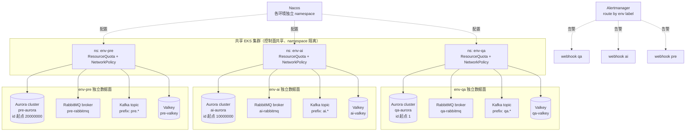
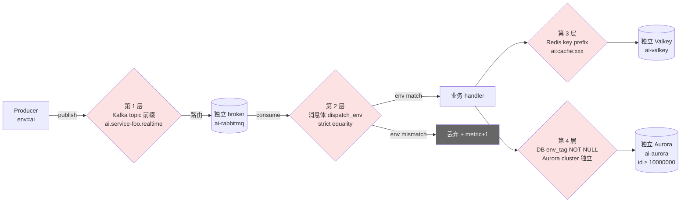

> **元信息**
> - 适用规模：≥ 3 个长期共存子环境（dev/qa/pre/staging/prod 或者按业务线拆的 a/b/c）
> - 适用云：AWS / 阿里云（任一通用云）
> - 运维负担：每个新环境一次性 1-2 个工作日；后续 0 维护
> - 月成本变化：相比"完全共用"多 $80-150/月（独立 RabbitMQ broker $71 + 独立 Valkey $11 + 独立 Aurora serverless $50-80 起步）
> - 最后验证：2026-04-30，Aurora MySQL 8.0 + Amazon MQ 3.13 + MSK 2.8 + ElastiCache Valkey 7.2 + ArgoCD 2.11 + Kubernetes 1.30

## 适用场景

满足以下任意两条，建议把这份 checklist 作为新环境上线门槛：

- 团队同时维护 ≥ 3 个长期子环境（qa / pre / staging / prod 或者按业务线拆的多个泳道）。
- 各子环境跑相同代码库，业务表使用自增整数 id（`AUTO_INCREMENT`）作为主键。
- 业务里存在跨实例广播（RabbitMQ topic exchange、Kafka 多消费者组、Redis Pub/Sub），消费侧按 id 而非环境标签写库。
- 历史上发生过"qa 看到 prod 数据"或"staging 用户被推送到 prod 的消息"这类灵异现象。

不适用：临时压测环境（24 小时内销毁）、纯前端 demo 环境（无写库行为）、单实例单租户的离线分析环境。

## 核心问题

### "省事"决定的代价

新增一个子环境（比如要拉一条线给算法团队跑实验），最快的上线姿势是：

1. K8s 用现有集群新开一个 namespace。
2. 数据库复用已有 Aurora cluster，只新建一个 schema。
3. RabbitMQ / Kafka / Valkey 全部共用，加个不同的 routing key 或 key 前缀就完事。
4. Nacos 复制一份现有环境的配置，改个 env 标签发布。

这样开一个新环境只要半天。问题在于上面四步里**每一步都埋了一个雷**，单独都不致命，叠加起来就是事故。

### 事故时间线（2026-03-25 → 2026-04-18，24 天）

| 时间 | 事件 |
|---|---|
| 2026-03-25 | 新环境 **env-AI** 上线，复用 env-QA 的 Aurora cluster / RabbitMQ broker / MSK / Valkey |
| 2026-04-11 | env-QA 库 `realtime_messages` 表开始首次集中接收来自 env-AI 的脏消息 |
| 2026-04-18 04:17 | env-AI 用户 `user_id=26` 创建 `project_id=233` 的项目并发了一条聊天消息 |
| 2026-04-18 上午 | env-QA 老用户 `user_id=15` 反馈"我在自己 9 月创建的老项目里看到了不认识的对话流" |
| 2026-04-18 11:20 | 起独立 Valkey 实例，env-AI 切流 |
| 2026-04-18 11:55 | 起独立 RabbitMQ broker，env-AI 切流 |
| 2026-04-18 12:05 | 完成 Nacos 6 个服务配置改造 + Kafka consumer group 切换，污染源停止 |
| 2026-04-18 12:33 | 数据清洗完成（CTAS 备份 + 临时表中转分批 DELETE），共清 95,430 行 |

### 污染规模量化

| 表 | 脏消息数 |
|---|---|
| `realtime_messages` | 91,403 |
| `fastagent_messages` | 5,083 |
| `context_messages` | 2,770 |
| `save_message_queue` | 176 |
| **合计** | **~10 万条** |

受影响范围：约 150 个老项目、10 个用户，受害最重的用户 63 个项目被写入 31,871 条不属于他的消息。

### 事故根因（4 件套同时成立）

1. **跨环境业务表 id 区间重叠**：env-AI 库 `project.id` 从 1 自增最大才 274，env-QA 老项目大量分布在 1-274 区间。
2. **广播总线（RabbitMQ）共用**：同 broker 同 vhost 同 fanout exchange，env-QA 的 dispatcher 进程也订阅了这个 exchange。
3. **消费者侧没有按环境标签强过滤**：dispatcher 按 `project_id` 数字直接写本地库，未校验 `dispatch_env`。
4. **配置中心从老环境"复制粘贴"时漏改 host 和 vhost**：Nacos 配置复制后只改 env 标签，host / vhost / consumer_group 全保留旧值。

四件套缺一不会爆雷。但实际工程里，**省事姿势会让 4 件套同时为真的概率非常高**。Checklist 的目的就是把这 4 个独立缺陷各自堵住，靠纵深防御兜底。

### 修复 SQL（含 CTE / 临时表中转 / 分批 DELETE）

事故清洗时数据量大、行锁严重，直接 `DELETE WHERE` 会触发 lock wait timeout 和 OOM。最终方案是 CTAS 备份 → 临时表中转 → 分批 DELETE。

```sql
-- 步骤 1: 备份受污染表（CTAS，秒级，不锁主表）
CREATE TABLE service_a.realtime_messages_bak_20260418
  SELECT * FROM service_a.realtime_messages
  WHERE created_at > '2026-03-25';

ALTER TABLE service_a.realtime_messages_bak_20260418
  ADD PRIMARY KEY (id);

-- 步骤 2: 把"待删"行 id 灌进临时表（用 CTE 把跨库 id 撞车的脏数据找出来）
CREATE TABLE service_a._dirty_ids (
  id BIGINT PRIMARY KEY
) ENGINE=InnoDB;

INSERT INTO service_a._dirty_ids (id)
WITH suspicious AS (
  SELECT m.id
  FROM service_a.realtime_messages m
  JOIN service_a.project p ON m.project_id = p.id
  WHERE m.project_id BETWEEN 1 AND 274          -- env-AI 当时 max_id
    AND m.created_at >= '2026-03-25'             -- env-AI 上线日
    AND p.created_at <  '2026-03-25'             -- env-QA 老项目
)
SELECT id FROM suspicious;

-- 步骤 3: 分批 DELETE（每批 1000 行，避免锁表 + binlog 巨大事务）
DROP PROCEDURE IF EXISTS service_a.purge_dirty_messages;

DELIMITER $$
CREATE PROCEDURE service_a.purge_dirty_messages()
BEGIN
  DECLARE done INT DEFAULT 0;
  DECLARE total INT DEFAULT 0;
  SELECT COUNT(*) INTO total FROM service_a._dirty_ids;
  SELECT CONCAT('待清理脏行：', total) AS info;

  REPEAT
    DELETE m FROM service_a.realtime_messages m
    JOIN service_a._dirty_ids d ON m.id = d.id
    LIMIT 1000;

    SET done = ROW_COUNT();
    DELETE FROM service_a._dirty_ids
    WHERE id IN (
      SELECT id FROM (
        SELECT d2.id FROM service_a._dirty_ids d2
        LEFT JOIN service_a.realtime_messages m ON m.id = d2.id
        WHERE m.id IS NULL LIMIT 1000
      ) t
    );

    DO SLEEP(0.2);  -- 给主从同步留缓冲
  UNTIL done = 0 END REPEAT;

  SELECT '清理完成' AS info;
END$$
DELIMITER ;

CALL service_a.purge_dirty_messages();

-- 步骤 4: 校验
SELECT COUNT(*) AS remaining
FROM service_a.realtime_messages m
JOIN service_a.project p ON m.project_id = p.id
WHERE m.project_id BETWEEN 1 AND 274
  AND m.created_at >= '2026-03-25'
  AND p.created_at <  '2026-03-25';
-- 期望输出：remaining = 0
```

清洗踩坑提醒：

- 备份表必须加 PK，否则 `DELETE FROM ... JOIN` 会全表扫
- 一个事务里删 > 5 万行会触发 OOM Killed 僵尸事务，sleep + 分批是必须的
- 长事务会撑爆主从复制延迟，清洗期间用 `SHOW SLAVE STATUS\G` 监控 `Seconds_Behind_Master`

## 方案对比

### 方案 A：完全独立基础设施

每个子环境独立的 K8s 集群、独立 Aurora cluster、独立 RabbitMQ broker、独立 Kafka 集群、独立 Valkey、独立 OpenSearch。

- **优点**：物理隔离，任何代码 bug 都不会跨环境污染数据，符合金融/医疗合规标准。
- **缺点**：3 个子环境的固定开销 ≈ 单环境 × 3，月成本 $1,500+ 起步；新环境上线时每条中间件都要独立配监控和告警。
- **适用**：生产环境（prod）、合规要求强的金融/医疗业务。
- **淘汰理由**（用于非生产环境）：太贵，3 个 qa/staging/pre 全套独立浪费明显。

### 方案 B：完全共享，仅 namespace 隔离

K8s 共用集群、Aurora 只多建一个 schema、RabbitMQ 只多建一个 vhost、Kafka 只多建一组 topic 前缀、Valkey 只多用一个 key prefix。

- **优点**：上线快（半天），月成本 0 增量。
- **缺点**：下文事故复盘里所有问题它全占；消费者代码必须严格自律按 env 过滤，但凡有一处写得不严就爆雷。
- **适用**：纯前端 demo 环境、24 小时内销毁的临时环境。
- **淘汰理由**（用于长期子环境）：本 Playbook 的事故就是这种方案的产物，10 万条脏数据 + 半天清洗工时 + 用户信任损失，不值。

### 方案 C：中间件独立 + 共享 K8s 集群 + ID 起点错开（推荐）

K8s 集群按 namespace 复用、Nacos 只多建一个 namespace，但是：

- Aurora cluster 独立（serverless v2 起步 $50/月）。
- RabbitMQ broker 独立（mq.m7g.medium $71/月）。
- Kafka 至少独立 consumer group + 独立 topic 命名空间，流量大时独立 cluster。
- Valkey 实例独立（cache.t4g.micro $11/月）。
- 业务表 `AUTO_INCREMENT` 起点设到 ≥ 10,000,000，留充足缓冲带防未来撞车。
- 消费侧按 `dispatch_env` 强制过滤跨环境消息。

月成本增量约 $80-150，相对方案 A 节省一个数量级，相对方案 B 把 4 件套里的 3 件直接堵掉。

### 选型对比

| 维度 | A 完全独立 | B 完全共享 | C 推荐方案 |
|---|---|---|---|
| 月成本增量（每新环境） | $500-1500+ | $0 | $80-150 |
| K8s 集群 | 独立 | 共享 | 共享（namespace 隔离） |
| 数据库 | 独立 cluster | 同 cluster + schema | 独立 cluster |
| RabbitMQ | 独立 broker | 同 broker + vhost | 独立 broker |
| Kafka | 独立 cluster | 同 cluster + topic 前缀 | 独立 group + topic 前缀（流量大时独立 cluster） |
| 缓存 | 独立实例 | 同实例 + key 前缀 | 独立实例 |
| 业务 id 撞车风险 | 0 | 高 | 0（起点错开 + 独立 cluster 双保险） |
| 上线工时 | 2-3 天 | 0.5 天 | 1-1.5 天 |
| 推荐场景 | prod/合规 | 临时 demo | 长期非生产环境 |

## 推荐架构

### 7 条隔离原则架构图



### 数据流三层防御图



关键决策点：

- **K8s 集群共享、namespace 隔离**：一个集群跑 3-5 个非生产环境的成本和运维负担都更低，namespace 已经隔离 RBAC 和网络策略足够用。
- **数据面强制独立**：Aurora / RabbitMQ / Kafka / Valkey / OpenSearch 五件套，每一件都是潜在的"广播总线"或"id 撞车面"，必须独立。
- **id 起点高位错开**：即使未来某天因为代码 bug 出现跨库读写，高位 id 也不会撞老环境的低位 id 区间，事故被天然限流。
- **配置中心按 namespace 隔离**：Nacos / Apollo / etcd 的配置必须按环境 namespace 隔离，禁止"复制粘贴 + 改 env 标签"。

## 实施步骤

### 隔离 1：独立 K8s namespace + 资源配额 + 默认 deny NetworkPolicy

**前置要求**：
- 已配置 kubeconfig，当前 context 指向目标 EKS / ACK 集群
- 当前 IAM 用户/RAM 用户拥有 `Namespace`、`ResourceQuota`、`NetworkPolicy`、`LimitRange` 的 `create` 权限
- 集群已安装 CNI 支持 NetworkPolicy（AWS VPC CNI 需启用 `enable_network_policy=true`）

**执行**：

```yaml
# 文件：env-ai-namespace.yaml
---
apiVersion: v1
kind: Namespace
metadata:
  name: env-ai
  labels:
    goalfy.dev/env: ai
    goalfy.dev/tier: non-prod
    pod-security.kubernetes.io/enforce: baseline
---
apiVersion: v1
kind: ResourceQuota
metadata:
  name: env-ai-quota
  namespace: env-ai
spec:
  hard:
    requests.cpu: "32"
    requests.memory: "64Gi"
    limits.cpu: "64"
    limits.memory: "128Gi"
    persistentvolumeclaims: "20"
    services.loadbalancers: "2"
    pods: "200"
---
apiVersion: v1
kind: LimitRange
metadata:
  name: env-ai-limits
  namespace: env-ai
spec:
  limits:
    - type: Container
      default:
        cpu: "500m"
        memory: "512Mi"
      defaultRequest:
        cpu: "100m"
        memory: "128Mi"
      max:
        cpu: "8"
        memory: "16Gi"
---
# 默认 deny 所有入站和出站
apiVersion: networking.k8s.io/v1
kind: NetworkPolicy
metadata:
  name: default-deny-all
  namespace: env-ai
spec:
  podSelector: {}
  policyTypes: ["Ingress", "Egress"]
---
# 允许 namespace 内部互通 + 出站 DNS + 出站 HTTPS（中间件、外部 API）
apiVersion: networking.k8s.io/v1
kind: NetworkPolicy
metadata:
  name: allow-internal-and-egress
  namespace: env-ai
spec:
  podSelector: {}
  policyTypes: ["Ingress", "Egress"]
  ingress:
    - from:
        - namespaceSelector:
            matchLabels:
              goalfy.dev/env: ai
        - namespaceSelector:
            matchLabels:
              kubernetes.io/metadata.name: ingress-nginx
  egress:
    - to:
        - namespaceSelector: {}
          podSelector:
            matchLabels:
              k8s-app: kube-dns
      ports:
        - port: 53
          protocol: UDP
        - port: 53
          protocol: TCP
    - to:
        - ipBlock:
            cidr: 0.0.0.0/0
            except:
              - 169.254.0.0/16
              - 10.0.0.0/8       # 集群内网走 namespaceSelector 单独放行
      ports:
        - port: 443
          protocol: TCP
        - port: 5671              # AMQP TLS
          protocol: TCP
        - port: 9094              # Kafka TLS
          protocol: TCP
        - port: 6379              # Redis（如走专线）
          protocol: TCP
        - port: 3306              # MySQL
          protocol: TCP
```

```bash
kubectl apply -f env-ai-namespace.yaml
```

**验证**：

```bash
# 1. namespace 创建成功
kubectl get ns env-ai -o jsonpath='{.metadata.labels}' | jq
# 期望输出：{"goalfy.dev/env":"ai","goalfy.dev/tier":"non-prod",...}

# 2. ResourceQuota 生效
kubectl describe resourcequota env-ai-quota -n env-ai
# 期望看到 Used / Hard 表格

# 3. NetworkPolicy 默认 deny
kubectl run -n env-ai netcheck --image=nicolaka/netshoot --rm -it --restart=Never -- \
  curl -m 3 https://www.google.com -I
# 期望：先 curl 不通（被 deny-all 拦），applyallow-internal-and-egress 后通
```

**回滚**：
```bash
kubectl delete -f env-ai-namespace.yaml
```

### 隔离 2：独立 Aurora cluster + RabbitMQ broker + Valkey 实例

**前置要求**：
- AWS CLI v2.x 已配好凭据，default region 为目标 region（如 `ap-southeast-1`）
- IAM 用户拥有 `rds:*`、`mq:*`、`elasticache:*`、`kafka:*` 权限
- 已记录目标 VPC ID `vpc-xxxxxxxxxxxxx` 和私有子网 ID `subnet-xxxxxx`
- 已建好 SecurityGroup `sg-aurora-xxx`、`sg-rabbitmq-xxx`、`sg-valkey-xxx`，入站 仅放给 EKS 节点 SG

**执行 - Aurora cluster**：

```bash
#!/bin/bash
# create-aurora-env-ai.sh
set -euo pipefail

ENV=ai
AWS_REGION=ap-southeast-1
DB_CLUSTER_ID="${ENV}-aurora-mysql"
SUBNET_GROUP="${ENV}-aurora-subnet-group"
SG_ID="sg-xxxxxxxxxxxxx"
MASTER_USER="admin"
MASTER_PWD=$(openssl rand -base64 24)

# 1. 写入凭据到 Secrets Manager
aws secretsmanager create-secret \
  --name "/${ENV}/aurora/admin" \
  --secret-string "{\"username\":\"${MASTER_USER}\",\"password\":\"${MASTER_PWD}\"}" \
  --region "${AWS_REGION}"

# 2. 创建子网组
aws rds create-db-subnet-group \
  --db-subnet-group-name "${SUBNET_GROUP}" \
  --db-subnet-group-description "subnet group for ${ENV}" \
  --subnet-ids subnet-xxxxxxxxxxxxxa subnet-xxxxxxxxxxxxxb subnet-xxxxxxxxxxxxxc \
  --region "${AWS_REGION}"

# 3. 创建 Aurora Serverless v2 cluster
aws rds create-db-cluster \
  --db-cluster-identifier "${DB_CLUSTER_ID}" \
  --engine aurora-mysql \
  --engine-version 8.0.mysql_aurora.3.05.2 \
  --master-username "${MASTER_USER}" \
  --master-user-password "${MASTER_PWD}" \
  --db-subnet-group-name "${SUBNET_GROUP}" \
  --vpc-security-group-ids "${SG_ID}" \
  --serverless-v2-scaling-configuration MinCapacity=0.5,MaxCapacity=4 \
  --backup-retention-period 7 \
  --preferred-backup-window "16:00-17:00" \
  --storage-encrypted \
  --enable-cloudwatch-logs-exports '["error","slowquery"]' \
  --tags "Key=env,Value=${ENV}" "Key=managed-by,Value=ops-checklist" \
  --region "${AWS_REGION}"

# 4. 创建 writer instance
aws rds create-db-instance \
  --db-instance-identifier "${DB_CLUSTER_ID}-writer" \
  --db-cluster-identifier "${DB_CLUSTER_ID}" \
  --engine aurora-mysql \
  --db-instance-class db.serverless \
  --region "${AWS_REGION}"

echo "等待 cluster 状态变 available（约 5-8 分钟）..."
aws rds wait db-cluster-available --db-cluster-identifier "${DB_CLUSTER_ID}" --region "${AWS_REGION}"

ENDPOINT=$(aws rds describe-db-clusters \
  --db-cluster-identifier "${DB_CLUSTER_ID}" \
  --query 'DBClusters[0].Endpoint' --output text \
  --region "${AWS_REGION}")
echo "Aurora endpoint: ${ENDPOINT}"
```

**验证**：
```bash
# 状态 available
aws rds describe-db-clusters --db-cluster-identifier ai-aurora-mysql \
  --query 'DBClusters[0].Status' --output text
# 期望输出：available

# 连接测试
mysql -h "${ENDPOINT}" -u admin -p${MASTER_PWD} -e "SELECT VERSION();"
# 期望输出：8.0.mysql_aurora.3.05.2
```

**回滚**：
```bash
aws rds delete-db-instance --db-instance-identifier ai-aurora-mysql-writer --skip-final-snapshot
aws rds delete-db-cluster --db-cluster-identifier ai-aurora-mysql --skip-final-snapshot
aws rds delete-db-subnet-group --db-subnet-group-name ai-aurora-subnet-group
```

**执行 - RabbitMQ broker**：

```bash
#!/bin/bash
# create-rabbitmq-env-ai.sh
set -euo pipefail

ENV=ai
AWS_REGION=ap-southeast-1
BROKER_NAME="${ENV}-rabbitmq"
SG_ID="sg-yyyyyyyyyyyyy"
USER="admin"
PWD=$(openssl rand -base64 24)

aws secretsmanager create-secret \
  --name "/${ENV}/rabbitmq/admin" \
  --secret-string "{\"username\":\"${USER}\",\"password\":\"${PWD}\"}" \
  --region "${AWS_REGION}"

aws mq create-broker \
  --broker-name "${BROKER_NAME}" \
  --engine-type RABBITMQ \
  --engine-version 3.13 \
  --host-instance-type mq.m7g.medium \
  --deployment-mode SINGLE_INSTANCE \
  --publicly-accessible false \
  --subnet-ids subnet-xxxxxxxxxxxxxa \
  --security-groups "${SG_ID}" \
  --auto-minor-version-upgrade true \
  --users "Username=${USER},Password=${PWD},ConsoleAccess=true" \
  --tags "env=${ENV}" \
  --region "${AWS_REGION}"

echo "broker 创建中（约 10-15 分钟）..."
```

**验证**：
```bash
aws mq describe-broker --broker-id <BROKER_ID> \
  --query 'BrokerState' --output text
# 期望：RUNNING

# 拿 endpoint
aws mq describe-broker --broker-id <BROKER_ID> \
  --query 'BrokerInstances[0].Endpoints'
```

**执行 - ElastiCache Valkey**：

```bash
#!/bin/bash
# create-valkey-env-ai.sh
set -euo pipefail

ENV=ai
AWS_REGION=ap-southeast-1
RG_ID="${ENV}-valkey"

aws elasticache create-cache-subnet-group \
  --cache-subnet-group-name "${RG_ID}-subnet" \
  --cache-subnet-group-description "valkey subnet for ${ENV}" \
  --subnet-ids subnet-xxxxxxxxxxxxxa subnet-xxxxxxxxxxxxxb \
  --region "${AWS_REGION}"

aws elasticache create-replication-group \
  --replication-group-id "${RG_ID}" \
  --replication-group-description "Valkey for ${ENV}" \
  --engine valkey \
  --engine-version 7.2 \
  --cache-node-type cache.t4g.micro \
  --num-cache-clusters 2 \
  --cache-subnet-group-name "${RG_ID}-subnet" \
  --security-group-ids sg-zzzzzzzzzzzzz \
  --automatic-failover-enabled \
  --transit-encryption-enabled \
  --tags "Key=env,Value=${ENV}" \
  --region "${AWS_REGION}"
```

**执行 - MSK Kafka cluster**（流量大才需要独立 cluster；否则只独立 consumer group + topic 前缀）：

```bash
#!/bin/bash
# create-msk-env-ai.sh
set -euo pipefail

cat > /tmp/msk-config.json <<'EOF'
{
  "BrokerNodeGroupInfo": {
    "InstanceType": "kafka.m7g.large",
    "ClientSubnets": [
      "subnet-xxxxxxxxxxxxxa",
      "subnet-xxxxxxxxxxxxxb",
      "subnet-xxxxxxxxxxxxxc"
    ],
    "SecurityGroups": ["sg-aaaaaaaaaaaaa"]
  },
  "ClusterName": "ai-msk",
  "EncryptionInfo": {
    "EncryptionInTransit": {
      "ClientBroker": "TLS",
      "InCluster": true
    }
  },
  "EnhancedMonitoring": "PER_TOPIC_PER_BROKER",
  "KafkaVersion": "2.8.1",
  "NumberOfBrokerNodes": 3,
  "Tags": { "env": "ai" }
}
EOF

aws kafka create-cluster --cli-input-json file:///tmp/msk-config.json \
  --region ap-southeast-1
```

**回滚（统一）**：参见每个服务的 `delete-*` 命令；务必先做 final snapshot 再删 cluster。

### 隔离 3：Kafka topic 命名前缀强约束

**前置要求**：
- Kafka admin 工具已安装（`kafka-topics.sh` 来自 `kafka_2.13-3.6.0` tarball 或 `bitnami/kafka` docker 镜像）
- 客户端凭据已配置（IAM auth 或 SASL/SCRAM）

**执行 - 创建 topic 脚本（含命名校验）**：

```bash
#!/bin/bash
# kafka-create-topic.sh
# 用法：./kafka-create-topic.sh <env> <service> <event> [partitions] [replication]

set -euo pipefail

ENV="${1:-}"
SERVICE="${2:-}"
EVENT="${3:-}"
PARTITIONS="${4:-6}"
REPLICATION="${5:-3}"

if [[ -z "$ENV" || -z "$SERVICE" || -z "$EVENT" ]]; then
  echo "用法：$0 <env> <service> <event> [partitions] [replication]"
  exit 1
fi

# 命名校验：env 必须在白名单
case "$ENV" in
  qa|ai|pre|staging|prod) ;;
  *) echo "❌ env 必须是 qa/ai/pre/staging/prod，当前：$ENV"; exit 1 ;;
esac

# service / event 只允许小写字母 + 连字符
if [[ ! "$SERVICE" =~ ^[a-z][a-z0-9-]*$ ]]; then
  echo "❌ service 必须是小写字母+连字符开头：$SERVICE"; exit 1
fi
if [[ ! "$EVENT" =~ ^[a-z][a-z0-9-]*$ ]]; then
  echo "❌ event 必须是小写字母+连字符开头：$EVENT"; exit 1
fi

TOPIC="${ENV}.${SERVICE}.${EVENT}"
BOOTSTRAP="${KAFKA_BOOTSTRAP:?需要设置 KAFKA_BOOTSTRAP}"

echo "[+] 创建 topic：${TOPIC}（partitions=${PARTITIONS}, replication=${REPLICATION}）"
kafka-topics.sh \
  --bootstrap-server "${BOOTSTRAP}" \
  --command-config /etc/kafka/client.properties \
  --create \
  --topic "${TOPIC}" \
  --partitions "${PARTITIONS}" \
  --replication-factor "${REPLICATION}" \
  --config retention.ms=604800000 \
  --config min.insync.replicas=2

# 校验
kafka-topics.sh \
  --bootstrap-server "${BOOTSTRAP}" \
  --command-config /etc/kafka/client.properties \
  --describe --topic "${TOPIC}"
```

**执行 - Go SDK 工具方法（拒绝硬编码 topic）**：

```go
// pkg/mqtopic/topic.go
package mqtopic

import (
    "fmt"
    "os"
    "regexp"
)

var (
    validEnv     = regexp.MustCompile(`^(qa|ai|pre|staging|prod)$`)
    validNameSeg = regexp.MustCompile(`^[a-z][a-z0-9-]*$`)
)

// Name 拼接 topic 名 <env>.<service>.<event>
// 启动时如果 DISPATCH_ENV 没设或不合法，直接 panic 让进程起不来。
func Name(service, event string) string {
    env := os.Getenv("DISPATCH_ENV")
    if !validEnv.MatchString(env) {
        panic(fmt.Sprintf("DISPATCH_ENV invalid: %q (must be qa/ai/pre/staging/prod)", env))
    }
    if !validNameSeg.MatchString(service) || !validNameSeg.MatchString(event) {
        panic(fmt.Sprintf("invalid service/event segment: %s/%s", service, event))
    }
    return fmt.Sprintf("%s.%s.%s", env, service, event)
}

// Group 拼接 consumer group 名 <env>-<service>-<purpose>
func Group(service, purpose string) string {
    env := os.Getenv("DISPATCH_ENV")
    if !validEnv.MatchString(env) {
        panic(fmt.Sprintf("DISPATCH_ENV invalid: %q", env))
    }
    return fmt.Sprintf("%s-%s-%s", env, service, purpose)
}
```

**验证**：
```bash
kafka-topics.sh --bootstrap-server $KAFKA_BOOTSTRAP --list \
  | grep -v '^[a-z]\+\.' && echo "❌ 发现不带 env 前缀的 topic" || echo "✅ 全部 topic 命名合规"
```

**回滚**：
```bash
kafka-topics.sh --bootstrap-server $KAFKA_BOOTSTRAP --delete --topic ai.service-foo.realtime
```

### 隔离 4：业务表 ID 起点错开

**前置要求**：
- 已有该环境的 Aurora cluster 写入权限
- 业务库 schema 已通过 migration 创建好表
- 当前没有应用在写入（建议在上线前完成）

**执行 - MySQL 批量改 AUTO_INCREMENT**：

```sql
-- 对所有业务表批量设置 AUTO_INCREMENT 起点 1000 万
SET @start = 10000000;
SET @stmt = NULL;

SELECT GROUP_CONCAT(
  CONCAT('ALTER TABLE `', TABLE_NAME, '` AUTO_INCREMENT=', @start)
  SEPARATOR '; '
)
INTO @stmt
FROM information_schema.TABLES
WHERE TABLE_SCHEMA = DATABASE()
  AND AUTO_INCREMENT IS NOT NULL;

PREPARE s FROM @stmt;
EXECUTE s;
DEALLOCATE PREPARE s;

-- 校验
SELECT TABLE_NAME, AUTO_INCREMENT
FROM information_schema.TABLES
WHERE TABLE_SCHEMA = DATABASE()
  AND AUTO_INCREMENT < 10000000;
-- 期望输出：empty set
```

**执行 - PostgreSQL sequence 起点**：

```sql
-- 一次性把所有 sequence 推到 1000 万
DO $$
DECLARE
  r RECORD;
BEGIN
  FOR r IN
    SELECT schemaname, sequencename
    FROM pg_sequences
    WHERE schemaname = current_schema()
  LOOP
    EXECUTE format('SELECT setval(%L, 10000000)',
                   r.schemaname || '.' || r.sequencename);
  END LOOP;
END$$;

-- 校验
SELECT schemaname, sequencename, last_value
FROM pg_sequences
WHERE last_value < 10000000;
-- 期望输出：empty set
```

**执行 - id 接近上限告警 PrometheusRule**：

```yaml
---
apiVersion: monitoring.coreos.com/v1
kind: PrometheusRule
metadata:
  name: id-exhaustion
  namespace: monitoring
  labels:
    role: alert-rules
spec:
  groups:
    - name: id-exhaustion
      interval: 5m
      rules:
        - alert: BusinessTableIdNearLimit
          expr: |
            mysql_table_max_id_ratio > 0.7
          for: 30m
          labels:
            severity: warning
          annotations:
            summary: "业务表 id 接近 INT 上限（70%）"
            description: "{{ $labels.env }} / {{ $labels.table }} id 已用 {{ $value | humanizePercentage }}，需要规划 BIGINT 升级"
        - alert: BusinessTableIdRangeOverlap
          expr: |
            multi_env_id_overlap_count > 0
          for: 10m
          labels:
            severity: critical
          annotations:
            summary: "跨环境业务表 id 区间重叠"
            description: "{{ $labels.env_a }} 和 {{ $labels.env_b }} 的 {{ $labels.table }} id 区间存在交集"
```

**验证**：

```sql
-- 跨环境检查 id 区间是否重叠
SELECT 'env-qa'  AS env, MIN(id), MAX(id) FROM qa_db.project
UNION ALL
SELECT 'env-ai'  AS env, MIN(id), MAX(id) FROM ai_db.project
UNION ALL
SELECT 'env-pre' AS env, MIN(id), MAX(id) FROM pre_db.project;
-- 期望：每个环境 [MIN, MAX] 区间互不相交
```

**回滚**：AUTO_INCREMENT 是单调递增的，不可逆。如需回退请直接 drop database 重建。

### 隔离 5：dispatch_env 字段强制 + 应用层 middleware

**前置要求**：
- 业务代码使用 Go + sarama / amqp091-go
- Migration 工具是 golang-migrate 或 atlas

**执行 - 业务表 migration 模板**：

```sql
-- migrations/00001_init.up.sql
-- 所有业务表必须带 env_tag，NOT NULL DEFAULT 'unknown'
CREATE TABLE realtime_messages (
  id           BIGINT       NOT NULL AUTO_INCREMENT,
  project_id   BIGINT       NOT NULL,
  user_id      BIGINT       NOT NULL,
  content      TEXT         NOT NULL,
  env_tag      VARCHAR(16)  NOT NULL DEFAULT 'unknown',
  created_at   TIMESTAMP(3) NOT NULL DEFAULT CURRENT_TIMESTAMP(3),
  PRIMARY KEY (id),
  KEY idx_env_proj (env_tag, project_id),
  KEY idx_proj_created (project_id, created_at)
) ENGINE=InnoDB DEFAULT CHARSET=utf8mb4;

-- 触发器兜底（防应用层漏填）
DELIMITER $$
CREATE TRIGGER realtime_messages_env_tag_default
BEFORE INSERT ON realtime_messages
FOR EACH ROW
BEGIN
  IF NEW.env_tag = 'unknown' OR NEW.env_tag = '' THEN
    SIGNAL SQLSTATE '45000'
      SET MESSAGE_TEXT = 'env_tag must be set explicitly';
  END IF;
END$$
DELIMITER ;
```

**执行 - 生产端 publish 拦截器（强制注入）**：

```go
// pkg/mqclient/publisher.go
package mqclient

import (
    "context"
    "encoding/json"
    "errors"
    "os"

    amqp "github.com/rabbitmq/amqp091-go"
)

type Envelope struct {
    DispatchEnv string          `json:"dispatch_env"`
    EventType   string          `json:"event_type"`
    Payload     json.RawMessage `json:"payload"`
}

type Publisher struct {
    ch  *amqp.Channel
    env string
}

func NewPublisher(ch *amqp.Channel) *Publisher {
    env := os.Getenv("DISPATCH_ENV")
    if env == "" {
        panic("DISPATCH_ENV not set, refusing to start publisher")
    }
    return &Publisher{ch: ch, env: env}
}

// Publish 强制注入 dispatch_env，业务代码无法绕过
func (p *Publisher) Publish(ctx context.Context, exchange, routingKey, eventType string, payload any) error {
    raw, err := json.Marshal(payload)
    if err != nil {
        return err
    }
    env := Envelope{
        DispatchEnv: p.env,
        EventType:   eventType,
        Payload:     raw,
    }
    body, err := json.Marshal(env)
    if err != nil {
        return err
    }
    return p.ch.PublishWithContext(ctx, exchange, routingKey, false, false, amqp.Publishing{
        ContentType: "application/json",
        Headers: amqp.Table{
            "x-dispatch-env": p.env,
        },
        Body: body,
    })
}
```

**执行 - 消费端严格过滤**：

```go
// pkg/mqclient/consumer.go
package mqclient

import (
    "encoding/json"
    "log/slog"
    "os"

    "github.com/prometheus/client_golang/prometheus"
    "github.com/prometheus/client_golang/prometheus/promauto"
    amqp "github.com/rabbitmq/amqp091-go"
)

var (
    droppedCrossEnv = promauto.NewCounterVec(prometheus.CounterOpts{
        Name: "dispatcher_dropped_cross_env_total",
        Help: "消息因 dispatch_env 不匹配被丢弃",
    }, []string{"local_env", "msg_env"})

    droppedEmptyEnv = promauto.NewCounter(prometheus.CounterOpts{
        Name: "dispatcher_empty_env_total",
        Help: "消息 dispatch_env 字段为空（异常，必须告警）",
    })
)

type Handler func(payload []byte) error

type Consumer struct {
    ch       *amqp.Channel
    localEnv string
    handlers map[string]Handler
}

func NewConsumer(ch *amqp.Channel) *Consumer {
    env := os.Getenv("DISPATCH_ENV")
    if env == "" {
        panic("DISPATCH_ENV not set")
    }
    return &Consumer{ch: ch, localEnv: env, handlers: map[string]Handler{}}
}

func (c *Consumer) Handle(d amqp.Delivery) {
    var env Envelope
    if err := json.Unmarshal(d.Body, &env); err != nil {
        slog.Error("invalid envelope", "err", err)
        _ = d.Nack(false, false)
        return
    }

    // 显式失败：env 字段为空必须告警
    if env.DispatchEnv == "" {
        droppedEmptyEnv.Inc()
        slog.Error("empty dispatch_env, dropping",
            "event", env.EventType, "msg_id", d.MessageId)
        _ = d.Nack(false, false)
        return
    }

    // 跨环境过滤
    if env.DispatchEnv != c.localEnv {
        droppedCrossEnv.WithLabelValues(c.localEnv, env.DispatchEnv).Inc()
        slog.Warn("cross-env message dropped",
            "local", c.localEnv, "msg_env", env.DispatchEnv)
        _ = d.Ack(false)  // ack 掉，不要回到队列
        return
    }

    handler, ok := c.handlers[env.EventType]
    if !ok {
        slog.Warn("no handler", "event", env.EventType)
        _ = d.Ack(false)
        return
    }

    if err := handler(env.Payload); err != nil {
        slog.Error("handler failed", "err", err)
        _ = d.Nack(false, true)  // 重入队
        return
    }
    _ = d.Ack(false)
}
```

**验证**：

```bash
# 单测
go test ./pkg/mqclient/... -run TestCrossEnvDrop -v

# 跨环境冒烟（手动 publish 一个错环境的消息，期望被丢弃 + metric 增加）
DISPATCH_ENV=qa ./bin/test-publisher --to=ai-broker --env-override=ai
sleep 5
curl -s http://localhost:8080/metrics | grep dispatcher_dropped_cross_env
# 期望看到 dispatcher_dropped_cross_env_total{local_env="ai",msg_env="qa"} 1
```

**回滚**：去掉 publisher 的 env 注入和 consumer 的过滤逻辑（不推荐，回到事故态）。

### 隔离 6：监控告警分通道

**前置要求**：
- Prometheus + Alertmanager 已部署
- 钉钉/飞书 webhook URL 已申请

**执行 - PrometheusRule 加 environment label**：

```yaml
---
apiVersion: monitoring.coreos.com/v1
kind: PrometheusRule
metadata:
  name: env-ai-rules
  namespace: monitoring
  labels:
    role: alert-rules
    env: ai     # 关键：每条规则都打 env label，方便 alertmanager 路由
spec:
  groups:
    - name: env-ai
      interval: 30s
      rules:
        - alert: HighErrorRate
          expr: |
            sum by (service) (rate(http_requests_total{namespace="env-ai",code=~"5.."}[5m]))
              / sum by (service) (rate(http_requests_total{namespace="env-ai"}[5m])) > 0.05
          for: 5m
          labels:
            severity: warning
            env: ai
          annotations:
            summary: "env-ai {{ $labels.service }} 错误率 > 5%"
```

**执行 - Alertmanager route 按 env 分发**：

```yaml
# alertmanager.yaml
route:
  receiver: 'default'
  group_by: ['alertname', 'env']
  routes:
    - matchers:
        - env="prod"
      receiver: 'dingtalk-prod-oncall'
      continue: false
    - matchers:
        - env="pre"
      receiver: 'dingtalk-pre'
      continue: false
    - matchers:
        - env="ai"
      receiver: 'dingtalk-ai-team'
      continue: false
    - matchers:
        - env="qa"
      receiver: 'feishu-qa'
      continue: false

receivers:
  - name: 'default'
    webhook_configs:
      - url: 'http://prometheus-alert:8080/dingtalk/default/send'
  - name: 'dingtalk-prod-oncall'
    webhook_configs:
      - url: 'http://prometheus-alert:8080/dingtalk/prod-oncall/send'
        send_resolved: true
  - name: 'dingtalk-pre'
    webhook_configs:
      - url: 'http://prometheus-alert:8080/dingtalk/pre/send'
        send_resolved: true
  - name: 'dingtalk-ai-team'
    webhook_configs:
      - url: 'http://prometheus-alert:8080/dingtalk/ai-team/send'
        send_resolved: true
  - name: 'feishu-qa'
    webhook_configs:
      - url: 'http://prometheus-alert:8080/feishu/qa/send'
        send_resolved: true
```

**验证**：
```bash
# 触发一个 env=ai 的测试告警
curl -X POST http://alertmanager:9093/api/v1/alerts -H "Content-Type: application/json" -d '[{
  "labels": {"alertname":"TestAlert","env":"ai","severity":"warning"},
  "annotations": {"summary":"test"}
}]'
# 期望：ai-team 钉钉群收到通知；其他群不响
```

### 隔离 7：端到端验证（24 小时观察 + 自动巡检）

**前置要求**：
- 新环境 6 件套（K8s ns / DB / RabbitMQ / Kafka / Valkey / Nacos）已就绪
- 业务服务已 sync 到新 namespace 并 Running

**执行 - 端到端冒烟脚本**：

```bash
#!/bin/bash
# e2e-isolation-check.sh
set -euo pipefail

ENV="${1:?用法：$0 <env-name>}"
NEIGHBOR="${2:?用法：$0 <env-name> <neighbor-env-name>}"

echo "[1/5] 检查 K8s namespace 隔离"
kubectl get ns "env-${ENV}" -o jsonpath='{.metadata.labels.goalfy\.dev/env}'
echo

echo "[2/5] 检查 RabbitMQ broker 不与邻接环境共用"
ENV_BROKER=$(aws ssm get-parameter --name "/${ENV}/rabbitmq/host" --query 'Parameter.Value' --output text)
NEI_BROKER=$(aws ssm get-parameter --name "/${NEIGHBOR}/rabbitmq/host" --query 'Parameter.Value' --output text)
if [[ "$ENV_BROKER" == "$NEI_BROKER" ]]; then
  echo "❌ ${ENV} 与 ${NEIGHBOR} 共用 RabbitMQ broker：${ENV_BROKER}"; exit 1
fi
echo "✅ ${ENV} broker=${ENV_BROKER}, ${NEIGHBOR} broker=${NEI_BROKER}"

echo "[3/5] 检查 Valkey 实例不共用"
ENV_VALKEY=$(aws ssm get-parameter --name "/${ENV}/valkey/host" --query 'Parameter.Value' --output text)
NEI_VALKEY=$(aws ssm get-parameter --name "/${NEIGHBOR}/valkey/host" --query 'Parameter.Value' --output text)
if [[ "$ENV_VALKEY" == "$NEI_VALKEY" ]]; then
  echo "❌ Valkey 共用：${ENV_VALKEY}"; exit 1
fi
echo "✅ ${ENV} valkey=${ENV_VALKEY}"

echo "[4/5] 检查 Aurora cluster 不共用"
ENV_DB=$(aws rds describe-db-clusters --db-cluster-identifier "${ENV}-aurora-mysql" \
  --query 'DBClusters[0].DBClusterArn' --output text)
NEI_DB=$(aws rds describe-db-clusters --db-cluster-identifier "${NEIGHBOR}-aurora-mysql" \
  --query 'DBClusters[0].DBClusterArn' --output text)
if [[ "$ENV_DB" == "$NEI_DB" ]]; then
  echo "❌ Aurora 共用：${ENV_DB}"; exit 1
fi
echo "✅ ${ENV} aurora=${ENV_DB}"

echo "[5/5] 跨环境扫表巡检"
mysql -h "${NEIGHBOR}-aurora.cluster-xxx.rds.amazonaws.com" \
  -u readonly -p"${NEIGHBOR_RO_PWD}" \
  -D "${NEIGHBOR}_db" <<EOF
SELECT m.project_id, p.user_id, COUNT(*) AS suspicious
FROM realtime_messages m
JOIN project p ON m.project_id = p.id
WHERE m.project_id <= (SELECT MAX(id) FROM ${ENV}_db.project)
  AND m.created_at > '$(date -d '7 days ago' +%F)'
  AND p.created_at < '$(date -d '7 days ago' +%F)'
GROUP BY m.project_id, p.user_id
HAVING suspicious > 0
ORDER BY suspicious DESC
LIMIT 20;
EOF
echo "✅ 扫表完成（如有结果列表，立即停止上线）"
```

**自动化检测脚本（每天 8 点 cronjob）**：

```yaml
---
apiVersion: batch/v1
kind: CronJob
metadata:
  name: env-isolation-daily-check
  namespace: monitoring
spec:
  schedule: "0 0 * * *"   # UTC 0 点 = 北京 8 点
  concurrencyPolicy: Forbid
  successfulJobsHistoryLimit: 3
  failedJobsHistoryLimit: 7
  jobTemplate:
    spec:
      template:
        spec:
          restartPolicy: OnFailure
          serviceAccountName: env-isolation-checker
          containers:
            - name: checker
              image: <ACCOUNT_ID>.dkr.ecr.ap-southeast-1.amazonaws.com/env-isolation-checker:1.0.0
              env:
                - name: ENVIRONMENTS
                  value: "qa,ai,pre,staging"
                - name: ALERT_WEBHOOK
                  valueFrom:
                    secretKeyRef:
                      name: dingtalk-ops
                      key: webhook
              command: ["/bin/sh", "-c"]
              args:
                - |
                  set -e
                  /app/check-broker-uniqueness.sh
                  /app/check-id-range-overlap.sh
                  /app/check-empty-env-tag.sh
```

## 自动化校验脚本

### IaC pre-commit：禁止共用 broker / cluster

```bash
#!/bin/bash
# .git/hooks/pre-commit (或 pre-commit framework)
# 拒绝在 terraform/kustomize 配置里出现两个 env 共用同一个 broker arn

set -euo pipefail

CHANGED=$(git diff --cached --name-only --diff-filter=ACM | grep -E '\.(tf|yaml|yml)$' || true)
[[ -z "$CHANGED" ]] && exit 0

# 提取所有 broker_arn / cluster_arn 引用
DUP=$(echo "$CHANGED" | xargs grep -hoE '(broker_arn|cluster_arn|replication_group_id)\s*=\s*"[^"]+"' \
  | sort | uniq -c | awk '$1 > 1 {print}')

if [[ -n "$DUP" ]]; then
  echo "❌ 发现多处引用同一 broker/cluster/redis：" >&2
  echo "$DUP" >&2
  exit 1
fi
```

### 校验新环境 ID 起点 ≥ 旧环境 max_id + 1000 万

```bash
#!/bin/bash
# check-id-start.sh
# 用法：./check-id-start.sh <new-env> <db-host> <db-user> <db-pwd>
set -euo pipefail

NEW_ENV="$1"
NEW_HOST="$2"
USER="$3"
PWD="$4"

OTHER_ENVS=(qa ai pre staging)
GLOBAL_MAX=0

for env in "${OTHER_ENVS[@]}"; do
  [[ "$env" == "$NEW_ENV" ]] && continue
  HOST=$(aws ssm get-parameter --name "/${env}/aurora/host" --query 'Parameter.Value' --output text)
  MAX=$(mysql -h "$HOST" -u "$USER" -p"$PWD" -D "${env}_db" \
        -BNe "SELECT IFNULL(MAX(id),0) FROM project")
  echo "  ${env} max(project.id) = ${MAX}"
  if (( MAX > GLOBAL_MAX )); then GLOBAL_MAX=$MAX; fi
done

REQUIRED=$(( GLOBAL_MAX + 10000000 ))
NEW_AUTO=$(mysql -h "$NEW_HOST" -u "$USER" -p"$PWD" -D "${NEW_ENV}_db" \
  -BNe "SELECT AUTO_INCREMENT FROM information_schema.TABLES WHERE TABLE_SCHEMA='${NEW_ENV}_db' AND TABLE_NAME='project'")

if (( NEW_AUTO < REQUIRED )); then
  echo "❌ ${NEW_ENV}.project AUTO_INCREMENT=${NEW_AUTO}, 要求 >= ${REQUIRED}"
  exit 1
fi
echo "✅ ${NEW_ENV}.project AUTO_INCREMENT=${NEW_AUTO} >= ${REQUIRED}"
```

### 校验 env_tag 字段必填

```sql
-- check-env-tag-coverage.sql
-- 期望：所有业务表都有 env_tag 字段且 NOT NULL
SELECT TABLE_NAME, COLUMN_NAME, IS_NULLABLE, COLUMN_DEFAULT
FROM information_schema.COLUMNS
WHERE TABLE_SCHEMA = DATABASE()
  AND COLUMN_NAME = 'env_tag';

-- 找出没有 env_tag 字段的表
SELECT t.TABLE_NAME
FROM information_schema.TABLES t
LEFT JOIN information_schema.COLUMNS c
  ON c.TABLE_SCHEMA = t.TABLE_SCHEMA
 AND c.TABLE_NAME = t.TABLE_NAME
 AND c.COLUMN_NAME = 'env_tag'
WHERE t.TABLE_SCHEMA = DATABASE()
  AND t.TABLE_TYPE = 'BASE TABLE'
  AND c.COLUMN_NAME IS NULL;
-- 期望输出：empty set
```

## 新环境上线 SOP（Markdown 模板）

每次新环境上线必须填这份 SOP，跑完每个 checkbox 才能 review。

```markdown
# 新环境上线申请：env-<NAME>

## PRD 阶段（产品/PM 填）

- [ ] 环境用途（QA / 灰度 / 算法实验 / 多租户隔离）
- [ ] 预期生命周期（≤ 1 个月走方案 B；≥ 3 个月走方案 C；prod 走方案 A）
- [ ] 预期 QPS / 并发用户数 / 月数据增量
- [ ] 是否需要从旧环境同步基础数据（影响 id 起点策略）
- [ ] 是否对外暴露公网（影响 SSL / WAF / 备案）

## 技术评审阶段（架构/SRE 填）

- [ ] 选定方案：A / B / C（默认 C）
- [ ] 月成本预估：$ ____
- [ ] 资源 ID 列表（不能与现有环境重复）：
  - [ ] EKS namespace 名
  - [ ] Aurora cluster identifier
  - [ ] RabbitMQ broker name
  - [ ] Valkey replication group id
  - [ ] MSK cluster name（若独立）
  - [ ] Nacos namespace id
- [ ] 业务表 AUTO_INCREMENT 起点：____ (必须 >= 现有最大 + 1000 万)

## 上线前 dry-run

- [ ] 跑过 `./check-id-start.sh`，输出 ✅
- [ ] 跑过 `./check-env-tag-coverage.sql`，empty set
- [ ] 跑过 `./e2e-isolation-check.sh`，5/5 通过
- [ ] IaC pre-commit 通过（无重复 broker/cluster 引用）
- [ ] alertmanager route 已加新环境分支
- [ ] 钉钉/飞书 webhook 已申请并接入

## 上线后 24 小时巡检

- [ ] T+1h: 业务服务全部 Running，无 CrashLoopBackOff
- [ ] T+4h: dispatcher_empty_env_total 为 0
- [ ] T+12h: 跨环境扫表 SQL 输出 0 行
- [ ] T+24h: id 区间 dashboard 无重叠告警
- [ ] T+24h: 业务侧确认无"灵异"现象

## 责任人

- 提案人：____
- 架构 review：____
- SRE 实施：____
- 业务 owner：____
- 上线日期：____
```

## 踩过的坑

### 坑 1：env-AI 共用 env-QA 中间件 + ID 撞车（主事故）

**现象**：env-AI 上线 17 天后，env-QA 的一个内部测试用户（user_id=15）反馈"我在自己 9 月创建的老项目里看到了不认识的对话流"。

**根因**：四件套同时成立。

- env-AI 库 `project.id` 从 1 自增，最大才 274。
- env-QA 库 `project.id` 老项目大量在 1-274 区间。
- RabbitMQ broker 和 vhost 两边共用，env-AI 推的 WebSocket 消息广播到了 env-QA 的 dispatcher。
- env-QA dispatcher 没按 `dispatch_env` 过滤跨环境消息，按 `project_id` 数字直接写本地库。

某个 04:17 时刻一条 env-AI 消息（`chat_id=M-1c554f117725`）在 5 毫秒内：

- env-AI 库写入 `project_id=233`，对应 env-AI 用户 user_id=26 当天 04:17 创建的项目。
- env-QA 库写入 `project_id=233`，对应 env-QA 用户 user_id=15 在 2025-09 创建的"小红书运营"老项目。

**修复**：

1. 当天上午 11:20 起独立 Valkey 实例（`<env>-valkey`，cache.t4g.micro，$11/月）。
2. 11:55 起独立 RabbitMQ broker（`<env>-rabbitmq`，mq.m7g.medium，$71/月）。
3. 12:05 完成 env-AI Nacos 6 个服务的配置改动（实时业务 / 后端 / dispatcher / 推送 / AI 网关 / 计费）+ Kafka consumer group 改为本环境名。
4. 12:33 完成数据清洗：CTAS 备份 + 临时表中转分批 DELETE 1000 行/批，共清 95,430 行；另有 5,083 行被业务侧 cronjob 自动清掉。
5. 后续提交：dispatcher 加 `dispatch_env` 严格过滤；env-AI `project.id` 起点提升到 10,000,000；上线 publisher 拦截器强制注入 env。

**通用结论**：新子环境上线时绝不允许"复用某个现成环境的中间件"。Aurora、RabbitMQ、Kafka、Valkey 这五件套必须独立。哪怕只是临时跑实验，独立中间件月增量 $80 也比事故修复成本（半天工时 + 信任损失）低一个数量级。

### 坑 2：cluster 合并/迁移时辅助组件没迁全

**现象**：把两个 sandbox 集群（qa + ai）合并成一个时，业务 workload 全部 Running，但 AI 沙箱用户报错"创建 sandbox 一直 pending"。

**根因**：迁移脚本只处理了 `agent / portal / meter / ui` 这 4 个业务 workload，漏掉了：

- gvisor-ai NodePool 的 placeholder pod。DaemonSet 不会触发 Karpenter 创建节点，必须有 placeholder 这种 pending pod 才会拉起新 node，没 placeholder = NodePool 永远没节点 = 沙箱永远 pending。
- Nacos 里 scaler 配置的 `nodepool_name` 字段，默认值还指向旧的 qa NodePool 名字，AI 沙箱起来后被调度到了 qa NodePool。

**修复**：补迁 placeholder Deployment 到新集群、修改 Nacos scaler 配置 `nodepool_name=gvisor-ai`、滚动重启 scaler。

迁移 checklist 模板：

```markdown
## 集群合并/迁移 checklist

### 1. 业务 workload
- [ ] Deployment / StatefulSet / DaemonSet 全部清单
- [ ] HPA / PDB
- [ ] CronJob

### 2. 辅助组件（最容易漏）
- [ ] placeholder pod（触发 Karpenter NodePool）
- [ ] node-protector
- [ ] custom scaler
- [ ] init job / migration job
- [ ] sidecar 注入 webhook

### 3. 配置中心默认值
- [ ] Nacos / Apollo 里所有指向旧集群名 / NodePool 名 / broker host 的字段
- [ ] ConfigMap 里硬编码的 region / az / endpoint
- [ ] Secret 里指向旧 KMS key 的引用

### 4. RBAC / IRSA
- [ ] ServiceAccount 注解 eks.amazonaws.com/role-arn 是否可用
- [ ] ClusterRole / RoleBinding 是否带集群名
- [ ] CSI driver / addon 的 IAM 绑定

### 5. 端到端验证
- [ ] 完整链路（创建 → 使用 → 销毁）跑一次
- [ ] 不只看 pod Running，必须验证业务功能
```

**通用结论**：集群合并/迁移时除了业务 workload，必须逐项检查辅助组件。

### 坑 3：env_tag 字段没强制必填，部分老代码漏过滤

**现象**：dispatcher 加了 `dispatch_env` 过滤逻辑后，仍有零星脏数据漏出。

**根因**：`dispatch_env` 是新加的字段，部分老消息在生产端 publish 时没设这个字段，到消费侧默认是空字符串。过滤逻辑写的是 `if msg.DispatchEnv != c.localEnv { drop }`，空字符串不等于 `qa` 也会被丢，看似正确。但少数老代码把 `dispatch_env` 当作 optional 字段，部分场景 publish 时会随机填一个旧值（如 `prod`），那条消息就会在所有非 prod 环境被全部丢弃，看上去是"丢消息 bug"。

**修复 - 网关层兜底过滤**：

```go
// pkg/mqclient/gateway_filter.go
package mqclient

// GatewayFilter 在 broker 入口对没有 dispatch_env 的消息直接拒收
// 部署在 RabbitMQ shovel 或 Kafka MirrorMaker 链路上做兜底
func GatewayFilter(raw []byte) (forward bool, reason string) {
    var env Envelope
    if err := json.Unmarshal(raw, &env); err != nil {
        return false, "invalid_json"
    }
    if env.DispatchEnv == "" {
        return false, "empty_env"
    }
    if !validEnv.MatchString(env.DispatchEnv) {
        return false, "invalid_env_value"
    }
    return true, ""
}
```

部署方式：在 RabbitMQ federation 链路或者 Kafka 入口 sidecar 上跑 GatewayFilter，被拒消息直接丢到 dead-letter exchange + 告警。

**修复 - 应用层 alert 规则**：

```yaml
- alert: EmptyDispatchEnvSeen
  expr: rate(dispatcher_empty_env_total[5m]) > 0
  for: 5m
  labels:
    severity: critical
  annotations:
    summary: "发现 dispatch_env 为空的消息（生产端未注入）"
    description: "本环境 5 分钟内消费到 {{ $value }} 条无 env 标记的消息，必须立刻找出未升级的 producer"
```

**通用结论**：纵深防御层（env 过滤）必须做"显式失败"而不是"静默通过"，否则新引入的过滤反而会掩盖老 bug。

## 衡量指标

| 维度 | 事故前（共用模式） | 事故后（独立模式） |
|---|---|---|
| env-AI 月成本（中间件部分） | $0 增量 | +$82（RabbitMQ $71 + Valkey $11） |
| 跨环境数据污染量（24 天） | ~10 万条脏消息 / 150 项目 | 0 |
| 数据清洗工时 | 0.5 人日 | 0 |
| 用户信任损失 | 10 个用户上报、客户经理出面 | 0 |
| 新环境上线工时 | 0.5 人日（全共用） | 1-1.5 人日（独立中间件） |
| 上线后 24 小时巡检 | 无 | 自动 SQL 巡检 + RabbitMQ UI 检查 |
| 事故复发风险 | 高（4 件套全部成立） | 极低（4 件套各自堵死） |

定性变化：

- 新增子环境从"看老员工记忆决定哪些可以共用"变成"清单走完一项不少，否则上线被拒"。
- 数据污染从"用户上报 → 客户经理升级 → 紧急排查"的被动模式，变成"每日自动巡检脚本告警"的主动模式。
- 跨环境同名业务表 id 区间在 dashboard 上常态化展示，撞车风险一眼可见。

## 局限

- **本 checklist 主要针对长期共存的非生产业务环境**，临时压测环境（24 小时内销毁）、纯前端 demo 环境不需要全套。
- **不解决数据库 schema 漂移问题**：本 checklist 只解决"数据不串环境"，不解决"qa 表结构和 prod 不一致导致的 bug"，那是另一个 Playbook 的事。
- **不替代代码 review**：消费端 `dispatch_env` 过滤这种纵深防御靠 review 兜底，本 checklist 给的是基础设施和数据库层的硬隔离。
- **多租户 SaaS 的租户隔离不在本范围**：本 checklist 是环境维度（dev/qa/staging/prod）的隔离，不是租户（tenant_id）维度的隔离，后者通常需要在应用层解决。
- **id 起点改造对 BIGINT 友好、对 INT 慎用**：`AUTO_INCREMENT >= 10,000,000` 在 INT 表上还有 200 多倍余量，但如果业务表已经在 10 亿量级，需要先升 BIGINT 再做起点改造。

## 后续演进方向

- **GitOps 自动校验**：在新环境的 IaC PR 提交时，由 CI 校验 Aurora cluster ID、RabbitMQ broker ID、Valkey instance ID 是否与其他环境重复，业务表 `AUTO_INCREMENT` 起点是否 ≥ 1000 万，不达标 PR 自动 reject。
- **Nacos 配置 lint**：把"复制 PRE 配置忘改 host"这类典型错误编码成 lint 规则，pre-commit / pre-merge 强制跑。
- **跨环境 id 区间 dashboard**：Grafana 加一个 panel，每天 0 点拉取所有环境核心业务表 `MIN(id)` / `MAX(id)`，区间相交直接红框告警。
- **环境画像服务**：建一个内部服务暴露 `GET /env/<name>` 接口，返回该环境用了哪些中间件实例、id 起点、配置 namespace 等元信息；新环境上线前先在这个服务里注册并通过校验。
- **混沌注入**：在测试环境定期注入"误把 broker host 写成 qa 的"这类配置漂移，观察 dispatch_env 过滤层是否真的兜得住，避免防御层退化。

---

> 最后验证：2026-04-30，Aurora MySQL 8.0 + Amazon MQ 3.13 + MSK 2.8 + ElastiCache Valkey 7.2 + ArgoCD 2.11 + Kubernetes 1.30。本 Playbook 内容超过 12 个月未复核请慎重参考，云厂商定价和实例类型可能已变化。
