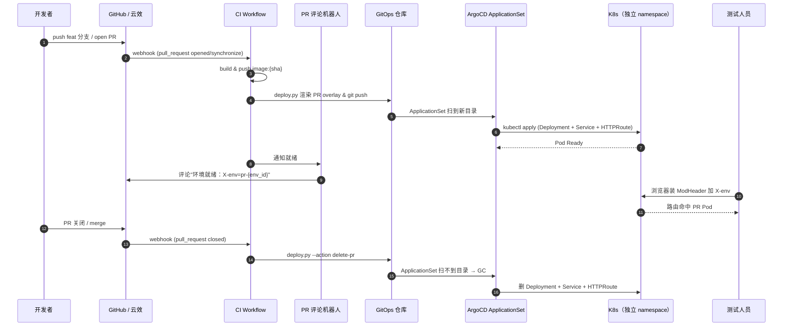
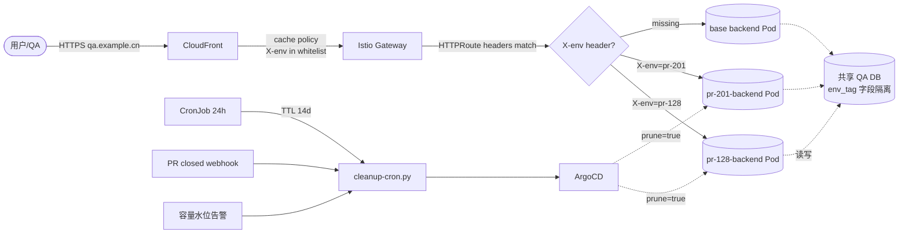

> **元信息**
> - 适用规模：5-50 人后端团队，并行 PR 常态 ≥ 3 个
> - 适用云：通用（AWS EKS / 阿里云 ACK / 自建 K8s 都适用）
> - 运维负担：一次性接入 1-2 周；新服务进白名单 0.5 天
> - 月成本：增量约现有 QA 成本的 30%（3-5 个并行 PR Pod）
> - 最后验证：2026-04-30，业务服务 A / B 已端到端跑通真实代码改动

## 适用场景

满足以下任意两条建议按本 Playbook 推进：

- 团队同时跑 ≥ 3 个 feature 分支，QA 环境长期被某个 PR 占着，其他人测试拿不到稳定结果
- 已尝试过"每个 PR 一套 namespace + 一个域名 + 一张证书"，但维护清理跟不上，半数 namespace 长期 idle
- QA 环境共享导致回归测试结果"看心情"，开发者把"先在我本地跑过"作为唯一信任源
- 主干分支保护开了，但 PR 合并前根本没有真实部署过的环境可供 QA 验证
- 想做"灰度评审"——让产品/QA 在 PR 合并前就在真实部署上点一遍——但又不愿为每个分支维护独立域名

不适用场景见文末「局限」一节。本 Playbook 默认你已经有 K8s + GitOps（ArgoCD 或 Flux）+ 一个独立的 QA 集群，并且业务服务大致是无状态 HTTP API。前端、定时任务、内部异步消费者并不直接适用，原因在踩坑 4 与方案对比里展开。

## 核心问题

### 共享 QA 的真实代价

| 痛点 | 表现 | 真实代价 |
|------|------|----------|
| 互相覆盖 | A 推一次镜像，B 正在测的功能版本被替换 | B 测试结果作废 |
| 配置漂移 | 某 PR 临时改了 Nacos 配置未还原 | 下个 PR 故障被错误归因 |
| 数据污染 | A 的 PR 写脏了一张测试表 | C 的接口测试 1-2 天后才发现是数据问题 |
| 排队 | "你先测，我等会再 push" | 高峰期一天只跑 2-3 轮真机验证 |

只看资源开销，"一套 QA 环境"省钱。但工程效率上的隐性成本经常被低估：5 人后端组并行 4 个 PR，每周共享环境产生的"作废测试"与"误归因排查"按 30 min/次估算，单周浪费 8-10 人时；并发 PR 数从 2 涨到 5，互相覆盖与数据污染的次数会以接近平方的速度增长，传统"先沟通再 push"的协作模式在 5 人以上的小组不再 scale。

### 想要的形态

理想方案具备四个属性：

1. PR 一推送就有对应的环境，不需要开发者手动申请
2. 不互相覆盖，每个 PR 有自己的独立 Pod
3. 入口侧不引入额外的域名/证书运维负担——QA 域名继续用，路由侧自动分流
4. 自动清理，PR 关闭即销毁，没有人手工 GC 的负担

## 方案对比

### 方案 A：共享一套 QA 环境

形态：一个 namespace、一份 Deployment，所有人推镜像都更新这一份。适合单分支主干模型、并行 PR < 2 的小组、对测试结果时效要求低的服务。本 Playbook 关心的是并行开发场景，方案 A 正是该场景下的痛点来源，故被淘汰。

### 方案 B：每个 PR 一套独立域名 + 证书 + Ingress

形态：CI 为每个 PR 创建独立 namespace、独立 Deployment、独立 Service，并申请独立域名（如 `pr-128.qa.example.cn`）+ 独立 TLS 证书 + 独立 Ingress 规则。适合测试团队需要把每个 PR 当作独立的预发环境（含浏览器分享 URL 给产品验收），且已有自助域名平台 + ACME 自动签证书 + Ingress controller 支持动态规则的团队。

淘汰理由：

- 域名/证书运维负担重。三方 DNS 提供商（Route53 / 阿里云）批量创建解析记录、ACME challenge、Ingress 规则同步，每个环节都可能成为故障点
- 配置量大。Ingress 规则、Cert-Manager Issuer、可能还要外部 CDN 缓存策略，每个 PR 都要复制一遍
- 清理麻烦。namespace 要清、DNS 记录要清、证书要清、CDN 缓存策略要清，链路一长就有泄漏

### 方案 C：PR Pod + X-env header 路由 + 自动清理（推荐）

形态：

- CI 在独立 namespace 拉起 PR Pod，但**入口域名继续复用 QA 域名**
- 入口处的 HTTPRoute（Gateway API）按 `X-env` header 把流量切到对应 PR Pod
- 三层清理保障：PR 关闭触发清理、24h cron 兜底、ArgoCD ApplicationSet 自动 GC

核心收益：路由层 0 增量配置——QA 域名/证书/CDN 缓存策略全部复用；PR Pod 完全独立——每个 PR 有独立 Deployment + Service，互不打架；开发者使用零摩擦——浏览器装 ModHeader 插件加一个 `X-env: pr-{env_id}` header 就接入 PR 环境。

后续章节围绕方案 C 展开。

## 推荐架构

### PR 流程时序



### 路由架构



### 关键决策点

**1. 路由层不引入新域名**：入口 Gateway 上挂 HTTPRoute，header `X-env=pr-{env_id}` 命中时把流量打到 PR Service，否则走 base Service。这是整套方案最大的简化点：每多一个 PR，路由层的增量是一个 HTTPRoute 资源（Kustomize patch 自动生成），不是一套域名/证书/Ingress。Gateway API 把 hostname 与 route 解耦后，多 PR 共用一个 Gateway 就能完成事情。

**2. PR Pod 用同 namespace 还是独立 namespace**：选择**同 namespace + namePrefix `pr-{env_id}-`**。理由：同 namespace 下 ServiceAccount / Secret / ConfigMap 复用 base 的，不需要为每个 PR 重新拷贝（IRSA / KMS / 镜像拉取凭据配置一份就够）；ApplicationSet matrix generator 沿着 git 目录扫，独立目录已经隔离了 GitOps 资源；namespace 多了对监控、日志、限流策略都是负担。除非合规要求强制 namespace 隔离，否则 namePrefix 已经够用。

**3. 入口域名复用：CDN 转发 X-env header**：如果入口前还有 CDN（CloudFront / 阿里云 CDN / Cloudflare），默认 cache policy 不会转发自定义 header，PR 流量会被错误地命中 base Pod 的缓存。需要为接入 PR 隔离的域名换上自定义 cache policy，把 `X-env` 加进 whitelist——既参与缓存键也向源转发。具体见踩坑 3。

**4. PR env_id 命名规则**：分支名 → slug 化（小写、只保留 a-z0-9-）→ 截断到 40 字符。原因：K8s label value 最大 63 字符，namePrefix 还要再加 `pr-` 与服务名，留余量；DNS 兼容性 ── 即使将来某些场景把 env_id 拼到 hostname 里，也不会因下划线 / 大写而炸。

## 实施步骤

### 步骤 1：GitOps 目录约定

**前置要求**：

- GitOps 仓库已建（ArgoCD 监听）
- ArgoCD ≥ 2.10、Kustomize ≥ 5.0
- 集群安装了 Gateway API CRDs（v1）和 Istio ≥ 1.22 或 Envoy Gateway ≥ 1.2

**执行**：约定如下目录布局。

```
gitops/
├── argocd/applicationsets/
│   └── qa-pr-envs.yaml                                # PR 专用 ApplicationSet
├── base/{project}/{service}/                          # base 共享模板
│   ├── kustomization.yaml
│   ├── deployment.yaml
│   ├── service.yaml
│   └── pdb.yaml
└── clusters/us-qa/applications/
    ├── {project}/{service}/                           # 普通 QA overlay
    └── {project}-pr/{env_id}-{service}/               # PR overlay (动态生成)
        ├── kustomization.yaml
        └── httproute.yaml
```

**验证**：

```bash
$ tree gitops/clusters/us-qa/applications/service-foo-pr/
service-foo-pr/
└── pr-feat-channel-backend/
    ├── kustomization.yaml
    └── httproute.yaml
```

**回滚**：删 `clusters/us-qa/applications/{project}-pr/` 整个目录，ApplicationSet prune 会自动 GC 所有 Application 与 K8s 资源。验证 GC 完成的方式：`kubectl get app -n argocd -l pr-env=true` 应返回空。

PR overlay 用独立的 `{project}-pr` 目录，配套独立的 ApplicationSet（matrix 只扫这个目录）。这样 PR Pod 的生灭不影响普通 QA 应用，scan / sync 也独立，定位故障时不会互相干扰。强烈建议 PR 目录与普通 QA 目录在文件系统层就分开，而不是用 label 做软隔离 ── 后者在大量 PR 并发时排查问题非常难定位。

### 步骤 2：base/ 目录完整 yaml

base 目录是所有 overlay 的共同上游。下面给出最小可用的 deployment + service + kustomization 三件套。这里关键约束：base 的 Deployment label `app` 必须是固定字符串（如 `backend`），后续 PR overlay 才能精确 patch 替换。如果 base 用 `app.kubernetes.io/name` 这种 helm-style 复合 key，patch path 会复杂很多。

```yaml
# base/service-foo/backend/kustomization.yaml
apiVersion: kustomize.config.k8s.io/v1beta1
kind: Kustomization
namespace: qa
resources:
  - deployment.yaml
  - service.yaml
  - pdb.yaml
commonLabels:
  app.kubernetes.io/part-of: service-foo
```

```yaml
# base/service-foo/backend/deployment.yaml
apiVersion: apps/v1
kind: Deployment
metadata:
  name: backend
  namespace: qa
  labels:
    app: backend
spec:
  replicas: 2
  selector:
    matchLabels:
      app: backend
  template:
    metadata:
      labels:
        app: backend
        version: stable
    spec:
      serviceAccountName: backend-sa
      containers:
        - name: backend
          image: service-foo/backend:placeholder
          ports:
            - containerPort: 8080
          env:
            - name: PR_ENV_ID
              value: "main"
          resources:
            requests: { cpu: 200m, memory: 512Mi }
            limits:   { cpu: 1000m, memory: 1Gi }
          readinessProbe:
            httpGet: { path: /api/health, port: 8080 }
            initialDelaySeconds: 5
```

```yaml
# base/service-foo/backend/service.yaml
apiVersion: v1
kind: Service
metadata:
  name: backend
  namespace: qa
spec:
  selector:
    app: backend
  ports:
    - port: 8080
      targetPort: 8080
```

### 步骤 3：ApplicationSet 配置

ApplicationSet 是 ArgoCD 提供的"动态生成 Application"机制，用 matrix generator 把"集群清单"与"git 目录清单"做笛卡尔积。本方案的核心机制：每当 GitOps 仓库下 `clusters/us-qa/applications/*-pr/*` 出现新目录，ApplicationSet 就自动生成一个对应的 Application 并把它 sync 到 us-qa 集群；目录被删除时反向 GC。

**完整 manifest**：

```yaml
# argocd/applicationsets/qa-pr-envs.yaml
apiVersion: argoproj.io/v1alpha1
kind: ApplicationSet
metadata:
  name: qa-pr-envs
  namespace: argocd
spec:
  generators:
    - matrix:
        generators:
          - clusters:
              selector:
                matchLabels:
                  env: us-qa
          - git:
              repoURL: ssh://git@git.example.cn/infra/gitops.git
              revision: HEAD
              directories:
                - path: clusters/us-qa/applications/*-pr/*
  template:
    metadata:
      name: '{{path[3]}}-{{path.basename}}'
      labels:
        pr-env: "true"
        pr-created-at: '{{path.basename}}'
    spec:
      project: default
      destination:
        server: '{{server}}'
        namespace: qa
      source:
        repoURL: ssh://git@git.example.cn/infra/gitops.git
        path: '{{path}}'
      syncPolicy:
        automated:
          prune: true
          selfHeal: true
        retry:
          limit: 5
          backoff: { duration: 10s, factor: 2, maxDuration: 5m }
```

**验证**：

```bash
$ kubectl --context argocd-cluster get applicationset qa-pr-envs -n argocd
NAME          AGE
qa-pr-envs    3m

$ kubectl --context argocd-cluster get app -n argocd -l pr-env=true
NAME                                       SYNC STATUS   HEALTH STATUS
service-foo-pr-pr-feat-channel-backend     Synced        Healthy
```

**回滚**：`kubectl delete applicationset qa-pr-envs -n argocd`，所有 PR Application 也跟着 GC（前提是没禁 `propagationPolicy`）。删 ApplicationSet 之前建议先把 `syncPolicy.automated.prune` 改成 `false`，避免误删 namespace 下不属于本 ApplicationSet 管理的资源。

**ApplicationSet template 的 app 名前缀建议固定**（如 `service-foo-pr-`），下游清理脚本按前缀匹配，逻辑简单可靠。app 名格式 `{project}-pr-{env_id}-{service}` 在 ArgoCD UI 里也方便按 project 列出来一组 PR 应用，做批量 sync / refresh。

### 步骤 4：deploy.py 渲染 PR overlay

`deploy.py` 是整套体系的"控制平面"，做四件事：校验 `(project, service)` 在 PR 白名单内、生成 PR env_id（slug 化分支名）、渲染 overlay 到 GitOps 仓库对应路径、`git push` 让 ArgoCD 自然 sync。脚本被 CI 调用，也能本地手工执行做调试。

**前置要求**：Python ≥ 3.9，`pip install pyyaml jinja2 GitPython`。运行前要先把 GitOps 仓库 clone 到本地，且当前用户有 push 权限（部署 SSH key 或 token）。

```python
#!/usr/bin/env python3
# gitops/scripts/deploy.py（核心片段）
"""PR 环境创建/删除：写 overlay → git push → ArgoCD 自动 sync"""
import argparse, subprocess, sys, re, os, time
from pathlib import Path

GITOPS_ROOT = Path(__file__).resolve().parents[1]

PR_ENABLED_SERVICES = {("service-foo", "backend"), ("service-bar", "backend")}

KUSTOMIZATION_TMPL = """\
apiVersion: kustomize.config.k8s.io/v1beta1
kind: Kustomization
resources:
  - ../../../../../base/{project}/{service}
  - httproute.yaml
namePrefix: "pr-{env_id}-"
labels:
  - includeSelectors: true
    pairs:
      version: "pr-{env_id}"
  - includeSelectors: false
    pairs:
      example.dev/env: qa-pr
      pr-env-id: "{env_id}"
images:
  - name: {project}/{service}
    newTag: "{commit_id}-{timestamp}"
patches:
  - target: {{ kind: Deployment }}
    patch: |-
      - op: replace
        path: /spec/selector/matchLabels/app
        value: "pr-{env_id}-{base_app}"
      - op: replace
        path: /spec/template/metadata/labels/app
        value: "pr-{env_id}-{base_app}"
      - op: add
        path: /spec/template/spec/containers/0/env/-
        value:
          name: PR_ENV_ID
          value: "pr-{env_id}"
  - target: {{ kind: Service }}
    patch: |-
      - op: replace
        path: /spec/selector/app
        value: "pr-{env_id}-{base_app}"
"""

HTTPROUTE_TMPL = """\
apiVersion: gateway.networking.k8s.io/v1
kind: HTTPRoute
metadata:
  name: backend-pr-route
  annotations:
    pr-created-at: "{created_at}"
spec:
  parentRefs:
    - name: qa-gateway
      namespace: gateway-system
  hostnames: ["qa.example.cn"]
  rules:
    - matches:
        - headers:
            - name: X-env
              value: "pr-{env_id}"
          path: {{ type: PathPrefix, value: /api }}
      backendRefs:
        - name: {service}
          port: 8080
"""

def slugify(branch: str) -> str:
    s = re.sub(r"[^a-z0-9-]+", "-", branch.lower()).strip("-")
    return s[:40]

def render_pr(project, service, branch, commit_id):
    if (project, service) not in PR_ENABLED_SERVICES:
        sys.exit(f"FATAL: ({project},{service}) not in PR whitelist")
    env_id = slugify(branch)
    base_app = service
    ts = time.strftime("%Y-%m-%d-%H-%M-%S")
    out = GITOPS_ROOT / f"clusters/us-qa/applications/{project}-pr/{env_id}-{service}"
    out.mkdir(parents=True, exist_ok=True)
    (out / "kustomization.yaml").write_text(KUSTOMIZATION_TMPL.format(
        project=project, service=service, env_id=env_id,
        base_app=base_app, commit_id=commit_id, timestamp=ts))
    (out / "httproute.yaml").write_text(HTTPROUTE_TMPL.format(
        env_id=env_id, service=service, created_at=ts))
    return env_id, out

def git_commit_push(message):
    subprocess.run(["git", "add", "."], cwd=GITOPS_ROOT, check=True)
    subprocess.run(["git", "commit", "-m", message], cwd=GITOPS_ROOT, check=True)
    subprocess.run(["git", "push", "origin", "HEAD"], cwd=GITOPS_ROOT, check=True)

def delete_pr(project, service, branch):
    env_id = slugify(branch)
    out = GITOPS_ROOT / f"clusters/us-qa/applications/{project}-pr/{env_id}-{service}"
    if not out.exists():
        print(f"already deleted: {out}")
        return
    subprocess.run(["git", "rm", "-rf", str(out)], cwd=GITOPS_ROOT, check=True)

def main():
    ap = argparse.ArgumentParser()
    ap.add_argument("--action", required=True, choices=["create-pr", "delete-pr"])
    ap.add_argument("--project", required=True)
    ap.add_argument("--service", required=True)
    ap.add_argument("--branch", required=True)
    ap.add_argument("--commit", default="")
    a = ap.parse_args()
    if a.action == "create-pr":
        env_id, _ = render_pr(a.project, a.service, a.branch, a.commit or "manual")
        git_commit_push(f"PR env: create {a.project}/{a.service} {env_id}")
        print(f"OK env_id=pr-{env_id}")
    else:
        delete_pr(a.project, a.service, a.branch)
        git_commit_push(f"PR env: delete {a.project}/{a.service} {a.branch}")

if __name__ == "__main__":
    main()
```

**验证**（本地 dry run）：

```bash
$ kustomize build clusters/us-qa/applications/service-foo-pr/pr-feat-channel-backend/ \
    | kubectl apply --dry-run=client -f -
deployment.apps/pr-feat-channel-backend-backend created (dry run)
service/pr-feat-channel-backend-backend     created (dry run)
httproute/pr-feat-channel-backend-backend-pr-route created (dry run)
```

**回滚**：`python3 deploy.py --action delete-pr --project service-foo --service backend --branch feat-channel-backend`。会做 `git rm -rf` + commit + push，ArgoCD 检测到目录消失自动 GC。

**deploy.py 渲染时的关键输出**：渲染后必跑一次 `kustomize build` 做 dry run 验证 ── overlay 文件可能因为模板字符 / 缩进 bug 导致 Kustomize 直接 build 失败。CI 步骤里建议在 git push 之前先 build 一次，build 失败就直接 fail，不要把破损的 overlay 推到 GitOps 仓库引起 ArgoCD 反复重试。

### 步骤 5：GitHub Actions 完整 workflow

**前置要求**：

- GitHub 仓库 Settings → Secrets 配 `GITOPS_SSH_KEY`、`AWS_ACCESS_KEY_ID`、`AWS_SECRET_ACCESS_KEY`
- runner 拥有 push GitOps 仓库的权限（部署 SSH key）

```yaml
# .github/workflows/pr-env.yaml
name: PR Environment

on:
  pull_request:
    types: [opened, synchronize, reopened, closed]
    branches: [main]

permissions:
  contents: read
  pull-requests: write

concurrency:
  group: pr-env-${{ github.event.pull_request.number }}
  cancel-in-progress: false

env:
  PROJECT: service-foo
  SERVICE: backend
  AWS_REGION: us-west-2

jobs:
  build-and-deploy:
    if: github.event.action != 'closed'
    runs-on: ubuntu-latest
    outputs:
      env_id: ${{ steps.render.outputs.env_id }}
    steps:
      - uses: actions/checkout@v4
      - name: Configure AWS
        uses: aws-actions/configure-aws-credentials@v4
        with:
          aws-access-key-id: ${{ secrets.AWS_ACCESS_KEY_ID }}
          aws-secret-access-key: ${{ secrets.AWS_SECRET_ACCESS_KEY }}
          aws-region: ${{ env.AWS_REGION }}
      - name: Login ECR
        run: |
          aws ecr get-login-password --region $AWS_REGION \
            | docker login --username AWS --password-stdin <ACCOUNT_ID>.dkr.ecr.$AWS_REGION.amazonaws.com
      - name: Build & push image
        id: img
        run: |
          IMG=<ACCOUNT_ID>.dkr.ecr.$AWS_REGION.amazonaws.com/${PROJECT}/${SERVICE}
          TAG="${GITHUB_SHA::8}-$(date +%Y%m%d-%H%M%S)"
          docker build -t $IMG:$TAG .
          docker push $IMG:$TAG
          echo "tag=$TAG" >> $GITHUB_OUTPUT
      - name: Checkout gitops
        uses: actions/checkout@v4
        with:
          repository: infra/gitops
          ssh-key: ${{ secrets.GITOPS_SSH_KEY }}
          path: gitops
      - name: Render PR overlay
        id: render
        run: |
          cd gitops
          BRANCH="${{ github.event.pull_request.head.ref }}"
          python3 scripts/deploy.py \
            --action create-pr \
            --project $PROJECT --service $SERVICE \
            --branch "$BRANCH" --commit "${GITHUB_SHA::8}"
          ENV_ID=$(echo "$BRANCH" | tr '[:upper:]_/' '[:lower:]--' | head -c 40)
          echo "env_id=$ENV_ID" >> $GITHUB_OUTPUT
      - name: Wait ArgoCD sync
        run: |
          for i in {1..30}; do
            STATUS=$(curl -sk -H "Authorization: Bearer $ARGOCD_TOKEN" \
              "$ARGOCD_URL/api/v1/applications/${PROJECT}-pr-pr-${{ steps.render.outputs.env_id }}-${SERVICE}" \
              | jq -r '.status.sync.status // empty')
            [[ "$STATUS" == "Synced" ]] && exit 0
            sleep 10
          done
          echo "::warning::ArgoCD not synced in 5min (still likely OK due to AppSet reconcile)"
        env:
          ARGOCD_URL: https://argocd.example.cn
          ARGOCD_TOKEN: ${{ secrets.ARGOCD_TOKEN }}
      - name: Comment on PR
        uses: actions/github-script@v7
        with:
          script: |
            const envId = "${{ steps.render.outputs.env_id }}"
            const body = [
              "PR 环境就绪",
              "",
              "- 入口域名：`https://qa.example.cn`",
              "- 请求时附 header：`X-env: pr-" + envId + "`",
              "- ModHeader 一键导入：https://docs.example.cn/pr-env-howto",
              "",
              "PR 关闭后环境会被自动清理。"
            ].join("\n")
            github.rest.issues.createComment({
              issue_number: context.payload.pull_request.number,
              owner: context.repo.owner,
              repo: context.repo.repo,
              body
            })

  cleanup:
    if: github.event.action == 'closed'
    runs-on: ubuntu-latest
    steps:
      - uses: actions/checkout@v4
        with:
          repository: infra/gitops
          ssh-key: ${{ secrets.GITOPS_SSH_KEY }}
      - name: Delete PR overlay
        run: |
          BRANCH="${{ github.event.pull_request.head.ref }}"
          python3 scripts/deploy.py \
            --action delete-pr \
            --project $PROJECT --service $SERVICE \
            --branch "$BRANCH"
```

**云效 Flow 等价配置**（关键差异：MR merge 时 `CI_COMMIT_REF_NAME` 是目标分支，要从 webhook payload 解析 source 分支）：

```yaml
# .workflow/pr-env.flow.yaml （云效 Flow 片段）
sources:
  repo:
    type: aliyun_code
    branchesFilter: ["*"]
    triggerEvents: [push, mergeRequest]

stages:
  build:
    jobs:
      build:
        steps:
          - step: BuildDockerImage
            inputs:
              dockerfilePath: ./Dockerfile
              imageRepoUrl: cr.example.cn/${PROJECT}/${SERVICE}
              imageTag: ${COMMIT::8}-${DATETIME}
  deploy:
    jobs:
      deploy:
        steps:
          - step: RunCommand
            run: |-
              # 云效 step 级 envs: 字段失效，必须在 run 里 export
              export BRANCH="${TRIGGER_PAYLOAD_SOURCE_BRANCH:-$CI_COMMIT_REF_NAME}"
              git clone git@git.example.cn:infra/gitops.git
              cd gitops
              python3 scripts/deploy.py --action create-pr \
                --project service-foo --service backend \
                --branch "$BRANCH" --commit "${COMMIT::8}"
```

**PR namespace 命名规范**：本方案不为 PR 单独建 namespace，所有 PR Pod 都落在同 `qa` namespace 下，靠 namePrefix `pr-{env_id}-` 区分。如果一定要单独 namespace（强合规、网络策略隔离要求等），命名 `pr-{service}-{env_id}`（最长 63 字符），并把 ApplicationSet 的 `destination.namespace` 改成 `'pr-{service}-{path.basename}'`，同时为新 namespace 单独配置 ResourceQuota 与 NetworkPolicy。

**云效 vs GitHub 的关键差异**：

- 触发事件名：GitHub 是 `pull_request`，云效是 `mergeRequest`（注意大小写）
- 触发时上下文里的"当前分支"：GitHub 在 PR opened 时 `GITHUB_REF` 是 `refs/pull/<n>/merge`、`HEAD_REF` 才是 source 分支；云效 MR merge 触发时 `CI_COMMIT_REF_NAME` 是目标分支，需要从 `triggerInfo.msgData.object_attributes.source_branch` 解析
- secret 注入：GitHub Actions 用 `${{ secrets.X }}`，云效要在变量组里建好然后 `$X` 引用

### 步骤 6：HTTPRoute 路由 ── 三种入口实现

入口路由是整套方案的"流量分发器"：根据请求里的 `X-env` header 决定流量去哪个 PR Pod。下面给三种主流入口的完整实现，三选一即可（建议优先选 Gateway API + Istio / Envoy Gateway，未来兼容性最好）。

#### Istio Gateway / Envoy Gateway（Gateway API）

```yaml
# infra/gateway/qa-gateway.yaml
apiVersion: gateway.networking.k8s.io/v1
kind: Gateway
metadata:
  name: qa-gateway
  namespace: gateway-system
spec:
  gatewayClassName: istio       # 或 envoy
  listeners:
    - name: https
      protocol: HTTPS
      port: 443
      hostname: "qa.example.cn"
      tls:
        mode: Terminate
        certificateRefs:
          - kind: Secret
            name: qa-tls
      allowedRoutes:
        namespaces: { from: All }
```

```yaml
# clusters/us-qa/applications/service-foo-pr/pr-feat-channel-backend/httproute.yaml
apiVersion: gateway.networking.k8s.io/v1
kind: HTTPRoute
metadata:
  name: backend-pr-route
spec:
  parentRefs:
    - name: qa-gateway
      namespace: gateway-system
  hostnames: ["qa.example.cn"]
  rules:
    - matches:
        - headers:
            - name: X-env
              value: "pr-feat-channel-backend"
          path: { type: PathPrefix, value: /api }
      backendRefs:
        - name: backend
          port: 8080
```

**Gateway API 优先级**：header match 比无 header 兜底规则优先级高，PR 命中时不会被 base 抢走。

#### 不用 Service Mesh：Nginx Ingress canary-by-header

```yaml
# overlays/pr/nginx-canary-ingress.yaml
apiVersion: networking.k8s.io/v1
kind: Ingress
metadata:
  name: backend-pr-canary
  annotations:
    nginx.ingress.kubernetes.io/canary: "true"
    nginx.ingress.kubernetes.io/canary-by-header: "X-env"
    nginx.ingress.kubernetes.io/canary-by-header-value: "pr-feat-channel-backend"
spec:
  ingressClassName: nginx
  rules:
    - host: qa.example.cn
      http:
        paths:
          - path: /api
            pathType: Prefix
            backend:
              service:
                name: pr-feat-channel-backend-backend
                port: { number: 8080 }
```

注意 `canary-by-header-value` 是精确匹配。同一域名挂多个 canary Ingress 时只生效一个，多 PR 场景下 nginx-ingress 不如 Gateway API 顺手。

**验证**（任一入口均适用）：

```bash
$ curl -s -H "X-env: pr-feat-channel-backend" https://qa.example.cn/api/health | jq
{ "ok": true, "pr_env_id": "pr-feat-channel-backend" }

$ curl -s https://qa.example.cn/api/health | jq        # 无 header → base
{ "ok": true, "pr_env_id": "main" }
```

**回滚**：删 PR overlay 目录或改 `nginx.ingress.kubernetes.io/canary: "false"`。

### 步骤 7：数据库三种处理方案

数据库是 PR 隔离里最容易踩坑的环节。完全共享数据库会让 A 的 PR 写脏 B 测试用的表；完全独立数据库又面临数据准备成本太高、PR 关闭时清理麻烦的问题。下面给三种方案，按"复杂度从低到高"排，按需选择。

#### 方案 A：共享 DB + 写入 prefix 隔离（推荐，绝大多数场景够用）

base PR Pod 注入 `PR_ENV_ID`。应用层中间件示例（Go）：

```go
// internal/db/scope.go
package db

import (
  "context"
  "os"
)

var prEnvID = os.Getenv("PR_ENV_ID")  // "main" or "pr-feat-channel-backend"

func ScopedTag(ctx context.Context) string { return prEnvID }

// 写入路径自动注入 env_tag
// INSERT INTO conversations (id, env_tag, ...) VALUES ($1, ScopedTag(ctx), ...)
// 读路径默认过滤 env_tag = ScopedTag(ctx) OR env_tag = 'main'
```

DB 侧加 trigger 兜底（防止旧代码漏写）：

```sql
-- migrations/2026_04_30_env_tag_default.sql
ALTER TABLE conversations ADD COLUMN env_tag VARCHAR(64) DEFAULT 'main' NOT NULL;
CREATE INDEX idx_conversations_env_tag ON conversations(env_tag);

CREATE OR REPLACE FUNCTION fill_env_tag() RETURNS trigger AS $$
BEGIN
  IF NEW.env_tag IS NULL OR NEW.env_tag = '' THEN
    NEW.env_tag := COALESCE(current_setting('app.pr_env_id', true), 'main');
  END IF;
  RETURN NEW;
END $$ LANGUAGE plpgsql;

CREATE TRIGGER trg_fill_env_tag BEFORE INSERT ON conversations
  FOR EACH ROW EXECUTE FUNCTION fill_env_tag();
```

应用启动时对每条连接执行 `SET app.pr_env_id = '<value>';`。这种"应用层隔离 + DB trigger 兜底"的双层设计能容忍少数旧代码漏写 env_tag 的情况，是最实用的折中。常见的资源类型隔离手段：关系型表写入侧加 `env_tag` 字段；S3 / OSS key 前缀 `pr/{env_id}/...`；Redis / Valkey key 前缀 `pr:{env_id}:...`；MQ topic 多服务联调时用 per-PR topic 前缀（单服务可以不做）。

#### 方案 B：每 PR 独立 schema（Aurora PostgreSQL / MySQL 8.0）

适合 schema 改动比较激进、不想污染主 schema 的 PR，比如重大重构或历史包袱清理。每个 PR 启动时复制一份 base schema 的表结构（不包含数据），PR Pod 通过 search_path 切换到自己的 schema：

```bash
#!/bin/bash
# scripts/pr-schema-create.sh
# 用法：./pr-schema-create.sh pr-feat-channel-backend
set -euo pipefail
ENV_ID="${1:?env_id required}"
DB_HOST="qa-aurora.example.aws.com"
DB_NAME="appdb"
SCHEMA="pr_${ENV_ID//-/_}"

psql "host=$DB_HOST dbname=$DB_NAME user=$DB_OWNER" <<SQL
  CREATE SCHEMA IF NOT EXISTS $SCHEMA;
  GRANT ALL ON SCHEMA $SCHEMA TO app_user;
  -- 把 base schema 的表结构复制到新 schema
  DO \$\$
  DECLARE r record;
  BEGIN
    FOR r IN SELECT tablename FROM pg_tables WHERE schemaname='public' LOOP
      EXECUTE format('CREATE TABLE %I.%I (LIKE public.%I INCLUDING ALL)',
                     '$SCHEMA', r.tablename, r.tablename);
    END LOOP;
  END \$\$;
SQL

echo "schema $SCHEMA created"
```

PR Pod 启动时 `SET search_path = $SCHEMA, public;`。注意 schema 隔离不解决"测试数据"问题：新 schema 是空表，要用 seed 脚本灌一份基础数据。这条路适合"schema 验证型 PR"，不适合"业务功能联调型 PR"。

#### 方案 C：Snapshot copy（高风险 schema PR / 灾备演练 / 数据迁移用）

```bash
#!/bin/bash
# scripts/pr-rds-snapshot.sh
set -euo pipefail
ENV_ID="${1:?env_id}"
SRC="qa-aurora-cluster"
SNAP="$SRC-snapshot-$(date +%Y%m%d-%H%M%S)"
TGT="qa-aurora-pr-$ENV_ID"

aws rds create-db-cluster-snapshot \
  --db-cluster-identifier "$SRC" \
  --db-cluster-snapshot-identifier "$SNAP"

aws rds wait db-cluster-snapshot-available --db-cluster-snapshot-identifier "$SNAP"

aws rds restore-db-cluster-from-snapshot \
  --db-cluster-identifier "$TGT" \
  --snapshot-identifier "$SNAP" \
  --engine aurora-postgresql \
  --vpc-security-group-ids sg-xxxxxxxxxxxxx \
  --db-subnet-group-name qa-subnets \
  --tags Key=pr-env,Value=$ENV_ID Key=ttl,Value=$(date -u -d "+7 days" +%FT%TZ)

aws rds create-db-instance \
  --db-instance-identifier "$TGT-instance-1" \
  --db-cluster-identifier "$TGT" \
  --db-instance-class db.t4g.medium \
  --engine aurora-postgresql

echo "PR cluster: $TGT.cluster-xxx.rds.amazonaws.com"
```

清理时 `aws rds delete-db-cluster --db-cluster-identifier "$TGT" --skip-final-snapshot`。**成本警告**：t4g.medium 约 50 USD / 月，叠加存储费用单 PR 月成本可能上百，仅在确实需要完整数据隔离时启用，并且必须配 7 天 TTL 强制清理。Aurora Serverless v2 也是一个选择，闲置时 ACU 自动降到 0.5，但冷启动延迟大概 30 秒，自动化测试要忍这个时间。

### 步骤 8：三层清理保障完整实现

任何"自动起环境"系统的真正难点是清理。漏清是常态，要靠多层兜底。本方案三层清理的设计原则是"任意一层失效，下一层兜底"，目标是让 PR Pod 数永远收敛，不会随时间无限累积。三层叠加保证"git 目录消失 = K8s 资源消失 = 计费消失"。

#### 触发 1：PR 关闭 webhook → Lambda 删 overlay

第一层清理是最及时的：开发者在 GitHub / 云效上点 close 或 merge，几秒钟内对应 PR overlay 就被删掉，ArgoCD ApplicationSet 检测到目录消失自动 GC。这一层用 Lambda 而不是直接放在 GitHub Actions 里，是因为 PR closed 事件可能在 fork 仓库 PR 上权限不够、或者 Actions 排队拥塞，Lambda 兜底成功率更高。注意 Webhook 一定要校验签名，否则任何人发 POST 都能触发删除：

```python
# lambda/pr_close_handler.py
import json, hmac, hashlib, os, subprocess, tempfile

GITHUB_SECRET = os.environ["GITHUB_WEBHOOK_SECRET"]
GITOPS_DEPLOY_KEY = os.environ["GITOPS_DEPLOY_KEY"]

def verify_sig(body: bytes, sig: str) -> bool:
    expected = "sha256=" + hmac.new(GITHUB_SECRET.encode(), body, hashlib.sha256).hexdigest()
    return hmac.compare_digest(expected, sig)

def handler(event, _ctx):
    body = event["body"].encode() if isinstance(event["body"], str) else event["body"]
    sig = event["headers"].get("x-hub-signature-256", "")
    if not verify_sig(body, sig):
        return {"statusCode": 401, "body": "bad signature"}
    payload = json.loads(body)
    if payload.get("action") != "closed":
        return {"statusCode": 200, "body": "ignored"}
    branch = payload["pull_request"]["head"]["ref"]
    project = "service-foo"; service = "backend"
    with tempfile.TemporaryDirectory() as td:
        key_path = f"{td}/id_ed25519"
        open(key_path, "w").write(GITOPS_DEPLOY_KEY); os.chmod(key_path, 0o600)
        env = {**os.environ, "GIT_SSH_COMMAND": f"ssh -i {key_path} -o StrictHostKeyChecking=no"}
        subprocess.run(["git", "clone", "ssh://git@git.example.cn/infra/gitops.git", "gitops"],
                       cwd=td, env=env, check=True)
        subprocess.run(["python3", "scripts/deploy.py",
                        "--action", "delete-pr",
                        "--project", project, "--service", service,
                        "--branch", branch], cwd=f"{td}/gitops", env=env, check=True)
    return {"statusCode": 200, "body": "deleted"}
```

GitHub webhook 配 `https://<api-gw>.execute-api.us-west-2.amazonaws.com/pr-close`，事件选 Pull request，secret 与 `GITHUB_WEBHOOK_SECRET` 一致。

#### 触发 2：CronJob 扫 overlay 时间戳 + 远程分支存在性

第二层兜底处理 webhook 丢失、人工删分支没触发清理、Lambda 偶发故障等场景。每天凌晨 02:00 扫一遍所有 PR overlay：远程分支不存在的直接清；超过 14 天没更新的清；超过 7 天没更新的发钉钉通知给分支 owner。TTL 过期前先发通知，避免误清开发者还想用的环境：

```yaml
# clusters/us-qa/applications/infra/pr-cleanup/cronjob.yaml
apiVersion: batch/v1
kind: CronJob
metadata:
  name: pr-env-cleanup
  namespace: qa
spec:
  schedule: "0 18 * * *"          # 每天 UTC 18:00 = SGT 02:00
  successfulJobsHistoryLimit: 3
  failedJobsHistoryLimit: 3
  jobTemplate:
    spec:
      template:
        spec:
          serviceAccountName: pr-cleaner
          restartPolicy: Never
          containers:
            - name: cleaner
              image: ghcr.io/example/pr-cleaner:1.2.0
              env:
                - name: TTL_DAYS
                  value: "14"
                - name: NOTIFY_DAYS
                  value: "7"
              volumeMounts:
                - { name: gitops-key, mountPath: /secrets, readOnly: true }
          volumes:
            - name: gitops-key
              secret: { secretName: gitops-deploy-key, defaultMode: 0400 }
---
apiVersion: v1
kind: ServiceAccount
metadata:
  name: pr-cleaner
  namespace: qa
---
apiVersion: rbac.authorization.k8s.io/v1
kind: Role
metadata: { name: pr-cleaner, namespace: qa }
rules:
  - apiGroups: [""]
    resources: ["pods", "services"]
    verbs: ["get","list","delete"]
  - apiGroups: ["apps"]
    resources: ["deployments"]
    verbs: ["get","list"]
---
apiVersion: rbac.authorization.k8s.io/v1
kind: RoleBinding
metadata: { name: pr-cleaner, namespace: qa }
subjects: [{ kind: ServiceAccount, name: pr-cleaner, namespace: qa }]
roleRef: { kind: Role, name: pr-cleaner, apiGroup: rbac.authorization.k8s.io }
```

cleanup 脚本主体：

```python
#!/usr/bin/env python3
# pr-env-cleanup-cron.py
import os, glob, subprocess, datetime as dt, re, json, urllib.request

GITOPS = "/workspace/gitops"
TTL = int(os.environ.get("TTL_DAYS", "14"))
NOTIFY = int(os.environ.get("NOTIFY_DAYS", "7"))

def git(*args):
    return subprocess.run(["git", "-C", GITOPS, *args],
                          check=True, capture_output=True, text=True).stdout

def remote_branch_exists(branch):
    try:
        git("ls-remote", "--exit-code", "--heads", "origin", branch)
        return True
    except subprocess.CalledProcessError:
        return False

def last_modified(path):
    out = git("log", "-1", "--format=%ct", "--", path).strip()
    return dt.datetime.fromtimestamp(int(out)) if out else dt.datetime.utcnow()

def main():
    git("fetch", "--all", "--prune")
    for overlay in glob.glob(f"{GITOPS}/clusters/*/applications/*-pr/*/"):
        m = re.search(r"applications/([^/]+)-pr/([^/]+)/$", overlay)
        if not m: continue
        project, env_id_service = m.group(1), m.group(2)
        env_id = env_id_service.rsplit("-", 1)[0]
        branch_guess = env_id.replace("-", "/")
        age = (dt.datetime.utcnow() - last_modified(overlay)).days
        if not remote_branch_exists(branch_guess) and age > 1:
            delete(overlay, "branch_gone"); continue
        if age > TTL:
            delete(overlay, f"ttl_{TTL}d"); continue
        if age > NOTIFY:
            notify(env_id, age)

def delete(overlay, reason):
    print(f"DELETE {overlay} reason={reason}")
    subprocess.run(["git", "-C", GITOPS, "rm", "-rf", overlay], check=True)
    subprocess.run(["git", "-C", GITOPS, "commit", "-m", f"PR cleanup: {reason}"], check=True)
    subprocess.run(["git", "-C", GITOPS, "push"], check=True)

def notify(env_id, age):
    url = os.environ.get("DINGTALK_WEBHOOK")
    if not url: return
    body = {"msgtype": "text", "text": {"content": f"[PR env] {env_id} idle {age}d, will purge at {age}+"}}
    req = urllib.request.Request(url, data=json.dumps(body).encode(),
                                  headers={"Content-Type": "application/json"})
    urllib.request.urlopen(req, timeout=5)

if __name__ == "__main__":
    main()
```

#### 触发 3：容量水位 ── 节点 / Pod 数超阈值时按 LRU 清理

第三层是"硬上限"。当 PR Pod 数超过 30 个或者 namespace CPU / 内存使用接近节点容量时，按 ArgoCD 上的 `lastSyncedAt` 升序删最久未更新的若干个，腾出空间。这层防止"突然有 20 个新 PR 同时进来"导致集群 OOM 或者 Pending Pod 排队的极端场景：

```yaml
# Prometheus alert
groups:
  - name: pr-env-capacity
    rules:
      - alert: PrEnvHighWatermark
        expr: count(kube_pod_info{namespace="qa", pod=~"pr-.*"}) > 30
        for: 10m
        labels: { severity: warning, runbook: pr-cleanup }
        annotations:
          summary: "qa namespace 下 PR Pod 数 {{ $value }} > 30，触发 LRU 清理"
```

收到告警时跑：

```bash
#!/bin/bash
# pr-lru-purge.sh - 按 lastSyncedAt 升序清理最久未更新的 N 个 PR
set -euo pipefail
KEEP="${KEEP:-20}"
KUBECONFIG_ARG=("--context" "argocd-cluster")

mapfile -t apps < <(
  kubectl "${KUBECONFIG_ARG[@]}" get app -n argocd -l pr-env=true \
    -o jsonpath='{range .items[*]}{.metadata.name}{"\t"}{.status.operationState.finishedAt}{"\n"}{end}' \
    | sort -k2
)
total=${#apps[@]}
to_purge=$(( total - KEEP ))
[[ $to_purge -le 0 ]] && { echo "ok ($total <= $KEEP)"; exit 0; }

for ((i=0; i<to_purge; i++)); do
  name=$(cut -f1 <<< "${apps[i]}")
  echo "purging $name"
  branch=$(kubectl "${KUBECONFIG_ARG[@]}" get app "$name" -n argocd -o jsonpath='{.metadata.labels.pr-created-at}')
  python3 /workspace/gitops/scripts/deploy.py \
    --action delete-pr --project service-foo --service backend --branch "$branch"
done
```

**ownerReferences + finalizer**：PR overlay 创建出来的 PVC / ConfigMap / Secret 都要带上 ownerRef 指向 PR Deployment，PR Deployment 删除时跟随删除。Kustomize patch 模板里加：

```yaml
- target: { kind: PersistentVolumeClaim }
  patch: |-
    - op: add
      path: /metadata/finalizers
      value: [ "pr-env.example.cn/cleanup" ]
```

### 步骤 9：PR Pod 状态展示 ── 评论机器人

CI 触发只是开始，开发者真正关心的是"我什么时候可以开始测"。一旦 ArgoCD 把 PR Pod 拉起来 Healthy，机器人需要主动通知开发者："你的 PR 环境好了，header 这么配，访问这个域名"。GitHub PR 评论已在 GH workflow 里实现（步骤 5），云效 Flow 里用钉钉 webhook 等价实现，下面给完整 Python 脚本：

```python
#!/usr/bin/env python3
# bots/pr_ready_notify.py
import os, json, time, urllib.request, urllib.error

ENV_ID = os.environ["ENV_ID"]
APP_NAME = os.environ["APP_NAME"]
ARGOCD_URL = os.environ["ARGOCD_URL"]
ARGOCD_TOKEN = os.environ["ARGOCD_TOKEN"]
DING_WEBHOOK = os.environ["DING_WEBHOOK"]

def get_app_health():
    req = urllib.request.Request(
        f"{ARGOCD_URL}/api/v1/applications/{APP_NAME}",
        headers={"Authorization": f"Bearer {ARGOCD_TOKEN}"}
    )
    try:
        with urllib.request.urlopen(req, timeout=10) as r:
            data = json.load(r)
        return (data["status"]["sync"]["status"], data["status"]["health"]["status"])
    except urllib.error.HTTPError as e:
        return ("HTTPError", str(e.code))

def wait_ready(timeout=600):
    deadline = time.time() + timeout
    while time.time() < deadline:
        sync, health = get_app_health()
        if sync == "Synced" and health == "Healthy":
            return True
        time.sleep(15)
    return False

def push(text):
    body = {"msgtype": "markdown",
            "markdown": {"title": "PR env ready", "text": text}}
    req = urllib.request.Request(DING_WEBHOOK, data=json.dumps(body).encode(),
                                 headers={"Content-Type": "application/json"})
    urllib.request.urlopen(req, timeout=5)

if __name__ == "__main__":
    if wait_ready():
        push(f"### PR 环境就绪\n\n"
             f"- 入口：`https://qa.example.cn`\n"
             f"- ModHeader 设置 `X-env: pr-{ENV_ID}`\n"
             f"- ArgoCD：`{APP_NAME}`")
    else:
        push(f"### PR 环境超时未就绪\n\n请检查 `{APP_NAME}` 的 events")
```

## 踩过的坑

### 坑 1：includeSelectors 不够，base Service 反向把 PR Pod 选进 endpoints

**现象**：PR Pod 部署后，`PR_ENV_ID` 标识泄到非 PR 请求。

```
$ kubectl get endpoints backend -n qa
NAME      ENDPOINTS                                              AGE
backend   10.x.y.10:8080,10.x.y.11:8080,10.x.y.99:8080           1d
                                          ^^^^^^^^^^^^ PR Pod IP
```

base 流量按 endpoint 数比例命中 PR Pod，约 33% 概率。

**根因**：`labels.includeSelectors=true` 只让 PR Service 的 selector 加上 `version=pr-{env_id}`，但 PR Pod 还带着 `app=backend` label；base Service 的 `selector: app=backend` 反向把 PR Pod 选进 endpoints。

**修复**：见步骤 4 deploy.py 模板里的 patch ── 把 deployment 的 `spec.selector.matchLabels.app` + pod template `app` label + Service `spec.selector.app` 全部替换成 `pr-{env_id}-{base_app}`，PR Pod 完全脱离 base Service selector。

**验证**：

```bash
$ kubectl get endpoints backend -n qa -o jsonpath='{.subsets[*].addresses[*].ip}'
10.x.y.10 10.x.y.11
$ kubectl get pod -n qa -l app=backend --no-headers | wc -l
2     # 没有 PR Pod 被选中
```

**通用结论**：用 commonLabels / includeSelectors 做隔离，永远要反向验证 base Service 的 endpoints 是否包含 PR Pod IP。隔离判断标准不是"我的资源带了什么 label"，而是"别人的 selector 选不选得到我"。

### 坑 2：patch target 写死 name，跨项目失效

**现象**：同一份 PR overlay 模板，业务服务 A 工作良好，业务服务 B patch 完全没生效。

**根因**：base Deployment 的 `metadata.name` 在不同项目下不一致：

- `base/service-a/backend/deployment.yaml` → name: `backend`
- `base/service-b/backend/deployment.yaml` → name: `service-b-backend`

通用模板里 `patches[].target.name: {service}` 渲染后业务服务 B 找不到目标，Kustomize 默认不报错。

**修复**：单 Deployment / Service 的 overlay，patch target 只写 `kind`，不指定 name，并且不要 namePrefix 后还硬编码改后的 name。

```yaml
patches:
  - target: { kind: Deployment }     # 不写 name
    patch: |- ...
```

或者用 nameSuffix 补一层 ── 当一个 namespace 下确实有同 kind 多个资源时：

```yaml
nameSuffix: "-${ENV_ID}"
patches:
  - target:
      kind: Deployment
      labelSelector: "app.kubernetes.io/component=api"
    patch: |- ...
```

**通用结论**：Kustomize patch target 选择器要"刚好够用"。范围太宽误伤同 kind 其他资源；写死 name 跨场景失效。模板覆盖多个项目时 name 字段是首要排查项。

### 坑 3：CloudFront 默认不转发自定义 header，PR 流量被缓存命中 base Pod

**现象**：测试人员加 `X-env` header 后第一次请求路由正确，后续请求又回到 base Pod 的响应。`curl` 集群内 Service 没问题。

**根因**：CloudFront 默认 cache policy `Managed-CachingOptimized` 不把自定义 header 加入缓存键，也不一定向源转发。两个后果：

1. 边缘节点用同一缓存键服务带/不带 `X-env` 的请求
2. 即使穿透到源，CloudFront 不转发 `X-env`，源站 HTTPRoute 收不到 header

**修复**：

```bash
# 1. 创建自定义 cache policy
aws cloudfront create-cache-policy --cache-policy-config '{
  "Name": "pr-isolation-cache",
  "DefaultTTL": 0, "MinTTL": 0, "MaxTTL": 1,
  "ParametersInCacheKeyAndForwardedToOrigin": {
    "EnableAcceptEncodingGzip": true,
    "HeadersConfig": {
      "HeaderBehavior": "whitelist",
      "Headers": { "Quantity": 1, "Items": ["X-env"] }
    },
    "QueryStringsConfig": { "QueryStringBehavior": "all" },
    "CookiesConfig": { "CookieBehavior": "none" }
  }
}'

# 2. 把 cache policy 绑到 distribution 的 default behavior（替换 ETag/ID）
DIST_ID="EXXXXXXXXXXXXX"
aws cloudfront get-distribution-config --id $DIST_ID > /tmp/dc.json
ETAG=$(jq -r .ETag /tmp/dc.json)
jq '.DistributionConfig.DefaultCacheBehavior.CachePolicyId = "<NEW_POLICY_ID>"' \
  /tmp/dc.json > /tmp/dc-new.json
aws cloudfront update-distribution --id $DIST_ID --if-match $ETAG \
  --distribution-config file:///tmp/dc-new.json
```

**验证**：

```bash
$ curl -sI -H "X-env: pr-feat-channel" https://qa.example.cn/api/health | grep -i x-cache
x-cache: Miss from cloudfront     # 不同 X-env 缓存键独立
```

**通用结论**：任何 header 路由方案都要在 CDN 显式声明该 header 参与缓存键 + 转发。验证不能只在集群内 curl，必须从最外层公网域名做端到端。

### 坑 4：异步消费者类服务做 PR 隔离反而更糟

**现象**：把内部消费者（agent / dispatch）加进 PR 白名单后，开发者反馈"部署后还是旧代码处理消息"。

**根因**：这类服务没有 ingress 入口，X-env 路由进不来；PR Pod 与 base 共享同一 RabbitMQ consumer group → 消息按概率被 PR Pod 截走 → PR Pod 用旧 image 处理 → base 请求方看到"旧代码结果"。比 base 单跑还糟。

**修复**：从白名单移除这类服务。要做 PR 隔离前置工作：

1. backend 调下游服务时透传 `X-env` header
2. PR Pod 的 consumer group 加 `pr-{env_id}` 前缀

```go
// 消费者代码侧改造
groupID := "service-foo-consumer"
if pr := os.Getenv("PR_ENV_ID"); pr != "" && pr != "main" {
    groupID = fmt.Sprintf("%s-%s", groupID, pr)  // 隔离 consumer group
}
```

```yaml
# K8s 侧: PR Pod 的 RabbitMQ topic 也要按 PR 隔离（用 dispatch_env 字段过滤）
env:
  - name: DISPATCH_ENV_FILTER
    value: "$(PR_ENV_ID)"
```

**通用结论**：基于 header 的路由方案天然只覆盖"同步入口流量"。异步消费者、定时任务、scheduler 不在覆盖范围内，硬接进 PR 隔离反而引入"按概率截消息"的隐性故障。把适用边界写进白名单注释。

### 坑 5：feature 分支多次 push 用同 image tag，PR Pod 不更新

**现象**：开发者同一分支 push 两次，第二次 push 后 PR Pod 镜像没变。

**根因**：CI image tag 用 `${BRANCH}` 单字段，多次 push 同分支下 tag 重复，K8s 看 ImagePullPolicy=IfNotPresent 直接复用 cache。

**修复**：tag 必须含 git sha + 时间戳：

```bash
TAG="${GITHUB_SHA::8}-$(date -u +%Y%m%d-%H%M%S)"
docker build -t $IMG:$TAG .
```

deploy.py 里写 overlay 也用相同 tag（步骤 4 已实现）。同时 base Deployment 的 ImagePullPolicy 改成 IfNotPresent + 强制 tag 唯一，不要 `Always`（频繁 PR push 触发 ECR pull rate limit）。

**ownerReferences + finalizer 漏清问题修复**：PR Pod 关联的 PVC / ConfigMap 在 PR 删除时若没带 ownerRef，会成为孤儿。Kustomize 里加：

```yaml
- target: { kind: PersistentVolumeClaim }
  patch: |-
    - op: add
      path: /metadata/ownerReferences
      value:
        - apiVersion: apps/v1
          kind: Deployment
          name: pr-{env_id}-backend
          uid: ""        # ArgoCD apply 时会被填充
          controller: true
          blockOwnerDeletion: true
```

**通用结论**：image tag 必须满足"同 commit 同 tag、不同 commit 必不同 tag"。PR 环境里推荐 sha + 时间戳，不要图省事用分支名。所有 PR 衍生资源（PVC/ConfigMap）都要 ownerReferences 关联 Deployment。

## 衡量指标

衡量这套方案是否值得做，最直观的指标是"并发可测 PR 数"和"工程师等环境的时间"。业务服务 A 上线 2 周内 5 名开发者实际使用数据：

| 指标 | Before（共享 QA）| After（PR 隔离）|
|------|------------------|------------------|
| 并发可测 PR 数 | 1（互斥占用）| ≥ 5（实测峰值 7）|
| 单 PR 起环境耗时 | -（手动协调）| 镜像构建 + 5 min（ArgoCD reconcile + Pod ready）|
| 周 QA 测试冲突上报次数 | 4-6 次 | 0 |
| 数据污染 bug 误报 | 1-2 次/周 | 0 |
| PR 环境月度增量成本 | - | 现有 QA 成本的 ~30%|
| 工程师等环境时间 | 平均 35 min/PR | 0 min（push 即起）|

定性变化：

- 产品 / QA 在 PR merge 前就能在真实部署上 review，"发版前 PR 评审会"取消改异步在 PR 上签字
- 主干分支保护可以更严格 ── 之前担心"严格保护后调试链路太长"，现在 PR 环境承担调试角色
- DevOps 不再处理"QA 环境被 X 占着"tickets，每周节约 1-2 人时
- 新人 onboarding 提速：从分支出来就能 push 跑测试，不需要先学一遍"如何申请 QA 时间"

值得监控的反向指标：PR Pod 数量是否稳定收敛（不应单调递增）、清理脚本失败率（cron job 有没有红）、ApplicationSet sync 时延（generator 间隔不要超过 5 分钟，否则开发者反馈"环境起得慢"）。

## 局限

适用边界要清楚，不要把这套方案当万能：

1. **当前仅 2 个服务全量上线**。业务服务 A / B 跑通了端到端验证，其余十多个服务进白名单需要逐个评估，工作量约 0.5 天 / 服务（改 deploy.py 4 处配置 + 一次 dry-run + 部署一次真实 PR 验证）。
2. **不适合内部异步消费者类服务**（agent / dispatch / cronjob）。原因见坑 4 ── 没有 ingress 入口、消费 group 共享导致按概率截消息。要做必须先实现 per-PR consumer group 前缀和 backend 透传 X-env。
3. **不适合多服务联调场景下的"链式 PR"**。A 服务的 PR 调 B 服务的 PR，需要 B 服务也支持 X-env 透传。当前 backend 没有透传 header 给下游，多服务联调的 PR 隔离还需后续工作。
4. **数据隔离是"轻量"级别**。共享库 + 字段隔离对功能验证够用，对压测、灾备演练、数据迁移类 PR 不适用 ── 这些场景需要方案 C 的独立库或 snapshot。
5. **前端 PR 环境绕过 K8s**。前端走 S3 + CDN，路由层不在集群内的 HTTPRoute 上。前端 PR 隔离要用 CloudFront Function + S3 prefix 方案（参考"前端 PR 隔离"系列 Playbook），复杂度独立。
6. **依赖 Gateway API / Istio HTTPRoute 或 nginx-ingress canary**。如果入口是裸 nginx-ingress 旧版本，header match + 多 backend 的支持要看具体 controller 版本，可能需要 ingress annotation 兜路由。Traefik / HAProxy ingress 也都各有自己的 header-based routing 配置，移植时需要重新写一份等价 yaml。
7. **PR 数据库密码、Secret 仍是共享 base 的**。如果某个 PR 需要测试新的密码轮转或 KMS 切换，本方案不解决，得单独处理。

## 后续演进方向

按优先级：

1. **扩展白名单**到主流后端服务（OA 类后端、API 网关、relay）
2. **Header 透传方案落地**：backend 调下游透传 X-env，多服务联调成为可能
3. **per-PR consumer group 前缀**：异步消费者进白名单的前置条件
4. **deploy.py 加 `--action regenerate-all`**：模板演进时一键重写所有存量 PR overlay
5. **PR 环境数据库 snapshot**：高风险 schema PR 启动时从 base 库 snapshot
6. **性能测试也走 PR 环境**：标 perf-test label 时拉起独立 perf 实例 + 流量分流
7. **CloudFront Function + S3 prefix** 前端 PR 隔离推广到所有前端

---

> 最后验证：2026-04-30。栈：Kubernetes 1.30 / Istio 1.22 / Envoy Gateway 1.2 / Gateway API v1 / ArgoCD 2.12 / Kustomize 5.x / Nginx Ingress 1.11 / GitHub Actions / 云效 Flow。  
> 本 Playbook 描述已上线 ~2 周状态，超过 12 个月后请重新核实工具版本和 Gateway API 字段约定。
