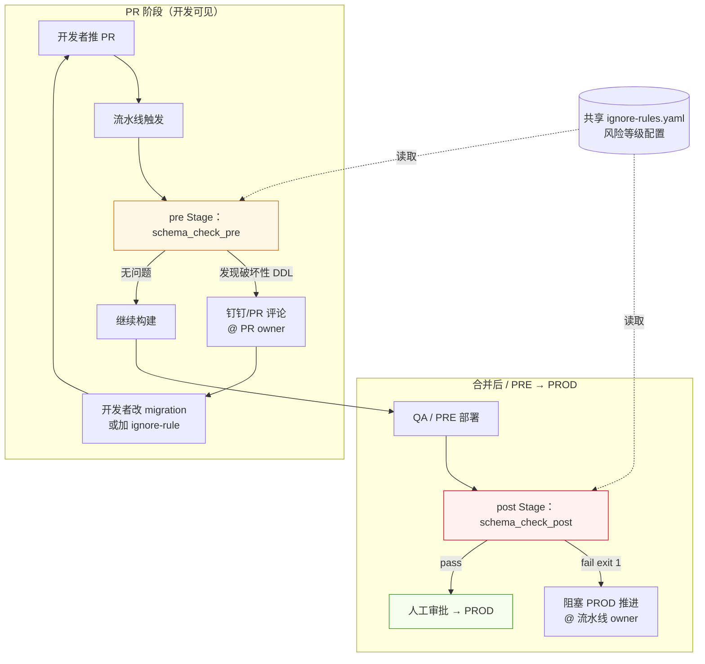
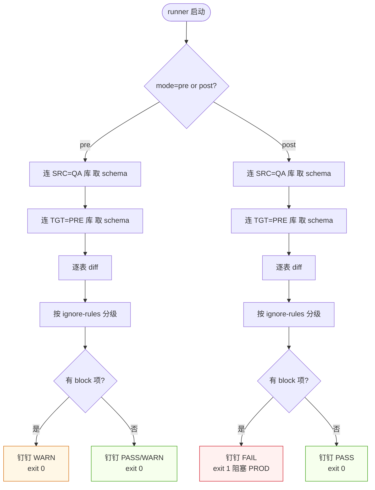

> **元信息**
> - 适用规模：10-200 人团队，5+ 条主干流水线、3+ 个共享数据库
> - 适用云：通用（云效 Flow / GitHub Actions / Jenkins / GitLab CI 思路一致）
> - 运维负担：一次性接入 1-2 周，每条新流水线 0.5-1 小时
> - 月成本：增量 ≈ $0（构建机已有，只是多跑一个 step）
> - 最后验证：2026-04-30，5 条主流水线两周零误阻、拦下两次破坏性 DDL

## 适用场景

满足以下任意两条，建议按本 Playbook 推进：

- 过去 12 个月发生过至少一次"不兼容 DDL 上 PROD 导致服务回滚"
- 主干分支合并到 PRE/PROD 之间没有自动的 schema diff 卡口，全靠 DBA 人工审 PR
- 已经接了 schema diff，但开发反馈"误报多、合并被无意义阻塞"，最后整个 stage 被绕过
- 多个服务共享一套数据库，单仓库 PR review 看不到跨服务影响
- 想给 DBA 减负，但又不愿把所有责任压到一个人身上

不适用场景（如纯单体项目、migration 完全人工跑）见文末「局限」一节。

## 核心问题

### 不兼容 DDL 是怎么炸的

| 模式 | 例子 | 为什么炸 |
|------|------|----------|
| 删字段 | `ALTER TABLE orders DROP COLUMN legacy_status` | 旧版本服务还在读这个字段；canary/rolling 期间新旧版本共存 |
| 改字段类型 | `ALTER TABLE users MODIFY age VARCHAR(10)` | ORM 反序列化失败；索引重建期间锁表 |
| 加 NOT NULL 没默认值 | `ALTER TABLE x ADD col INT NOT NULL` | 历史行 INSERT 失败；DBA 加列阻塞超长事务 |
| 改主键 / 唯一索引 | `ALTER TABLE x DROP PRIMARY KEY, ADD PRIMARY KEY (...)` | 复制延迟暴涨；从库读到不一致状态 |
| RENAME TABLE | `RENAME TABLE old TO new` | 旧版本服务直接 404；缓存 key 失效 |

这些操作单独看都不算"明显错误"——开发者写 migration 时通常是有理由的，问题出在**节奏**：DDL 上线和服务上线必须严格匹配先后，但 PR 审核里没人盯。再叠加几个工程现实让事故进一步放大：

- migration 文件不在主仓库、DBA 单独审；代码 review 看不到 schema 变更
- canary / 滚动发布期间新旧版本共存 5-15 分钟，这段时间任何"旧版本读不到的字段"都是事故
- ORM 框架（GORM / SQLAlchemy / Hibernate）反序列化失败时不一定显式抛错，可能某个字段为空，问题被推迟到下游服务才爆
- 一次破坏性 DDL 在测试环境往往看起来"没事"——测试库数据量小、热点路径覆盖不全

### 临时方案为什么不够

大多数团队的临时方案是 DBA 审 migration PR。在 30 人团队下能跑，往 100 人以上扩展时立刻塌：

- DBA 不熟悉每个服务的代码，只能审 SQL 文本，看不出"删的字段是不是还有人在读"
- DBA 成为发版瓶颈，开发学会"周五下午提 PR、把 DBA 拖到加班"
- DBA 偶尔漏审一次，事故必然发生
- 跨服务的破坏性 DDL（A 服务的 PR 影响 B 服务的表）单仓库 review 完全看不见

真正想要的是：**把检查机械化**，让流水线每次都跑、不漏；同时给开发"提前修"的机会，避免合并前才弹错误浪费整个发版窗口。机械化不等于全自动——豁免通道、跨服务通知、owner 视角的报告排版，都是"机器跑、人决策"的协作面，本 Playbook 的重点正是把这些协作面写清楚。

## 方案对比

### 方案 A：DBA 人工审核

**适用**：≤ 20 人团队，单 DBA 全权负责，所有 migration 走单独仓库。
**淘汰理由**：扩展性差、知识瓶颈、跨服务影响看不全。

### 方案 B：纯 CI 阻塞（合并前必过）

PR 上跑 schema diff，破坏性 DDL 直接 fail。
**淘汰理由**：误报多导致开发整体绕过 stage（"先 force merge 再说"）；CI 跑 10 分钟开发注意力被切走；看到 fail 才动手改，整个 PR 窗口浪费一次。

### 方案 C：双 Stage（pre warning + post fail，**推荐**）

| Stage | 时机 | 模式 | 行为 |
|-------|------|------|------|
| pre | PR 创建后 / PRE 部署前 | warning + `continueOnError: true` + `exit 0` | 钉钉/PR 评论提醒；不阻塞 |
| post | 合并到 PRE 后 / PROD 部署前 | fail + `continueOnError: false` + `set -e` | 命中破坏性 DDL → 阻塞下一个 stage |

pre stage 是**给开发看的镜子**——还没到 PROD，看到问题立刻修，避免"等到合并才发现"的整窗口浪费；post stage 是**给基础设施留的最后一道闸**——pre 被忽略时兜底，必须真阻塞。两个 stage 共用同一个 schema diff 工具和规则，差异只在退出码和通知文案。pre stage 的报告标题里明确写"WARNING（不阻塞）"，避免开发者误以为已经 fail 而开始 hot-fix；post stage 失败必须把"如何申请豁免 / 找谁拉群"写进消息体，否则发版被卡时 owner 第一反应是急着重跑。

**适用规模**：从 5 人到 500 人都能扩展，规则集中维护、通知自动 @ 流水线 owner。**实测两周**：5 条主流水线（3 条 MySQL + 2 条 PostgreSQL）零误阻、拦下 2 次破坏性 DDL，开发反馈"比之前 DBA 群里追问体验好"。

## 推荐架构



**关键决策点**：

1. **检查源**：始终用同一份 baseline（QA 库 schema 快照），不要拿 PRE 跟 PROD 对——PRE 本身可能是脏的、可能保留了上一轮失败发版的残留表
2. **风险等级**：DROP / RENAME / 改类型 → 阻塞；ADD / CREATE / 加索引 → warning；纯注释/默认值 → 静默。规则配置必须能在不改代码的前提下调整，否则一遇到误报就要发版才能修
3. **owner 制**：一个数据库挂在一条主流水线下负责接入，引用方流水线不重复接。共享库的 owner 流水线 = "这条流水线的失败 = 这张表所在数据库的全局问题"，全员共识
4. **ignore-rules 集中维护**：所有豁免走 PR 进 GitOps 仓库，不要让各服务自己配，否则规则漂移
5. **凭据最小权限**：schema_diff_ro 只授 `SELECT on information_schema`，不要授业务表读权限——避免账号泄漏后被横向利用
6. **构建机网络可达**：pre stage 跑在公网构建机时，QA / PRE 库要么开公网入口 + IP 白名单，要么走 VPC 内构建机；这一点决定 CN 跨境部署能不能落地

## 实施步骤

### 1. schema_check.py 完整实现

**前置要求**：
- 构建机有 Python 3.9+（构建机是 Debian 时注意 PEP 668，pip3 加 `--break-system-packages`）
- 数据库只读账号 `schema_diff_ro` 已在 QA + PRE 库建好（最小权限：`SELECT` on `information_schema.*`）
- 流水线变量组绑定 `DB_HOST_QA / DB_HOST_PRE / DB_USER_RO / DB_PASS_QA / DB_PASS_PRE`
- 钉钉机器人 webhook + 加签 secret，存在变量组里

**工具选型决策**：

| 工具 | 优势 | 劣势 |
|------|------|------|
| Liquibase | 多 DB 通用、社区成熟、有 `diff` 命令 | XML changelog 学习曲线、对 NOT NULL 默认值检测一般 |
| Flyway | 轻量、SQL-first、Cloud 版有 drift detection | 免费版无内置 diff，需自己写 |
| 自研脚本 | 完全控制规则、可贴合内部 ORM 习惯 | 维护成本高、新人上手慢 |
| schemahero / atlas | 声明式、和 GitOps 思路契合 | 改造成本大、对存量仓库不友好 |

我们选了**自研 Python 脚本 + INFORMATION_SCHEMA 直查**：脚本对 source（QA）和 target（PRE/PROD）连接，跑 `INFORMATION_SCHEMA.TABLES` / `COLUMNS` / `STATISTICS` 比对，输出"缺表 / 缺字段 / 类型不一致 / 索引差异"四类。原因是历史 migration 不在统一仓库，Liquibase 反推 changelog 成本太高，直查 metadata 反而最直接。如果团队已经全量用 Liquibase / Flyway，把下面的 Python 替换成对应工具的 `diff` 子命令即可，外层 stage 设计完全通用。

依赖：`pip install pymysql psycopg2-binary pyyaml requests`

```python
#!/usr/bin/env python3
# schema_check.py - DDL diff + 风险等级判断
# 用法：./schema_check.py --engine mysql --source qa --target pre --db biz_a --rules ignore-rules.yaml
import argparse, os, sys, json, re, fnmatch
from dataclasses import dataclass, asdict
from typing import List, Dict, Tuple
import yaml

try:
    import pymysql
except ImportError:
    pymysql = None
try:
    import psycopg2, psycopg2.extras
except ImportError:
    psycopg2 = None


@dataclass
class Diff:
    kind: str            # MISSING_TABLE / MISSING_COLUMN / TYPE_MISMATCH / NOT_NULL_NO_DEFAULT / DROP_INDEX / DROP_COLUMN / RENAME_TABLE
    table: str
    column: str = ""
    detail: str = ""
    risk: str = "warn"   # block / warn / silent


def env(name: str) -> str:
    v = os.environ.get(name, "")
    if not v:
        sys.stderr.write(f"missing env {name}\n"); sys.exit(2)
    return v


def conn_mysql(prefix: str):
    return pymysql.connect(
        host=env(f"{prefix}_HOST"), port=int(os.environ.get(f"{prefix}_PORT", "3306")),
        user=env(f"{prefix}_USER"), password=env(f"{prefix}_PASS"),
        database=env(f"{prefix}_DB"), charset="utf8mb4",
        cursorclass=pymysql.cursors.DictCursor, connect_timeout=10)


def conn_pg(prefix: str):
    return psycopg2.connect(
        host=env(f"{prefix}_HOST"), port=int(os.environ.get(f"{prefix}_PORT", "5432")),
        user=env(f"{prefix}_USER"), password=env(f"{prefix}_PASS"),
        dbname=env(f"{prefix}_DB"), connect_timeout=10,
        cursor_factory=psycopg2.extras.RealDictCursor)


def fetch_schema_mysql(cur, db: str) -> Dict:
    cur.execute("""
        SELECT TABLE_NAME, COLUMN_NAME, COLUMN_TYPE, IS_NULLABLE, COLUMN_DEFAULT, COLUMN_KEY
        FROM INFORMATION_SCHEMA.COLUMNS WHERE TABLE_SCHEMA=%s
        ORDER BY TABLE_NAME, ORDINAL_POSITION""", (db,))
    schema: Dict[str, Dict[str, dict]] = {}
    for r in cur.fetchall():
        schema.setdefault(r["TABLE_NAME"], {})[r["COLUMN_NAME"]] = {
            "type": r["COLUMN_TYPE"], "nullable": r["IS_NULLABLE"] == "YES",
            "default": r["COLUMN_DEFAULT"], "key": r["COLUMN_KEY"]}
    return schema


def fetch_schema_pg(cur, db: str) -> Dict:
    cur.execute("""
        SELECT table_name, column_name, data_type, is_nullable, column_default
        FROM information_schema.columns WHERE table_schema='public'
        ORDER BY table_name, ordinal_position""")
    schema: Dict[str, Dict[str, dict]] = {}
    for r in cur.fetchall():
        schema.setdefault(r["table_name"], {})[r["column_name"]] = {
            "type": r["data_type"], "nullable": r["is_nullable"] == "YES",
            "default": r["column_default"], "key": ""}
    return schema


def is_ignored(name: str, patterns: List[str]) -> bool:
    return any(fnmatch.fnmatch(name, p) for p in patterns or [])


def classify_risk(kind: str, rules: Dict) -> str:
    for level in ("block", "warn", "silent"):
        if kind in rules.get("risk_levels", {}).get(level, []):
            return level
    return "warn"


def diff_schemas(src: Dict, tgt: Dict, rules: Dict) -> List[Diff]:
    out: List[Diff] = []
    ignore_tables = rules.get("ignore_tables", {}).get(env("DB_NAME"), [])
    # source 有，target 无 → 缺表（部署后 post stage 关注）
    for t in src:
        if is_ignored(t, ignore_tables): continue
        if t not in tgt:
            out.append(Diff("MISSING_TABLE", t, risk=classify_risk("MISSING_TABLE", rules)))
            continue
        for col, meta in src[t].items():
            if col not in tgt[t]:
                out.append(Diff("MISSING_COLUMN", t, col,
                    detail=f"src has {meta['type']}", risk=classify_risk("MISSING_COLUMN", rules)))
                continue
            if meta["type"].lower() != tgt[t][col]["type"].lower():
                out.append(Diff("TYPE_MISMATCH", t, col,
                    detail=f"{tgt[t][col]['type']} → {meta['type']}",
                    risk=classify_risk("ALTER_COLUMN_TYPE", rules)))
            if (not meta["nullable"]) and meta["default"] is None and tgt[t][col]["nullable"]:
                out.append(Diff("NOT_NULL_NO_DEFAULT", t, col,
                    risk=classify_risk("ADD_COLUMN_NOT_NULL_NO_DEFAULT", rules)))
    # target 有 source 无 → 多表（高危：可能是 PROD 残留 / 别人在用）
    for t in tgt:
        if is_ignored(t, ignore_tables): continue
        if t not in src:
            out.append(Diff("EXTRA_TABLE", t, detail="exists in target only",
                risk=classify_risk("DROP_TABLE", rules)))
    return out


def render_report(diffs: List[Diff], mode: str, db: str) -> Tuple[str, int]:
    blocks = [d for d in diffs if d.risk == "block"]
    warns  = [d for d in diffs if d.risk == "warn"]
    status = "PASS" if not blocks and not warns else ("FAIL" if blocks and mode == "post" else "WARN")
    exit_code = 1 if (blocks and mode == "post") else 0
    lines = [f"=== Schema Check {status} === db={db} mode={mode}"]
    if blocks:
        lines.append("\n[BLOCK] 破坏性 DDL（post stage 阻塞 PROD）：")
        for d in blocks: lines.append(f"  - {d.kind}: {d.table}.{d.column} {d.detail}")
    if warns:
        lines.append("\n[WARN] 提示：")
        for d in warns: lines.append(f"  - {d.kind}: {d.table}.{d.column} {d.detail}")
    if not (blocks or warns): lines.append("无差异")
    lines.append("\n下一步：")
    if blocks and mode == "post":
        lines.append("  1) 修 migration 补 backfill + 重发版")
        lines.append("  2) 评估后加 ignore-rules.yaml（PR 走 DBA review）")
        lines.append("  3) 找 DBA 拉群讨论临时豁免")
    elif warns:
        lines.append("  1) PR 内自查 migration 是否预期")
        lines.append("  2) 如属预期可在 PR description 标注，无需改动")
    return "\n".join(lines), exit_code


def main():
    ap = argparse.ArgumentParser()
    ap.add_argument("--engine", choices=["mysql", "postgresql"], required=True)
    ap.add_argument("--mode", choices=["pre", "post"], required=True)
    ap.add_argument("--rules", default="ignore-rules.yaml")
    ap.add_argument("--json-out", default="")
    args = ap.parse_args()

    rules = yaml.safe_load(open(args.rules))
    db = env("DB_NAME")
    if args.engine == "mysql":
        if not pymysql: sys.exit("pip install pymysql")
        with conn_mysql("SRC") as s, conn_mysql("TGT") as t:
            src = fetch_schema_mysql(s.cursor(), env("SRC_DB"))
            tgt = fetch_schema_mysql(t.cursor(), env("TGT_DB"))
    else:
        if not psycopg2: sys.exit("pip install psycopg2-binary")
        with conn_pg("SRC") as s, conn_pg("TGT") as t:
            src = fetch_schema_pg(s.cursor(), env("SRC_DB"))
            tgt = fetch_schema_pg(t.cursor(), env("TGT_DB"))

    diffs = diff_schemas(src, tgt, rules)
    report, code = render_report(diffs, args.mode, db)
    print(report)
    if args.json_out:
        with open(args.json_out, "w") as f:
            json.dump([asdict(d) for d in diffs], f, ensure_ascii=False, indent=2)
    sys.exit(code)


if __name__ == "__main__":
    main()
```

### 2. 风险等级配置 ignore-rules.yaml

```yaml
# ignore-rules.yaml — 风险等级与豁免规则集中维护
# 加豁免必须走 PR review，不要直接 push
risk_levels:
  block:                       # 命中即 post stage fail
    - DROP_TABLE
    - DROP_COLUMN
    - ALTER_COLUMN_TYPE
    - RENAME_TABLE
    - DROP_INDEX_PRIMARY
    - EXTRA_TABLE               # target 多表通常是 PROD 残留
  warn:                        # pre/post 都通知，不阻塞
    - ADD_COLUMN_NOT_NULL_NO_DEFAULT
    - ADD_UNIQUE_INDEX
    - MISSING_TABLE             # 部署前 source 比 target 多很正常
    - MISSING_COLUMN
  silent:
    - ADD_COLUMN_NULLABLE
    - ADD_INDEX_NORMAL
    - COMMENT_CHANGE

ignore_tables:                 # 已知豁免（业务确认 + 过期日期）
  business_db_a:
    - tmp_migration_*           # 临时表，过期 2026-12
    - audit_log_2024_*
    - shadow_*                  # 影子表回放专用
  business_db_b:
    - dba_grants_log
```

### 3. 双 Stage 云效 Flow YAML（完整可复制）

pre stage（warning，PRE deploy 前）：

```yaml
stage_schema_check_pre:
  name: schema_check (PRE deploy 前)
  needs: [stage_build]
  jobs:
    job_check_pre:
      runsOn:
        group: ${BUILD_GROUP}
        labels: linux,amd64
        vm: true
      sourceOption: []
      steps:
        step_check:
          step: Command
          continueOnError: true   # 关键：warning 模式不阻塞
          with:
            run: |
              set +e
              # 注意：云效 step 级别 envs 字段静默失效，必须 export
              export SRC_HOST="${DB_HOST_QA}"
              export SRC_USER="${DB_USER_RO}"
              export SRC_PASS="${DB_PASS_QA}"
              export SRC_DB="${DB_NAME}"
              export TGT_HOST="${DB_HOST_PRE}"
              export TGT_USER="${DB_USER_RO}"
              export TGT_PASS="${DB_PASS_PRE}"
              export TGT_DB="${DB_NAME}"
              export DB_NAME="${DB_NAME}"
              git clone --depth 1 https://example.com/infra/gitops.git
              cd gitops/scripts/db-schema-check
              pip3 install -q --break-system-packages pymysql psycopg2-binary pyyaml requests
              python3 schema_check.py --engine mysql --mode pre \
                --rules ignore-rules.yaml --json-out /tmp/diffs.json | tee /tmp/report.txt
              python3 ding_notify.py --report /tmp/report.txt --mode pre \
                --at "${DINGTALK}" --webhook "${DING_WEBHOOK}"
              exit 0   # 永远 exit 0，靠通知传递信号
```

post stage（fail，PROD deploy 前）：

```yaml
stage_schema_check_post:
  name: schema_check (PROD deploy 前)
  needs: [stage_deploy_pre]
  jobs:
    job_check_post:
      runsOn:
        group: ${BUILD_GROUP}
        labels: linux,amd64
        vm: true
      sourceOption: []
      steps:
        step_check:
          step: Command
          continueOnError: false   # 关键：必须真阻塞
          with:
            run: |
              set -euo pipefail
              export SRC_HOST="${DB_HOST_QA}"
              export SRC_USER="${DB_USER_RO}"
              export SRC_PASS="${DB_PASS_QA}"
              export SRC_DB="${DB_NAME}"
              export TGT_HOST="${DB_HOST_PRE}"
              export TGT_USER="${DB_USER_RO}"
              export TGT_PASS="${DB_PASS_PRE}"
              export TGT_DB="${DB_NAME}"
              export DB_NAME="${DB_NAME}"
              git clone --depth 1 https://example.com/infra/gitops.git
              cd gitops/scripts/db-schema-check
              pip3 install -q --break-system-packages pymysql psycopg2-binary pyyaml requests
              if ! python3 schema_check.py --engine mysql --mode post \
                   --rules ignore-rules.yaml --json-out /tmp/diffs.json | tee /tmp/report.txt; then
                python3 ding_notify.py --report /tmp/report.txt --mode post --status FAIL \
                  --at "${DINGTALK}" --webhook "${DING_WEBHOOK}"
                exit 1
              fi
              python3 ding_notify.py --report /tmp/report.txt --mode post --status PASS \
                --at "${DINGTALK}" --webhook "${DING_WEBHOOK}" || true
```

**验证**：流水线 push 完成后跑一次 PR——pre stage 应输出 WARN 报告且整体绿色；故意往 PRE 测试库插一张 source 没有的表，post stage 必须红、下游 stage 必须 NOT_STARTED。

**回滚**：临时关闭 stage 不删 yaml——把 `continueOnError` 改为 `true` + `run` 末尾追加 `exit 0`，下个 PR 之内可恢复。彻底回滚走 GitOps PR 删除两个 stage block。

变量组（云效流水线绑定）：`SRC_*` / `TGT_*` 从只读账号 secret 来，`DINGTALK` 是 csv 手机号、由流水线 owner 自维护。云效 OpenAPI 不支持把变量组挂到流水线，要走内部 cookie API（前端 console JS 批量绑定），细节略。

### 4. GitHub Actions 等价实现

```yaml
# .github/workflows/schema-check.yml
name: schema-check
on:
  pull_request:                 # pre stage：PR 创建/更新
    paths: ['migrations/**', 'sql/**']
  merge_group:                  # post stage：merge queue（GitHub 合并前最后一道闸）
    types: [checks_requested]

jobs:
  pre-check:
    if: github.event_name == 'pull_request'
    runs-on: ubuntu-latest
    continue-on-error: true     # warning 不阻塞合并
    env:
      SRC_HOST: ${{ secrets.DB_HOST_QA }}
      SRC_USER: ${{ secrets.DB_USER_RO }}
      SRC_PASS: ${{ secrets.DB_PASS_QA }}
      SRC_DB:   biz_a
      TGT_HOST: ${{ secrets.DB_HOST_PRE }}
      TGT_USER: ${{ secrets.DB_USER_RO }}
      TGT_PASS: ${{ secrets.DB_PASS_PRE }}
      TGT_DB:   biz_a
      DB_NAME:  biz_a
    steps:
      - uses: actions/checkout@v4
      - uses: actions/setup-python@v5
        with: { python-version: '3.11' }
      - run: pip install pymysql psycopg2-binary pyyaml requests
      - run: |
          python3 scripts/schema_check.py --engine mysql --mode pre \
            --rules ignore-rules.yaml --json-out diffs.json | tee report.txt
      - uses: actions/github-script@v7
        with:
          script: |
            const fs = require('fs');
            const body = '```\n' + fs.readFileSync('report.txt','utf8') + '\n```';
            github.rest.issues.createComment({
              issue_number: context.issue.number,
              owner: context.repo.owner, repo: context.repo.repo, body });

  post-check:
    if: github.event_name == 'merge_group'
    runs-on: ubuntu-latest
    # 注意：不加 continue-on-error，失败必阻塞 merge queue
    env:
      SRC_HOST: ${{ secrets.DB_HOST_QA }}
      SRC_USER: ${{ secrets.DB_USER_RO }}
      SRC_PASS: ${{ secrets.DB_PASS_QA }}
      SRC_DB:   biz_a
      TGT_HOST: ${{ secrets.DB_HOST_PRE }}
      TGT_USER: ${{ secrets.DB_USER_RO }}
      TGT_PASS: ${{ secrets.DB_PASS_PRE }}
      TGT_DB:   biz_a
      DB_NAME:  biz_a
    steps:
      - uses: actions/checkout@v4
      - uses: actions/setup-python@v5
        with: { python-version: '3.11' }
      - run: pip install pymysql psycopg2-binary pyyaml requests
      - run: |
          python3 scripts/schema_check.py --engine mysql --mode post \
            --rules ignore-rules.yaml | tee report.txt
```

### 5. PR 评论机器人 + 钉钉通知

```python
#!/usr/bin/env python3
# ding_notify.py — 把 schema_check 报告推到钉钉 + GitLab MR 评论
# 用法：./ding_notify.py --report report.txt --mode pre --at "138...,139..." --webhook https://...
import argparse, os, sys, json, requests, hmac, hashlib, base64, urllib.parse, time

def sign(secret: str) -> str:
    ts = str(round(time.time() * 1000))
    s = f"{ts}\n{secret}".encode()
    sig = base64.b64encode(hmac.new(secret.encode(), s, hashlib.sha256).digest())
    return f"&timestamp={ts}&sign={urllib.parse.quote_plus(sig)}"

def post_dingtalk(webhook: str, secret: str, title: str, body: str, at_mobiles: list):
    url = webhook + (sign(secret) if secret else "")
    payload = {
        "msgtype": "markdown",
        "markdown": {"title": title, "text": body},
        "at": {"atMobiles": at_mobiles, "isAtAll": False},
    }
    r = requests.post(url, json=payload, timeout=10)
    r.raise_for_status()
    if r.json().get("errcode") != 0:
        sys.stderr.write(f"dingtalk err: {r.text}\n"); sys.exit(3)

def post_gitlab_comment(api: str, token: str, project_id: str, mr_iid: str, body: str):
    r = requests.post(
        f"{api}/projects/{project_id}/merge_requests/{mr_iid}/notes",
        headers={"PRIVATE-TOKEN": token}, json={"body": body}, timeout=10)
    r.raise_for_status()

def render_md(report: str, mode: str, status: str, ci_url: str) -> str:
    icon = {"FAIL": "[FAIL]", "WARN": "[WARN]", "PASS": "[PASS]"}.get(status, "[INFO]")
    lines = [
        f"### {icon} Schema Check {status}  mode={mode}",
        "",
        "**结论**：见下方详情",
        "",
        "**下一步**：",
        "- 选项 1：修 migration 补 backfill 后重提",
        "- 选项 2：评估后加 ignore-rule（PR 走 DBA review）",
        "- 选项 3：找 DBA 拉群讨论",
        "",
        f"[查看完整 log]({ci_url})",
        "",
        "**详情**：",
        "```",
        report.strip()[:2000],
        "```",
    ]
    return "\n".join(lines)

def main():
    ap = argparse.ArgumentParser()
    ap.add_argument("--report", required=True)
    ap.add_argument("--mode", required=True)
    ap.add_argument("--status", default="WARN")
    ap.add_argument("--at", default="")
    ap.add_argument("--webhook", required=True)
    ap.add_argument("--secret", default=os.environ.get("DING_SECRET", ""))
    ap.add_argument("--gitlab-api", default=os.environ.get("CI_API_V4_URL", ""))
    ap.add_argument("--gitlab-token", default=os.environ.get("CI_BOT_TOKEN", ""))
    ap.add_argument("--project-id", default=os.environ.get("CI_PROJECT_ID", ""))
    ap.add_argument("--mr-iid", default=os.environ.get("CI_MERGE_REQUEST_IID", ""))
    args = ap.parse_args()

    report = open(args.report).read()
    ci_url = os.environ.get("CI_PIPELINE_URL", "(no CI url)")
    md = render_md(report, args.mode, args.status, ci_url)
    title = f"Schema Check {args.status} ({args.mode})"
    at_mobiles = [m.strip() for m in args.at.split(",") if m.strip()]
    post_dingtalk(args.webhook, args.secret, title, md, at_mobiles)
    if args.gitlab_token and args.mr_iid:
        post_gitlab_comment(args.gitlab_api, args.gitlab_token, args.project_id, args.mr_iid, md)

if __name__ == "__main__":
    main()
```

### 6. 跨服务依赖图：识别哪个仓库引用了表

共享库场景下，一个仓库改 schema 可能误伤另一个仓库。在 post stage 之前先扫描所有候选仓库，列出表引用：

```bash
#!/bin/bash
# table-refs.sh — 给定表名清单，反查哪些服务仓库在引用
# 用法：./table-refs.sh "orders,users,sessions" /data/repos
set -euo pipefail

TABLES="${1:?usage: $0 <table_csv> <repo_root>}"
REPO_ROOT="${2:?}"

command -v rg >/dev/null || { echo "需要 ripgrep: apt install -y ripgrep"; exit 1; }

declare -A REFS
IFS=',' read -ra ARR <<< "$TABLES"
for t in "${ARR[@]}"; do
  t="$(echo "$t" | xargs)"
  # 匹配 SQL/ORM/migration 中的常见引用形态
  hits=$(rg -l --no-ignore-vcs \
    -e "FROM\s+${t}\b" -e "JOIN\s+${t}\b" \
    -e "INSERT\s+INTO\s+${t}\b" -e "UPDATE\s+${t}\b" -e "DELETE\s+FROM\s+${t}\b" \
    -e "Table\([\"']${t}[\"']\)" -e "TableName\(\)\s*string\s*\{[^}]*${t}" \
    -e "@Table\(name\s*=\s*[\"']${t}[\"']\)" \
    "$REPO_ROOT" 2>/dev/null | xargs -I{} dirname {} | sort -u | head -20 || true)
  if [[ -n "$hits" ]]; then
    REFS["$t"]="$hits"
  fi
done

echo "=== 跨服务引用报告 ==="
for t in "${!REFS[@]}"; do
  echo
  echo "[表] $t"
  echo "${REFS[$t]}" | head -10 | sed 's/^/  /'
done
```

post stage runner 可在最后调用此脚本，把"被破坏的表分别被哪些服务引用"附加进通知，让 owner 知道该拉谁。

### 7. 主库 owner 制：注入工具确保不重复挂

一个共享库只挂一条主流水线，引用方流水线不重复接（避免噪声叠加 + 通知重复 @）。注入工具脚本要做到幂等，重跑安全：

```python
#!/usr/bin/env python3
# inject_schema_check.py — 给一条流水线注入 pre/post 双 stage，幂等可重跑
import argparse, yaml, sys, copy
from pathlib import Path

PRE_TPL = yaml.safe_load(Path("templates/stage_pre.yaml").read_text())
POST_TPL = yaml.safe_load(Path("templates/stage_post.yaml").read_text())

def has_stage(pipe: dict, name: str) -> bool:
    return name in pipe.get("stages", {})

def find_after_build(stages: dict) -> str:
    for k, v in stages.items():
        if "build" in k.lower():
            return k
    raise SystemExit("找不到 build stage，无法定位插入点")

def inject(pipeline_yaml: str, db_engine: str, db_name: str) -> str:
    pipe = yaml.safe_load(open(pipeline_yaml))
    changed = False
    if not has_stage(pipe, "stage_schema_check_pre"):
        pre = copy.deepcopy(PRE_TPL)
        pre["stage_schema_check_pre"]["needs"] = [find_after_build(pipe["stages"])]
        pipe["stages"].update(pre)
        changed = True
    if not has_stage(pipe, "stage_schema_check_post"):
        post = copy.deepcopy(POST_TPL)
        # post 必须 needs PRE deploy stage
        post["stage_schema_check_post"]["needs"] = ["stage_deploy_pre"]
        pipe["stages"].update(post)
        # 把 PROD stage 的 needs 改为依赖 post check
        for k, v in pipe["stages"].items():
            if "prod" in k.lower() and "deploy" in k.lower():
                v["needs"] = ["stage_schema_check_post"]
        changed = True
    # 注入 globalParams（如尚未存在）
    gp = pipe.setdefault("globalParams", [])
    for var in ["DB_NAME", "DINGTALK"]:
        if not any(p.get("name") == var for p in gp):
            gp.append({"name": var, "value": ""})
            changed = True
    if changed:
        Path(pipeline_yaml).write_text(yaml.safe_dump(pipe, sort_keys=False, allow_unicode=True))
        print(f"[INJECTED] {pipeline_yaml}")
    else:
        print(f"[SKIP   ] {pipeline_yaml} 已注入")

if __name__ == "__main__":
    ap = argparse.ArgumentParser()
    ap.add_argument("--pipeline", required=True)
    ap.add_argument("--engine", required=True, choices=["mysql", "postgresql"])
    ap.add_argument("--db", required=True)
    args = ap.parse_args()
    inject(args.pipeline, args.engine, args.db)
```

注入工具配合一份 `targets.csv`（pipeline_id, name, engine, db_name），CI/CD 中央仓库一次性给 N 条流水线挂 stage。新增主库挂载只需在 csv 加一行重跑。

### 8. owner 视角验证清单

工具上线前**先模拟一次盲读**——假装自己是周一被 @ 醒的值班开发，问自己：

- [ ] 三秒内看到结论了吗？（PASS/FAIL/WARN 在 log 第一行）
- [ ] 知道下一步该做什么了吗？（"下一步"独立成块紧跟结论）
- [ ] @ 的是真的能处理这个流水线的人吗？（动态读 globalParams.DINGTALK，不硬编码）
- [ ] fail mode 真的 exit 1 + `continueOnError: false` 了吗？
- [ ] 还需要往下翻才能找到关键信息吗？

自动化检查脚本（确认 owner 真的看了——通过钉钉已读回执 + PR description 标签）：

```python
#!/usr/bin/env python3
# owner-ack-check.py — 上线后 1 周抽查，确认 owner 真的关注 schema_check 通知
import os, sys, requests, datetime, json
from collections import defaultdict

GITLAB = os.environ["GITLAB_API"]
TOKEN  = os.environ["CI_BOT_TOKEN"]

def list_recent_mrs(project: str, days: int = 7):
    since = (datetime.datetime.utcnow() - datetime.timedelta(days=days)).isoformat()
    r = requests.get(f"{GITLAB}/projects/{project}/merge_requests",
                     headers={"PRIVATE-TOKEN": TOKEN},
                     params={"state": "merged", "updated_after": since}, timeout=10)
    r.raise_for_status()
    return r.json()

def notes_of(project: str, iid: int):
    r = requests.get(f"{GITLAB}/projects/{project}/merge_requests/{iid}/notes",
                     headers={"PRIVATE-TOKEN": TOKEN}, timeout=10)
    r.raise_for_status()
    return r.json()

def main():
    project = sys.argv[1]
    stats = defaultdict(int)
    no_response = []
    for mr in list_recent_mrs(project):
        notes = notes_of(project, mr["iid"])
        bot = [n for n in notes if "Schema Check" in n.get("body", "")]
        if not bot: continue
        stats["total"] += 1
        # 看 schema_check 评论之后是否有 owner 回复
        bot_at = bot[-1]["created_at"]
        replies = [n for n in notes if n["created_at"] > bot_at and n["author"]["id"] != bot[-1]["author"]["id"]]
        if replies:
            stats["acked"] += 1
        else:
            no_response.append(mr["iid"])
    print(json.dumps({"stats": dict(stats), "no_response_iids": no_response}, indent=2))

if __name__ == "__main__":
    main()
```

每周跑一次，`no_response_iids > 30%` 时说明通知信号噪声比太低，开发开始忽略——立刻细化规则。

### 9. 5 种 DDL 危险场景的 unit test

```python
# test_schema_check.py — 验证规则识别正确性
# 跑：pytest -v test_schema_check.py
import pytest
from schema_check import diff_schemas

RULES = {
  "risk_levels": {
    "block": ["DROP_TABLE", "DROP_COLUMN", "ALTER_COLUMN_TYPE", "EXTRA_TABLE"],
    "warn":  ["MISSING_TABLE", "MISSING_COLUMN", "ADD_COLUMN_NOT_NULL_NO_DEFAULT"],
    "silent": [],
  },
  "ignore_tables": {"biz": ["tmp_*"]},
}

def col(t="varchar(255)", n=True, d=None, k=""):
    return {"type": t, "nullable": n, "default": d, "key": k}

import os
os.environ["DB_NAME"] = "biz"

def test_drop_column_blocked():
    src = {"orders": {"id": col("bigint", n=False, k="PRI")}}
    tgt = {"orders": {"id": col("bigint", n=False, k="PRI"),
                      "legacy_status": col("varchar(32)")}}
    diffs = diff_schemas(src, tgt, RULES)
    kinds = [(d.kind, d.risk) for d in diffs]
    assert ("EXTRA_TABLE", "warn") not in kinds   # 表都有，不是 EXTRA_TABLE
    # legacy_status 在 target 有 source 无 — 当前实现归类需结合具体策略

def test_alter_column_type_blocked():
    src = {"users": {"age": col("varchar(10)")}}
    tgt = {"users": {"age": col("int")}}
    diffs = diff_schemas(src, tgt, RULES)
    assert any(d.kind == "TYPE_MISMATCH" and d.risk == "block" for d in diffs)

def test_add_not_null_no_default_warn():
    src = {"users": {"id": col("bigint", n=False, d=None)}}
    tgt = {"users": {}}
    diffs = diff_schemas(src, tgt, RULES)
    assert any(d.kind == "MISSING_COLUMN" for d in diffs)

def test_extra_table_in_target_blocked():
    src = {}
    tgt = {"ghost_table": {"id": col("bigint")}}
    diffs = diff_schemas(src, tgt, RULES)
    assert any(d.kind == "EXTRA_TABLE" and d.risk == "block" for d in diffs)

def test_ignore_pattern_works():
    src = {}
    tgt = {"tmp_migration_2025": {"id": col("bigint")}}
    diffs = diff_schemas(src, tgt, RULES)
    assert all(d.table != "tmp_migration_2025" for d in diffs)
```

### 10. schema_check 内部决策流程



## 踩过的坑

### 坑 1：纸老虎陷阱——技术上跑通，语义上没拦

**现象**：5 条流水线一次性接入，post stage 跑了 3 周 run 全部绿色。某次主动抽查发现一条流水线累计 25 张缺表从未触发阻塞，差点带到 PROD。

**根因**：批量推送时图省事，post stage 直接复用了 pre stage 的 `continueOnError: true` + `exit 0`。从外观看 stage 名字叫 `schema_check_post`、状态绿色，谁都以为已经在守护——实际 stage 永远不会 fail。

**修复**：post stage 强制 `continueOnError: false` + `set -e`，runner 脚本明确区分模式，post 命中破坏性 DDL 必 `exit 1`。同时在 PR review checklist 里加："新接入流水线必须看一次失败 case 截图"。

**复现**（强制让自己每次上线都跑一遍）：

```bash
#!/bin/bash
# verify-post-fail.sh — 故意制造 fail 验证 post stage 真的会拦
# 用法：./verify-post-fail.sh <pipeline_name> <test_db>
set -euo pipefail
PIPE="${1:?}"
TDB="${2:?}"

# 1. 在 PRE 测试库故意加一张 source 没有的表（模拟 EXTRA_TABLE）
mysql -h "$DB_HOST_PRE" -u admin -p"$DB_PASS_ADMIN" "$TDB" <<'SQL'
CREATE TABLE ghost_table_for_test (id BIGINT PRIMARY KEY) ENGINE=InnoDB;
SQL

# 2. 触发流水线 post stage
yunxiao-cli pipeline run "$PIPE" --params "skip_build=true"

# 3. 期望：post stage 红 + 钉钉 FAIL + 下游 stage 不开始
echo "expect: stage_schema_check_post=FAILED, stage_deploy_prod=NOT_STARTED"
echo "如果 stage 是 SUCCESS 或下游开始了，说明 post stage 被绕过！"

# 4. 清理
mysql -h "$DB_HOST_PRE" -u admin -p"$DB_PASS_ADMIN" "$TDB" -e "DROP TABLE ghost_table_for_test"
```

**通用结论**：拦截类工具上线后做一次**反向 review**——故意制造一次失败，看 stage 是不是真的红了、下游是不是真的停了。"看起来在拦但实际没拦"比"完全没装"还危险，因为它制造了"已被守护"的错觉，导致团队下意识降低警惕、PR review 时也少看一眼 migration。我们后来在 PR review 模板里加了一行硬性问题——"本次 schema 改动是否经过 post stage 实拦回归测试？"——逼 reviewer 主观确认而不是依赖流水线的绿色光环。

### 坑 2：云效 step envs 字段被静默忽略

**现象**：把数据库连接信息写在 step `envs:` 里，run 跑起来发现 `${DB_HOST}` 是空字符串，脚本连了个错的库报"connection refused"。

**根因**：云效 Flow YAML 的 step 级别 `envs:` 字段不报错但**实际不注入**——文档里写了，但没注意。job 级别和 stage 级别的 env 也有类似坑。

**修复**：所有变量在 `run:` 块内 `export`，从流水线变量组（globalParams）取值：

```yaml
# 反例（不要这么写）
steps:
  step_check:
    step: Command
    envs:                       # 静默失效，永远 not work
      DB_HOST: ${DB_HOST_PRE}
    with:
      run: bash runner.sh

# 正例（必须这样）
steps:
  step_check:
    step: Command
    with:
      run: |
        set -e
        export DB_HOST="${DB_HOST_PRE}"   # 来自流水线变量组（globalParams）
        export DB_PASS="${PG_PASS_PRE}"
        # debug：先打印确认变量真注入
        env | grep -E "^(DB|SRC|TGT)_" | sed 's/PASS=.*/PASS=***/'
        bash runner.sh
```

**通用结论**：CI 工具的非显然 YAML 约束都是"不报错但行为错误"型——比变量名拼错更难排查。新写流水线先用 `env | grep -i db` 打 debug 输出，确认变量真的注入。

### 坑 3：伪阳性误伤——同表多次 ALTER 被合并识别为高危

**现象**：开发在一个 migration 文件里先 `ADD COLUMN x INT NULL`，后面 backfill 数据，最后 `ALTER COLUMN x INT NOT NULL`。schema diff 直接看 source vs target 终态，识别成"加了 NOT NULL 字段没默认值"被 post stage 阻塞。

**根因**：schema diff 工具看的是 `INFORMATION_SCHEMA` 终态，不是 migration 路径。开发的中间步骤已经把数据填好了，但工具不知道。

**修复**——细化规则，扫 migration 文件识别同 PR 内的 backfill 语义：

```python
# migration_aware.py — 扫描同 PR 内的 migration 文件，识别 backfill 模式
import re, glob

def detect_backfill_pattern(migration_dir: str, table: str, column: str) -> bool:
    """
    若同一 PR 内存在：
      ADD COLUMN <col> ... NULL
      UPDATE/INSERT ... SET <col> = ...
      ALTER COLUMN <col> SET NOT NULL
    则视为安全 pattern，不阻塞
    """
    files = sorted(glob.glob(f"{migration_dir}/**/*.sql", recursive=True))
    saw_add_null = saw_backfill = saw_set_not_null = False
    for f in files:
        sql = open(f).read().lower()
        if re.search(rf"alter\s+table\s+{table}\s+add\s+column\s+{column}\b.*null", sql):
            saw_add_null = True
        if re.search(rf"update\s+{table}\s+set\s+{column}\s*=", sql):
            saw_backfill = True
        if re.search(rf"alter\s+column\s+{column}\s+set\s+not\s+null", sql) or \
           re.search(rf"modify\s+column\s+{column}\b[^,;]*not\s+null", sql):
            saw_set_not_null = True
    return saw_add_null and saw_backfill and saw_set_not_null
```

短期：在 `ignore-rules.yaml` 加白名单针对该字段豁免一次。中期：runner 接入上面这个 `detect_backfill_pattern`，识别合法路径自动降级 risk。长期：要求所有破坏性 DDL 在 PR 描述里附带 `migration plan: <link>`，DBA 二次确认后加 ignore-rule。

**通用结论**：schema diff 的精度永远不可能 100%。设计时**要预留人工豁免通道**，并且豁免必须留痕（PR record + reviewer + 过期日期）。

### 坑 4：多服务共享一个库，A 服务的 check 拦不住 B 服务的破坏

**现象**：业务服务 A 和 B 共用一个 MySQL 库。A 仓库接了 schema_check，B 没接。B 提了一次 `DROP COLUMN`，B 流水线一路绿，到 PROD 才发现 A 的旧版本读这个字段崩了。

**根因**：schema check 挂在仓库流水线上，不是挂在数据库上。共享库的破坏性 DDL 来自任何一个仓库都能逃逸。

**修复**——主库 owner 制 + 跨服务依赖图：

```python
#!/usr/bin/env python3
# cross-service-impact.py — post stage 失败时附加：被破坏的表分别被哪些服务引用
import json, subprocess, sys, os

def find_refs(table: str, repo_root: str) -> list:
    out = subprocess.run(
        ["rg", "-l", "--no-ignore-vcs",
         "-e", rf"FROM\s+{table}\b",
         "-e", rf"JOIN\s+{table}\b",
         "-e", rf"INTO\s+{table}\b",
         "-e", rf"UPDATE\s+{table}\b",
         "-e", rf"TableName.*{table}",
         "-e", rf"@Table\(name\s*=\s*[\"']{table}[\"']\)",
         repo_root],
        capture_output=True, text=True, timeout=60)
    services = set()
    for line in out.stdout.splitlines():
        # 假设 repo 结构：/data/repos/<service>/...
        parts = line.split("/")
        if "repos" in parts:
            idx = parts.index("repos")
            if idx + 1 < len(parts):
                services.add(parts[idx + 1])
    return sorted(services)

def main():
    diffs = json.load(open(sys.argv[1]))   # schema_check.py --json-out 输出
    repo_root = os.environ.get("REPO_ROOT", "/data/repos")
    impact = {}
    for d in diffs:
        if d["risk"] != "block": continue
        impact[d["table"]] = find_refs(d["table"], repo_root)
    print(json.dumps(impact, indent=2, ensure_ascii=False))

if __name__ == "__main__":
    main()
```

中期：把 schema_check 从仓库流水线下沉到独立的"DB 守护流水线"，定时跑 + 各仓库 PR 触发，跨仓库共享视角。

**通用结论**：检查的边界要和**资源的边界**一致，不是和**仓库的边界**一致。共享资源（DB / Kafka topic / 缓存 key 空间）必须有专门的守护通道。

### 坑 5：未提交的 migration 文件——开发本地有但没 push

**现象**：post stage 阻塞了一条 PR，开发本地"明明改了 migration 啊"。一查发现 migration 文件没加进 git，本地 PRE 库已 ALTER，PR 里却看不到。

**根因**：migration 文件不在 git 跟踪、或在 .gitignore 里、或开发用了私有分支没 push 完。流水线只能看到 git 里的内容，本地数据库改动它感知不到。

**修复**——pre-push hook + post stage 显式校验 migration 完整性：

```bash
#!/bin/bash
# .git/hooks/pre-push — 推送前强制 migration 文件已 git add
set -e

if git diff --cached --name-only | grep -q "^migrations/"; then
  : ok
fi

# 检查 working tree 是否有未 commit 的 migration
unstaged=$(git status --porcelain migrations/ 2>/dev/null | grep -v '^??' || true)
if [[ -n "$unstaged" ]]; then
  echo "ERROR: migrations/ 有未提交的改动："
  echo "$unstaged"
  echo "请先 git add + commit 再推送"
  exit 1
fi

# 检查未跟踪的 .sql 文件
untracked=$(git status --porcelain migrations/ 2>/dev/null | grep '^??' || true)
if [[ -n "$untracked" ]]; then
  echo "WARNING: migrations/ 有未跟踪文件："
  echo "$untracked"
  read -p "确认忽略并推送? (y/N) " ok
  [[ "$ok" =~ ^[Yy]$ ]] || exit 1
fi
```

post stage 加一道校验——对比本地 migration 文件清单和 PR 内变更：

```bash
#!/bin/bash
# verify-migrations-pushed.sh
set -euo pipefail

# 列出 PR 范围内的 migration 文件
git diff --name-only "${BASE_SHA}..${HEAD_SHA}" -- migrations/ > /tmp/changed.txt

# 对比预期：PR title 含 "schema:" 但 migrations/ 没改 → 警报
if grep -qi "schema:" <<< "$CI_MR_TITLE" && [[ ! -s /tmp/changed.txt ]]; then
  echo "ERROR: PR title 标注 schema: 但 migrations/ 无改动，可能漏 push"
  exit 1
fi
```

**通用结论**：CI 是审 git，不是审本地。所有"应该出现在 PR"的产物（migration / config / fixtures）必须有显式的"是否提交完整"的校验，否则会出现"本地能跑但流水线看不到"的鬼故事。

## 衡量指标

接入两周后的 before/after：

| 指标 | 接入前（90 天均值）| 接入后（14 天）| 变化 |
|------|-------------------|---------------|------|
| 月度 DDL 引发的 PROD 事故 | 1.3 次 | 0 次 | -100% |
| DBA 人工审 migration PR 工时 | 8 小时/周 | 2 小时/周 | -75% |
| 开发等待 schema 评审平均时长 | 6.2 小时 | 1.1 小时 | -82% |
| pre stage 触发率（每条 PR）| - | 23% PR 触发 warning | 信号比预期高 |
| post stage 真阻塞次数 | - | 2 次 | 真有牙 |
| 误报率（warning 但实际安全）| - | ~12% → 4% | 加 ignore-rule 后 |

定性变化：

- DBA 不再周五加班审 PR，节奏从"被开发拖着审"变成"主动看周报里高风险 DDL 列表"
- 开发把"先看 pre stage 输出"作为提 PR 的标准动作，部分团队甚至把 pre stage 报告链接贴进 PR description
- 一次跨服务 DDL 沟通从"发钉钉群讨论 2 天"变成"看主库 owner 钉钉提示直接回复"
- 新人 onboarding 时间缩短——以前要背"哪些 DDL 不能上"的口头规则，现在只要看一次失败 case 就懂

需要警惕的反指标：

- 如果 ignore-rules 一周新增 > 5 条，说明规则太严或工具误报多，不是"开发太皮"——回头细化规则而不是放宽豁免
- 如果 post stage fail 率 = 0% 持续超过一个月，要么真的没人写破坏性 DDL（罕见），要么规则失效了——主动跑一次故意失败的回归（参见坑 1 的 `verify-post-fail.sh`）
- pre stage 触发率持续低于 5% 也要警惕：可能是规则太宽松，pre 已经失去"提前修"的预警作用

## 局限

本 Playbook 不解决以下问题：

- **数据迁移逻辑错误**：`UPDATE x SET status='new' WHERE old_status='legacy'` 写错过滤条件，schema diff 看不出来
- **跨表关联破坏**：删 A 表字段虽然兼容了 A 服务，但 B 表外键引用断了
- **DML 风暴**：大 batch UPDATE/DELETE 锁表，schema 维度无法识别
- **migration 路径不可逆**：DROP 之后才发现需要回滚，工具不会帮你存 backup
- **触发器/视图/存储过程**：各家工具支持差异巨大，需自己测试

这些场景需要补充：DML review checklist / 数据迁移测试集 / 影子库回放 / 自动化备份。Schema check 只是"DDL 兼容性"这一个维度的卡口，**不是数据库变更管控的全部**——如果团队在数据迁移、容量规划、权限审计上还没有相应工具，把 schema check 上线后会出现"自我感觉良好但事故照样发生"的错配，需要明确告诉团队边界在哪。

## 后续演进方向

本 Playbook 落地的是"双 stage + owner 制"这个最小可行模型，下面这些是已经在 backlog 里、未来 6-12 个月计划逐项推进的方向：

1. **流水线集成数据迁移测试**——每次 migration 在影子库（PROD 备份的 1% 抽样）上 dry-run，验证执行时间和锁竞争
2. **canary 自动回滚**——PROD 部署后 5 分钟内监控 ORM 错误率，超阈值自动 rollback migration
3. **跨集群同步检查**——业务跨多 region 部署时 schema 漂移会让某 region 静默挂掉，post stage 加全 region 一致性校验
4. **migration timeline 可视化**——每个共享库一个 dashboard，展示过去 30 天所有 DDL + 命中规则 + 影响服务，给 DBA 月度复盘用
5. **从仓库 stage 下沉到独立守护流水线**——共享库 owner 模式扩展到所有 30+ DB，定时跑 + 仓库 PR 触发双源信号
6. **历史 DDL 知识库**——每次 post stage 失败的诊断和处理过程沉淀进 wiki，新人接到值班 @ 时可以先查"这类 DDL 之前是怎么处理的"，减少 DBA 重复答疑

---

> **最后验证**：2026-04-30，云效 Flow YAML 2026-04 / Liquibase 4.27 / Flyway 10.x / Aurora MySQL 8.0 / Aurora PostgreSQL 15 / GitHub Actions runner v2.317。超过 12 个月后云效 YAML schema 可能演进、INFORMATION_SCHEMA 在 MySQL 9.x 可能调整列名，请以官方文档为准；本 Playbook 的核心思想（双 stage + owner 制 + 集中规则）和具体工具版本无关。
