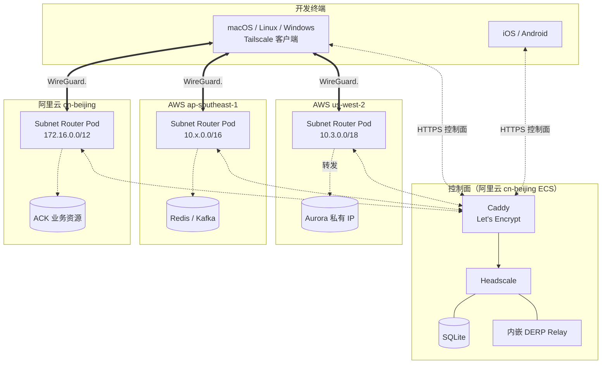
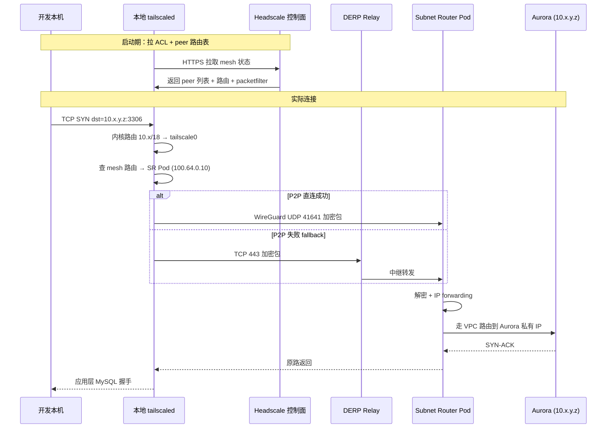

> **元信息**
> - 适用规模：10-100 人团队
> - 适用云：AWS / 阿里云 / 腾讯云 / 任意能跑 K8s 的环境
> - 运维负担：单人可维护
> - 月成本：约 ¥150（一台 2c4g ECS）
> - 最后验证：2026-04-30，Headscale 0.26.1 + Tailscale 1.84.0 + Caddy 2.8

## 适用场景

下面的条件满足任意三条以上时，本方案适用：

- 多云环境（AWS + 阿里云 / 阿里云 + 腾讯云）
- 计划关闭数据库、Redis、中间件等内部资源的公网入口
- 团队尚未引入统一 SSO（钉钉/飞书 OAuth 不算 OIDC）
- 单人或两人运维，无法承担 HA Teleport 这类重方案的维护成本
- 存在临时给外部合作方开通访问的需求

不适用场景见文末「局限」一节。

## 核心问题

数据库公网入口收紧后，需要解决两类真实需求：

1. **跨 Region 服务调用**：例如部署在 ap-southeast-1 的服务连接 us-west-2 的主库，原本通过公网 hostname，公网关闭后中断。
2. **开发者调试访问**：DBA 用本地客户端排查慢查询，开发跑本地脚本对 prod 写测试数据，运维手工核对配置等。

第一类可通过 VPC Peering / PrivateLink 解决，是一次性工作。第二类是持续性需求，每次开放新内网资源（DB、Redis、Grafana、Nacos）都会重新出现。

常见的临时方案是 AWS SSM Port Forwarding，封装为脚本下发：

```bash
~/db-tunnel.sh prod
mysql -h 127.0.0.1 -P 13306 -u <user> -p
```

该方案在小规模场景可用，但有几个本质缺陷：

- 每个新人接入需多步配置（AWS Profile、Session Manager Plugin、IAM Group），出错点多
- 每个新内网资源需重做接入方案，运维支持成本随资源数线性增长
- 仅覆盖 AWS，阿里云资源需另行设计
- 无统一审计，谁访问了什么资源分散在 CloudTrail、IAM、各个跳板机日志里
- 端口转发模型对开发体验有约束，本地工具需要适配 `127.0.0.1` 这种非真实地址，部分 ORM 框架和 GUI 客户端在端口转发场景下行为异常

需要的是一层统一的访问控制层：一次客户端配置覆盖所有内网资源，新增资源不需要重新接入，权限基于身份而非网络位置。理想形态是开发者在本地直接 `mysql -h <内网IP>`，背后由 mesh 透明地完成路由 + 加密 + 鉴权，运维侧只需在 ACL 文件加一行规则就能开通新资源访问，权限收回也只是把这行删掉。

## 方案对比

调研了六个候选方案，列出每个方案的适用条件和淘汰理由：

### AWS Client VPN

AWS 原生 SSL/IPSec VPN，IAM 集成完整，开发体验好。

- **适用**：纯 AWS 单云环境
- **淘汰理由**：仅覆盖 AWS，阿里云完全不通；30 人按连接小时计费月成本约 ¥12k

### Cloudflare Zero Trust

边缘网络 + 应用层零信任，50 人内免费，控制面零运维。

- **适用**：用户主要分布在海外，跨云资源也以海外为主
- **淘汰理由**：国内访问 Cloudflare 边缘延迟波动较大（不同运营商抖动几十到几百毫秒），DB 流量过 CF 边缘有可观测的损耗

### Teleport（自建社区版）

特性最完整：DB / SSH / K8s / Web 应用统一入口，session 录像、JIT 审批、原生 OIDC。

- **适用**：3 人以上运维团队，已有 HA 服务运维经验，需要审计和合规
- **淘汰理由**：HA 集群至少 3 节点 + 证书自动轮换 + 跨云网络打通；社区版无官方支持，单人运维负担过重

### StrongDM

商业 PAM，零运维 SaaS。

- **适用**：有合规需求（SOC2 / ISO27001）且预算充足的团队
- **淘汰理由**：$70+/人/月，30 人约 $25k/年，对中小团队成本不合理

### Pomerium（自建）

身份感知反向代理，主打 Web 应用。

- **淘汰理由**：对 DB / TCP 的支持不如专门的 mesh 方案；本场景 70% 流量是 DB 和 TCP，不匹配

### Headscale + Tailscale（最终选定）

Tailscale 官方控制面的开源实现，自托管。

| 维度 | 表现 |
|------|------|
| 部署复杂度 | Go 单二进制 + SQLite，单进程 100m CPU / 128Mi 内存 |
| 跨云能力 | 每个 K8s 集群部署一个 Subnet Router Pod 即可，不依赖云间网络打通 |
| SSO 依赖 | 不强依赖。可用 PreAuthKey 启动，后续接 OIDC |
| 月成本增量 | 一台 2c4g ECS，约 ¥150 |
| 协议支持 | TCP / UDP / SSH / DB / K8s 全协议（基于 WireGuard 的 L3 mesh） |
| ACL 灵活度 | JSON 文件，git 管理，SIGHUP 重载，秒级生效 |

唯一明显短板：不带 Web UI（第三方有 Headplane，可选）。对单人运维场景，命令行 + git 管理 ACL 反而比 UI 更可控。

## 推荐架构

整体设计遵循 Tailscale 的**控制面 / 数据面分离**模型：

| 维度 | 控制面 | 数据面 |
|------|--------|--------|
| 组件 | Headscale | WireGuard |
| 职责 | 节点注册、ACL 推送、密钥协调 | 实际承载加密数据流量 |
| 流量特征 | HTTPS API，小流量低频 | UDP/TCP，大流量高频 |
| 故障影响 | 控制面挂掉时，新连接建不起来；已建立的 mesh 连接不受影响 | — |



### 关键决策点

**控制面位置：阿里云 cn-beijing**

国内开发者占多数，控制面流量（登录、ACL 推送、心跳）在国内体验更好。数据面访问 AWS 资源走跨境是物理延迟，与控制面位置无关。

**Subnet Router 部署在 K8s Pod 而非节点上**

Pod 重启不影响节点路由表，业务零影响。资源占用极小（50m CPU / 64Mi mem），可与业务 Pod 共节点。

**只 advertise VPC CIDR，不广播 K8s ClusterIP / Pod CIDR**

VPC CIDR 公司层面规划保证不重叠；K8s ClusterIP CIDR 多集群默认值常重复（如 EKS 默认 172.20.0.0/16），多集群同时广播会导致路由不确定。详见后文踩坑 1。

**用户与基础设施分两个 user 管理**

真人 user 挂个人设备，`infra@` 服务账号挂 Subnet Router Pod。审计清晰，离职回收时不会误伤基础设施。如果把 Subnet Router 也挂在某个真人账号下，该人离职时一旦 ACL 误把整个 user 移除，所有 mesh 节点会瞬间失联，影响面跨越整个生产环境。分两个 user 是最简单也最有效的隔离手段。

**ACL 文件用 git 管理，而非 Headplane 的 database 模式**

ACL 是权限边界的真相来源，所有变更必须可追溯、可 review、可回滚。git 的 commit 历史天然就是审计日志，PR 流程自然支持双人复核。Headplane 的 UI 编辑功能在 100 节点以下场景没有明显收益，反而把 ACL 状态隐藏到了数据库里——一旦库损坏或误删，重建成本远超 git 模式。

### 数据流：一次完整请求

开发本机执行 `mysql -h 10.x.y.z -u user -p` 时的链路：



全链路 WireGuard 加密，DERP 中继服务器无法解密内容。

## 实施步骤

总览：从零开始一台空 ECS 到全员可用大约 6 小时。第 1-3 步（基础设施 + 控制面）90 分钟，第 4-5 步（ACL + 客户端）60 分钟，第 6 步（每个 K8s 集群部署 Subnet Router）每个 30 分钟，第 7-8 步（自动化脚本 + 文档）90 分钟。

下文每一步都按「前置 / 执行 / 验证 / 回滚」四件套展开，目标是让任何一个完全没碰过 Headscale 的同学能照着 1:1 部署成功。所有命令、yaml、脚本都是完整可执行的版本，不要拼接片段。

### 第 1 步：开通控制面 ECS（阿里云 cn-beijing）

**前置要求**

- 阿里云子账号有 `AliyunECSFullAccess` + `AliyunVPCFullAccess` + `AliyunDNSFullAccess`
- 本地装好 `aliyun-cli`（`brew install aliyun-cli` 或 `curl -O https://aliyuncli.alicdn.com/aliyun-cli-linux-latest-amd64.tgz`）
- 已规划好控制面所在 VPC（建议用 ArgoCD/运维专用 VPC，与业务 VPC 隔离）
- 已选好域名（本文示例 `headscale.example.cn`）

**执行**

```bash
#!/bin/bash
# 01-create-headscale-ecs.sh
set -euo pipefail

REGION="cn-beijing"
VSWITCH_ID="vsw-xxxxxxxxxxxxxxxxx"      # ArgoCD VPC 的 cn-beijing-i 交换机
VPC_ID="vpc-xxxxxxxxxxxxxxxxx"
INSTANCE_TYPE="ecs.e-c1m2.large"        # 2c4g 经济型
IMAGE_ID="ubuntu_22_04_x64_20G_alibase_20240228.vhd"
KEY_NAME="ops-keypair"                  # 提前在 ECS 控制台导入的公钥
INSTANCE_NAME="headscale-prod-cn"

# 1.1 创建独立安全组
SG_ID=$(aliyun ecs CreateSecurityGroup \
  --RegionId "$REGION" \
  --VpcId "$VPC_ID" \
  --SecurityGroupName "headscale-prod-sg" \
  --Description "Headscale control plane + DERP" \
  --query 'SecurityGroupId' --output text)
echo "Created SG: $SG_ID"

# 1.2 加入站规则
# SSH 仅运维办公出口 IP（按实际填）
aliyun ecs AuthorizeSecurityGroup \
  --RegionId "$REGION" --SecurityGroupId "$SG_ID" \
  --IpProtocol tcp --PortRange "22/22" \
  --SourceCidrIp "203.0.113.0/24" \
  --Description "Ops office SSH"

# 80/443 开公网（Caddy 跑 ACME + Headscale HTTPS）
for port in "80/80" "443/443"; do
  aliyun ecs AuthorizeSecurityGroup \
    --RegionId "$REGION" --SecurityGroupId "$SG_ID" \
    --IpProtocol tcp --PortRange "$port" \
    --SourceCidrIp "0.0.0.0/0" \
    --Description "HTTP/HTTPS"
done

# 3478 UDP（DERP STUN）
aliyun ecs AuthorizeSecurityGroup \
  --RegionId "$REGION" --SecurityGroupId "$SG_ID" \
  --IpProtocol udp --PortRange "3478/3478" \
  --SourceCidrIp "0.0.0.0/0" \
  --Description "DERP STUN"

# 41641 UDP（WireGuard 直连 fallback）
aliyun ecs AuthorizeSecurityGroup \
  --RegionId "$REGION" --SecurityGroupId "$SG_ID" \
  --IpProtocol udp --PortRange "41641/41641" \
  --SourceCidrIp "0.0.0.0/0" \
  --Description "WireGuard direct"

# 1.3 创建 ECS（按量付费，1Mbps 按使用量计）
INSTANCE_ID=$(aliyun ecs RunInstances \
  --RegionId "$REGION" \
  --ImageId "$IMAGE_ID" \
  --InstanceType "$INSTANCE_TYPE" \
  --SecurityGroupId "$SG_ID" \
  --VSwitchId "$VSWITCH_ID" \
  --InstanceName "$INSTANCE_NAME" \
  --HostName "$INSTANCE_NAME" \
  --InstanceChargeType "PostPaid" \
  --InternetChargeType "PayByTraffic" \
  --InternetMaxBandwidthOut 1 \
  --SystemDisk.Category "cloud_essd" \
  --SystemDisk.Size 40 \
  --DataDisk.1.Category "cloud_essd" \
  --DataDisk.1.Size 20 \
  --DataDisk.1.DeleteWithInstance true \
  --KeyPairName "$KEY_NAME" \
  --Amount 1 \
  --query 'InstanceIdSets.InstanceIdSet[0]' --output text)
echo "Created instance: $INSTANCE_ID"

# 1.4 等待 Running，分配公网 IP
sleep 30
aliyun ecs AllocatePublicIpAddress \
  --InstanceId "$INSTANCE_ID"

PUBLIC_IP=$(aliyun ecs DescribeInstances \
  --RegionId "$REGION" --InstanceIds "[\"$INSTANCE_ID\"]" \
  --query 'Instances.Instance[0].PublicIpAddress.IpAddress[0]' --output text)
echo "Public IP: $PUBLIC_IP"
echo "$INSTANCE_ID $PUBLIC_IP" > /tmp/headscale-ecs-info.txt
```

**验证**

```bash
# 查实例状态
aliyun ecs DescribeInstanceStatus --RegionId cn-beijing --InstanceId.1 "$INSTANCE_ID"
# 期望：Status=Running

# 测试 SSH
ssh -i ~/.ssh/ops-keypair root@$PUBLIC_IP "uname -a"
# 期望：Linux headscale-prod-cn 5.15.0-... Ubuntu
```

**回滚**

```bash
# 删除实例（包含数据盘）
aliyun ecs DeleteInstance --InstanceId "$INSTANCE_ID" --Force true
# 删除 SG
aliyun ecs DeleteSecurityGroup --RegionId cn-beijing --SecurityGroupId "$SG_ID"
```

### 第 2 步：DNS A 记录 + 数据盘格式化

**前置要求**

- 域名托管在阿里云云解析（其他 DNS 服务商 API 命令不同）
- 第 1 步获得的公网 IP

**执行**

```bash
#!/bin/bash
# 02-setup-dns-and-disk.sh
set -euo pipefail

DOMAIN="example.cn"
RR="headscale"
PUBLIC_IP=$(awk '{print $2}' /tmp/headscale-ecs-info.txt)

# 2.1 加 A 记录
aliyun alidns AddDomainRecord \
  --DomainName "$DOMAIN" \
  --RR "$RR" \
  --Type A \
  --Value "$PUBLIC_IP" \
  --TTL 600

# 2.2 验证 DNS（等 60 秒生效）
sleep 60
dig +short "$RR.$DOMAIN" @223.5.5.5
# 期望：输出 PUBLIC_IP

# 2.3 SSH 到 ECS 上格式化数据盘
ssh root@$PUBLIC_IP <<'EOF'
set -euo pipefail
DEVICE=$(lsblk -ndo NAME,TYPE,MOUNTPOINT | awk '$2=="disk" && $3=="" {print "/dev/"$1; exit}')
mkfs.ext4 -L data "$DEVICE"
mkdir -p /data
echo "LABEL=data /data ext4 defaults 0 2" >> /etc/fstab
mount /data
df -hT /data
EOF
```

**验证**

```bash
# DNS 全国生效检查
for ns in 223.5.5.5 8.8.8.8 114.114.114.114; do
  echo -n "$ns: "; dig +short headscale.example.cn @$ns
done
# 期望三个 NS 都返回同一个 IP

# 数据盘挂载
ssh root@$PUBLIC_IP "df -hT /data"
# 期望：ext4，挂载在 /data
```

**回滚**

```bash
# 删 DNS 记录
RECORD_ID=$(aliyun alidns DescribeDomainRecords --DomainName example.cn \
  --RRKeyWord headscale --query 'DomainRecords.Record[0].RecordId' --output text)
aliyun alidns DeleteDomainRecord --RecordId "$RECORD_ID"
```

### 第 3 步：部署 Headscale + Caddy（含 TLS 自动签发）

**前置要求**

- ECS 已装好 Docker 24+ 和 Docker Compose v2（`curl -fsSL https://get.docker.com | sh`）
- DNS A 记录已生效（80/443 端口可达）
- `/data` 已挂载

**执行**

在 ECS 上创建工作目录：

```bash
ssh root@$PUBLIC_IP
mkdir -p /data/headscale/{config,data,certs,logs}
cd /data/headscale
```

`/data/headscale/config/Caddyfile`（完整内容）：

```caddy
{
    email ops@example.cn
    # 启用 ACME HTTP-01 验证（80 端口必须开放给 Let's Encrypt 验证服务器）
    acme_ca https://acme-v02.api.letsencrypt.org/directory
}

headscale.example.cn {
    encode gzip
    log {
        output file /var/log/caddy/access.log {
            roll_size 100mb
            roll_keep 7
        }
        format json
    }

    # gRPC 长连接需要的 buffer 调大
    reverse_proxy headscale:8080 {
        flush_interval -1
        transport http {
            read_timeout 300s
            write_timeout 300s
        }
    }
}

# DERP STUN 不走 Caddy（UDP 3478 直接由 Headscale 接），这里只占位
```

`/data/headscale/config/config.yaml`（完整 Headscale 配置）：

```yaml
# Headscale 0.26.x 完整配置
server_url: https://headscale.example.cn
listen_addr: 0.0.0.0:8080
metrics_listen_addr: 127.0.0.1:9090

grpc_listen_addr: 0.0.0.0:50443
grpc_allow_insecure: false

# 节点身份私钥（首次启动自动生成）
private_key_path: /var/lib/headscale/private.key
noise:
  private_key_path: /var/lib/headscale/noise_private.key

# IPv4 池：100.64.0.0/10 是 Tailscale 标准段
prefixes:
  v4: 100.64.0.0/10
  v6: fd7a:115c:a1e0::/48
  allocation: sequential

# 嵌入式 DERP（生产建议至少再起一个独立 DERP，本配置先单点起步）
derp:
  server:
    enabled: true
    region_id: 999
    region_code: "self-hosted-cn"
    region_name: "Headscale Self-hosted CN-Beijing"
    stun_listen_addr: "0.0.0.0:3478"
  urls: []
  paths: []
  auto_update_enabled: false  # 禁用从 Tailscale 官方拉默认 DERP 列表
  update_frequency: 24h

# 节点过期：未活跃节点 180 天后自动 expire
node_update_check_interval: 10s
ephemeral_node_inactivity_timeout: 30m

# 数据库：起步 SQLite（< 100 节点都够），后续上 Litestream 备份
database:
  type: sqlite3
  sqlite:
    path: /var/lib/headscale/db.sqlite

# 日志
log:
  format: text
  level: info

# 策略文件模式（git 管理 ACL）
policy:
  mode: file
  path: /etc/headscale/acl.json

# DNS：让 mesh 内部 hostname 自动解析（暂不开 split-DNS，后续可加）
dns:
  override_local_dns: false
  nameservers:
    global:
      - 1.1.1.1
      - 8.8.8.8
  magic_dns: true
  base_domain: mesh.example.cn

unix_socket: /var/run/headscale/headscale.sock
unix_socket_permission: "0770"

# 关闭非必要的 metric：保留 prometheus
disable_check_updates: true
```

`/data/headscale/docker-compose.yml`（完整 compose）：

```yaml
services:
  headscale:
    image: headscale/headscale:0.26.1
    container_name: headscale
    restart: unless-stopped
    command: serve
    user: "1000:1000"
    volumes:
      - ./config:/etc/headscale
      - ./data:/var/lib/headscale
      - ./logs:/var/log/headscale
      - /var/run/headscale:/var/run/headscale
    ports:
      # 控制面 HTTP（仅 127.0.0.1，外网走 Caddy）
      - "127.0.0.1:8080:8080"
      # DERP STUN（UDP 3478）
      - "0.0.0.0:3478:3478/udp"
      # gRPC（远程 CLI 用，先不开公网）
      - "127.0.0.1:50443:50443"
      # Metrics（Prometheus 拉）
      - "127.0.0.1:9090:9090"
    healthcheck:
      test: ["CMD", "wget", "-q", "--spider", "http://localhost:8080/health"]
      interval: 30s
      timeout: 5s
      retries: 3
      start_period: 30s
    deploy:
      resources:
        limits:
          cpus: "1.0"
          memory: 512M
        reservations:
          cpus: "0.1"
          memory: 128M
    networks:
      - headscale-net
    logging:
      driver: json-file
      options:
        max-size: "100m"
        max-file: "5"

  caddy:
    image: caddy:2.8-alpine
    container_name: caddy
    restart: unless-stopped
    ports:
      - "0.0.0.0:80:80"
      - "0.0.0.0:443:443"
    volumes:
      - ./config/Caddyfile:/etc/caddy/Caddyfile:ro
      - ./certs:/data
      - caddy-config:/config
      - ./logs:/var/log/caddy
    depends_on:
      headscale:
        condition: service_healthy
    healthcheck:
      test: ["CMD", "wget", "-q", "--spider", "http://localhost:80"]
      interval: 30s
      timeout: 5s
      retries: 3
    deploy:
      resources:
        limits:
          cpus: "0.5"
          memory: 256M
    networks:
      - headscale-net

volumes:
  caddy-config:

networks:
  headscale-net:
    driver: bridge
    ipam:
      config:
        # 显式指定网段，避免与 mesh advertise 段冲突（坑 1）
        - subnet: 10.250.0.0/24
```

启动并初始化空 ACL：

```bash
cd /data/headscale
# 起步用一个最严格的 ACL（拒绝所有），后面再开
cat > config/acl.json <<'EOF'
{
  "groups": {},
  "tagOwners": {},
  "acls": []
}
EOF

# 设置目录所有者（Headscale 容器以 UID 1000 跑）
chown -R 1000:1000 data logs
chmod 0700 data

# 启动
docker compose up -d
docker compose logs -f --tail=50 headscale
# 等到日志出现 "listening on [::]:8080"，按 Ctrl-C 退出
```

**验证**

```bash
# 3.1 容器健康
docker compose ps
# 期望两个 service 都是 Up (healthy)

# 3.2 Caddy 自动取证书
curl -sI https://headscale.example.cn/health
# 期望：HTTP/2 200，证书由 Let's Encrypt R10/R11 签发
openssl s_client -connect headscale.example.cn:443 -servername headscale.example.cn </dev/null 2>/dev/null | openssl x509 -noout -issuer -dates
# 期望：issuer = C=US, O=Let's Encrypt, CN=R10
#       validity 90 天

# 3.3 Headscale API 通
docker compose exec headscale headscale version
# 期望：v0.26.1

# 3.4 证书续期监控（写入 cron）
cat > /etc/cron.d/cert-monitor <<'EOF'
0 6 * * * root /usr/bin/openssl s_client -connect headscale.example.cn:443 -servername headscale.example.cn </dev/null 2>/dev/null | /usr/bin/openssl x509 -noout -checkend 1209600 || /usr/bin/curl -X POST -H 'Content-Type: application/json' -d '{"msgtype":"text","text":{"content":"[ALERT] headscale.example.cn 证书 14 天内到期"}}' '<DingTalk Webhook>'
EOF
```

**回滚**

```bash
docker compose down -v
rm -rf /data/headscale
```

### 第 4 步：建用户 + 起步 ACL

**前置要求**

- Headscale 已 healthy
- 决定好用户分组方案（本文用 dev / dba / ops 三组）

**执行**

```bash
cd /data/headscale

# 4.1 建 infra 服务账号（挂 Subnet Router）
docker compose exec headscale headscale users create infra@example.cn

# 4.2 建运维账号（首批 1-2 个种子）
docker compose exec headscale headscale users create alice@example.cn
docker compose exec headscale headscale users create bob@example.cn

# 4.3 列出验证
docker compose exec headscale headscale users list
# 期望输出三行：infra@example.cn / alice@example.cn / bob@example.cn
```

**示例输出**：

```
ID | Name              | Username          | Email | Created
1  | infra@example.cn  | infra@example.cn  |       | 2026-04-30 07:32:01
2  | alice@example.cn  | alice@example.cn  |       | 2026-04-30 07:32:18
3  | bob@example.cn    | bob@example.cn    |       | 2026-04-30 07:32:25
```

**ACL 设计原则**

写 ACL 之前先想清楚三件事：分组维度（按职能 / 按项目 / 按环境）、资源标识方式（hostname / tag / CIDR）、默认策略（默认拒绝 / 默认允许）。本文按"职能分组 + tag 标识资源 + 默认拒绝"组合，理由：

- 职能分组随团队结构变化少，新人入职明确归到 dev / dba / ops 之一即可
- tag 比 CIDR 灵活，未来扩 VPC 不用改一堆 ACL 规则，只改 tag owner 即可
- 默认拒绝是零信任的核心，每条 accept 规则必须明确写出 src + dst + port

下面给三个示例场景，按团队规模递进：单人 ops 起步用场景 A，团队稳定后切到场景 B，资源数量超过 50 个之后切到场景 C：

`config/acl.json` — **场景 A：仅 ops 全开**（最简，单运维起步）

```json
{
  "groups": {
    "group:ops": ["alice@example.cn", "bob@example.cn"]
  },
  "tagOwners": {
    "tag:subnet-router": ["group:ops"]
  },
  "hosts": {
    "aurora-prod": "10.x.y.z",
    "redis-prod":  "10.x.y.21"
  },
  "acls": [
    {
      "action": "accept",
      "src": ["group:ops"],
      "dst": ["*:*"]
    },
    {
      "action": "accept",
      "src": ["tag:subnet-router"],
      "dst": ["tag:subnet-router:*"]
    }
  ]
}
```

`config/acl.json` — **场景 B：dev / dba / ops 三组分权**

```json
{
  "groups": {
    "group:ops": ["alice@example.cn"],
    "group:dba": ["bob@example.cn", "carol@example.cn"],
    "group:dev": ["dave@example.cn", "eve@example.cn"]
  },
  "tagOwners": {
    "tag:subnet-router": ["group:ops"],
    "tag:db-prod":       ["group:ops"],
    "tag:db-qa":         ["group:ops"],
    "tag:k8s-prod":      ["group:ops"]
  },
  "hosts": {
    "aurora-prod":  "10.x.y.z",
    "aurora-qa":    "10.2.5.98",
    "redis-prod":   "10.x.y.21",
    "grafana-prod": "10.x.y.50"
  },
  "acls": [
    {
      "action": "accept",
      "src": ["group:ops"],
      "dst": ["*:*"]
    },
    {
      "action": "accept",
      "src": ["group:dba"],
      "dst": [
        "aurora-prod:3306,5432",
        "aurora-qa:3306,5432",
        "redis-prod:6379"
      ]
    },
    {
      "action": "accept",
      "src": ["group:dev"],
      "dst": [
        "aurora-qa:3306,5432",
        "grafana-prod:443"
      ]
    },
    {
      "action": "accept",
      "src": ["tag:subnet-router"],
      "dst": ["tag:subnet-router:*"]
    }
  ]
}
```

`config/acl.json` — **场景 C：完全 tag 化（资源数量大）**

```json
{
  "groups": {
    "group:ops": ["alice@example.cn"],
    "group:dba": ["bob@example.cn"],
    "group:dev": ["dave@example.cn"]
  },
  "tagOwners": {
    "tag:env-prod":      ["group:ops"],
    "tag:env-qa":        ["group:ops"],
    "tag:role-db":       ["group:ops"],
    "tag:role-cache":    ["group:ops"],
    "tag:subnet-router": ["group:ops"]
  },
  "acls": [
    { "action": "accept", "src": ["group:ops"], "dst": ["*:*"] },
    { "action": "accept", "src": ["group:dba"],
      "dst": ["tag:role-db:3306,5432", "tag:env-qa:*"] },
    { "action": "accept", "src": ["group:dev"],
      "dst": ["tag:env-qa:*"] },
    { "action": "accept", "src": ["tag:subnet-router"],
      "dst": ["tag:env-prod:*", "tag:env-qa:*"] }
  ],
  "ssh": [
    { "action": "accept",
      "src": ["group:ops"],
      "dst": ["tag:env-prod"],
      "users": ["root", "ubuntu"] }
  ]
}
```

加载新 ACL：

```bash
docker compose kill -s SIGHUP headscale
docker compose logs --tail=20 headscale
# 期望日志：reloaded policy from /etc/headscale/acl.json
```

**验证**

```bash
docker compose exec headscale headscale policy check --policy-file /etc/headscale/acl.json
# 期望：policy is valid

docker compose exec headscale headscale users list
docker compose exec headscale headscale nodes list
```

**回滚**

```bash
git -C /data/headscale checkout config/acl.json
docker compose kill -s SIGHUP headscale
```

### 第 5 步：客户端接入（每个平台一段脚本）

**macOS**：

```bash
#!/bin/bash
# join-mesh-mac.sh
set -euo pipefail
LOGIN_SERVER="https://headscale.example.cn"
AUTHKEY="${1:-}"
[ -z "$AUTHKEY" ] && { echo "Usage: $0 <preauthkey>"; exit 1; }

# 1. 安装（cask 装的是带 GUI 的版本，但走命令行登录）
brew install --cask tailscale

# 2. 启动后台 daemon（首次安装会弹权限框，要求允许 VPN profile）
open -a "Tailscale" || true
sleep 5

# 3. 命令行登录到自建控制面（不要点 GUI 的 Sign in）
sudo /Applications/Tailscale.app/Contents/MacOS/Tailscale up \
  --login-server="$LOGIN_SERVER" \
  --auth-key="$AUTHKEY" \
  --accept-routes \
  --accept-dns=false

# 4. 验证
/Applications/Tailscale.app/Contents/MacOS/Tailscale status
```

**Linux（Ubuntu / Debian）**：

```bash
#!/bin/bash
# join-mesh-linux.sh
set -euo pipefail
LOGIN_SERVER="https://headscale.example.cn"
AUTHKEY="${1:-}"
[ -z "$AUTHKEY" ] && { echo "Usage: sudo $0 <preauthkey>"; exit 1; }
[ "$EUID" -ne 0 ] && { echo "Run as root"; exit 1; }

# 1. 安装
curl -fsSL https://tailscale.com/install.sh | sh

# 2. 开 IP forwarding（如果该机器要做 Subnet Router；纯客户端跳过）
# echo 'net.ipv4.ip_forward=1' >> /etc/sysctl.d/99-tailscale.conf
# sysctl -p /etc/sysctl.d/99-tailscale.conf

# 3. 启动 systemd 服务
systemctl enable --now tailscaled

# 4. 登录
tailscale up \
  --login-server="$LOGIN_SERVER" \
  --auth-key="$AUTHKEY" \
  --accept-routes \
  --accept-dns=false

# 5. 验证
tailscale status
tailscale ip -4
```

**Windows**：用 PowerShell 装客户端 + 注册自建控制面（GUI 没暴露 login-server，必须走命令行）

```powershell
# join-mesh-windows.ps1
$ErrorActionPreference = "Stop"
$loginServer = "https://headscale.example.cn"
$authKey = $args[0]
if (-not $authKey) { Write-Error "Usage: .\join-mesh-windows.ps1 <preauthkey>"; exit 1 }

# 1. 下载并静默安装（最新稳定版）
$installer = "$env:TEMP\tailscale-setup.exe"
Invoke-WebRequest -Uri "https://pkgs.tailscale.com/stable/tailscale-setup-latest.exe" -OutFile $installer
Start-Process -FilePath $installer -ArgumentList "/S" -Wait

# 2. 注册到自建控制面（注意：必须用命令行 up，GUI 默认连官方）
$tailscale = "C:\Program Files\Tailscale\tailscale.exe"
& $tailscale up --login-server=$loginServer --auth-key=$authKey --accept-routes --accept-dns=false --unattended

# 3. 验证
& $tailscale status
& $tailscale ip -4
```

**iOS / Android**：移动端没有命令行，用 GUI 改 login server：

1. 从 App Store / Google Play 安装 Tailscale 官方 App
2. 打开 App，**不要点中间的 Sign in**
3. iOS：点右上角三个点（…）→ **Use login server** → 填 `https://headscale.example.cn` → 回到首页点 Sign in
4. Android：右上角菜单 → **Accounts** → **Use alternate server** → 同上
5. 浏览器跳出登录页面，会显示 `headscale register --user <id> --key nodekey:xxx`，把整条命令发给运维
6. 运维在控制面执行：`docker compose exec headscale headscale nodes register --user <id> --key nodekey:xxx`

**示例输出**（macOS `tailscale status`）：

```
100.64.0.5      alices-macbook       alice@example.cn  macOS    -
100.64.0.10     subnet-router-prod   infra@example.cn  linux    active; relay "self-hosted-cn", tx 12480 rx 8932
100.64.0.11     subnet-router-pre    infra@example.cn  linux    active; relay "self-hosted-cn", tx 1024 rx 512
100.64.0.12     subnet-router-cn     infra@example.cn  linux    idle, tx 0 rx 0
```

**生成 PreAuthKey**（一次性，24 小时）：

```bash
docker compose exec headscale headscale preauthkeys create \
  --user alice@example.cn \
  --expiration 24h
# 输出形如：abc123def456...（40 字符 hex）
```

**验证**

```bash
# 5.1 mesh 状态
tailscale status
# 期望：本机有 100.64.x.x IP；至少一个 peer 是 Subnet Router

# 5.2 ICMP（macOS 注意：utun 接口对 ICMP 有特殊处理，ping 不通不代表网络不通）
tailscale ping 10.x.y.z
# 期望：pong via DERP/direct，<= 200ms

# 5.3 实际 TCP（更可靠的判定）
nc -zv 10.x.y.z 3306
# 期望：Connection to 10.x.y.z port 3306 [tcp/*] succeeded!
```

**回滚**

```bash
# Mac
sudo /Applications/Tailscale.app/Contents/MacOS/Tailscale logout
sudo /Applications/Tailscale.app/Contents/MacOS/Tailscale down
# Linux
sudo tailscale down
sudo tailscale logout
sudo apt remove --purge tailscale
# 控制面侧也清掉
docker compose exec headscale headscale nodes expire --identifier <node-id>
```

### 第 6 步：在 K8s 集群部署 Subnet Router

**前置要求**

- 目标 K8s 集群有 `kubectl` context（建议命名清晰，如 `us-prod` / `ap-pre` / `cn-prod`）
- 已规划该集群要 advertise 的 VPC CIDR
- 在 Headscale 控制面用 `infra@example.cn` 用户生成一个 reusable PreAuthKey：

```bash
docker compose exec headscale headscale preauthkeys create \
  --user infra@example.cn --reusable --expiration 8760h \
  --tags tag:subnet-router
# 期望输出 40 字符 hex key，记下后填入下方 Secret
```

**执行**

`subnet-router.yaml`（完整 manifest，覆盖 Namespace / SA / RBAC / Secret / Deployment / CronJob）：

```yaml
---
apiVersion: v1
kind: Namespace
metadata:
  name: tailscale-system
  labels:
    pod-security.kubernetes.io/enforce: privileged
---
apiVersion: v1
kind: ServiceAccount
metadata:
  name: tailscale
  namespace: tailscale-system
---
apiVersion: rbac.authorization.k8s.io/v1
kind: Role
metadata:
  name: tailscale
  namespace: tailscale-system
rules:
  - apiGroups: [""]
    resources: ["secrets"]
    verbs: ["create", "get", "list", "watch", "update", "patch", "delete"]
---
apiVersion: rbac.authorization.k8s.io/v1
kind: RoleBinding
metadata:
  name: tailscale
  namespace: tailscale-system
subjects:
  - kind: ServiceAccount
    name: tailscale
    namespace: tailscale-system
roleRef:
  kind: Role
  name: tailscale
  apiGroup: rbac.authorization.k8s.io
---
# Subnet Router 用 infra@ 的 reusable PreAuthKey 自注册
# 生产建议从 ExternalSecrets / Sealed Secrets 拉，避免明文进 git
apiVersion: v1
kind: Secret
metadata:
  name: tailscale-auth
  namespace: tailscale-system
type: Opaque
stringData:
  TS_AUTHKEY: "PASTE_YOUR_REUSABLE_PREAUTHKEY_HERE"
---
# 状态 secret（Tailscale 自己写）
apiVersion: v1
kind: Secret
metadata:
  name: tailscale-state
  namespace: tailscale-system
type: Opaque
---
apiVersion: apps/v1
kind: Deployment
metadata:
  name: subnet-router
  namespace: tailscale-system
  labels:
    app: subnet-router
    cluster: us-prod  # 改成实际集群名
spec:
  # 起步 1 副本（Tailscale 同 CIDR 多副本主备切换 30-60s 抖动可见）
  # 真有跨 AZ 故障担忧时再调到 2，并接受切换抖动
  replicas: 1
  strategy:
    type: Recreate  # Subnet Router 不能 RollingUpdate（单 mesh 节点身份）
  selector:
    matchLabels:
      app: subnet-router
  template:
    metadata:
      labels:
        app: subnet-router
      annotations:
        # 让每日 CronJob 改这个 annotation 触发滚动重启
        kubectl.kubernetes.io/restartedAt: "2026-04-30T03:00:00+08:00"
    spec:
      serviceAccountName: tailscale
      # 调度到内核 6.2+ 节点开 rx-udp-gro-forwarding（吞吐显著提升）
      nodeSelector:
        kubernetes.io/os: linux
      tolerations:
        - key: "node.kubernetes.io/not-ready"
          operator: "Exists"
          effect: "NoExecute"
          tolerationSeconds: 60
      containers:
        - name: tailscale
          image: tailscale/tailscale:v1.84.0
          imagePullPolicy: IfNotPresent
          env:
            - name: TS_KUBE_SECRET
              value: "tailscale-state"
            - name: TS_USERSPACE
              value: "false"            # 用内核 WireGuard，性能比 userspace 高 5x
            - name: TS_HOSTNAME
              value: "subnet-router-us-prod"   # 改成 cluster + region
            - name: TS_ROUTES
              value: "10.3.0.0/18"      # 仅 advertise VPC CIDR，不要广播 ClusterIP
            - name: TS_EXTRA_ARGS
              value: "--login-server=https://headscale.example.cn --accept-routes --accept-dns=false --advertise-tags=tag:subnet-router"
            - name: TS_AUTHKEY
              valueFrom:
                secretKeyRef:
                  name: tailscale-auth
                  key: TS_AUTHKEY
            # 性能调优（内核 6.2+ 才生效）
            - name: TS_DEBUG_FIREWALL_MODE
              value: "auto"
          securityContext:
            capabilities:
              add:
                - NET_ADMIN
                - NET_RAW
          resources:
            requests:
              cpu: 50m
              memory: 64Mi
            limits:
              cpu: 500m
              memory: 256Mi
          livenessProbe:
            exec:
              command:
                - tailscale
                - status
                - --self=false
            initialDelaySeconds: 60
            periodSeconds: 30
            failureThreshold: 3
          readinessProbe:
            exec:
              command:
                - tailscale
                - status
                - --json
            initialDelaySeconds: 15
            periodSeconds: 10
---
# 每日凌晨 3 点滚动重启（深夜低峰，强制刷新所有 peer 状态，规避坑 2）
apiVersion: batch/v1
kind: CronJob
metadata:
  name: subnet-router-daily-restart
  namespace: tailscale-system
spec:
  schedule: "0 19 * * *"   # UTC 19:00 = 北京 03:00
  concurrencyPolicy: Forbid
  successfulJobsHistoryLimit: 3
  failedJobsHistoryLimit: 3
  jobTemplate:
    spec:
      backoffLimit: 2
      template:
        spec:
          serviceAccountName: subnet-router-restart
          restartPolicy: OnFailure
          containers:
            - name: kubectl
              image: bitnami/kubectl:1.29
              command:
                - /bin/sh
                - -c
                - |
                  kubectl -n tailscale-system rollout restart deployment/subnet-router
                  kubectl -n tailscale-system rollout status deployment/subnet-router --timeout=180s
---
apiVersion: v1
kind: ServiceAccount
metadata:
  name: subnet-router-restart
  namespace: tailscale-system
---
apiVersion: rbac.authorization.k8s.io/v1
kind: Role
metadata:
  name: subnet-router-restart
  namespace: tailscale-system
rules:
  - apiGroups: ["apps"]
    resources: ["deployments"]
    verbs: ["get", "list", "patch"]
  - apiGroups: ["apps"]
    resources: ["deployments/status"]
    verbs: ["get"]
---
apiVersion: rbac.authorization.k8s.io/v1
kind: RoleBinding
metadata:
  name: subnet-router-restart
  namespace: tailscale-system
subjects:
  - kind: ServiceAccount
    name: subnet-router-restart
    namespace: tailscale-system
roleRef:
  kind: Role
  name: subnet-router-restart
  apiGroup: rbac.authorization.k8s.io
```

应用 + 批准路由：

```bash
# 6.1 应用 manifest
kubectl --context us-prod apply -f subnet-router.yaml

# 6.2 等 Pod 起来
kubectl --context us-prod -n tailscale-system rollout status deploy/subnet-router --timeout=120s

# 6.3 看日志确认注册成功
kubectl --context us-prod -n tailscale-system logs -l app=subnet-router --tail=50
# 期望出现：Success. ... Tailscale started

# 6.4 在 Headscale 控制面手动批准路由（首次必须批准）
ssh root@headscale-ecs
cd /data/headscale
docker compose exec headscale headscale nodes list
# 找到对应 hostname 的 ID
docker compose exec headscale headscale nodes approve-routes \
  --identifier <node-id> --routes 10.3.0.0/18
```

**HA 副本扩展决策**

| 场景 | 副本数 | 理由 |
|------|--------|------|
| 起步 / < 50 节点 / 流量小 | 1 | Tailscale subnet failover 切换 30-60s 抖动；单副本简单可控 |
| 频繁跨 AZ 故障 / 节点驱逐多 | 2 | 同 CIDR 多副本时 Tailscale 自动选主，主挂等 30s 切备 |
| > 100 节点 / 关键链路 | 2 + nodeAntiAffinity | 强制跨 AZ 部署，能容忍单 AZ 故障 |

扩到 2 副本时**必须**加 antiAffinity，不然两个副本调到同一节点没意义：

```yaml
spec:
  replicas: 2
  template:
    spec:
      affinity:
        podAntiAffinity:
          requiredDuringSchedulingIgnoredDuringExecution:
            - labelSelector:
                matchLabels:
                  app: subnet-router
              topologyKey: topology.kubernetes.io/zone
```

**验证**

```bash
# Pod ready
kubectl --context us-prod get pod -n tailscale-system
# 期望：1/1 Running

# 路由广播
docker compose exec headscale headscale nodes list-routes
# 期望：subnet-router-us-prod | 10.3.0.0/18 | true | true (advertised + enabled)

# 端到端：从 Mac 客户端测
nc -zv 10.x.y.z 3306
# 期望：succeeded
mysql -h 10.x.y.z -u readonly -p -e "SELECT 1"
# 期望：返回 1
```

**回滚**

```bash
kubectl --context us-prod delete -f subnet-router.yaml
# 控制面 expire 节点（不要 delete，见坑 2）
docker compose exec headscale headscale nodes expire --identifier <node-id>
```

### 第 7 步：运维自动化脚本

把高频操作（开通用户 / 回收用户 / 列表）封装成幂等脚本，放在 `/data/headscale/bin/`，git 管理。脚本必须满足三条要求：能直接 `chmod +x` 跑、出错有清晰报错、可重复执行不会破坏现有状态。

`bin/mesh-grant.sh`：

```bash
#!/bin/bash
# mesh-grant.sh - 给同事开通 mesh 访问权限
# 用法：./mesh-grant.sh <email> <group:dev|dba|ops>
# 前置：在 Headscale 控制面 ECS 上跑，cwd 为 /data/headscale

set -euo pipefail

EMAIL="${1:-}"
GROUP="${2:-}"

# 输入校验
if [[ -z "$EMAIL" || -z "$GROUP" ]]; then
  cat <<EOF >&2
Usage: $0 <email> <group:dev|dba|ops>
Example: $0 carol@example.cn dba
EOF
  exit 1
fi

if [[ ! "$EMAIL" =~ ^[a-zA-Z0-9._-]+@[a-zA-Z0-9.-]+\.[a-zA-Z]+$ ]]; then
  echo "ERROR: invalid email format: $EMAIL" >&2
  exit 1
fi

if [[ ! "$GROUP" =~ ^(dev|dba|ops)$ ]]; then
  echo "ERROR: group must be one of: dev / dba / ops" >&2
  exit 1
fi

# 依赖检查
for cmd in jq docker; do
  command -v "$cmd" >/dev/null || { echo "ERROR: missing $cmd"; exit 1; }
done

ACL_FILE="config/acl.json"
[[ -f "$ACL_FILE" ]] || { echo "ERROR: $ACL_FILE not found"; exit 1; }

# 1. 创建用户（已存在则跳过）
EXISTING=$(docker compose exec -T headscale headscale users list --output json \
  | jq -r --arg e "$EMAIL" '.[] | select(.name==$e) | .id' || true)

if [[ -n "$EXISTING" ]]; then
  echo "[INFO] user $EMAIL already exists (id=$EXISTING)"
  USERID="$EXISTING"
else
  echo "[INFO] creating user $EMAIL"
  docker compose exec -T headscale headscale users create "$EMAIL"
  USERID=$(docker compose exec -T headscale headscale users list --output json \
    | jq -r --arg e "$EMAIL" '.[] | select(.name==$e) | .id')
fi

# 2. 加入 ACL group（幂等）
TMP=$(mktemp)
trap 'rm -f $TMP' EXIT

jq --arg e "$EMAIL" --arg g "group:$GROUP" '
  .groups[$g] = ((.groups[$g] // []) + [$e] | unique)
' "$ACL_FILE" > "$TMP"

# 校验生成的 ACL 合法
docker compose exec -T headscale headscale policy check --policy-file - < "$TMP" \
  || { echo "ERROR: ACL validation failed"; exit 1; }

# 备份 + 替换
cp "$ACL_FILE" "${ACL_FILE}.bak.$(date +%Y%m%d-%H%M%S)"
mv "$TMP" "$ACL_FILE"
trap - EXIT

# 3. 重载
docker compose kill -s SIGHUP headscale
sleep 2

# 4. 生成 90 天一次性 PreAuthKey
KEY=$(docker compose exec -T headscale headscale preauthkeys create \
  --user "$EMAIL" --expiration 2160h --output json \
  | jq -r '.key')

if [[ -z "$KEY" || "$KEY" == "null" ]]; then
  echo "ERROR: preauthkey generation failed"
  exit 1
fi

# 5. 输出标准话术（直接复制给同事）
cat <<EOF

==========================================
[mesh 接入信息 — 请妥善保管，仅 24h 内有效]
==========================================
邮箱：       $EMAIL
分组：       group:$GROUP
控制面：     https://headscale.example.cn
PreAuthKey： $KEY
有效期：     90 天

接入命令（macOS / Linux）：
  curl -O https://devops-bucket.example.cn/tools/join-mesh.sh
  chmod +x join-mesh.sh
  sudo ./join-mesh.sh $KEY

接入后验证：
  tailscale status
  nc -zv aurora-prod 3306

文档：https://wiki.example.cn/zerotrust-mesh
==========================================
EOF
```

`bin/mesh-revoke.sh`：

```bash
#!/bin/bash
# mesh-revoke.sh - 回收用户访问权限（不删用户/不删节点）
# 用法：./mesh-revoke.sh <email>

set -euo pipefail
EMAIL="${1:-}"
[[ -z "$EMAIL" ]] && { echo "Usage: $0 <email>"; exit 1; }

command -v jq >/dev/null || { echo "need jq"; exit 1; }

ACL_FILE="config/acl.json"
TMP=$(mktemp)
trap 'rm -f $TMP' EXIT

# 1. 从所有 group 中移除
jq --arg e "$EMAIL" '
  .groups |= with_entries(.value |= (. - [$e]))
' "$ACL_FILE" > "$TMP"

# 2. 校验
docker compose exec -T headscale headscale policy check --policy-file - < "$TMP" \
  || { echo "ERROR: ACL validation failed"; exit 1; }

cp "$ACL_FILE" "${ACL_FILE}.bak.$(date +%Y%m%d-%H%M%S)"
mv "$TMP" "$ACL_FILE"
trap - EXIT

# 3. 重载（亚秒级生效）
docker compose kill -s SIGHUP headscale
sleep 2

# 4. 把该用户所有节点标记为过期（不删，避免触发坑 2 的 peer 同步 bug）
NODE_IDS=$(docker compose exec -T headscale headscale nodes list --output json \
  | jq -r --arg e "$EMAIL" '.[] | select(.user.name==$e) | .id')

for nid in $NODE_IDS; do
  echo "[INFO] expiring node $nid"
  docker compose exec -T headscale headscale nodes expire --identifier "$nid"
done

# 5. 验证
echo
echo "[VERIFY] $EMAIL 已从所有 group 移除，所有节点已 expire"
docker compose exec -T headscale headscale nodes list --output json \
  | jq -r --arg e "$EMAIL" '.[] | select(.user.name==$e) | "  node \(.id): expired=\(.expiry)"'
```

`bin/mesh-list.sh`：

```bash
#!/bin/bash
# mesh-list.sh - 列出当前所有用户和节点（含 group / 路由 / 在线状态）
set -euo pipefail

echo "================ Users ================"
docker compose exec -T headscale headscale users list

echo
echo "================ ACL Groups ================"
jq -r '.groups | to_entries[] | "  \(.key):\n" + (.value | map("    - " + .) | join("\n"))' \
  config/acl.json

echo
echo "================ Nodes ================"
docker compose exec -T headscale headscale nodes list

echo
echo "================ Routes ================"
docker compose exec -T headscale headscale nodes list-routes

echo
echo "================ Online Peers (last 60s) ================"
docker compose exec -T headscale headscale nodes list --output json \
  | jq -r '.[] | select(.online==true) | "  \(.id) \(.given_name) \(.user.name) \(.ip_addresses[0])"'
```

部署：

```bash
chmod +x bin/*.sh
git init && git add . && git commit -m "headscale: initial config + ops scripts"
# 推到内部 git（建议加 .gitignore 排除 data/、certs/、logs/）
```

**示例输出**（`mesh-grant.sh dave@example.cn dev`）：

```
[INFO] creating user dave@example.cn

==========================================
[mesh 接入信息 — 请妥善保管，仅 24h 内有效]
==========================================
邮箱：       dave@example.cn
分组：       group:dev
...
```

### 第 8 步：IAM 权限设计

mesh 体系本身不需要云上 IAM，但**控制面 ECS 的运维权限**和**SSM fallback 跳板的访问权限**仍要规划。

**阿里云 RAM 子账号策略**（运维 mesh 控制面用）：

```json
{
  "Version": "1",
  "Statement": [
    {
      "Effect": "Allow",
      "Action": [
        "ecs:DescribeInstances",
        "ecs:DescribeInstanceStatus",
        "ecs:RebootInstance",
        "ecs:DescribeSecurityGroups",
        "ecs:DescribeSecurityGroupAttribute",
        "ecs:AuthorizeSecurityGroup",
        "ecs:RevokeSecurityGroup"
      ],
      "Resource": [
        "acs:ecs:cn-beijing:*:instance/i-xxxxxxxxxxxxxxxxx",
        "acs:ecs:cn-beijing:*:securitygroup/sg-xxxxxxxxxxxxxxxxx"
      ]
    },
    {
      "Effect": "Allow",
      "Action": [
        "alidns:DescribeDomainRecords",
        "alidns:UpdateDomainRecord"
      ],
      "Resource": "acs:alidns:*:*:domain/example.cn"
    }
  ]
}
```

**AWS IAM 策略**（SSM fallback 跳板访问，给 db-access 组用，与 mesh 并行保留 1-2 个月）：

```json
{
  "Version": "2012-10-17",
  "Statement": [
    {
      "Sid": "AllowSSMSessionToBastion",
      "Effect": "Allow",
      "Action": [
        "ssm:StartSession",
        "ssm:TerminateSession",
        "ssm:ResumeSession"
      ],
      "Resource": [
        "arn:aws:ec2:us-west-2:<ACCOUNT_ID>:instance/i-xxxxxxxxxxxxx",
        "arn:aws:ssm:us-west-2:<ACCOUNT_ID>:document/AWS-StartPortForwardingSessionToRemoteHost"
      ]
    },
    {
      "Sid": "AllowDescribeForListing",
      "Effect": "Allow",
      "Action": [
        "ec2:DescribeInstances",
        "ssm:DescribeSessions"
      ],
      "Resource": "*"
    },
    {
      "Sid": "DenyEverythingElse",
      "Effect": "Deny",
      "Action": [
        "ssm:SendCommand",
        "ssm:StartAutomationExecution",
        "ec2:RunInstances"
      ],
      "Resource": "*"
    }
  ]
}
```

**回滚**：策略移除走 `aws iam delete-policy-version` + `aliyun ram DeletePolicy`。

## 故障排查 Runbook

### 场景 A：peer 间不通

```bash
# 1. 客户端本地 mesh 状态
tailscale status
# 期望：peer 列表里有目标 Subnet Router，状态为 active 或 idle（不是 -）

# 2. 网络栈连通性
tailscale netcheck
# 期望：UDP 可用 + 至少一个 DERP region 可达
# 如果输出 "UDP: false" + "IPv4: blocked"，说明本地防火墙挡 UDP，必须走 DERP

# 3. 直连 vs 中继
tailscale ping --c 5 100.64.0.10
# 输出 "via DERP" → 走中继；"via X.X.X.X:Y" → P2P 成功

# 4. 控制面拉到的 packetfilter
tailscale status --json | jq '.Self.Capabilities, .CurrentTailnet'
# 检查是否拿到了预期的能力

# 5. 实际 TCP（绕开 ICMP 干扰）
nc -zv <target> <port>
# 在 macOS 上 ICMP 可能被 utun 过滤，永远不要只看 ping 结果
```

### 场景 B：控制面挂了

```bash
# 现象：新设备登录失败，但已建立 mesh 仍能跑（WireGuard 无状态）

# 1. ECS 上检查
ssh root@headscale-ecs
cd /data/headscale
docker compose ps
docker compose logs --tail=100 headscale

# 2. 重启
docker compose restart headscale
docker compose logs -f headscale  # 看到 "listening on" 即恢复

# 3. 如果 SQLite 损坏（看到 "database disk image is malformed"）
# 见场景 C
```

### 场景 C：SQLite 损坏恢复（Litestream）

**前置准备**（生产部署时一次性配好）：

`/data/headscale/litestream.yml`：

```yaml
dbs:
  - path: /data/headscale/data/db.sqlite
    replicas:
      - type: s3
        bucket: example-headscale-backup
        path: prod/db.sqlite
        region: oss-cn-beijing
        endpoint: https://oss-cn-beijing.aliyuncs.com
        access-key-id: ${OSS_AK}
        secret-access-key: ${OSS_SK}
        retention: 720h           # 30 天
        retention-check-interval: 1h
        snapshot-interval: 1h
        validation-interval: 12h
```

加到 `docker-compose.yml`：

```yaml
  litestream:
    image: litestream/litestream:0.3
    container_name: litestream
    restart: unless-stopped
    command: ["replicate", "-config", "/etc/litestream.yml"]
    volumes:
      - ./data:/data/headscale/data
      - ./litestream.yml:/etc/litestream.yml:ro
    environment:
      OSS_AK: ${OSS_AK}
      OSS_SK: ${OSS_SK}
    depends_on:
      - headscale
```

**恢复流程**：

```bash
# 1. 停 Headscale
cd /data/headscale
docker compose stop headscale

# 2. 备份当前损坏库（万一）
mv data/db.sqlite data/db.sqlite.broken.$(date +%s)

# 3. 从 OSS 恢复最新快照
docker run --rm \
  -e OSS_AK=$OSS_AK -e OSS_SK=$OSS_SK \
  -v $(pwd)/data:/restore \
  -v $(pwd)/litestream.yml:/etc/litestream.yml:ro \
  litestream/litestream:0.3 \
  restore -config /etc/litestream.yml -o /restore/db.sqlite \
  /data/headscale/data/db.sqlite

# 4. 验证完整性
sqlite3 data/db.sqlite "PRAGMA integrity_check;"
# 期望：ok

# 5. 起 Headscale
docker compose start headscale
docker compose logs -f headscale

# 6. 客户端重连不需要重新注册（节点身份基于公钥，存在 SQLite 里恢复了）
```

### 场景 D：客户端误登录到 Tailscale 官方

**现象**：开发反馈 `tailscale status` 显示一堆陌生节点，自己的 mesh peer 看不到。

**根因**：macOS / Windows 客户端默认 GUI 登录指向 `login.tailscale.com`。即便先跑了命令行 `tailscale up --login-server=...`，再点 GUI 的 Sign In 会覆盖 login server。

**修复**：

```bash
# 1. 退出官方账号
sudo tailscale logout

# 2. 重新指定自建控制面
sudo tailscale up \
  --login-server=https://headscale.example.cn \
  --auth-key=<新 PreAuthKey> \
  --accept-routes \
  --reset

# 3. 验证 login server（macOS 路径不同）
tailscale debug prefs | grep -i 'ControlURL\|loginserver'
# 期望：ControlURL=https://headscale.example.cn
```

**预防**：所有客户端接入文档**禁止**贴官方 GUI 截图，只贴命令行。给同事开通时附明显警告。

## 踩过的坑

### 坑 1：mesh 路由抢占 docker bridge

**现象**

部署完 sandbox 集群 Subnet Router 后，从 mesh 客户端连不上控制面 ECS 上跑的测试 MySQL 容器。同一台 ECS 的 22 端口可通，3306 不通。

**根因**

Subnet Router 同时 advertise 了两段：

- `10.x.0.0/18`：VPC CIDR
- `172.20.0.0/16`：K8s ClusterIP CIDR

而 docker compose 给 test-mysql 项目自动分配的 bridge 网段恰好是 `172.20.0.0/16`，与 K8s ClusterIP CIDR 完全重合。

数据流：

```
客户端 → ECS:13306
ECS docker-proxy DNAT 到 172.20.0.2:3306
ECS 内核路由查询：172.20.0.0/16 → tailscale0
数据包送回 mesh，目标变成 K8s 集群
对端集群无 172.20.0.2 这个 ClusterIP → 黑洞
```

**修复**

撤销 `172.20.0.0/16` 的 advertise，仅保留 VPC CIDR：

```bash
kubectl --context sandbox -n tailscale-system set env deploy/subnet-router \
  TS_ROUTES=10.x.0.0/18

# Headscale 控制面同步撤销路由
docker compose exec headscale headscale nodes approve-routes \
  --identifier <node-id> --routes 10.x.0.0/18
```

并把 docker-compose.yml 里的 `headscale-net` 网段显式定为 `10.250.0.0/24`（远离任何 mesh 段），见第 3 步。

**通用结论：mesh 永远不要 advertise K8s ClusterIP / Pod CIDR**

- 多集群默认 ClusterIP CIDR 经常重叠（172.20.0.0/16 是 EKS 默认值）
- ClusterIP 是集群内部地址，跨集群访问应该走 Ingress / NodePort
- `172.x.x.x` 段与 docker bridge、各种 NAT 段冲突频繁

如果确实需要跨集群暴露 ClusterIP，应该在集群创建时规划不重叠的 ClusterIP CIDR（如 172.20/172.21/172.22 各一段），或使用 Tailscale 4via6 把重复 IPv4 映射为唯一 IPv6（开发体验下降，不推荐）。

### 坑 2：节点删除导致 peer 同步失败

**现象**

删除某个 mesh 节点（`headscale nodes delete --identifier <id>`）后，该用户用新 PreAuthKey 重新接入。新节点拿到新 mesh IP，`tailscale ping` 能到对端，但所有 TCP 流量超时，对端只收不发。

**根因**

Headscale 已知 bug（[#2693](https://github.com/juanfont/headscale/issues/2693)、[#1705](https://github.com/juanfont/headscale/issues/1705)、[#2830](https://github.com/juanfont/headscale/issues/2830)）：

> 节点被删除后，原有 peer 的 tailscaled 不会自动刷新 WireGuard 端点表。新节点用新公钥注册了，但其他 peer 仍持有旧公钥，导致加密包无法解密 → 单向通信。

**短期修复**

重启所有受影响 peer 的 tailscaled。生产环境不可行（每次开发离职都重启所有 Subnet Router）。

**根本修复：用 ACL 移除而非删除节点**

```bash
# 错误做法（触发 peer 同步 bug）
docker compose exec headscale headscale nodes delete --identifier <id>

# 正确做法 — 见第 7 步 mesh-revoke.sh
./bin/mesh-revoke.sh dave@example.cn
```

ACL 重载是亚秒级的：Headscale 重新编译规则 → 通过长连接推送给所有客户端 → 客户端立即应用新的 packetfilter。用户的设备仍在 mesh 中，但所有 dst 权限被拒绝，效果与"断网"等价。

需要彻底回收节点时使用 `headscale nodes expire`（标记过期，不触发 bug），不使用 `delete`。

**兜底措施**

Subnet Router Deployment 配套每日定时 CronJob 重启（已在第 6 步 manifest 中），凌晨 3 点强制刷新所有 peer 状态。Pod 重启期间 mesh 中断 30-60 秒，可接受。

### 坑 3：Headscale 0.26+ 用户名必须含 @

**现象**

升级 Headscale 0.25 → 0.26 后，原本叫 `alice` 的用户登录失败，日志：`user "alice" does not match required format <name>@<domain>`。整个 ACL 失效。

**根因**

Headscale 0.26 起强制用户名为 `name@domain` 格式（统一 OIDC 准备）。老用户名不会自动迁移。

**修复**

```bash
# 1. 重命名所有老用户
docker compose exec headscale headscale users list
# 假设老用户：alice, bob, infra

for old in alice bob infra; do
  docker compose exec headscale headscale users rename "$old" "$old@example.cn"
done

# 2. 同步改 ACL 里的引用
sed -i.bak 's/"alice"/"alice@example.cn"/g; s/"bob"/"bob@example.cn"/g; s/"infra"/"infra@example.cn"/g' config/acl.json

# 3. 重载
docker compose kill -s SIGHUP headscale
```

**通用结论**

新部署直接按 `email@domain` 命名（即便不接 OIDC）。后续接钉钉 / 飞书 SSO 时无缝迁移，不用做 user rename。

### 坑 4：客户端 GUI 误登录 Tailscale 官方

**现象**

给同事发了 PreAuthKey + 命令行接入文档，同事走 GUI Sign In 进了 Tailscale 官方账号。`tailscale status` 显示陌生节点，自己 mesh peer 看不到。

**根因**

macOS / Windows 客户端默认 GUI 按钮直连 `login.tailscale.com`。命令行 `tailscale up --login-server=...` 之后，如果点 GUI 的 Sign In 会覆盖 login server。

**修复**

见上文「故障排查 Runbook 场景 D」。预防：

- 接入文档明确写"**不要**点 GUI 中间的 Sign In，只用提供的命令行"
- macOS 用户首次启动后立即跑 `tailscale debug prefs | grep ControlURL` 确认指向自建
- Windows 直接用 `--unattended` 标志锁定后台模式

**通用结论**

单纯依赖文档约束行为不靠谱。客户端封装脚本 `join-mesh.sh` 是更稳的方案——脚本里写死 login-server，同事只需要执行脚本，不需要理解参数。

### 坑 5：macOS ICMP ping 不通但 TCP 通

**现象**

开发反馈"mesh 接入了但 ping 10.x.y.z 不通，肯定有问题"。运维 troubleshoot 半天发现 TCP 实际上是通的。

**根因**

macOS 的 utun 接口对 ICMP 有特殊处理逻辑，部分场景下 ICMP echo 不能正常返回到用户空间，但 TCP/UDP 流量正常工作。这是 Tailscale 在 macOS 上的已知行为，不是 bug。

**修复**

接入验证文档里明确"**不要用 ping 判定连通性**，用 `tailscale ping` 或 `nc -zv`"：

```bash
# 错误的诊断（ICMP 受 utun 影响）
ping 10.x.y.z

# 正确的诊断
tailscale ping 10.x.y.z       # mesh 层连通
nc -zv 10.x.y.z 3306          # 实际 TCP 服务
mysql -h 10.x.y.z -u xxx -p   # 应用层
```

**通用结论**

跨平台的连通性诊断脚本永远不要只依赖 ICMP。`nc` / `curl` / `tailscale ping` 三件套是更可靠的判定。

## 衡量指标

mesh 上线一周后的对比：

| 指标 | 上线前 | 上线后 |
|------|--------|--------|
| Aurora SG 入站规则 | 全协议 0.0.0.0/0 + 个别 IP 白名单 | 仅 VPC CIDR + Subnet Router Pod IP |
| 新人接入新方案耗时 | SSM ~30 分钟 | mesh ~5 分钟（Claude Code / 接入脚本） |
| 离职/调岗权限回收延迟 | IAM Group + SG 手工调整（10 分钟到几小时） | `mesh-revoke.sh`（< 5 秒） |
| 跨 Region DB 访问延迟（中→美） | 公网 ~180ms | mesh DERP ~175ms |
| 开通新内网资源运维动作 | 单独写脚本 + IAM 配置 + 文档 | ACL 加一行规则 |
| 运维支持工单频率 | 每周 5+ 次接入指引 | 每月 1-2 次 |
| 月成本增量 | 0 | ¥150 |

定性变化：

- 团队首次出现"还有什么内网资源能开放给 mesh"的反向需求
- 开放新资源的流程从"运维主导设计 + 通知开发"变为"加 ACL 规则即可，开发自助接入"
- 运维侧排查问题时多了一个干净的入口：在自己机器上直接连内网资源调试，不再需要登录跳板机然后再 ssh 到目标机器
- 跨云资源访问首次实现统一体验：访问 AWS Aurora 和访问阿里云 RDS 在客户端层面没有任何差别，开发不需要记两套接入方式

迁移路径建议：

| 阶段 | 时间 | 动作 | SSM 状态 |
|------|------|------|---------|
| Phase 0 | 第 1 周 | 控制面 + 单 sandbox 集群验证 | 不动 |
| Phase 1 | 第 2-3 周 | 推 prod / pre 集群 Subnet Router | 仍是主用 |
| Phase 2 | 第 4-6 周 | 拉 5-10 个种子开发试用，迭代 ACL | 与 mesh 并行 |
| Phase 3 | 第 7-10 周 | 全员迁移 mesh，SSM 转为 fallback | 仅故障时启用 |
| Phase 4 | 第 11 周后 | SSM 通道下线，IAM Group 收回 | 关闭 |

不要试图一周内完成全部迁移。开发者工作流的改造需要时间，并行运行 4-6 周是合理代价，能避免"运维节奏太快导致开发反弹"的常见失败模式。

## 局限

以下场景本方案不适用或有显著限制：

**1. 100 人以上团队 + 强合规需求**

Headscale 单实例 + SQLite 后端无原生 HA。Litestream 实时备份 + 冷备 ECS 镜像可达到 RTO 15-30 分钟，但不是真 HA。需要过 SOC2 / ISO27001 审计或人数到 200+ 时，应考虑 StrongDM 等商业方案的合规背书。

**2. 国内访问 AWS 资源 + 性能敏感**

跨境延迟 ~175ms 是物理极限，mesh 不会让中→美链路变快。需要在 AWS 区域部署堡垒机供国内用户 SSH 后再操作，比从国内直连大查询响应更快。

**3. 无 K8s 集群环境**

本方案 Subnet Router 部署在 K8s Pod 中。纯 EC2 / VM 环境也可部署（systemd 单元 + 防火墙调整），但配置复杂度上升。

**4. 多集群 ClusterIP 必须互通**

mesh 不解决多集群 ClusterIP CIDR 重叠问题（详见踩坑 1）。这种场景应考虑 Cilium ClusterMesh 或 Istio Multi-Cluster 等专用方案。

**5. Headscale 升级风险**

Headscale 0.26.1 → 0.27.0 存在 breaking change（[#2870](https://github.com/juanfont/headscale/issues/2870)），所有客户端 noise handshake 会失败，需要重新注册。生产升级前必须在测试环境完整验证。

**6. 强 SSH 审计 / 录像需求**

Headscale 不带 session 录制能力。如果合规要求所有运维操作必须有视频录像、命令审计、JIT 审批，本方案无法满足，应该选 Teleport / StrongDM 这类专门的 PAM 系统。mesh 的定位是"统一的网络层访问控制"，session 层审计是另一个维度的能力。

**7. 客户端版本碎片化**

Tailscale 客户端会自动更新，公司层面无法强制锁版本。某些 Headscale 版本与极新或极旧的客户端版本组合时会出现不兼容（特别是 0.26 之后协议变化频繁）。运维要订阅 Tailscale 和 Headscale 的 release notes，每次客户端跨版本升级前用一台测试机先验。

## 后续演进方向

未来 6-12 个月计划：

- **接入钉钉 SSO**：通过阿里云 IDaaS 配置钉钉微应用 → Headscale OIDC，PreAuthKey 流程退役。员工入离职走 IDaaS 自动同步，运维不再手工跑 `mesh-grant.sh` / `mesh-revoke.sh`
- **第二个独立 DERP**：在 AWS us-west-2 部署独立 DERP relay，跨境用户走更近的中继；同时让控制面挂掉时 mesh 数据面仍有备用 relay，避免单点风险
- **控制面 HA 演进**：评估 PostgreSQL 后端 + 双 Headscale 实例（参考 [headscale-ha](https://github.com/juanfont/headscale/issues/1534)），目前 0.27.x 仍未官方支持
- **Tailscale split-DNS**：让内网 hostname 在 mesh 内自动解析到内网 IP，无需手工记 IP；配合 Route53 Private Hosted Zone / 阿里云 PrivateZone，让开发者直接 `mysql -h aurora-prod` 即可
- **DERP 容量监控**：Prometheus + Grafana 看板（接 Headscale `/metrics`），30 人最坏情况全员走 DERP 时验证 ECS 容量；超过阈值自动告警到钉钉运维群
- **每月 DR 演练**：从 OSS 备份恢复 SQLite 到冷备 ECS，验证 RTO ≤ 30 分钟；每次演练记录到 `~/ops-archive/` 留档

---

> 最后验证：2026-04-30，Headscale 0.26.1 + Tailscale 1.84.0 + Caddy 2.8 + Docker Compose v2.27
> 时间超过 12 个月时建议重新核对版本与命令（特别是 Headscale 0.27.x breaking change 后）
