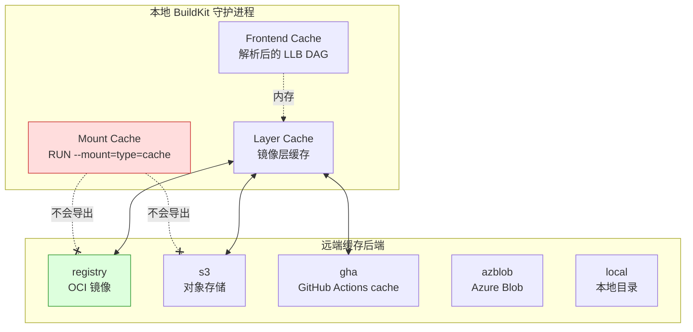

## 为什么又要写 BuildKit 缓存

BuildKit 从 2018 年并入 Moby、2022 年随 Docker 23 成为默认构建引擎，到 2025 年 0.17/0.18 稳定版本，已经是事实上的容器构建标准。但每次给团队做 Code Review，我仍然会反复看到这几类问题：

- Dockerfile 里用了 `go build`，但 `go mod download` 没单独一层，改一行业务代码就把 `go.sum` 的缓存层吹飞。
- CI 上用 `docker build` 而非 `docker buildx build`，默认压根没走 BuildKit 的 DAG 并发。
- 用了 `--cache-from`，但 `--cache-to` 漏写或只写了 `mode=min`，第二次构建依然从头拉。
- 多架构 `linux/amd64,linux/arm64` 用了 registry cache，`mode=max` 导出的 cache manifest 只有一个架构命中。
- `RUN --mount=type=cache` 写得很开心，结果切 runner 之后全没了，还纳闷为什么没加速。

这篇文章不会重复官方文档那套 "BuildKit 是什么"，只沉淀我在生产 GitLab Runner 和 GitHub Actions 上，把一个 Monorepo（Go + Node + Python 三种镜像共 30+ 个服务）的平均构建时间从 11 分钟压到 2 分钟的完整做法。

## 一张图看懂 BuildKit 的缓存层次

理解 BuildKit 缓存之前，先区分三类完全不同的缓存，它们的生命周期、大小、驱动方式都不一样：



关键点在红色的 **Mount Cache 不会被任何远端 backend 导出**。这是 BuildKit 的设计：`--mount=type=cache` 本质是守护进程内的一个具名卷 (`/var/lib/buildkit/cache`)，生命周期绑定在 builder 实例上。如果你的 runner 是短生命周期的 Kubernetes Pod，每次新 Pod 启动 mount cache 都是空的，这时候指望它加速等于白写。

记住这条结论：**mount cache 只在长生命周期 builder 上有价值，短生命周期 CI 必须用 registry/s3/gha 三种 layer 缓存后端之一。**

## 多阶段构建的第一原则：按"变更频率"分层

所有缓存优化的起点都是 Dockerfile 本身。一个反例：

```dockerfile
# 反例：所有东西压一起
FROM golang:1.23
WORKDIR /src
COPY . .
RUN go mod download && go build -o /app ./cmd/server
```

这个 Dockerfile 的问题是：只要 `./` 下任何文件变化（包括 README、测试、甚至 `.gitignore`），`go mod download` 就要重跑一遍。而依赖下载是整个构建里最慢的步骤之一，一次 cold cache 可能要 1-2 分钟。

正确姿势是把 Dockerfile 按"变更频率从低到高"分层：

```dockerfile
# syntax=docker/dockerfile:1.10

FROM golang:1.23-bookworm AS builder
WORKDIR /src

# 第 1 层：最稳定 —— 工具链和系统依赖
RUN --mount=type=cache,target=/var/cache/apt,sharing=locked \
    --mount=type=cache,target=/var/lib/apt,sharing=locked \
    apt-get update && apt-get install -y --no-install-recommends \
        ca-certificates git make && \
    rm -rf /var/lib/apt/lists/*

# 第 2 层：次稳定 —— Go module 依赖
# 只要 go.mod/go.sum 不变，这一层就命中
COPY go.mod go.sum ./
RUN --mount=type=cache,target=/go/pkg/mod \
    --mount=type=cache,target=/root/.cache/go-build \
    go mod download -x

# 第 3 层：次不稳定 —— 生成代码、vendor 目录等
COPY tools/ tools/
RUN --mount=type=cache,target=/go/pkg/mod \
    go generate ./...

# 第 4 层：最不稳定 —— 业务代码
COPY . .
RUN --mount=type=cache,target=/go/pkg/mod \
    --mount=type=cache,target=/root/.cache/go-build \
    CGO_ENABLED=0 GOOS=linux go build \
        -trimpath -ldflags="-s -w" \
        -o /out/app ./cmd/server

# 最终镜像：distroless，仅拷贝可执行文件
FROM gcr.io/distroless/base-debian12:nonroot
COPY --from=builder /out/app /app
USER nonroot:nonroot
ENTRYPOINT ["/app"]
```

这里有几个非常重要的细节：

1. **`# syntax=docker/dockerfile:1.10`** 必须写在第一行。它启用最新的 frontend，否则 `--mount=type=cache`、heredoc、`COPY --link` 这些特性用不了。
2. **`--mount=type=cache,sharing=locked`** 对 apt 的缓存目录必不可少。`sharing=locked` 意味着同一时刻只有一个构建能写入，避免并发腐蚀 apt 的索引文件。
3. **`go mod download`** 用了 `/go/pkg/mod` 的 cache mount，配合下面 `go build` 的 `/root/.cache/go-build`，冷热构建差几十倍。
4. **`COPY go.mod go.sum ./` 必须单独一行**，而不是跟其它代码一起 `COPY . .`。这是层分离的关键。
5. **`COPY --from=builder`** 到 distroless：实际镜像只有 20-30 MB，builder 里那 1.2 GB 的 Go 工具链不会进 registry。

## RUN --mount=type=cache 的五个坑

这是我见过团队踩得最多的坑，逐条说明。

### 坑 1：cache mount 不会被 --cache-to 导出

前面图里已经标红了。很多人以为 `--cache-to=type=registry,mode=max` 会把 `/root/.cache/go-build` 也导到 registry，实际上不会。registry 缓存导出的是**镜像层**（就是每个 `RUN` 执行完的 filesystem diff），而 cache mount 在 RUN 执行时是 bind mount，提交层的时候它是被 exclude 的。

所以你会看到一个"假命中"现象：cold runner 上，`COPY go.mod` 这层从 registry 命中了（layer cache），但 `go mod download` 那一层也命中了（它的 filesystem diff 是空的，因为东西都写进了 mount），于是 BuildKit 跳过执行。到了 `go build` 这层没命中（业务代码变了），需要重新执行 —— 这时候才发现 mount 里啥都没有，整个 go.sum 的依赖还是要重下。

**应对**：要么接受这个现实，让 registry layer cache 承担所有加速责任，cache mount 只在 warm runner 上锦上添花；要么用 `s3` 或 `gha` 后端去单独同步 mount 目录（后面会讲）。

### 坑 2：sharing=shared 下的写冲突

`--mount=type=cache` 有三种共享模式：

| sharing | 含义 | 适用场景 |
|---------|------|----------|
| `shared` (默认) | 多个构建并发读写同一缓存 | 无状态缓存，如 Go build cache |
| `locked` | 同一时刻只有一个构建持有 | 有状态操作，如 apt、npm install |
| `private` | 每个构建独享（其实就是没缓存） | 调试 |

Go 的 build cache 是内容寻址的，`shared` 安全。但 `npm install` 会往 `node_modules/.package-lock.json` 写中间状态，两个构建并发 `shared` 就会损坏。同理 apt、pip、gem 这些包管理器的缓存目录都该用 `locked`。

### 坑 3：uid/gid 错配导致权限拒绝

默认 cache mount 的 uid 是 0（root）。如果你镜像里换了用户：

```dockerfile
USER node
RUN --mount=type=cache,target=/home/node/.npm \
    npm ci
```

第一次构建时 `/home/node/.npm` 是 root 所有，`npm ci` 写不进去。正确写法：

```dockerfile
RUN --mount=type=cache,target=/home/node/.npm,uid=1000,gid=1000 \
    npm ci
```

### 坑 4：cache id 冲突

默认 cache id 是 target 路径。如果你在同一个 Dockerfile 里多个 stage 都用 `/root/.cache/go-build`，它们会共享同一个 cache。这在大部分时候是期望行为，但如果两个 stage 用的 Go 版本不同（例如一个 stage 构建主程序，另一个构建 DB migration 工具），cache 里的二进制对象可能不兼容。

显式指定 id：

```dockerfile
RUN --mount=type=cache,id=gobuild-1.23,target=/root/.cache/go-build ...
RUN --mount=type=cache,id=gobuild-1.22,target=/root/.cache/go-build ...
```

### 坑 5：cache mount 大小膨胀到塞满磁盘

BuildKit 没有默认的 cache mount GC 策略。长时间运行的 builder 上，Go build cache 可能膨胀到几十 GB。需要在 `buildkitd.toml` 里配置：

```toml
[worker.oci]
  gc = true
  gckeepstorage = 20000  # 20 GB

  [[worker.oci.gcpolicy]]
    keepBytes = 10000000000  # 10 GB
    keepDuration = 172800    # 48h
    filters = ["type==source.local","type==exec.cachemount"]

  [[worker.oci.gcpolicy]]
    all = true
    keepBytes = 20000000000
```

多条 `gcpolicy` 按顺序匹配，先满足前面的规则的内容优先被清理。

## 远端缓存后端选型

BuildKit 支持 5 种远端缓存后端：`inline`、`registry`、`local`、`s3`、`gha`、`azblob`。生产上只推荐后三种，原因如下：

| 后端 | 支持 mode=max | 额外依赖 | 典型大小 | 推荐场景 |
|------|---------------|----------|----------|----------|
| `inline` | 否 | 无 | 嵌入镜像 | 简单场景，不推荐 |
| `registry` | 是 | 任意 OCI registry | 无限 | 通用生产 |
| `local` | 是 | 本地目录 | 无限 | 离线/调试 |
| `s3` | 是 | S3 / MinIO | 无限 | 自建/多云 |
| `gha` | 是 | GitHub Actions | 10 GB/repo | GHA 工作流 |
| `azblob` | 是 | Azure | 无限 | Azure 生态 |

### inline cache 为什么不推荐

`inline` 的实现是把缓存元数据嵌入镜像 manifest。优点是零依赖，缺点致命：**只支持 mode=min**。

`mode=min` 只导出最终镜像用到的层的缓存。对多阶段构建来说，builder stage 里面那些中间层（`go mod download`、`npm ci`）根本不会进缓存。结果就是代码改一行，所有中间阶段全部 cold，你付出了 inline 的复杂度但几乎没有收益。

直接忘掉 inline，它只适合单阶段的简单 Dockerfile。

### registry cache：通用之选

```bash
docker buildx build \
  --cache-from type=registry,ref=registry.example.com/cache/app:buildcache \
  --cache-to   type=registry,ref=registry.example.com/cache/app:buildcache,mode=max,compression=zstd,force-compression=true,image-manifest=true \
  --tag registry.example.com/app:${GIT_SHA} \
  --push .
```

逐个参数解释：

- **`ref`**：缓存存放位置。约定把 cache 放在单独的 repo，比如 `cache/app`，tag 用 `buildcache` 或按分支 `buildcache-main`。不要和业务镜像混在同一个 tag 下。
- **`mode=max`**：导出**所有层**的缓存，包括中间 builder stage。生产上必须开。代价是 cache 体积大（一个 Go monorepo 常见 500MB-2GB），以及 push 时间变长。
- **`compression=zstd`**：zstd 压缩比 gzip 高 15-20%，解压还更快。BuildKit 0.10+ 支持，务必开启。
- **`force-compression=true`**：强制所有层都用 zstd 重压。不加这个参数时，BuildKit 会保留从 base image 拉下来的原始压缩格式（通常是 gzip），导致 cache 里一半 gzip 一半 zstd。
- **`image-manifest=true`**：让 cache 以 OCI image manifest 而非 manifest list 的形式存储。很多 registry（包括旧版 Harbor、部分 ECR 区域）对 manifest list 支持不完善，开这个参数更兼容。

### registry cache 的每层 0.3s 验证开销

2025 年社区报的一个性能问题：`type=registry,mode=max` 在导出时，会对每一层调用 `HEAD` 请求检查 blob 是否已存在。对一个 1000+ 层的大 cache，这个串行 HEAD 会串行阻塞 30 秒以上。

BuildKit 0.18 之后的缓解办法：

1. **`ignore-error=true`**：导出失败不阻塞构建成功。至少让你的 CI 不会因为 cache push 超时而红。
2. 分支隔离：每个分支写自己的 cache tag，减小单个 cache manifest 的层数。
3. 上 S3 后端：S3 后端用批量 API，没有这个串行开销。

### S3 cache backend：自建的最优解

如果你有自己的 S3（AWS S3 / MinIO / OSS / COS），强烈推荐切到 S3 backend：

```bash
docker buildx build \
  --cache-from type=s3,region=us-west-2,bucket=my-buildcache,prefix=app/ \
  --cache-to   type=s3,region=us-west-2,bucket=my-buildcache,prefix=app/,mode=max,compression=zstd \
  --tag ... --push .
```

S3 后端的好处：

- 批量 HEAD，没有 registry 那个串行瓶颈。
- 用 bucket lifecycle 自动清理旧 cache：set `expiration: 14 days`，不用自己维护清理脚本。
- 和镜像 push 分离，即使 registry 挂了 cache 还能用。
- 支持 `cache_control` 让 CDN 边缘加速（少见场景）。

认证走标准的 AWS credential chain：环境变量、IAM role、instance profile 都行。在 EKS 上用 IRSA 是最干净的。

### GHA cache backend：GitHub Actions 专用

GitHub Actions 的 Runner 提供了一个专属的缓存服务（每个 repo 10 GB 上限）。BuildKit 的 `gha` backend 直接接入：

```yaml
# .github/workflows/build.yml
- uses: docker/setup-buildx-action@v3
- uses: docker/build-push-action@v6
  with:
    context: .
    push: true
    tags: ghcr.io/org/app:${{ github.sha }}
    cache-from: type=gha,scope=app-${{ github.ref_name }}
    cache-to: type=gha,mode=max,scope=app-${{ github.ref_name }},compression=zstd
```

`scope` 是关键参数，用来区分不同分支、不同服务的缓存。GHA 的缓存有"作用域隔离"规则：PR branch 只能读 base branch 的 cache 但不能写（避免 PR 污染主干 cache）。所以 scope 最好带上 `ref_name`。

GHA cache 的隐形限制：**10 GB 总量**。超过会按 LRU 淘汰。一个 Monorepo 很容易超，这时候要么按服务拆 scope、要么切 S3。

## mode=max 在多架构构建下的坑

这是我踩过最深的坑之一。场景：用 `--platform=linux/amd64,linux/arm64` 做多架构构建，配 `type=registry,mode=max`。

期望：两个架构的所有层都进 cache，下次构建两个架构都能命中。
实际：你会发现 `arm64` 命中、`amd64` 不命中；或者反过来。重跑一次，又反过来。

根因是 BuildKit 早期版本（<0.13）的 bug：当 cache tag 是单个 image 而不是 manifest list 时，多架构的 cache 会互相覆盖。参见 moby/buildkit #2758。

修复方式有两种：

1. **升 BuildKit 到 0.13+**，它会自动用 manifest list 存多架构 cache。
2. **每个架构用独立 cache tag**：

```bash
# amd64
docker buildx build --platform linux/amd64 \
  --cache-to type=registry,ref=cache/app:buildcache-amd64,mode=max ...

# arm64
docker buildx build --platform linux/arm64 \
  --cache-to type=registry,ref=cache/app:buildcache-arm64,mode=max ...
```

然后在合并多架构 manifest 时用 `docker buildx imagetools create` 合并最终镜像，cache 保持分开。这个办法稍显粗暴但兜底靠谱。

## 基于 Kubernetes 的 BuildKit Pool 部署

在 K8s 上跑 BuildKit 是生产最常见的形态。有两种部署方式：

### 方式一：每个 CI Job 起一个 BuildKit Pod

这是最简单的做法，`docker/setup-buildx-action` 的默认行为也接近。缺点是 Pod 启动有开销（拉镜像、启动 rootless 容器 3-5 秒），并且 cache mount 不能跨 Pod 共享。

### 方式二：BuildKit Deployment Pool + 连接复用

给整个团队起一个 BuildKit Deployment，N 个 replica，每个 replica 持有自己的 local cache。CI Job 通过 `buildctl` 或 `buildx create --driver remote` 连上去。

```yaml
# buildkit-statefulset.yaml
apiVersion: apps/v1
kind: StatefulSet
metadata:
  name: buildkitd
  namespace: ci
spec:
  serviceName: buildkitd
  replicas: 3
  selector:
    matchLabels:
      app: buildkitd
  template:
    metadata:
      labels:
        app: buildkitd
    spec:
      containers:
      - name: buildkitd
        image: moby/buildkit:v0.18.1-rootless
        args:
          - --addr
          - unix:///run/user/1000/buildkit/buildkitd.sock
          - --addr
          - tcp://0.0.0.0:1234
          - --tlscacert=/certs/ca.crt
          - --tlscert=/certs/tls.crt
          - --tlskey=/certs/tls.key
          - --oci-worker-no-process-sandbox
        securityContext:
          seccompProfile:
            type: Unconfined
          runAsUser: 1000
          runAsGroup: 1000
        ports:
          - containerPort: 1234
        volumeMounts:
          - name: certs
            readOnly: true
            mountPath: /certs
          - name: buildkitd
            mountPath: /home/user/.local/share/buildkit
        resources:
          requests:
            cpu: "2"
            memory: 4Gi
          limits:
            cpu: "8"
            memory: 16Gi
      volumes:
        - name: certs
          secret:
            secretName: buildkitd-certs
  volumeClaimTemplates:
  - metadata:
      name: buildkitd
    spec:
      accessModes: [ReadWriteOnce]
      storageClassName: gp3
      resources:
        requests:
          storage: 100Gi
---
apiVersion: v1
kind: Service
metadata:
  name: buildkitd
  namespace: ci
spec:
  clusterIP: None  # headless，让每个 replica 都能被独立连
  selector:
    app: buildkitd
  ports:
    - port: 1234
      targetPort: 1234
```

StatefulSet + PVC 的好处是每个 replica 的 local cache 持久化，重启不丢。

CI 侧连接：

```bash
docker buildx create --driver remote \
  --name k8s-pool \
  --driver-opt cacert=/certs/ca.crt,cert=/certs/client.crt,key=/certs/client.key \
  tcp://buildkitd-0.buildkitd.ci.svc.cluster.local:1234

docker buildx use k8s-pool
docker buildx build ...
```

**pool 负载均衡**：BuildKit 本身没有原生 LB，简单做法是 CI Job 随机选一个 replica `buildkitd-${RANDOM % 3}`。更好的做法是在前面放一个 stick session 的 L4 LB，让同一个 branch 的构建永远落到同一个 replica，最大化 mount cache 命中。我们用 HAProxy 以 `hash(branch)` 作为 key：

```
backend buildkit
    balance hdr(X-Build-Branch)
    hash-type consistent
    server bk0 buildkitd-0.buildkitd.ci:1234 check
    server bk1 buildkitd-1.buildkitd.ci:1234 check
    server bk2 buildkitd-2.buildkitd.ci:1234 check
```

## 落地案例：Monorepo 30 服务的压缩记录

最后给一套我们真实落地的数据和配置。项目规模：

- Monorepo，30 个微服务（18 Go、7 Node、5 Python）
- CI 平台：GitLab Runner on EKS
- 每次 MR 构建触发 3-8 个变更服务
- 优化前平均构建时间：**11 分 24 秒**
- 优化后平均构建时间：**1 分 58 秒**

关键动作按贡献排序：

1. **把所有 Dockerfile 改成"依赖与代码分离"的多阶段结构**：贡献 ~40% 加速。这是回报率最高的动作。
2. **启用 registry cache `mode=max,compression=zstd`**：贡献 ~30%。从 `inline` 切到 `registry`。
3. **部署 BuildKit StatefulSet Pool，按分支 hash 路由**：贡献 ~15%。mount cache 命中率从 0 提到 75%。
4. **切到 S3 backend 替代 Harbor registry backend**：贡献 ~10%。解决 Harbor 的串行 HEAD 开销。
5. **`--push` 改用 `--output type=image,compression=zstd,oci-mediatypes=true`**：贡献 ~5%。zstd 压缩的 layer push 带宽少 30%。

我们最终的 GitLab CI job 模板长这样：

```yaml
.build-image:
  image: moby/buildkit:v0.18.1-rootless
  variables:
    BUILDCTL: buildctl-daemonless.sh
    BUILDKIT_HOST: tcp://buildkitd.ci.svc.cluster.local:1234
    CACHE_PREFIX: s3://buildcache.example.com/${CI_PROJECT_NAME}
  before_script:
    - export GIT_SHA_SHORT=${CI_COMMIT_SHORT_SHA}
    - export BRANCH_SAFE=$(echo ${CI_COMMIT_REF_NAME} | tr '/' '-')
  script:
    - |
      buildctl --addr $BUILDKIT_HOST build \
        --frontend dockerfile.v0 \
        --local context=. \
        --local dockerfile=${SERVICE_DIR} \
        --opt target=runtime \
        --opt platform=linux/amd64 \
        --import-cache type=s3,region=us-west-2,bucket=buildcache,prefix=${CI_PROJECT_NAME}/${BRANCH_SAFE}/ \
        --import-cache type=s3,region=us-west-2,bucket=buildcache,prefix=${CI_PROJECT_NAME}/main/ \
        --export-cache type=s3,region=us-west-2,bucket=buildcache,prefix=${CI_PROJECT_NAME}/${BRANCH_SAFE}/,mode=max,compression=zstd,force-compression=true,ignore-error=true \
        --output type=image,name=${IMAGE_REF},push=true,compression=zstd,oci-mediatypes=true
  retry:
    max: 2
    when: [runner_system_failure, stuck_or_timeout_failure]
```

注意两个 `--import-cache`：先从当前分支的 cache 导入，若未命中再 fallback 到 main 分支的 cache。这个"分层 fallback"机制让新建分支的第一次构建也能大比例命中。

## 排障：缓存看起来没生效怎么办

按这个顺序排查：

### 第 1 步：确认 --cache-from 真的在生效

加 `--progress=plain` 观察日志。命中的层会显示 `CACHED`：

```
#12 [builder 3/5] RUN go mod download
#12 CACHED
```

没命中但 backend 是通的，会看到：

```
#12 [builder 3/5] RUN go mod download
#12 resolve mounts
#12 extracting sha256:...
```

如果看到的是 `ERROR: failed to fetch ref ... not found`，说明 `--cache-from` 指向的 cache 不存在。检查 registry 里有没有 `buildcache` 这个 tag。

### 第 2 步：对比两次构建的 digest

```bash
docker buildx build --metadata-file meta.json ...
cat meta.json | jq '.["containerimage.digest"]'
```

两次构建如果代码没变，digest 应该完全一致。不一致说明有非确定性因素（时间戳、随机 UUID、`RUN date` 之类）。

### 第 3 步：看 BuildKit 的 cache 调试

```bash
BUILDKIT_PROGRESS=plain BUILDKIT_TRACE=1 docker buildx build ... 2>&1 | grep -i cache
```

`BUILDKIT_TRACE=1` 会打出详细的 cache key 计算过程，能定位是哪一层的 hash 不稳定。

### 第 4 步：mode=min 和 mode=max 的差异确认

如果你 `--cache-to` 没加 `mode=max`，builder stage 是不会进 cache 的。看 cache manifest：

```bash
docker buildx imagetools inspect registry.example.com/cache/app:buildcache --raw | jq .
```

`mode=max` 的 manifest 会有很多 `application/vnd.buildkit.cacheconfig.v0` 和大量 layers；`mode=min` 只有最终镜像的几层。

## 结语

BuildKit 的缓存体系表面是一堆命令行参数，底层是 DAG 解析 + 内容寻址 + 远端同步三层抽象的叠加。大部分团队只用了最浅的一层（`docker build` 替换成 `docker buildx build`），就错过了 50% 以上的加速空间。

真正的生产实践要做到的是：

- **Dockerfile 按变更频率分层**，这是必选项，任何缓存后端都救不了糟糕的 Dockerfile。
- **统一用 `registry`/`s3`/`gha` 三种后端之一**，`mode=max` + `zstd` 是默认值。
- **长生命周期 builder 配 mount cache**，短生命周期 runner 只依赖 layer cache。
- **多架构构建升到 BuildKit 0.13+**，或拆成独立 cache tag。
- **排障用 `--progress=plain` + `BUILDKIT_TRACE=1`**，不要猜。

下一步如果你想再压缩 20%，可以看看 `ko`（我们另一篇会讲）直接绕过 Dockerfile，或者 Dagger 做可编程的 pipeline cache。但这些都是在 BuildKit 基础上的进一步优化，BuildKit 本身要先打扎实。

Sources:
- [Docker Docs - Cache storage backends](https://docs.docker.com/build/cache/backends/)
- [Docker Docs - Registry cache](https://docs.docker.com/build/cache/backends/registry/)
- [AWS - Remote cache support in Amazon ECR for BuildKit](https://aws.amazon.com/blogs/containers/announcing-remote-cache-support-in-amazon-ecr-for-buildkit-clients/)
- [moby/buildkit GitHub](https://github.com/moby/buildkit)
- [BuildKit Deep Dive - SparkFabrik](https://tech.sparkfabrik.com/en/blog/docker-cache-deep-dive/)
