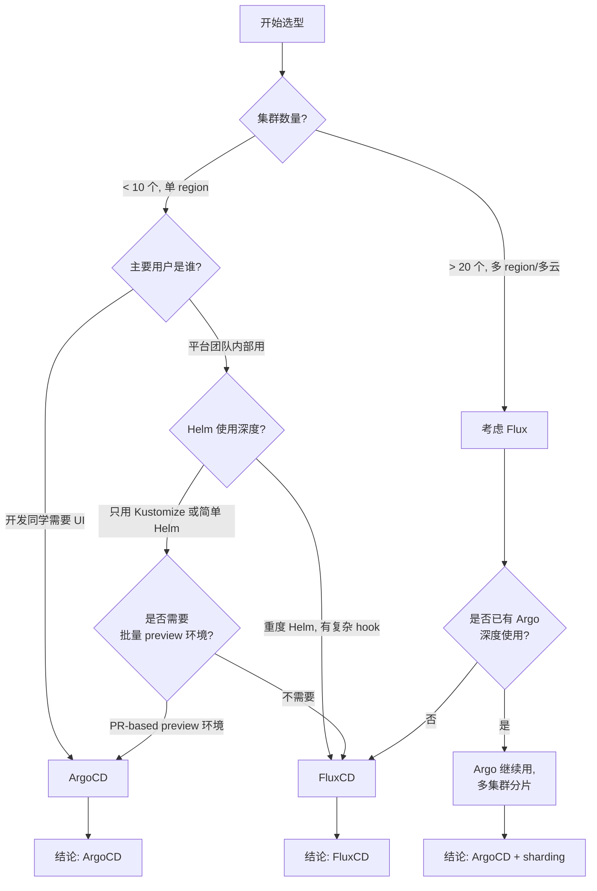

## 写在前面

GitOps 阵营里真正跑进 CNCF Graduated 的只有 **FluxCD** 和 **ArgoCD** 两家，但它们走的是两条完全不同的路。Flux 一开始就把"控制器解耦、CRD 即 API"刻进骨子里，没 UI、没单体 server；ArgoCD 上来就是一个重 UI、有状态的 API Server，加一个强耦合的 Application Controller。架构、运维成本、可观测性、扩展能力的分岔都是从这里开始的。

团队第一次选型大多一拍脑袋选 ArgoCD——UI 好看、上手快。但规模一旦拉到几十集群、上百租户、几千应用，或者要把部署能力塞进 Backstage / IDP 的时候，Flux 的"控制器优先"反而更省心。

这篇不打算和稀泥。每个维度我都给结论，然后附一份能照搬的 Argo → Flux 迁移手册。全文示例统一用以下脱敏命名：

- 集群名：`platform-cluster`、`edge-cluster-1`、`edge-cluster-2`
- 域名：`example.com`、`apps.example.com`
- 仓库：`github.com/example-org/platform-config`
- 应用：`apps/frontend`、`apps/backend`、`apps/worker`
- 命名空间：`team-alpha`、`team-beta`、`flux-system`、`argocd`

---

## 1. GitOps 的真正定义：不只是"用 Git 存 YAML"

在开始对比工具之前，先把 GitOps 的四条公理重新钉一下——这四条直接决定了我们要评估 Flux/Argo 的哪些能力。

**1. 声明式（Declarative）**。系统的期望状态全部以声明式配置描述，不是一堆 `kubectl apply` 脚本，也不是 Jenkins pipeline 里的 `helm upgrade`。声明式意味着：给定同一份配置，无论谁跑、跑几次、在什么时间跑，结果都必须等价。

**2. 版本化且不可变（Versioned & Immutable）**。所有状态必须在 Git 里有版本。任何绕过 Git 直接改集群的行为都是反模式。版本化的核心价值不是"可以 blame"，而是**可以回退**——回退一次部署应当和 `git revert` 一样简单。

**3. 自动拉取与自动 reconcile（Pulled Automatically & Continuously Reconciled）**。控制器主动从 Git 拉取配置，持续比较实际状态与期望状态。这一点是 GitOps 与传统 CI/CD 最大的分水岭：**GitOps 是 pull-based 的**，CI 流水线只负责把工件推到制品库和改 Git，它不连集群、不拿 kubeconfig、不做 helm upgrade。

**4. 可审计且持续收敛（Auditable & Self-healing）**。系统能检测到任何漂移（有人手动改了 Deployment 的副本数、Mutating Webhook 加了 annotation），并按需要收敛或告警。

很多同学混淆了 GitOps 与 "CI with Git"。判别方法只有一条：**看谁持有 kubeconfig**。

- 如果是 Jenkins/GitLab Runner 拿着集群的 admin token 执行 `kubectl apply`——这不是 GitOps，这是 CIOps。
- 如果是集群内的 controller 主动去 Git 拉配置，CI 从头到尾都不碰集群——这才是 GitOps。

为什么 pull 比 push 重要？

- **攻击面更小**：CI 系统不需要持有集群凭据；集群不需要对 CI 开放入口。在多云、多 VPC、有防火墙隔离的场景下这是刚需。
- **状态收敛**：push 模式下一次 `kubectl apply` 结束就完事，没人负责漂移；pull 模式下 controller 会持续 reconcile，漂移会被自动纠正。
- **多集群扩展性**：push 模式每新增一个集群都要给 CI 配 kubeconfig、打通网络；pull 模式只需要在新集群里装一次 controller，CI 完全无感。

明白了这四条，我们才能评判 Flux 和 Argo 哪个更"正宗"。剧透：**Flux 对四条公理的贯彻比 Argo 彻底**，尤其是在"控制器为先"和"CI 完全无感集群"这两点上。

---

## 2. 架构速览：五大控制器 vs 单体 Server

### 2.1 FluxCD 架构

Flux v2 把自己拆成了五个 GitOps Toolkit 控制器，每个都是独立的 Deployment，每个都只管自己的一组 CRD：

```
                    ┌─────────────────────────┐
                    │    Git / OCI / Bucket   │  （外部源）
                    └───────────┬─────────────┘
                                │
                                ▼
                ┌──────────────────────────────┐
                │   source-controller          │  CRD: GitRepository,
                │   拉源码、缓存、通知 ready     │       OCIRepository,
                └───────────┬──────────────────┘       HelmRepository,
                            │                           HelmChart, Bucket
              ┌─────────────┴─────────────┐
              ▼                           ▼
  ┌──────────────────────┐   ┌──────────────────────┐
  │ kustomize-controller │   │   helm-controller    │
  │ CRD: Kustomization   │   │ CRD: HelmRelease     │
  └──────────┬───────────┘   └──────────┬───────────┘
             │                          │
             └───────────┬──────────────┘
                         ▼
                 ┌──────────────────┐
                 │  Kubernetes API  │
                 └────────┬─────────┘
                          │
             ┌────────────┴────────────┐
             ▼                         ▼
  ┌───────────────────────┐  ┌────────────────────────┐
  │ notification-ctrl     │  │ image-reflector-ctrl / │
  │ Provider/Alert/Receiver│  │ image-automation-ctrl  │
  └───────────────────────┘  └────────────────────────┘
```

五个控制器各司其职：

- **source-controller**：只干一件事——把 Git/OCI/Helm 仓库的内容拉下来，生成 artifact（tar 包），通过内置 HTTP 暴露给别的控制器。所有跟源有关的缓存和校验都在这里。
- **kustomize-controller**：消费 source-controller 产出的 artifact，对 `Kustomization` CR 里指定的路径执行 kustomize build，然后 server-side apply 到集群。
- **helm-controller**：消费 HelmChart artifact，执行真实的 Helm install/upgrade，真真正正走 Helm release 的生命周期。
- **notification-controller**：分发事件（Slack、钉钉、Webhook、GitHub Commit Status），也接收外部 Webhook（例如 GitHub push）触发 reconcile。
- **image-reflector-controller / image-automation-controller**：监听镜像仓库新版本，按策略自动提 commit 回 Git。

这些控制器之间没有强耦合，任何一个挂了都不影响别的。想扩展新能力？写一个新的 controller、定义新的 CRD，加进去就行。Flux 的所有用户交互都通过 CRD 完成，`flux` CLI 只是一个"生成 YAML + kubectl apply"的便利工具。

### 2.2 ArgoCD 架构

ArgoCD 的组件看起来多，但耦合紧：

```
     ┌────────────────────────────────────┐
     │         argocd-server              │  API + Web UI + gRPC
     │ (gRPC/REST, auth, RBAC, CLI entry) │
     └──────────────┬─────────────────────┘
                    │
         ┌──────────┴──────────┐
         ▼                     ▼
  ┌─────────────┐     ┌────────────────────┐
  │ repo-server │     │ application-       │
  │ (manifest   │◄────│ controller         │
  │  generation)│     │ (reconcile loop)   │
  └─────────────┘     └──────────┬─────────┘
                                 │
                                 ▼
                       ┌──────────────────┐
                       │ Kubernetes API   │
                       │ (target clusters)│
                       └──────────────────┘

     ┌───────────────────────────┐
     │ applicationset-controller │  CRD: ApplicationSet
     │ (生成 Application 批量)   │
     └───────────────────────────┘

     ┌───────────────────────────┐
     │ notifications-controller  │
     └───────────────────────────┘

     ┌───────────────────────────┐
     │ dex-server (可选 SSO)     │
     └───────────────────────────┘
```

关键组件：

- **argocd-server**：HTTP/gRPC API server，还承载 Web UI。所有 CLI 调用（`argocd app sync`）都走它。它有自己的 RBAC、Project、Session 管理。
- **repo-server**：无状态 worker，负责把 Git 仓库的 manifest 渲染成最终 YAML。Helm、Kustomize、Jsonnet 插件都跑在这里。
- **application-controller**：真正的 reconcile 主体，watch `Application` CR，按需拉 repo-server 产出，diff 集群实际状态，执行 sync。
- **applicationset-controller**：独立 controller，消费 `ApplicationSet` CR，用 generator（List/Git/Cluster/Matrix/Pull Request 等）批量生成 `Application`。
- **notifications-controller**：消息通知（早期是独立项目 argocd-notifications，后来合入官方）。

### 2.3 架构层面的第一个结论

**Flux 是控制器优先（controller-first），Argo 是 server 优先（server-first）。**

这不是纯粹的审美差异。它直接带来三点后果：

1. **Flux 没有"中央 server"这个单点**。每个控制器都只消费 CRD，只要 apiserver 活着就能继续 reconcile。Argo 的 argocd-server 如果挂了，UI 和 CLI 都不能用，虽然 application-controller 仍在 reconcile，但运维体感上是"Argo 挂了"。
2. **Flux 的 CI/CD 集成只需要 `kubectl apply` CRD**。你的上游平台（Backstage、内部 portal、workflow 引擎）完全可以绕过 CLI，直接往 git 提 CRD YAML，Flux 就会接管。Argo 则鼓励你走 `argocd app create`/API Server。
3. **Flux 的水平扩展更自然**。每个控制器都可以独立调 `--concurrency`；source-controller 把 artifact 缓存在本地 PVC 上。Argo 的 application-controller 是 shard 模式（多副本各负责一部分 cluster），配置起来比较绕，且 repo-server 的缓存是每副本一份的。

如果你追求"GitOps 基础设施本身也是可 GitOps 化的、最小依赖的、能嵌入任何平台工程栈"，Flux 是更干净的选择。如果你追求"开箱即用的 UI、买一送十、给开发同学看 sync 状态"，Argo 更友好。

---

## 3. 同步模型：Kustomization/HelmRelease vs Application/ApplicationSet

### 3.1 Flux 的同步语义

Flux 里没有"Application"这种大一统抽象，取而代之的是两个更小的 CRD：

- **`Kustomization`**：描述"把某个 Git 路径 kustomize build 后 apply 到集群"的意图。
- **`HelmRelease`**：描述"把某个 chart 以某组 values install/upgrade"的意图。

两者都引用一个 `sourceRef`，把"源"和"如何使用源"彻底解耦。

一个最小的 `Kustomization` 长这样：

```yaml
---
apiVersion: source.toolkit.fluxcd.io/v1
kind: GitRepository
metadata:
  name: platform-config
  namespace: flux-system
spec:
  interval: 1m
  url: https://github.com/example-org/platform-config
  ref:
    branch: main
---
apiVersion: kustomize.toolkit.fluxcd.io/v1
kind: Kustomization
metadata:
  name: frontend
  namespace: flux-system
spec:
  interval: 5m
  targetNamespace: team-alpha
  sourceRef:
    kind: GitRepository
    name: platform-config
  path: "./apps/frontend/overlays/production"
  prune: true
  wait: true
  timeout: 5m
  healthChecks:
    - apiVersion: apps/v1
      kind: Deployment
      name: frontend
      namespace: team-alpha
```

几个关键字段的语义：

- `interval`：reconcile 周期。Flux 会在每个间隔主动 apply 一次，即便 Git 没变，也会把集群实际状态收敛到渲染结果。
- `prune: true`：Git 里删除的资源会被从集群删除。Flux 通过给所有 apply 出来的资源打 `kustomize.toolkit.fluxcd.io/name` / `namespace` label 来做垃圾回收。
- `wait: true`：apply 完等待所有资源进入 Ready 状态，才认为这次 reconcile 成功；失败会在 `.status.conditions` 里明确写出来。
- `healthChecks`：额外的显式健康探针，通常用于关键 Deployment/StatefulSet。
- `dependsOn`：可选字段，表示这个 Kustomization 必须在另一个 Kustomization 成功之后才开始 apply，天然支持拓扑排序（CRDs → Namespaces → Apps）。

### 3.2 Argo 的同步语义

Argo 的核心 CRD 是 `Application`：

```yaml
apiVersion: argoproj.io/v1alpha1
kind: Application
metadata:
  name: frontend
  namespace: argocd
spec:
  project: team-alpha
  source:
    repoURL: https://github.com/example-org/platform-config
    path: apps/frontend/overlays/production
    targetRevision: main
  destination:
    server: https://kubernetes.default.svc
    namespace: team-alpha
  syncPolicy:
    automated:
      prune: true
      selfHeal: true
    syncOptions:
      - CreateNamespace=true
      - ServerSideApply=true
    retry:
      limit: 5
      backoff:
        duration: 5s
        factor: 2
        maxDuration: 3m
```

语义上差异：

| 维度 | Flux | Argo |
|---|---|---|
| 主动 reconcile | `interval` 到点 apply，不看 diff | 默认只在 diff 变化时 sync（除非打开 selfHeal） |
| 漂移纠正 | 天然持续收敛 | 需要 `automated.selfHeal: true` |
| 删除语义 | `prune: true` 基于 label GC | `prune: true` 基于 tracking annotation |
| 拓扑依赖 | `dependsOn` 显式 | `sync-wave` annotation 隐式排序 |
| 成功判定 | `wait` + healthChecks | Sync phase + Health 自动聚合 |
| 手动干预 | 改 spec 或打 suspend | UI 点 sync/rollback 或 `argocd app sync` |

### 3.3 一个经常被忽略的差异：interval 的本质

Argo 默认的 reconcile 频率由 `application-controller` 全局 `--app-resync` 决定（默认 180s），这是一个**集群级别**的参数，所有 Application 共享。你不能说"A 应用每 1 分钟 reconcile，B 应用每 30 分钟 reconcile"。

Flux 的 `interval` 是每个 `Kustomization` / `HelmRelease` 单独配置的。你可以让核心基础设施（cert-manager、ingress）每 1 分钟 reconcile，让业务应用每 10 分钟 reconcile，让偶尔才变的 CRD bundle 每小时 reconcile。

**这在大规模集群里是实打实的性能差距**。一个装了 2000 个 Application 的 Argo 集群，默认每 3 分钟要把所有应用都 diff 一遍，application-controller 的 CPU 水位会一直很高；同样规模的 Flux 集群，通过区分 interval 可以把 reconcile 压力摊平到几个不同的时间段。

### 3.4 结论

**Flux 的同步语义更简单、更显式、更适合大规模。** Argo 的 Application 是一个有状态的大对象，selfHeal、prune、auto-sync 各自是开关，语义叠加起来容易产生"我以为会自动，其实没有"的惊讶。Flux 的 Kustomization 从第一天就假设"每 interval 秒全量 reconcile 一次"，没有半自动的灰色地带。

---

## 4. 源码订阅：artifact 模型 vs repo-server

### 4.1 Flux 的源模型

Flux 把"源"抽成独立的 CRD 类型，一共五种：

- **`GitRepository`**：从 Git（HTTPS/SSH）拉代码，支持 branch/tag/semver/commit ref，支持稀疏 checkout（`spec.ignore`），支持签名校验（`spec.verify`，GitHub Actions OIDC / cosign / GPG）。
- **`OCIRepository`**：从 OCI 镜像仓库拉 tar layer，支持按 digest/tag/semver 选择，支持 cosign 签名校验。这让"把 manifest 打成 OCI artifact 推到 ECR/Harbor/GHCR"成为一等公民，适合那些不想让集群访问开发者的代码仓库的团队。
- **`HelmRepository`**：传统 Helm chart 仓库（HTTP index.yaml），也支持 OCI 仓库。
- **`HelmChart`**：一个具体的 chart + version，通常由 HelmRelease 自动创建，但也可以手动创建。
- **`Bucket`**：从 S3/GCS/Azure Blob 拉 tar，用于那些用对象存储做 GitOps 源的团队。

source-controller 拉完之后会本地生成一个 artifact 文件（tar.gz），挂到自身的 HTTP 端点上：`http://source-controller.flux-system/gitrepository/<ns>/<name>/<revision>.tar.gz`。kustomize-controller / helm-controller 通过 in-cluster 网络拿这个 tar 包，不再重新连 Git。

**这种"artifact 中转"带来几个好处**：

1. 一个 GitRepository 只拉一次，多个 Kustomization 复用 artifact，Git 的请求次数被压到最低。
2. source-controller 天然支持缓存（PVC），source 拉取和下游 reconcile 可以异步解耦。
3. 下游控制器完全不需要 Git 凭据，源的认证集中在 source-controller 里，凭据泄漏面最小。

### 4.2 Argo 的源模型

Argo 把"拉源 + 渲染"都塞在 repo-server 里。每次 application-controller 判断要 sync，就通过 gRPC 问 repo-server 要"当前 revision 的渲染结果"。repo-server 是无状态的，内部有一层 LRU 缓存（manifest cache + revision cache），缓存 key 是 `repoURL + path + targetRevision + values`。

带来的问题：

1. repo-server 的 cache 是**每副本一份**，扩容多副本时 cache 命中率会掉。
2. 每次 cache miss 都要重新 `git clone --depth=1`、重新执行 helm template / kustomize build，比 Flux 的 artifact 模型 CPU 消耗高。
3. Helm 私有仓库、Git 私有仓库的凭据管理是通过 `argocd-repo-creds` Secret，由 repo-server 加载。
4. 如果用 `valueFiles` 引用远程 chart 之外的 values（典型：把 values 放在另一个 Git 仓库里），渲染会变得非常别扭，需要 multiple-sources 特性支持。

### 4.3 结论

**Flux 的 artifact 模型在多应用共享同一仓库的场景下延迟和 CPU 都更低**。这是被 source-controller 的 PVC 缓存和 pull-once-use-many 模式决定的。Argo 的 repo-server 架构简单、好理解，但在上千 Application 规模下内存和 CPU 会比 Flux 高一个档位。

---

## 5. Helm 支持：真 release 还是 fancy template

这是 Flux 和 Argo 差异最大、也最容易踩坑的地方。

### 5.1 ArgoCD 对 Helm 的处理

Argo 处理 Helm 的方式是"把 Helm 当作模板引擎"：

```yaml
apiVersion: argoproj.io/v1alpha1
kind: Application
spec:
  source:
    repoURL: https://charts.example.com
    chart: frontend
    targetRevision: 1.2.3
    helm:
      releaseName: frontend
      values: |
        image:
          tag: v1.2.3
```

repo-server 收到这个请求后会执行：

```bash
helm template frontend \
  --repo https://charts.example.com \
  --version 1.2.3 \
  --values values.yaml
```

注意：**是 `helm template`，不是 `helm install`**。产出的 YAML 会被 application-controller 当作普通 manifest apply 到集群。

这带来几个副作用：

1. 集群里**不存在真正的 Helm release**（没有 `helm ls` 能看到的条目，没有 secrets/configmaps 形式的 release 元数据）。
2. Helm 的 `post-install`/`post-upgrade` hook 被 Argo 改造成了 "resource-hook" 语义，用 annotation 标记，执行时机由 application-controller 插入 sync wave。不完全等价于真 Helm hook。
3. Helm 的 `Chart.yaml` 里的 `dependencies` 照样工作（helm template 支持），但是带 condition 的 subchart 启用/禁用语义跟真 helm install 有细微差别。
4. 从别的工具迁来的现成 chart，只要有复杂的 hook 或者 tpl 函数里用 `lookup`、`uuidv4` 这种依赖环境的函数，就容易踩坑。
5. Chart 渲染走 repo-server 的 CPU，渲染大 chart（例如 kube-prometheus-stack 这种上千行模板）成本不低。

### 5.2 FluxCD 对 Helm 的处理

Flux 的 helm-controller **真的调用 Helm SDK 做 install/upgrade**，创建真正的 Helm release，集群里能 `helm ls` 看到：

```yaml
---
apiVersion: source.toolkit.fluxcd.io/v1
kind: HelmRepository
metadata:
  name: example-charts
  namespace: flux-system
spec:
  interval: 10m
  url: https://charts.example.com
---
apiVersion: helm.toolkit.fluxcd.io/v2
kind: HelmRelease
metadata:
  name: frontend
  namespace: team-alpha
spec:
  interval: 5m
  releaseName: frontend
  chart:
    spec:
      chart: frontend
      version: "1.2.3"
      sourceRef:
        kind: HelmRepository
        name: example-charts
        namespace: flux-system
      interval: 1m
  install:
    remediation:
      retries: 3
  upgrade:
    remediation:
      retries: 3
      remediateLastFailure: true
    cleanupOnFail: true
  valuesFrom:
    - kind: ConfigMap
      name: frontend-values
      valuesKey: values.yaml
    - kind: Secret
      name: frontend-secrets
      valuesKey: secrets.yaml
  postRenderers:
    - kustomize:
        patches:
          - target:
              kind: Deployment
              name: frontend
            patch: |
              - op: add
                path: /spec/template/spec/priorityClassName
                value: production
```

值得注意的特性：

- **真正的 Helm release 生命周期**：`helm rollback` 可以在 Flux 之外正常工作。release history 保存在集群 secret 里。
- **原生 dependsOn**：一个 HelmRelease 可以 `dependsOn` 另一个，helm-controller 会按依赖顺序处理。
- **post-renderer**：Flux 在 Helm 渲染完之后、apply 之前插入 kustomize patches。这是一个被严重低估的能力——它让你能修改第三方 chart 的任何字段（比如给 kube-prometheus-stack 里的某个 Pod 加 toleration），而不需要 fork chart。
- **valuesFrom**：从 ConfigMap/Secret 里拉 values，天然适合和 SOPS/External Secrets 配合。
- **remediation**：失败自动重试、失败回滚到上一个成功 release 都是一等能力。

### 5.3 结论

**如果你重度使用 Helm，Flux 胜出不止一个身位。** Argo 处理 Helm 的方式只能算"勉强能用"，一旦碰到带 hook、带 lookup、带复杂 dependencies 的 chart，你会一路踩坑。Flux 的 helm-controller 是"Helm 的持续交付正确答案"——真 release、真 rollback、真 hook，加上原生 post-renderer 这一个杀手锏，碾压 Argo 的 Helm 支持。

唯一要注意的是 Flux helm-controller 在处理"超多 HelmRelease"时 CPU 会相对高一些，因为它会加载 chart 到内存；这可以通过把 helm-controller 配置为多副本 + leader election 解决。

---

## 6. Kustomize 支持

Kustomize 这一侧差距没那么大。Flux 原生集成 kustomize-controller，Argo 的 repo-server 也原生集成 kustomize build。两者都支持 remote bases、patches、components、replacements 等 Kustomize 现代特性。

几个值得留意的小差别：

1. **变量替换（substitute / substituteFrom）**：Flux 的 `Kustomization` 有 `postBuild.substitute` 和 `postBuild.substituteFrom`，可以在 kustomize build 之后再做一次 `${VAR}` 占位符替换，源可以是 ConfigMap/Secret。这实际上提供了"一份 base + N 份 overrides from ConfigMap"的能力，非常适合 ApplicationSet 风格的多集群/多环境部署。Argo 没有等价物——Argo 的解决方案是 ApplicationSet 去生成 N 个 Application，成本更高。

```yaml
apiVersion: kustomize.toolkit.fluxcd.io/v1
kind: Kustomization
metadata:
  name: frontend-edge
  namespace: flux-system
spec:
  interval: 5m
  path: ./apps/frontend/base
  sourceRef:
    kind: GitRepository
    name: platform-config
  postBuild:
    substitute:
      cluster_name: edge-cluster-1
      region: us-east-1
    substituteFrom:
      - kind: ConfigMap
        name: cluster-vars
        optional: false
      - kind: Secret
        name: cluster-secrets
        optional: true
```

2. **server-side apply**：Flux 从 v2 起默认使用 SSA；Argo 从 2.5 起支持 `ServerSideApply=true` 选项。两边对 field manager 的处理都已经成熟。

3. **strategic merge 冲突处理**：Flux 在 SSA 模式下会 honor `force-conflicts` 字段（对应 `spec.force`）；Argo 在 syncOptions 里也有类似 `Force=true`。语义等价。

4. **健康检查**：Argo 有内置的 Lua 脚本资源健康检查库，覆盖常见 CRD（Istio VirtualService、cert-manager Certificate 等）；Flux 的健康检查需要用户显式在 `healthChecks` 里列出，覆盖面窄一些，但最近几版在加入 `healthCheckExprs`（CEL 表达式）补齐这部分。

结论：**Kustomize 这一侧 Flux 略胜**，主要是 `postBuild.substituteFrom` 这个能力把"多环境/多集群变量注入"变得非常优雅。Argo 的健康检查 Lua 库是个不小的加分项。如果你用一大堆第三方 CRD 且依赖 UI 显示 Sync 状态，Argo 在这一点上更顺手。

---

## 7. 多租户：impersonation 还是 Project+RBAC？

### 7.1 Flux 的多租户模型

Flux 多租户的核心机制是 **ServiceAccount impersonation**。每个 `Kustomization` / `HelmRelease` 可以指定 `spec.serviceAccountName`，kustomize-controller / helm-controller 在 apply 资源时会带上 `--as` 参数，以这个 ServiceAccount 的身份执行。

```yaml
---
apiVersion: v1
kind: Namespace
metadata:
  name: team-alpha
---
apiVersion: v1
kind: ServiceAccount
metadata:
  name: gitops-reconciler
  namespace: team-alpha
---
apiVersion: rbac.authorization.k8s.io/v1
kind: RoleBinding
metadata:
  name: gitops-reconciler
  namespace: team-alpha
subjects:
  - kind: ServiceAccount
    name: gitops-reconciler
    namespace: team-alpha
roleRef:
  kind: ClusterRole
  name: edit
  apiGroup: rbac.authorization.k8s.io
---
apiVersion: source.toolkit.fluxcd.io/v1
kind: GitRepository
metadata:
  name: team-alpha-apps
  namespace: team-alpha
spec:
  interval: 1m
  url: https://github.com/example-org/team-alpha-apps
  ref:
    branch: main
  secretRef:
    name: team-alpha-git-auth
---
apiVersion: kustomize.toolkit.fluxcd.io/v1
kind: Kustomization
metadata:
  name: team-alpha-apps
  namespace: team-alpha
spec:
  interval: 5m
  serviceAccountName: gitops-reconciler
  sourceRef:
    kind: GitRepository
    name: team-alpha-apps
  path: ./
  prune: true
  targetNamespace: team-alpha
```

隔离效果：

- team-alpha 的 Flux 资源**必须**放在 team-alpha 命名空间；
- GitRepository 的 Secret 也放在 team-alpha 命名空间，平台团队看不见；
- 租户的 Kustomization 只能 apply 到 `gitops-reconciler` SA 有权限的命名空间，跨租户越权尝试会被 apiserver 拒绝；
- 平台团队通过 `--no-cross-namespace-refs=true` 启动 flag 禁止跨命名空间引用，让租户完全不能引用其他租户的 Source。

这一套机制的精髓是：**Kubernetes RBAC 本身就是 Flux 的 RBAC**。你不需要再学一套新的权限模型。

### 7.2 ArgoCD 的多租户模型

Argo 的多租户核心是 **AppProject** CRD 和自带的一套 RBAC 策略 CSV：

```yaml
apiVersion: argoproj.io/v1alpha1
kind: AppProject
metadata:
  name: team-alpha
  namespace: argocd
spec:
  description: Team Alpha Apps
  sourceRepos:
    - https://github.com/example-org/team-alpha-apps
  destinations:
    - namespace: team-alpha
      server: https://kubernetes.default.svc
  clusterResourceWhitelist: []
  namespaceResourceWhitelist:
    - group: "*"
      kind: "*"
  roles:
    - name: developer
      policies:
        - p, proj:team-alpha:developer, applications, sync, team-alpha/*, allow
        - p, proj:team-alpha:developer, applications, get, team-alpha/*, allow
      groups:
        - example-org:team-alpha
```

然后 `argocd-rbac-cm` ConfigMap 里再写一层全局 RBAC：

```csv
p, role:team-alpha-admin, applications, *, team-alpha/*, allow
g, example-org:team-alpha-admin, role:team-alpha-admin
```

问题在于：

1. **所有 Application 默认放在 argocd 命名空间**。虽然 Argo 2.5+ 支持 "Application in any namespace"，但默认还是集中的，租户之间的权限隔离主要靠 Project 逻辑，不是 Kubernetes namespace 隔离。
2. **AppProject 是 Argo 自己的一层 RBAC**，和 Kubernetes RBAC 并存但不等价。你要同时维护两套权限模型。
3. **租户要用 UI，就必须在 argocd-server 这一层配 SSO/RBAC**。这对平台团队是额外负担。
4. 真正 apply 到集群时，Argo 用的是 argocd-controller 所在 ServiceAccount 的权限（默认 cluster-admin），而不是租户的权限。如果想做 impersonation，要开启 `application.sync.impersonation.enabled` 特性门（2.7+ 才稳定），配置相对繁琐。

### 7.3 结论

**多租户这一点上 Flux 明显更干净。** Flux 的模型是"命名空间即租户边界、K8s RBAC 即 Flux RBAC"，所有隔离都由 apiserver 强制执行，审计起来天然清楚。Argo 的 Project + 自有 RBAC 是一层额外的抽象，出错概率更高，且"Argo controller 以 cluster-admin 身份 apply"这个默认行为在强合规场景下很难接受。

当然，Argo 的 Web UI 提供的"按 Project 划分视图"对租户来说很直观。如果你的多租户场景更偏向"给每个团队一个能看自己应用状态的 UI"，Argo 反而更符合用户心智。

---

## 8. 多集群：中心化 vs 联邦

### 8.1 Argo 的中心化多集群

Argo 的经典部署模式是：一个 argocd 实例管理 N 个集群。把被管集群的 kubeconfig（一个 ServiceAccount token）存到 argocd 的 `argocd-cluster-*` Secret 里，application-controller 就能远程 apply。

优点：
- 一个 UI 就能看所有集群的所有 Application。
- CI/CD 集成简单，只对接一个 Argo API。
- ApplicationSet 的 Cluster generator 天然把"同一份 manifest 部署到所有集群"做成一个动作。

代价：
- argocd-server 需要能**从网络层面访问所有被管集群的 apiserver**。跨 region、跨云厂商、跨 VPC 的场景下这是刚需打通的专线或 VPN，要么就得暴露公网 apiserver，这本身是安全问题。
- 主集群的 controller 负载随集群数线性增长，需要调 sharding。
- 主集群一旦挂掉，所有集群的持续交付停摆。

### 8.2 Flux 的联邦多集群

Flux 推荐"每集群一个 Flux"——每个集群自治，Flux 只连自己的 apiserver，不需要跨集群网络。跨集群的协调由"同一个 Git 仓库被多个集群订阅"实现：

```
           ┌─────────────────────────┐
           │ platform-config Git repo│
           │  /clusters/             │
           │    /platform-cluster/   │
           │    /edge-cluster-1/     │
           │    /edge-cluster-2/     │
           └───────────┬─────────────┘
                       │
         ┌─────────────┼─────────────┐
         ▼             ▼             ▼
   ┌──────────┐  ┌──────────┐  ┌──────────┐
   │ Flux@P   │  │ Flux@E1  │  │ Flux@E2  │
   │ reads    │  │ reads    │  │ reads    │
   │ /platform│  │ /edge-1  │  │ /edge-2  │
   └──────────┘  └──────────┘  └──────────┘
```

优点：
- 每集群独立，网络上不需要任何跨集群连通性。
- 集群失效不影响其他集群。
- 运维爆炸半径天然受限：一个集群的 Flux 出问题不会波及全局。

代价：
- 没有全局 UI（可以用 Grafana 从所有集群聚合 Flux 的 Prometheus 指标凑一个）。
- "一次点 sync，同步推到所有集群" 这种操作需要额外工具（例如 flux push to Git，靠多个集群各自 reconcile）。
- 如果想知道 "这次发版是否在所有集群都成功"，需要一个外部收敛器（例如一个 operator 汇总所有集群的 Kustomization status）。

### 8.3 结论

**跨 region 或强安全要求下 Flux 的联邦模式更合理。** 如果你在单一云、单一 VPC、集群数量不大（<20），Argo 的中心化多集群更省事。如果你要在 50+ 集群上跑 GitOps，而且集群分布在多云、多 region、多 VPC，Flux 的联邦模型能省掉大量网络打通成本。

---

## 9. 批量部署：ApplicationSet vs 变量化 Kustomization

### 9.1 Argo 的 ApplicationSet

ApplicationSet 是 Argo 的"App of Apps"现代版本。它用一个 CR 描述"怎么把模板展开成多个 Application"：

```yaml
apiVersion: argoproj.io/v1alpha1
kind: ApplicationSet
metadata:
  name: frontend-everywhere
  namespace: argocd
spec:
  generators:
    - clusters:
        selector:
          matchLabels:
            tier: edge
  template:
    metadata:
      name: 'frontend-{{name}}'
    spec:
      project: default
      source:
        repoURL: https://github.com/example-org/platform-config
        targetRevision: main
        path: apps/frontend/overlays/{{metadata.labels.env}}
      destination:
        server: '{{server}}'
        namespace: team-alpha
      syncPolicy:
        automated:
          prune: true
          selfHeal: true
```

Generator 类型：List、Cluster、Git（file/directory）、Matrix、Merge、SCM、Pull Request。

优点：
- 表达力强，Matrix/Merge 能做笛卡尔积。
- 和 Argo 的 Project/RBAC 天然集成。
- Pull Request generator 可以给每个 PR 开一个 preview Application。

缺点：
- 依赖 applicationset-controller 这个单独组件。
- 调试困难——模板渲染错误只能靠 controller 日志看。
- 一个 ApplicationSet 改错了会批量生成错应用，需要 dry-run 保护。
- Generator 嵌套太深时可读性极差。

### 9.2 Flux 的等价方案：Kustomization + substituteFrom

Flux 没有 ApplicationSet，因为它认为"批量部署"应该由 Git 的目录结构 + `postBuild.substituteFrom` 来表达。典型做法：

```
clusters/
  platform-cluster/
    flux-system/           # Flux 自身引导
    apps.yaml              # Kustomization 清单
  edge-cluster-1/
    flux-system/
    apps.yaml
  edge-cluster-2/
    flux-system/
    apps.yaml
apps/
  frontend/
    base/
    overlays/
      production/
      edge/
```

`clusters/edge-cluster-1/apps.yaml`：

```yaml
apiVersion: kustomize.toolkit.fluxcd.io/v1
kind: Kustomization
metadata:
  name: frontend
  namespace: flux-system
spec:
  interval: 5m
  sourceRef:
    kind: GitRepository
    name: platform-config
  path: ./apps/frontend/overlays/edge
  prune: true
  postBuild:
    substitute:
      cluster_name: edge-cluster-1
      region: us-east-1
```

"给所有 edge 集群部署 frontend" 这件事通过 Git 里的目录模板 + 一次性脚手架生成完成，不需要额外 controller。如果你非要"像 ApplicationSet 一样有一个 CR 批量生成"，社区的 `flux-operator`、`tf-controller` 或 Tekton 都能做到，但那是可选的，Flux 本体保持极简。

### 9.3 结论

**批量生成这一点上 Argo 领先**。ApplicationSet 的表达力是 Flux 原生能力比不上的，Pull Request generator 对"为每个 PR 开 preview 环境"这个常见需求的支持尤其好用。Flux 的思路更偏"所有批量都由 Git 目录结构表达"，对平台工程团队更干净，但需要额外写脚手架。

**如果你已经在用 Argo，且深度依赖 ApplicationSet + PR generator，迁移 Flux 前要想清楚用什么补位。** 后文迁移章节会给一个方案：用一个轻量 operator + PR webhook + 模板 repo 代替。

---

## 10. 镜像自动化更新：真 CD 的最后一公里

很多团队的 GitOps 到部署 manifest 为止，镜像 tag 的更新还在靠 CI 脚本 sed + git push。Flux 和 Argo 都有"镜像自动化"能力来补这一段。

### 10.1 Flux 的 image-automation-controller

Flux 有两个专门的控制器：`image-reflector-controller` 扫镜像仓库并把 tag 列表存到 CR 状态里，`image-automation-controller` 根据策略从候选 tag 里挑一个，然后自动提 commit 改 Git。

```yaml
---
apiVersion: image.toolkit.fluxcd.io/v1beta2
kind: ImageRepository
metadata:
  name: frontend
  namespace: flux-system
spec:
  image: ghcr.io/example-org/frontend
  interval: 1m
---
apiVersion: image.toolkit.fluxcd.io/v1beta2
kind: ImagePolicy
metadata:
  name: frontend
  namespace: flux-system
spec:
  imageRepositoryRef:
    name: frontend
  policy:
    semver:
      range: ">=1.0.0"
---
apiVersion: image.toolkit.fluxcd.io/v1beta1
kind: ImageUpdateAutomation
metadata:
  name: platform-config
  namespace: flux-system
spec:
  interval: 5m
  sourceRef:
    kind: GitRepository
    name: platform-config
  git:
    checkout:
      ref:
        branch: main
    commit:
      author:
        email: gitops@example.com
        name: gitops-bot
      messageTemplate: |
        chore(auto): update images
        Files:
        {{ range $filename, $_ := .Changed.FileChanges -}}
        - {{ $filename }}
        {{ end -}}
    push:
      branch: main
  update:
    path: ./apps
    strategy: Setters
```

然后在 manifest 里用 setter 标记占位：

```yaml
# apps/frontend/overlays/production/deployment.yaml
spec:
  template:
    spec:
      containers:
        - name: frontend
          image: ghcr.io/example-org/frontend:1.2.3 # {"$imagepolicy": "flux-system:frontend"}
```

整条链路是闭环的：
1. 新镜像 push 到 ghcr；
2. image-reflector-controller 发现新 tag；
3. image-automation-controller 按 semver policy 选新 tag；
4. 自动提 commit 到 platform-config main 分支；
5. source-controller 发现 commit 变化；
6. kustomize-controller 执行 reconcile；
7. 集群收敛到新版本。

全链路不需要 CI 干任何"改 manifest"的事。CI 只需要 build + push 镜像就好。

### 10.2 ArgoCD Image Updater

Argo 对应的项目叫 `argocd-image-updater`，是独立项目，不是官方一等公民。它做两件事：

- 轮询镜像仓库拿新 tag；
- 按策略选 tag 后，要么直接 patch Argo Application（write-back method: `argocd`），要么像 Flux 一样 git commit（write-back method: `git`）。

常用配置：

```yaml
apiVersion: argoproj.io/v1alpha1
kind: Application
metadata:
  name: frontend
  namespace: argocd
  annotations:
    argocd-image-updater.argoproj.io/image-list: frontend=ghcr.io/example-org/frontend
    argocd-image-updater.argoproj.io/frontend.update-strategy: semver
    argocd-image-updater.argoproj.io/frontend.constraint: ">=1.0.0"
    argocd-image-updater.argoproj.io/write-back-method: git
    argocd-image-updater.argoproj.io/write-back-target: kustomization
```

几个坑：

1. 默认 write-back 是直接改 Application.spec.helm.parameters，也就是**改 Argo 的 CR，不改 Git**。这违反 GitOps 第二条公理——"版本化且不可变"。用这种模式，Git 和集群实际状态会永久不一致，rollback 会变成噩梦。所以生产环境必须用 `write-back-method: git`。
2. Image Updater 是独立部署的，版本兼容性要盯着 release notes。
3. 只支持直接改 Application 或 Kustomization 文件，不支持像 Flux 的 setter 那样直接在任意 YAML 里标记位置。

### 10.3 结论

**镜像自动化这一点 Flux 完胜**。它是一等公民、支持任意 YAML 位置标记（setter）、commit message 可模板化、和 Git 签名校验原生协作。ArgoCD Image Updater 是一个打了补丁的扩展，默认配置还反 GitOps。

---

## 11. Secret 管理

Flux 和 Argo 都不自己管 Secret，但它们对上游 secret 方案的集成度不同。

### 11.1 Flux + SOPS

Flux 的 kustomize-controller 和 helm-controller 原生支持解密 SOPS 加密的文件。配置方式：

```yaml
apiVersion: kustomize.toolkit.fluxcd.io/v1
kind: Kustomization
metadata:
  name: infra
  namespace: flux-system
spec:
  interval: 5m
  sourceRef:
    kind: GitRepository
    name: platform-config
  path: ./infra
  prune: true
  decryption:
    provider: sops
    secretRef:
      name: sops-age-key
```

Git 仓库里直接放加密后的 YAML：

```yaml
apiVersion: v1
kind: Secret
metadata:
  name: frontend-db
type: Opaque
stringData:
  url: ENC[AES256_GCM,data:...,tag:...]
sops:
  age:
    - recipient: age1...
      enc: |
        -----BEGIN AGE ENCRYPTED FILE-----
        ...
        -----END AGE ENCRYPTED FILE-----
```

kustomize-controller 在 apply 前解密，集群里只看到明文 Secret。私钥放在 `flux-system/sops-age-key` 这个 Secret 里，通过 `--decryption-provider sops --decryption-secret sops-age-key` 配置。

优点：
- 加密状态的 Secret 可以直接入 Git，commit 历史完整。
- 支持 age、GCP KMS、AWS KMS、Azure Key Vault、HashiCorp Vault 多种后端。
- 解密在 controller 里做，不需要 webhook。

缺点：
- 要管 SOPS 私钥本身。通常做法是把 age 私钥用另一种方式（1Password / KMS）启动时注入。
- 多租户下，每个租户一把密钥会让 kustomize-controller 配置变复杂。

### 11.2 Argo + sealed-secrets / External Secrets

Argo 的生态里更常见的是 Bitnami 的 Sealed Secrets 或者 External Secrets Operator：

- **Sealed Secrets**：集群里装 sealed-secrets controller，本地用 `kubeseal` 把 Secret 加密成 `SealedSecret`，入 Git。集群里 controller 解密成真 Secret。
- **External Secrets Operator**：Git 里放 `ExternalSecret` CR，引用外部 secret manager（AWS Secrets Manager / Vault / GCP Secret Manager），operator 拉过来做成 Secret。

这两种方案都跟 GitOps 工具解耦——Flux 和 Argo 都能用。但在 **Flux 的 SOPS 集成 vs Argo 的"依赖第三方 operator"** 这点上，Flux 的开箱体验更好。Argo 也有社区 PR 支持 SOPS 插件，但需要用 config management plugin (CMP)，要在 repo-server 里装额外二进制，比 Flux 的原生集成繁琐。

### 11.3 结论

**Secret 管理这一点 Flux 略胜**，主要是原生 SOPS 集成省去了额外组件。但这是一个弱胜——如果你已经在用 External Secrets Operator 或 Sealed Secrets，迁不迁 GitOps 工具都不影响。

---

## 12. 可观测性

### 12.1 Flux 的可观测性

Flux 每个控制器都暴露标准 Prometheus 指标：

- `gotk_reconcile_condition{kind, name, namespace, status, type}`：所有 CR 的 Ready/Stalled/Reconciling 状态。
- `gotk_reconcile_duration_seconds_bucket`：reconcile 耗时直方图。
- `gotk_suspend_status`：是否被 suspend。
- `controller_runtime_reconcile_total`：底层 controller-runtime 通用指标。

notification-controller 把 Kubernetes Event 转发到外部：

```yaml
---
apiVersion: notification.toolkit.fluxcd.io/v1beta3
kind: Provider
metadata:
  name: slack
  namespace: flux-system
spec:
  type: slack
  channel: gitops-alerts
  secretRef:
    name: slack-webhook
---
apiVersion: notification.toolkit.fluxcd.io/v1beta3
kind: Alert
metadata:
  name: all-kustomizations
  namespace: flux-system
spec:
  providerRef:
    name: slack
  eventSeverity: error
  eventSources:
    - kind: Kustomization
      name: '*'
    - kind: HelmRelease
      name: '*'
```

同样的 Provider 可以是 Slack / Discord / Teams / Webex / Webhook / GitHub Dispatch / GitLab / Bitbucket Commit Status / Grafana annotation / Sentry 等。你可以用一个 Alert 把所有 error 推到 Slack，同时用另一个 Alert 把所有 info 打到 Grafana 作为部署事件标记。

**Flux 没有原生 UI**。但是 Weaveworks 有一个商业版 Weave GitOps（部分开源）提供 UI，社区也有 `flux-web`、`capactor` 等替代品。大部分团队的做法是用 Grafana + Loki + Flux 指标自己拼一个面板。

### 12.2 Argo 的可观测性

Argo 的原生 Web UI 是它最大的卖点：

- 实时的 Application 拓扑图；
- 每个资源的 diff、history、rollback 按钮；
- 每次 sync 的完整 log；
- 基于 Project 的视图隔离；
- SSO 集成（OIDC、Dex）。

Prometheus 指标也很完备：

- `argocd_app_info{name, namespace, project, health_status, sync_status}`
- `argocd_app_sync_total{phase}`
- `argocd_cluster_api_resource_objects` 等。

notifications-controller 的触发器表达力强：

```yaml
apiVersion: argoproj.io/v1alpha1
kind: Application
metadata:
  annotations:
    notifications.argoproj.io/subscribe.on-sync-failed.slack: gitops-alerts
    notifications.argoproj.io/subscribe.on-health-degraded.slack: gitops-alerts
```

`argocd-notifications-cm` 里可以用 Jinja 模板自定义消息内容。

### 12.3 结论

**UI 这一点 Argo 大胜**。Argo UI 的拓扑图、diff、一键 rollback 是 Flux 社区任何 UI 都没追平的体验。指标和事件通知两家都足够用；但**Argo 的开箱即用 UI 是给开发同学降低理解成本的核心价值**。

如果你的组织没有很强的平台工程团队，或者大量开发需要直接看部署状态，Argo 更合适。如果你的 GitOps 是平台团队内部用，运维同学习惯看 Grafana 和 Git，Flux 的"无 UI"反而是减少维护负担。

---

## 13. 扩展机制

### 13.1 Flux 的 CRD-only 扩展

Flux 本体只处理 Kustomize、Helm、image automation 三件事。想扩展能力？写一个新的 controller、定义新的 CRD、装进集群即可。因为 Flux 的通信全是 artifact HTTP + Kubernetes CR，新 controller 可以无缝接入。

社区扩展：

- **flux-operator**：生命周期管理 Flux 自身。
- **tf-controller**：用 `Terraform` CR 把 Terraform 纳入 Flux reconcile 流。
- **flamingo**：把 Argo Application 当作 Flux Source 的适配器（迁移过渡期有用）。

扩展门槛相对低，也不需要修改 Flux 源码。

### 13.2 Argo 的插件机制

Argo 有三种扩展方式：

1. **Config Management Plugin (CMP)**：在 repo-server 里注册一个外部命令，对给定路径输出 manifest。比如你有一套自研模板引擎，就可以写个 CMP 让 Argo 支持它。
2. **Resource Action Lua**：用 Lua 脚本给 CRD 定义"restart"、"suspend" 这类 UI 可点动作。
3. **Notifications 模板**：上面提到的 Jinja 模板。

CMP 的代价是要改 repo-server 的 Pod（装插件、加 sidecar），升级 Argo 要小心插件兼容性。Lua 是 Argo 特色，但维护 Lua 不是每个团队都乐意做的。

### 13.3 结论

**扩展机制上 Flux 更 Kubernetes-native**。"写新 controller + 新 CRD"是云原生标准玩法，不会和 Flux 发生耦合。Argo 的 CMP 是一个有历史包袱的扩展点，升级时经常出问题。如果你的团队愿意写 Go controller 做扩展，Flux 给你的自由度更大。

---

## 14. 渐进式交付：Flagger vs Argo Rollouts

两个 GitOps 工具背后都有配套的渐进式交付方案：

- **Flux + Flagger**：Flagger 是独立 operator，watch 原生 Deployment 或 DaemonSet，配合 Istio/Linkerd/App Mesh/Gloo/Contour/Nginx 等流量管理层做金丝雀/蓝绿/A/B 测试。Flagger 不依赖 Flux，独立工作，但与 Flux 组合非常常见。
- **Argo + Argo Rollouts**：Argo Rollouts 引入新的 `Rollout` CR 代替 Deployment，内置金丝雀/蓝绿/实验分析，和 Argo Project 体系集成，`argocd-rollouts-extension` 能在 Argo UI 里显示 rollout 状态。

两者的本质差异：

| 维度 | Flagger | Argo Rollouts |
|---|---|---|
| 原生资源 | 保留 `Deployment` | 新 CR `Rollout`（需改 manifest） |
| 流量控制 | Istio/Linkerd/App Mesh/Contour/Nginx/Gloo | Istio/Nginx/ALB/SMI |
| 金丝雀分析 | Prometheus/Datadog/CloudWatch metric 模板 | 内置 AnalysisTemplate CR |
| UI | Grafana 面板或 Weave UI | Argo UI 原生 |
| 侵入性 | 低（原生 Deployment） | 高（要改所有 workload 为 Rollout） |

**个人倾向 Flagger**，理由是它不要求改 workload 类型。团队从普通 Deployment 切到渐进式交付时不需要改 Helm chart 或 Kustomize base，只需要新增一个 `Canary` CR。Argo Rollouts 的 `Rollout` 要求把 `Deployment` 换成 `Rollout`，很多第三方 chart 不支持这种替换，迁移成本更高。

但 Argo Rollouts 在"分析模板 + Argo UI 显示"这一块体验更好。如果你已经在 Argo 全家桶里，Argo Rollouts 是更平滑的选择。

---

## 15. 选型决策树

把前面的对比浓缩成一张决策树：



几条简化原则：

1. **集群数多、跨 region/跨云、安全合规严** → Flux 联邦。
2. **重度使用 Helm、需要 post-renderer 改第三方 chart** → Flux。
3. **强需求 UI、开发同学自助 sync、PR preview 环境** → Argo。
4. **已有 Argo 深度落地、团队熟悉 AppProject/ApplicationSet** → 继续 Argo，别为了技术洁癖迁移。
5. **平台工程团队想把 CD 嵌入 IDP，通过 CRD 编程** → Flux。

---

## 16. 迁移实战：从 ArgoCD 迁到 FluxCD

下面是一套验证过的渐进式迁移方案，目标是**双系统可共存**、**逐应用迁移**、**有明确回滚点**。

### 16.1 迁移前盘点

准备一个 spreadsheet 列清楚现有 Argo 资产：

| Application 名 | Project | source 类型 | Helm/Kustomize | 目标集群 | 目标命名空间 | 是否 auto-sync | prune/selfHeal | ApplicationSet 成员? | 优先级 |
|---|---|---|---|---|---|---|---|---|---|
| frontend | team-alpha | Helm | Helm 1.2.3 | platform-cluster | team-alpha | 是 | yes/yes | 否 | 高 |
| backend | team-alpha | Kustomize | kustomize | platform-cluster | team-alpha | 是 | yes/yes | 否 | 高 |
| worker | team-alpha | Kustomize | kustomize | platform-cluster | team-alpha | 否 | yes/no | 否 | 低 |
| monitoring-stack | infra | Helm | Helm 45.0 | platform-cluster | monitoring | 是 | yes/yes | 否 | 高 |

同时盘点：
- **ApplicationSet** 数量、generator 类型、生成的 Application 数量。
- **资源 Hook**（pre-sync / post-sync / sync-wave）使用情况。
- **Lua 健康检查**是否自定义过。
- **Argo Image Updater** 的 application-level annotations。
- **AppProject** 的 source/destination 白名单、RBAC 策略。

### 16.2 迁移原则

1. **共存期禁止同一个 namespace 同时被 Argo 和 Flux 管**。否则两者会互相 prune。
2. **一次迁移一个 Application**。迁移前先 suspend Argo Application（`syncPolicy` 去掉 automated），再创建 Flux CR，最后删 Argo Application。
3. **prune 是最后一步**。迁移过程中两侧都先关掉 prune，确认 Flux 能正常 reconcile 再打开。
4. **迁移脚本必须幂等**。用同一个 ServiceAccount、同一个 label 策略，反复运行不会出现冲突。
5. **保留 7 天回滚窗口**。Argo Application 删掉后，`argocd-repo-server` 的缓存和 Git 历史都在，回滚成本低。

### 16.3 步骤

**Step 0：安装 Flux 到目标集群**

```bash
flux check --pre
flux bootstrap github \
  --owner=example-org \
  --repository=platform-config \
  --branch=main \
  --path=clusters/platform-cluster \
  --personal=false
```

bootstrap 会在集群装上五个 controller，并在 `clusters/platform-cluster/flux-system/` 下生成引导 manifest，入 Git。这一步对现有 Argo Application 没有影响，因为两者默认命名空间不同（argocd vs flux-system）。

**Step 1：为首个应用准备 Flux CR**

以 `backend`（Kustomize 应用）为例。先在 Git 里新增 `clusters/platform-cluster/apps/backend.yaml`：

```yaml
---
apiVersion: kustomize.toolkit.fluxcd.io/v1
kind: Kustomization
metadata:
  name: backend
  namespace: flux-system
spec:
  interval: 5m
  sourceRef:
    kind: GitRepository
    name: flux-system
  path: ./apps/backend/overlays/production
  targetNamespace: team-alpha
  prune: false  # 迁移期先关掉
  wait: true
  timeout: 5m
  healthChecks:
    - apiVersion: apps/v1
      kind: Deployment
      name: backend
      namespace: team-alpha
```

**Step 2：suspend Argo Application**

```bash
argocd app set backend --sync-policy none
# 或者直接改 CR
kubectl -n argocd patch application backend --type merge \
  -p '{"spec":{"syncPolicy":null}}'
```

Argo 不再 auto-sync，但也不 prune，集群状态冻结。

**Step 3：apply Flux Kustomization 到集群**

把 `apps/backend.yaml` commit 到 Git，Flux 自动拉起 reconcile：

```bash
git add clusters/platform-cluster/apps/backend.yaml
git commit -m "migrate backend to flux"
git push

# 等 Flux 接管
flux reconcile kustomization flux-system --with-source
flux get kustomization backend
```

Flux 会 apply 所有资源。因为 Argo 用的 label 和 Flux 的 label 是不同 key（Argo 用 `app.kubernetes.io/instance`，Flux 用 `kustomize.toolkit.fluxcd.io/name`），两者都会 claim 同一份资源，但 **prune 都没打开**，所以不会互删。

**Step 4：验证 Flux 完全接管**

```bash
# Flux 这边 Ready
flux get kustomization backend
# 集群资源存在且健康
kubectl -n team-alpha get deploy backend -o wide
# diff 为空
kustomize build apps/backend/overlays/production | kubectl -n team-alpha diff -f -
```

三条都通过再进下一步。

**Step 5：删除 Argo Application**

```bash
argocd app delete backend --cascade=false
# 或者 kubectl 直接删 CR，加 finalizer 保护
kubectl -n argocd patch application backend --type merge \
  -p '{"metadata":{"finalizers":[]}}'
kubectl -n argocd delete application backend
```

**关键**：`--cascade=false` 或去掉 finalizer，确保 Argo 删 Application 时**不级联删底层资源**。

**Step 6：打开 Flux prune**

确认一切正常 24 小时后，把 Flux Kustomization 的 `prune: false` 改成 `prune: true`，重新 commit：

```yaml
spec:
  prune: true
```

从此 Flux 完全接管 backend 的生命周期。

**Step 7：清理 Argo 侧的 tracking label**

Argo 在每个资源上打了 `app.kubernetes.io/instance: backend` 和 annotation `argocd.argoproj.io/tracking-id`，Flux 不会自动清。如果你留着不清理也不影响功能，但会让 `argocd app list` 误以为 orphan。手动 kubectl label/annotate 清掉即可。

### 16.4 HelmRelease 迁移示例

以 `frontend`（Helm 应用）为例，Argo 里的定义：

```yaml
apiVersion: argoproj.io/v1alpha1
kind: Application
metadata:
  name: frontend
  namespace: argocd
spec:
  project: team-alpha
  source:
    repoURL: https://charts.example.com
    chart: frontend
    targetRevision: 1.2.3
    helm:
      releaseName: frontend
      valueFiles:
        - values-prod.yaml
      parameters:
        - name: image.tag
          value: v1.2.3
  destination:
    server: https://kubernetes.default.svc
    namespace: team-alpha
  syncPolicy:
    automated:
      prune: true
      selfHeal: true
```

对应的 Flux 版本：

```yaml
---
apiVersion: source.toolkit.fluxcd.io/v1
kind: HelmRepository
metadata:
  name: example-charts
  namespace: flux-system
spec:
  interval: 10m
  url: https://charts.example.com
---
apiVersion: helm.toolkit.fluxcd.io/v2
kind: HelmRelease
metadata:
  name: frontend
  namespace: team-alpha
spec:
  interval: 5m
  releaseName: frontend
  chart:
    spec:
      chart: frontend
      version: "1.2.3"
      sourceRef:
        kind: HelmRepository
        name: example-charts
        namespace: flux-system
      interval: 1m
  install:
    createNamespace: true
    remediation:
      retries: 3
  upgrade:
    remediation:
      retries: 3
      remediateLastFailure: true
    cleanupOnFail: true
  values:
    image:
      tag: v1.2.3
  valuesFrom:
    - kind: ConfigMap
      name: frontend-values-prod
      valuesKey: values-prod.yaml
```

**一个重要的坑：Argo 的 `helm template` 模式从来没真正创建过 Helm release，集群里没有 release secret**。切到 Flux 的 HelmRelease 后，helm-controller 会执行一次 `helm install`（因为找不到现有 release）而不是 `helm upgrade`。如果 chart 的资源已经存在（因为 Argo 之前 apply 过），helm install 会报 `already exists` 错误。

**解决方案**：用 Flux 的 `--take-ownership`/`driftDetection` 或者手动创建一个伪 release secret。推荐的做法：

```bash
# 1. 生成一个 helm release 并用 --dry-run=server 占位
helm upgrade --install frontend frontend \
  --version 1.2.3 \
  --repo https://charts.example.com \
  --namespace team-alpha \
  --values values-prod.yaml \
  --dry-run=server > /dev/null

# 2. 用 helm adopt 标记现有资源为被当前 release 管
# 需要 helm adopt plugin, or use kubectl label/annotate manually:
for kind in deploy svc cm secret ingress; do
  kubectl -n team-alpha get $kind -l app.kubernetes.io/instance=frontend -o name | \
    xargs -I{} kubectl -n team-alpha label {} \
      app.kubernetes.io/managed-by=Helm --overwrite
  kubectl -n team-alpha get $kind -l app.kubernetes.io/instance=frontend -o name | \
    xargs -I{} kubectl -n team-alpha annotate {} \
      meta.helm.sh/release-name=frontend \
      meta.helm.sh/release-namespace=team-alpha --overwrite
done

# 3. 然后 apply HelmRelease，helm-controller 看到 label/annotation 就会走 upgrade 路径
```

完成这一步后，Flux 的 helm-controller 会把现有资源"adopt"进新 release，第一次 reconcile 就是一次 helm upgrade 而不是 install，不会报冲突。

### 16.5 ApplicationSet 迁移

ApplicationSet 是最难迁的部分，因为 Flux 没有原生等价物。处理思路：

1. **List / Cluster / Git directory generator** → 改成"Git 目录模板 + 脚手架生成 Kustomization"。每个 generator 迭代一次就生成一份 Flux Kustomization CR。
2. **Matrix / Merge generator** → 同上，在 CI 里跑一个脚本（Go/Python）把笛卡尔积展开成静态 YAML。
3. **SCM generator** → 如果原本用来给每个 repo/branch 自动开部署，迁移到 Flux 后需要写一个小 operator 监听 GitHub webhook 并生成 `GitRepository` + `Kustomization`。
4. **Pull Request generator**（为每个 PR 开 preview）→ 这个 Flux 原生搞不定。可行方案：
   - 在 CI（GitHub Actions）里用 PR event 触发一个 workflow，workflow 往 `clusters/preview/` 目录里 commit 一份基于 PR 编号命名的 Kustomization YAML，Flux 拉起；关 PR 时再删目录。这是 GitOps-friendly 的做法。
   - 或者用社区项目 `weave-gitops-preview`。

对大多数团队来说 List/Cluster/Git directory 这三种 generator 覆盖了 80% 场景，PR generator 是少数派。

### 16.6 Image Updater 迁移

把 Argo Application 上的 annotation：

```yaml
annotations:
  argocd-image-updater.argoproj.io/image-list: frontend=ghcr.io/example-org/frontend
  argocd-image-updater.argoproj.io/frontend.update-strategy: semver
  argocd-image-updater.argoproj.io/frontend.constraint: ">=1.0.0"
```

改写成 Flux 的三件套：`ImageRepository` + `ImagePolicy` + `ImageUpdateAutomation`（第 10 节有完整示例）。`ImageUpdateAutomation` 是仓库级别的，一个就够，不需要每个应用一份。

然后在 manifest 里加 setter 标记：

```yaml
image: ghcr.io/example-org/frontend:1.2.3 # {"$imagepolicy": "flux-system:frontend"}
```

CI 不再需要改 image tag，由 image-automation-controller 自动提 commit。

### 16.7 多租户 RBAC 迁移

Argo 的 `AppProject` 定义的 source/destination 白名单 + 自有 RBAC，需要翻译成 Kubernetes 原生 RBAC：

```yaml
# Argo 里的 Project
apiVersion: argoproj.io/v1alpha1
kind: AppProject
metadata:
  name: team-alpha
spec:
  sourceRepos:
    - https://github.com/example-org/team-alpha-apps
  destinations:
    - namespace: team-alpha
      server: https://kubernetes.default.svc
```

等价 Flux 配置：

```yaml
# Flux 里的租户隔离
---
apiVersion: v1
kind: Namespace
metadata:
  name: team-alpha
---
apiVersion: v1
kind: ServiceAccount
metadata:
  name: gitops-reconciler
  namespace: team-alpha
---
apiVersion: rbac.authorization.k8s.io/v1
kind: RoleBinding
metadata:
  name: gitops-reconciler-edit
  namespace: team-alpha
subjects:
  - kind: ServiceAccount
    name: gitops-reconciler
    namespace: team-alpha
roleRef:
  kind: ClusterRole
  name: edit
  apiGroup: rbac.authorization.k8s.io
```

Flux 启动参数加 `--no-cross-namespace-refs=true` 防止租户跨 ns 引用。

### 16.8 回滚策略

如果迁移过程中发现 Flux 有问题，回滚步骤：

1. 删除 Flux 侧的 Kustomization / HelmRelease CR（带 `prune: false`，避免删资源）：
   ```bash
   flux suspend kustomization backend
   kubectl -n flux-system delete kustomization backend
   ```
2. 重新在 Argo 里创建 Application（Git 里的 Application YAML 通常都有历史记录，revert 一下即可）。
3. Argo 会重新 claim 原有资源（tracking label 还在），不会重启 Pod。

整个回滚通常在 5 分钟内完成。

### 16.9 迁移节奏建议

- **第 1 周**：装 Flux，迁移 1-2 个低风险应用验证流程。
- **第 2-3 周**：迁移剩余单体应用（非 ApplicationSet 成员）。
- **第 4-6 周**：迁移 ApplicationSet（最繁琐的一块）。
- **第 7 周**：迁移镜像自动化、secret 管理。
- **第 8 周**：Argo 降级为只读（观察期），双系统共存。
- **第 9-10 周**：Argo 下线。

一个拥有 200+ Application 的集群按这个节奏大约两个月可以迁完。不要试图一周内全部迁完。

---

## 17. 踩坑合集

迁移期和长期运行中最常见的坑：

### 17.1 双系统共存期的 prune 冲突

现象：迁移到一半，Argo 和 Flux 都 claim 同一资源，Argo 这边 prune 打开，Flux 那边 prune 关闭。用户 push 了一个 commit 改了 Flux Kustomization 指向的路径，路径下一个资源被 rename 了，Argo 检测到"这个资源不在 Git 里了"就 prune 掉，而 Flux 还没来得及 apply 新资源。

**规避**：双系统共存期 Argo 侧先 suspend auto-sync，Flux 侧先关 prune。所有改动一次迁一个应用，迁完一个验证一个。

### 17.2 HelmRelease 漂移

现象：Flux HelmRelease 显示 Ready，但是集群里实际 Deployment 的某个字段被 mutating webhook 改过，helm 的 drift detection 没检测到。

**规避**：打开 HelmRelease 的 `driftDetection: enabled`（v1/v2 新特性），每次 interval 都 diff 真实状态。代价是 helm-controller CPU 会上升，需要根据规模权衡。

```yaml
spec:
  driftDetection:
    mode: warn  # 或 enabled
    ignore:
      - paths:
          - "/spec/template/spec/containers/0/image"
        target:
          kind: Deployment
```

### 17.3 Flux reconcile 积压

现象：集群里有 500+ Kustomization，source-controller 或 kustomize-controller 的 reconcile queue 不断增长，部分应用 interval 到点了但 reconcile 延迟几分钟。

**原因**：默认 `--concurrent=4`，跟不上规模。

**规避**：调参数 `--concurrent=20`（或更高）、`--requeue-dependency=5s`、给 controller pod 加资源限制。source-controller 的 PVC 要给足 IOPS（SSD），因为 artifact tar 解包是 I/O 密集的。

### 17.4 ArgoCD out-of-sync 震荡

现象：有个 Application 一直处于 OutOfSync 状态和 Synced 状态之间震荡，每几十秒切换一次。

**原因**：通常是某个字段被 mutating webhook 不停 mutate，Argo 一 apply 就 diff 出变化。典型是 Istio sidecar injector 给 Pod spec 加 annotation，或者 HPA 改 Deployment 的 replicas。

**规避**：`syncPolicy.syncOptions` 加 `RespectIgnoreDifferences=true`，`ignoreDifferences` 列出受 mutate 的字段：

```yaml
spec:
  ignoreDifferences:
    - group: apps
      kind: Deployment
      jsonPointers:
        - /spec/replicas  # HPA 管的字段
    - group: "*"
      kind: "*"
      managedFieldsManagers:
        - kube-controller-manager
```

Flux 一侧的等价解法是 Kustomization 的 `spec.patches` 在 reconcile 前 strip 掉这些字段，或者用 `spec.healthChecks` 不盯着这些字段。

### 17.5 Flux 的 substituteFrom 忘了变量

现象：Kustomization 里用了 `${cluster_name}`，但是 ConfigMap 里没有这个 key，Flux 报 `undefined variable` 错，整个 Kustomization Stalled。

**规避**：`postBuild.substituteFrom` 的每一项加 `optional: true` 或者在 ConfigMap 里放默认值。CI 里加一个 lint 检查，遍历所有 Kustomization 里引用的变量，确认对应 ConfigMap/Secret 存在。

### 17.6 Argo Application CRD 太大超过 etcd 限制

现象：某个 ApplicationSet 生成了几百个 Application，Argo 的 ApplicationSet controller 每次 reconcile 要更新所有 Application 的 status，有的 Application status（尤其是 resources 数组）太大，单个 CR 超过 1.5 MB，etcd 开始报 `etcdserver: request is too large`。

**规避**：拆 ApplicationSet；开启 application-controller 的 `--status-processors` 限流；升级到 Argo 2.9+（对 status 做过精简）。

### 17.7 Image Updater 写回 Git 死循环

现象：Flux 的 image-automation-controller 配置错误，两个不同的 `ImageUpdateAutomation` 都盯着同一个路径，互相 commit，Git 里每分钟一个 commit，CI 崩掉。

**规避**：`ImageUpdateAutomation` 的 `update.path` 一定要互斥；commit message 里用明确 scope；开启 GitHub 的 branch protection 让 CI bot 通过 PR 合并。

### 17.8 SOPS key 泄漏

现象：迁移时为了方便，把 SOPS age 私钥 commit 到 Git 里了。

**规避**：私钥只能通过 vault/1Password 启动时注入，或者用云厂商 KMS（AWS/GCP/Azure）让 SOPS 在运行时调 KMS 解密。Flux 官方文档里专门有一章讲 SOPS KMS 集成。

---

## 18. 生产落地 checklist

不论你选 Flux 还是 Argo，以下清单都要过一遍：

### 高可用

- [ ] Controller 多副本（Flux 开 leader election；Argo 开 HA mode）。
- [ ] Controller 分散到不同 node（topologySpreadConstraints）。
- [ ] etcd 的 status 写入频率评估过（超大规模需要调 `--status-processors`）。
- [ ] PVC 用 SSD（source-controller / repo-server 的 cache）。

### 安全

- [ ] Controller 不用 cluster-admin，用最小权限 ServiceAccount。
- [ ] 多租户开启 impersonation（Flux `serviceAccountName`）或 `--no-cross-namespace-refs`。
- [ ] Git 凭据只给 readonly，禁止 Flux/Argo 持有可写 Git 凭据（image-automation-controller 例外，需要写）。
- [ ] Secret 管理方案确定（SOPS / Sealed Secrets / External Secrets，三选一）。
- [ ] Git 仓库启用 signed commit + source-controller 开启 `spec.verify`。
- [ ] OCI source 用 cosign 签名校验。

### 可观测性

- [ ] Prometheus 抓 Flux/Argo 指标，配 Grafana 面板。
- [ ] Reconcile 失败、stalled、drift 告警接入 Slack/钉钉。
- [ ] Git commit → cluster reconcile 的延迟监控（有 exporter）。
- [ ] 保留 30 天的 reconcile 事件审计（用 Kubernetes Event exporter 或 notification-controller 发到 ES）。

### 运维

- [ ] 有明确的 bootstrap 流程，能从 0 重建一个 Flux/Argo 集群。
- [ ] 有 backup 策略（Argo 的 `argocd admin export`；Flux 全在 Git 里天然有 backup）。
- [ ] 有灾备演练：删掉整个 flux-system/argocd 命名空间，看能否从 Git 恢复。
- [ ] 升级流程：多集群时先在 edge 集群灰度，再推到 platform 集群。
- [ ] 大规模应用（>500）的 reconcile 压力测试结果归档。

### 开发体验

- [ ] CI 和 GitOps 工具的边界清晰——CI 只负责构建和推 artifact，不碰集群。
- [ ] 有自助化入口（Backstage / 内部 portal）让开发创建应用，不是人工写 CR。
- [ ] 有明确的"如何 rollback"文档，开发知道遇到问题第一步干嘛。
- [ ] Git 分支策略和 GitOps 的关系清楚（trunk-based? gitflow? environment branch?）。

---

## 19. 总结

这篇文章走完了 Flux 和 Argo 七个核心维度的对比 + 一套迁移手册。最后把结论再浓缩一次：

- **架构**：Flux 五控制器解耦，Argo server-first 重量级。
- **同步语义**：Flux 的 per-resource interval 更灵活，Argo 的全局 resync 不够精细。
- **源管理**：Flux 的 artifact 缓存模型对大规模仓库更高效。
- **Helm**：Flux 是真正的 Helm release，Argo 只是 helm template，相差一个身位。
- **Kustomize**：两家接近，Flux 的 `substituteFrom` 加分，Argo 的 Lua 健康检查加分。
- **多租户**：Flux 用 K8s 原生 RBAC + impersonation，模型更干净。
- **多集群**：Flux 联邦模式适合大规模跨云，Argo 中心化适合小规模单云。
- **批量部署**：Argo 的 ApplicationSet + PR generator 是 Flux 难以复制的能力。
- **镜像自动化**：Flux 一等公民，Argo Image Updater 是补丁。
- **Secret**：Flux 原生 SOPS 略胜，都能用 External Secrets。
- **可观测性**：Argo 的原生 UI 是王牌，Flux 要自建 Grafana。
- **扩展**：Flux 更 K8s-native，Argo 的 CMP/Lua 有历史包袱。
- **渐进式交付**：Flagger 侵入性更低，Argo Rollouts UI 更好。

**不存在放之四海皆准的最佳答案**，但可以给两句简单的决策指引：

> 如果你的核心用户是开发同学、规模中小、强依赖 UI 体验——选 ArgoCD。
>
> 如果你的核心用户是平台工程团队、规模大/跨云/合规严、Helm 用得重——选 FluxCD。

迁移这件事，**不要为了技术审美去做**。如果现有 Argo 跑得稳、团队熟悉、扩展满足需求，就让它继续跑。迁移的触发条件应当是明确的痛点：多集群网络打不通、Helm hook 问题长期解决不了、UI 维护成本太高、多租户权限模型撑不住。触发条件出现时，本文第 16 节的迁移手册可以直接套用。

一个最后的建议：**GitOps 工具不是目的，持续交付的可审计性和自愈性才是目的**。工具选错了可以迁，但如果没能把"Git 是唯一真源、集群是可重建的"这两条核心原则刻进团队习惯，用哪个工具都会在六个月后变成屎山。
