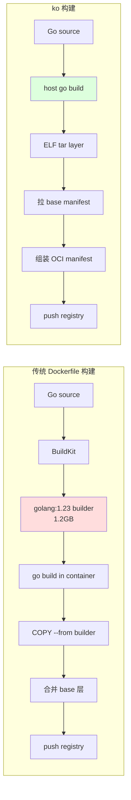

## ko 解决了什么问题

先说结论：**如果你的服务是纯 Go 写的、不需要 CGO、不需要在镜像里 shell 出来跑 shell 脚本，用 ko 能把镜像构建时间从分钟级压到秒级，同时免费送你 SBOM 和多架构支持。**

传统 Go 服务的 Dockerfile 是这样的：

```dockerfile
FROM golang:1.23 AS builder
WORKDIR /src
COPY go.mod go.sum ./
RUN go mod download
COPY . .
RUN CGO_ENABLED=0 go build -o /out/app ./cmd/server

FROM gcr.io/distroless/static-debian12:nonroot
COPY --from=builder /out/app /app
ENTRYPOINT ["/app"]
```

这个 Dockerfile 做了什么？六步：

1. 拉 `golang:1.23` base（~1.2 GB）
2. BuildKit 起 builder 容器
3. `go mod download` + `go build` 生成 ELF 二进制
4. 把 ELF 从 builder 容器里 `COPY --from` 出来
5. 和 distroless 的 base 层合并
6. 压缩 layer，生成 manifest，push 到 registry

**步骤 1、2、4、5 都是为了绕过一个事实：Docker 要求你描述"怎么在一个 Linux 环境里产出这个二进制"**。但 Go 不需要这个环境！`go build` 产出的是完全静态的 ELF，根本不需要一个 builder 容器去运行它。

ko 的设计就是："既然 Go 是纯静态编译的，那就跳过 builder 容器这一步，直接把 ELF 塞进 OCI image manifest"。它做了什么：

1. 在**宿主机**上跑 `go build`（用你本地的 Go toolchain）
2. 把产出的 ELF 二进制包成一个 tar layer
3. 拉 base image（默认 distroless static）的 manifest
4. 组装新的 manifest（base layers + 你的 ELF layer）
5. push 到 registry

没有 Docker daemon，没有 BuildKit，没有 Dockerfile。整个过程是一个 Go 程序在本地跑完的，快是必然的。



## 5 分钟上手

安装：

```bash
go install github.com/ko-build/ko@latest
# 或 brew install ko
```

最小可用命令：

```bash
cd /path/to/your/go/project
export KO_DOCKER_REPO=ghcr.io/your-org
ko build ./cmd/server
```

ko 会：

1. 编译 `./cmd/server` 为静态 ELF
2. 用默认 base image `cgr.dev/chainguard/static:latest-glibc`（0.7 → 0.15 已切到 chainguard static）
3. 推到 `ghcr.io/your-org/server-{hash}:latest`
4. 输出最终 digest

第一次跑完你会看到类似这样的输出：

```
2026/01/08 15:22:18 Using base cgr.dev/chainguard/static:latest-glibc@sha256:abcd... for github.com/org/app/cmd/server
2026/01/08 15:22:18 Building github.com/org/app/cmd/server for linux/amd64
2026/01/08 15:22:26 Publishing ghcr.io/your-org/server-2f1e...:latest
2026/01/08 15:22:29 pushed blob: sha256:...
2026/01/08 15:22:30 ghcr.io/your-org/server-2f1e9d82e33a5e8c1d0bbaf4:latest: digest: sha256:b7c... size: 752
ghcr.io/your-org/server-2f1e9d82e33a5e8c1d0bbaf4@sha256:b7c...
```

注意两点：
- Repo 名字后缀 `-2f1e9d82e33a5e8c1d0bbaf4` 是 Go import path 的 MD5。这是 ko 的默认命名策略，下面会讲怎么改。
- Tag 是 `:latest`。生产上显然不对，要改。

## .ko.yaml 配置详解

生产用法必须有 `.ko.yaml`：

```yaml
# .ko.yaml
defaultBaseImage: gcr.io/distroless/static-debian12:nonroot

# 不同 import path 用不同 base
baseImageOverrides:
  github.com/org/app/cmd/migrate: gcr.io/distroless/base-debian12:nonroot
  github.com/org/app/cmd/debug-shell: cgr.dev/chainguard/wolfi-base:latest

# 编译参数
builds:
  - id: server
    dir: .
    main: ./cmd/server
    env:
      - CGO_ENABLED=0
      - GOFLAGS=-trimpath
    flags:
      - -mod=readonly
    ldflags:
      - -s
      - -w
      - -X main.Version={{.Env.VERSION}}
      - -X main.Commit={{.Env.GIT_SHA}}
      - -X main.BuildTime={{.Env.BUILD_TIME}}
    linux_capabilities: []

# 镜像命名策略
defaultPlatforms:
  - linux/amd64
  - linux/arm64
```

逐段解释。

### defaultBaseImage：选对 base 关乎安全

ko 默认的 base image 历史变迁：

| ko 版本 | 默认 base |
|---------|-----------|
| <0.8 | `gcr.io/distroless/static:nonroot` |
| 0.9-0.14 | `cgr.dev/chainguard/static:latest` |
| 0.15+ | `cgr.dev/chainguard/static:latest-glibc` |

Chainguard 的 static base 比 Google 的 distroless 更新更勤，CVE 修复也快，但 repo 在国内访问慢。生产建议**显式 pin 一个 base + digest**：

```yaml
defaultBaseImage: cgr.dev/chainguard/static@sha256:1234567890abcdef...
```

固定 digest 的好处是构建可重现，缺点是你得定期更新。配合 Renovate bot 自动 PR 更新是最合理的做法（我们另一篇讲 Renovate）。

### baseImageOverrides：不同服务不同 base

不是每个 Go 二进制都能跑在 `distroless/static` 上。需要 libc 的（用了 net/user 的 cgo 路径，或调了 libresolv）要用 `distroless/base`；需要 shell（migrate 容器里想调 kubectl 或 psql）要用 `wolfi-base`。

ko 允许按 import path 覆盖：

```yaml
baseImageOverrides:
  # 主服务：最小 static
  github.com/org/app/cmd/server: cgr.dev/chainguard/static@sha256:aaaa...
  # migrate：需要能跑 psql
  github.com/org/app/cmd/migrate: cgr.dev/chainguard/wolfi-base@sha256:bbbb...
  # 调试用：带 shell、coreutils
  github.com/org/app/cmd/debug: cgr.dev/chainguard/busybox@sha256:cccc...
```

### ldflags 注入版本信息

ko 的 ldflags 支持 Go template，可以注入环境变量：

```yaml
builds:
  - id: server
    ldflags:
      - -s -w
      - -X main.Version={{.Env.VERSION}}
      - -X main.Commit={{.Env.GIT_SHA}}
      - -X main.BuildTime={{.Env.BUILD_TIME}}
```

对应的 Go 代码：

```go
// cmd/server/main.go
package main

var (
    Version   = "dev"
    Commit    = "unknown"
    BuildTime = "unknown"
)

func main() {
    log.Printf("starting %s (commit=%s built=%s)", Version, Commit, BuildTime)
    // ...
}
```

CI 里：

```bash
export VERSION=$(git describe --tags --always)
export GIT_SHA=$(git rev-parse HEAD)
export BUILD_TIME=$(date -u +%Y-%m-%dT%H:%M:%SZ)
ko build ./cmd/server
```

### 命名策略：PreserveImportPaths 与 BaseImportPaths

ko 默认的镜像命名是 `{KO_DOCKER_REPO}/{importPath MD5}`。这看着很丑，生产上几乎都要改。通过环境变量或 CLI flag 控制：

| 策略 | 配置 | 示例结果 |
|------|------|----------|
| 默认 | 无 | `ghcr.io/org/server-2f1e9d82...` |
| BaseImportPaths | `--base-import-paths` | `ghcr.io/org/server` |
| PreserveImportPaths | `--preserve-import-paths` | `ghcr.io/org/github.com/org/app/cmd/server` |
| Bare | `--bare` | `ghcr.io/org`（所有二进制都塞一个 repo）|

生产最推荐 `--base-import-paths`：

```bash
ko build --base-import-paths ./cmd/server
# => ghcr.io/org/server
```

一个 repo 下多个 cmd 会生成多个镜像，互不冲突。

### tags：不要只推 :latest

```bash
ko build \
  --tags ${GIT_SHA_SHORT},${VERSION},latest \
  --base-import-paths \
  ./cmd/server
```

一般我们推三个 tag：
- `sha-abc1234`：永久不可变
- `v1.2.3`：语义化版本
- `latest`：最新稳定

生产 K8s 部署用 digest（`@sha256:...`）而不是 tag 引用，tag 只是给人看的。

## 多架构构建：ko 的最大亮点

Dockerfile 多架构构建要么 QEMU 模拟（极慢）、要么多 builder 节点（复杂）。ko 不需要，因为 Go 交叉编译是一等公民：

```bash
ko build --platform=linux/amd64,linux/arm64,linux/arm/v7 ./cmd/server
```

ko 背后做的事：

1. `GOOS=linux GOARCH=amd64 go build ...` 产出 amd64 ELF
2. `GOOS=linux GOARCH=arm64 go build ...` 产出 arm64 ELF
3. `GOOS=linux GOARCH=arm GOARM=7 go build ...` 产出 arm ELF
4. 拉 base image 的 **manifest list**，取出每个架构的 layers
5. 组装三个新的 manifest（base + 对应架构的 ELF），合并成一个 manifest list 推上去

整个过程在本机 Go toolchain 完成，没有 QEMU，没有远端 builder。一个 Mac M2 在 30 秒内能跑完 3 个架构的 30 MB Go 服务。

注意 **base image 必须是 manifest list**，否则 ko 找不到非 amd64 的 base layer。Distroless 和 Chainguard 的 static/base 都是 manifest list，放心用。

## SBOM：零配置开箱即用

ko 从 0.9 开始**默认生成 SBOM**（SPDX 格式），零配置、无需安装额外工具。

```bash
ko build ./cmd/server
# SBOM 自动 push 到 registry，作为 image 的 referrer
```

拉 SBOM 有两种方式：

```bash
# 方式 1：cosign download
cosign download sbom ghcr.io/org/server:sha-abc1234 > sbom.spdx.json

# 方式 2：oras (OCI referrers)
oras discover -o json ghcr.io/org/server@sha256:... | jq
```

SBOM 里包含什么？ko 会枚举：
- Go 编译器版本（来自 `runtime.Version()`）
- 所有 go.mod 的依赖（含 indirect）
- 每个模块的 checksum（来自 go.sum）
- base image 的 layers（作为 external ref）

一个典型的 SBOM 长这样（摘录）：

```json
{
  "SPDXID": "SPDXRef-DOCUMENT",
  "spdxVersion": "SPDX-2.3",
  "name": "github.com/org/app/cmd/server",
  "packages": [
    {
      "SPDXID": "SPDXRef-Package-github.com-org-app",
      "name": "github.com/org/app",
      "versionInfo": "v1.2.3",
      "supplier": "Organization: ko-build/ko"
    },
    {
      "SPDXID": "SPDXRef-Package-github.com-gorilla-mux",
      "name": "github.com/gorilla/mux",
      "versionInfo": "v1.8.1",
      "checksums": [{"algorithm": "SHA256", "checksumValue": "..."}]
    }
  ]
}
```

不想要 SBOM 可以关掉：`--sbom=none`。

## Cosign 签名集成

ko 没内置签名，但提供了 `--image-refs` 方便配合 cosign：

```bash
ko build --image-refs=refs.txt ./cmd/server ./cmd/worker ./cmd/migrate
cat refs.txt
# ghcr.io/org/server@sha256:aaa...
# ghcr.io/org/worker@sha256:bbb...
# ghcr.io/org/migrate@sha256:ccc...

# keyless 签名（用 Sigstore 的 OIDC）
cosign sign --yes $(cat refs.txt)

# 或带 key 签名
cosign sign --key cosign.key $(cat refs.txt)
```

在 GitHub Actions 里用 OIDC keyless 签名最干净，一行环境变量：

```yaml
- name: Build and sign
  env:
    KO_DOCKER_REPO: ghcr.io/${{ github.repository_owner }}
    COSIGN_EXPERIMENTAL: "true"
  run: |
    ko build --image-refs=refs.txt --bare ./cmd/server
    cosign sign --yes $(cat refs.txt)
```

GHA 的 OIDC token 会被 cosign 交换成 Sigstore 的短期证书，签名自动上 Rekor 透明日志，下游可以通过 `cosign verify --certificate-identity=...` 校验。

## 和 Kubernetes 部署集成：ko apply

ko 还有一个杀手级功能：**在 K8s manifest 里直接写 Go import path，ko 帮你构建并替换**。

```yaml
# deploy.yaml
apiVersion: apps/v1
kind: Deployment
metadata:
  name: server
spec:
  template:
    spec:
      containers:
        - name: server
          image: ko://github.com/org/app/cmd/server  # <- 关键
          ports:
            - containerPort: 8080
```

执行：

```bash
ko apply -f deploy.yaml
```

ko 的行为：

1. 扫 yaml 里所有 `ko://` 前缀
2. 对每个 import path 执行 `ko build`
3. 替换成最终的 `registry/repo@sha256:...`
4. `kubectl apply` 替换后的 yaml

这一套对早期创业阶段的快速迭代非常爽：改代码、`ko apply -f deploy.yaml`、完事。不需要 CI 流水线，不需要 Helm，十秒内 K8s 上跑起来新版本。

生产上一般不直接 `ko apply`，而是 `ko resolve`（只生成替换后的 yaml，不 apply）：

```bash
ko resolve -f deploy.yaml > deploy-resolved.yaml
kubectl apply -f deploy-resolved.yaml  # 或交给 ArgoCD
```

这就打通了 GitOps：ko 负责构建+生成 yaml，ArgoCD 负责部署，中间通过 Git commit 交接。

## 生产集成：GitHub Actions 完整工作流

```yaml
name: build
on:
  push:
    branches: [main]
    tags: ['v*']
  pull_request:

jobs:
  build:
    runs-on: ubuntu-latest
    permissions:
      contents: read
      packages: write      # 写 GHCR
      id-token: write      # cosign keyless
    steps:
      - uses: actions/checkout@v4
      - uses: actions/setup-go@v5
        with:
          go-version: '1.23'
          cache: true

      - uses: ko-build/setup-ko@v0.8
        with:
          version: v0.18.0

      - uses: sigstore/cosign-installer@v3
        with:
          cosign-release: v2.4.1

      - name: Set version
        run: |
          echo "VERSION=$(git describe --tags --always --dirty)" >> $GITHUB_ENV
          echo "GIT_SHA=$(git rev-parse HEAD)" >> $GITHUB_ENV
          echo "BUILD_TIME=$(date -u +%Y-%m-%dT%H:%M:%SZ)" >> $GITHUB_ENV

      - name: ko build
        env:
          KO_DOCKER_REPO: ghcr.io/${{ github.repository }}
        run: |
          ko build \
            --bare \
            --platform=linux/amd64,linux/arm64 \
            --tags=${{ env.VERSION }},${GITHUB_SHA::8},latest \
            --image-refs=refs.txt \
            ./cmd/server ./cmd/worker

      - name: cosign sign
        if: github.event_name != 'pull_request'
        run: |
          cosign sign --yes $(cat refs.txt)

      - name: attest SBOM
        if: github.event_name != 'pull_request'
        run: |
          for ref in $(cat refs.txt); do
            cosign download sbom $ref > sbom.json
            cosign attest --yes --predicate sbom.json --type spdxjson $ref
          done
```

这套工作流做了：
1. Build 两个架构的镜像
2. 推到 GHCR
3. Cosign keyless 签名
4. 从 registry 拉自动生成的 SBOM
5. 作为 attestation 重新签到 Rekor 透明日志

总耗时：一个 200MB 代码量的 Go monorepo，在 GHA ubuntu-latest runner 上约 2 分 30 秒，其中 `ko build` 部分 40 秒。

## 什么时候不该用 ko

虽然我整篇都在吹 ko，但它有明确的不适用场景：

### 1. 非 Go 的服务

ko 只做 Go。Node、Python、Rust 用不了。但你可以在 Monorepo 里混用：Go 服务用 ko，其它语言用 Dockerfile + BuildKit。

### 2. 需要 CGO 的 Go 服务

ko 默认 `CGO_ENABLED=0`。你要跑 CGO（比如用 sqlite3、rocksdb、某些加密库），得在宿主机安装对应的 C 编译器和 header，而且交叉编译的复杂度指数级上升。这种场景直接走 Dockerfile。

### 3. 需要在镜像里预装大量工具

ko 的模型是 "一个 ELF + base image layer"。如果你需要在镜像里装 curl、jq、helm、kubectl 一堆工具，ko 做不到（除非换一个自带这些工具的 base image，但那就偏离 distroless 的初衷了）。

### 4. 需要复杂的 build-time 步骤

比如 `go generate` 前要先跑 `protoc` 生成 pb.go、要 `npm install` 产 frontend assets 塞进 embed。ko 只在 build 阶段跑 `go build`，其它步骤得你在调 ko 之前自己做好。

这是可以接受的，用 Makefile 串起来：

```makefile
.PHONY: build
build: gen
	ko build --bare ./cmd/server

.PHONY: gen
gen:
	protoc --go_out=. ./api/*.proto
	npm --prefix web run build
```

## 踩过的坑

### 坑 1：GOFLAGS 里有 -mod=vendor 不生效

我们项目历史原因用 vendor。`.ko.yaml` 里配了 `-mod=vendor` 但 ko 构建时报 "package not found"。

原因：ko 0.15 之前的默认行为是在每个 cmd 下单独 `go build`，忽略了项目根的 vendor 目录。解决方案：升级到 0.15+，并在 `builds` 下显式 `dir: .` 指定 module root。

### 坑 2：多架构 base image 的 glibc 坑

Chainguard 的 `static:latest` 是 musl 的；`static:latest-glibc` 是 glibc 的。如果你的 Go 代码用了 `net` 标准库的 DNS 查询（特别是 `LookupHost`），且没显式设 `GODEBUG=netdns=go`，会走 cgo 的 `getaddrinfo`，需要 glibc。

症状：镜像跑起来，但 DNS 查询静默失败。

两种修法二选一：
- base 改成 `static:latest-glibc`
- 环境变量或代码设 `GODEBUG=netdns=go` 强制用 Go 的纯 DNS resolver

### 坑 3：debug 镜像没 shell 怎么办

Distroless static 没 shell、没 coreutils。生产调试时要 `kubectl exec -it pod sh` 是进不去的。

两种办法：

1. **Ephemeral container**：K8s 1.25+ 支持临时容器，`kubectl debug pod -it --image=busybox` 可以塞一个 busybox 进去不影响主容器。
2. **debug tag**：ko 构建一份 debug tag 用 `gcr.io/distroless/base:debug`（带 busybox shell），平时用 `nonroot`，需要时切 tag。

```yaml
baseImageOverrides:
  github.com/org/app/cmd/server: gcr.io/distroless/static-debian12:nonroot
```

然后 ad-hoc 构建 debug 版：

```bash
KO_DEFAULTBASEIMAGE=gcr.io/distroless/static-debian12:debug-nonroot \
  ko build --tags=debug ./cmd/server
```

### 坑 4：私有 module 拉不下来

ko 在宿主机跑 `go build`，意味着它继承你宿主的 `GOPROXY`、`GONOSUMCHECK`、`GIT_TERMINAL_PROMPT`、`~/.netrc`。CI 里如果你的 Go 私有模块要走 SSH key，需要在 `ko build` 之前：

```bash
git config --global url."git@github.com:".insteadOf "https://github.com/"
export GOPRIVATE=github.com/org/*
export GOSUMDB=off
```

然后 ko 才能正常拉私有 mod。

## 迁移 200 个 Go 服务的实战数据

我们把一个大型 Monorepo 里 200+ 个 Go 微服务从 Dockerfile+BuildKit 迁到 ko，过程大致：

**阶段 1：POC（1 周）**

选 3 个代表性服务（一个大服务、一个 migrate、一个需要额外文件的）验证 ko 可行性。踩完 cgo、vendor、私有 mod 这几个坑。

**阶段 2：基础设施准备（2 周）**

- 写一套 `make ko-build` 的 Makefile 模板
- 写一个 GHA composite action 封装 `setup-ko + cosign + build`
- 定一个组织级 `.ko.yaml` base image pin 策略，用 Renovate 管更新

**阶段 3：批量迁移（6 周）**

一个小组一周迁 20-30 个服务。关键在于**双写期**：同一个服务既出 Dockerfile 镜像也出 ko 镜像，跑一周确认无异常后下线 Dockerfile。

**阶段 4：清理（2 周）**

删掉老 Dockerfile、下线对应 BuildKit CI job、回收 builder runner。

最终收益：

| 指标 | 迁移前 | 迁移后 | 改善 |
|------|--------|--------|------|
| 平均镜像构建时间 | 2 分 40 秒 | 35 秒 | -78% |
| 最终镜像大小 | 45 MB | 19 MB | -58% |
| CI 构建 runner CPU 占用 | 2 核 | 0.5 核 | -75% |
| 每月 CI 费用 | $3800 | $1200 | -68% |
| 供应链合规审计时间 | 2 天/次 | 2 小时/次 | 通过自动 SBOM |

最大的意外收益是 CI 费用。Dockerfile + BuildKit 的 CPU 占用在 Monorepo 全量构建时会冲到几十核，ko 在纯交叉编译场景 CPU 占用极低，runner 可以用小得多的规格。

## 结语

ko 是少见的 "把一件事做到极致" 的工具：只服务 Go、只生成 OCI 镜像、跳过 Docker 整套抽象。因为限定了输入，所以能做到秒级构建、自动 SBOM、无 daemon、交叉编译一等公民。

判断标准：如果你的服务是 "Go 源码 + 一个 ELF 跑在 distroless 里"，用 ko。如果涉及多语言、cgo、复杂 build-time 步骤，继续用 Dockerfile + BuildKit，但 Go 的部分依然可以用 ko 绕过。

下一步看看 Dagger（我们另一篇），它提供的是另一种抽象：不丢 Dockerfile 的灵活性，但用 Go/Python/TypeScript 代码写流水线。ko 和 Dagger 并不冲突，甚至在 Dagger pipeline 里调 ko 构建 Go 服务是最自然的组合。

Sources:
- [ko official site](https://ko.build/)
- [ko build reference](https://ko.build/reference/ko_build/)
- [ko SBOMs](https://ko.build/features/sboms/)
- [Building Go Containers with ko - Chainguard Academy](https://edu.chainguard.dev/chainguard/chainguard-images/tooling/building-go-containers-with-ko/)
- [Automatic SBOMs with ko - Chainguard](https://www.chainguard.dev/unchained/automatic-sboms-with-ko)
