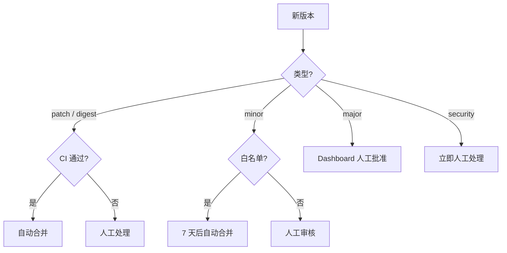

## 为什么是 Renovate

每个稍微有规模的团队都会碰到"依赖升级" 这件事：

- Node 项目 `package.json` 里有 80 个依赖，半年后一堆 CVE 和过期警告
- Go module 慢慢叠到 150 个依赖，某个间接依赖的漏洞修复你要手动升
- Dockerfile 里 `FROM node:20.5.0`，三个月后 20.10.0 出来了，你没察觉
- Kubernetes Helm chart 的 `image.tag` 一年没动过
- GitHub Actions 的 `actions/checkout@v3`，其实 v4 早就出来了

一两个项目手动升级还行，20+ 项目 * 10 种依赖类型 = 指数级维护负担。

主流自动化方案三个：

| 工具 | 维护方 | 支持范围 | 自定义能力 | Self-host |
|------|--------|----------|-----------|-----------|
| **Dependabot** | GitHub (MS) | 主流包管理器（npm/pip/go/docker/actions 等）| 基础分组、schedule | 不支持 |
| **Renovate** | Mend (前 WhiteSource) | 90+ 包管理器 | 极强（package rules、regex manager） | 完整支持 |
| **Snyk** | Snyk | 聚焦漏洞和许可证 | 中 | 商业 |

**选 Renovate 的理由**：
1. **覆盖面最广**：Helm chart、Terraform module、GitHub Actions、Docker tag、Dockerfile、helm-values、buildpacks、PHP composer……只要你说得出名字它都支持
2. **Self-host 开源**：公司内部仓库、私有网络完全 OK，不用把代码暴露给 SaaS
3. **配置灵活度极高**：package rules 能 match 任何维度（包名、更新类型、manager、文件路径），可以做到"生产镜像只升 patch，dev 依赖升 major"这种精细控制
4. **成熟稳定**：已经运行多年，核心 bug 基本收敛

## 5 分钟跑起来

Renovate 有两种用法：**GitHub App** 和 **Self-hosted**。

### 方式 1：GitHub App（推荐先试）

1. 访问 [Mend Renovate](https://github.com/apps/renovate) 安装 App
2. 选中要启用的仓库
3. Renovate 会自动给你的仓库发一个 "Configure Renovate" PR
4. 合并 PR，Renovate 开始工作

Renovate 会自动扫描仓库里的：
- `package.json` (npm/yarn/pnpm)
- `go.mod`
- `requirements.txt` / `pyproject.toml`
- `Dockerfile`
- `.github/workflows/*.yml`
- `Chart.yaml` (helm)
- `main.tf` / `*.tf`
- 30+ 种其它文件

然后一个个发 PR 升级。

### 方式 2：Self-hosted（企业用）

Self-host 适合：
- 私有 GitLab / Gitea / Bitbucket
- 敏感代码不上 SaaS
- 需要自定义 presets、插件

最简单的 self-host 是一个定时 CronJob：

```yaml
# renovate-cronjob.yaml
apiVersion: batch/v1
kind: CronJob
metadata:
  name: renovate
  namespace: devops
spec:
  schedule: "0 */6 * * *"  # 每 6 小时
  jobTemplate:
    spec:
      template:
        spec:
          containers:
            - name: renovate
              image: ghcr.io/renovatebot/renovate:39
              env:
                - name: RENOVATE_PLATFORM
                  value: github
                - name: RENOVATE_ENDPOINT
                  value: https://github.example.com/api/v3
                - name: RENOVATE_TOKEN
                  valueFrom:
                    secretKeyRef:
                      name: renovate-secrets
                      key: github-token
                - name: RENOVATE_AUTODISCOVER
                  value: "true"
                - name: RENOVATE_AUTODISCOVER_FILTER
                  value: "org/*"
                - name: LOG_LEVEL
                  value: info
              resources:
                requests:
                  cpu: 500m
                  memory: 1Gi
                limits:
                  cpu: 2000m
                  memory: 4Gi
          restartPolicy: OnFailure
```

每 6 小时扫一遍组织下所有仓库。也可以用 webhook 模式响应 push 事件，但 CronJob 更稳。

## renovate.json 配置详解

Renovate 的配置文件 `renovate.json`（或 `.github/renovate.json`、`renovate.json5`、`.renovaterc.json`）。

### 最小可用配置

```json
{
  "$schema": "https://docs.renovatebot.com/renovate-schema.json",
  "extends": [
    "config:recommended"
  ]
}
```

`config:recommended` 是 Renovate 官方的"推荐最佳实践"合集，包含：

- `config:base` 的所有内容
- `:dependencyDashboard`：启用依赖看板
- `:semanticCommits`：commit message 符合 Conventional Commits
- `:ignoreUnstable`：不升级到不稳定版本（alpha/beta/rc）
- `:prImmediately`：立即发 PR（vs 等待一个时间窗口）

对小项目这一行配置就够了。

### 生产级配置

```json
{
  "$schema": "https://docs.renovatebot.com/renovate-schema.json",
  "extends": [
    "config:recommended",
    ":semanticCommits",
    ":dependencyDashboard",
    ":automergeDigest",
    ":automergePatch",
    "group:monorepos",
    "helpers:pinGitHubActionDigests"
  ],
  "timezone": "Asia/Shanghai",
  "schedule": [
    "after 1am and before 7am every weekday",
    "every weekend"
  ],
  "labels": ["dependencies", "automated"],
  "reviewers": ["team:platform"],
  "prConcurrentLimit": 10,
  "prHourlyLimit": 2,
  "rebaseWhen": "conflicted",
  "branchPrefix": "renovate/",
  "rangeStrategy": "bump",
  "semanticCommitType": "chore",
  "semanticCommitScope": "deps",

  "packageRules": [
    {
      "matchUpdateTypes": ["patch", "pin", "digest"],
      "automerge": true,
      "automergeType": "pr",
      "platformAutomerge": true
    },
    {
      "matchUpdateTypes": ["major"],
      "dependencyDashboardApproval": true,
      "labels": ["dependencies", "major-update"]
    },
    {
      "matchManagers": ["dockerfile"],
      "matchPackagePatterns": ["node", "golang", "python"],
      "matchUpdateTypes": ["major", "minor"],
      "enabled": false,
      "description": "Never auto-upgrade language runtime in Dockerfile"
    },
    {
      "matchPackagePatterns": ["^@types/"],
      "groupName": "TypeScript definitions",
      "automerge": true
    },
    {
      "matchManagers": ["github-actions"],
      "groupName": "GitHub Actions",
      "automerge": true,
      "schedule": ["before 9am on monday"]
    },
    {
      "matchCategories": ["kubernetes"],
      "groupName": "Kubernetes ecosystem",
      "schedule": ["before 9am on monday"]
    },
    {
      "matchPackageNames": ["kubectl", "helm", "kustomize"],
      "allowedVersions": "!/^0\\.[0-9]+\\.[0-9]+/",
      "description": "Ignore 0.x versions (pre-release)"
    }
  ],

  "vulnerabilityAlerts": {
    "enabled": true,
    "labels": ["security", "dependencies"],
    "schedule": ["at any time"]
  },

  "lockFileMaintenance": {
    "enabled": true,
    "schedule": ["before 5am on monday"]
  }
}
```

逐段解释。

### extends 和 presets

`extends` 让你继承预设。Renovate 内置一堆 presets，前缀 `config:`、`:`、`group:`、`helpers:` 等。常用：

| Preset | 作用 |
|--------|------|
| `config:recommended` | 推荐合集 |
| `:dependencyDashboard` | 启用 Dashboard |
| `:semanticCommits` | semantic commit |
| `:automergePatch` | 自动合并 patch 更新 |
| `:automergeMinor` | 自动合并 minor |
| `:automergeDigest` | 自动合并 docker digest 更新 |
| `group:monorepos` | 自动分组 monorepo 的包 |
| `helpers:pinGitHubActionDigests` | 把 actions pin 到 SHA |

你也可以自己写 preset 放在一个公共仓库，其它仓库用 `extends: ["github>org/renovate-config"]` 引用。这是组织级统一配置的最佳方案，下面会讲。

### schedule

Renovate 默认任何时候都发 PR，发得太密会刷屏。用 `schedule` 限定时间：

```json
"schedule": [
  "after 1am and before 7am every weekday",
  "every weekend"
]
```

这会让 Renovate 只在工作日凌晨 1-7 点和周末发 PR。我们团队用 "every weekend" + "early morning on Monday"，避免工作时间打扰。

schedule 支持的语法非常丰富，参考[文档](https://docs.renovatebot.com/key-concepts/scheduling/)。

### packageRules：精细控制

`packageRules` 是一个数组，每个元素是 "匹配条件 + 应用设置"。匹配条件可以是：

- `matchManagers`：匹配 manager（npm、dockerfile、github-actions 等）
- `matchPackageNames`：精确包名
- `matchPackagePatterns`：正则包名
- `matchUpdateTypes`：major/minor/patch/pin/digest
- `matchDepTypes`：依赖类型（devDependencies、dependencies）
- `matchCategories`：预定义类别（`kubernetes`、`ci`、`python` 等）
- `matchFileNames`：文件路径 glob

应用设置：

- `automerge`：是否自动合并
- `groupName`：分组名字（同一组的多个升级合并到一个 PR）
- `enabled`：是否启用
- `schedule`：这条规则的专属调度
- `labels`：PR 的标签
- `allowedVersions`：允许的版本范围
- `reviewers`：PR reviewer

### 规则的匹配优先级

多条规则能同时匹配同一个包，后面的会覆盖前面的。例如：

```json
"packageRules": [
  { "matchUpdateTypes": ["patch"], "automerge": true },
  { "matchPackageNames": ["react"], "automerge": false }
]
```

`react` 的 patch 升级**不会**自动合并（第二条规则覆盖第一条）。写规则时注意顺序。

## 自动合并的安全策略

自动合并是 Renovate 最有价值但也最危险的特性。配不好会误合并引入 bug 的版本。

### 层级策略

我们的原则是**按风险分层**：



对应配置：

```json
"packageRules": [
  {
    "description": "Patch 自动合并：CI 通过即合",
    "matchUpdateTypes": ["patch", "pin", "digest"],
    "automerge": true,
    "platformAutomerge": true,
    "minimumReleaseAge": "3 days"
  },
  {
    "description": "Minor 升级：等 7 天 + CI 通过自动合并（白名单包）",
    "matchPackageNames": [
      "typescript",
      "eslint",
      "prettier",
      "vitest",
      "jest",
      "@types/**"
    ],
    "matchUpdateTypes": ["minor"],
    "automerge": true,
    "minimumReleaseAge": "7 days"
  },
  {
    "description": "Major 升级：人工批准",
    "matchUpdateTypes": ["major"],
    "dependencyDashboardApproval": true
  },
  {
    "description": "Security：立即人工处理",
    "matchDatasources": ["npm"],
    "matchUpdateTypes": ["patch", "minor"],
    "vulnerabilityAlerts": {
      "enabled": true,
      "minimumReleaseAge": null
    }
  }
]
```

`minimumReleaseAge: "3 days"` 是**关键的保险**：一个新版本发布不到 3 天时，Renovate 不会升级。这能防止 "npm 包刚发布有 bug / 供应链攻击" 的场景。社区的常见实践是 patch 3 天、minor 7 天、major 14 天。

### platformAutomerge vs Renovate automerge

两种自动合并：

- **Renovate automerge**：Renovate 本身周期性检查 PR 状态，满足条件时合并。延迟 15 分钟-1 小时。
- **platformAutomerge**：启用 GitHub 的 auto-merge 功能，PR 一开就挂 auto-merge 标记，CI 通过立即合并。秒级。

后者更快，但要求仓库开启 GitHub auto-merge（Settings → Allow auto-merge）。我们推荐用 `platformAutomerge: true`。

## Dependency Dashboard

这是 Renovate 的秘密武器。启用后它会在仓库创建一个 GitHub Issue，展示：

- 所有 pending 升级（包括未开 PR 的）
- 已创建但等待 approval 的 major 升级
- 被 rate limit 暂缓的升级
- 最近被关闭的 PR
- 配置错误 / 解析失败的警告

一个示例看板：

```
## Open

These updates have all been created already. Click a checkbox below to force a retry/rebase.

- [ ] fix(deps): update dependency axios to v1.7.3
- [ ] chore(deps): update github-actions (major)

## Pending Approval

These dependency updates are awaiting approval. To trigger, click the checkbox.

- [ ] chore(deps): update dependency react to v19 (major)

## Pending Status Checks

- [ ] fix(deps): update dependency typescript to v5.7.0

## Rate Limited

- [ ] chore(deps): update dependency lodash to v4.17.22

## Errored

- chore(deps): update dependency foo to v2 (error: ...)
```

点 checkbox 可以手动触发某个动作（比如 "re-create PR"、"approve major"）。这个 Issue 驱动的交互比传统 PR 列表好用得多。

## GitHub Actions 的 digest pin

这是 Renovate 另一个隐藏神技。大部分人写 GHA：

```yaml
- uses: actions/checkout@v4
```

这是 risk：`v4` 是一个 tag，可以被 action 作者重新打。历史上有过 action 作者被盗号导致恶意代码通过 `v4` tag 分发的事件。

安全做法是 pin 到 commit SHA：

```yaml
- uses: actions/checkout@b4ffde65f46336ab88eb53be808477a3936bae11 # v4.1.1
```

Renovate 提供 `helpers:pinGitHubActionDigests` preset 自动把所有 `@v4` 改成 `@<sha> # v4`。升级时 Renovate 会同时更新 SHA 和 tag 注释，PR 里能看到 "从 v4.1.1 升到 v4.2.0"。

这个特性让"GHA 供应链安全"从"零星 review" 变成"100% 覆盖 + 自动维护"。强烈推荐生产启用。

## 组织级配置：preset 仓库

20+ 仓库各自维护 renovate.json 会失控。正确姿势是 **写一个共享 preset 仓库**：

```
# github.com/org/renovate-config
├── default.json        # 默认配置
├── security.json       # 只管安全更新
├── aggressive.json     # 激进策略（all automerge）
└── docker-only.json    # 只处理 Docker
```

`default.json`：

```json
{
  "$schema": "https://docs.renovatebot.com/renovate-schema.json",
  "extends": [
    "config:recommended",
    ":dependencyDashboard",
    ":semanticCommits",
    "helpers:pinGitHubActionDigests"
  ],
  "timezone": "Asia/Shanghai",
  "schedule": ["before 9am on monday"],
  "prConcurrentLimit": 10,
  "packageRules": [
    {
      "matchUpdateTypes": ["patch", "digest"],
      "automerge": true,
      "platformAutomerge": true,
      "minimumReleaseAge": "3 days"
    }
  ]
}
```

业务仓库的 `renovate.json`：

```json
{
  "extends": ["github>org/renovate-config"]
}
```

一行！之后任何策略调整都在 `renovate-config` 仓库改，所有业务仓库自动生效。这是大规模管理 Renovate 的核心技巧。

## Regex Manager：扩展到任意文件

Renovate 内置 90+ manager，但总有不支持的场景。比如你有一个 shell 脚本：

```bash
#!/bin/bash
KUBECTL_VERSION=1.30.5
HELM_VERSION=3.15.2
```

想要 Renovate 自动升级这两个版本号。用 **Regex Manager**：

```json
{
  "customManagers": [
    {
      "customType": "regex",
      "fileMatch": ["^scripts/install\\.sh$"],
      "matchStrings": [
        "KUBECTL_VERSION=(?<currentValue>.*?)\\n",
        "HELM_VERSION=(?<currentValue>.*?)\\n"
      ],
      "datasourceTemplate": "github-releases",
      "depNameTemplate": "kubernetes/kubernetes",
      "versioningTemplate": "semver"
    }
  ]
}
```

还可以用 annotation 风格，在脚本里嵌入 Renovate hint：

```bash
# renovate: datasource=github-releases depName=kubernetes/kubernetes
KUBECTL_VERSION=1.30.5
```

然后配置：

```json
{
  "customManagers": [{
    "customType": "regex",
    "fileMatch": ["^scripts/.*\\.sh$"],
    "matchStrings": [
      "# renovate: datasource=(?<datasource>.*?) depName=(?<depName>.*?)\\s+\\w+=(?<currentValue>.*?)\\s"
    ]
  }]
}
```

这让 Renovate 能管理**任何文件里的版本号**，不限于包管理器。生产实践里我们用这个管理：

- Dockerfile 里的 `ARG GO_VERSION=...`
- Helm values 里的 image tag
- Shell 脚本里的工具版本
- Markdown 文档里的"支持版本"

## Self-host 运行的坑

### 坑 1：GitHub API rate limit

Renovate 每次运行要大量调用 GitHub API。10+ 仓库规模很容易打到 rate limit（5000 requests/hour for user tokens）。

解决：
1. **用 GitHub App token**：limit 是 15000/hour，而且按仓库数量扩展
2. **GITHUB_COM_TOKEN**：把一个 github.com 的 token 单独配给 Renovate 用来查 github.com 上的包版本信息（而不是用主 token）

```bash
RENOVATE_TOKEN=<main-token>
GITHUB_COM_TOKEN=<pat-for-github-com-queries>
```

### 坑 2：Private registry 认证

Renovate 要去 npm private registry、私有 Docker registry 查版本，需要认证：

```json
{
  "hostRules": [
    {
      "matchHost": "npm.example.com",
      "username": "bot",
      "password": "{{ env.NPM_REGISTRY_PASSWORD }}"
    },
    {
      "matchHost": "registry.example.com",
      "hostType": "docker",
      "username": "bot",
      "password": "{{ env.DOCKER_REGISTRY_PASSWORD }}"
    }
  ]
}
```

对应环境变量要在 CronJob 里注入。

### 坑 3：磁盘 IO 慢

Renovate 会为每个仓库 clone 一份到本地临时目录，扫依赖、生成 PR、清理。100+ 仓库的组织一次扫可能要 30-60 分钟，大部分时间花在 git clone 和 npm install 上。

优化：
- 挂大的 EmptyDir 或 local SSD PVC 做临时目录
- 限制只 clone 浅层：`--depth=1`（Renovate 默认就是浅 clone）
- 分批跑：用多个 CronJob，每个负责一部分仓库

### 坑 4：PR 太多刷屏

没有好的限流，Renovate 可能一次给你发 50 个 PR，同事会疯。

用 `prConcurrentLimit` 限制单仓库最大并发 PR 数，`prHourlyLimit` 限制每小时最多发多少个：

```json
{
  "prConcurrentLimit": 10,
  "prHourlyLimit": 2
}
```

超限的 PR 会进 Dependency Dashboard 的 "Rate Limited" 区，下一次运行再尝试。

## 落地数据

我们公司约 200 个仓库，覆盖 Go、Node、Python、Dockerfile、Helm、Terraform、GHA 各种依赖。开 Renovate 大约一年后的数据：

| 指标 | 开 Renovate 前 | 开 Renovate 后 |
|------|----------------|----------------|
| 依赖平均 age | 8 个月 | 6 周 |
| 有未修复 CVE 的仓库 | 45 | 4 |
| 手动升级依赖耗时/周 | 10-15 人时 | 1-2 人时 |
| 因依赖升级引入的 bug | 2-3 个/月 | 0-1 个/月 |
| Patch 自动合并率 | - | 85% |

最关键的收益是 **CVE 修复速度**：从 "发现漏洞到升级" 从几周压到几天，因为 Renovate 的 `vulnerabilityAlerts` 会立即发 PR。

## 结语

Renovate 是 DevOps 工具链里 "投入最低、收益最高" 的几个工具之一。对绝大多数项目来说：

1. **第一步**：`renovate.json` 只写 `extends: ["config:recommended"]`
2. **第二步**：开启 patch 自动合并 + platformAutomerge
3. **第三步**：写组织级 preset 仓库
4. **第四步**：用 customManagers 扩展到非标准文件

这四步走完，你的依赖升级基本变成"背景任务"——每周一早上看看 Dependency Dashboard，决定要不要 approve 几个 major 升级，其它 Renovate 全自动处理。

对比同类工具：Dependabot 功能太基础（分组、schedule 都弱）、Snyk 聚焦安全更细但依赖升级不如 Renovate。2026 年新项目做 CI 规划，依赖升级环节 Renovate 依然是默认选项。

Sources:
- [Renovate Docs - Configuration Options](https://docs.renovatebot.com/configuration-options/)
- [Renovate Docs - Dependency Dashboard](https://docs.renovatebot.com/key-concepts/dashboard/)
- [Renovate Docs - Scheduling](https://docs.renovatebot.com/key-concepts/scheduling/)
- [Renovate Docs - Default Presets](https://docs.renovatebot.com/presets-default/)
- [Renovate Bot Tutorial - vife.ai](https://vife.ai/blog/mastering-dependency-automation-renovate-bot-tutorial)
