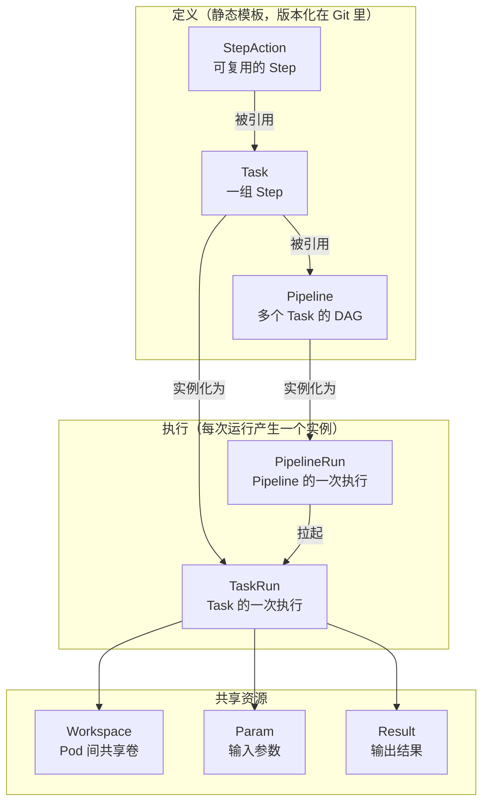
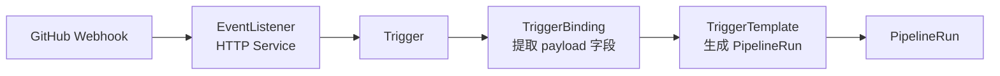

## 为什么选 Tekton

CI 工具有很多：Jenkins、GitLab CI、GitHub Actions、CircleCI、Argo Workflows、Buildkite、Drone、Concourse……Tekton 的差异点非常明确：

- **Kubernetes Native**：所有对象都是 CRD（Task、Pipeline、PipelineRun、TaskRun、StepAction），执行就是起 Pod。没有单独的 agent，没有 daemon，没有 master-worker。
- **组件化抽象**：Task 是可复用单元，Pipeline 组合 Task，PipelineRun 是一次执行实例。天然解耦"流程定义"和"流程实例"。
- **供应链安全一等公民**：Tekton Chains 自动为每个 TaskRun 生成 SLSA Provenance 并签名，是 Sigstore 生态的原生集成。
- **CNCF Graduated**：2024 年 CNCF 毕业，2025 年 Pipelines 1.0 GA，稳定性和向后兼容有明确承诺。

反过来说，Tekton 也不适合所有场景。它的劣势同样明确：

- **没有 UI**：官方只有 Tekton Dashboard 这种"够用"的页面，要做企业级观测必须自己搭（或者上 Backstage、Jenkins X、OpenShift Pipelines）。
- **YAML 膨胀**：一个中等复杂度的 Pipeline 动辄数百行 YAML，没有高级抽象。
- **触发器体系复杂**：Triggers 组件和 Pipelines 组件分开演进，EventListener + TriggerBinding + TriggerTemplate 三层概念学习曲线陡。

如果你在 K8s 上已经跑了很多服务，想要一个"也跑在 K8s 里、能用声明式 YAML 管理、能接入 GitOps、能做供应链签名" 的 CI 引擎，Tekton 是最好的选择。如果你想要一个"开箱即用、有漂亮 UI、开发者友好"的 CI，去选 GitHub Actions 或 GitLab。

## 核心概念一次讲清楚

Tekton 的抽象层次：



### Step 与 StepAction

最小的执行单元是 **Step**：一个 Step 对应 Pod 里的一个容器。

```yaml
apiVersion: tekton.dev/v1
kind: Task
metadata:
  name: say-hello
spec:
  steps:
    - name: hello
      image: alpine:3.20
      script: |
        #!/bin/sh
        echo "Hello from Tekton"
```

StepAction 是 Step 的可复用版本（Pipelines 1.0 GA）：

```yaml
apiVersion: tekton.dev/v1beta1
kind: StepAction
metadata:
  name: git-clone
spec:
  params:
    - name: url
    - name: revision
      default: main
  image: alpine/git:2.43
  script: |
    #!/bin/sh
    git clone $(params.url) /workspace/source
    cd /workspace/source && git checkout $(params.revision)
```

然后在 Task 里引用：

```yaml
apiVersion: tekton.dev/v1
kind: Task
metadata:
  name: build
spec:
  steps:
    - name: clone
      ref:
        name: git-clone
      params:
        - name: url
          value: $(params.repo-url)
    - name: build
      image: golang:1.23
      script: ...
```

StepAction 之前，Tekton 社区推荐的复用方式是"整个 Task 复用"，但 Task 粒度太粗，很多时候你只想复用一个 step（比如 git clone）。StepAction 是最近两年最重要的特性之一，务必用起来。

### Task 与 Pipeline

Task 是一个完整的执行单元，对应一个 Pod（多个 Step 是 Pod 里的顺序容器）。

```yaml
apiVersion: tekton.dev/v1
kind: Task
metadata:
  name: go-build
spec:
  params:
    - name: package
      description: Go package to build
    - name: ldflags
      default: ""
  workspaces:
    - name: source
  results:
    - name: binary-digest
      description: SHA256 of the built binary
  steps:
    - name: build
      image: golang:1.23
      workingDir: $(workspaces.source.path)
      env:
        - name: CGO_ENABLED
          value: "0"
      script: |
        #!/bin/sh
        set -e
        go build -ldflags "$(params.ldflags)" -o /out/app $(params.package)
        sha256sum /out/app | awk '{print $1}' > $(results.binary-digest.path)
    - name: verify
      image: alpine:3.20
      script: |
        DIGEST=$(cat $(results.binary-digest.path))
        echo "Built binary digest: $DIGEST"
```

Pipeline 把多个 Task 组成 DAG：

```yaml
apiVersion: tekton.dev/v1
kind: Pipeline
metadata:
  name: build-and-deploy
spec:
  params:
    - name: repo-url
    - name: revision
      default: main
  workspaces:
    - name: shared-data
  tasks:
    - name: fetch
      taskRef:
        name: git-clone
      workspaces:
        - name: output
          workspace: shared-data
      params:
        - name: url
          value: $(params.repo-url)
        - name: revision
          value: $(params.revision)

    - name: lint
      runAfter: [fetch]
      taskRef:
        name: golangci-lint
      workspaces:
        - name: source
          workspace: shared-data

    - name: test
      runAfter: [fetch]
      taskRef:
        name: go-test
      workspaces:
        - name: source
          workspace: shared-data

    - name: build
      runAfter: [lint, test]
      taskRef:
        name: go-build
      workspaces:
        - name: source
          workspace: shared-data
      params:
        - name: package
          value: ./cmd/server

    - name: deploy
      runAfter: [build]
      taskRef:
        name: kubectl-apply
      params:
        - name: digest
          value: $(tasks.build.results.binary-digest)
```

注意 `runAfter`：`lint` 和 `test` 都只 `runAfter: [fetch]`，意味着它们会并发执行；`build` 要等两者都结束。这个并发调度是 Tekton 自动做的，你不需要像 Jenkins Pipeline 那样手写 `parallel { ... }`。

## Workspaces：数据在 Task 间怎么传

Tekton 的哲学："Task 是独立的 Pod，Pod 之间不共享本地磁盘"。但实际 CI 流水线里，git clone 的结果要传给 go build，go build 的产物要传给 docker build。这需要 **Workspace**。

Workspace 在 PipelineRun 时被绑定到一个实际的卷：

```yaml
apiVersion: tekton.dev/v1
kind: PipelineRun
metadata:
  generateName: build-and-deploy-
spec:
  pipelineRef:
    name: build-and-deploy
  workspaces:
    - name: shared-data
      volumeClaimTemplate:     # 自动创建 PVC
        spec:
          accessModes: [ReadWriteOnce]
          resources:
            requests:
              storage: 10Gi
          storageClassName: gp3
  params:
    - name: repo-url
      value: https://github.com/org/app
```

`volumeClaimTemplate` 意味着每次 PipelineRun 自动创建一个新的 PVC，Run 结束后（配置了 `--delete-pvcs`）PVC 被删。好处是隔离性高，坏处是每次 PR build 都要创建 PVC，k8s 集群的 CSI driver 性能差时会变成瓶颈。

Workspace 还有其它绑定方式：

| 绑定方式 | 用途 |
|---------|------|
| `volumeClaimTemplate` | 每次 Run 创建 PVC（主力方式）|
| `persistentVolumeClaim` | 共用一个已有 PVC（谨慎用，会跨 Run 污染）|
| `configMap` / `secret` | 只读挂载配置/密钥 |
| `emptyDir` | 不跨 Task 共享，只在单 Task 多 Step 间共享 |
| `projected` | 多源投影，用于 Chains 签名场景 |

### Workspaces 和 Affinity Assistant

默认情况下，多个 Task 要共享同一个 ReadWriteOnce 的 PVC，必然要求所有 Task Pod 都调度到同一个 Node。Tekton 有一个 **Affinity Assistant** 的机制：自动往 Task Pod 上加 Node Affinity，把它们固定到同一个 Node。

在 Pipelines 1.0 之前这是通过 `feature-flag` 控制的（早期甚至是 deprecated 状态）。现在的推荐做法是：**用 ReadWriteMany 的 StorageClass（EFS、AzureFile）或者 TaskRun 间不共享 PVC**。

一个更优雅的模式：用 `oci bundle` 或 `git resolver` 让 Task 从远端拉取自己需要的 artifact，而不是依赖共享 Workspace。这样 Task 间完全独立，可以在不同 Node 上并发跑。

## Resolvers：从 Git/Bundle/Hub 拉取定义

Tekton Pipelines 1.0 之前，Task 和 Pipeline 必须先 `kubectl apply` 到集群里才能用 `taskRef.name` 引用。这对 GitOps 非常不友好：你要在两个地方管理流水线定义（Git 和 K8s API）。

**Resolver** 解决了这个问题：

```yaml
apiVersion: tekton.dev/v1
kind: Pipeline
metadata:
  name: example
spec:
  tasks:
    - name: fetch
      taskRef:
        resolver: git
        params:
          - name: url
            value: https://github.com/tektoncd/catalog.git
          - name: revision
            value: main
          - name: pathInRepo
            value: task/git-clone/0.9/git-clone.yaml
      workspaces:
        - name: output
          workspace: source
```

这意味着 Task 定义**不需要**预先 apply 到集群，Pipeline 运行时 Tekton Resolver 自动从远端拉取、缓存、实例化。

支持的 resolver：

| Resolver | 用途 | 示例 |
|----------|------|------|
| `git` | 从 Git 拉 | 业务自定义的 Task 库 |
| `bundles` | 从 OCI 镜像拉 | 固化后的生产 Task |
| `cluster` | 从同集群其它 namespace | 内部复用 |
| `hub` | 从 Tekton Hub 拉 | 社区开源 Task |
| `http` | 从 HTTP URL 拉 | 简单场景 |

**生产推荐 bundles resolver**：

```yaml
taskRef:
  resolver: bundles
  params:
    - name: bundle
      value: registry.example.com/tekton/task-go-build@sha256:abc...
    - name: name
      value: go-build
    - name: kind
      value: task
```

把 Task 打成 OCI bundle 有几个好处：

1. **不可变**：bundle 用 digest 引用，不会被意外改变
2. **签名**：可以用 cosign 签 bundle，保证来源可信
3. **版本化**：bundle 的 tag 就是版本号
4. **离线可用**：bundle 缓存在 registry，不依赖 Git 可达

打 bundle 的命令（用 `tkn` CLI）：

```bash
tkn bundle push registry.example.com/tekton/task-go-build:0.3.0 \
  -f task/go-build.yaml

# 配 digest 引用
DIGEST=$(crane digest registry.example.com/tekton/task-go-build:0.3.0)
echo "registry.example.com/tekton/task-go-build@${DIGEST}"
```

## Triggers：从 Git webhook 到 PipelineRun

Tekton Pipelines 本身只管 "执行 Pipeline"，不管 "什么时候触发"。触发功能由独立的 Tekton Triggers 组件提供。

Triggers 的核心概念：



一个最小可用配置：

```yaml
---
apiVersion: triggers.tekton.dev/v1beta1
kind: EventListener
metadata:
  name: github-listener
spec:
  serviceAccountName: tekton-triggers-sa
  triggers:
    - name: github-push
      interceptors:
        - ref:
            name: github
          params:
            - name: secretRef
              value:
                secretName: github-webhook-secret
                secretKey: token
            - name: eventTypes
              value: [push]
      bindings:
        - ref: github-push-binding
      template:
        ref: build-trigger-template
---
apiVersion: triggers.tekton.dev/v1beta1
kind: TriggerBinding
metadata:
  name: github-push-binding
spec:
  params:
    - name: git-revision
      value: $(body.head_commit.id)
    - name: git-repo-url
      value: $(body.repository.clone_url)
    - name: git-repo-name
      value: $(body.repository.name)
---
apiVersion: triggers.tekton.dev/v1beta1
kind: TriggerTemplate
metadata:
  name: build-trigger-template
spec:
  params:
    - name: git-revision
    - name: git-repo-url
    - name: git-repo-name
  resourcetemplates:
    - apiVersion: tekton.dev/v1
      kind: PipelineRun
      metadata:
        generateName: $(tt.params.git-repo-name)-build-
      spec:
        pipelineRef:
          name: build-and-deploy
        params:
          - name: repo-url
            value: $(tt.params.git-repo-url)
          - name: revision
            value: $(tt.params.git-revision)
        workspaces:
          - name: shared-data
            volumeClaimTemplate:
              spec:
                accessModes: [ReadWriteOnce]
                resources:
                  requests:
                    storage: 10Gi
```

然后 EventListener 会起一个 Service，把它暴露出去（LoadBalancer / Ingress），填到 GitHub webhook 配置里就完事。

**github interceptor** 这里自动做了 HMAC 验证：GitHub 发 webhook 时带的 `X-Hub-Signature-256`，interceptor 会用 `secretRef` 里的 token 验签，不匹配直接拒。

这套 Triggers 架构灵活但笨重。更轻量的替代是 **Pipelines as Code**：直接让 Tekton 从仓库的 `.tekton/` 目录读 Pipeline 定义。但 PaC 目前主要是 Red Hat OpenShift Pipelines 在推，社区 Tekton 还没 GA。

## Tekton Chains：SLSA Provenance 自动化

这是我认为 Tekton 最有杀伤力的特性。**Chains 是一个 controller，它 watch 所有 TaskRun/PipelineRun 完成事件，自动为它们生成 SLSA Provenance、签名、存到 OCI registry 或 Rekor 透明日志**。

你什么都不用改 Pipeline，只要装上 Chains 组件、配好签名 key，Chains 就开始工作。

### 安装 Chains

```bash
kubectl apply -f https://storage.googleapis.com/tekton-releases/chains/latest/release.yaml
```

生成签名 key pair：

```bash
cosign generate-key-pair k8s://tekton-chains/signing-secrets
# prompt 输入 password，会在 namespace tekton-chains 创建 Secret
```

配置 Chains 的签名和存储后端：

```yaml
apiVersion: v1
kind: ConfigMap
metadata:
  name: chains-config
  namespace: tekton-chains
data:
  # 签名模式：pod（用 Chains 自己的 key）或 kms 或 x509
  signers.x509.fulcio.enabled: "false"
  # 用 in-cluster 的 cosign key
  signers.x509.pkiurl: "k8s://tekton-chains/signing-secrets"
  # Provenance 格式：SLSA v1.0
  artifacts.pipelinerun.format: "slsa/v2alpha4"
  artifacts.taskrun.format: "slsa/v2alpha4"
  # 存到 OCI registry（作为 referrer）
  artifacts.pipelinerun.storage: "oci"
  artifacts.taskrun.storage: "oci"
  # 也存一份到 Rekor 透明日志
  transparency.enabled: "true"
  transparency.url: "https://rekor.sigstore.dev"
```

重启 Chains controller 生效。之后每次 PipelineRun 完成，你能看到镜像的 OCI referrer 多了几个 attestation：

```bash
cosign tree registry.example.com/app:v1.2.3
# ├── 🔐 Signatures for an image tag: sha256-abc....sig
# ├── 📦 SBOMs for an image tag: sha256-abc....sbom
# └── 💾 Attestations for an image tag: sha256-abc....att
```

### 验证 Provenance

下游可以用 cosign 验签 + 校验 Provenance：

```bash
cosign verify-attestation \
  --key k8s://tekton-chains/signing-secrets \
  --type slsaprovenance \
  registry.example.com/app@sha256:abc... > att.json

# 校验关键字段
jq -r '.payload' att.json | base64 -d | jq .
```

Provenance 里包含：
- `builder.id`：Tekton PipelineRun 的 UID
- `buildType`：`tekton.dev/v1beta1/PipelineRun`
- `invocation`：触发参数（git url、revision）
- `materials`：所有输入（Git commit、base image digest）
- `buildConfig`：完整的 Pipeline spec

这是 SLSA L3 合规的关键材料：你能证明"这个镜像是由特定 Pipeline 定义、特定代码版本、特定参数触发构建出来的"。

## 生产集成：一套可抄的 Task 库

我们公司内部维护了一套 Task bundle，放在 `registry.example.com/tekton/tasks/`。核心的几个：

| Task | 职责 | Workspace |
|------|------|-----------|
| `git-clone` | 克隆 git 仓库 | output |
| `go-build` | go test + build + ko 构建镜像 | source |
| `node-build` | pnpm install + build + docker build | source |
| `buildkit-build` | 通用 Dockerfile 构建（BuildKit daemon mode）| source |
| `trivy-scan` | 镜像漏洞扫描 | - |
| `cosign-sign` | 镜像签名 | - |
| `kubectl-apply` | 部署到 K8s | manifests |
| `argocd-sync` | 触发 ArgoCD 同步 | - |
| `slack-notify` | 推钉钉/Slack 通知 | - |

每个 Task 单独版本化，CI 里用 bundle resolver 引用固定 digest。一个典型的 build Pipeline：

```yaml
apiVersion: tekton.dev/v1
kind: Pipeline
metadata:
  name: standard-build
spec:
  params:
    - name: git-url
    - name: git-revision
    - name: image-name
  workspaces:
    - name: source
  tasks:
    - name: fetch
      taskRef:
        resolver: bundles
        params:
          - name: bundle
            value: registry.example.com/tekton/tasks/git-clone@sha256:1a...
          - name: name
            value: git-clone
          - name: kind
            value: task
      workspaces:
        - name: output
          workspace: source
      params:
        - name: url
          value: $(params.git-url)
        - name: revision
          value: $(params.git-revision)

    - name: scan-src
      runAfter: [fetch]
      taskRef:
        resolver: bundles
        params:
          - name: bundle
            value: registry.example.com/tekton/tasks/trivy-scan@sha256:2b...
          - name: name
            value: trivy-fs
          - name: kind
            value: task
      workspaces:
        - name: source
          workspace: source

    - name: build-image
      runAfter: [scan-src]
      taskRef:
        resolver: bundles
        params:
          - name: bundle
            value: registry.example.com/tekton/tasks/buildkit-build@sha256:3c...
          - name: name
            value: buildkit-build
          - name: kind
            value: task
      workspaces:
        - name: source
          workspace: source
      params:
        - name: image
          value: $(params.image-name)

    - name: scan-image
      runAfter: [build-image]
      taskRef:
        resolver: bundles
        params:
          - name: bundle
            value: registry.example.com/tekton/tasks/trivy-scan@sha256:2b...
          - name: name
            value: trivy-image
          - name: kind
            value: task
      params:
        - name: image
          value: $(tasks.build-image.results.image-digest)

    - name: sign
      runAfter: [scan-image]
      taskRef:
        resolver: bundles
        params:
          - name: bundle
            value: registry.example.com/tekton/tasks/cosign-sign@sha256:4d...
          - name: name
            value: cosign-sign
          - name: kind
            value: task
      params:
        - name: image
          value: $(tasks.build-image.results.image-digest)

  finally:
    - name: notify
      taskRef:
        resolver: bundles
        params:
          - name: bundle
            value: registry.example.com/tekton/tasks/slack-notify@sha256:5e...
          - name: name
            value: slack-notify
          - name: kind
            value: task
      params:
        - name: status
          value: $(tasks.build-image.status)
```

注意 `finally`：这是 Pipeline 级别的 "无论前面成不成功都要跑" 的 Task。通常用来发通知、清理临时资源。

## 性能和规模化的坑

### 坑 1：PVC 创建过慢拖垮 CI

默认的 `volumeClaimTemplate` 每次 Run 创建新 PVC。AWS EBS 的 PVC 创建在 EKS 上大约 10-20 秒（绑定 + attach），PR 高峰期每秒 5-10 个 PipelineRun 时，PVC provisioner 会成为瓶颈。

优化办法：

1. **用 local-path-provisioner** 代替 gp3。local-path 直接用 hostPath，provision 时间毫秒级。代价是数据不跨 node。
2. **用 EFS**（ReadWriteMany）+ 一个长期 PVC，多个 Run 共用不同子目录。省去创建时间，但隔离性差。
3. **Task 间不共享 Workspace**，改用 OCI artifact 传递（build 完推镜像，deploy 时 pull）。这是最干净但改动最大的方案。

### 坑 2：Task Pod 启动慢（Sidecar 冷启动）

Tekton 为每个 Step 注入了一个 `entrypoint` binary，用来协调 Step 间顺序（Step N+1 要等 Step N 完成）。entrypoint init container 的镜像默认从 `gcr.io/tekton-releases/...` 拉，中国区 Node 拉镜像可能要 30-60 秒。

解决：把 `tekton-pipelines-controller` 的环境变量 `IMAGE_PULL_SECRETS` 指向一个内部 mirror，或者 `kubectl set env deployment -n tekton-pipelines tekton-pipelines-controller CONFIG_DEFAULTS_IMAGE=registry-mirror.example.com/tekton/entrypoint:v0.66.0`。

### 坑 3：并发 PipelineRun 撑爆 controller

Tekton Pipelines Controller 默认的 `--threads-per-controller=2`，意味着同时只能处理 2 个 reconcile 任务。一个集群超过 50 个并发 PipelineRun 时，controller 会严重 lag（表现为 Run 创建后几分钟才真正起 Pod）。

调整：

```yaml
# tekton-pipelines-controller Deployment
spec:
  template:
    spec:
      containers:
        - name: tekton-pipelines-controller
          args:
            - -threads-per-controller=20
            - -kube-api-qps=100
            - -kube-api-burst=200
          resources:
            requests:
              cpu: "2"
              memory: 2Gi
            limits:
              cpu: "4"
              memory: 4Gi
```

### 坑 4：Results 大小限制

TaskRun 的 `results` 字段默认限制 4 KB，因为它是通过 termination message 从容器传回的。超出会被截断。

如果你的 Task 想输出更大的数据（比如完整的 SBOM），用 Workspace 存盘路径，下一个 Task 读路径：

```yaml
# 不好
results:
  - name: sbom
# /tekton/results/sbom 超 4KB 会被截断

# 好
workspaces:
  - name: artifacts
# 写入 $(workspaces.artifacts.path)/sbom.json
# 下一个 Task 读 $(workspaces.artifacts.path)/sbom.json
```

Pipelines 1.0 引入了 `Results API` 组件，可以把大 results 外挂存到数据库，但要额外部署，复杂度高。

## 可视化：tkn + dashboard + 外部观测

官方 CLI：

```bash
# 看 PipelineRun 列表
tkn pipelinerun list

# 跟踪日志
tkn pipelinerun logs -f <name>

# 看失败原因
tkn pipelinerun describe <name>
```

官方 Dashboard：

```bash
kubectl apply -f https://storage.googleapis.com/tekton-releases/dashboard/latest/release.yaml
```

简陋但够用。能看 PipelineRun 的 DAG、日志、YAML。

企业级观测推荐组合：

1. **Loki**：TaskRun Pod 的日志用 Promtail 收集到 Loki，按 `tekton.dev/pipelineRun` label 过滤查询。
2. **Prometheus**：Tekton 自带 metrics，包括 `tekton_pipelines_controller_pipelinerun_duration_seconds`、`_count`、`_taskrun_duration`。做 dashboard 看 P50/P99 构建时长、失败率、并发数。
3. **告警**：连续 3 次 Pipeline 失败、构建时间 P99 超过阈值 → Alertmanager → 钉钉。

## 和 Argo Workflows 的对比

经常被问的问题：Tekton vs Argo Workflows，选哪个？

| 维度 | Tekton | Argo Workflows |
|------|--------|-----------------|
| 抽象定位 | CI/CD 专用 | 通用工作流引擎（CI、ETL、ML）|
| DAG 表达力 | 有限（static DAG） | 强（loop、retry、conditional）|
| 可复用单元 | Task/StepAction | Template |
| 触发器 | 独立组件 Triggers | Argo Events |
| 供应链签名 | 原生 Chains | 无，要自己集成 |
| 社区 | CNCF Graduated | CNCF Graduated |
| 生态 | CI 工具（scan、sign、build）| 广泛（ML、数据处理）|

我的建议：

- **纯 CI/CD 场景**：Tekton。抽象刚好、Chains 是大杀器、和镜像/OCI 生态绑定紧密。
- **混合工作流**（CI + 数据 pipeline + ML 训练）：Argo Workflows 更通用。
- **两者都用**：不少公司 CI 用 Tekton、ML/数据 pipeline 用 Argo Workflows，各司其职。

## 结语

Tekton 不是"开箱最爽"的 CI，但它是"最贴近 Kubernetes 生态、最容易集成供应链安全、最可扩展"的 CI。它的 YAML 膨胀问题确实存在，但可以通过三件事缓解：

1. **StepAction + Task bundle**：让 Task 真正可复用、可版本化。
2. **Resolver**：Pipeline 和 Task 定义放 Git/OCI，不再依赖 `kubectl apply`。
3. **组织级 Task 库**：公司内部维护一套 blessed Task，业务团队直接引用 bundle digest。

把这三件事做好，你的团队写一条新 Pipeline 平均只需要 30-50 行 YAML，而不是动辄几百行。

再配上 Tekton Chains 的 SLSA Provenance 自动化，你能同时拿到 "CI 引擎 + 供应链签名平台" 两个能力，并且都是 CNCF 毕业、K8s Native、GitOps Ready 的。这是 2026 年选 CI 引擎时最值得认真评估的方案。

Sources:
- [Tekton Pipelines 1.0 announcement](https://tekton.dev/blog/2025/05/23/tekton-pipelines-reaches-1.0-stability-today-innovation-tomorrow/)
- [Tekton Pipelines docs](https://tekton.dev/docs/pipelines/pipelines/)
- [Tekton Workspaces](https://tekton.dev/docs/pipelines/workspaces/)
- [Tekton Pipeline API](https://tekton.dev/docs/pipelines/pipeline-api/)
- [Step-by-Step CI/CD with Tekton](https://hayorov.me/posts/tekton-cicd-pipeline-guide/)
